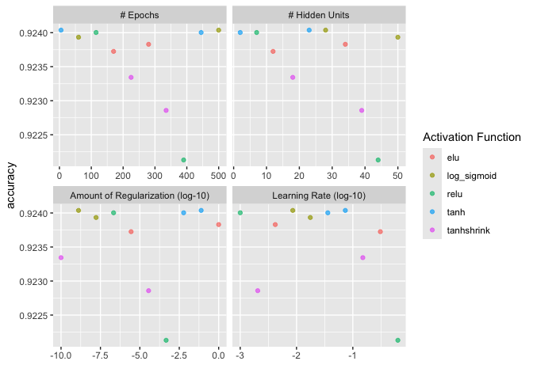

``` r
knitr::opts_chunk$set(echo = TRUE)
library(tidyverse)
library(tidymodels)
library(sjPlot)
library(finalfit)
library(knitr)
library(gtsummary)
library(mlbench)
library(vip)
library(microbenchmark)
library(AppliedPredictiveModeling)
library(brulee)
library(neuralnet)
```

Install Torch

``` r
torch::install_torch()
library(torch)
```


## Research question and data

We are using an imputed (ie. no missing data) version of the CanPath student dataset [https://canpath.ca/student-dataset/](https://canpath.ca/student-dataset/). The nice thing about this dataset is that it's pretty big in terms of sample size, has lots of variables, and we can use it for free. 

Our research question is:  

- **Can we develop a model that will predict type 2 diabetes**

### Reading in data

Here are reading in data and getting organized to run our models. 


``` r
data <- read_csv("canpath_imputed.csv")
```

```
## Rows: 41187 Columns: 93
## ── Column specification ────────────────────────────────────────────────────────
## Delimiter: ","
## chr  (1): ID
## dbl (92): ADM_STUDY_ID, SDC_GENDER, SDC_AGE_CALC, SDC_MARITAL_STATUS, SDC_ED...
## 
## ℹ Use `spec()` to retrieve the full column specification for this data.
## ℹ Specify the column types or set `show_col_types = FALSE` to quiet this message.
```

``` r
data <- data %>% mutate_at(3, factor)
data <- data %>% mutate_at(5:6, factor)
data <- data %>% mutate_at(8:9, factor)
data <- data %>% mutate_at(12:12, factor)
data <- data %>% mutate_at(15:81, factor)
data <- data %>% mutate_at(83:93, factor)

table(data$DIS_DIAB_EVER)
```

```
## 
##     0     1     2 
## 36714  3114  1359
```

``` r
data <- data %>%
	mutate(diabetes = case_when(
		DIS_DIAB_EVER == 0 ~ 0,
		DIS_DIAB_EVER == 1 ~ 1,
		DIS_DIAB_EVER == 2 ~ 0)) %>%
		mutate(diabetes = as.factor(diabetes))

table(data$DIS_DIAB_EVER, data$diabetes)
```

```
##    
##         0     1
##   0 36714     0
##   1     0  3114
##   2  1359     0
```

``` r
data$DIS_DIAB_EVER <- NULL
```


``` r
data_continuous <- select(data, diabetes, 
                            PSE_ADULT_WRK_DURATION, 
                            PM_BMI_SR, 
                            PA_TOTAL_SHORT, 
                            SDC_HOUSEHOLD_CHILDREN_NB, 
                            SDC_HOUSEHOLD_ADULTS_NB, 
                            SDC_EDU_LEVEL_AGE, 
                            SDC_AGE_CALC, 
                            SDC_GENDER)
```

# Artificial Neural Networks

### Creating training and testing data


``` r
set.seed(10)

#### Cross Validation Split
cv_split <- initial_validation_split(data_continuous, 
                            strata = diabetes, 
                            prop = c(0.70, 0.20))

# Create data frames for the two sets:
train_data <- training(cv_split)
table(train_data$diabetes)
```

```
## 
##     0     1 
## 26640  2190
```

``` r
test_data  <- testing(cv_split)
table(test_data$diabetes)
```

```
## 
##    0    1 
## 3813  306
```

### V folds


``` r
folds <- vfold_cv(training(cv_split), v = 3, strata = diabetes)
```

## Recipe


``` r
diabetes_recipe <- 
  recipe(diabetes ~ ., data = train_data) %>%
  step_dummy(all_nominal_predictors()) %>%
  step_zv(all_predictors(), -all_outcomes()) %>%
  step_normalize(all_numeric_predictors())
```


### Model 

The `mlp` argument in Tidymodels is for a Multi-Layer Perceptron (basically another name for the artificial neural network). There are 5 different engines that can be used with the `mlp` argument 

* nnet (default)
* brulee
* brulee_two_layer
* h2o (requires parsnip extension)
* keras

The default `nnet` engine is pretty basic and only does a feed-forward neural networks with a single hidden layer (for multinomial log-linear models). Arguably [keras](https://rstudio.github.io/cheatsheets/html/keras.html) is the most powerful of these engines and is supported in lots of different languages. Keras is similar to Tidymodels in that it has a set of specific verbs that are used to develop the model. 

* Define
* Compile
* Fit
* Evaluate
* Predict 

For the sake of consistency we are going to use the `brulee` engine because we do a single a two layer model without having to learn the new `keras` specific workflow. The book [Deep Learning with R](https://www.manning.com/books/deep-learning-with-r-second-edition) provides a comprehensive guide to `keras` and `tensorflow` which you will need to learn if you are working with really big data. 

#### Hyperparameters

As discussed in the lecture. The hyperparameters for ANN's are were things go from manageable to complex very quickly. Our previous models had at most 3 hyperparameters and now we are dealing with 6 hyperparameters. The defaults of these hyperparameters will change depending on the engine used. The defaults for `brulee` are [available here](https://brulee.tidymodels.org/reference/brulee_mlp.html).

* __hidden_units__: An integer for the number of units in the hidden model.
* __penalty__: A non-negative numeric value for the amount of weight decay.
* __dropout__: A number between 0 (inclusive) and 1 denoting the proportion of model parameters randomly set to zero during model training.
* __epochs__: An integer for the number of training iterations.
* __activation__: A single character string denoting the type of relationship between the original predictors and the hidden unit layer. The activation function between the hidden and output layers is automatically set to either "linear" or "softmax" depending on the type of outcome. 
* __learn_rate__: A number for the rate at which the boosting algorithm adapts from iteration-to-iteration (specific engines only). This is sometimes referred to as the shrinkage parameter.

## Very basic model 

One of the downsides of Tidymodels is that you often lose the ability to plot models because tidymodels doesn't import those plotting functions very well. Let's train a very basic model with the [neuralnet](https://cran.r-project.org/web/packages/neuralnet/index.html) package so we can show what a model might look like. 

##### Run during class

```{}
## I've removed all categorical variables because they need to be dummy coded and I'm lazy

basic_ann <- neuralnet(diabetes ~ PSE_ADULT_WRK_DURATION + 
                            PM_BMI_SR + 
                            PA_TOTAL_SHORT +
                            SDC_HOUSEHOLD_CHILDREN_NB + 
                            SDC_HOUSEHOLD_ADULTS_NB + 
                            SDC_EDU_LEVEL_AGE,
                data = train_data,
                hidden = c(3, 1), ## Here we specify 3 hidden nodes and 1 layers
                linear.output = FALSE
                )

plot(basic_ann, rep = "best")
```

## Tidymodels implementation

### Single layer neural network


``` r
set.seed(123)

mlp_model <- mlp(epochs = tune(), 
                 hidden_units = tune(), 
                 penalty = tune(), 
                 learn_rate = tune(), 
                 activation = tune()) %>% 
                  set_engine("brulee", validation = 0) %>% 
                  set_mode("classification")
```

### Workflow


``` r
### Takes around 20minutes to run

mlp_workflow <- 
  workflow() %>% 
  add_model(mlp_model) %>% 
  add_recipe(diabetes_recipe) %>% 
    tune_grid(resamples = folds,
                control = control_grid(save_pred = TRUE, 
                verbose = TRUE)) ## Edit for running live
```

```
## i Fold1: preprocessor 1/1
```

```
## i Fold1: preprocessor 1/1, model 1/10
```

```
## i Fold1: preprocessor 1/1, model 1/10 (predictions)
```

```
## i Fold1: preprocessor 1/1, model 2/10
```

```
## i Fold1: preprocessor 1/1, model 2/10 (predictions)
```

```
## i Fold1: preprocessor 1/1, model 3/10
```

```
## i Fold1: preprocessor 1/1, model 3/10 (predictions)
```

```
## i Fold1: preprocessor 1/1, model 4/10
```

```
## i Fold1: preprocessor 1/1, model 4/10 (predictions)
```

```
## i Fold1: preprocessor 1/1, model 5/10
```

```
## i Fold1: preprocessor 1/1, model 5/10 (predictions)
```

```
## i Fold1: preprocessor 1/1, model 6/10
```

```
## i Fold1: preprocessor 1/1, model 6/10 (predictions)
```

```
## i Fold1: preprocessor 1/1, model 7/10
```

```
## i Fold1: preprocessor 1/1, model 7/10 (predictions)
```

```
## i Fold1: preprocessor 1/1, model 8/10
```

```
## i Fold1: preprocessor 1/1, model 8/10 (predictions)
```

```
## i Fold1: preprocessor 1/1, model 9/10
```

```
## i Fold1: preprocessor 1/1, model 9/10 (predictions)
```

```
## i Fold1: preprocessor 1/1, model 10/10
```

```
## i Fold1: preprocessor 1/1, model 10/10 (predictions)
```

```
## i Fold2: preprocessor 1/1
```

```
## i Fold2: preprocessor 1/1, model 1/10
```

```
## i Fold2: preprocessor 1/1, model 1/10 (predictions)
```

```
## i Fold2: preprocessor 1/1, model 2/10
```

```
## i Fold2: preprocessor 1/1, model 2/10 (predictions)
```

```
## i Fold2: preprocessor 1/1, model 3/10
```

```
## i Fold2: preprocessor 1/1, model 3/10 (predictions)
```

```
## i Fold2: preprocessor 1/1, model 4/10
```

```
## i Fold2: preprocessor 1/1, model 4/10 (predictions)
```

```
## i Fold2: preprocessor 1/1, model 5/10
```

```
## i Fold2: preprocessor 1/1, model 5/10 (predictions)
```

```
## i Fold2: preprocessor 1/1, model 6/10
```

```
## i Fold2: preprocessor 1/1, model 6/10 (predictions)
```

```
## i Fold2: preprocessor 1/1, model 7/10
```

```
## i Fold2: preprocessor 1/1, model 7/10 (predictions)
```

```
## i Fold2: preprocessor 1/1, model 8/10
```

```
## i Fold2: preprocessor 1/1, model 8/10 (predictions)
```

```
## i Fold2: preprocessor 1/1, model 9/10
```

```
## i Fold2: preprocessor 1/1, model 9/10 (predictions)
```

```
## i Fold2: preprocessor 1/1, model 10/10
```

```
## i Fold2: preprocessor 1/1, model 10/10 (predictions)
```

```
## i Fold3: preprocessor 1/1
```

```
## i Fold3: preprocessor 1/1, model 1/10
```

```
## i Fold3: preprocessor 1/1, model 1/10 (predictions)
```

```
## i Fold3: preprocessor 1/1, model 2/10
```

```
## i Fold3: preprocessor 1/1, model 2/10 (predictions)
```

```
## i Fold3: preprocessor 1/1, model 3/10
```

```
## i Fold3: preprocessor 1/1, model 3/10 (predictions)
```

```
## i Fold3: preprocessor 1/1, model 4/10
```

```
## i Fold3: preprocessor 1/1, model 4/10 (predictions)
```

```
## i Fold3: preprocessor 1/1, model 5/10
```

```
## i Fold3: preprocessor 1/1, model 5/10 (predictions)
```

```
## i Fold3: preprocessor 1/1, model 6/10
```

```
## i Fold3: preprocessor 1/1, model 6/10 (predictions)
```

```
## i Fold3: preprocessor 1/1, model 7/10
```

```
## i Fold3: preprocessor 1/1, model 7/10 (predictions)
```

```
## i Fold3: preprocessor 1/1, model 8/10
```

```
## i Fold3: preprocessor 1/1, model 8/10 (predictions)
```

```
## i Fold3: preprocessor 1/1, model 9/10
```

```
## i Fold3: preprocessor 1/1, model 9/10 (predictions)
```

```
## i Fold3: preprocessor 1/1, model 10/10
```

```
## i Fold3: preprocessor 1/1, model 10/10 (predictions)
```

### Workflow results


``` r
metrics_tune <- collect_metrics(mlp_workflow)

show_best(mlp_workflow, metric='accuracy', n=5)  # only show the results for the best 5 models
```

```
## # A tibble: 5 × 11
##   hidden_units     penalty epochs activation learn_rate .metric .estimator  mean
##          <int>       <dbl>  <int> <chr>           <dbl> <chr>   <chr>      <dbl>
## 1           23     7.74e-2      5 tanh          0.0736  accura… binary     0.924
## 2           28     1.29e-9    500 log_sigmo…    0.00858 accura… binary     0.924
## 3            2     5.99e-3    445 tanh          0.0359  accura… binary     0.924
## 4            7     2.15e-7    115 relu          0.001   accura… binary     0.924
## 5           50     1.67e-8     60 log_sigmo…    0.0176  accura… binary     0.924
## # ℹ 3 more variables: n <int>, std_err <dbl>, .config <chr>
```

``` r
plot(autoplot(mlp_workflow, metric = 'accuracy'))
```

<!-- -->

### Final model - Test data


``` r
mlp_best <- 
  mlp_workflow %>% 
  select_best(metric = "accuracy")

mlp_final_model <- finalize_model(
                          mlp_model,
                          mlp_best
                          )
mlp_final_model
```

```
## Single Layer Neural Network Model Specification (classification)
## 
## Main Arguments:
##   hidden_units = 23
##   penalty = 0.0774263682681128
##   epochs = 5
##   activation = tanh
##   learn_rate = 0.0735642254459641
## 
## Engine-Specific Arguments:
##   validation = 0
## 
## Computational engine: brulee
```

``` r
final_mlp_workflow <- workflow() %>%
                      add_recipe(diabetes_recipe) %>%
                      add_model(mlp_final_model)

final_mlp_results <- final_mlp_workflow %>%
                    last_fit(cv_split)

mlp_results <- final_mlp_results %>% collect_metrics()
```

## Final Results


``` r
kable(mlp_results)
```


|.metric     |.estimator | .estimate|.config         |
|:-----------|:----------|---------:|:---------------|
|accuracy    |binary     | 0.9257101|pre0_mod0_post0 |
|roc_auc     |binary     | 0.6704849|pre0_mod0_post0 |
|brier_class |binary     | 0.0672935|pre0_mod0_post0 |

## Variable Importance

No variable importance? Any idea why? 

### Two layer neural network


``` r
set.seed(123)

mlp_model_2l <- mlp(epochs = tune(), 
                    hidden_units = tune(), 
                    penalty = tune(), 
                    learn_rate = tune(), 
                    activation = tune()) %>% 
                 set_engine("brulee_two_layer",
                   hidden_units_2 = tune(),
                   activation_2 = tune()) %>% 
                 set_mode("classification")
```

### Workflow


``` r
### Takes around 5minutes to run

mlp_workflow_2l <- 
  workflow() %>% 
  add_model(mlp_model_2l) %>% 
  add_recipe(diabetes_recipe) %>% 
    tune_grid(resamples = folds,
                control = control_grid(save_pred = TRUE, 
                verbose = TRUE)) ## Edit for running live
```

```
## i Fold1: preprocessor 1/1
```

```
## i Fold1: preprocessor 1/1, model 1/10
```

```
## i Fold1: preprocessor 1/1, model 1/10 (predictions)
```

```
## i Fold1: preprocessor 1/1, model 2/10
```

```
## i Fold1: preprocessor 1/1, model 2/10 (predictions)
```

```
## i Fold1: preprocessor 1/1, model 3/10
```

```
## i Fold1: preprocessor 1/1, model 3/10 (predictions)
```

```
## i Fold1: preprocessor 1/1, model 4/10
```

```
## i Fold1: preprocessor 1/1, model 4/10 (predictions)
```

```
## i Fold1: preprocessor 1/1, model 5/10
```

```
## i Fold1: preprocessor 1/1, model 5/10 (predictions)
```

```
## i Fold1: preprocessor 1/1, model 6/10
```

```
## i Fold1: preprocessor 1/1, model 6/10 (predictions)
```

```
## i Fold1: preprocessor 1/1, model 7/10
```

```
## i Fold1: preprocessor 1/1, model 7/10 (predictions)
```

```
## i Fold1: preprocessor 1/1, model 8/10
```

```
## i Fold1: preprocessor 1/1, model 8/10 (predictions)
```

```
## i Fold1: preprocessor 1/1, model 9/10
```

```
## i Fold1: preprocessor 1/1, model 9/10 (predictions)
```

```
## i Fold1: preprocessor 1/1, model 10/10
```

```
## i Fold1: preprocessor 1/1, model 10/10 (predictions)
```

```
## i Fold2: preprocessor 1/1
```

```
## i Fold2: preprocessor 1/1, model 1/10
```

```
## i Fold2: preprocessor 1/1, model 1/10 (predictions)
```

```
## i Fold2: preprocessor 1/1, model 2/10
```

```
## → A | warning: Early stopping occurred at epoch 54 due to numerical overflow of the loss
##                function.
```

```
## i Fold2: preprocessor 1/1, model 2/10 (predictions)
```

```
## i Fold2: preprocessor 1/1, model 3/10
```

```
## i Fold2: preprocessor 1/1, model 3/10 (predictions)
```

```
## i Fold2: preprocessor 1/1, model 4/10
```

```
## i Fold2: preprocessor 1/1, model 4/10 (predictions)
```

```
## i Fold2: preprocessor 1/1, model 5/10
```

```
## i Fold2: preprocessor 1/1, model 5/10 (predictions)
```

```
## i Fold2: preprocessor 1/1, model 6/10
```

```
## i Fold2: preprocessor 1/1, model 6/10 (predictions)
```

```
## i Fold2: preprocessor 1/1, model 7/10
```

```
## i Fold2: preprocessor 1/1, model 7/10 (predictions)
```

```
## i Fold2: preprocessor 1/1, model 8/10
```

```
## i Fold2: preprocessor 1/1, model 8/10 (predictions)
```

```
## i Fold2: preprocessor 1/1, model 9/10
```

```
## i Fold2: preprocessor 1/1, model 9/10 (predictions)
```

```
## i Fold2: preprocessor 1/1, model 10/10
```

```
## i Fold2: preprocessor 1/1, model 10/10 (predictions)
```

```
## i Fold3: preprocessor 1/1
```

```
## i Fold3: preprocessor 1/1, model 1/10
```

```
## i Fold3: preprocessor 1/1, model 1/10 (predictions)
```

```
## i Fold3: preprocessor 1/1, model 2/10
```

```
## i Fold3: preprocessor 1/1, model 2/10 (predictions)
```

```
## i Fold3: preprocessor 1/1, model 3/10
```

```
## i Fold3: preprocessor 1/1, model 3/10 (predictions)
```

```
## i Fold3: preprocessor 1/1, model 4/10
```

```
## i Fold3: preprocessor 1/1, model 4/10 (predictions)
```

```
## i Fold3: preprocessor 1/1, model 5/10
```

```
## i Fold3: preprocessor 1/1, model 5/10 (predictions)
```

```
## i Fold3: preprocessor 1/1, model 6/10
```

```
## i Fold3: preprocessor 1/1, model 6/10 (predictions)
```

```
## i Fold3: preprocessor 1/1, model 7/10
```

```
## i Fold3: preprocessor 1/1, model 7/10 (predictions)
```

```
## i Fold3: preprocessor 1/1, model 8/10
```

```
## i Fold3: preprocessor 1/1, model 8/10 (predictions)
```

```
## i Fold3: preprocessor 1/1, model 9/10
```

```
## i Fold3: preprocessor 1/1, model 9/10 (predictions)
```

```
## i Fold3: preprocessor 1/1, model 10/10
```

```
## i Fold3: preprocessor 1/1, model 10/10 (predictions)
```

### Workflow results


``` r
metrics_tune_2l <- collect_metrics(mlp_workflow_2l)

show_best(mlp_workflow_2l, metric='accuracy', n=5)  # only show the results for the best 5 models
```

```
## # A tibble: 5 × 13
##   hidden_units  penalty epochs activation learn_rate hidden_units_2 activation_2
##          <int>    <dbl>  <int> <chr>           <dbl>          <int> <chr>       
## 1            2 1   e+ 0    280 log_sigmo…    0.151               34 tanh        
## 2           12 1   e-10    445 tanh          0.308               23 relu        
## 3           18 3.59e- 5    170 elu           0.00419             39 elu         
## 4           28 1.29e- 9    115 tanh          0.00205             44 tanhshrink  
## 5           44 7.74e- 2    225 relu          0.00858              7 tanhshrink  
## # ℹ 6 more variables: .metric <chr>, .estimator <chr>, mean <dbl>, n <int>,
## #   std_err <dbl>, .config <chr>
```

``` r
#plot(autoplot(mlp_workflow_2l, metric = 'accuracy'))
```

### Final model - Test data


``` r
mlp_best_2l <- 
  mlp_workflow_2l %>% 
  select_best(metric = "accuracy")

mlp_final_model_2l <- finalize_model(
                          mlp_model_2l,
                          mlp_best_2l
                          )
mlp_final_model_2l
```

```
## Single Layer Neural Network Model Specification (classification)
## 
## Main Arguments:
##   hidden_units = 2
##   penalty = 1
##   epochs = 280
##   activation = log_sigmoid
##   learn_rate = 0.150583635427984
## 
## Engine-Specific Arguments:
##   hidden_units_2 = 34
##   activation_2 = tanh
## 
## Computational engine: brulee_two_layer
```

``` r
final_mlp_workflow_2l <- workflow() %>%
                      add_recipe(diabetes_recipe) %>%
                      add_model(mlp_final_model_2l)

final_mlp_results_2l <- final_mlp_workflow_2l %>%
                        last_fit(cv_split)

mlp_results_2l <- final_mlp_results_2l %>% collect_metrics()
```

## Final Results


``` r
kable(mlp_results_2l)
```


|.metric     |.estimator | .estimate|.config         |
|:-----------|:----------|---------:|:---------------|
|accuracy    |binary     | 0.9257101|pre0_mod0_post0 |
|roc_auc     |binary     | 0.6678186|pre0_mod0_post0 |
|brier_class |binary     | 0.0672247|pre0_mod0_post0 |


# Resources

1. [https://www.tidymodels.org/learn/models/parsnip-nnet/](https://www.tidymodels.org/learn/models/parsnip-nnet/)
2. [https://www.datacamp.com/tutorial/neural-network-models-r](https://www.datacamp.com/tutorial/neural-network-models-r)

## Session Info


``` r
sessionInfo()
```

```
## R version 4.5.1 (2025-06-13)
## Platform: aarch64-apple-darwin20
## Running under: macOS Tahoe 26.3.1
## 
## Matrix products: default
## BLAS:   /Library/Frameworks/R.framework/Versions/4.5-arm64/Resources/lib/libRblas.0.dylib 
## LAPACK: /Library/Frameworks/R.framework/Versions/4.5-arm64/Resources/lib/libRlapack.dylib;  LAPACK version 3.12.1
## 
## locale:
## [1] en_US.UTF-8/en_US.UTF-8/en_US.UTF-8/C/en_US.UTF-8/en_US.UTF-8
## 
## time zone: America/Regina
## tzcode source: internal
## 
## attached base packages:
## [1] stats     graphics  grDevices utils     datasets  methods   base     
## 
## other attached packages:
##  [1] torch_0.16.3                    neuralnet_1.44.2               
##  [3] brulee_0.6.0                    AppliedPredictiveModeling_1.1-7
##  [5] microbenchmark_1.5.0            vip_0.4.1                      
##  [7] mlbench_2.1-6                   gtsummary_2.4.0                
##  [9] knitr_1.50                      finalfit_1.1.0                 
## [11] sjPlot_2.9.0                    yardstick_1.3.2                
## [13] workflowsets_1.1.1              workflows_1.3.0                
## [15] tune_2.0.1                      tailor_0.1.0                   
## [17] rsample_1.3.1                   recipes_1.3.1                  
## [19] parsnip_1.3.3                   modeldata_1.5.1                
## [21] infer_1.0.9                     dials_1.4.2                    
## [23] scales_1.4.0                    broom_1.0.10                   
## [25] tidymodels_1.4.1                lubridate_1.9.4                
## [27] forcats_1.0.1                   stringr_1.6.0                  
## [29] dplyr_1.1.4                     purrr_1.2.0                    
## [31] readr_2.1.6                     tidyr_1.3.1                    
## [33] tibble_3.3.0                    ggplot2_4.0.1                  
## [35] tidyverse_2.0.0                
## 
## loaded via a namespace (and not attached):
##   [1] RColorBrewer_1.1-3  rstudioapi_0.17.1   jsonlite_2.0.0     
##   [4] shape_1.4.6.1       magrittr_2.0.4      jomo_2.7-6         
##   [7] farver_2.1.2        nloptr_2.2.1        rmarkdown_2.30     
##  [10] vctrs_0.6.5         minqa_1.2.8         sparsevctrs_0.3.4  
##  [13] htmltools_0.5.8.1   plotrix_3.8-13      mitml_0.4-5        
##  [16] sass_0.4.10         parallelly_1.45.1   bslib_0.9.0        
##  [19] desc_1.4.3          plyr_1.8.9          CORElearn_1.57.3.1 
##  [22] cachem_1.1.0        lifecycle_1.0.4     iterators_1.0.14   
##  [25] pkgconfig_2.0.3     Matrix_1.7-3        R6_2.6.1           
##  [28] fastmap_1.2.0       rbibutils_2.4       future_1.68.0      
##  [31] digest_0.6.39       furrr_0.3.1         ps_1.9.1           
##  [34] ellipse_0.5.0       labeling_0.4.3      timechange_0.3.0   
##  [37] compiler_4.5.1      bit64_4.6.0-1       withr_3.0.2        
##  [40] S7_0.2.1            backports_1.5.0     pan_1.9            
##  [43] MASS_7.3-65         lava_1.8.2          tools_4.5.1        
##  [46] future.apply_1.20.0 nnet_7.3-20         glue_1.8.0         
##  [49] callr_3.7.6         nlme_3.1-168        grid_4.5.1         
##  [52] cluster_2.1.8.1     reshape2_1.4.5      generics_0.1.4     
##  [55] gtable_0.3.6        tzdb_0.5.0          class_7.3-23       
##  [58] data.table_1.17.8   hms_1.1.4           utf8_1.2.6         
##  [61] foreach_1.5.2       pillar_1.11.1       vroom_1.6.6        
##  [64] splines_4.5.1       lhs_1.2.0           lattice_0.22-7     
##  [67] sfd_0.1.0           survival_3.8-3      bit_4.6.0          
##  [70] tidyselect_1.2.1    coro_1.1.0          reformulas_0.4.2   
##  [73] safetensors_0.2.0   xfun_0.54           hardhat_1.4.2      
##  [76] timeDate_4051.111   stringi_1.8.7       DiceDesign_1.10    
##  [79] yaml_2.3.10         boot_1.3-31         evaluate_1.0.5     
##  [82] codetools_0.2-20    rpart.plot_3.1.3    cli_3.6.5          
##  [85] rpart_4.1.24        Rdpack_2.6.4        processx_3.8.6     
##  [88] jquerylib_0.1.4     Rcpp_1.1.0          globals_0.18.0     
##  [91] parallel_4.5.1      gower_1.0.2         GPfit_1.0-9        
##  [94] lme4_1.1-37         listenv_0.10.0      glmnet_4.1-10      
##  [97] ipred_0.9-15        prodlim_2025.04.28  crayon_1.5.3       
## [100] rlang_1.1.6         mice_3.18.0
```


