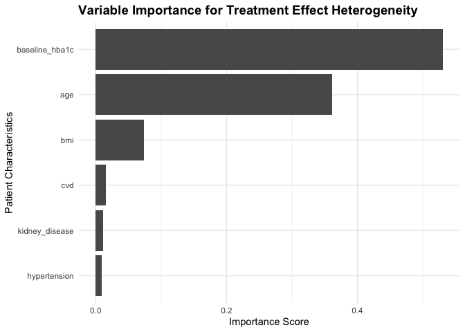
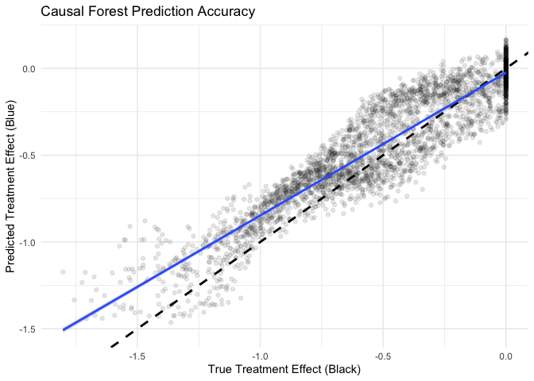
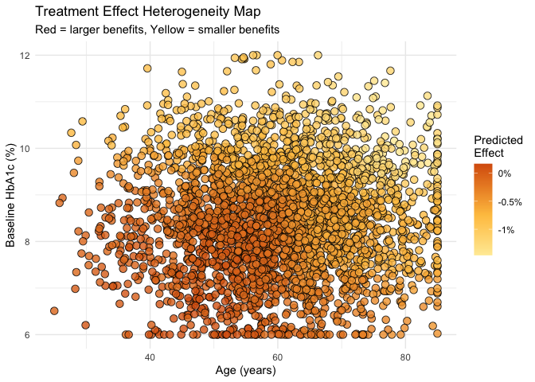

``` r
knitr::opts_chunk$set(echo = TRUE)
library(grf)
```

```
## Warning: package 'grf' was built under R version 4.5.2
```

``` r
library(tidyverse)
```

```
## Warning: package 'ggplot2' was built under R version 4.5.2
```

```
## Warning: package 'readr' was built under R version 4.5.2
```

```
## ── Attaching core tidyverse packages ──────────────────────── tidyverse 2.0.0 ──
## ✔ dplyr     1.1.4     ✔ readr     2.1.6
## ✔ forcats   1.0.1     ✔ stringr   1.6.0
## ✔ ggplot2   4.0.1     ✔ tibble    3.3.0
## ✔ lubridate 1.9.4     ✔ tidyr     1.3.1
## ✔ purrr     1.2.0     
## ── Conflicts ────────────────────────────────────────── tidyverse_conflicts() ──
## ✖ dplyr::filter() masks stats::filter()
## ✖ dplyr::lag()    masks stats::lag()
## ℹ Use the conflicted package (<http://conflicted.r-lib.org/>) to force all conflicts to become errors
```

``` r
library(reshape2)
```

```
## 
## Attaching package: 'reshape2'
## 
## The following object is masked from 'package:tidyr':
## 
##     smiths
```

``` r
library(reportRmd)
```

# Causal Forest

## Research question and data

Here we are going to generate data based on the example provided [here](https://kamran-afzali.github.io/Bookdown_Causality/causal-forests.html#precision-medicine-case-study-personalized-diabetes-treatment). Often for causal inference types of questions it's good to generate data because we can have known treatment effects and compare model performance to those known treatment effects. Without known treatment effects, it's hard to evaluated if the model is performing well... and causality is hard. 

Our analysis aims to develop personalized treatment recommendations by estimating conditional treatment effects as functions of age, BMI, baseline HbA1c levels, and comorbidity indicators including hypertension, cardiovascular disease, and kidney disease. The outcome is change in HbA1c levels after six months, where more negative values indicate better glycemic control.

### Generating synthetic data


``` r
data <- read_csv("causal_forest_data.csv")
```

```
## Rows: 3000 Columns: 9
## ── Column specification ────────────────────────────────────────────────────────
## Delimiter: ","
## dbl (9): age, bmi, baseline_hba1c, hypertension, cvd, kidney_disease, treatm...
## 
## ℹ Use `spec()` to retrieve the full column specification for this data.
## ℹ Specify the column types or set `show_col_types = FALSE` to quiet this message.
```

This is the code to generate the data. We will review this in class. 

```{}
# Set seed for reproducible results
set.seed(123)

# Simulate realistic patient population
n <- 3000

# Generate patient characteristics with realistic distributions
age <- pmax(25, pmin(85, rnorm(n, 60, 12)))  # Age 25-85, mean 60
bmi <- pmax(20, pmin(50, rnorm(n, 30, 6)))   # BMI 20-50, mean 30
baseline_hba1c <- pmax(6.0, pmin(12.0, rnorm(n, 8.5, 1.2)))  # HbA1c 6-12%, mean 8.5%

# Binary comorbidity indicators
hypertension <- rbinom(n, 1, 0.6)     # 60% prevalence
cvd <- rbinom(n, 1, 0.3)              # 30% prevalence  
kidney_disease <- rbinom(n, 1, 0.25)  # 25% prevalence

# Combine covariates into matrix
X <- cbind(age, bmi, baseline_hba1c, hypertension, cvd, kidney_disease)
colnames(X) <- c("age", "bmi", "baseline_hba1c", "hypertension", "cvd", "kidney_disease")

# Randomized treatment assignment
W <- rbinom(n, 1, 0.5)

# Generate heterogeneous treatment effects
# Younger patients and those with worse baseline control benefit more
true_tau <- -0.5 - 0.02 * (age - 60) - 0.3 * (baseline_hba1c - 8.5)
true_tau <- pmax(-2.5, pmin(0, true_tau))  # Constrain to realistic range

# Generate outcomes under potential outcomes framework
Y0 <- -0.3 + 0.01 * age + 0.02 * bmi + 0.1 * baseline_hba1c + 
      0.2 * hypertension + 0.15 * cvd + 0.25 * kidney_disease + rnorm(n, 0, 0.8)

Y1 <- Y0 + true_tau + rnorm(n, 0, 0.3)

# Observed outcomes
Y <- W * Y1 + (1 - W) * Y0

# Create dataset
data <- data.frame(X, treatment = W, Y = Y, true_tau = true_tau)

write_csv(data, "causal_forest_data.csv")
```

## Descriptive statistics


``` r
glimpse(data)
```

```
## Rows: 3,000
## Columns: 9
## $ age            <dbl> 53.27429, 57.23787, 78.70450, 60.84610, 61.55145, 80.58…
## $ bmi            <dbl> 29.09816, 28.03346, 21.31101, 25.81629, 45.59094, 29.77…
## $ baseline_hba1c <dbl> 7.660926, 9.695742, 7.668706, 8.375820, 9.224639, 7.770…
## $ hypertension   <dbl> 0, 1, 1, 1, 1, 1, 1, 0, 0, 1, 1, 1, 0, 1, 1, 1, 0, 0, 0…
## $ cvd            <dbl> 1, 0, 0, 0, 1, 1, 0, 1, 0, 1, 1, 0, 1, 0, 0, 1, 0, 0, 1…
## $ kidney_disease <dbl> 0, 0, 1, 0, 0, 0, 0, 0, 0, 0, 1, 0, 0, 1, 0, 1, 0, 0, 0…
## $ treatment      <dbl> 0, 0, 0, 0, 0, 1, 1, 0, 1, 0, 0, 0, 0, 1, 0, 1, 1, 1, 0…
## $ Y              <dbl> 0.6477196, 1.5391202, 1.4413004, 2.6405116, 2.9951139, …
## $ true_tau       <dbl> -0.1137637, -0.8034800, -0.6247017, -0.4796681, -0.7484…
```

``` r
rm_covsum(data=data, maincov = 'treatment',
covs=c('Y','true_tau', 'baseline_hba1c', 'age'), show.tests=FALSE, pvalue = FALSE)
```

<table class="table table" style="color: black; margin-left: auto; margin-right: auto; color: black; margin-left: auto; margin-right: auto;">
 <thead>
  <tr>
   <th style="text-align:left;position: sticky; top:0; background-color: #FFFFFF;">  </th>
   <th style="text-align:right;position: sticky; top:0; background-color: #FFFFFF;"> Full Sample (n=3000) </th>
   <th style="text-align:right;position: sticky; top:0; background-color: #FFFFFF;"> 0 (n=1527) </th>
   <th style="text-align:right;position: sticky; top:0; background-color: #FFFFFF;"> 1 (n=1473) </th>
  </tr>
 </thead>
<tbody>
  <tr>
   <td style="text-align:left;"> <span style="font-weight: bold;">Y</span> </td>
   <td style="text-align:right;">  </td>
   <td style="text-align:right;">  </td>
   <td style="text-align:right;">  </td>
  </tr>
  <tr>
   <td style="text-align:left;padding-left: 2em;" indentlevel="1"> Mean (sd) </td>
   <td style="text-align:right;"> 1.7 (0.9) </td>
   <td style="text-align:right;"> 1.9 (0.9) </td>
   <td style="text-align:right;"> 1.5 (0.9) </td>
  </tr>
  <tr>
   <td style="text-align:left;padding-left: 2em;" indentlevel="1"> Median (Min,Max) </td>
   <td style="text-align:right;"> 1.7 (-1.5, 5.4) </td>
   <td style="text-align:right;"> 1.9 (-1.0, 5.4) </td>
   <td style="text-align:right;"> 1.4 (-1.5, 4.6) </td>
  </tr>
  <tr>
   <td style="text-align:left;"> <span style="font-weight: bold;">true tau</span> </td>
   <td style="text-align:right;">  </td>
   <td style="text-align:right;">  </td>
   <td style="text-align:right;">  </td>
  </tr>
  <tr>
   <td style="text-align:left;padding-left: 2em;" indentlevel="1"> Mean (sd) </td>
   <td style="text-align:right;"> -0.5 (0.4) </td>
   <td style="text-align:right;"> -0.5 (0.4) </td>
   <td style="text-align:right;"> -0.5 (0.4) </td>
  </tr>
  <tr>
   <td style="text-align:left;padding-left: 2em;" indentlevel="1"> Median (Min,Max) </td>
   <td style="text-align:right;"> -0.5 (-1.8, 0.0) </td>
   <td style="text-align:right;"> -0.5 (-1.7, 0.0) </td>
   <td style="text-align:right;"> -0.5 (-1.8, 0.0) </td>
  </tr>
  <tr>
   <td style="text-align:left;"> <span style="font-weight: bold;">baseline hba1c</span> </td>
   <td style="text-align:right;">  </td>
   <td style="text-align:right;">  </td>
   <td style="text-align:right;">  </td>
  </tr>
  <tr>
   <td style="text-align:left;padding-left: 2em;" indentlevel="1"> Mean (sd) </td>
   <td style="text-align:right;"> 8.5 (1.2) </td>
   <td style="text-align:right;"> 8.5 (1.2) </td>
   <td style="text-align:right;"> 8.5 (1.2) </td>
  </tr>
  <tr>
   <td style="text-align:left;padding-left: 2em;" indentlevel="1"> Median (Min,Max) </td>
   <td style="text-align:right;"> 8.5 (6.0, 12.0) </td>
   <td style="text-align:right;"> 8.5 (6.0, 12.0) </td>
   <td style="text-align:right;"> 8.5 (6.0, 12.0) </td>
  </tr>
  <tr>
   <td style="text-align:left;"> <span style="font-weight: bold;">age</span> </td>
   <td style="text-align:right;">  </td>
   <td style="text-align:right;">  </td>
   <td style="text-align:right;">  </td>
  </tr>
  <tr>
   <td style="text-align:left;padding-left: 2em;" indentlevel="1"> Mean (sd) </td>
   <td style="text-align:right;"> 60.1 (11.7) </td>
   <td style="text-align:right;"> 60.1 (11.8) </td>
   <td style="text-align:right;"> 60.0 (11.6) </td>
  </tr>
  <tr>
   <td style="text-align:left;padding-left: 2em;" indentlevel="1"> Median (Min,Max) </td>
   <td style="text-align:right;"> 60 (25, 85) </td>
   <td style="text-align:right;"> 60.1 (25.8, 85.0) </td>
   <td style="text-align:right;"> 59.8 (25.0, 85.0) </td>
  </tr>
</tbody>
</table>

## Causal Forest

Fitting the causal forest model. Here we are running with non-tuned hyper-parameters. Tuning later. Reminder that we are outside of the world of tidymodels. 


``` r
Y <- data$Y
treatment <- data$treatment
X <- cbind(data$age, data$bmi, data$baseline_hba1c, data$hypertension, data$cvd, data$kidney_disease) ## Covariate Matrix


cause_forest_m1 <- causal_forest(X, Y, treatment,
                    num.trees = 2000,        # Sufficient for stable estimates
                    honesty = TRUE,          # Enable honest inference
                    honesty.fraction = 0.5,  # Split sample equally
                    ci.group.size = 2)       # Individual confidence intervals

# Generate predictions and uncertainty estimates
tau_hat <- predict(cause_forest_m1)$predictions
tau_se <- sqrt(predict(cause_forest_m1, estimate.variance = TRUE)$variance.estimates)

# Construct confidence intervals
tau_lower <- tau_hat - 1.96 * tau_se
tau_upper <- tau_hat + 1.96 * tau_se
```

### Variable importance


``` r
var_importance <- variable_importance(cause_forest_m1)
colnames(X) <- c("age", "bmi", "baseline_hba1c", "hypertension", "cvd", "kidney_disease")

importance_df <- data.frame(
  Variable = colnames(X),
  Importance = var_importance
) %>%
  arrange(desc(Importance))

importance_df
```

```
##         Variable Importance
## 1 baseline_hba1c 0.53000964
## 2            age 0.36162176
## 3            bmi 0.07341899
## 4            cvd 0.01506079
## 5 kidney_disease 0.01123386
## 6   hypertension 0.00865497
```

``` r
# Visualize importance
ggplot(importance_df, aes(x = reorder(Variable, Importance), y = Importance)) +
  geom_col() +
  coord_flip() +
  labs(title = "Variable Importance for Treatment Effect Heterogeneity",
       x = "Patient Characteristics", 
       y = "Importance Score") +
  theme_minimal() +
  theme(plot.title = element_text(size = 14, face = "bold"))
```

<!-- -->

### Treatment effects


``` r
# Test average treatment effect
ate <- average_treatment_effect(cause_forest_m1)
ate
```

```
##    estimate     std.err 
## -0.45796582  0.03172783
```

``` r
cat("95% CI: [", round(ate["estimate"] - 1.96 * ate["std.err"], 3),
    ",", round(ate["estimate"] + 1.96 * ate["std.err"], 3), "]\n")
```

```
## 95% CI: [ -0.52 , -0.396 ]
```

``` r
# Test for significant heterogeneity
het_test <- test_calibration(cause_forest_m1)
het_test
```

```
## 
## Best linear fit using forest predictions (on held-out data)
## as well as the mean forest prediction as regressors, along
## with one-sided heteroskedasticity-robust (HC3) SEs:
## 
##                                Estimate Std. Error t value    Pr(>t)    
## mean.forest.prediction         0.997005   0.066656  14.957 < 2.2e-16 ***
## differential.forest.prediction 1.072028   0.090475  11.849 < 2.2e-16 ***
## ---
## Signif. codes:  0 '***' 0.001 '**' 0.01 '*' 0.05 '.' 0.1 ' ' 1
```

The average treatment effect estimate provides the population-level summary that traditional clinical trials report, while the heterogeneity test formally evaluates whether personalized treatment rules offer advantages over treating all patients identically. A significant test result provides statistical evidence that the observed variation in treatment effects represents true heterogeneity rather than random noise.

## Visualizing heterogeneity


``` r
# Prepare data for visualization
plot_data <- data.frame(
  age = data$age,
  baseline_hba1c = data$baseline_hba1c,
  bmi = data$bmi,
  predicted_effect = tau_hat,
  true_effect = data$true_tau,
  prediction_se = tau_se,
  treatment = factor(treatment, labels = c("Control", "Treatment"))
)

# Validate predictions against truth
ggplot(plot_data, aes(x = true_effect, y = predicted_effect)) +
  geom_point(alpha = 0.1) +
  geom_abline(intercept = 0, slope = 1, linetype = "dashed", size = 1) +
  geom_smooth(method = "lm", se = TRUE, alpha = 0.3) +
  labs(title = "Causal Forest Prediction Accuracy",
       x = "True Treatment Effect (Black)", 
       y = "Predicted Treatment Effect (Blue)") +
  theme_minimal() 
```

```
## Warning: Using `size` aesthetic for lines was deprecated in ggplot2 3.4.0.
## ℹ Please use `linewidth` instead.
## This warning is displayed once every 8 hours.
## Call `lifecycle::last_lifecycle_warnings()` to see where this warning was
## generated.
```

```
## `geom_smooth()` using formula = 'y ~ x'
```

<!-- -->


``` r
# Create treatment effect heatmap
ggplot(plot_data, aes(x = age, y = baseline_hba1c)) +
  geom_point(aes(fill = predicted_effect), shape = 21, size = 3, alpha = 0.8) +
  scale_fill_gradient2(low = "#fff7bc", mid = "#fec44f", high = "#d95f0e",
                       midpoint = -0.75,
                       name = "Predicted\nEffect",
                       labels = function(x) paste0(x, "%")) +
  labs(title = "Treatment Effect Heterogeneity Map",
       subtitle = "Red = larger benefits, Yellow = smaller benefits",
       x = "Age (years)", 
       y = "Baseline HbA1c (%)") +
  theme_minimal() 
```

<!-- -->

These visualizations demonstrate the causal forest’s ability to recover complex treatment effect patterns. The prediction accuracy plot shows strong agreement between true and predicted effects, validating the algorithm’s performance. The heterogeneity map reveals clinically interpretable patterns where younger patients with higher baseline HbA1c (shown in red) experience the largest treatment benefits, while older patients with better initial control (shown in yellow) show minimal response.

## Causal Forest with tuning

Fitting the causal forest model. 


``` r
Y <- data$Y
treatment <- data$treatment
X <- cbind(data$age, data$bmi, data$baseline_hba1c, data$hypertension, data$cvd, data$kidney_disease) ## Covariate Matrix


cause_forest_m2 <- causal_forest(X, Y, treatment,
                    #num.trees = 2000,        # Sufficient for stable estimates
                    honesty = TRUE,          # Enable honest inference
                    #honesty.fraction = 0.5,  # Split sample equally
                    #ci.group.size = 2,       # Individual confidence intervals
                    tune.parameters = "all")       

# Generate predictions and uncertainty estimates
tau_hat <- predict(cause_forest_m2)$predictions
tau_se <- sqrt(predict(cause_forest_m2, estimate.variance = TRUE)$variance.estimates)

# Construct confidence intervals
tau_lower <- tau_hat - 1.96 * tau_se
tau_upper <- tau_hat + 1.96 * tau_se
```

### Treatment effects - tuned


``` r
# Test average treatment effect
ate_tuned <- average_treatment_effect(cause_forest_m2)
ate_tuned
```

```
##    estimate     std.err 
## -0.45832861  0.03172404
```

``` r
cat("95% CI: [", round(ate_tuned["estimate"] - 1.96 * ate_tuned["std.err"], 3),
    ",", round(ate_tuned["estimate"] + 1.96 * ate_tuned["std.err"], 3), "]\n")
```

```
## 95% CI: [ -0.521 , -0.396 ]
```

``` r
# Test for significant heterogeneity
het_test <- test_calibration(cause_forest_m2)
het_test
```

```
## 
## Best linear fit using forest predictions (on held-out data)
## as well as the mean forest prediction as regressors, along
## with one-sided heteroskedasticity-robust (HC3) SEs:
## 
##                                Estimate Std. Error t value    Pr(>t)    
## mean.forest.prediction         0.998813   0.066768  14.960 < 2.2e-16 ***
## differential.forest.prediction 1.051663   0.088171  11.928 < 2.2e-16 ***
## ---
## Signif. codes:  0 '***' 0.001 '**' 0.01 '*' 0.05 '.' 0.1 ' ' 1
```

#### Comparing not tuned and tuned


``` r
ate
```

```
##    estimate     std.err 
## -0.45796582  0.03172783
```

``` r
ate_tuned
```

```
##    estimate     std.err 
## -0.45832861  0.03172404
```


## Session Info


``` r
sessionInfo()
```

```
## R version 4.5.1 (2025-06-13)
## Platform: aarch64-apple-darwin20
## Running under: macOS Tahoe 26.3.1
## 
## Matrix products: default
## BLAS:   /Library/Frameworks/R.framework/Versions/4.5-arm64/Resources/lib/libRblas.0.dylib 
## LAPACK: /Library/Frameworks/R.framework/Versions/4.5-arm64/Resources/lib/libRlapack.dylib;  LAPACK version 3.12.1
## 
## locale:
## [1] en_US.UTF-8/en_US.UTF-8/en_US.UTF-8/C/en_US.UTF-8/en_US.UTF-8
## 
## time zone: America/Regina
## tzcode source: internal
## 
## attached base packages:
## [1] stats     graphics  grDevices utils     datasets  methods   base     
## 
## other attached packages:
##  [1] reportRmd_0.1.1 reshape2_1.4.5  lubridate_1.9.4 forcats_1.0.1  
##  [5] stringr_1.6.0   dplyr_1.1.4     purrr_1.2.0     readr_2.1.6    
##  [9] tidyr_1.3.1     tibble_3.3.0    ggplot2_4.0.1   tidyverse_2.0.0
## [13] grf_2.6.1      
## 
## loaded via a namespace (and not attached):
##  [1] tidyselect_1.2.1   viridisLite_0.4.2  farver_2.1.2       S7_0.2.1          
##  [5] fastmap_1.2.0      digest_0.6.39      timechange_0.3.0   lifecycle_1.0.4   
##  [9] survival_3.8-3     magrittr_2.0.4     compiler_4.5.1     rlang_1.1.6       
## [13] sass_0.4.10        tools_4.5.1        yaml_2.3.10        knitr_1.50        
## [17] ggsignif_0.6.4     labeling_0.4.3     bit_4.6.0          plyr_1.8.9        
## [21] xml2_1.5.0         RColorBrewer_1.1-3 abind_1.4-8        withr_3.0.2       
## [25] geepack_1.3.13     grid_4.5.1         aod_1.3.3          ggpubr_0.6.2      
## [29] scales_1.4.0       MASS_7.3-65        cli_3.6.5          rmarkdown_2.30    
## [33] crayon_1.5.3       generics_0.1.4     rstudioapi_0.17.1  tzdb_0.5.0        
## [37] cachem_1.1.0       splines_4.5.1      parallel_4.5.1     vctrs_0.6.5       
## [41] Matrix_1.7-3       sandwich_3.1-1     jsonlite_2.0.0     carData_3.0-5     
## [45] car_3.1-3          hms_1.1.4          bit64_4.6.0-1      rstatix_0.7.3     
## [49] Formula_1.2-5      systemfonts_1.3.1  DiceKriging_1.6.1  jquerylib_0.1.4   
## [53] cmprsk_2.2-12      glue_1.8.0         cowplot_1.2.0      stringi_1.8.7     
## [57] gtable_0.3.6       lmtest_0.9-40      pillar_1.11.1      htmltools_0.5.8.1 
## [61] R6_2.6.1           textshaping_1.0.4  vroom_1.6.6        evaluate_1.0.5    
## [65] kableExtra_1.4.0   lattice_0.22-7     backports_1.5.0    broom_1.0.10      
## [69] bslib_0.9.0        Rcpp_1.1.0         svglite_2.2.2      gridExtra_2.3     
## [73] nlme_3.1-168       mgcv_1.9-3         xfun_0.54          zoo_1.8-14        
## [77] pkgconfig_2.0.3
```

