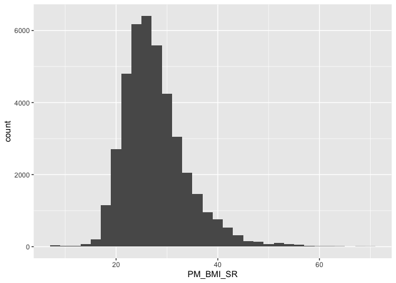
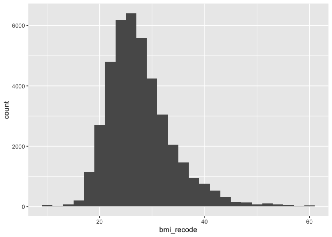
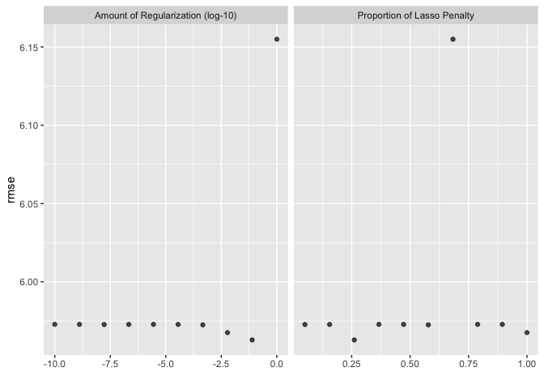
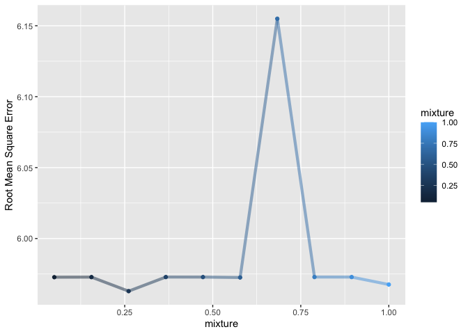
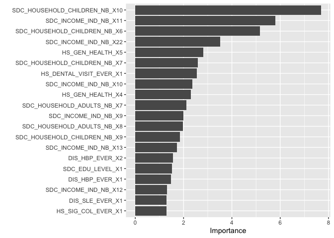

``` r
knitr::opts_chunk$set(echo = TRUE)
library(tidyverse)
```

```
## Warning: package 'ggplot2' was built under R version 4.5.2
```

```
## Warning: package 'readr' was built under R version 4.5.2
```

```
## ── Attaching core tidyverse packages ──────────────────────── tidyverse 2.0.0 ──
## ✔ dplyr     1.1.4     ✔ readr     2.1.6
## ✔ forcats   1.0.1     ✔ stringr   1.6.0
## ✔ ggplot2   4.0.1     ✔ tibble    3.3.0
## ✔ lubridate 1.9.4     ✔ tidyr     1.3.1
## ✔ purrr     1.2.0     
## ── Conflicts ────────────────────────────────────────── tidyverse_conflicts() ──
## ✖ dplyr::filter() masks stats::filter()
## ✖ dplyr::lag()    masks stats::lag()
## ℹ Use the conflicted package (<http://conflicted.r-lib.org/>) to force all conflicts to become errors
```

``` r
library(tidymodels)
```

```
## ── Attaching packages ────────────────────────────────────── tidymodels 1.4.1 ──
## ✔ broom        1.0.10     ✔ rsample      1.3.1 
## ✔ dials        1.4.2      ✔ tailor       0.1.0 
## ✔ infer        1.0.9      ✔ tune         2.0.1 
## ✔ modeldata    1.5.1      ✔ workflows    1.3.0 
## ✔ parsnip      1.3.3      ✔ workflowsets 1.1.1 
## ✔ recipes      1.3.1      ✔ yardstick    1.3.2 
## ── Conflicts ───────────────────────────────────────── tidymodels_conflicts() ──
## ✖ scales::discard() masks purrr::discard()
## ✖ dplyr::filter()   masks stats::filter()
## ✖ recipes::fixed()  masks stringr::fixed()
## ✖ dplyr::lag()      masks stats::lag()
## ✖ yardstick::spec() masks readr::spec()
## ✖ recipes::step()   masks stats::step()
```

``` r
library(sjPlot)
```

```
## 
## Attaching package: 'sjPlot'
## 
## The following object is masked from 'package:ggplot2':
## 
##     set_theme
```

``` r
library(psych)
```

```
## 
## Attaching package: 'psych'
## 
## The following objects are masked from 'package:scales':
## 
##     alpha, rescale
## 
## The following objects are masked from 'package:ggplot2':
## 
##     %+%, alpha
```

``` r
library(parallel)
library(finalfit)
library(gtsummary)
library(mlbench)
library(vip)
```

```
## 
## Attaching package: 'vip'
## 
## The following object is masked from 'package:utils':
## 
##     vi
```

``` r
library(rsample)
library(tune)
library(recipes)
library(yardstick)
library(parsnip)
library(glmnet)
```

```
## Loading required package: Matrix
## 
## Attaching package: 'Matrix'
## 
## The following objects are masked from 'package:tidyr':
## 
##     expand, pack, unpack
## 
## Loaded glmnet 4.1-10
```

``` r
library(themis)
library(corrr)
library(performance)
```

```
## 
## Attaching package: 'performance'
## 
## The following objects are masked from 'package:yardstick':
## 
##     mae, rmse
```

``` r
library(utils)

data <- read_csv("canpath_imputed.csv")
```

```
## Rows: 41187 Columns: 93
## ── Column specification ────────────────────────────────────────────────────────
## Delimiter: ","
## chr  (1): ID
## dbl (92): ADM_STUDY_ID, SDC_GENDER, SDC_AGE_CALC, SDC_MARITAL_STATUS, SDC_ED...
## 
## ℹ Use `spec()` to retrieve the full column specification for this data.
## ℹ Specify the column types or set `show_col_types = FALSE` to quiet this message.
```

## Linear Regression

A linear regression is a type of regression where the outcome variable is continuous and we assume it has a normal distribution. 

#### Feature selection

Feature selection is an important topic in ML because good predictor requires many features that are able to predict unique aspects of the outcome variable. 

## Research question and data

Our research question is:  

**What factors are associated with BMI?**

We have already worked on the imputed data from the missing data class so we are going to use that imputed data here as a starting point for the work. This is partly to save time for the teaching part of the class. Remember from the missing data class that ideally we would

1. Conduct sensitivity analyses with a number of different imputation methods. 
2. Account for uncertainty using pooled models. 

We are going to skip that for now but I will show an example of how `tidymodels` imputes data later in this doc. 

#### Outcome variable

Let's look at the outcome variable, recode, and drop observations that are not relevant. We need to do a histogram and check the distribution. Then we might deal with outliers.  


``` r
summary(data$PM_BMI_SR)
```

```
##    Min. 1st Qu.  Median    Mean 3rd Qu.    Max. 
##    8.86   23.41   26.62   27.66   30.68   69.40
```

``` r
bmi_histogram <- ggplot(data = data, aes(PM_BMI_SR)) +
                  geom_histogram(binwidth = 2)
plot(bmi_histogram)
```

<!-- -->

Nice normal(ish) distribution here. We probably have some outliers on the low and high end with values of 8.86 and 69.40 

We can recode people who are less than 10 and greater than 60 to values of 10 and 60 respectively. 


``` r
data <- data %>%
          mutate(bmi_recode = case_when(
            PM_BMI_SR < 10 ~ 10, 
            PM_BMI_SR > 60 ~ 60,
            TRUE ~ PM_BMI_SR
          ))
summary(data$bmi_recode)
```

```
##    Min. 1st Qu.  Median    Mean 3rd Qu.    Max. 
##   10.00   23.41   26.62   27.65   30.68   60.00
```

``` r
bmi_recode_histogram <- ggplot(data = data, aes(bmi_recode)) +
                  geom_histogram(binwidth = 2)
plot(bmi_recode_histogram)
```

<!-- -->

### Preparing predictor variables

All of the predictors are coded as 0,1,2 are read in as numeric by R so we need to fix that. We could manually fix each variable but we are going to do something a bit different. All of the `_EVER` variables are coded as

    * 0 Never had disease
    * 1 Ever had disease
    * 2 Presumed - Never had disease
    * -7 Not Applicable

We can batch recode all of these variables and make sure that they are factor and not numeric.


``` r
data <- data %>% mutate_at(3, factor)
data <- data %>% mutate_at(5:6, factor)
data <- data %>% mutate_at(8:12, factor)
data <- data %>% mutate_at(15:81, factor)
data <- data %>% mutate_at(83:93, factor)
```

## Recoding

**Age**


``` r
summary(data$SDC_AGE_CALC) 
```

```
##    Min. 1st Qu.  Median    Mean 3rd Qu.    Max. 
##   30.00   43.00   52.00   51.48   60.00   74.00
```

``` r
### Checking NA

data %>% summarise(
                  n = n_distinct(SDC_AGE_CALC),
                  na = sum(is.na(SDC_AGE_CALC)
                           ))
```

```
## # A tibble: 1 × 2
##       n    na
##   <int> <int>
## 1    45     0
```

**Income**


``` r
glimpse(data$SDC_INCOME)
```

```
##  Factor w/ 8 levels "1","2","3","4",..: 6 6 4 3 4 4 5 3 3 5 ...
```

``` r
table(data$SDC_INCOME)
```

```
## 
##    1    2    3    4    5    6    7    8 
##  574 2447 6815 8008 7667 8826 3965 2885
```

``` r
data <- data %>%
	mutate(income_recode = case_when(
		SDC_INCOME == 1 ~ "Less than 25 000 $",
		SDC_INCOME == 2 ~ "Less than 25 000 $",
		SDC_INCOME == 3 ~ "25 000 $ - 49 999 $",
		SDC_INCOME == 4 ~ "50 000 $ - 74 999 $",
		SDC_INCOME == 5 ~ "75 000 $ - 99 999 $",
		SDC_INCOME == 6 ~ "100 000 $ - 149 999 $",		
		SDC_INCOME == 7 ~ "150 000 $ - 199 999 $",
		SDC_INCOME == 8 ~ "200 000 $ or more"
	))

glimpse(data$income_recode)
```

```
##  chr [1:41187] "100 000 $ - 149 999 $" "100 000 $ - 149 999 $" ...
```

``` r
data$income_recode <- as_factor(data$income_recode)

data$income_recode <- fct_relevel(data$income_recode, "Less than 25 000 $", 
                                                          "25 000 $ - 49 999 $",
                                                          "50 000 $ - 74 999 $",
                                                          "75 000 $ - 99 999 $",
                                                          "100 000 $ - 149 999 $",
                                                          "150 000 $ - 199 999 $",
                                                          "200 000 $ or more"
                                          )
table(data$income_recode)
```

```
## 
##    Less than 25 000 $   25 000 $ - 49 999 $   50 000 $ - 74 999 $ 
##                  3021                  6815                  8008 
##   75 000 $ - 99 999 $ 100 000 $ - 149 999 $ 150 000 $ - 199 999 $ 
##                  7667                  8826                  3965 
##     200 000 $ or more 
##                  2885
```

``` r
table(data$income_recode, data$SDC_INCOME)
```

```
##                        
##                            1    2    3    4    5    6    7    8
##   Less than 25 000 $     574 2447    0    0    0    0    0    0
##   25 000 $ - 49 999 $      0    0 6815    0    0    0    0    0
##   50 000 $ - 74 999 $      0    0    0 8008    0    0    0    0
##   75 000 $ - 99 999 $      0    0    0    0 7667    0    0    0
##   100 000 $ - 149 999 $    0    0    0    0    0 8826    0    0
##   150 000 $ - 199 999 $    0    0    0    0    0    0 3965    0
##   200 000 $ or more        0    0    0    0    0    0    0 2885
```

### Some final data organizing


``` r
data$PM_BMI_SR <- NULL
```

## Cross validation 

So we know that the up-scaling worked well to improve the model. Another thing we always want to test with an ML model is using a different type of resampling (validation) approach. Originally, we used a 70/30 split in the data, which is not the optimal approach. A better general approach is k-fold cross validation. This approach is very common. There is some discussion of a bunch of other approaches here [https://www.stepbystepdatascience.com/ml-with-tidymodels](https://www.stepbystepdatascience.com/ml-with-tidymodels).

Here we will use our new up-scaled data and apply 10 fold cross-validation approach. We have already set the seed for the analysis in line 105. Setting that will make sure that we get a reproducible result. This resmapling approach 


### BMI recipe


``` r
# Fix the random numbers by setting the seed 
# This enables the analysis to be reproducible when random numbers are used 
set.seed(10)

data_split <- initial_split(data, prop = 0.70)

# Create data frames for the two sets:
train_data <- training(data_split)
summary(train_data$bmi_recode)
```

```
##    Min. 1st Qu.  Median    Mean 3rd Qu.    Max. 
##   10.00   23.43   26.63   27.69   30.73   60.00
```

``` r
test_data  <- testing(data_split)
summary(test_data$bmi_recode)
```

```
##    Min. 1st Qu.  Median    Mean 3rd Qu.    Max. 
##   10.00   23.34   26.58   27.57   30.61   60.00
```

``` r
bmi_recipe <- 
  recipe(bmi_recode ~ ., data = train_data) %>% 
  update_role(ADM_STUDY_ID, new_role = "ID") %>% 
  update_role(ID, new_role = "ID") %>% 
  step_normalize(all_numeric_predictors()) %>% 
  step_dummy(all_nominal_predictors()) %>% 
  step_zv(all_predictors()) 

summary(bmi_recipe)
```

```
## # A tibble: 94 × 4
##    variable                type      role      source  
##    <chr>                   <list>    <chr>     <chr>   
##  1 ID                      <chr [3]> ID        original
##  2 ADM_STUDY_ID            <chr [2]> ID        original
##  3 SDC_GENDER              <chr [3]> predictor original
##  4 SDC_AGE_CALC            <chr [2]> predictor original
##  5 SDC_MARITAL_STATUS      <chr [3]> predictor original
##  6 SDC_EDU_LEVEL           <chr [3]> predictor original
##  7 SDC_EDU_LEVEL_AGE       <chr [2]> predictor original
##  8 SDC_INCOME              <chr [3]> predictor original
##  9 SDC_INCOME_IND_NB       <chr [3]> predictor original
## 10 SDC_HOUSEHOLD_ADULTS_NB <chr [3]> predictor original
## # ℹ 84 more rows
```

### 


``` r
lm_mixture <- linear_reg(
                mode = "regression",
                engine = "glmnet",
                penalty = tune(),
                mixture = tune()
              )
```

### 5 fold cross validation


``` r
folds <- vfold_cv(train_data, v = 5) ## normally you would do at least 10 folds. Just doing 5 because it's faster.
```


``` r
detectCores()
```

```
## [1] 8
```

``` r
doParallel::registerDoParallel()

set.seed(123)

bmi_wflow_folds <- workflow() %>% 
          add_model(lm_mixture) %>% 
          add_recipe(bmi_recipe) %>% 
          tune_grid(resamples = folds,
                    control = control_grid(save_pred = TRUE, 
                                            verbose = FALSE)) ## Edit for running live

collect_metrics(bmi_wflow_folds) 
```

```
## # A tibble: 20 × 8
##          penalty mixture .metric .estimator   mean     n  std_err .config       
##            <dbl>   <dbl> <chr>   <chr>       <dbl> <int>    <dbl> <chr>         
##  1 0.0000000001    0.367 rmse    standard   5.97       5 0.0164   pre0_mod01_po…
##  2 0.0000000001    0.367 rsq     standard   0.0745     5 0.00121  pre0_mod01_po…
##  3 0.00000000129   0.789 rmse    standard   5.97       5 0.0164   pre0_mod02_po…
##  4 0.00000000129   0.789 rsq     standard   0.0745     5 0.00121  pre0_mod02_po…
##  5 0.0000000167    0.05  rmse    standard   5.97       5 0.0164   pre0_mod03_po…
##  6 0.0000000167    0.05  rsq     standard   0.0745     5 0.00122  pre0_mod03_po…
##  7 0.000000215     0.472 rmse    standard   5.97       5 0.0164   pre0_mod04_po…
##  8 0.000000215     0.472 rsq     standard   0.0745     5 0.00122  pre0_mod04_po…
##  9 0.00000278      0.894 rmse    standard   5.97       5 0.0164   pre0_mod05_po…
## 10 0.00000278      0.894 rsq     standard   0.0745     5 0.00121  pre0_mod05_po…
## 11 0.0000359       0.156 rmse    standard   5.97       5 0.0164   pre0_mod06_po…
## 12 0.0000359       0.156 rsq     standard   0.0745     5 0.00121  pre0_mod06_po…
## 13 0.000464        0.578 rmse    standard   5.97       5 0.0164   pre0_mod07_po…
## 14 0.000464        0.578 rsq     standard   0.0746     5 0.00122  pre0_mod07_po…
## 15 0.00599         1     rmse    standard   5.97       5 0.0171   pre0_mod08_po…
## 16 0.00599         1     rsq     standard   0.0757     5 0.00112  pre0_mod08_po…
## 17 0.0774          0.261 rmse    standard   5.96       5 0.0182   pre0_mod09_po…
## 18 0.0774          0.261 rsq     standard   0.0769     5 0.000935 pre0_mod09_po…
## 19 1               0.683 rmse    standard   6.15       5 0.0202   pre0_mod10_po…
## 20 1               0.683 rsq     standard   0.0360     5 0.00171  pre0_mod10_po…
```

``` r
show_best(bmi_wflow_folds, metric='rmse', n=5)  # only show the results for the best 5 models
```

```
## # A tibble: 5 × 8
##        penalty mixture .metric .estimator  mean     n std_err .config         
##          <dbl>   <dbl> <chr>   <chr>      <dbl> <int>   <dbl> <chr>           
## 1 0.0774         0.261 rmse    standard    5.96     5  0.0182 pre0_mod09_post0
## 2 0.00599        1     rmse    standard    5.97     5  0.0171 pre0_mod08_post0
## 3 0.000464       0.578 rmse    standard    5.97     5  0.0164 pre0_mod07_post0
## 4 0.0000000167   0.05  rmse    standard    5.97     5  0.0164 pre0_mod03_post0
## 5 0.0000359      0.156 rmse    standard    5.97     5  0.0164 pre0_mod06_post0
```

``` r
autoplot(bmi_wflow_folds, metric = 'rmse') 
```

<!-- -->

### Plotting


``` r
autoplot(bmi_wflow_folds, metric = 'rmse') 
```

<!-- -->

``` r
bmi_wflow_folds %>%
  collect_metrics() %>%
  filter(.metric == "rmse") %>%
  mutate(penalty = factor(penalty)) %>%
  ggplot(aes(mixture, mean, color = mixture)) +
  geom_line(alpha = 0.5, size = 1.5) +
  geom_point() +
  labs(y = "Root Mean Square Error")
```

```
## Warning: Using `size` aesthetic for lines was deprecated in ggplot2 3.4.0.
## ℹ Please use `linewidth` instead.
## This warning is displayed once every 8 hours.
## Call `lifecycle::last_lifecycle_warnings()` to see where this warning was
## generated.
```

<!-- -->


``` r
ridge_lasso_best <- 
  bmi_wflow_folds %>% 
  select_best(metric = "rmse")

ridge_lasso_best
```

```
## # A tibble: 1 × 3
##   penalty mixture .config         
##     <dbl>   <dbl> <chr>           
## 1  0.0774   0.261 pre0_mod09_post0
```

Let's pull the results and see what we get


``` r
boot_tuned_results <- 
  bmi_wflow_folds %>% 
  collect_predictions(parameters = ridge_lasso_best) 
```

### Final Model

Final model

Above we are looking at our trained model over the cross-validation sets. We have not actually tested our model on our test data. To run the last model we need to back to our workflow and use the last_fit function. Note that we use the cv_split object rather than the train or test data objects. This will will fit the model to the entire training set and evaluate it with the testing set. We need to back to our workflow object (somewhat counter intuitive).


``` r
lm_mixture_best <- linear_reg(
                mode = "regression",
                engine = "glmnet",
                penalty = 0.0774,
                mixture = 0.261
              )

bmi_wflow_best <- workflow() %>% 
          add_model(lm_mixture_best) %>% 
          add_recipe(bmi_recipe) 


final_ridge_model_workflow <- finalize_workflow(
                    bmi_wflow_best,
                    ridge_lasso_best
                  )

final_ridge_model_workflow
```

```
## ══ Workflow ════════════════════════════════════════════════════════════════════
## Preprocessor: Recipe
## Model: linear_reg()
## 
## ── Preprocessor ────────────────────────────────────────────────────────────────
## 3 Recipe Steps
## 
## • step_normalize()
## • step_dummy()
## • step_zv()
## 
## ── Model ───────────────────────────────────────────────────────────────────────
## Linear Regression Model Specification (regression)
## 
## Main Arguments:
##   penalty = 0.0774
##   mixture = 0.261
## 
## Computational engine: glmnet
```

### Variable importance 


``` r
final_ridge_model <- final_ridge_model_workflow %>%
                        fit(data = train_data)

final_ridge_model %>%
        extract_fit_parsnip() %>%
        tidy()
```

```
## # A tibble: 201 × 3
##    term                   estimate penalty
##    <chr>                     <dbl>   <dbl>
##  1 (Intercept)             26.4     0.0774
##  2 SDC_AGE_CALC             0       0.0774
##  3 SDC_EDU_LEVEL_AGE        0.0178  0.0774
##  4 PA_TOTAL_SHORT          -0.122   0.0774
##  5 PSE_ADULT_WRK_DURATION   0.0634  0.0774
##  6 SDC_GENDER_X2           -0.364   0.0774
##  7 SDC_MARITAL_STATUS_X2    0       0.0774
##  8 SDC_MARITAL_STATUS_X3    0       0.0774
##  9 SDC_MARITAL_STATUS_X4   -0.243   0.0774
## 10 SDC_MARITAL_STATUS_X5    0       0.0774
## # ℹ 191 more rows
```

``` r
vip(final_ridge_model, num_features = 20)
```

<!-- -->

### Final model on testing data 

let’s return to our test data. The tune package has a function last_fit() which is nice for situations when you have tuned and finalized a model or workflow and want to fit it one last time on your training data and evaluate it on your testing data. You only have to pass this function your finalized model/workflow and your split. As we pass it the split object from the start of our code we get two processes for the price of one. We train/fit our selected model on 100% of Train and then it automatically scores up the Test set with the newly created, final model. 


``` r
last_fit_ridge <- last_fit(final_ridge_model_workflow, data_split)  %>%
                    collect_metrics()
last_fit_ridge
```

```
## # A tibble: 2 × 4
##   .metric .estimator .estimate .config        
##   <chr>   <chr>          <dbl> <chr>          
## 1 rmse    standard      5.96   pre0_mod0_post0
## 2 rsq     standard      0.0680 pre0_mod0_post0
```

## Session Info


``` r
sessionInfo()
```

```
## R version 4.5.1 (2025-06-13)
## Platform: aarch64-apple-darwin20
## Running under: macOS Tahoe 26.3
## 
## Matrix products: default
## BLAS:   /Library/Frameworks/R.framework/Versions/4.5-arm64/Resources/lib/libRblas.0.dylib 
## LAPACK: /Library/Frameworks/R.framework/Versions/4.5-arm64/Resources/lib/libRlapack.dylib;  LAPACK version 3.12.1
## 
## locale:
## [1] en_US.UTF-8/en_US.UTF-8/en_US.UTF-8/C/en_US.UTF-8/en_US.UTF-8
## 
## time zone: America/Regina
## tzcode source: internal
## 
## attached base packages:
## [1] parallel  stats     graphics  grDevices utils     datasets  methods  
## [8] base     
## 
## other attached packages:
##  [1] performance_0.15.2 corrr_0.4.5        themis_1.0.3       glmnet_4.1-10     
##  [5] Matrix_1.7-3       vip_0.4.1          mlbench_2.1-6      gtsummary_2.4.0   
##  [9] finalfit_1.1.0     psych_2.5.6        sjPlot_2.9.0       yardstick_1.3.2   
## [13] workflowsets_1.1.1 workflows_1.3.0    tune_2.0.1         tailor_0.1.0      
## [17] rsample_1.3.1      recipes_1.3.1      parsnip_1.3.3      modeldata_1.5.1   
## [21] infer_1.0.9        dials_1.4.2        scales_1.4.0       broom_1.0.10      
## [25] tidymodels_1.4.1   lubridate_1.9.4    forcats_1.0.1      stringr_1.6.0     
## [29] dplyr_1.1.4        purrr_1.2.0        readr_2.1.6        tidyr_1.3.1       
## [33] tibble_3.3.0       ggplot2_4.0.1      tidyverse_2.0.0   
## 
## loaded via a namespace (and not attached):
##  [1] Rdpack_2.6.4        mnormt_2.1.1        rlang_1.1.6        
##  [4] magrittr_2.0.4      furrr_0.3.1         compiler_4.5.1     
##  [7] vctrs_0.6.5         lhs_1.2.0           crayon_1.5.3       
## [10] pkgconfig_2.0.3     shape_1.4.6.1       fastmap_1.2.0      
## [13] backports_1.5.0     labeling_0.4.3      utf8_1.2.6         
## [16] rmarkdown_2.30      prodlim_2025.04.28  tzdb_0.5.0         
## [19] nloptr_2.2.1        bit_4.6.0           xfun_0.54          
## [22] jomo_2.7-6          cachem_1.1.0        jsonlite_2.0.0     
## [25] pan_1.9             R6_2.6.1            bslib_0.9.0        
## [28] stringi_1.8.7       RColorBrewer_1.1-3  boot_1.3-31        
## [31] parallelly_1.45.1   rpart_4.1.24        jquerylib_0.1.4    
## [34] Rcpp_1.1.0          iterators_1.0.14    knitr_1.50         
## [37] future.apply_1.20.0 splines_4.5.1       nnet_7.3-20        
## [40] timechange_0.3.0    tidyselect_1.2.1    rstudioapi_0.17.1  
## [43] yaml_2.3.10         timeDate_4051.111   doParallel_1.0.17  
## [46] codetools_0.2-20    listenv_0.10.0      lattice_0.22-7     
## [49] withr_3.0.2         S7_0.2.1            evaluate_1.0.5     
## [52] future_1.68.0       survival_3.8-3      pillar_1.11.1      
## [55] mice_3.18.0         foreach_1.5.2       insight_1.4.3      
## [58] reformulas_0.4.2    generics_0.1.4      vroom_1.6.6        
## [61] hms_1.1.4           minqa_1.2.8         globals_0.18.0     
## [64] class_7.3-23        glue_1.8.0          ROSE_0.0-4         
## [67] tools_4.5.1         data.table_1.17.8   lme4_1.1-37        
## [70] gower_1.0.2         grid_4.5.1          rbibutils_2.4      
## [73] ipred_0.9-15        nlme_3.1-168        sfd_0.1.0          
## [76] cli_3.6.5           DiceDesign_1.10     lava_1.8.2         
## [79] gtable_0.3.6        GPfit_1.0-9         sass_0.4.10        
## [82] digest_0.6.39       farver_2.1.2        htmltools_0.5.8.1  
## [85] lifecycle_1.0.4     hardhat_1.4.2       mitml_0.4-5        
## [88] sparsevctrs_0.3.4   bit64_4.6.0-1       MASS_7.3-65
```
