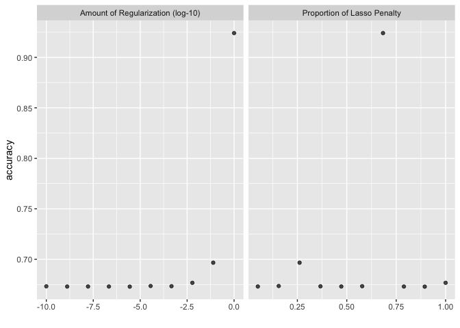
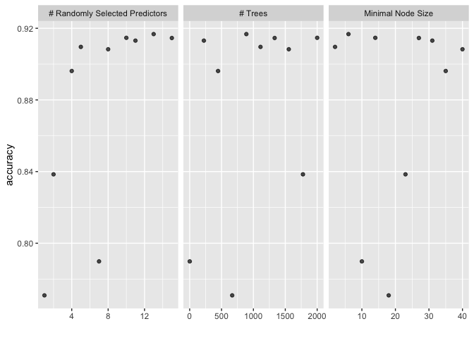
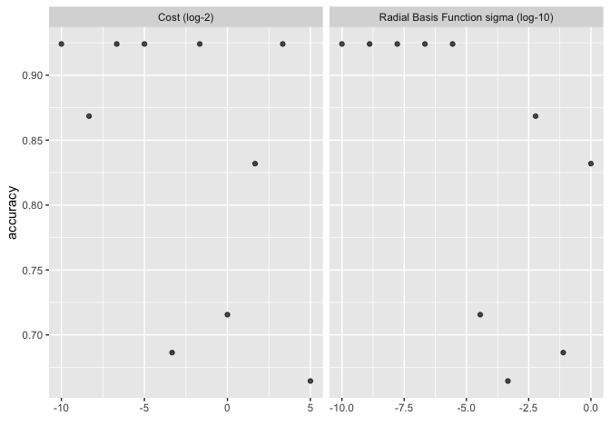
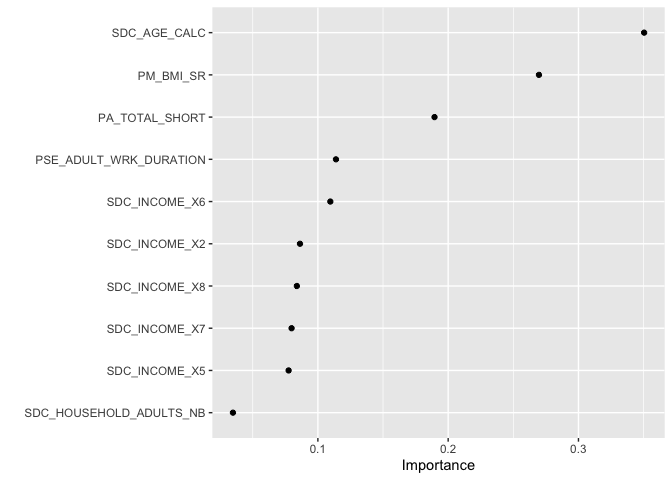
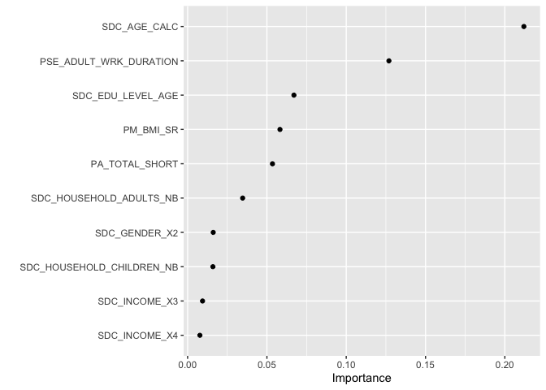

``` r
knitr::opts_chunk$set(echo = TRUE)
library(tidyverse)
library(tidymodels)
library(sjPlot)
library(finalfit)
library(knitr)
library(gtsummary)
library(mlbench)
library(kernlab)
library(vip)
library(rsample)
library(tune)
library(recipes)
library(yardstick)
library(parsnip)
library(glmnet)
library(themis)
library(microbenchmark)
```

# Support Vector Machines

## Research question and data

We are using an imputed (ie. no missing data) version of the CanPath student dataset [https://canpath.ca/student-dataset/](https://canpath.ca/student-dataset/). The nice thing about this dataset is that it's pretty big in terms of sample size, has lots of variables, and we can use it for free. 

Our research question is:  

- **Can we develop a model that will predict type 2 diabetes**

### Reading in data

Here are reading in data and getting organized to run our models. 


``` r
data <- read_csv("canpath_imputed.csv")
```

```
## Rows: 41187 Columns: 93
## ── Column specification ────────────────────────────────────────────────────────
## Delimiter: ","
## chr  (1): ID
## dbl (92): ADM_STUDY_ID, SDC_GENDER, SDC_AGE_CALC, SDC_MARITAL_STATUS, SDC_ED...
## 
## ℹ Use `spec()` to retrieve the full column specification for this data.
## ℹ Specify the column types or set `show_col_types = FALSE` to quiet this message.
```

``` r
data <- data %>% mutate_at(3, factor)
data <- data %>% mutate_at(5:6, factor)
data <- data %>% mutate_at(8:9, factor)
data <- data %>% mutate_at(12:12, factor)
data <- data %>% mutate_at(15:81, factor)
data <- data %>% mutate_at(83:93, factor)

table(data$DIS_DIAB_EVER)
```

```
## 
##     0     1     2 
## 36714  3114  1359
```

``` r
data <- data %>%
	mutate(diabetes = case_when(
		DIS_DIAB_EVER == 0 ~ 0,
		DIS_DIAB_EVER == 1 ~ 1,
		DIS_DIAB_EVER == 2 ~ 0)) %>%
		mutate(diabetes = as.factor(diabetes))

table(data$DIS_DIAB_EVER, data$diabetes)
```

```
##    
##         0     1
##   0 36714     0
##   1     0  3114
##   2  1359     0
```

``` r
data$DIS_DIAB_EVER <- NULL
```


``` r
data <- select(data, diabetes, 
                            PSE_ADULT_WRK_DURATION, 
                            PM_BMI_SR, 
                            PA_TOTAL_SHORT, 
                            SDC_HOUSEHOLD_CHILDREN_NB, 
                            SDC_HOUSEHOLD_ADULTS_NB, 
                            SDC_EDU_LEVEL_AGE, 
                            SDC_AGE_CALC, 
                            SDC_GENDER, 
                            SDC_INCOME)
```

## Prepare the data split and cross validation folds

This works across all models so we only need to run this once. 


``` r
set.seed(10)

#### Cross Validation Split
cv_split <- initial_validation_split(data, 
                            strata = diabetes, 
                            prop = c(0.70, 0.20))

# Create data frames for the two sets:
train_data <- training(cv_split)
table(train_data$diabetes)
```

```
## 
##     0     1 
## 26640  2190
```

``` r
test_data  <- testing(cv_split)
table(test_data$diabetes)
```

```
## 
##    0    1 
## 3813  306
```

### V folds


``` r
folds <- vfold_cv(training(cv_split), v = 5, strata = diabetes)
```

## Prepare the recipe for the data 

This works across all models so we only need to run this once. 


``` r
diabetes_recipe <- 
  recipe(diabetes ~ ., data = train_data) %>%
  step_smotenc(diabetes, over_ratio = 0.9) %>%
  step_dummy(all_nominal_predictors()) %>%
  step_zv(all_predictors(), -all_outcomes()) %>%
  step_normalize(all_numeric_predictors())
```

## Prepare the models 

Here we need to understand the tuning parameters, which are different for each type of model and specify which parameters we will run and how we will run the grid search for tuning. I'm going to do this in one chunk for each just to make it easier to follow. 

### Logistic regression

Tuning parameters

* __mixture__: A number between zero and one (inclusive) giving the proportion of L1 regularization (i.e. lasso) in the model.
    * mixture = 1 specifies a pure lasso model
    * mixture = 0 specifies a ridge regression model
    * ⁠0 < mixture < 1⁠ specifies an elastic net model, interpolating lasso and ridge
* __penalty__: A non-negative number representing the total amount of regularization (specific engines only). For keras models, this corresponds to purely L2 regularization (aka weight decay) while the other models can be either or a combination of L1 and L2 (depending on the value of mixture).


``` r
logistic_model <- logistic_reg(penalty = tune(), mixture = tune(),
                                mode = "classification",
                                engine = "glmnet"
                               )

logistic_workflow <- workflow() %>% 
          add_model(logistic_model) %>% 
          add_recipe(diabetes_recipe) %>% 
          tune_grid(resamples = folds,
                    control = control_grid(save_pred = TRUE, 
                                            verbose = FALSE)) ## Edit for running live

collect_metrics(logistic_workflow) 
```

```
## # A tibble: 30 × 8
##          penalty mixture .metric     .estimator  mean     n  std_err .config    
##            <dbl>   <dbl> <chr>       <chr>      <dbl> <int>    <dbl> <chr>      
##  1 0.0000000001    0.367 accuracy    binary     0.673     5 0.00241  pre0_mod01…
##  2 0.0000000001    0.367 brier_class binary     0.211     5 0.000710 pre0_mod01…
##  3 0.0000000001    0.367 roc_auc     binary     0.659     5 0.00434  pre0_mod01…
##  4 0.00000000129   0.789 accuracy    binary     0.673     5 0.00250  pre0_mod02…
##  5 0.00000000129   0.789 brier_class binary     0.211     5 0.000714 pre0_mod02…
##  6 0.00000000129   0.789 roc_auc     binary     0.659     5 0.00441  pre0_mod02…
##  7 0.0000000167    0.05  accuracy    binary     0.673     5 0.00253  pre0_mod03…
##  8 0.0000000167    0.05  brier_class binary     0.211     5 0.000701 pre0_mod03…
##  9 0.0000000167    0.05  roc_auc     binary     0.659     5 0.00425  pre0_mod03…
## 10 0.000000215     0.472 accuracy    binary     0.673     5 0.00242  pre0_mod04…
## # ℹ 20 more rows
```

``` r
show_best(logistic_workflow, metric='accuracy', n=5)  # only show the results for the best 5 models
```

```
## # A tibble: 5 × 8
##     penalty mixture .metric  .estimator  mean     n std_err .config         
##       <dbl>   <dbl> <chr>    <chr>      <dbl> <int>   <dbl> <chr>           
## 1 1           0.683 accuracy binary     0.924     5 0.00203 pre0_mod10_post0
## 2 0.0774      0.261 accuracy binary     0.697     5 0.00455 pre0_mod09_post0
## 3 0.00599     1     accuracy binary     0.677     5 0.00277 pre0_mod08_post0
## 4 0.0000359   0.156 accuracy binary     0.674     5 0.00256 pre0_mod06_post0
## 5 0.000464    0.578 accuracy binary     0.673     5 0.00244 pre0_mod07_post0
```

``` r
autoplot(logistic_workflow, metric = 'accuracy') 
```

<!-- -->

### Random Forest

Tuning parameters

* __mtry__: An integer for the number of predictors that will be randomly sampled at each split when creating the tree models.
* __trees__: An integer for the number of trees contained in the ensemble.
* __min_n__: An integer for the minimum number of data points in a node that are required for the node to be split further.


``` r
cores <- parallel::detectCores()
cores
```

```
## [1] 10
```

``` r
rf_model <- rand_forest(mtry = tune(), min_n = tune(), trees = tune()) %>% 
              set_engine("ranger", num.threads = cores) %>% 
              set_mode("classification")

rf_workflow <- workflow() %>% 
          add_model(rf_model) %>% 
          add_recipe(diabetes_recipe) %>% 
          tune_grid(resamples = folds,
                    control = control_grid(save_pred = TRUE, 
                                            verbose = FALSE)) ## Edit for running live
```

```
## i Creating pre-processing data to finalize 1 unknown parameter: "mtry"
```

``` r
collect_metrics(rf_workflow) 
```

```
## # A tibble: 30 × 9
##     mtry trees min_n .metric     .estimator  mean     n  std_err .config        
##    <int> <int> <int> <chr>       <chr>      <dbl> <int>    <dbl> <chr>          
##  1     1   667    18 accuracy    binary     0.771     5 0.00289  pre0_mod01_pos…
##  2     1   667    18 brier_class binary     0.201     5 0.000578 pre0_mod01_pos…
##  3     1   667    18 roc_auc     binary     0.628     5 0.00454  pre0_mod01_pos…
##  4     2  1777    23 accuracy    binary     0.838     5 0.00224  pre0_mod02_pos…
##  5     2  1777    23 brier_class binary     0.148     5 0.000715 pre0_mod02_pos…
##  6     2  1777    23 roc_auc     binary     0.634     5 0.00386  pre0_mod02_pos…
##  7     4   445    35 accuracy    binary     0.896     5 0.00199  pre0_mod03_pos…
##  8     4   445    35 brier_class binary     0.108     5 0.000913 pre0_mod03_pos…
##  9     4   445    35 roc_auc     binary     0.636     5 0.00291  pre0_mod03_pos…
## 10     5  1111     2 accuracy    binary     0.910     5 0.00192  pre0_mod04_pos…
## # ℹ 20 more rows
```

``` r
show_best(rf_workflow, metric='accuracy', n=5)  # only show the results for the best 5 models
```

```
## # A tibble: 5 × 9
##    mtry trees min_n .metric  .estimator  mean     n std_err .config         
##   <int> <int> <int> <chr>    <chr>      <dbl> <int>   <dbl> <chr>           
## 1    13   889     6 accuracy binary     0.917     5 0.00163 pre0_mod09_post0
## 2    10  2000    14 accuracy binary     0.915     5 0.00191 pre0_mod07_post0
## 3    15  1333    27 accuracy binary     0.915     5 0.00240 pre0_mod10_post0
## 4    11   223    31 accuracy binary     0.913     5 0.00196 pre0_mod08_post0
## 5     5  1111     2 accuracy binary     0.910     5 0.00192 pre0_mod04_post0
```

``` r
autoplot(rf_workflow, metric = 'accuracy') 
```

<!-- -->

### Support Vector Machine

Tuning parameters

* __cost__ (default: 1.0): A positive number for the cost of predicting a sample within or on the wrong side of the margin. 
Low cost, points that are misclassified are penalized less than with a higher cost. 
How much do we are about misclassification? 
* __margin__ (default: 0.1): Insensitivity margin, how wide a margin do we want to make to select the support vectors. (Does not apply in classification)
* __rbf_sigma__  rbf_sigma (no default – estimated based on data) : A positive number for the radial basis function. Tune me!


``` r
svm_model <- svm_rbf(cost = tune(), rbf_sigma = tune()) %>% 
  set_mode("classification") %>%
  set_engine("kernlab")

svm_workflow <- workflow() %>% 
          add_model(svm_model) %>% 
          add_recipe(diabetes_recipe) %>% 
          tune_grid(resamples = folds,
                    control = control_grid(save_pred = FALSE, 
                                            verbose = FALSE)) ## Edit for running live
```

```
## maximum number of iterations reached 0.01024233 0.01024154maximum number of iterations reached 6.665555e-05 6.665553e-05maximum number of iterations reached 0.02023322 0.02022002line search fails -1.177161 -0.2105732 0.0001571008 -3.627928e-05 -6.932246e-08 -1.448375e-08 -1.036516e-11
```

```
## → A | error:   $ operator is invalid for atomic vectors
```

```
## 
There were issues with some computations A: x1
```

```
## maximum number of iterations reached 0.01018189 0.01018114maximum number of iterations reached 6.574412e-05 6.574414e-05maximum number of iterations reached 0.02005406 0.02004086line search fails -1.192195 -0.2086607 0.0004597155 -9.909524e-05 -2.05994e-07 -4.29776e-08 -9.043978e-11
```

```
## 
There were issues with some computations A: x2
```

```
## maximum number of iterations reached 0.0104804 0.01047953maximum number of iterations reached 6.829442e-05 6.82944e-05maximum number of iterations reached 0.0208532 0.02083891line search fails -1.181427 -0.1955908 0.00044169 -0.0001176797 -1.922459e-07 -3.556348e-08 -8.072799e-11
```

```
## 
There were issues with some computations A: x3
```

```
## line search fails -3.200859 0.6285329 2.938074e-05 -2.204814e-05 -3.048362e-08 1.706129e-08 -1.271801e-12
```

```
## 
There were issues with some computations A: x5
```

```
## maximum number of iterations reached 0.009461057 0.009460452maximum number of iterations reached 6.233416e-05 6.233421e-05maximum number of iterations reached 0.01857114 0.01856172line search fails -1.188901 -0.2333065 0.0001194854 -3.039643e-05 -5.5518e-08 -1.236763e-08 -6.257657e-12
```

```
## 
There were issues with some computations A: x6
```

```
## maximum number of iterations reached 0.01048742 0.01048657maximum number of iterations reached 6.787841e-05 6.787842e-05maximum number of iterations reached 0.02088216 0.02086786
```

```
## 
There were issues with some computations   A: x6
```

``` r
collect_metrics(svm_workflow) 
```

```
## # A tibble: 30 × 8
##        cost    rbf_sigma .metric     .estimator  mean     n  std_err .config    
##       <dbl>        <dbl> <chr>       <chr>      <dbl> <int>    <dbl> <chr>      
##  1 0.000977 0.000000215  accuracy    binary     0.924     5 0.00203  pre0_mod01…
##  2 0.000977 0.000000215  brier_class binary     0.228     5 0.000102 pre0_mod01…
##  3 0.000977 0.000000215  roc_auc     binary     0.657     5 0.00521  pre0_mod01…
##  4 0.00310  0.00599      accuracy    binary     0.868     5 0.00568  pre0_mod02…
##  5 0.00310  0.00599      brier_class binary     0.292     5 0.00170  pre0_mod02…
##  6 0.00310  0.00599      roc_auc     binary     0.657     5 0.00437  pre0_mod02…
##  7 0.00984  0.0000000001 accuracy    binary     0.924     5 0.00203  pre0_mod03…
##  8 0.00984  0.0000000001 brier_class binary     0.228     5 0.000107 pre0_mod03…
##  9 0.00984  0.0000000001 roc_auc     binary     0.655     5 0.00429  pre0_mod03…
## 10 0.0312   0.00000278   accuracy    binary     0.924     5 0.00203  pre0_mod04…
## # ℹ 20 more rows
```

``` r
show_best(svm_workflow, metric='accuracy', n=5)  # only show the results for the best 5 models
```

```
## # A tibble: 5 × 8
##        cost     rbf_sigma .metric  .estimator  mean     n std_err .config       
##       <dbl>         <dbl> <chr>    <chr>      <dbl> <int>   <dbl> <chr>         
## 1  0.000977 0.000000215   accuracy binary     0.924     5 0.00203 pre0_mod01_po…
## 2  0.00984  0.0000000001  accuracy binary     0.924     5 0.00203 pre0_mod03_po…
## 3  0.0312   0.00000278    accuracy binary     0.924     5 0.00203 pre0_mod04_po…
## 4  0.315    0.00000000129 accuracy binary     0.924     5 0.00203 pre0_mod06_po…
## 5 10.1      0.0000000167  accuracy binary     0.924     5 0.00203 pre0_mod09_po…
```

``` r
autoplot(svm_workflow, metric = 'accuracy') 
```

<!-- -->

## Best models 

### Logistic Regression


``` r
logistic_best <- 
  logistic_workflow %>% 
  select_best(metric = "brier_class")

logistic_final_model <- finalize_model(
                          logistic_model,
                          logistic_best
                          )
logistic_final_model
```

```
## Logistic Regression Model Specification (classification)
## 
## Main Arguments:
##   penalty = 1.66810053720006e-08
##   mixture = 0.05
## 
## Computational engine: glmnet
```

``` r
final_logistic_workflow <- workflow() %>%
                      add_recipe(diabetes_recipe) %>%
                      add_model(logistic_final_model)

final_logistic_results <- final_logistic_workflow %>%
                    last_fit(cv_split)

lr_results <- final_logistic_results %>% collect_metrics()
```

### Random Forest


``` r
rf_best <- 
  rf_workflow %>% 
  select_best(metric = "brier_class")

rf_final_model <- finalize_model(
                          rf_model,
                          rf_best
                          )
rf_final_model
```

```
## Random Forest Model Specification (classification)
## 
## Main Arguments:
##   mtry = 13
##   trees = 889
##   min_n = 6
## 
## Engine-Specific Arguments:
##   num.threads = cores
## 
## Computational engine: ranger
```

``` r
final_rf_workflow <- workflow() %>%
                      add_recipe(diabetes_recipe) %>%
                      add_model(rf_final_model)

final_rf_results <- final_rf_workflow %>%
                    last_fit(cv_split)

rf_results <- final_rf_results %>% collect_metrics()
```

### Support Vector Machine


``` r
svm_best <- 
  svm_workflow %>% 
  select_best(metric = "brier_class")

svm_final_model <- finalize_model(
                          svm_model,
                          svm_best
                          )
svm_final_model
```

```
## Radial Basis Function Support Vector Machine Model Specification (classification)
## 
## Main Arguments:
##   cost = 3.1748021039364
##   rbf_sigma = 1
## 
## Computational engine: kernlab
```

``` r
final_svm_workflow <- workflow() %>%
                      add_recipe(diabetes_recipe) %>%
                      add_model(svm_final_model)

final_svm_results <- final_svm_workflow %>%
                      last_fit(cv_split)
```

```
## line search fails -3.180204 0.6544392 4.379615e-05 -3.340176e-05 -3.731259e-08 2.152427e-08 -2.353096e-12
```

```
## → A | error:   $ operator is invalid for atomic vectors
```

```
## 
There were issues with some computations A: x1
```

```
## Warning: All models failed. Run `show_notes(.Last.tune.result)` for more
## information.
```

```
## 
There were issues with some computations   A: x1
```

``` r
svm_results <- final_svm_results %>% collect_metrics()
```

## Final Results


``` r
### Logistic Regression
kable(lr_results)
```


|.metric     |.estimator | .estimate|.config         |
|:-----------|:----------|---------:|:---------------|
|accuracy    |binary     | 0.6722505|pre0_mod0_post0 |
|roc_auc     |binary     | 0.6567376|pre0_mod0_post0 |
|brier_class |binary     | 0.2101871|pre0_mod0_post0 |

``` r
### Random Forest
kable(rf_results)
```


|.metric     |.estimator | .estimate|.config         |
|:-----------|:----------|---------:|:---------------|
|accuracy    |binary     | 0.9203690|pre0_mod0_post0 |
|roc_auc     |binary     | 0.6425490|pre0_mod0_post0 |
|brier_class |binary     | 0.0792252|pre0_mod0_post0 |

``` r
### SVM
kable(svm_results)
```

## Variable Importance

### Logistic Regression


``` r
prep <- prep(diabetes_recipe)

logistic_final_model %>%
  set_engine("glmnet", importance = "permutation") %>%
  fit(diabetes ~ .,
    data = juice(prep)) %>%
  vip(geom = "point")
```

<!-- -->

### Random Forest


``` r
prep <- prep(diabetes_recipe)

rf_final_model %>%
  set_engine("ranger", importance = "permutation") %>%
  fit(diabetes ~ .,
    data = juice(prep)) %>%
  vip(geom = "point")
```

<!-- -->

### Benchmarks 

We can check how long each model took to run using the `microbenchmark` package. These are nanoseconds, so there is no real difference here but this is a simple model with small data. 


``` r
microbenchmark(logistic_workflow, rf_workflow, svm_workflow)
```

```
## Unit: nanoseconds
##               expr min lq mean median uq max neval
##  logistic_workflow   0  0 4.10      0  0 410   100
##        rf_workflow   0  0 2.46      0  0 246   100
##       svm_workflow   0  0 2.46      0  0 246   100
```

## Session Info


``` r
sessionInfo()
```

```
## R version 4.5.2 (2025-10-31)
## Platform: aarch64-apple-darwin20
## Running under: macOS Tahoe 26.4
## 
## Matrix products: default
## BLAS:   /System/Library/Frameworks/Accelerate.framework/Versions/A/Frameworks/vecLib.framework/Versions/A/libBLAS.dylib 
## LAPACK: /Library/Frameworks/R.framework/Versions/4.5-arm64/Resources/lib/libRlapack.dylib;  LAPACK version 3.12.1
## 
## locale:
## [1] en_US.UTF-8/en_US.UTF-8/en_US.UTF-8/C/en_US.UTF-8/en_US.UTF-8
## 
## time zone: America/Regina
## tzcode source: internal
## 
## attached base packages:
## [1] stats     graphics  grDevices utils     datasets  methods   base     
## 
## other attached packages:
##  [1] microbenchmark_1.5.0 themis_1.0.3         glmnet_4.1-10       
##  [4] Matrix_1.7-4         vip_0.4.1            kernlab_0.9-33      
##  [7] mlbench_2.1-6        gtsummary_2.4.0      knitr_1.50          
## [10] finalfit_1.1.0       sjPlot_2.9.0         yardstick_1.3.2     
## [13] workflowsets_1.1.1   workflows_1.3.0      tune_2.0.0          
## [16] tailor_0.1.0         rsample_1.3.1        recipes_1.3.1       
## [19] parsnip_1.3.3        modeldata_1.5.1      infer_1.0.9         
## [22] dials_1.4.2          scales_1.4.0         broom_1.0.10        
## [25] tidymodels_1.4.1     lubridate_1.9.4      forcats_1.0.0       
## [28] stringr_1.5.2        dplyr_1.1.4          purrr_1.1.0         
## [31] readr_2.1.5          tidyr_1.3.1          tibble_3.3.1        
## [34] ggplot2_4.0.0        tidyverse_2.0.0     
## 
## loaded via a namespace (and not attached):
##  [1] Rdpack_2.6.4        rlang_1.1.7         magrittr_2.0.4     
##  [4] furrr_0.3.1         compiler_4.5.2      vctrs_0.7.0        
##  [7] lhs_1.2.0           crayon_1.5.3        pkgconfig_2.0.3    
## [10] shape_1.4.6.1       fastmap_1.2.0       backports_1.5.0    
## [13] labeling_0.4.3      utf8_1.2.6          rmarkdown_2.29     
## [16] prodlim_2025.04.28  tzdb_0.5.0          nloptr_2.2.1       
## [19] bit_4.6.0           xfun_0.53           jomo_2.7-6         
## [22] cachem_1.1.0        jsonlite_2.0.0      pan_1.9            
## [25] parallel_4.5.2      R6_2.6.1            bslib_0.9.0        
## [28] stringi_1.8.7       RColorBrewer_1.1-3  ranger_0.17.0      
## [31] parallelly_1.45.1   boot_1.3-32         rpart_4.1.24       
## [34] jquerylib_0.1.4     Rcpp_1.1.1          iterators_1.0.14   
## [37] future.apply_1.20.0 splines_4.5.2       nnet_7.3-20        
## [40] timechange_0.3.0    tidyselect_1.2.1    rstudioapi_0.17.1  
## [43] yaml_2.3.10         timeDate_4041.110   codetools_0.2-20   
## [46] listenv_0.9.1       lattice_0.22-7      withr_3.0.2        
## [49] S7_0.2.0            evaluate_1.0.5      future_1.67.0      
## [52] survival_3.8-3      pillar_1.11.1       mice_3.18.0        
## [55] foreach_1.5.2       reformulas_0.4.1    generics_0.1.4     
## [58] vroom_1.6.5         hms_1.1.4           minqa_1.2.8        
## [61] globals_0.18.0      class_7.3-23        glue_1.8.0         
## [64] ROSE_0.0-4          tools_4.5.2         data.table_1.18.0  
## [67] lme4_1.1-37         gower_1.0.2         grid_4.5.2         
## [70] rbibutils_2.3       ipred_0.9-15        nlme_3.1-168       
## [73] sfd_0.1.0           cli_3.6.5           DiceDesign_1.10    
## [76] lava_1.8.1          gtable_0.3.6        GPfit_1.0-9        
## [79] sass_0.4.10         digest_0.6.39       farver_2.1.2       
## [82] htmltools_0.5.8.1   lifecycle_1.0.5     hardhat_1.4.2      
## [85] mitml_0.4-5         sparsevctrs_0.3.4   bit64_4.6.0-1      
## [88] MASS_7.3-65
```

