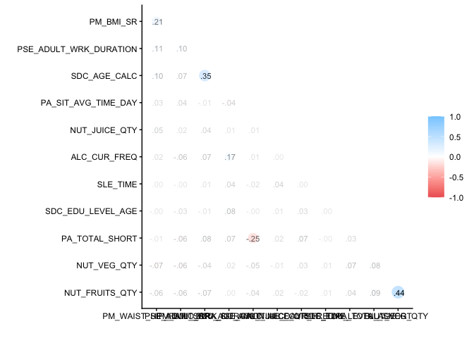
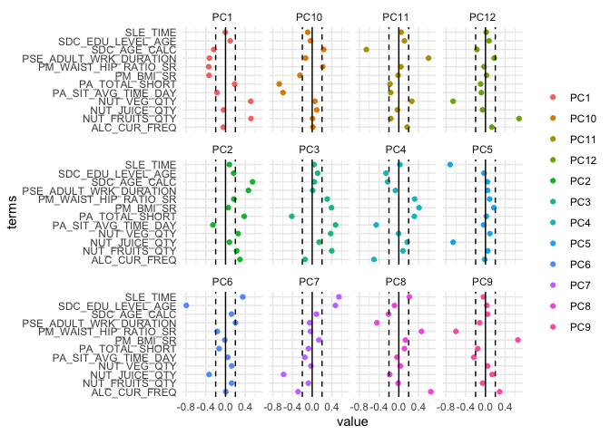
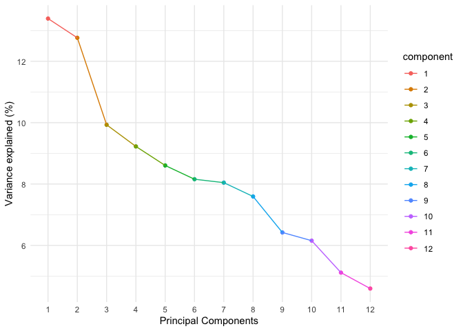
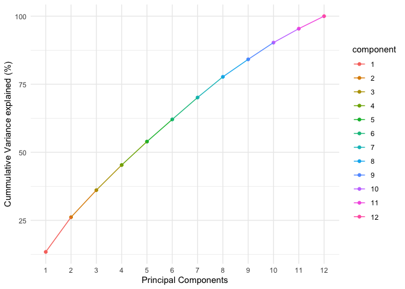
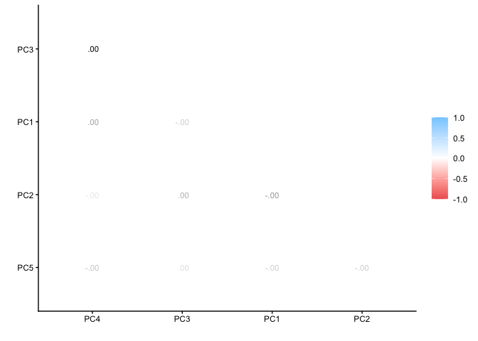
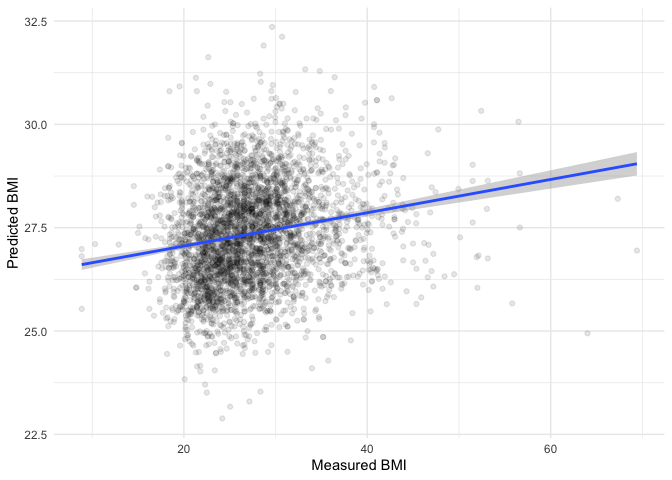

``` r
knitr::opts_chunk$set(echo = TRUE)
library(tidyverse)
```

```
## ── Attaching core tidyverse packages ──────────────────────── tidyverse 2.0.0 ──
## ✔ dplyr     1.1.4     ✔ readr     2.1.5
## ✔ forcats   1.0.0     ✔ stringr   1.5.2
## ✔ ggplot2   4.0.0     ✔ tibble    3.3.1
## ✔ lubridate 1.9.4     ✔ tidyr     1.3.1
## ✔ purrr     1.1.0     
## ── Conflicts ────────────────────────────────────────── tidyverse_conflicts() ──
## ✖ dplyr::filter() masks stats::filter()
## ✖ dplyr::lag()    masks stats::lag()
## ℹ Use the conflicted package (<http://conflicted.r-lib.org/>) to force all conflicts to become errors
```

``` r
library(tidymodels)
```

```
## ── Attaching packages ────────────────────────────────────── tidymodels 1.4.1 ──
## ✔ broom        1.0.10     ✔ rsample      1.3.1 
## ✔ dials        1.4.2      ✔ tailor       0.1.0 
## ✔ infer        1.0.9      ✔ tune         2.0.0 
## ✔ modeldata    1.5.1      ✔ workflows    1.3.0 
## ✔ parsnip      1.3.3      ✔ workflowsets 1.1.1 
## ✔ recipes      1.3.1      ✔ yardstick    1.3.2 
## ── Conflicts ───────────────────────────────────────── tidymodels_conflicts() ──
## ✖ scales::discard() masks purrr::discard()
## ✖ dplyr::filter()   masks stats::filter()
## ✖ recipes::fixed()  masks stringr::fixed()
## ✖ dplyr::lag()      masks stats::lag()
## ✖ yardstick::spec() masks readr::spec()
## ✖ recipes::step()   masks stats::step()
```

``` r
library(reportRmd)
library(sjPlot)
```

```
## 
## Attaching package: 'sjPlot'
## 
## The following object is masked from 'package:ggplot2':
## 
##     set_theme
```

``` r
library(plotly)
```

```
## 
## Attaching package: 'plotly'
## 
## The following object is masked from 'package:ggplot2':
## 
##     last_plot
## 
## The following object is masked from 'package:stats':
## 
##     filter
## 
## The following object is masked from 'package:graphics':
## 
##     layout
```

``` r
library(psych)
```

```
## 
## Attaching package: 'psych'
## 
## The following objects are masked from 'package:scales':
## 
##     alpha, rescale
## 
## The following objects are masked from 'package:ggplot2':
## 
##     %+%, alpha
```

``` r
library(parallel)
library(finalfit)
```

```
## 
## Attaching package: 'finalfit'
## 
## The following object is masked from 'package:reportRmd':
## 
##     extract_labels
```

``` r
library(gtsummary)
library(mlbench)
library(vip)
```

```
## 
## Attaching package: 'vip'
## 
## The following object is masked from 'package:utils':
## 
##     vi
```

``` r
library(rsample)
library(tune)
library(recipes)
library(yardstick)
library(parsnip)
library(glmnet)
```

```
## Loading required package: Matrix
## 
## Attaching package: 'Matrix'
## 
## The following objects are masked from 'package:tidyr':
## 
##     expand, pack, unpack
## 
## Loaded glmnet 4.1-10
```

``` r
library(themis)
library(corrr)
library(performance)
```

```
## 
## Attaching package: 'performance'
## 
## The following objects are masked from 'package:yardstick':
## 
##     mae, rmse
```

``` r
library(utils)
library(see)

data <- read_csv("can_path_data.csv")
```

```
## Warning: One or more parsing issues, call `problems()` on your data frame for details,
## e.g.:
##   dat <- vroom(...)
##   problems(dat)
```

```
## Rows: 41187 Columns: 440
## ── Column specification ────────────────────────────────────────────────────────
## Delimiter: ","
## chr   (5): ID, MSD11_PR, MSD11_REG, MSD11_ZONE, MSD11_CMA
## dbl (425): ADM_STUDY_ID, SDC_GENDER, SDC_AGE_CALC, SDC_MARITAL_STATUS, SDC_E...
## lgl  (10): DIS_MH_BIPOLAR_EVER, DIS_GEN_DS_EVER, DIS_GEN_SCA_EVER, DIS_GEN_T...
## 
## ℹ Use `spec()` to retrieve the full column specification for this data.
## ℹ Specify the column types or set `show_col_types = FALSE` to quiet this message.
```

## Principal Component Analysis

[Principal component analysis (PCA)](https://en.wikipedia.org/wiki/Principal_component_analysis) is a data reduction technique that uses covariance or a correlation matrix of a set of observed variables and summarizes it with a smaller set of linear combinations called principal components (PC). These components are statistically independent from one another and capture the maximum amount of variance in the original variables. This means these components can be used to combat collinearity (curse of dimensionality) in a data set statistical modeling. PCA can also be considered a method for feature selection.  

#### Feature selection

Feature selection is an important topic in ML because good predictor requires many features that are able to predict unique aspects of the outcome variable. __Note that PCA only works with numeric variables.__ Factor variables do not work for PCA. One way people get around this is to include factor type variables as numeric (not the best). There are also combined methods [Factorial Analysis of Mixed Data (FAMD)](https://www.sthda.com/english/articles/index.php?url=/31-principal-component-methods-in-r-practical-guide/115-famd-factor-analysis-of-mixed-data-in-r-essentials/) and [Uniform Manifold Approximation and Projection (UMAP)](https://juliasilge.com/blog/cocktail-recipes-umap/).

## Research question and data

How do understand the components that combine multiple features in order to reduce. One challenge with the CanPath data is that there are only a few numeric variables in the dataset. I'm going to subset and remove missing data just for the purpose of this demonstration.  

Variables we have

* SDC_AGE_CALC
* PA_TOTAL_SHORT
* PM_BMI_SR
* SDC_EDU_LEVEL_AGE
* PSE_ADULT_WRK_DURATION
* PM_WAIST_HIP_RATIO_SR
* PA_SIT_AVG_TIME_DAY
* SLE_TIME
* NUT_VEG_QTY
* NUT_FRUITS_QTY
* NUT_JUICE_QTY
* ALC_CUR_FREQ


``` r
data <- data |> select(ID,
                       SDC_AGE_CALC, 
                       PA_TOTAL_SHORT, 
                       PM_BMI_SR, 
                       SDC_EDU_LEVEL_AGE, 
                       PSE_ADULT_WRK_DURATION, 
                       PM_WAIST_HIP_RATIO_SR,
                       PA_SIT_AVG_TIME_DAY, 
                       SLE_TIME, 
                       NUT_VEG_QTY, 
                       NUT_FRUITS_QTY, 
                       NUT_JUICE_QTY, 
                       ALC_CUR_FREQ, 
                       SDC_INCOME,
                       SDC_GENDER)

data$SDC_INCOME <- as.factor(data$SDC_INCOME)
data$SDC_GENDER <- as.factor(data$SDC_GENDER)
```

### Preliminary analysis

#### Summary Statistics


``` r
rm_covsum(data=data, 
covs=c('SDC_AGE_CALC','PA_TOTAL_SHORT', 'PM_BMI_SR', 'SDC_EDU_LEVEL_AGE', 'PSE_ADULT_WRK_DURATION', 'PM_WAIST_HIP_RATIO_SR', 'PA_SIT_AVG_TIME_DAY', 'SLE_TIME', 'NUT_VEG_QTY', 'NUT_FRUITS_QTY', 'NUT_JUICE_QTY', 'ALC_CUR_FREQ'))
```

<table class="table table" style="color: black; margin-left: auto; margin-right: auto; color: black; margin-left: auto; margin-right: auto;">
 <thead>
  <tr>
   <th style="text-align:left;position: sticky; top:0; background-color: #FFFFFF;">  </th>
   <th style="text-align:right;position: sticky; top:0; background-color: #FFFFFF;"> n=41187 </th>
  </tr>
 </thead>
<tbody>
  <tr>
   <td style="text-align:left;"> <span style="font-weight: bold;">SDC AGE CALC</span> </td>
   <td style="text-align:right;">  </td>
  </tr>
  <tr>
   <td style="text-align:left;padding-left: 2em;" indentlevel="1"> Mean (sd) </td>
   <td style="text-align:right;"> 51.5 (10.8) </td>
  </tr>
  <tr>
   <td style="text-align:left;padding-left: 2em;" indentlevel="1"> Median (Min,Max) </td>
   <td style="text-align:right;"> 52 (30, 74) </td>
  </tr>
  <tr>
   <td style="text-align:left;"> <span style="font-weight: bold;">PA TOTAL SHORT</span> </td>
   <td style="text-align:right;">  </td>
  </tr>
  <tr>
   <td style="text-align:left;padding-left: 2em;" indentlevel="1"> Mean (sd) </td>
   <td style="text-align:right;"> 2574.1 (2656.2) </td>
  </tr>
  <tr>
   <td style="text-align:left;padding-left: 2em;" indentlevel="1"> Median (Min,Max) </td>
   <td style="text-align:right;"> 1782 (0, 19278) </td>
  </tr>
  <tr>
   <td style="text-align:left;padding-left: 2em;" indentlevel="1"> Missing </td>
   <td style="text-align:right;"> 6763 </td>
  </tr>
  <tr>
   <td style="text-align:left;"> <span style="font-weight: bold;">PM BMI SR</span> </td>
   <td style="text-align:right;">  </td>
  </tr>
  <tr>
   <td style="text-align:left;padding-left: 2em;" indentlevel="1"> Mean (sd) </td>
   <td style="text-align:right;"> 27.5 (6.2) </td>
  </tr>
  <tr>
   <td style="text-align:left;padding-left: 2em;" indentlevel="1"> Median (Min,Max) </td>
   <td style="text-align:right;"> 26.6 (8.9, 69.4) </td>
  </tr>
  <tr>
   <td style="text-align:left;padding-left: 2em;" indentlevel="1"> Missing </td>
   <td style="text-align:right;"> 11976 </td>
  </tr>
  <tr>
   <td style="text-align:left;"> <span style="font-weight: bold;">SDC EDU LEVEL AGE</span> </td>
   <td style="text-align:right;">  </td>
  </tr>
  <tr>
   <td style="text-align:left;padding-left: 2em;" indentlevel="1"> Mean (sd) </td>
   <td style="text-align:right;"> 25.4 (9.2) </td>
  </tr>
  <tr>
   <td style="text-align:left;padding-left: 2em;" indentlevel="1"> Median (Min,Max) </td>
   <td style="text-align:right;"> 23 (-7, 73) </td>
  </tr>
  <tr>
   <td style="text-align:left;padding-left: 2em;" indentlevel="1"> Missing </td>
   <td style="text-align:right;"> 2817 </td>
  </tr>
  <tr>
   <td style="text-align:left;"> <span style="font-weight: bold;">PSE ADULT WRK DURATION</span> </td>
   <td style="text-align:right;">  </td>
  </tr>
  <tr>
   <td style="text-align:left;padding-left: 2em;" indentlevel="1"> Mean (sd) </td>
   <td style="text-align:right;"> 6.6 (9.4) </td>
  </tr>
  <tr>
   <td style="text-align:left;padding-left: 2em;" indentlevel="1"> Median (Min,Max) </td>
   <td style="text-align:right;"> 2 (0, 51) </td>
  </tr>
  <tr>
   <td style="text-align:left;padding-left: 2em;" indentlevel="1"> Missing </td>
   <td style="text-align:right;"> 5731 </td>
  </tr>
  <tr>
   <td style="text-align:left;"> <span style="font-weight: bold;">PM WAIST HIP RATIO SR</span> </td>
   <td style="text-align:right;">  </td>
  </tr>
  <tr>
   <td style="text-align:left;padding-left: 2em;" indentlevel="1"> Mean (sd) </td>
   <td style="text-align:right;"> 0.9 (0.1) </td>
  </tr>
  <tr>
   <td style="text-align:left;padding-left: 2em;" indentlevel="1"> Median (Min,Max) </td>
   <td style="text-align:right;"> 0.9 (0.3, 2.4) </td>
  </tr>
  <tr>
   <td style="text-align:left;padding-left: 2em;" indentlevel="1"> Missing </td>
   <td style="text-align:right;"> 17734 </td>
  </tr>
  <tr>
   <td style="text-align:left;"> <span style="font-weight: bold;">PA SIT AVG TIME DAY</span> </td>
   <td style="text-align:right;">  </td>
  </tr>
  <tr>
   <td style="text-align:left;padding-left: 2em;" indentlevel="1"> Mean (sd) </td>
   <td style="text-align:right;"> 391.1 (366.9) </td>
  </tr>
  <tr>
   <td style="text-align:left;padding-left: 2em;" indentlevel="1"> Median (Min,Max) </td>
   <td style="text-align:right;"> 360 (0, 9999) </td>
  </tr>
  <tr>
   <td style="text-align:left;padding-left: 2em;" indentlevel="1"> Missing </td>
   <td style="text-align:right;"> 11257 </td>
  </tr>
  <tr>
   <td style="text-align:left;"> <span style="font-weight: bold;">SLE TIME</span> </td>
   <td style="text-align:right;">  </td>
  </tr>
  <tr>
   <td style="text-align:left;padding-left: 2em;" indentlevel="1"> Mean (sd) </td>
   <td style="text-align:right;"> 435.9 (75.1) </td>
  </tr>
  <tr>
   <td style="text-align:left;padding-left: 2em;" indentlevel="1"> Median (Min,Max) </td>
   <td style="text-align:right;"> 430 (0, 1390) </td>
  </tr>
  <tr>
   <td style="text-align:left;padding-left: 2em;" indentlevel="1"> Missing </td>
   <td style="text-align:right;"> 2792 </td>
  </tr>
  <tr>
   <td style="text-align:left;"> <span style="font-weight: bold;">NUT VEG QTY</span> </td>
   <td style="text-align:right;">  </td>
  </tr>
  <tr>
   <td style="text-align:left;padding-left: 2em;" indentlevel="1"> Mean (sd) </td>
   <td style="text-align:right;"> 2.7 (1.7) </td>
  </tr>
  <tr>
   <td style="text-align:left;padding-left: 2em;" indentlevel="1"> Median (Min,Max) </td>
   <td style="text-align:right;"> 2 (0, 35) </td>
  </tr>
  <tr>
   <td style="text-align:left;padding-left: 2em;" indentlevel="1"> Missing </td>
   <td style="text-align:right;"> 2549 </td>
  </tr>
  <tr>
   <td style="text-align:left;"> <span style="font-weight: bold;">NUT FRUITS QTY</span> </td>
   <td style="text-align:right;">  </td>
  </tr>
  <tr>
   <td style="text-align:left;padding-left: 2em;" indentlevel="1"> Mean (sd) </td>
   <td style="text-align:right;"> 2.1 (1.4) </td>
  </tr>
  <tr>
   <td style="text-align:left;padding-left: 2em;" indentlevel="1"> Median (Min,Max) </td>
   <td style="text-align:right;"> 2 (0, 25) </td>
  </tr>
  <tr>
   <td style="text-align:left;padding-left: 2em;" indentlevel="1"> Missing </td>
   <td style="text-align:right;"> 2426 </td>
  </tr>
  <tr>
   <td style="text-align:left;"> <span style="font-weight: bold;">NUT JUICE QTY</span> </td>
   <td style="text-align:right;">  </td>
  </tr>
  <tr>
   <td style="text-align:left;padding-left: 2em;" indentlevel="1"> Mean (sd) </td>
   <td style="text-align:right;"> 0.8 (1.1) </td>
  </tr>
  <tr>
   <td style="text-align:left;padding-left: 2em;" indentlevel="1"> Median (Min,Max) </td>
   <td style="text-align:right;"> 1 (0, 44) </td>
  </tr>
  <tr>
   <td style="text-align:left;padding-left: 2em;" indentlevel="1"> Missing </td>
   <td style="text-align:right;"> 3583 </td>
  </tr>
  <tr>
   <td style="text-align:left;"> <span style="font-weight: bold;">ALC CUR FREQ</span> </td>
   <td style="text-align:right;">  </td>
  </tr>
  <tr>
   <td style="text-align:left;padding-left: 2em;" indentlevel="1"> Mean (sd) </td>
   <td style="text-align:right;"> 3.0 (3.3) </td>
  </tr>
  <tr>
   <td style="text-align:left;padding-left: 2em;" indentlevel="1"> Median (Min,Max) </td>
   <td style="text-align:right;"> 3 (-7, 7) </td>
  </tr>
  <tr>
   <td style="text-align:left;padding-left: 2em;" indentlevel="1"> Missing </td>
   <td style="text-align:right;"> 1683 </td>
  </tr>
</tbody>
</table>

``` r
## Two variables had variables coded as -7. Converting those to missing. 
data <- data %>% mutate(SDC_EDU_LEVEL_AGE = if_else(SDC_EDU_LEVEL_AGE < 0, NA_real_, SDC_EDU_LEVEL_AGE))
data <- data %>% mutate(ALC_CUR_FREQ = if_else(ALC_CUR_FREQ < 0, NA_real_, ALC_CUR_FREQ))

data <- data %>%
          mutate(PA_SIT_AVG_TIME_DAY = case_when(
            PA_SIT_AVG_TIME_DAY > 360 ~ 360,
            TRUE ~ PA_SIT_AVG_TIME_DAY
          ))

### Drop NA
data <- drop_na(data)
```


``` r
rm_covsum(data=data, 
covs=c('SDC_AGE_CALC','PA_TOTAL_SHORT', 'PM_BMI_SR', 'SDC_EDU_LEVEL_AGE', 'PSE_ADULT_WRK_DURATION', 'PM_WAIST_HIP_RATIO_SR', 'PA_SIT_AVG_TIME_DAY', 'SLE_TIME', 'NUT_VEG_QTY', 'NUT_FRUITS_QTY', 'NUT_JUICE_QTY', 'ALC_CUR_FREQ'))
```

<table class="table table" style="color: black; margin-left: auto; margin-right: auto; color: black; margin-left: auto; margin-right: auto;">
 <thead>
  <tr>
   <th style="text-align:left;position: sticky; top:0; background-color: #FFFFFF;">  </th>
   <th style="text-align:right;position: sticky; top:0; background-color: #FFFFFF;"> n=12432 </th>
  </tr>
 </thead>
<tbody>
  <tr>
   <td style="text-align:left;"> <span style="font-weight: bold;">SDC AGE CALC</span> </td>
   <td style="text-align:right;">  </td>
  </tr>
  <tr>
   <td style="text-align:left;padding-left: 2em;" indentlevel="1"> Mean (sd) </td>
   <td style="text-align:right;"> 51.8 (10.5) </td>
  </tr>
  <tr>
   <td style="text-align:left;padding-left: 2em;" indentlevel="1"> Median (Min,Max) </td>
   <td style="text-align:right;"> 52 (30, 74) </td>
  </tr>
  <tr>
   <td style="text-align:left;"> <span style="font-weight: bold;">PA TOTAL SHORT</span> </td>
   <td style="text-align:right;">  </td>
  </tr>
  <tr>
   <td style="text-align:left;padding-left: 2em;" indentlevel="1"> Mean (sd) </td>
   <td style="text-align:right;"> 2758.5 (2654.1) </td>
  </tr>
  <tr>
   <td style="text-align:left;padding-left: 2em;" indentlevel="1"> Median (Min,Max) </td>
   <td style="text-align:right;"> 2010 (0, 19278) </td>
  </tr>
  <tr>
   <td style="text-align:left;"> <span style="font-weight: bold;">PM BMI SR</span> </td>
   <td style="text-align:right;">  </td>
  </tr>
  <tr>
   <td style="text-align:left;padding-left: 2em;" indentlevel="1"> Mean (sd) </td>
   <td style="text-align:right;"> 27.3 (5.8) </td>
  </tr>
  <tr>
   <td style="text-align:left;padding-left: 2em;" indentlevel="1"> Median (Min,Max) </td>
   <td style="text-align:right;"> 26.5 (8.9, 69.4) </td>
  </tr>
  <tr>
   <td style="text-align:left;"> <span style="font-weight: bold;">SDC EDU LEVEL AGE</span> </td>
   <td style="text-align:right;">  </td>
  </tr>
  <tr>
   <td style="text-align:left;padding-left: 2em;" indentlevel="1"> Mean (sd) </td>
   <td style="text-align:right;"> 25.4 (8.4) </td>
  </tr>
  <tr>
   <td style="text-align:left;padding-left: 2em;" indentlevel="1"> Median (Min,Max) </td>
   <td style="text-align:right;"> 23 (1, 73) </td>
  </tr>
  <tr>
   <td style="text-align:left;"> <span style="font-weight: bold;">PSE ADULT WRK DURATION</span> </td>
   <td style="text-align:right;">  </td>
  </tr>
  <tr>
   <td style="text-align:left;padding-left: 2em;" indentlevel="1"> Mean (sd) </td>
   <td style="text-align:right;"> 6.4 (9.2) </td>
  </tr>
  <tr>
   <td style="text-align:left;padding-left: 2em;" indentlevel="1"> Median (Min,Max) </td>
   <td style="text-align:right;"> 2 (0, 51) </td>
  </tr>
  <tr>
   <td style="text-align:left;"> <span style="font-weight: bold;">PM WAIST HIP RATIO SR</span> </td>
   <td style="text-align:right;">  </td>
  </tr>
  <tr>
   <td style="text-align:left;padding-left: 2em;" indentlevel="1"> Mean (sd) </td>
   <td style="text-align:right;"> 0.9 (0.1) </td>
  </tr>
  <tr>
   <td style="text-align:left;padding-left: 2em;" indentlevel="1"> Median (Min,Max) </td>
   <td style="text-align:right;"> 0.9 (0.4, 2.4) </td>
  </tr>
  <tr>
   <td style="text-align:left;"> <span style="font-weight: bold;">PA SIT AVG TIME DAY</span> </td>
   <td style="text-align:right;">  </td>
  </tr>
  <tr>
   <td style="text-align:left;padding-left: 2em;" indentlevel="1"> Mean (sd) </td>
   <td style="text-align:right;"> 303.4 (77.9) </td>
  </tr>
  <tr>
   <td style="text-align:left;padding-left: 2em;" indentlevel="1"> Median (Min,Max) </td>
   <td style="text-align:right;"> 360 (0, 360) </td>
  </tr>
  <tr>
   <td style="text-align:left;"> <span style="font-weight: bold;">SLE TIME</span> </td>
   <td style="text-align:right;">  </td>
  </tr>
  <tr>
   <td style="text-align:left;padding-left: 2em;" indentlevel="1"> Mean (sd) </td>
   <td style="text-align:right;"> 435.4 (68.7) </td>
  </tr>
  <tr>
   <td style="text-align:left;padding-left: 2em;" indentlevel="1"> Median (Min,Max) </td>
   <td style="text-align:right;"> 430 (0, 960) </td>
  </tr>
  <tr>
   <td style="text-align:left;"> <span style="font-weight: bold;">NUT VEG QTY</span> </td>
   <td style="text-align:right;">  </td>
  </tr>
  <tr>
   <td style="text-align:left;padding-left: 2em;" indentlevel="1"> Mean (sd) </td>
   <td style="text-align:right;"> 2.7 (1.6) </td>
  </tr>
  <tr>
   <td style="text-align:left;padding-left: 2em;" indentlevel="1"> Median (Min,Max) </td>
   <td style="text-align:right;"> 2 (0, 30) </td>
  </tr>
  <tr>
   <td style="text-align:left;"> <span style="font-weight: bold;">NUT FRUITS QTY</span> </td>
   <td style="text-align:right;">  </td>
  </tr>
  <tr>
   <td style="text-align:left;padding-left: 2em;" indentlevel="1"> Mean (sd) </td>
   <td style="text-align:right;"> 2.1 (1.3) </td>
  </tr>
  <tr>
   <td style="text-align:left;padding-left: 2em;" indentlevel="1"> Median (Min,Max) </td>
   <td style="text-align:right;"> 2 (0, 21) </td>
  </tr>
  <tr>
   <td style="text-align:left;"> <span style="font-weight: bold;">NUT JUICE QTY</span> </td>
   <td style="text-align:right;">  </td>
  </tr>
  <tr>
   <td style="text-align:left;padding-left: 2em;" indentlevel="1"> Mean (sd) </td>
   <td style="text-align:right;"> 0.7 (1.0) </td>
  </tr>
  <tr>
   <td style="text-align:left;padding-left: 2em;" indentlevel="1"> Median (Min,Max) </td>
   <td style="text-align:right;"> 0 (0, 15) </td>
  </tr>
  <tr>
   <td style="text-align:left;"> <span style="font-weight: bold;">ALC CUR FREQ</span> </td>
   <td style="text-align:right;">  </td>
  </tr>
  <tr>
   <td style="text-align:left;padding-left: 2em;" indentlevel="1"> Mean (sd) </td>
   <td style="text-align:right;"> 3.8 (2.1) </td>
  </tr>
  <tr>
   <td style="text-align:left;padding-left: 2em;" indentlevel="1"> Median (Min,Max) </td>
   <td style="text-align:right;"> 4 (0, 7) </td>
  </tr>
</tbody>
</table>

#### Correlations 


``` r
data %>% 
  correlate() %>%
  rearrange() %>%
  shave()  %>%
  rplot(print_cor=TRUE)
```

```
## Non-numeric variables removed from input: `ID`, `SDC_INCOME`, and `SDC_GENDER`
## Correlation computed with
## • Method: 'pearson'
## • Missing treated using: 'pairwise.complete.obs'
```

```
## Warning: `aes_string()` was deprecated in ggplot2 3.0.0.
## ℹ Please use tidy evaluation idioms with `aes()`.
## ℹ See also `vignette("ggplot2-in-packages")` for more information.
## ℹ The deprecated feature was likely used in the corrr package.
##   Please report the issue at <https://github.com/tidymodels/corrr/issues>.
## This warning is displayed once per session.
## Call `lifecycle::last_lifecycle_warnings()` to see where this warning was
## generated.
```

<!-- -->

## PCA 

### Recipe

Setting up the PCA in tidy models is slightly different that the regression based methods we have seen before. We can include the PCA directly in the recipe. Note that we want to scale and center the variables to make the computational part of the PCA quicker and easier. If we don't scale and center we can run into convergence issues. 

If we take a look at the `step_pca` [help page](https://recipes.tidymodels.org/reference/step_pca.html), we see that this argument allows us to provide a unique string to identify this step. Providing a step_id will become handy when we need to extract additional values from that step. Similarly, we could have assigned a unique id to any step we would like to work more on later.


``` r
pca_recipe <- recipe(~., data = data) %>%
  update_role(ID, SDC_INCOME, SDC_GENDER, new_role = "id") %>%
  step_scale(all_predictors()) %>%
  step_center(all_predictors()) %>%
  step_pca(all_predictors(), id = "pca_id")

pca_recipe
```

```
## 
```

```
## ── Recipe ──────────────────────────────────────────────────────────────────────
```

```
## 
```

```
## ── Inputs
```

```
## Number of variables by role
```

```
## predictor: 12
## id:         3
```

```
## 
```

```
## ── Operations
```

```
## • Scaling for: all_predictors()
```

```
## • Centering for: all_predictors()
```

```
## • PCA extraction with: all_predictors()
```

### Prepare

Can you see the difference between the outputs of `pca_rec` and `pca_prep`? After prepping we can see that scaling and centering, and PCA extraction with all columns of interest has been trained.


``` r
pca_prepared <- prep(pca_recipe)

pca_prepared
```

```
## 
```

```
## ── Recipe ──────────────────────────────────────────────────────────────────────
```

```
## 
```

```
## ── Inputs
```

```
## Number of variables by role
```

```
## predictor: 12
## id:         3
```

```
## 
```

```
## ── Training information
```

```
## Training data contained 12432 data points and no incomplete rows.
```

```
## 
```

```
## ── Operations
```

```
## • Scaling for: SDC_AGE_CALC, PA_TOTAL_SHORT, PM_BMI_SR, ... | Trained
```

```
## • Centering for: SDC_AGE_CALC, PA_TOTAL_SHORT, PM_BMI_SR, ... | Trained
```

```
## • PCA extraction with: SDC_AGE_CALC PA_TOTAL_SHORT, ... | Trained
```

### Bake

So far we  

* Defined preprocessing operations with recipe
* Trained our recipe with prep

Finally, in order to apply these computations to our data and extract the principal components, we will use bake by providing two arguments  

* A prepped (trained) recipe
* The data we would like to apply these computations to


``` r
pca_baked <- bake(pca_prepared, data)
pca_baked
```

```
## # A tibble: 12,432 × 8
##    ID         SDC_INCOME SDC_GENDER     PC1    PC2     PC3     PC4      PC5
##    <chr>      <fct>      <fct>        <dbl>  <dbl>   <dbl>   <dbl>    <dbl>
##  1 SYN_58624  3          2           0.631  -1.63  -0.386  -0.762  -0.0918 
##  2 SYN_58628  3          2           0.319   0.122  1.23   -1.16    0.825  
##  3 SYN_586217 4          2           1.06    0.400  0.364  -0.488   0.763  
##  4 SYN_586219 4          2          -0.340  -2.80   0.768   0.822   0.0300 
##  5 SYN_586221 5          2          -0.128   0.541 -0.394  -0.968   1.92   
##  6 SYN_586230 5          2          -0.0295 -1.24   1.09   -0.0989 -0.00313
##  7 SYN_586246 5          1          -1.19    0.345  0.517  -0.444   0.153  
##  8 SYN_586250 4          2          -1.33   -0.910  1.13    0.133   0.721  
##  9 SYN_586256 7          1          -0.349  -1.81  -0.0391 -0.539   0.387  
## 10 SYN_586263 4          2          -0.392  -1.22  -0.542   1.20    0.296  
## # ℹ 12,422 more rows
```

### Component loadings

When you `tidy()` this step two things can happen depending the type argument. 

If type = "coef" a tibble returned with 4 columns terms, value, component , and id:

* terms
    * character, the selectors or variables selected
* value
    * numeric, variable loading
* component
    * character, principle component
* id
    * character, id of this step

If type = "variance" a tibble returned with 4 columns terms, value, component , and id:

* terms
    * character, type of variance
* value
    * numeric, value of the variance
* component
    * integer, principle component
* id
    * character, id of this step


``` r
pca_variables <- tidy(pca_prepared, id = "pca_id", type = "coef")

ggplot(pca_variables) +
  geom_point(aes(x = value, y = terms, color = component))+
  labs(color = NULL) +
  geom_vline(xintercept=0) + 
  geom_vline(xintercept=-0.2, linetype = 'dashed') + 
  geom_vline(xintercept=0.2, linetype = 'dashed') + 
  facet_wrap(~ component) +
  theme_minimal()
```

<!-- -->

#### Variance explained by components


``` r
pca_variances <- tidy(pca_prepared, id = "pca_id", type = "variance")

pca_variance <- pca_variances |> filter(terms == "percent variance")
pca_variance$component <- as.factor(pca_variance$component)
pca_variance$comp <- as.numeric(pca_variance$component)

ggplot(pca_variance, aes(x = component, y = value, group = 1, color = component)) +
  geom_point() +
  geom_line() +
  labs(x = "Principal Components", y = "Variance explained (%)") +
  theme_minimal()
```

<!-- -->

#### Cumulative percent variance


``` r
pca_cummul_variance <- pca_variances |> filter(terms == "cumulative percent variance")
pca_cummul_variance$component <- as.factor(pca_cummul_variance$component)
pca_cummul_variance$comp <- as.numeric(pca_cummul_variance$component)

ggplot(pca_cummul_variance, aes(x = component, y = value, group = 1, color = component)) +
  geom_point() +
  geom_line() +
  labs(x = "Principal Components", y = "Cummulative Variance explained (%)") +
  theme_minimal()
```

<!-- -->

### Relationship between components

We can examine the correlation between components. Interesting? What is happening here? 


``` r
pca_corr <- pca_baked |> select(!(ID))

pca_corr %>% 
  correlate() %>%
  rearrange() %>%
  shave()  %>%
  rplot(print_cor=TRUE)
```

```
## Non-numeric variables removed from input: `SDC_INCOME`, and `SDC_GENDER`
## Correlation computed with
## • Method: 'pearson'
## • Missing treated using: 'pairwise.complete.obs'
```

<!-- -->


``` r
ggplot(pca_baked, aes(x = PC1, y = PC2)) +
  geom_point(alpha = 0.1) +
  geom_smooth(method = "lm") +
  labs(x = "PC1", y = "PC2") +
  theme_minimal()
```

```
## `geom_smooth()` using formula = 'y ~ x'
```

<!-- -->


``` r
scatter_3d <- plot_ly(pca_baked, x = ~PC3, y = ~PC4, z = ~PC5, type = "scatter3d", mode = "markers",
                  marker = list(size = 3)) %>%
                  layout(title = "3D Scatter Plot",
                         scene = list(xaxis = list(title = "PC3"),
                                      yaxis = list(title = "PC4"),
                                      zaxis = list(title = "PC5")))

# Display the 3D scatter plot
scatter_3d
```

```{=html}
<div class="plotly html-widget html-fill-item" id="htmlwidget-6a4bda41c9676899a019" style="width:672px;height:480px;"></div>
<script type="application/json" data-for="htmlwidget-6a4bda41c9676899a019">{"x":{"visdat":{"126d144018f98":["function () ","plotlyVisDat"]},"cur_data":"126d144018f98","attrs":{"126d144018f98":{"x":{},"y":{},"z":{},"mode":"markers","marker":{"size":3},"alpha_stroke":1,"sizes":[10,100],"spans":[1,20],"type":"scatter3d"}},"layout":{"margin":{"b":40,"l":60,"t":25,"r":10},"title":"3D Scatter Plot","scene":{"xaxis":{"title":"PC3"},"yaxis":{"title":"PC4"},"zaxis":{"title":"PC5"}},"hovermode":"closest","showlegend":false},"source":"A","config":{"modeBarButtonsToAdd":["hoverclosest","hovercompare"],"showSendToCloud":false},"data":[{"x":[-0.3861083790895159,1.2345301581920427,0.36391168250354106,0.76793486897536589,-0.39443607280459664,1.0887699668586388,0.51673008558263489,1.1290240994773506,-0.039133896900725593,-0.54210577865198717,-0.015563753218611575,0.19012435718602855,-2.2127765300502324,-0.21968619629327696,1.926652070902886,0.28608040178235566,0.26933415186091814,0.72946089303720973,-1.432795271715557,1.8944406391729567,0.92276049839035834,1.3455878433562511,0.74341276486297025,0.80019067898873597,2.6509248383043644,3.3039706075788806,0.53379867047643348,0.8594719645576564,-1.6469270019362903,0.5690759032529763,0.90851741088383409,-1.9835415572618618,0.15100381012022371,-0.17767961621652351,-0.0045415325039691043,-1.3649756157934914,-1.2573301984713037,1.1682198776576276,1.6626649634364077,0.41958927592212092,0.14700545276886082,0.083796561581955128,1.2797285994872321,-1.124924765223154,0.68988365494074777,0.74555160338850535,-1.2842894751637786,-0.34331541496666695,-2.4876406010576417,0.34679052753953699,-0.80334560409251587,2.1524548697391417,1.3762734814437649,-0.22394164833835362,-0.14055457881646016,0.71350127584615519,-0.46723704169449432,-0.49259724710480707,1.1622010062883186,1.6429790841709471,-0.042618589289774335,-1.7176570737118888,0.26824201309994028,-2.2277283021573235,-1.4038083594918849,1.1546290175290077,0.6120942452377367,0.78695919709153095,0.31127527772109981,2.4312834164126298,0.097892094631027507,-0.20061647401778077,0.64667880514543652,-0.75190337408655972,-1.1807571892640052,0.098905863910082673,1.2634739383261071,0.40413200601250693,2.1203398863528959,0.051499626282576053,0.19653439804791767,0.29752063911482557,1.8768587221357202,0.67854769240767498,1.0586851121792495,-0.089045594979089787,1.222106351606524,1.9413596107469793,-0.051508899324850241,-1.9476045887456022,-3.4312757392460491,0.30928966313305128,0.52369808616165603,1.2769192263710221,-0.97002605587867408,-2.0461553140632018,0.36881362308041882,-0.34734345912971243,-1.5783367946895706,-0.37673621779869482,0.87756938821425867,-1.6163284490086625,1.3624314397881212,1.0511280063491917,-0.67124146259077522,-0.065289763244220769,-0.99566825882826404,-0.093291634280329674,-0.89719296436501117,0.22277305734924438,0.44682382372673696,0.16163887389018838,0.27558767769018194,0.87678893964448501,0.044543144362948733,-1.8655009269684277,0.76682918481352469,1.5869250887383624,-0.30797665630985188,2.0155376566787608,-2.316749896931884,0.73037412720132622,0.71934611610410726,0.1632325664844658,2.3246141973778349,-0.6818756744015122,0.38538004158767653,0.1531670140720485,1.0067106871009182,1.1385185430411293,0.1820366575071414,1.0870231297611659,-0.67855007272213985,-1.0510367662711586,0.18708634750743031,-0.17331394836092062,1.86363319401907,-0.4288063020215428,-0.61106025653581497,2.0660202295505852,-0.24529852814162781,0.99032969230272117,-0.34360595421280321,-0.57310043025132096,1.1499758708225654,1.0708097271799082,2.0651776844617129,-0.28229350846101259,-1.0199422765393333,1.5070311535299323,-2.5706226852721401,0.96551853284111022,0.22530611292035685,-1.499145793837535,-0.56113237166897256,0.040169458931885837,1.01344050225021,1.9909895901250396,-1.8035167905831297,-0.94068149346714269,1.1529508603206244,0.25925173065555701,0.30552015217821432,-0.54224962716593994,-0.83479171925470907,0.42552153057867087,2.0906981008625904,1.4333584991965842,-1.2791623879217717,1.7147936833247639,-0.245206147375919,1.7278657512830404,-0.31747278865698325,-1.7270775302023778,1.2468289061267528,2.514028169349293,-0.67136067848276071,0.68342577933739401,1.5995048012742334,0.63824541630265452,0.092867217749190656,0.58573769658765928,3.8277552454992865,-0.75554451476407058,0.27990526863068227,-0.58448666172661912,0.063992155278652277,-0.20487242996396246,-0.31077814672623072,-0.69388613926499498,-0.98691036824757195,-1.1221321219882117,0.83214946745985163,0.65506808968072816,-0.31212329302369163,-0.67082316387705199,-0.11352080062898039,-0.11269929202222223,0.70597348341086308,-1.1029032272037553,-0.4740559051431647,0.36018595593558789,-0.19635975060550406,0.048793604933717635,-0.55473932660505754,-0.11506587527972112,-1.869446529049319,1.2086227956275661,-0.32239953582129094,-1.2986184847449582,0.25752877127148921,-0.99036645492954067,-1.0405014372985009,-1.5435624256114475,0.0034633120176005678,-2.4724592654699764,-0.0012805375277636431,-1.3310136009988871,0.72271967822796168,0.34920245848774123,-2.2918090387549488,0.38515940036904717,1.7578151942473637,0.15194045427395558,-1.005729890009099,0.24193442371496773,-0.23037411749928532,0.84464463216194552,-0.29308678638289265,0.85130665461490374,0.50219728697836019,-0.38493480822862453,-0.53211392551483405,-0.90553124209599556,0.37036691333010552,0.23153363961373438,-1.4105882191965362,-0.74363462265586977,-0.12807433098180127,-0.52871506600645968,1.3648140068779375,-0.11266770668762853,1.3687658244403063,-1.0096451876815551,0.17157592665279886,1.3687819735950146,0.22387126247204076,-0.70058673401779281,0.26124689024213787,0.45066642609244445,-1.9615914782723052,0.86902981795324474,0.10398144792888074,1.5379047985715184,-0.093922172822011707,-0.71899283519141632,-0.086565539981887624,-1.8992435702643857,1.4385533083687279,0.54210081669790344,-1.360081123838137,0.30596486560759428,-0.068875013078965305,-0.094278478244519862,-0.25749397643699828,1.3654375912616916,-0.56281461868886873,1.3674536161903055,1.2240761882936566,-2.0897797935919464,0.2940178660815197,0.18685366249755914,0.097630492683896661,-0.48619501800204801,-1.2485457714257795,1.2890881632788269,-3.4701955889518166,-1.0540434111914876,-0.33757670108812998,0.36592992373513106,0.0086860041990270993,1.3030789007857777,1.7074740856309369,0.77699013516011384,1.8922751868585532,-1.5339761680936288,0.62039986441206063,0.8457054538125327,2.8813246563667101,-0.24219595300369112,1.1306253293264257,-0.34043853028812321,0.37109322493400271,0.078777052984996002,1.1938610143906816,0.77370252033481779,3.9085248351629862,-0.31790960868190066,0.1913971741667492,1.7399277185611728,1.8099402295278106,0.62652283999871716,0.78275155065051838,-0.26047081715890508,0.85812676338274629,-1.1942556591337965,-1.0336113507442704,0.13364095420360911,-0.81310783695054378,1.4089763777988171,0.26287445307724205,-1.1659371424424061,0.64190107716687894,2.1554193676423963,-1.8220088256320095,-0.77120705103934906,0.60906202239580831,-0.23798070209039354,-1.811590238716815,1.0856700029022441,-1.3226403228476273,2.1319270893077564,1.2792005660586487,0.3207113329627741,-2.3458363198378929,1.4080998356733312,0.091548926321429816,0.27789080972782298,1.0913705285944955,-0.65888012063260504,0.072933198363318283,-0.14185068817061791,-1.2091972201232517,0.16876963162966027,-0.067966774780837957,-0.042672990135290287,-1.1393568596089156,0.91373374338706304,0.79306664154077877,-1.4524968988816798,1.7597414711120516,-0.29132535360630812,0.44922264707945947,0.5640506172165759,0.46735724581012072,-0.30735287322750832,-0.46586184445706269,0.077726079526997796,-0.94252949776911299,-1.018920110525475,0.9373037750221026,0.20183625295073429,1.0905311691597361,0.56021780808134114,1.8198223096617203,0.16322462336409663,0.48550170917230229,0.79799543950093765,0.13830205301659138,2.720030180488175,-0.73026140012932494,0.74546585234865181,0.93776337528711007,0.46449320865151683,0.91101331803220165,0.97440500023762433,-1.062050676964176,-0.66927950882525789,1.9480148149296512,-3.5034983508559256,0.136499777760546,1.7885284302665374,-0.58102836950190884,0.81351567613974873,1.0032833384429134,1.3059466788498049,-0.60203650591336189,0.50180360744698094,0.63238429794006334,-0.38220754900665121,-2.4240323228383351,1.0282437112862817,-0.16627283336058704,-0.2600267523986467,0.4131381906917117,2.006951006545612,-1.7709860237086841,1.1470354207672806,-0.71289404420609936,-0.2774827394372662,0.81546309199782252,1.0350212872352154,1.1330418047452535,-0.12227889992265704,-2.1594750479454485,0.7578338449831411,-0.39304316109105819,-0.54304363769562281,2.3201038295240415,-0.51724193415863418,0.97042102469072367,-0.22671482868023773,2.4831367681811733,-2.7071972623161771,-0.79598387839190987,-0.04261958875509466,0.4371646378358191,2.6707694862206779,0.12558346512857227,-0.67542472910714291,1.0327073298494924,0.79694468714957478,0.85102817135704434,0.55917011054663579,-0.29845497323512343,-0.029668266994443686,2.1838259306971453,0.24408448316665432,0.68560341180414341,-0.3103603659659695,1.0802814431039454,0.83535247441815508,1.7291477081544946,-0.72008055701346729,-0.68302795735341548,0.69507442849893397,0.80447448452756409,-1.1892204251683094,-0.31849254400646232,-1.1351161551101157,-0.52382107386520971,-1.8585848579927631,0.41707666985474334,1.4685443138040277,-0.015607127886284945,0.094577279509710663,0.15474357504166814,0.74139912599586322,0.24727328492247369,2.0453817802786509,-2.1923440795073894,-0.99136787203791354,0.15824593576612694,0.4332114273804879,-0.39738780438094962,1.0147887435740133,0.52427460666929715,-0.85322600167564622,1.7825670451356539,0.72854304662660008,-0.69152936354633321,-0.2170380561548278,0.70345956697727186,0.69860255036547836,-2.9831623784728998,-2.8232520423128498,1.350610394544667,0.54439576967355985,-0.022324430216133721,-0.13356230741632361,-0.019322122356909575,-2.1856277629823313,0.88825941662448638,0.59273216137123608,-0.12715932373689362,-0.61918434532121125,-1.050242731165399,-1.1786695596375854,0.17856318998340065,0.10620366993670705,-1.1827104603734995,2.0579469214503527,0.033689671589149657,-0.77722776641181335,0.17653839260464152,-1.0152462223034462,1.6440651506488988,0.87865243491711342,-2.0481718444044961,-0.98024404012348143,-0.33517393360789427,0.27957824462866904,-1.4882981628418444,0.24751257824605416,-0.80417501663270829,0.34825730458369997,-0.89441418487621138,-0.69184236937555921,-1.0399177699549647,0.17090568114152541,0.34386599759636566,-0.01631300735944987,-1.0439365757040857,0.017514580532402298,-0.88479723104141783,1.53359903881204,-0.30268171245525627,1.0761886679266588,-1.1834679403394912,-0.49155340084785842,0.27228607618560458,2.1360133948407145,1.3409949185488936,1.7516299756670375,0.039162219063773263,1.0075116605836425,-0.45014668194324275,-1.1381326845895747,0.37985362188169636,-0.70712257944259871,0.36740476495942975,-0.11770917525004096,0.66986760668956691,-0.15098131580894902,0.71623548593636321,0.3364112908232052,0.54332061330127523,1.0526254690960568,-1.3248969328178928,-0.17658503547157317,-2.2668323617268271,1.0068868861879121,0.69324800315127932,0.39297225899550403,-0.66453941532576177,1.2075645720753501,-0.056530350757273688,-0.22611376134441802,0.29058854731219075,0.89135282754963518,1.260596852450135,1.0142487087443484,0.97678676459339575,-0.28310308803408363,-0.40844256299332898,0.50866879430143508,-0.13481372882327666,-0.21742280470613404,-0.43880395425411939,-1.1947345560098532,-0.64053576883747132,-1.8217185514271326,-1.5796724023651239,0.31535084965313026,-0.028707799434705465,-1.8842672199219961,0.45040593546638852,-0.0075174774373816672,-0.21358872911784174,1.0106963284919346,1.0282190570087351,2.3758724032059302,0.42477305278927291,-0.14036032169123647,0.021760246102803305,0.22153890704631046,-1.3567301661773121,0.77542073374569342,1.114641902490076,-2.0142234762365048,-0.20626241852057209,-0.5179339351420913,-0.16037219195352917,0.36284110757723204,-0.072361973938856072,-0.17545360757742429,0.41338669739659101,0.129763153567026,-0.11064658300760497,1.1817932121924823,0.27140518011626952,-0.083433427422556813,1.0115371727260103,0.55908395997534099,-0.23726463739768397,-0.8376140326348035,-1.8547171071710433,-1.0850121897046856,0.17155633897806608,0.029416710185646407,-1.1375130051463884,0.03464863186185918,-0.026161779948889081,0.64615146030276338,0.20172052831241699,0.72172416001102957,-0.52846997383360983,-1.6903113719073763,-0.64180355678108081,0.36612064373912778,-0.6381631865119658,1.3044712246020322,-0.81564794488190495,1.9703590239732645,1.9052584273264912,1.6872503470385702,-1.187660431541198,-1.3439206504320271,-0.11793222755107018,-0.64464729262943188,-0.13267663503256463,-0.76561933803074411,-0.45786425308481155,0.24349230644540024,-1.1941949492998021,-0.6045372355406734,0.40154581105659437,1.4975000181603884,-1.5723764344750797,-1.2914572279998824,0.78687213384480115,1.1109959181411038,-0.66514901523575354,-0.64407569490560357,-1.5534618246240179,0.97763529406076577,0.068188823645505311,-1.3213541519470708,-1.2235045130980289,-1.7685437433686648,0.7170976290796498,-0.36265938903819961,-1.403809133997427,0.084057728700516879,0.23996560648220716,1.4630971774299775,-0.11467831588950551,1.1972083512387157,0.80835508415463053,0.27921006162612094,0.50014426991237926,0.19381684624102796,1.0372180645991764,0.00041792396926884851,0.032402867851219465,1.3014111806601805,1.228381540649313,0.3688324976791042,-0.88346511694289498,2.3684618768715127,-0.75383645205511307,-0.6082018288145572,0.23080563533233062,0.46186980464700411,0.61597911913019321,1.0356367723500344,-0.082052520172140805,0.17542142932219898,-0.13277113834147741,1.9108592485038571,2.1655414313100669,-1.6083752355471195,0.72606311460148409,0.60705449809236611,0.99735631647205147,0.59138292320713348,-1.0395202312360572,-0.2308088849071975,0.026381184691706368,-0.85992672103952661,-0.42753891324369009,-0.61670777148959421,-0.79956720523381342,-0.81744639650758677,0.60369577392451745,0.44018979969604344,0.26718774333774015,0.75738689708142048,-1.6242591781026854,1.1268474508760844,-0.22403557242073266,-0.31206590906469867,-0.38234192321075788,-1.6685571352883857,-0.34002761362989103,0.9753991652423446,-1.0201548813619479,1.8540670276825291,0.59295874148442584,-0.65461940180898426,1.0602708526582121,0.30677530188101809,1.7377026503089572,0.65428142651105892,0.020690930235445049,0.87668429202881282,1.0932396098897159,0.055862867216320077,-0.19446060664293965,0.27265595166032058,-0.383010023954726,-0.63216739157051305,1.2872374402084639,-0.20600207956626135,0.9053124158796213,0.87674930364015502,0.29779286308304287,-0.40933254991677342,1.0507079541746933,-1.2446849357472487,-1.6034397284290367,1.2239066513301717,-0.069933389380671049,-0.50137987156243469,0.58298523126124202,-0.79177858172579707,1.6985648878621125,-0.25816759846906134,0.068307251894595841,2.2624528252886762,1.9295948532231477,0.93481291396382182,-0.2630974334666164,-0.61793659680644419,0.20562098350150523,1.0955101318227434,-1.0799517849032427,0.69467429646103396,0.16164069194777592,-0.86621565901247388,1.7941580244876394,1.0706326115728915,1.2043542122671169,-0.25962704816992188,0.71971751076058699,-0.099082376420273011,-0.94241437369238101,0.44753753028804033,1.2642998415039111,1.7239394159357246,-1.0546030921278471,2.0840117617665963,-1.0641075813136367,2.2985792371622056,-0.57134581849421662,1.0095495285114282,-0.069311660622413299,1.609396474384686,1.055511260284969,0.25917056098765251,-0.67515592886430509,2.0398192355710107,-1.2380994599051747,2.081264869631271,0.71612560344254128,-0.99876143954057417,-0.38781742504620903,-0.74482856841499434,-1.6112743972914507,-1.1102084413183331,0.17179046697629757,1.5654098778853864,0.60659759988339923,0.57081705044344122,-3.0194434273364084,-0.22416004804406323,-0.84303503848576256,1.3029897623508344,1.0071439163776941,0.76742784461645075,2.3421547495021824,-0.97662219300868058,-0.4644153453294062,-0.10669353920877606,0.035096499166721778,0.72671396951106726,0.18174549016197605,-1.0582032143878357,0.10264343284631654,0.29446170436421903,0.16428916729802859,-0.0079679399992183802,1.4837307524821972,0.077341657750876508,-0.46694498261716355,0.67185216666977188,-0.24974119740446923,0.6379013855667871,1.7148816597812711,0.66842928201659302,0.26761826668578814,-0.39118381393128782,0.4753429505093329,-0.92976336280483263,-1.0228182057065203,0.40123716396845127,0.31985292202715349,0.12717482765995619,0.78056913466596212,-1.31202002500252,-0.43286039838766488,-2.2889644603032946,1.1442585506408611,1.334472916127031,0.72928659078402835,2.315261602415462,0.61208419038339212,-1.6389607400520638,1.6546307944534508,2.05578951836105,-1.2589790490930266,-1.4186736197369243,1.8377031723217399,0.056206661250180652,2.3330180323669909,1.7216712006239365,-0.9420650401818782,-1.8954756858785242,-0.48082750616899139,0.42735334709408951,-1.4514210023009968,-2.0310964443624147,0.22317953715826727,-0.39924546614899409,0.043416115865165937,1.1866642975486368,0.71476894955819137,0.79114613528971678,-0.80299494414252082,-0.38354317368135188,-0.30280188886797993,1.1439650269171242,0.39600788342106852,2.8285495456141012,-1.1703200635424222,-0.38044905462966749,-0.99348841903316798,0.30383802521145081,-0.059960554454612319,-0.16377507737469393,-0.046025167544451955,1.022182665023762,1.4479123893854904,0.22928319411217057,-1.0082159223972595,0.13333468584804817,0.60020043517828292,-1.2619625852190204,-0.88989374640552865,0.086659171552528849,1.7531455409354979,0.98336172029834712,-0.58258606841573324,0.90688791901310273,2.4324189495499242,-0.15774119883631793,0.11299920242747813,2.661644468523543,1.9946081107183173,3.0069644584134685,0.7247715994453261,3.6631822901922733,-1.0504067771317274,1.3907394266582065,-2.41435190463327,0.60333130329987616,-0.73898707587681989,-0.12519758656723509,0.42842366907202373,0.63010425925036651,0.017470278675403905,-0.81485260272470761,-1.7807573730290518,0.079960529230395691,2.4975793726541076,-1.064476678418278,-0.17945963294598488,0.025946173549763852,-0.95261258525139536,0.25546399173917883,-0.85649323756638396,-0.4140876530500282,0.39481084483656897,-1.6859458793363,0.088260360409678162,1.6374030780918654,1.2627885408583492,-0.12573175894549393,0.82097396654953758,1.0140229062118595,0.8353661301028511,0.12655645444745983,2.0213433949106823,0.41581605848623682,-2.463801025802677,-1.1924587500333135,0.31218934959864103,0.38432337716353349,-0.046804829297474107,-0.096478673659751477,0.71849116899045662,-0.19109964484729647,0.65834404660296753,1.4946618981362438,1.020327592014463,1.1287284153082813,1.0851642348821331,-0.69419688566987614,-1.6197857701115008,0.63412509814800355,-1.9326646728442241,-1.7455913095059363,-0.0080578072660760659,1.0480554357873046,0.26396535011584848,-1.4318150778707679,-0.31295060314548323,-1.3779981069997629,1.4133341867409159,0.19926232953670009,0.40127286345555896,-1.1361861395816468,0.69572268569462536,-0.25336600010513,-0.50377305027330699,2.2305618027191074,0.46289382581730898,1.04896416784709,0.88530936649308456,0.4200577540965032,-1.1417985697454001,-0.77895363327119338,-0.12985948518478707,-1.3279136483382497,1.1873030839425571,0.95818274691972782,-0.37180286954426661,-1.0372981898255655,0.10666423588621035,0.96563152430881383,-0.15695459143569684,-0.54056340724665519,-2.4907198399905206,1.5292923993184635,-1.8711333325398489,1.0959838497844852,0.95475621613531525,0.85348443359409265,0.69973645863033695,-1.2038027355218359,-3.2159902784920678,0.39399185425112743,-1.2330550173607349,-1.6455883060316994,-0.010538142299710661,1.8231668361336493,-0.30672469891069293,-0.21561686166870958,-1.2933324591534214,0.55665587071632039,0.8705279046951967,1.0061925931063249,-0.24047314580767187,-0.45840301933958594,-0.0096291531221354924,1.8474488859410394,0.82157333331256521,-0.6754909524599978,-0.55856241326497758,0.094128767712740952,0.54962138112690428,1.4480447538325028,-1.5476652714319625,-0.83234874949055782,-0.57774258694712255,-1.8929869321630579,-0.76128685463438905,-0.64842378581500149,-2.1574866918482893,-0.70889105138664377,0.51883268108138791,-0.31900329803500022,-1.0794439760584269,-0.036349657725031695,-1.1683854288622118,1.7157491955718118,-0.3765707690465917,0.46154215167221413,-1.5388876985110671,-1.4168555777087128,-1.7329927813092803,0.65644022935116031,-0.22793432047053602,-0.59934107663624991,0.99850849563399136,-1.8288720592874879,1.1330018037961773,2.2069345669713969,-0.79453945223655154,0.7093645873821548,-0.029411268167423961,-0.0095827508991138625,0.23077854683408819,-0.66439606986162325,0.74045490020652638,-0.87998978735809963,-1.1865555401712804,1.0749458898372901,-0.57551155746660099,-0.4734607399988196,-0.68511884413934643,-1.2458709737708975,1.15465299124791,0.74152410690561288,-0.028082355858840103,-1.5952394284619287,2.434566513653162,0.72013370969375345,0.20733657138391287,0.12830184617965923,2.6095668079865462,0.75354624280223015,-0.13920130784289927,-0.0019761060060413415,-0.89510438159616557,0.52068110869881334,-2.7565779545445137,-0.027598181216417429,1.6930234916362548,0.76921342799520476,0.25321342041603734,-1.4917854762610379,1.0234094953486554,1.1961475586473995,-1.4885365370731587,1.4660954031566729,-1.607657288484466,0.98321013795208978,-0.21408310141852516,-3.4583445610774981,-0.70136678974436428,-1.5794823519697212,1.2758823442522578,-0.4841629035075985,0.68728224854638642,0.21000826687539256,0.21531379950067941,0.33128755813884336,0.26316169291678654,0.67027020632703604,0.13210539343148323,-0.46318715655671266,-0.57577566224571575,0.81290570866711553,0.27104107647826586,1.0677200203283204,-0.4826876099224382,0.5729061149156065,-0.73373860203328201,0.37180219407961534,-0.85761162731675111,0.88272598928236334,1.113698750100429,-0.27054330735684828,0.94278206365846962,0.87513811190910795,0.54643886226807936,0.35488013104734428,0.71762372198807278,1.2970586109907787,0.097916954900529249,-0.08783576012457027,1.3612679604397973,1.7484672253181803,-0.79423400993014703,-0.24912250103812134,-0.66307712419641918,0.094871227033255193,1.4352456987593802,1.1933148446155224,-0.21455498166511727,-0.1843577023704682,-0.41640709887748339,0.28784956627647906,-0.24961520568811396,0.17783197957777921,0.34638054053475298,-0.23654726806315124,0.18418374831339746,0.23285071019266901,0.12984451167590833,-0.42125558123664592,0.52408162568343786,-1.1088990286235405,-0.65352363400920532,-1.1852616474013971,1.0550764850816059,-0.51323073535136354,0.79872446064494718,1.1879168166465615,0.91086110019083688,-1.4672619289052951,0.033741666470207488,0.30416301088994346,0.7493931890822948,-0.34947903815290238,1.2133178995046074,0.64841102143858165,1.0425365269629505,0.69694894526104967,-0.75684416508176422,1.131801880002258,1.1726240638150327,0.48491189519915268,-0.42963071849369405,-0.091916163377962518,-0.46853998170790689,0.78474688192050124,-0.44448421245472874,-0.20195091170033469,0.48895871085999315,0.67699495435078894,0.89688675623967773,-0.57662579373246314,-0.0057138035837477341,0.25012717724379147,-0.3043312235380673,0.53766655358573767,-0.0011582370923797155,-1.3634821984599688,2.8591313596229249,0.46445207908108133,0.39073397493072959,-0.81142525723790782,0.50137566903016761,-0.79599147951176574,-0.36816517305032936,-1.2898405696847195,-0.12923353566990592,-0.46831427822835414,0.80170856210386043,-0.0045172711590758686,0.77060042073063384,0.017374055910400539,0.82058389557168121,-1.2746896402062551,-0.66482621275568743,-2.499463157453619,-0.55509792771989785,0.030837180146329052,0.36112722329688701,-1.3417163942632639,0.50663462611194598,-2.5273019500435914,-0.45178172115348109,2.924434140124351,0.55478434137913335,0.34142638172377854,0.99350003325661151,-0.76748954999767205,-0.08465168605825768,0.50422717852376231,-0.78533557639781337,-1.0504112520302169,0.33476172258406767,-2.2195836035149119,-0.043376963351703671,0.10725788755975481,0.28299370786223604,-2.6234959192720129,0.56536477981847888,0.14326339954756784,-2.5767896805548793,-0.25742469670872159,0.35453171981814446,-1.1421652954743411,1.3434472939671214,-0.53749939726904439,0.59480945306876964,0.2377631021904085,-0.25475942200601642,-0.66647174985769642,-0.26709235889813998,0.11128467880302693,0.59742071280246234,-0.22164896244144808,-1.4096355642200276,0.32889957720064361,-1.6529724001015016,0.25077040732387207,0.37158486705044225,-0.96147500637740724,-1.8133067647972076,1.3373241242258114,1.0631473366379627,1.6537981852055164,0.11253710802651835,-0.57847848208183961,1.5424743920556934,3.8513730095808842,0.39093663680391516,0.15249447964639126,-1.2241481736730468,0.69629058791079701,-0.57867815079786145,3.5236545809668183,-0.87217565642315231,0.53906097349884319,0.52448426260385195,-0.31579671231908352,-0.46961190318652007,0.38944390207664126,0.40971775127084159,-0.37945698583490939,1.4083466665500632,0.39404097003193239,0.72624952234088491,0.41677163634014591,-1.1308445770356252,0.2018157703004354,0.65841300205769848,1.769393793401836,0.11208963101049764,-0.35896463759485797,-1.0222705183827561,-0.98471662163710938,1.0270687774333191,-1.0365281747060284,-2.7413546345673616,0.21945530145560019,0.077939954418507068,-2.1335352881821921,-0.22136693346219477,0.33078476774795329,0.27600724840314539,-0.4055302109161501,-0.69048449952611413,0.02350595867999633,-0.46859712512748247,0.70737493594999723,0.3045819499945025,0.64826312020171661,1.3690252502147435,1.2048589618481789,-0.73041265214670303,0.9753221880468681,-1.3983696560313392,0.73476381870247254,0.63587735527276357,-1.2753954254255215,-0.95488299152247169,-0.12626579781906339,-2.4701960685214446,-1.4609625047270764,-0.17280190476211582,0.34325963826774858,0.083905998625659325,0.24108778355950325,-0.4807976329472734,-0.11305962496153743,-1.2049936003146395,-0.21599727906040772,0.57280498263396795,-1.2574977490622017,0.40996460595833101,-2.7450605452087395,0.93310017684854019,-0.76104028231952225,0.29143903158613266,1.1090039870761987,-2.8536970471512224,1.2157368001064142,-0.16527080323349702,-0.38322416819351146,0.20386215717117764,-1.2261176783110421,-1.4070892335347251,1.018506246277272,-1.1062674783769406,-0.52874241332765826,-1.5047699366638694,-0.8640189924275975,-1.3166996066175598,0.50844937721696715,1.3520415621021853,0.344213768464942,-0.6656325078266867,-1.1919650046558263,1.5459521910940965,0.016819029042804856,0.12759945287865027,0.55150314432108272,-0.3888051554057787,-1.6627963116379665,1.0402474805766999,-1.6239422344085979,0.95335294195630804,2.1959001538040974,-1.4751248634928538,-2.3828358955266271,-2.1048668433477724,1.1446547851523787,0.58940339499392946,1.1686080115555015,-0.41978275487160771,0.019488636883710136,-0.40935605079222981,1.1010281447257726,0.28218654554804784,-1.2731654392517537,0.44151986494877776,-0.77712844425886385,1.1384704460641686,1.5522178713051209,0.56751203271330009,-0.62862287204034695,0.12289227071973821,-1.2396085783716495,0.37754971876349253,1.570276048427981,-0.12413777706122749,-0.1070800076482691,0.02979370414816146,-0.60325517402829332,1.1834906704090356,0.65936179539343287,-1.5352340464863603,1.5309203909466402,0.89006941775537773,2.3592039219999048,0.14334238134536353,0.54331849724774284,0.85750361117914708,-1.2594147958776303,-1.8099834432481319,-1.3025043221273089,1.2841205763048573,-1.1829852598005952,0.21635843616826525,0.9381925815506158,-0.63426659138775177,0.18282826870052729,-0.48407968053756995,-0.42089469847955474,-0.49013900057117088,0.035481412419128097,-0.18185267995949672,-0.20369083288151829,-2.1992356240351394,0.73049113372066099,2.0819243821860369,-0.45442685970988433,2.0059884600050171,0.05019183393622885,-0.68613122361799694,-2.3215169598372545,-1.1921161717688167,-0.38894581208248707,0.21414566037382587,-0.92746520190084436,-0.51007736487189448,1.8640315327459891,-1.5414689956374461,0.36664921234560821,-1.1820953597291282,0.78329339779478446,0.62242862083229655,-0.20683732856112225,-0.24503184539158249,-0.20363466352879353,-0.36397728428194276,-2.6524522085701112,-0.16550737400603788,-0.50567360337444145,0.39321776030743805,0.2451700636448185,-1.8049620639014057,-0.53777213480063246,-0.73332788539317084,-0.53823611355220979,3.2608212052505836,0.57081073883665767,0.19708318467017855,0.31975633335287612,-0.12575647690765984,-0.37364166823333794,-0.44011271540879754,0.22956921042451253,-0.3097668460584862,0.63490190520024492,0.68348076727313767,0.019480162715099697,1.4755533296781584,-0.15830870741051351,-0.3534428945512349,1.8585359436213675,0.54931445087712683,-0.82391650734682598,0.4183738749391035,0.75343692379504767,-1.8753706688540228,-0.66277682720252262,-0.064433735835485673,-1.2592945327088254,-2.1530587065675726,2.3884698052398554,0.97141109371236078,-1.8267757149077242,-0.6774618362793251,-0.5109033894429682,-0.082332106687217216,-0.032951388045182599,2.5821474401288631,0.60330879385562775,-0.054677095396708231,0.42337009230930317,-1.2599361333215826,-1.5210306576964729,-1.7584414260977912,1.4106554402635563,-0.19529054051839706,2.5473406224811774,-1.4533648904023913,-0.33418457993569606,-1.3338296074181448,-1.2491636282620466,-2.1649259665716944,-0.66437756502040968,-0.37066646906234885,1.3657009854542699,0.40617024835198051,-1.0289600242424761,-1.1728622311585688,0.094238360558646248,1.8321491912976946,0.88547424923085771,-1.6912100146794475,0.44143961559316913,-0.43834821745834368,-0.18809045956883932,-0.10791382419989654,0.99555733267313096,0.26640194842009396,0.89777292676599785,0.66358614399646432,-2.1903511950906966,0.67162905447847776,1.3009243202156964,0.441535961001574,-1.2294061832394256,0.0024915819270314179,-0.31444228115849154,-0.83271090068013864,0.92206070988593614,-0.95574667267390689,1.0896544275120705,1.4276378968792651,-0.58876292435029054,-0.35847499322814647,0.55371765750246493,0.75674302705746432,-0.056061066793339109,-1.5450809381902535,0.83712221112461693,-1.3828283995766075,-0.33824704928327204,0.60389590011624439,-0.71782237109162728,1.288238256211345,-0.6123777625649427,0.37821501270296898,-1.3832180397630232,1.3391248469759711,-0.027539811143812157,1.2221823204059601,-0.68303551078763514,1.2702679799740926,0.396661390107375,1.9379623589032262,-0.46795506680534482,0.16899212676680392,1.1136982790381302,0.47501091056892841,-0.74717331692569444,-0.58382931221366796,1.111326313841515,0.25859786304161841,-1.4939705549618187,-0.29520157906160516,-2.5429705163562257,-0.67762123256198581,-0.18574469486601217,0.85766366637827274,0.088736848293930581,-0.62022267637373374,1.3073527084884515,1.8848210492639377,0.65857476317641772,0.20449145701784649,0.55582580626977207,1.4304519706627739,0.65570730516242204,-0.34519341026146128,-0.48861888795677799,-1.1245774088089893,-0.41707759232625313,-1.4691487309580493,1.6258232326598472,-0.9435470556515092,-0.36254777804621524,-0.59094713167766111,0.31980271154527251,0.78194153217817453,-0.45032104057329403,0.029233844907311322,0.90139735866448756,-0.069713978540495644,-0.88649189726613531,1.3451440795847525,1.1444027915809056,0.12209238670640797,-0.71777369714470007,0.75900731625656326,0.63427708158893381,0.1173862961525764,0.42280497940058559,0.36087517013440001,0.1021036676456812,-0.68551181184718923,-1.2873162203015531,0.29010948932872005,-1.2763325965892958,0.33633692622789191,-1.9415611498453409,0.35758307301597669,1.190296066488151,-0.51063224936872964,0.58734965536521366,-0.42397442972607879,0.77556423478504677,-1.3129792708075674,-0.4724420490028054,-0.11732115784867882,-1.432664622841739,-1.3940390730028365,0.46215080648659979,-0.59804843617141945,-0.13921365172928554,-1.4482285678346838,-1.7153430093090047,0.72739016911863996,-0.43329924542014953,-1.1573738028674536,0.85200768843357189,-0.23906902176002265,-0.11733679813779475,0.56546028148125105,-0.11039243879577632,1.9151391472948485,-0.82395787159962242,0.23291388267875393,-1.1533267870840709,-0.098751846771516175,-1.5940555640220511,0.2086775328256264,1.1569900117559284,-0.80734969614923413,-1.4284719221140636,-3.4343228812436428,-0.30173423268874422,-1.1255635624316227,-2.208342919816118,-0.44422734043960482,-0.53842384863104775,-0.57155540876115252,0.27629881574873899,-0.81942979366631818,-0.12988632278292539,-0.60109898164982201,0.68628988024274096,-0.93527048354152964,-0.53350913490009511,-0.25900342902645052,0.55053070166543061,0.097485015519938448,-0.15901527593126566,-0.90214567174902671,-1.6151948698293728,-0.026645672582339481,0.098418010500606515,1.2348524553823974,1.1278261835662979,-1.8367241632789943,0.78703138543594653,0.43348732553415492,-2.6328602559971195,-0.63829695357396521,-0.70865869509134161,-0.033999945676170221,0.67189217466804685,-0.088060036692427499,-1.7216872058151522,0.71023439697287027,0.55518225660616638,1.4217133012003393,-1.4986552392797021,1.0836853028425619,0.67186696999350226,0.57650961086383001,-0.97026418872620401,-0.62235376609169679,0.19055525000627194,0.70793861622805232,-0.95960998181296275,-0.50511300765161093,0.56632933336918767,2.1370071943619555,0.3040960964654098,-0.070153723665321244,4.3740040481153928,1.0170393734314431,0.54868748846788262,-1.3184213919991061,-1.190750891685616,-1.3526686314777845,-1.1898559311393631,0.29570638015581829,-2.6887001009601037,1.0377859812693715,1.1688036077341117,-0.31759021125900677,0.80854203398890379,0.099921491438847765,-0.33667850536107358,-0.2570969521297804,0.17255866354887814,0.2399839100853855,0.76420480500742705,1.8509513531565138,-0.40053310094444861,1.7836441863868084,2.5178888731979496,0.17134917069030756,-0.075846620156862152,-0.60975955408754201,-1.7080668284294362,-2.3324277459996487,-0.2660066254182038,0.75483242281652885,-0.15962390251976527,-1.0917636093730601,0.099429184414516245,-0.47248058584160374,0.091334762894592067,-1.2714285881340486,-0.96797140749869326,1.0787130101369358,0.54148369649832861,-0.92773645317592834,-0.62095747095465481,1.566061681512054,-2.1240210930954686,-1.1863976558260321,1.0936724261171087,3.2395151326673095,1.0950648766587057,-1.0459310608320065,0.87958360381121459,1.6546068832591307,1.2084638989578673,-0.75430519317486477,2.4515162706430935,1.1344275570434206,1.5128669233431955,-1.6709618395287078,-3.1382712143653553,-1.3558833976962503,0.7332109918081664,0.55421530024599219,-0.9661385238569894,0.72845317755488026,-0.75912617229188428,-0.15898416578739943,-1.1069084564336256,1.1980851517935773,-1.8134837799029329,0.17376229143292746,0.90913637793571078,1.0704757210670262,1.4091158684851912,0.29969466517225135,-0.89537048474507763,1.2932966450058792,0.42704977589653392,0.43549530044735879,-2.3788494878512059,-2.786214282144686,-1.2800781264332788,-1.0346022144387403,1.9862267690219519,-1.2828404157467195,1.4594641688883321,0.83221718798204303,0.8726897998192773,-2.9059927540949606,-2.2562235390117302,0.56645111019287275,-1.0355090829232945,1.2451496470849288,0.59565414429982044,1.7869543229350313,1.2435654584121707,1.0514877675687599,-0.87871245593987213,-0.0013738464306159417,-2.4534312034669807,-1.5397504084604983,0.057883581456865237,0.3580650861078275,-1.1303959831526325,-1.036125844860291,1.0628663411574746,0.64154887339135958,2.1365189970055134,0.74975515977470164,2.1190211554977139,-0.20040296362050819,-1.4260573523786646,-0.091204427588951392,-1.4761890902309531,0.50726357508527697,-0.4889858621205409,-1.5260081610412461,-0.23927111757523842,1.3610778405079931,-0.69711221206272811,0.69476403151381683,0.082469627336349452,0.11200689047563218,-1.2755913064187772,0.18391024475002554,1.1649251658920308,-0.28549158520153856,-1.8156835801778231,-0.66076820947254522,1.2421134208258311,-0.090008308666260514,-0.6115091656329591,-1.4071095086769057,-0.36849042743258725,0.86098650450651126,0.29302248369197798,0.30933508131890319,-1.3535390402148981,2.5489669226609251,-3.7820972478856292,-0.34928643438606694,1.3971747858834507,0.51012324675354992,1.4750786639730116,-0.83493184327084491,-0.77681714628868137,-1.5713783088485553,0.81194292423646786,-3.030918328974693,-0.59964714913776429,-0.40177502247941704,1.8422256320894703,-0.81279066490159579,0.77737944709848827,-0.54637907353953574,-0.1264811140683961,-0.84489866813202874,-1.6091402406561588,-0.58094520823723417,0.79933808425786879,-1.7162670765185151,-2.4749960183904069,-1.0965141347381953,-1.1994789206274143,0.26891558540869659,0.21642179656877575,0.80285337518998945,1.0823727999063171,-0.18415955015157981,0.30555849221931669,-0.21100432847296682,0.065841336562261321,-0.74733858355468241,-0.58984007461488464,1.0693877275021126,1.8905776239036594,0.057922233094257938,-0.29781015521498255,1.2666517178083221,-1.8572959403759279,0.29724458491318889,0.0050046095577702182,-2.8519387402333485,-1.9955319559066975,-0.90731235762894447,-1.1704631752219705,0.043961018037369973,-0.33128600068701042,-2.0558310087325022,-0.59836130764688245,0.39309020777328146,-0.56475394662064748,-1.0735596928967654,0.57736501896766979,-0.063936681248785307,2.7395042159542879,0.59254170655617433,-1.9211627511631582,0.28138731373637188,-0.15967156715883232,0.64054379147405971,2.2941729351997369,2.3550210240723,-0.56749075827604034,0.069414295865641393,-0.39505175143253446,-1.6730699841910461,1.1748615748531592,-1.1536081550994879,-0.16808809408879949,1.1619185075887706,0.80302718262708539,0.63393534315942623,-0.36226469367216352,1.6904050279364013,0.18304939374910356,-1.9017723862191103,-0.99361700485084292,-0.0025124036813979228,-0.65798974209695793,-0.61004067163304754,0.19261894796753465,-0.86342047405771871,-1.1860946865992483,-1.7690587446789274,-0.32531870413348851,2.004097484966858,0.05936958774309236,0.97444647902801274,-1.0690325854444533,0.27282406134711362,0.90295968961295936,0.18074994551639229,-0.76299318344971423,0.21965100574176977,-0.4105981416156364,0.46067398848174523,-1.3306664041563498,-0.60840381450027792,1.2267482035536628,1.8146040760440225,-1.4396403058290015,0.64358247682673275,1.0946300791980585,-1.2200936296950728,-0.42479876674022254,-0.30194954698701687,0.44476162413443099,-0.22476755510158011,-0.6029759689590074,-2.2646030015235841,-2.330043527041251,1.9216252949625987,-0.68605211396450594,-1.751916853526182,0.84216589633932548,0.81223659839950213,-0.3565753653887111,-0.60712995699052308,-0.22204110432518059,1.9200186199217695,-0.57778409211117066,-0.34601481386398497,1.2198901221371041,-2.225398254357676,0.68458877513554839,-0.075519082386740599,-1.7915521742230212,-1.0285095410912739,0.47843738435673844,-0.29755805954450409,-2.1366856851431044,0.51152208219232198,1.2385031034688152,-0.84147972504873203,-0.083002687778513745,-2.0433820100191107,-1.2232495932956224,0.39283235454605364,0.14702406490003861,-2.0028185732105288,-0.94288812169288438,1.2292344529273072,1.0703870519672174,-1.7980220800958586,0.97427679821751778,-0.18200208230039655,-0.2292010341874075,0.68669002395670686,3.0632526452923909,-0.74505524033683768,-0.73284627131868074,0.085125053163295161,-0.21696377174468356,2.3371767936527297,0.19360285886621106,-1.4970127880176167,0.39312485116850354,1.8113110907907355,0.088616164244299439,1.8325593431139746,-0.45136231145962874,0.73706603042982544,0.0032165134151222303,-0.67938223451110025,0.057706068588242961,1.9191125029859764,-0.4994376714525644,1.5362498481921099,0.21853019932015524,0.7033854364854919,-0.29888993557788918,-0.61133759692124923,-1.3737622423602462,1.0998417471244464,-0.7317799532022603,-1.787821876145262,0.058283233354329562,0.15341732077882503,0.40806184805908263,1.6139296394449631,0.12472392090757396,0.20907944551787824,1.2061393199360808,0.14875330344438265,0.69388505798047362,1.1644479304226971,1.1252201556284638,0.2023821689919944,0.78052038677540325,1.5174637583639479,-0.20796013404894603,0.6343907772715508,0.47263857778639151,0.77983991730865121,1.3681938134699201,0.80361289734120189,0.82082762294654688,-0.47101706140991689,-0.8182602521960024,-0.89756270571860153,1.3533030075825774,-1.8988308111965515,-0.62579433386139538,0.35192923926288266,-1.8584517421846987,1.3630147931017682,-2.0178716840052719,0.21005490981515257,1.731051767774795,-1.1734620928721213,-0.9555644019060936,0.32558026422468378,-0.7839763981140998,0.94581018689289997,0.68338042303209023,1.5859077036636002,-1.3901838573952561,-1.8735202454755464,-0.28245134709754466,0.14201776809418615,2.1276109335814386,-1.6060741334657358,-0.84481550853698906,-1.244517111137132,-2.7957442140071715,1.4152730276975989,-0.14353971058312731,-0.95892185535753871,-0.3315197495420607,0.70720520049815094,1.8922551646912262,0.20806376525678,0.90989551015574732,-0.36503042359656018,1.3878400961410582,-1.2317618188806756,-1.354363644446603,0.23650199265856223,0.54443986972281577,2.5787648036417887,1.0902301267846923,-0.78232118963138586,1.5890221705574854,-0.75040082832117794,0.10674876396400496,1.9594820973469165,2.575462060670056,-0.72606313633509278,-0.076745056162604547,-0.8040968388948404,1.5865605777109806,-1.3295318487783767,0.6803219110408304,-0.56111800566421366,1.7749269900730058,-0.49865528224196909,-0.94699055390818465,0.13548617184993544,0.2458413356669821,-0.85746195457109586,-0.016737381431883729,0.42594178930205073,1.6870381463654462,0.16132368996512722,1.7475163476338871,-0.76303342895917758,0.38022125125746897,-0.34025216533871122,-0.31538133738015672,-2.4764845457044453,0.31186721177386761,-1.5603547606217174,-1.3272803621965974,2.2987387211112367,-0.20107715771078763,1.2977276961790674,-1.2435603415548204,0.68190225060507903,0.50707036076713441,-0.91747878000567595,2.131594733322316,-0.10896131043707795,0.65967267287830544,-0.29024912676769626,0.088168378824200797,-1.2623651546212078,1.3714909962558759,0.11584909939079263,-0.22368869209750228,-1.8822112369111714,2.501709446525096,-0.16342366585367571,-1.0076571629831361,0.72004558738128632,0.57051925583755114,0.062637864245194685,-0.9484008207927912,-1.7158635983819466,-1.6299925139608309,0.51587110370714984,0.50127876791930615,-0.17435330979421845,-1.0418861910712929,0.13266707450936474,-2.3606487918014567,0.11520217559026945,1.5092227797831328,-0.020685488067199609,-0.3872649456381313,0.083750819005757468,0.023784075499918626,1.013923244124074,1.1223129354600858,-1.964851834109429,-2.7021594211862285,-0.41373214988517948,0.32124176576979602,-0.70414589258210558,0.88749316257469513,-0.43850091839919553,2.0414169896090808,-3.0883172115336182,1.759076507098708,-1.9608330467383723,-1.4192746746432934,0.51934774227860048,-0.99892600554568656,-1.1967732380215008,-0.74616743671219965,-0.33460801434774212,0.47226381603077416,1.9437242069693395,0.13160343181584166,0.87234691174093093,-0.43851568390429341,0.50565726778609976,0.28181565792959157,-0.62710414644034684,1.3431017802532648,1.5706344859662722,-0.72065478898011881,-0.6767326420366917,0.24306418875610381,0.28575780349763436,0.14139827209310613,2.1832173882994965,1.6104312792379354,1.5822188607785117,0.56806312311784757,-1.0983286806245283,-0.053896510442472186,0.65752956060364398,0.88324422808657543,0.029620434689525948,0.28587624060758293,-0.15783567514013827,3.2581625492506725,-0.21774957862435773,2.201991057535384,-1.3148101723767589,-1.1669870251482684,-0.081524013338657303,0.85545637399807695,1.9503148311699399,0.7178697077417624,-0.57797886485685401,-0.70680172135671016,-0.32767475185602435,-0.060716981861189352,-0.89479755199473687,-0.72596319073843163,1.1742909910936823,0.057881342410650995,1.5995135104695177,-2.0851233946000134,0.37446321676512501,-0.74834976778017048,0.39374055359802157,0.081439229026380275,-0.34210769651338391,-1.451107205090244,0.72485476133781368,-2.1251863780748605,-1.4773217029286623,0.23542927849139289,-0.65338898947904089,-0.14255257798130264,2.1366260078665604,1.525334301977338,-0.98911749202207577,-0.34019227185240525,0.46435850499500397,-0.084211328345646486,-0.39625555764814174,0.29478731639832417,0.82050202709318609,0.37844250038233707,-0.033474058156680295,1.3444037761511567,0.29820895298231292,-1.924631160952867,-0.098458348902457443,-0.33846801705388302,2.2147707551540807,0.39272790112989769,1.4838802736501508,0.34974158270588773,0.30005745794134264,1.2842045526249153,1.1273169079484286,0.20763774300943985,-0.24003183886294202,-0.22427638724602939,0.062495105179128763,1.5931287186808241,0.16293954928077303,-0.98641493111201894,-0.9886406114689783,0.47689433119705565,-2.7667764001063815,0.24549087655849047,-0.45874170019940247,-1.5849918292211485,-0.3926585537992473,0.59736463626449998,-0.044504522869485259,-0.17210298875496791,0.37765673521021692,-1.5394686253667202,1.2519109195127318,0.41934569551487821,0.69413830520383635,-1.2347570021279455,1.6738462714883833,-0.30814944177783538,1.9757994956103961,-0.54780340844663789,1.0564502318354387,-1.6302191483224455,1.8146528005471403,0.91636725603753721,0.061479926274962807,-0.070809390813451625,-1.6869634497440149,0.7763495606291807,0.45273534176166369,0.96559942251981323,-0.83432469808816323,-0.38717397706675549,0.23235618929988142,1.1300367376975318,-1.968285352384896,0.59291654088749413,-0.18683338072136524,-0.64787642617254404,-0.13724524388081397,0.67558309955134355,1.2694091414534678,0.048969221099788969,-2.1382171011157514,2.1696995225328326,0.77896372438383121,-0.31602194575773307,0.68584578301431676,1.0717319961642082,0.32687862255373612,-0.50443377639411713,1.712929178932314,1.5807592830550385,-0.23977551003140088,-0.042457142912326204,-0.13085665002353714,-1.229506265952228,2.5908012238758253,-1.0726456490292591,0.74492570500225197,-0.84289797730544991,0.53058117054957488,0.85525321892943584,-0.34582949341595554,-0.90838909125387401,2.291050658158456,-1.6452825724983657,-0.36275255614085711,0.57418249566481372,0.33173386735681237,-1.6718671213379817,1.0527152163639462,0.019007920721324113,-2.3321989730947714,-1.1658460538858304,-1.2005472823370664,0.89722841116150154,-0.42426821193688158,1.0543420787846156,0.57900289983043884,1.3047702416013485,-0.49361913998819956,0.1767071383069993,0.25635532435884728,-1.3078921237076078,-1.3507717573008609,-0.94317465815742563,-0.39785784993685153,0.020531199848943759,0.94116249203946123,0.3396701305819842,0.41546563911576662,1.28788358888444,1.2188784851660477,-0.2164451876733953,0.27787920021600793,-1.4746922407288554,1.077701502150012,0.096299270097725029,0.95404059279623643,-0.017137921373799981,0.79319951442800263,-2.4557727737336394,0.10976149726396607,-0.62645377191343288,0.64252230531023191,1.02964327820534,-0.28537538113004896,1.2331535933009763,0.42441794500481733,-0.12634272524944598,-0.024390412937135793,-1.1768503989167622,-0.39877836030284147,0.32142006767448694,1.9580307456615882,-0.69094002341855687,-1.2646779492605464,-1.2507051890794805,2.1415413269474364,-0.9135536284271033,2.7011230031070936,-1.5249595403670424,-2.7976399414458855,0.25968227148904405,-0.72791858980981572,-0.31607843802422836,1.8593377412956593,-1.270952998529661,0.41041117619300982,0.35378141399071356,0.41462250671538592,-1.2301843435796751,-0.75590697296956155,0.55781465624693816,-0.75177801417382462,-0.50069660145346628,1.9848296863047585,1.2521651430765848,1.0300187240059642,-0.0032504184336169515,-0.090770313628135271,0.55223532796114161,1.6003114821775732,1.0676192317204183,-0.073199413640100838,-1.8179397784550855,0.20626875857813642,1.7280689794244277,1.0703149364299285,2.0217531575598726,1.627003550727034,-0.57156873359632765,-0.092798107671034982,1.3183066135330106,0.18196921739245578,-0.0083122545376749114,0.48993468972619492,0.33065565137022268,-2.7711151211699363,0.24382393600095414,-0.89491267213471271,-0.36272573762143645,-1.5913907008949173,0.048337420898135919,-0.12340488086478207,1.2309485451078452,0.97159438561300204,1.2621507847237383,-0.9783635275486402,-2.1232553802963055,1.4597865761873543,-0.74597081185236158,-1.8231173143123425,0.35621996390560828,1.0439034692082136,-1.1771327497347615,-1.5818700298150681,-0.46030092453804183,-2.4086787309121904,-0.24650318051577352,1.6173287710692545,0.90198680757278049,-2.60068179905001,-1.3950074799877286,0.8864390965562593,0.1305916941529591,0.44408065316829276,-2.1323206712609171,-2.3688578778984168,0.66495682013429414,-0.055308379935546825,-2.3890838659029341,2.1708815059623303,-1.0289849847374115,1.031658599172868,-0.15001459913587065,-0.4113383462546028,-0.27192575268967811,-1.443581149757962,-1.3337334544710813,1.5607468641421005,0.99881049367631591,0.42847605477942308,-0.67603004151200108,-1.2032734928329172,-0.061724543652435571,1.2057502798597106,-0.68352481274735166,0.21056431231806938,0.0090758386270668855,-1.3181336816073308,0.29684328823355538,-0.058144476029293665,-1.6377398697171188,-0.059521068632232707,-1.4802051789747857,1.3500494451951079,-1.9173592548664518,-2.3552365077267359,3.2405416731480092,-0.69801790297633182,0.65765835454096955,1.3018282986824032,-2.0241078929557452,-0.28461167244448848,-1.1883166813515502,-0.38982460992116619,1.1918678921376118,1.5347195691186193,0.66702363200460646,-0.85697066834065405,0.071395916472813251,1.7644517610583528,0.27439178228126965,-0.18105288771070746,0.85606690370657545,-0.78113327442227887,-2.136795582413094,-0.3295290318658749,-1.4702118757461937,-1.367387540751958,-0.54068850701726945,0.12391190277034221,2.3867445021756044,-0.48180243420424629,-0.14856883625458675,0.65730839008760333,-2.2259225749267446,-0.86758780586852502,-0.022946802267969756,0.76323659494156793,1.0315154479136173,1.0521719873965685,-0.35839301064143708,0.048941252656459398,1.577632460632987,-1.6575515448397031,-0.81257670829354478,1.1599551063478268,1.7777647346868501,-0.81899047776838874,-0.087449525390312727,0.68635032265566864,0.31144710295561606,-0.1625681985830543,-0.33330353524807266,0.59744865248966061,0.14042304054036603,-1.1869395780622201,1.9704186385711848,0.48490840051002826,-0.36641370184214622,0.88684210772333327,-0.69632074511342845,-0.48908406512661651,0.40559331935594833,-1.138258282940326,1.4443845695890623,2.0336072128449465,-0.056480727923836155,-0.50018440253663177,-0.43913761499287501,2.5657448453526839,1.6428127893556153,1.0459502907569769,-0.66490654967011209,0.14605229979496845,1.630219666766596,0.65598750314922694,-3.0968957671677506,-0.27021199077693436,0.64176404313382063,-0.46029886075542975,-2.8168768608781112,-0.83365776940997061,-1.2224093134792264,0.045724366264075736,1.138424505131892,-2.3296947573803997,1.0509409672727663,0.2742609203084706,1.6169912022576727,1.3246950694859594,-0.69375315402089843,-0.26639173953847212,0.60885559287463298,1.2052974743411906,-0.53916766055551035,-1.1067939699970351,0.038491359695937644,-1.4012470306472689,0.39949975364321638,-0.75765538834487511,0.36190590610955192,0.68651498587832438,0.91250388882463296,1.0636863058585448,0.04907743555203313,1.5529565294762533,0.47348155701934669,0.15306676122871662,-1.4292093172528617,-0.18158138289272532,1.9622593702644522,0.54571202620679504,0.26441451265503552,-1.6850209755594652,-1.121551805308781,-1.4622104781336558,0.21935221452253514,-2.1397790136854087,0.22982544254008008,-0.7016123989990587,-0.52884907186910302,0.51631362370532075,-1.0709116094500977,-0.15005007298062895,1.1844078303107093,0.5671010256251362,0.4655840453530391,-0.66018787645798116,2.4231818925409678,2.1965344175544672,0.074344948812104017,-0.94482057463001079,-0.19078495044918156,1.4576701627005311,-1.4735304848754469,0.87324088192446847,1.0749502927158254,-1.7456495712732789,0.72961773217867831,-0.31265726768211594,0.51508465101241607,-0.99046304244680372,0.38177059231439675,-0.96686624582423142,-0.51547180035138629,0.62304997846450749,0.60784410313456638,1.381716641999134,2.3933170661426013,-1.7941215233372416,0.47882798497411638,0.24953447695517611,0.50642369966891376,0.46182221742290874,-2.0556205223333617,1.417896563838144,-0.16345316184594624,1.3256797027702276,-1.4067509971442427,0.80591887397430273,1.109264237124296,1.7268340688071844,1.6179684146662157,-1.8484661255939887,0.81992383040951722,-0.36413240544316539,-0.41033978108077251,-0.28886752819031408,-2.065033174319574,-1.0025045567964319,0.54233275463795338,-1.9421063484495154,-0.39608873447405213,1.1463113186968836,-1.8700512086122849,-0.44972723525498443,-0.93969042785367773,0.42419611272430963,-0.31886850776132902,-1.1634081632228266,0.64952575620530451,-0.29986216821004336,0.13133308065929625,0.077344063808159461,-0.74391741503399056,-1.0978490662284928,0.79657209207366386,-1.1746051588144506,0.71337366193886587,-0.9602203743396579,-0.14980916178300266,0.433709864701527,-0.13672644099301395,-1.3328267625112624,-0.86939468875947812,-1.1864871132771471,-0.52959778702885463,2.2994116818671584,-0.041219366773348254,-0.99174742875845212,-1.7885025701934927,-0.54600076181586532,-1.2596962966581853,-1.1158959308346457,-0.16527363895380717,0.74545847222776296,-0.32373943364831953,0.25401547202202673,-0.097374850527015569,-0.84724973193645148,-0.82829460225270646,0.97534324872249201,0.016950733356308183,1.5126148266290771,-0.17173501309821362,-1.1719806635556111,-1.1690784563267429,-1.1179988432053596,0.50315273060018306,0.12004527708318656,0.52403266139667037,0.87106616917366275,-1.8549289634787731,-1.9225755130312854,-2.0145830253052641,-1.186418634099347,-1.4753367006877154,-0.46261739601863827,-0.73747972466381828,0.47348357970536264,1.0031299806058513,0.16982490405549416,-0.39028107991284933,-0.6196981014334626,0.81258582900644882,0.79442457698789393,0.88948580892843832,1.1351248803340881,0.0015411776370491184,1.2693328460025373,-1.2361914284771123,0.6375594089470169,1.5639453361973812,0.33668827902295839,-0.61696202045988136,-0.80206523205575564,-1.7789456486640798,3.1546721136918467,0.43874289301007385,0.62422634822954914,-0.70935850402261857,-1.286735775675294,1.3402180853382879,0.70404710430484496,-0.71736795507398321,0.12136960766011194,-0.29062355821900565,0.30859817137943807,-0.4353336368396829,-0.5958830011653824,0.79703164342676047,-1.038720070175295,0.7619844568863281,-0.29942632513125067,-1.660489300242616,-1.4893309021628449,-1.2079192509849976,-0.74148214841935112,-0.51553659751507486,1.4806769881757176,0.60707598521177553,1.2878010691612194,-0.88306700371934255,0.0085797270457620613,-1.0107719171293319,-0.94437750791137298,0.87845058661769726,0.58607198685625261,0.28667468629588533,-0.31378879810282762,-0.22666559947769188,-1.3202614742683072,-0.12746866781732027,3.3049105941832604,0.77799985764357715,0.42084461129161532,-1.7925061913847731,0.64050117890222769,-1.0290728036453731,-1.1753239498539114,-1.0186575196567986,2.2173927094153782,-0.68453650589700565,0.44036804505601956,-0.38073952616492929,-0.70894687429357595,0.25831106160571859,-0.894459743794356,0.41709396575469571,0.44434757251164769,1.2111072842989505,0.82928179641286437,0.97064992632278424,-0.12005811089107893,0.33554817425518141,-0.53439555085336254,0.35134087001553055,-1.6602547815930293,-1.7972758556628756,0.83509456572917895,-0.78771386233785734,1.3975679488353543,0.32964828660934159,0.42469693096039407,-0.64757726293025519,-0.74061963245267737,-0.53854711626576934,0.8499399195861036,1.6308382047354997,0.78716188644820517,0.98670661932098658,0.59364191134633826,-0.11136109102852898,1.9694543336669588,0.048588734754831678,0.88913388347776001,0.31389002312352071,0.41849047402116851,0.23495160793962724,1.8044105875985781,-1.5196648201085543,-0.13410363519086371,1.2810337433541048,-1.9215332398982161,0.8666389825663271,1.7807992156562897,0.62484959395886353,-0.24239652956040808,0.63314239552618501,-1.5529901835039623,0.076379310374321177,-1.2004468068269056,-1.0914537948908938,-1.5881895361334379,-0.57793405330111258,0.10849656095916523,-1.2101815323336054,-0.86692861043967406,0.35172171596198998,0.39528166605147208,0.62128063221381691,0.67620640505487772,0.42903012470234136,-1.2115008392790623,-0.65586299316412477,2.1890261314566195,-1.4147765181319685,-0.26782577952466763,-0.12639620044758765,0.44737248376533811,-0.65095995643457139,0.29407499875330279,0.23958493015926632,0.69354849426929743,-0.12724621501035432,-0.05216089969738729,-0.76770986036960898,0.40088176252366053,0.53568904057810873,-1.3621851323686311,-1.8345973446004931,1.7882104162389074,-0.27301207953042894,1.0040134077659246,-0.35858956915297546,1.8907048687542711,-0.93662440554375193,-0.12877687684718828,1.7038781503940168,1.0015386103009476,1.2592584709882233,-0.5999645310702395,-0.91737851267428616,0.60033326063134596,-0.7589831484172842,0.17071145614438038,0.60656671645566829,-0.90702195130503349,-1.2889707409713822,-1.4193243300769136,-1.0700137768013238,0.675629584290248,1.3155641666997047,-0.76586026225157833,0.33756960510062278,1.2428163592554373,-0.44120109672862623,-1.6989857913965587,0.020020839306217713,0.20443687886988871,-1.2003232510715618,-0.26796250698079033,0.3917592071053016,-0.08645544882441257,0.6335203603136611,-2.133364582939119,-0.35791458882620675,-0.88746806433247605,-1.694263183081441,-0.31077730369544321,-0.90055302989556152,0.053367527817387003,1.8318990608483183,-0.85643774733489808,-0.8533994293824444,0.33336072532075983,-0.85847449326493719,-0.14066004552700886,1.1617653618377779,0.35660199293062766,-2.3403763699315387,-1.7696711096401143,0.46318828833817621,-1.2159467692785511,0.17304499220885858,-1.7656518292046035,1.4667672833722187,1.7897308171659603,1.4622817855500594,1.5144243320617294,1.9643083409334026,0.71687220627149639,-0.13347083352726638,-1.2803100677243351,0.21800557999898929,-0.37446823801735801,-0.84844666732663099,0.48423545465605083,-1.1226137379987804,-0.58376495762558689,-0.10018100332396335,1.1293677247458298,-0.89801298718212486,-2.3255823687412231,0.10833513692091153,-0.31904675399489224,-0.73150087629311478,-0.69708436734190571,0.11187159155787753,-0.49688049066352963,0.85349544797219767,0.98065923766260454,-0.89860841666594449,-1.2639747871073228,0.62755573003894816,0.94972291286926758,0.2452723821151695,-0.0027846597457483976,0.1340878843338468,-1.6073659974639416,1.54434851097096,0.22888241500561898,-0.36600473125377109,0.15220227461145958,-1.4863159670426656,2.1412247241022508,0.30824330372379005,0.6931424286175909,-0.18380038786803388,1.540159165737744,0.7507477510305397,0.62046754755681532,0.45119626695017495,-1.3076714374498066,-0.55543201175922674,0.44983218012164133,0.54352991056265021,0.65501665644610807,0.15860413423679515,0.61329820831479853,-0.98726236186149141,-2.1623719582958394,1.0184175156053505,-0.017259755874548893,-1.2662303963321488,-4.047580940260155,-1.9507206326751301,0.43055993036958995,-0.52517853822494764,-1.3863574617345651,-0.30955108648453472,-1.6733903457635388,1.3405816249279339,1.2827727151448864,0.15625271699968785,-0.90613260525346362,-0.56710224404370324,-0.46958814806143812,0.24728267411503368,-1.7292888118109457,-0.58278074917473599,-0.39080241350734629,0.66418460511970301,1.1496921963898319,-0.69886908923564328,-0.67144453498994372,-1.2968639187101725,-0.44586539688481469,0.40137564345528304,-0.89735356905186092,0.31731332101391962,0.15342190523643756,-1.4529072270842107,0.73705681152022684,-0.24840298965793281,0.029461663352388874,-0.46536965411456355,1.5008934085586536,0.89588141095145357,-0.13758408769881481,-1.7738794651448406,-0.17335863459917708,-0.25093361485921173,-2.7239019724250153,0.72212545510657178,-0.90419509165365297,-1.0062303367947019,0.13832986129729624,1.017475852252272,0.25740068373382291,-0.034832452121732776,-0.078575971111467427,-0.68117660263646596,0.6792198300409189,0.5973945038343802,-0.77727353172534996,-1.7699919055562894,1.0662040074851191,0.39272108915896986,-0.089625255450416552,-1.0035282167179409,-2.3062285988738807,-0.39859935735766944,1.1977209598067291,-1.4323153807376581,0.66660400708212209,-0.98950873539170081,-0.47489824486646132,0.13551815291823396,1.2710282590870314,-1.0405860651000916,0.13518076895079217,0.23761883758684962,-0.9367213800360451,-1.4450034970322669,0.62154251882925804,0.4899047148347761,-1.2279845635556801,0.08017816790846681,0.001940065579609963,-0.93418519548878298,-0.021998097138496469,-0.09682945977599812,-1.2883977796549817,1.1799469517572154,0.62459634393532804,0.17361621278466768,-1.4750914119679399,0.30386204225906771,-0.48508727678544372,-0.19755146781096283,1.8918601635047094,0.49087864815225962,-1.9204908175466187,-1.3164343488299439,0.48290394238936885,0.23541346422407308,-0.81229758185148027,0.83682094337780122,-3.455686330653212,-0.36169598935319014,0.76201412427416237,-0.84405754420117107,2.1063567184289016,0.31048127956119037,-1.2563947982052013,-1.3144856389039064,-0.5486801627740403,1.5185763966299468,0.18700602157389795,0.038628644052352917,0.59752388337808826,-0.013652934566083767,0.19379630903975953,0.51031164108010452,-0.77213936098398994,1.6680389826753423,-1.4431932123639808,-0.42329545565960236,-0.48404871740851169,0.75403514104223679,1.2622560541037062,-1.3114554878153111,-0.69106971929660277,-0.12415586572335106,-0.44188615551788923,0.31968384111712295,-0.77266209095163396,1.1588983904125163,-1.0992988684590099,-2.0192086411709527,0.5242731319516305,0.077822405457142071,-0.18552981910957614,0.81363606824526402,-0.93619952620019964,-1.2085132524301847,-0.063967477739642481,-0.18784356063746069,0.38434673764260441,1.1319704426509374,-0.41513724896106169,-1.7931592827925211,-0.94978071107970197,-1.8335689345782054,-1.6513239139889448,0.38460679904526057,0.48026271464655013,-1.2290881658228818,-0.11712596786214924,1.1384615674290015,0.78665528485236769,-0.056842762438504169,-0.14885545666432937,0.17512167052787891,0.92616236938682484,1.4254748588162605,-0.75138776096181659,-1.1929028708731828,-1.4307386266965374,-0.53419903763556031,-0.21799819421990016,0.86824510908509345,1.3674308944342519,1.250989445193851,-1.9408242693866922,-1.0963664654235714,-1.0771156961612598,-0.51026426592068119,-0.28847280676493403,1.2471128031546996,1.23124902024521,0.25291854851266304,-1.3755897014169638,-0.46835249547293595,-1.1540301335017398,-1.0302127645458694,1.0533465532686346,-0.025154599556673311,-1.294218875784986,-0.41165503279935334,1.5948185848057834,0.42664861959146827,-0.67005410412298516,0.43494881950251785,-1.8919232460377662,0.064435858179496389,-1.6096902915235369,-0.48452866218102014,-0.41961021283990219,-0.39790936080195721,1.0540890672260987,-0.1350239791267028,-2.7543557290151317,-2.3455622212520097,0.74732237403394663,-1.5267996702987259,-1.7756802152730593,-1.5222012197408283,0.30795141807506121,-0.85120414258156729,1.4833083027933149,-0.34454857281768564,-1.6875703109264815,-0.85434490989029965,-2.2597918189330666,0.93531253833201289,0.26125911671220542,-0.089297153000982149,1.5384687675566235,0.24404724885431422,-0.35226114560155275,0.25932203929073866,-0.92899551411997783,0.81163662247053692,0.93892330730333584,0.019747488970802612,0.0015292222301908904,-0.53568712556205866,-1.5690029744699885,0.41333462344767841,2.019886893428545,0.38617642818763392,-1.1277567430147475,1.1313068883123842,1.1203087792076709,-2.2724246238787025,0.6651530975216402,-1.5571702919837984,-1.8354348858018055,0.0058304168092172043,0.20407719692700738,-0.50090258089489814,-1.5538348357648901,0.2159847597077233,-2.4297202568124532,0.59549601081032244,-0.22323917675949639,-0.45160247943796145,0.29934343052187984,-0.30467070977844651,-1.9072806222058363,0.29932123702911412,1.0860269854370739,1.1378420705391012,1.0095009937435049,1.8375697287548094,-1.167650825857409,0.55405444504412138,0.8120722698140902,0.90586982794040771,-1.2492925314982457,-0.57378911448704306,-0.57237897922663084,1.6552583159691692,1.6254430657059076,-0.9112852287469988,-0.35672570317851321,-0.25898002746271342,-2.4814014859204643,-0.66523481873197898,-0.74079467575825708,2.2735534717939356,0.80060891729384565,-0.1656600674576568,0.55985702508255664,0.28411964804115619,0.21472554130736449,1.1955060309281227,0.012224327347525021,-1.2142133353948692,0.25933102777979539,-1.7785489459921129,1.5842240406276589,0.76472941929202942,-1.4961553319284493,-2.5052085653487843,-1.9110978209948117,1.0478708387956408,1.6425880377502398,-0.17820905668281267,-0.39080545951073686,-0.75974521847967547,-0.18016475672470511,0.90003300421530597,-1.143305676660612,-0.15953794615851308,0.0075635915985175486,2.2877837835276882,0.049310531921181129,1.4842543994823538,-0.88453355110620613,-1.3199195809100737,-0.15884864882884075,0.29468213628293327,-1.2487923948848962,0.24895243325556107,-2.6535722171571328,0.75292054352297666,-0.1905289259964566,0.60260378034195861,3.6370858212500816,0.055097047291703796,-1.2735648876305838,0.46189886071937958,-0.84907225036963896,-0.48778454907996321,-2.3770372064820733,-1.7102306755248711,1.4781732722984742,-0.30339160702409229,1.8347590027495015,-1.4827712402172351,-0.95827934884739885,0.07938029866215307,0.60112922933838175,-0.13082153693404661,-0.58096382970111815,0.90248108653400627,0.73537443199598884,-0.013716069999436918,0.27884025000842316,1.626762131662949,-0.17006372612884751,-1.5391958024100751,0.40436222307690584,-1.0237345504303181,1.0891624433662177,2.8171221285486023,-0.74434338249578613,-2.7753636066841061,-2.7712196877823256,1.2014698726176674,-0.45422082114693846,-0.43091621814780323,2.053460779113331,2.3895174690262051,3.4521638906862493,0.31033522507072336,-1.3918749191958586,-1.2089413862323524,1.9852498509306302,-1.0064494810482012,1.5342128733454752,-1.4445460641730701,-0.82226482880793472,-0.65625909460606457,-1.4107678717619372,-0.54714974263882565,0.17200358944048882,1.6479202901558569,-2.8093813224717423,0.034588628200894998,-0.75087318638218681,-3.9438200441711673,-0.11986303805649529,-1.6006558023107176,1.1769861044050942,0.71516618946853128,1.0091127550293995,0.11909853994858889,0.29505550345569326,0.67580514606010245,0.41848244036917637,-1.2786134483127694,0.037766073212474931,1.4661709446197566,0.23068925836739132,2.2811296240735661,0.66073589783034437,0.13734349846513408,0.62320244136414182,-0.2520530861142446,-1.969836311403121,1.7324453931257651,0.28768017564404114,0.049877573205490175,0.42333864896555951,-1.5639180076858055,-1.3573243248469957,-0.69745080967805606,-1.8686431489312139,1.2714155234243838,0.66225304774371085,-4.0093590240289272,0.4488588392073351,-0.23922006187070288,1.1493851781754716,-0.53994266739497343,-0.34467258525645311,-2.2954149047679002,0.78695153288942099,0.76325068874537405,1.6310606648176578,-2.0289213217155804,1.1275548210308788,0.22294121847903733,1.5436672812298493,0.78413999277727897,-0.63508447377735178,-0.2510384456045211,-0.78531841860406837,-0.70059690737083147,0.45993310000828325,0.66164956156436883,-1.2257852253632231,0.086839354893047685,-1.2479825539161054,-0.34585181675381865,-0.51579966254401777,0.3803815894352176,-0.1260528387894298,-0.92893253355122873,-0.83175365830878378,0.81015545080487694,-1.2764353965035762,-0.82376272492376335,2.422746485780801,0.24125708963072637,2.3496804242605251,-0.45420460203279034,-1.6823624435918378,-0.72667339287121246,-1.0047281527529064,-0.63062706834875926,-1.1810376659278776,-1.3186915869366336,0.6873075358622307,-2.079650760811079,0.39571524339369923,1.9382340745733559,-0.16894471373972578,-0.41602115655180488,2.067254147375857,-0.085200162803912127,-0.019618243517156707,0.065363349656421418,0.8020963946294708,-0.50822418290743676,-0.047945675332664445,-1.4833663059770028,0.47756728724040598,1.0855189281070632,1.5316917203592351,-0.73860588972340491,-2.2951261854632472,1.1038113817249662,-0.081272303182921252,-2.5843569231524635,-0.62755535937727536,1.0717833928728242,2.8802016250417539,0.86949074794078063,0.72390076646239854,-0.0093169752064307058,0.43611418614488096,-1.7256915356353617,-0.5145079086377764,2.7926703400698707,0.60618445016031886,-0.17549755086384516,-0.9113422475027052,-2.3811153682489312,0.70969927536705391,-1.8851623179555546,1.1036007522593694,0.20167012311766427,-0.20541604145718584,-2.5788010765400293,1.5413196340170328,0.5032604805910067,-1.0893602001912039,-0.79140525568549325,0.05381086860422829,-1.1431674953328195,-0.81984495072492458,0.099986052076393536,0.900948751294815,1.2505264279934409,-0.1960379551165039,-0.95568791137215814,-0.44888068303054873,1.6714098875561676,1.1303129745901543,0.52843158145447833,1.7798538406149538,-1.4056663579867492,-0.80158734367241546,2.7429207271951848,-1.2666070588088516,0.13513739662712748,1.3995251057551001,0.25054329140907772,0.9255795255803686,0.11768356604853945,-0.28365399710464695,-1.5053356584856747,0.44900501583926689,0.47117592396326236,-0.0051302796023374462,-0.63779699110930299,-2.8848387814280398,1.3232717255511144,-1.502993604209669,-0.72066713550021866,1.71697042950126,1.2706270552465184,0.59678782837718514,0.30925738884956111,0.62208927556596372,0.63774427559407876,-1.5711019017523724,-0.67375009671906394,0.63234085964863163,0.29578674416813394,-0.97942845582980875,0.33092585916759398,0.77055144512457874,2.2160677454881497,-0.52593632331079709,-0.85434628845853544,0.50278151408780658,2.2187250326961241,-1.1008081772235454,-0.88741494898114692,1.1529009801383607,1.6935636709094697,0.090278763497080944,0.24540322313213267,-1.1632533376057541,1.3936464440101448,0.25437084800497672,-1.2677046166711463,-1.4150841088848032,0.20116088038309052,0.36519524713303819,1.0398164350732195,-0.57405993661292498,-1.8046035343384019,-2.5182463391071668,1.1146588372569421,1.0779082303609147,-0.086327976394875661,-0.80288235808835839,0.34839110082506541,0.41142460701165562,0.24349768488111201,0.77956643385003543,1.0425993431827989,0.76941405065995583,0.15567770340957462,0.20169339081709087,-0.073278482791145516,0.57473826592501387,1.7669176069852122,-0.48128105276696748,-1.5609828536231438,0.36098283654967628,-0.047369331822594632,1.348352681556322,-0.24833824784227992,-2.7032066200576947,-1.5083229332503201,0.46505291330830678,-0.44704322279690373,-0.42812475197250627,1.3157926111721934,0.2968475494252289,0.5277954357862511,0.022910793180590871,0.20612913109242906,-1.3763134026519293,1.1453117040949623,-1.3505827977844944,1.4707805177205482,-1.1495362122607953,0.99719661786377534,-0.16270942251266504,-0.48155691521810523,-0.21055627014487388,1.285319003538443,1.6325226335871976,0.11777673810482832,-0.77217814936453155,1.6754835219031345,0.80095638155842197,-1.6257619355415871,2.0391690096681945,-0.017313265303502457,-0.11930611706150292,0.90270953871981396,0.45900648626432983,1.1667087993251026,1.8551288315287939,-0.48349771990304408,1.1759139107368379,-0.47304520272778144,-0.59724845468911603,-0.28492069198535208,-0.72397910993953241,-1.2438448414648582,1.1307681534087188,0.53800152375055521,0.41762013912798146,0.11334064679217966,-0.031610856753127206,0.60338760556385929,-0.14337083743832155,0.090403797572271183,1.8977042639678638,2.4495162113407116,-1.0446648238271605,-1.8893564306454509,-0.15241171589006561,-0.14381901239647027,1.9008026946733672,-1.3900616636045855,-0.57653555739132956,-0.32891823059186298,-0.46646160323632069,1.5005217820856454,-1.5139806644134728,-2.1999831449471472,-0.60415226180249093,-3.1787782752217413,-1.2133278405296963,0.41788879375199528,-0.31102739271331553,0.15652788549773344,1.3115716851906909,-2.1570260673053454,1.7036495080493401,0.83327184192253889,-1.8912437275468479,0.57163295026700045,1.2397806141033934,0.063146873447044657,0.47169821314540922,1.3388578364656241,-0.59771241150114041,-1.1020854633193307,-0.152157305553032,0.15401633313961913,0.15466479956374171,0.20419203735523542,-0.66050845125845459,1.0910543991281001,1.2492961500087958,-1.5713280008467381,0.66223181547581467,-3.1215839166706227,-1.1073509488472704,0.42905292405745898,0.63520070233554005,-1.2421299123206622,-0.23304646185438244,-0.1153766292538775,-0.27237294838144288,1.448261609085731,1.0577231622289476,1.5875363946648842,-0.21208439362843823,-0.42208375281508959,-0.23552425183910197,0.68641660604135313,2.5282501350847384,-0.65885245139778215,-0.35558562509432706,0.36411289136393571,1.4883352982451894,0.73920809288860401,-0.68196878826835772,1.0339844740037551,-1.3457222773489601,0.97195044373271644,-1.3798596206150913,-2.1020321289098671,-0.34847315970292569,-0.17269350947725159,-0.95280614917981032,1.3750039216442642,2.1322029436007832,0.60968384796162967,0.72705699451596384,1.0149117305350213,1.1928021917628886,1.9819793282187514,1.3015757525851759,-0.3440319657728676,-1.3088958971775839,-0.30913683498682493,0.50629142219697021,0.40762559711811086,-0.35686984070763544,1.4178179695951636,-0.36633882024322029,-0.26510140266209425,-0.13408134090370857,1.2635740767408448,0.32692763588703361,-1.6107812388632641,-1.2709468042633976,-1.2134139970533957,1.4312184645194312,-0.43977327469423277,1.0691654645182407,-0.027760166886738248,0.19921120238342785,-0.35437747475397868,0.29529732558910826,0.31901588753994964,1.8670775057976325,0.40866413888967779,1.0762773233890623,1.0287144027889803,-1.9883725302054545,-1.7202086541925885,-0.50182009138704309,-1.2154252387318158,1.2013467773940418,-0.60546663015396296,-1.3189396094819212,0.13766964514623378,-0.66948150763110226,0.060891750590647435,5.4827682309879568,-1.0062031625089325,-0.12274267661835686,-0.61786777085309752,1.1124711828057319,-2.0545918532344376,2.3469227885105259,-1.0472058022480151,-1.6422250488170411,-1.2816274748151077,-0.36715976955801116,0.6378336612898059,-0.0063298620563322205,-1.0292487180533392,-0.023750252383280143,-1.1198211255133217,-1.3791683022634642,-0.57960597469336428,-0.24348730350207765,-1.6599895802055316,-0.23768881873348455,-3.4128825942898149,0.0095941015574831767,0.71129298015925801,2.1496723802403288,0.018509559136260904,2.3264185770753745,-0.93389412831703011,0.071029146719633313,0.078156579821099623,0.15656755850362869,-0.30464571778140553,0.44075680170179293,-1.7656244203752363,2.4277344022575926,0.73541225810121602,1.1267238470046828,1.0757810676483492,-0.84511774268449791,-0.1517068134324682,-0.32280304091502326,0.23097278808263699,1.3158854360637056,-1.1920430425928046,0.52806133235995401,-0.35504004433034309,-1.0071950712747884,-0.21081116132801053,1.31673676263299,0.33986063126491262,2.2244317573852825,-0.86182510182991179,-1.83918081645704,1.1625450029974516,0.85561689271201535,1.7540315280505203,0.98758231065066271,-0.11115008113502181,0.25269796518122128,-0.46357661222721136,-0.65956461666200072,0.10101089287779637,-1.3617015569816135,0.41278502295526703,-1.474528342053091,0.37069991088074966,0.040129524063494848,-1.6363183016105236,0.49371869620065933,1.8610240406796876,0.5597161149515506,-1.5149788956101995,-0.11439627772633965,0.11879242223461933,0.88168641051552454,-0.7825387972608272,-2.8619711836293371,-2.3866337623926648,0.65238137037269506,-0.21271197893886401,-1.4271111412895894,1.6214394652564699,-0.78799897687873954,-0.70105444358555591,-0.78069739367517199,0.31096245656200927,0.86582912719689886,-0.29845764082777754,-0.36959711176252896,0.071998417278023308,1.1075352604149209,1.4786483723761412,0.12104506182679685,1.2809916514801265,0.70433544618891442,0.16275928451522484,-0.80754626392131745,-0.38444725945627894,0.28423516837910801,-1.3196886397338754,-0.92326228174001135,1.2280544363445591,-1.099670250013931,2.9693431086117466,1.3071857187471094,0.72559112944162552,0.21206098404179083,0.18931647252071893,0.21118820137435673,0.19839549387623293,-0.77724077503413269,0.33304507113842524,-0.76352896498952161,-0.23879915382101122,0.45400420163593252,-0.55229633583392412,1.3184423476060143,3.55187226627242,1.0125889284182898,-0.18465358967176332,0.04193626220712908,0.036865690503677023,0.97410055233598269,1.0531863063640008,-0.54950964508850819,0.57631768769334701,1.0374249501275297,-0.77091462422350876,-0.55437071938944005,0.29320941857727578,-0.34537588393648638,1.3399788490599664,0.24582960633227174,0.7529406090646672,-1.1478643710968575,-1.5434123250008498,3.4027943354133887,-0.95628538493044468,0.45911059476026939,0.14948495595302796,-1.3469149942526,-0.31113883797989733,-0.98691309961772111,1.5679272134927762,0.3874684819245871,-0.94361627812284399,-0.01796348404364111,0.18910532655556497,1.4229962675545424,0.16221755115677775,-0.034692969726339548,0.099186226665904001,1.3560323058509327,-0.82469625197039431,0.4222024952937099,-0.59761907437995843,-1.4381720928275974,0.073638375051081284,-0.0091635812485434121,1.0399360318221165,-0.11856306508770426,-1.6210097640155674,-0.34061671135768035,0.12885369281651543,-0.17548310401835709,0.39475740445956831,-2.1817647462773162,0.15925223530640006,-0.21271064444929089,0.39854903053909679,-0.5494959559786422,-1.2063739353958509,-1.5475170667716194,2.7667973586475347,0.025115701210430996,-2.3533848721135917,0.59853862916863221,-0.56990388067482156,0.07728589999927811,-0.46413867363565608,-2.0386197853126276,-0.54071592162982085,-0.75779119880946599,0.67309627576477449,0.90584478281784253,-0.40252788533221356,0.12292504182060808,1.2937097224105667,0.14818683556329162,-0.81704530024454469,-1.1678281871066984,0.58358660591084133,0.64578781971548593,-0.56912592960748443,-1.063030218835578,-0.47967936509451081,0.43298375450692639,-2.0774222317842046,-0.2087534369460767,0.0062467112415345713,-1.9246126196986997,-0.68058643903248572,0.85181610421748688,-0.72949750205690778,-0.12945573796079884,-0.74366433462041259,-0.93878452948239444,-1.0346981543067477,-0.19923074404323021,0.92940481457403012,-1.7424016897962546,0.25615225972208611,0.10622876443902553,-0.69399418745482444,-0.61776024532671503,1.4406877157370443,0.057345101389876793,0.43762829825849681,-1.3241949786691642,0.016887226851689908,0.86812763417273409,-0.45241895722608244,1.3600620716899525,0.17384476077071398,0.64496377147324757,-0.84669967745557628,-2.152502816258663,-1.6929627381229797,1.4659370091508153,0.95917441484496035,0.11571186093829657,-0.41164370410628065,-0.46716665186136075,0.094053869894635489,-1.2784060634198977,-0.8318363665837577,0.29578524431825554,-1.2693270908238339,-0.18651909344924725,0.80263752223768026,-0.81723369759634823,-0.69746319891096109,-0.41611707597371256,-0.51679241947090448,0.60077878104379423,0.57057073174735173,1.4123291297402809,-0.3543453416073446,-0.25048420207640099,1.8487689438170818,-0.41392441758433046,-0.6058686197298695,-0.20837283315427724,0.13350575406623533,-0.48521892775886916,0.053998326479216881,0.87125235575626925,-0.79198621945261116,1.2009157560114609,0.93058300174158393,-1.2284603063023751,-0.40101198615056449,0.7492812182229418,0.45540706730596137,-0.98580702659497188,-0.76118477928587924,0.74841664937283736,0.87502304028230826,0.90600538684300824,-0.10447435764429569,1.8470875795952966,0.023624599433684279,1.3596600895490298,-0.89943560050104843,-1.2446969262414511,0.78957577445438276,-1.4884015105066739,0.20896804353089329,-0.3125849293310427,-0.36582926344652278,0.7696212219577887,-0.31690644157664355,-0.46269183137276931,-0.65764010368854298,-0.15718436961367907,0.73859483811102489,-0.0093123741610066525,0.57725101045651483,1.2224385417103381,2.7366769549781154,-0.47239039175018283,0.23897414167167463,-0.18469972988591965,-1.3021677644942307,-0.57497627187697464,-0.29985271979705264,0.81191669818320078,1.0737417902650563,-0.60034080274403945,0.35165473841783973,-0.30831130623781522,-0.41416207536889987,-0.047529641537041478,0.57538603788755904,-0.21325861000341984,-0.037973876179061311,-2.7474779981807345,0.09292066974745479,0.25424000841834177,1.2130535127759459,-1.2518654378584499,2.7779656762574167,0.86149606956100555,-2.3970776207513786,-0.26824825676689973,1.2526157470029315,0.66504742366735403,-0.89351409386656833,0.39831964689566718,-2.6314668650717357,1.1211891996772703,-1.4188118330735391,0.13746577944795982,-0.027487986329951173,0.38574325939268694,0.57707116960551808,-0.017914960213924747,0.07344258148306626,-0.85418776235942739,-0.36734328617309059,1.3169681239695321,0.14358744222161929,-1.8848349756433915,0.66775391051077782,-0.69860320943603638,1.3168909124909862,-0.92846715810210145,0.89154184453578111,0.58284741090402337,-0.27981932211535032,0.19231570444941698,-0.39999899389804844,1.2850699615356409,-0.27176834193191268,0.56058210585104251,-1.7855116176275538,-0.67313990393271217,0.29481994811783169,-1.3900719089741376,-1.0629211738925812,-1.5380196417349832,-1.2262753270030136,-0.087860554661133933,0.028110847691508678,0.32260316411461837,-0.57277202932472193,-0.30321143387620125,-1.0252431543069307,-2.0606406839473892,0.44067062542481783,-1.3485079856580588,0.041853817096941748,-1.3889266787303696,-1.1916844185352073,-1.1627204568071798,-0.34032587513403439,2.020322972757493,0.062449929995826922,-0.28089863151774419,-0.475540913656049,-1.1108282129915681,2.17666376495698,-0.13352185556833396,2.0827851401802033,-0.48173359610717659,-2.2477858736937426,-0.8153432010624948,-1.5496060782775394,1.1628333893993497,0.24693852433061381,0.092836333005254817,0.85079019565032288,-0.53602166089103442,0.19551320347680654,0.23066390087612859,1.3526591986778533,-1.3327791248588159,1.4508961281358559,0.29628208899937769,1.277405572654059,0.04209464203536202,0.0048076328354745004,-0.38400710439660535,-0.7831551847238637,-0.62303452036424256,-1.8917092319686368,-0.56752714836846008,-1.974137373677991,-0.41516014263119577,-0.64560701450387648,-0.5626157068213492,-0.37003242840045797,0.40400753768318531,-0.44177225954464699,0.16482669068301178,0.19788096229880303,1.6857977391566856,-0.077845353574264892,0.64388328987033872,-1.0024013495270943,1.0713696306993725,0.18229647810116514,0.099056728460787599,0.44719329301878519,-0.31540243789510131,1.2876404675177968,0.66217516489514572,-1.118580268769233,-0.62939635659543158,-0.76091056515621402,0.17478304736641179,2.2105478011503275,0.17801376912308309,0.20486870180675559,0.73527995319900175,0.71253150602629955,-1.0076173850953154,-0.63364591022855077,0.38273928670676949,-1.4541822298372513,-0.85453849351472422,-0.54247319321449317,-1.4729594467208496,-0.59621242954985176,-0.33017145553186961,-0.67648785277674361,0.32162153372919011,0.48811122175106408,0.68272460226443743,-0.53082195315534053,-0.72309642457225831,-1.8926895355025521,0.67377335301683261,0.47916142950469143,0.95389824172654258,1.324694876554352,0.83752665328387355,0.30907536793013057,-3.4244659114211728,-0.20044445492840285,-2.3300807146858054,1.4611597650171306,-1.4067518158360719,0.69030014278446394,-0.765808928270866,-0.33851421049247687,0.0040741350852564031,0.8667929634933168,0.42234649048088535,-1.2058833276384018,-0.06413344623309232,0.262674551184715,-0.46380412142826938,1.1675458550887425,-0.082413049558274443,-1.2558171595404481,-0.73852527903524501,1.1928091988185128,-0.32486910975819983,-0.28993168228308702,-0.96961303867743187,-1.0513985265267161,-0.91222928458799846,2.2777520192856353,0.0030275566988982035,0.26221936132759727,-0.55337903458100668,0.04161561416367205,1.4506961965366831,2.2263024999283947,1.529622535917736,-0.0631240973185513,-0.64750466323970401,-0.5080141703296932,-2.1747720802383528,1.8519320637559191,-0.41118697133814952,0.066155943420590682,-0.052921609826365193,-0.012899739242455898,-1.4173970649711465,1.904330895532041,-0.76002274294407102,0.48005270432524627,0.61672115744534595,1.5907528218217695,0.18691618804735016,-0.88723477026015152,-1.0488480837347061,0.31971423006269184,-0.40464161350872163,0.083656979282789548,1.1109383657744272,-0.47322138360420518,0.50397962218145975,-0.47011620761587036,-1.9474103519922226,-0.48032942025580289,-0.047915977459786693,0.87514548518697266,-0.36690377540612529,-0.97453390007970386,-0.36502184299843721,0.35780252032165,0.025674949965889156,-0.11165671855430015,-2.6964678477483215,0.30336099874434719,-1.4147672024917357,-0.72598689979071374,-0.46477375480852634,-0.041638738113484543,0.81872489074969512,-0.6324515288157706,-1.1694602415233395,-0.50454469219358877,-1.2922832997626716,0.48232191514412015,-0.54103749578322979,-0.4288795097856497,-0.68722145792221878,-1.8799137910901274,-1.5652001569751066,-0.0018481738398932132,-0.65719985656710833,0.73042399658699464,0.21780781435137658,-1.4370831712545722,-1.2039332550896198,0.0063822685784234437,0.71391894766076291,-0.1732029641715884,-0.39658781194279441,-0.70382302423188936,1.5166870802629755,-0.11986598812296755,-1.4667143826577527,1.4322051261018207,-1.3853337486022383,-0.89794640114447666,-0.042267057467312394,-0.9219717988985614,1.7805388016127197,0.081737225560174154,1.2445329711721766,-0.34123296770683165,0.37627890804318159,-0.050542761073585837,-0.45593133912776562,-0.087698021903022394,0.77006073769233852,-1.4499395950365004,0.21372421038438197,0.2780053821424025,-0.21366824465218642,0.27301042943487275,-1.7746611392974212,-0.73119364710630885,-0.49320340071900654,2.439610953536234,1.2001149580290971,1.4422466305812311,-1.0789414056077165,0.36099087656713774,1.4406494032285391,-1.6284572079819419,-0.61985063655564998,-1.3305021524224101,0.13618355092648146,-0.018217861800180341,1.0578113987508426,-3.3885577788220185,0.5602480704363948,-1.173709227911431,-0.9299314082954071,1.1430258945168734,-0.30339855440000374,-2.1704180028344808,1.1999666445969592,-1.8603953028578528,-0.25140676393520472,0.51876562249565616,0.89519972867901154,-0.27036567824262492,1.5004205107826596,-0.29445818158469972,1.278520190655956,0.095716760561519162,-0.13108181646851524,-1.8670214177548081,0.22539052380504632,0.51536332978011479,-0.10627653420020823,1.1634801425927024,-2.3973738356697845,0.059979864771584845,-0.19400158164194142,-0.33908138294192208,-1.4704667736098962,-0.083934724316088505,2.0803602329988036,-0.11632188950065446,0.67889150143638433,-0.35513297658071269,0.71365804223758167,-0.069487356441927842,1.3808027952866981,1.5424605913053995,-1.2634011568279435,-0.090293387258158608,-0.57782237830472905,-0.31560592450057839,0.42158599823855258,0.70425253864831583,-1.5712530547849546,0.61304592291716831,1.284173948414465,-0.70398239578794652,0.37904523448968308,-1.0761135739595489,-0.72321426492166874,0.73706252358239932,-0.0023461425493387649,-1.9203629697211662,-0.81514669658251027,0.23775696676523669,0.14850795615580795,-0.1745715206025869,-0.071883892310762948,-2.20517605567328,2.7252239181344717,-0.2184400267288745,0.99171165081054002,-1.223301377309977,0.43338311938816798,2.4204582754284214,-0.70264622429761947,0.056200303216775112,1.7676545267132957,-0.28016324099018231,-2.0052467998124683,1.2631175822180534,-1.6875344938087722,0.93507192135164641,0.33172259406728904,-0.48706587638987708,-0.60294522185047883,0.46396384908526944,1.0156749548642476,-0.38457000834013144,-0.77453509541484855,-0.90752709433230616,-0.28475690103389706,0.34595386532949213,-0.38600607804118375,-2.1527546016479278,0.15441029274095699,-0.43532695473596117,-0.62359309773336413,1.7457251581920619,1.683617790375719,0.1600727346548689,-1.2775506600315993,-0.97842482261786501,0.58187767166202509,0.18792410958053157,-1.1689429433844449,0.68446401274881463,0.46558643611580031,-1.0481753052142222,-0.39229924117189313,0.41711203866460245,0.33797500058731339,-1.0426064845890941,-1.5594180593248241,1.0606994311017779,0.52992924941323871,0.96806446231453824,0.53010704551918864,-1.545505807946931,-0.83190120472714157,0.24324604773937525,1.3325885338447412,2.2621339716950022,0.075482181716507141,-0.95679039175928593,0.4308374922761633,-0.68393350825693311,-0.84516669185546878,-1.1736307804113537,0.90701704905864267,-1.549843291906178,-0.84276403682787271,0.75580920302870724,0.0086350864801473578,0.38491898598046759,0.021312822603410834,0.26784880516716442,-0.77063370413004895,-0.086253097146787069,-2.6451601634214819,0.46766908380796235,-1.6462495913193671,-0.051969164357099473,2.0169113541141255,-0.017568431566785787,0.53890087036490364,1.1609874606637953,-0.56491302967615264,0.10764453295209275,1.5683720891681627,0.91743967761904333,0.57657632510253509,0.56358447991842686,-3.7877219888513882,-0.15759840265655628,-1.6698439000331464,-1.5146372343704686,-0.31174731143636003,0.11588113014175505,-1.0493178434390547,1.3428838711641333,0.015473475794841098,-1.745243833500433,1.5515814856937717,-1.8125145295450709,0.91650029632889085,0.94072480673104608,1.2423480578689245,-1.0758966421117304,0.63521729635277302,-0.1999929536813061,0.8390694696455735,-0.71689412452201351,-1.6568051571764753,0.51497921091205845,-1.2938766221556557,1.1141946989360745,-0.12943225831838392,-1.2411101595612541,0.34924980225624724,-1.8137549232970467,1.3010732391893682,0.61695968543573232,0.33411909942665874,-0.39207589836280438,-1.5437400652909192,-0.19870243126922627,0.70096839875327221,0.75097504383120661,-0.92246415458924536,0.32924192030103794,1.6148766156357754,0.55187087188414607,-0.089107219181608605,0.82579188707217377,-0.40462718466145348,-1.4919568268073315,-0.36464823032409865,0.96034993434179139,-0.84461559799174468,-0.032383545402120635,0.89978408454756653,-1.8256892333733918,0.87262088403054572,0.59348502339256737,-0.68726766576029474,1.719727296329677,0.56893813216217515,-0.40176058364126149,-0.69292961755911009,2.4092698675019708,-0.18732713866485143,0.86706329979310903,0.49923110867725318,-0.39120837309888379,0.20203128211369939,1.1706203071699954,-0.5622227163993464,0.21266803623740993,0.49284463458680106,-1.6419199844322856,-1.4599201885166335,-0.80573872232440147,-0.29448129944832835,0.058948250418257298,1.5049910961608663,-1.449704906818732,0.056981685526600441,0.56401168979738414,-0.34015245288776208,-0.099967501350048643,1.1266541761372504,-1.0105415778489204,-0.17985567454687665,-1.779444390039576,-2.2904969668801143,0.13986334744130624,-0.26388475430535557,-0.090545241656857178,-0.80022086809829474,0.066385972419904002,-0.88261154700337974,-0.029236930286469457,-0.46275496675970235,-0.29185538452706555,-0.35286150488785312,0.9229753467613967,-1.5434546921565997,1.9343169798710163,0.092204190573645775,-0.19256837677404715,-0.39026378408363288,-0.26522079385885261,0.35040182848714341,-0.36499377183259368,0.63091455856265921,1.1501454960345332,0.026980529700321644,1.1828564251200837,-0.66668745957342235,-1.1289907865490743,-0.37621472182583904,0.40143867557212459,-0.60689473446910525,-0.056841237285033319,-1.0639494730512951,-0.93213916343493652,0.58602843722903386,-1.1423100605018286,0.28997517112218901,-0.75819856714728073,0.22547455389249588,-0.21924175818575947,-1.3120112583429018,-0.22689833854073255,-1.3122283030473691,0.3334222239527555,0.030496473519273121,-1.2311112233966033,0.094222432909362885,0.63934148485042908,-0.82838383390122561,-0.49358999785928737,0.79902979607190994,-1.5265609630410906,0.37391183943360401,-1.1286463001343137,0.21891568308898474,-0.74298152441449195,0.34780096706272479,-0.6089171385279657,-1.9350450668209958,-0.24428372772872306,0.37803278466000684,1.097593966781659,-1.4948953176016948,0.070787110945825266,0.025802341328840409,0.82031848488402503,-0.33431363093803934,-1.7978400239567687,-0.20646373893402714,-0.57958467737838992,0.38808586238639992,-0.95579070015482681,-0.84786217298618216,0.60246335881689073,-0.73025249232026823,-1.7984767693952386,2.1717014711712297,0.74846506473430319,1.9011800161170265,1.1018438103945976,1.1850905625367447,0.6955308704770059,0.38667655243895049,0.28474861162524995,-2.9350916843239165,-0.21054907229176767,0.31357798800395087,1.5653978536666118,-0.20138185349405566,-1.5010567085852267,1.4823986856512053,-1.771797916490611,-0.10290949138328642,-2.2113741697772022,-0.045509902450918634,0.71731714444608063,-2.2114174887763092,0.28640047550413994,-0.52953801203554063,1.1252856585106989,0.41290941533289782,0.2926739763824584,0.1789626899734601,-0.06133367024393422,-0.2834200614395711,-0.74440972609082023,-0.53927546371646418,-0.74906445145870992,-0.10417368273057009,0.13565878111559862,-0.76676845497433144,0.57566762104375613,1.5439822279160249,-0.71297527045292086,0.064804434901150398,0.74110714932909427,-0.17994051148466192,0.028242771542733441,-0.90784495066666882,-0.42601059364120553,0.1414645819905837,0.67037717952956344,-0.81204170381543495,1.4872084570148834,0.47450738992536479,1.3654458169469452,-0.053973105738580947,-0.33946843121848524,-0.43232610055915149,1.3195308026163359,2.1949897935220695,0.1066209291416082,-0.81558250006314126,-0.55402562961818547,1.3273984008072359,-0.35243644975462302,0.31654483421027479,0.90673632681505756,0.23851794296472301,1.1447908513100653,-0.7061571293544795,1.4600573433848221,0.67606168097106023,0.22579216960552914,-0.011865373753169527,-2.102990979498824,-0.49731335571528362,-0.55288508162632188,0.15054571563609809,-0.070339829339617577,-1.6752889788733512,-0.013433390793995513,-1.2429396445672176,-0.436267604952565,-0.15203285828345842,0.62175303624395128,0.27336888505570728,0.574575756439344,0.62074109140070188,-0.94999625507466912,1.952364485916956,0.72323530655856116,-0.40980713338633423,0.18369990649261828,0.64940278275141983,-0.28065835775916287,0.096593137262975512,-0.10001486809084568,0.8132725695684474,-1.3523453354567196,0.90538982887550867,0.94559441498146168,0.55630646583490806,0.44452956958975443,0.12665555650023672,-0.99254859609492585,-0.70685929075430876,0.88421306278147038,-1.2978840358675849,-0.35667378928625681,-0.2761610834841402,-0.61600485605697319,1.5549729911384504,0.40986466701755109,-0.53018067484447018,1.0000775598261602,-0.72532480538180366,0.39044575977580515,0.82303764220119036,-1.299435342341283,-0.45701766715519393,-0.47621668945020734,1.9338428418585834,-1.5911192378343231,-0.54598859189556659,-2.4523524526412515,-0.25463451586388269,0.60205754894045427,-0.19579851223951655,1.6229191583372231,0.014777294790834677,-1.5810099673915916,-0.16574343644819289,-0.3083249149825113,0.44569885648128638,0.28063492832576248,0.61184965206636333,-0.66312612356629852,0.085839099529588417,-0.74792169811463571,1.5610257268877172,-0.050927514926813966,1.2179074815783533,0.73071392511911493,0.23213340953886066,-0.35558181120135457,-0.86978684479332491,-0.77939651084240347,0.40416460585209091,3.8934808834991359,0.19772801937595155,1.0315855360654893,-0.17836050679479248,1.0319105516417437,-1.1649668392131405,0.69387920970395689,-0.25027347019053364,0.22387633080799563,-0.27629201010447502,0.73532773151755926,-0.19334291396727277,-0.5339898459967537,-0.29749633288936167,1.2077463259756853,-0.51078128940106216,-0.21897823301064789,1.4768441505011818,-0.61886382437138965,-0.5224366906425657,0.024283052429053757,0.89127333425918454,1.1517379541410415,-0.32965758493642783,-0.72295391959028543,-0.48633357368946156,-2.3215947369822145,-0.020090943434963426,-0.6892054253225901,-0.40735915940235501,0.076298124602688686,1.100908226314713,-0.078306724299207459,0.31331875570440926,1.4384091041063078,0.49403369009548803,0.35618494338697543,-0.15774654159808402,0.66759954450465975,-1.2462525504926705,-0.012804310331866353,0.21389180158200663,-1.3081763762695418,1.0150432865076977,1.5272632163250008,0.7804819217900375,0.34414210474525991,-1.2186296977502828,0.17019210873262969,-1.2663851748204591,1.7052642090243075,-0.95121161699326007,0.35304263991957374,-0.70036911608207497,-0.13721999549180267,-0.47393074386295242,-1.620579649171862,1.4242977863395474,-1.301993427551418,-0.51807976618927809,0.32861546546675241,-1.2406161050967341,-1.7677988244309237,0.15687765112411484,0.13452721439150636,1.0273650498266238,0.53594702120045667,0.79604967619513722,0.63637099110657191,-0.16633818509395409,0.32255591768809372,0.21369564269377866,1.3257536312076188,0.060099450444320149,-1.3901984172814399,1.3930989837522396,-2.0523684771728377,1.0130905895134465,-0.35053965518660896,0.6324711668248123,0.62470778241692582,-0.093594442362697539,-0.24887460788911786,1.2229390642980484,0.32738168204740464,0.18916716965408042,-0.50690274599495699,-1.0398512422023976,-1.6626800320876141,0.054624183774130232,-0.14589941718057939,1.6445512509261262,0.39944164908647267,-0.99095114272877627,-1.4137929589249525,-0.67039263425815465,-1.0457482267583422,0.31391433777364025,1.2477787309437958,0.093943147145882269,1.6715309168869963,1.3927135506251138,0.34412279813458641,0.083274012002229059,-3.5679861390032173,0.99269689411733641,1.0737387483991345,0.62837109708607464,-0.89162220046648932,-1.1307487577515136,-0.59728545746817741,0.94315765881681579,0.98556297085243316,1.121824714441279,-0.79355845981565853,-0.26020819215516461,-0.59417721482655028,-1.3561836214685399,-0.57314121628928461,-1.8866458197828659,-0.24997861885925701,-0.50848097268960823,2.3136505635898592,-1.6973730621795053,-0.65918299297107141,0.70618159648825574,0.7817363734315137,0.77571423984151555,-0.2663477742159816,0.32826245696932849,0.19100061002923147,0.30936442653953045,0.32992562514584073,-0.02070910989582686,-1.7206377671656581,0.19881504598486796,-1.3167847311456877,-0.54601626528249025,-1.7034206520640096,-0.92617199179768994,-0.72004296379147559,0.51151388322704539,1.9375202155243085,0.91433869832044534,-1.5889278029360261,-1.443195478944588,-0.63711841907617006,0.50954865021335927,-2.6916613751908254,-1.4386240990671921,-0.77791103097370795,1.2982410540936067,1.3570927103972761,-0.67740797603842706,-0.25327452947487483,-1.6455267720336013,1.2639922732062865,-0.70539274796236506,-0.61437688818674019,1.8841218462172546,-1.1959016450105295,0.18549050390821004,-0.66114455490237489,-1.9697901045985962,-0.15890539858385466,0.0015666642015019782,0.51428537923514905,1.6215439633419226,-0.77059621736945505,0.14080002550952384,0.08674650657823603,-1.9430889094294614,0.49303596828913676,-1.1248949556612002,-0.45166127463541517,5.1660462743718512,0.26255670764470113,-1.8357931744203779,1.0167179310419132,-0.24777593448948074,0.046788693900862613,-0.67733966266250745,-0.10924835006756124,-1.022533026903198,0.43823434152328622,0.65583488655738187,-0.38405535964992099,0.86434672520973788,0.89529395142920654,0.30681317442164274,0.40217137832052896,0.21226598933501839,0.88529357941105646,0.21914659378005111,0.15537542724017245,-0.37821130779672946,-1.7507055767599233,1.2735322684665777,-0.48346916443131033,1.1915565295416151,0.40573958615429917,0.5461839846494656,-0.75638913778608108,1.0754515627451966,-0.37319213030081605,2.3417091245212056,0.15953488718367079,0.34580894495200187,0.13902866905287162,-0.33761645536431384,2.4499164016376453,1.0099448251868497,-0.00674487052615868,0.24108171517101362,-0.89081262133446282,1.4059075616827819,-1.7918607130742044,-1.9250698710194252,0.32484484448379169,-2.2291686650065823,-1.7071999923800516,0.56022750701609936,0.92564436202230604,-0.19554322677113312,-1.046084343636847,0.95720553231112626,-0.59114178889536628,0.6774488170607641,-0.61193202001242941,-0.035488507486676479,-0.94167326950473373,-0.54494140223172194,0.34869585009335824,0.052970241290926409,-1.4712505028309346,0.59610406195927845,0.19342097486748577,0.21908305906581677,1.7203505401880981,1.5150315647666499,0.73095733569952792,1.5002400760886592,-0.36340647153739614,-2.1614849419061111,-1.5462808409061912,0.85630894933224444,-0.2871090489356003,-0.061552787069446883,-0.72843698597495399,0.050293277792494206,2.1250520624124922,-1.9218059353591552,0.923295797853388,0.28341698310008206,0.58033280455362513,-0.06790000613848067,1.2239849335938251,-1.6178715099944261,0.13487788602275683,-0.2162164891185695,0.44917736369666822,0.75755782286349027,0.63505229423396425,1.6835319651644607,-0.18691472432436002,-1.0183773124454238,-0.36308996574669544,-0.76471714873517083,0.13820974040210549,-0.23197459782479046,-1.1342007078236953,0.26582980396323175,-0.42581061997690295,0.48220717146710379,-0.72739146737399218,0.52482778349042936,0.15486608960241524,0.46167006204560568,-0.72311674800266956,1.3878538336667223,1.0209982354315457,0.073465619691242171,-1.308957632355656,0.41872495587758929,-0.68971123775650045,1.4904701764669261,-0.5222731620290334,0.37288718464425502,1.3730032050970045,0.12437907907205485,-2.8031596830379488,-1.1289091564550657,0.5579725110048519,1.1539289767005536,0.65472648940625611,1.4745748822986775,0.44278647533853494,0.28002489973580108,-0.87806007050705215,0.6518209737788393,0.10148060860126434,0.50280556486153305,-1.4078884154900102,0.049490912155973156,1.2847573243406987,-0.90861929251240625,0.33998040485703734,0.64358195227020365,-0.70347589169126723,6.137309270656206,-1.7230361183345699,0.76244316228149822,-0.86686070872528653,-2.6834751382032018,0.73295530653361396,-0.24721752139726269,-0.47059738897716463,0.58294497610456109,-0.66530018357058907,1.783949003497634,0.31337687300239864,-0.68521051155425716,-0.0014717724388367433,-0.31181111319464977,1.0992742591168514,0.099735095359831286,-0.57532659741244974,0.98576578647805047,-0.094794492089088522,0.14441565355191993,-2.7385460245161863,-1.691597776673768,0.58813419409780932,-0.11047970801931734,2.0518934175818013,0.71407325634972274,-0.62674348385804035,-0.033752869649352875,0.11227411071347304,0.24532292644569678,1.1624696716851675,-0.029119671030225232,-0.15511196027744198,-0.75447125716857788,-0.85103249692463745,-2.164751969860065,-1.463864833081133,3.9240478194854558,-0.57564771786560121,-1.6979934272145416,-0.34041161108960943,-0.6916378292376465,-2.0086364449850609,1.7880138617935124,-0.73779140060022108,0.29191138079535212,-0.3008124645268439,-1.2800085165091406,1.1715729379807922,2.5561986126545766,0.79663794149694434,-0.0045458574662451279,0.94952792027870891,-1.5763330405901073,1.0012573267195821,1.3710705565543237,-1.0370956603951758,-1.8426855625452812,-0.59207373787613771,1.9484034361275617,0.74762405941988741,-0.24568828469086429,2.2228526385851963,-0.94306261999789154,0.38928412081029518,1.2156616818884156,0.48864039439110196,-1.3503812611850117,-0.24245062165528719,-0.84990328181463515,-0.3412793007936511,-0.1427559014341821,-0.37734568464219032,0.31446996420849876,0.50048002140165226,0.88404042388793014,0.28380006681907616,-0.34232997073429861,-1.3761454454299493,1.2773775845514075,3.1184952784561122,-0.71186536839698289,-0.91327586866090238,-1.3857260167378747,-1.4322647496009449,0.70938720687690415,-0.52924447462315527,2.9390577365541071,0.56374246414119256,-0.97758627089379857,-0.34215763726368081,-1.4080083358325721,-1.7364343761252865,-1.3994874455278925,-0.10393155012243055,0.77274516723187636,-0.42149596459846211,2.1776837681868542,0.38474711240958431,-0.56353433339579917,0.76791688243747236,-1.8723844841470136,0.83968659829929504,1.1468497651201612,-0.075809798401117012,0.031158105178088702,-0.386485205103483,0.15609789606825647,0.85970946959160199,-1.4456669830402897,-1.7040493025372421,-1.6237269633890545,0.6473605097058599,0.99377080579622068,-0.58589159844701932,1.8691500489402186,0.54692896289205095,-0.85102023538044635,-0.26019388018641354,-2.3630912203605714,1.699091177562994,-0.17474572198833963,-0.52118825569379912,-0.95225962568372047,-1.2514990613633259,0.70146691597087052,0.4369394312467495,-1.0459724897567129,0.81655418018302461,-0.3599312100312953,-1.0012736734838532,0.74375721833203556,-0.22799358937971431,-0.51012121255326248,0.28213407989779615,1.2537865656254281,-2.5251071831159835,-1.1408373616309049,-2.4915889975889374,-0.54972219089274676,-0.41026812926227574,0.47504195032291974,0.57887003783705726,-0.19214942237700081,0.19456629420207117,0.61464462795082619,0.68105812275171973,0.12114495473192476,1.3189401608104181,-0.13700856945783849,-0.60738450097823293,-0.22777304253350977,0.15710883437797196,0.051678713721409288,0.20516000666156192,-0.38748850026205944,-0.13106431107165195,-0.26736469317836065,0.39375213961986905,0.11045216689550676,0.63330363985908944,0.40944755404651612,-0.26921007398252417,1.5688576192076331,0.45280223172394496,-0.26234615726082666,-0.27219509044275625,0.63349333120184548,0.30876636456523593,1.3008542116249353,0.7229981057038759,0.26025322590290867,0.53645290031944881,0.31168877543036827,0.39205053104574211,-0.28459464173787741,-1.1896193292277191,0.0079277692044497691,1.0344194644295508,0.63909615144823828,0.75651855500424914,-0.88349321488195143,-0.19233252837833434,0.2980387773203052,-1.6605077249620408,0.22980377491690115,0.021758571163695895,-0.43682174835575577,-0.15837358207346186,2.1416553825893239,-0.16355115440044274,-0.74286760026550969,-0.34617859653761862,1.5730935254113734,-0.24830903976828195,-0.36916866706837481,-0.63602148956673688,-1.3389953674691621,-1.7696144790996273,1.4715551586892339,0.91712145382178156,0.78521783510221776,0.25081403297052879,0.75821653120586519,0.93765127595716069,0.51477445015510481,-0.49510052496983031,0.15282215869273061,0.16444138025899027,-0.26835904174257674,-1.1020988218535859,-0.25276997083981617,-0.10007093523125876,-0.45276055810870519,0.47860874423905031,0.61458662030701317,-0.88248667619610344,-0.10682195219081325,-0.10765269984632808,0.067455236964475293,-0.7673546988884874,0.026118553388920149,-1.6154152097923284,0.21599222317071176,-0.16982404290322803,2.0947130135066154,0.3955114510936818,-0.067036562969821231,1.5912666890550895,2.1827303599915866,0.46447734532299917,0.40155972141505902,0.82142485849632285,1.1705202736861895,1.5592968825936342,-1.5957362011075551,-0.050565392707455331,0.81948904626271712,-0.72554725960342137,-0.9312897655790735,-2.4684383910234238,0.52116773049579213,0.14871657019872073,-0.41392318477346429,-2.4841014569159521,-0.29495295482185668,-0.77100325681841875,-1.0482379174565293,0.24110342134130841,-0.56170308851298067,-0.53796226510381207,0.72516090395209831,0.72659875060821499,1.0281750276249406,0.49979029213737547,-2.3809511642849883,-0.22452081708394586,-1.0998239836834032,-1.0435974539853154,0.39275613131116072,-0.13183598268849883,0.38273996258751453,-0.61994158709950298,0.39014451882156664,-0.33918576544878148,1.4943762505407328,0.85734387012371027,-0.28694884721020325,1.1409044726198168,-0.24975999841073063,1.074130663426643,-0.67061708198621939,-0.82738636460973991,-0.835916769075425,0.30840694343624453,-1.8925680659669204,-1.1077615722773433,0.15335897532198139,1.5837584297625698,0.77482619559404886,-1.4781867182381379,0.18254252329523069,-0.012507675192032414,-0.89049672064377061,0.93565217116344557,0.48643694697803574,0.31075657100805443,0.025361892837550682,0.15709793225747629,0.4983571587713313,-0.5258092247323235,-0.74722791029916336,0.64352518275231885,-1.2063089492825958,-0.76337488151066624,-0.029558859742345765,0.040181643212674624,1.8127967292552447,1.4713688404559366,-0.10866576579559181,-0.24180941306080803,-1.3999036917767989,-0.26420744306170224,-2.360818744846521,2.348883219628124,0.61941643915273881,0.029989008302227931,-0.45504947311118277,-0.22702707847452636,-1.2127275575234759,-0.42473415728372899,-0.12743813845416815,0.67173914445646377,0.3375446852155306,1.1845744173534658,0.75382875199957344,0.36807855224646491,0.69990690656411514,0.79498877537170043,0.73821007992547361,0.71670709982815695,1.8778815402884808,-0.47622685600640735,-0.39278965820949319,-0.92603063582032608,-0.43798396017403213,-0.400241535489052,-1.5564912463505549,0.74087784213430719,1.9805073930186412,-0.51794589429948767,0.87900522349284904,-1.3231299726296364,-2.759982150875175,1.4112946588482187,-1.0428386125374045,0.64623155719364456,0.52645875570822476,-0.40887261965783372,0.89953872386328815,-0.23490928747604983,0.025984293501891603,0.10143852612065177,-0.32204407328938589,1.1747816382706104,-2.0027115519096395,2.0727276511318959,0.57936089889432241,1.3236750274226774,-0.24372984882663523,-0.25090862940060527,0.25399885366461683,1.1177498542190774,-1.7366929703842804,-0.26746610628208173,1.0974710572390107,0.160961649799294,-1.8145731930552551,0.22405371447037711,-0.38203183272729496,0.049194800875755965,1.117871939954737,1.6158358624545632,0.35414859745388239,0.18442605134444751,0.60528435346222287,0.82129901637136971,0.44524398798614184,0.34071203598112404,-0.051041857360812001,0.30153108482615043,-2.5293008897872915,-0.38199398639631083,-0.31533561049546183,0.074880743694447444,-0.55317613184368597,1.1263398149033295,-1.2646477804116987,0.84890452620648749,1.3248190621789804,-0.90074922152764036,-0.46107926090432494,-2.474648859064343,0.30548549182941348,1.6413074012098607,0.92620542228435976,-0.2589602438400066,-0.012175513887253074,0.6976049448414271,-1.1486815443922807,-0.40512924633058578,0.33513114330596072,1.6388971297626758,0.41207360613829574,-1.3676985203153078,2.0554419414241019,-1.4624289413110207,0.43377529672296111,-0.63202911360880809,-0.63175995182935896,0.53837348824070674,-0.36559954545763429,0.87075431406201553,-0.58546971091235067,-0.97444508990310441,3.3947501812427032,-0.34343871138245291,-1.7578437415030077,-0.56783192552536643,-0.041788338038898032,0.25651255534571155,-1.0457721192455205,0.51622406930611042,-0.25280313209831434,-1.2993659386905643,-1.5702614377160395,-1.1615429053839308,0.86965604829552967,0.037368498816192676,-1.4663982541731371,-0.14289739745400004,-0.17915939523676408,-1.3984649740629096,-0.35434930445975971,0.64336128350150046,0.50821160418021682,0.71847399965091208,0.95563469842337723,-0.026222081535798667,0.10998534587843269,-0.19312427319963987,-0.31990735623500843,-1.9488145722194126,0.84807544350740371,0.41347783371516716,-1.2903891571472093,1.6643907802920415,0.78857416826642568,1.2242995124126854,-0.91939634821123006,0.24888764762760376,-0.70769392157170119,1.2957900120023624,-1.0294085354093778,1.5192035720058157,-1.8712435544889177,1.0641369566838152,0.52582687618796942,1.1990102522584947,2.8237891463962668,1.7276686424553644,2.4968793830178235,1.7525955753288089,2.4140510714143928,2.2733030779315579,-1.2093292211425306,-0.025003050359870955,-0.9706790102630598,0.040419331445138096,0.6563573221523471,0.40566508640362009,-0.25964555268317546,0.20685101703230516,1.5092776141001847,1.9272359278408255,-0.99706215493317241,0.88260263095424007,-0.096670141719924607,-2.2957618393123922,10.90803999427229,-0.74514245031255255,-0.45475871628359876,0.96687681341329579,0.56985276261473417,0.49885030455710772,0.92908663029939764,-0.0025161631493582364,-0.9021288598340288,1.3624999866107683,-1.4802727590389584,1.840364397997843,1.6923155774497629,0.55667103705853804,-1.4282072523769649,-0.49234167492484449,-2.0530813644807488,0.17360797953898122,0.13427207214285453,0.36564551378620036,-0.28610460670419258,-1.4060848447584764,0.757109971442393,-2.0104357163038253,1.5843367779927142,4.5424476292802378,1.5961247311640405,-1.5800414092168977,-0.80844622381677611,0.97553717194275302,0.91057310394569579,-2.005122736780907,-2.0615757518672426,-1.3534548041554646,0.11159373178427985,0.58775092465426138,1.3594467054352326,0.043905901084702867,1.5623285505480529,-0.38920267613676313,0.17588886521178385,-0.044967915072191146,-1.1661974654399851,-0.3100812671971388,0.25012599761658638,-1.2506081719557403,-2.1002707638065172,-0.40220267558478329,-2.0194759738792252,1.4585218410032823,-0.37459196988849697,-2.4912685454159309,1.2521810324119471,-1.0303057590684579,-1.5280016998525161,-0.085748504079121476,-0.25326941888202287,0.39638617715534263,-0.080362466565739685,0.43711901329379055,0.30649919799148845,3.7971955934122801,-1.2411598646128472,-1.5481067777566602,-1.5761880414083793,0.13982287198198193,-0.23567084354937365,0.40193312593398089,-0.29399618269620736,0.63112693594944569,0.43828263324520023,1.5849878338577572,0.27565098164697072,-1.9462506089194425,0.3004150456994254,2.3866832747328437,-0.70774351847712347,-0.42562419982510941,-1.6431845308009245,-0.027179013471125228,1.5305735589833347,-0.26064212491326633,0.42544288626447752,0.41245707008870519,0.85391689618790712,1.1168769951588546,0.4476868073796576,1.7167107659160421,0.77021544316006907,0.91111451016771838,-0.36069887238303477,-0.062908130934893947,0.17545957197161036,-1.1407193034806149,-1.0798530170230107,0.27504702572991696,-0.088527823970388705,-0.16192053320348607,0.010369387370103738,-2.9923372568371058,-0.22363571831879567,2.9127211959969994,-0.74809271495962759,0.36656575395878827,0.65017466049364836,1.1902655020862651,-0.8550760202182548,-0.082663276832136895,0.28054388947525633,1.055290958676504,-1.589855631824443,-1.9369531513104565,0.20043861915702413,-1.2833513565884593,0.14556666108324762,1.1919554845818519,1.9680611939641151,-1.3868715870686765,-0.12489072560159174,0.82925953858300694,-1.0502902782931163,0.23674149324426108,0.76560017200049502,0.76883458078782574,1.6844673898770894,-0.4574392417987474,1.5897982981160255,-0.053076509674447013,0.075979415220242652,1.1869834927220519,0.24383232176547243,0.28744210572874423,1.1503124625868277,0.25552213543626112,-0.2248181078251581,-1.9510759672013576,-1.416885826491157,1.0687784560948452,-0.22680200667174105,1.3149049303616405,0.79445217979946658,-0.32343050080180114,2.3690190816198,-0.11992607790154897,1.9720438745090199,1.5105189370967151,0.48722471802365447,-1.0349378113063099,0.15790994286944454,-0.67050247531276042,0.10950181883140898,-1.3901131371491051,-0.7025521100917036,-1.1642330915894619,1.2357855386558165,0.078516034880624599,0.25625516648551433,1.6302497209903519,1.3450357930432482,1.1835875035176602,0.86846068638929186,0.58227719664279376,-0.31340492906426076,0.40445057380342742,1.4556583024500254,0.35907921819914179,-1.1004128778145665,-1.3934098782061195,0.59783665519425999,-0.055505760135405577,-1.201617695543983,-2.4473541011579076,0.56991195225495994,0.21827295407345548,0.17546587552375287,-0.45541991640315421,-0.6159204627631909,0.27968783220322374,1.0983420223408473,-0.89886593879720711,0.45903783210889443,-2.0922550183836135,0.85488798352349993,-1.1591306012912583,0.82925788651118792,0.15924550755824152,-1.8603666130884995,0.10861309984266586,0.2449192496752842,0.54989938615031486,0.3413459920091157,-0.28165668208478767,-0.29876810228151124,-2.0537358795147878,0.93908774062100697,-1.0391050573024956,0.45206982163919518,-0.69300944099948436,-0.030799544562652846,-0.43686839509107417,-0.68277279571255367,-0.40741440445831939,1.5313694133039473,0.21004839388800198,-0.41702519391452142,1.2794013365427999,-0.84515032874923834,-0.81983158562870284,0.24946676847045496,1.5283491773787254,3.1656327809092737,-0.46034266914863492,1.1252524844196179,1.8367511807085852,-0.59773970803327281,-0.88350373290931494,0.39322133719659708,0.26352931972057719,-2.0681661355259169,1.8318078121712631,-2.4808123746498936,0.23431188963843241,-2.5705936722684299,0.37150766606215074,0.35699016495269154,0.86602470082254979,1.9522372232989127,0.85591109927542541,0.36349263079997074,-2.1668621938781292,-0.64544698028917979,-0.20240254532141125,-1.1282192986852335,0.6105035965802762,-0.26051796948577843,-0.028732274290651193,0.12963406211453585,2.3447668830244122,0.74651008972649457,-1.6615210561435563,1.2863356990469532,0.85173089088081588,1.3378486928951518,1.8880386211928575,0.322921801717863,-1.1634151318027521,-0.5072579207081841,-0.10765846842327637,-0.047153060748369446,-2.4730576242860711,-1.0690100638547064,0.3434094133884974,-0.76969210213184291,-0.011376185424031843,0.20099417381883544,1.0413617346453334,-0.33941411052882764,0.10039430460441752,0.47173060599482053,0.23470073378981837,-0.71575216388848284,-2.0638149809633592,2.7997914195719762,-1.8037095866796082,-0.46975219144535507,2.8282265601503167,-0.68680327528939167,1.5109708202086605,-1.0257307334133392,-1.1421039989770894,0.11080539422114877,1.5544961048878561,1.5252993670235948,-0.77537552417540356,-0.79012325533876193,-0.32893572572951058,0.79237975718141174,-0.41812437865080415,0.31398582981880058,-0.18150169626936857,-0.14607182617464418,1.0723470942320754,-1.9941782201317904,-0.52166716587331152,-0.27962374503191423,3.187120703181364,-1.3148853949334072,1.0441850188622672,-0.74982717751432204,-0.49532755614864393,1.7143585462654509,0.002118588019126079,-0.1113235725088193,-0.92324313749922515,-0.37386966944738764,-0.41512430530617267,-1.8167006572674402,-0.4191839326130315,-1.2184914099777466,-0.18707896018033748,-0.37322709301818557,0.77799602298786852,-0.55963209623082821,-0.29588055485202652,0.7467550765013149,0.25300147110133892,-0.059606803623481447,0.98969541554151119,0.24371280073921231,-0.13189815709984148,-4.1359952601713417,0.38367096831085734,1.7919923852346169,0.59992158409294738,1.5413715148411455,-0.55305987898530984,-0.71786018770164239,0.6250116484205801,0.51753616855210871,-2.6660773753505524,-1.7363587501221016,-2.1564307451213898,0.094651919335344073,-1.4393409086092206,0.6017119208682874,-0.32500276835127506,0.1474710021815111,2.3286329075184296,0.3964783631885499,-1.1652981584092812,0.33078888610359841,-1.4715913079747172,0.72273596220991287,0.17468122562535632,-0.23007241837648687,-1.2509919146181405,0.58043729539268984,-0.8204200624150022,2.2609388959383012,-1.2878894249483617,0.36063278543284827,-1.9834742248995314,-0.49019682764247313,0.2016960493891547,-0.54582125657351399,-0.78777965135171313,-0.29624957016981218,-0.72631483982042577,-0.64613909286196491,-0.4167976931071522,-0.87026634642427037,-2.1369966018330189,1.5129380305887805,0.45559013073515919,0.010214294603277552,0.42843993455970586,0.90350628983525683,-0.59056402986742451,-0.62172962176744029,0.41319089559618855,-0.46146477952933013,0.82186725460132126,-0.58905777011818494,1.6684977523683975,0.24664055505924115,0.068693498948481382,-0.22300400753275207,0.086442768047353402,-1.9451441441957773,0.19702354261937471,0.43330724869797194,-2.6155361290433152,-0.081635423158688644,-1.8295540825966479,0.042105344603265163,1.1612081551074112,0.21898050891247905,-0.32821317715437254,-2.3492831970687766,-0.42356299560069799,-1.0461975163596431,-0.23857664928941863,0.63195095987268857,-0.052330599103885343,-0.20361110216644335,-1.6910460416457884,-0.61005739654059643,0.17244519990170887,-0.77665335047190753,-0.089202677503624109,-0.23615705512703339,0.50456605779719255,0.17927661169678941,-0.12838717788746584,0.24510024983163134,-1.0291313763932528,2.5871867844794338,0.66837417372877572,1.6005058845954729,-0.19283164447542839,-0.96984813239139023,-0.54062336286736468,1.1412548449787652,-1.3815965865505533,-1.6437241793521513,-0.55186996664814003,0.44405361308903502,-0.35101354145391378,-0.30016858965971299,0.68986114304454049,1.0631755440628685,0.87051040891748532,-0.045167055146225307,1.5935175917391176,-0.25479590767256743,-0.19195846805789557,-0.28352902313470324,-0.49100231254694998,-1.3734444629096456,-0.41496047749850307,-0.79010246388572347,-0.96186876837697621,-1.0321825498058734,-1.0211099943220019,0.43630488755511299,-0.66721869112371368,1.8026722303305573,1.2086412648432345,-0.016164635521028668,-0.31155105553084389,-0.70692896824914642,-1.240581029137013,-0.19338229392945377,0.5326221937819362,-1.977808138992347,-0.47513876719290021,-1.1511455698991018,-0.89921973993974069,-1.5348173000158618,-1.4716242469086036,0.52783859233388086,-0.44608131433831782,2.0462257011082685,1.099213532439048,-0.21538399141484668,1.7236553078823362,0.32818659773438869,-1.3634059236341161,-1.6223012092674092,-2.3105096262287357,-1.3778084232751937,0.43052250346694143,-0.71947488963141193,1.2687640697660878,-1.565144916733584,0.28756256268718522,-0.018802379681942039,-0.72251708034327156,0.52999083954623971,0.36258143594371789,-0.72634779105418545,-0.79685417773031952,0.33103020293214086,-0.35219159241139275,0.0050920184969523294,-1.9670048888623266,0.72597190452876215,1.1502953500574493,1.3590766630217312,1.2799183132223593,-0.12430828673806404,-1.8816236925397571,-0.054620439845115332,0.96954445549134105,-0.23063860134883285,-0.85744519347000614,-0.44739102975657774,0.69396552828115887,2.2369861483207933,-0.23665152686781904,-1.5119386839733615,2.1199454120665417,-1.1467914977089346,-0.28234165571756076,1.6882912224969788,-0.51371054555457774,-2.3551167932653922,0.83301922802901118,0.98805784638039573,2.4329971477060885,0.37558528322522455,1.0802873805654796,-0.16077312568150934,2.4388458106606326,-0.64170175922559836,-0.57466065158769919,-0.040199343163470444,-0.49016643458417192,0.41804284934002578,-0.504676722813726,-1.0279491070990541,0.7926511618983868,-0.71472145211702642,1.7280329472432747,1.7798662325729,0.53902486125018101,-1.8109220962058192,-0.77130517101006513,1.1673007304502412,-0.17722039171357498,0.0099265506086124774,-2.517441590033672,0.14190366079965391,-4.5417847346891014,0.34795933105025567,0.87949710929363378,0.20614571601946072,-0.55660950661163766,-0.14316399171686336,-0.70696845779432005,-0.73872357175601189,0.57287594616209048,-0.68774420129963143,-0.42865009944617599,0.63664262736917232,0.95395952257741412,1.7067406381421695,1.5277229134044723,0.021475799323349365,0.64925082281850643,0.36675409192098046,0.70359251002583001,0.078145276189116597,0.28662338137275117,1.3227347661831979,1.4148620336516593,-1.6587408469892719,1.1491424755400277,-0.13356808642570972,0.015230240839192005,3.2986001215661385,2.367987979308265,0.56629733761724022,-0.12067270182092432,0.21784555619955714,0.59382272567697814,-0.43138978269618933,-1.6186175824210647,-0.079420928364585197,1.0416904160699891,-0.38888434325010035,-1.6247538172661466,0.24218646433370625,-1.0495833271439703,0.97425840671553032,0.26541646447507039,0.26139328792364802,1.5706704423262021,-0.50252607970818386,-0.85541235407454352,2.4716359087588078,-0.69550004799327747,0.46626486310094539,0.42019192047500614,2.3538215641992757,1.9866599826070706,0.031011212164969503,0.65617045894031023,-1.9889020803648843,-1.4885320890403699,0.28478702635088815,1.2366144016483196,-0.52655416183275905,1.3104683657309695,-3.7031944758670594,-0.75994422281568608,-0.91283596190244698,-0.10502006382423237,-0.42600938499104946,-0.98676146362249195,-0.30929726089850179,1.4381867963775097,0.14063047360108713,0.092266173035344262,-1.2499378284010769,1.4888867836211548,0.18123946424400034,-1.3753454650783583,-0.59296804163862593,-0.35090519206427284,-0.61639219299773962,-0.06652799245829738,-1.4418485847808207,1.9381189546081685,-0.35141603445038633,-0.90906806603351775,0.56748767456042559,0.69366849540537756,1.2758449925927382,-0.97633636251081712,-1.4337214019351254,1.7976374670747481,0.69105235573501156,0.81417115773880322,-0.36417172313053248,1.3213923551510935,1.2140527740763869,-1.3679473537754345,-0.90329018741330769,-0.2980865404163609,1.0958473500413772,0.81576466374952206,0.89492865645645303,0.020091764044162796,-0.9881492195706888,0.084011379042050499,-1.3631241115440598,0.41375288942140426,-1.6773288014768692,-0.88703471351845575,-0.15781640627683846,1.788928789284056,-0.58655008856007107,1.5380399120084287,-0.98113726899736442,-1.1897356758611883,1.1106766300009672,0.63001569021664916,-0.92980178273927439,-0.081416597478796066,0.2575519374331644,3.0285708714143582,-1.1110049682629233,-1.0649108166541998,0.6392290122434463,0.8790409478470621,0.57811332030901141,-1.097186427248295,-0.41267655480426285,1.0620606394433398,-2.1080055612773099,0.59206812102276762,0.65486050000497009,-0.69095083132277202,1.9882261766300766,0.50965310135974973,1.2952336527596828,0.048818329024006901,-1.194246478529871,-1.6294419278218346,0.0080775010753332318,-1.801593238806126,0.34367230147406375,0.76600474539669661,-0.28919638661035763,0.47604057342782835,0.41283696943877818,-0.32219601087798172,0.057904157821145372,-0.3404313168522563,-0.00012820433057397589,-1.7184484347958828,-1.2406976743395288,-0.34765358301283472,-0.45115169400370647,1.0957591893156735,-0.31633007837823318,0.46067387498024981,-0.89584313345049504,0.23872493622803229,-0.0073728981997752078,-0.74375162817009588,0.37295685355028929,-3.0923536421921978,-1.1281170416907886,0.22885572363329257,0.21766772379983848,-3.2158394426545578,-3.3126146152658427,-1.9051708214855527,-1.0751788396736368,0.88867610287269017,-0.19261332722732147,1.0479647968107191,0.16153024788214385,-0.024328950954535567,1.1170359152448543,0.79992266380958077,0.54190420180290344,0.037113199086255079,1.7143439690786952,2.3907279950924676,0.74499754416199393,-1.0301287536004424,0.38638758734653339,-1.7577637854884935,0.96065614207194427,-0.32258102756424778,1.4225738404304582,0.51951689692254943,-2.2235181861857436,-1.1596330043163587,1.0403319128999062,1.2490975776787956,-1.1565944695049604,0.64853554652431866,-0.31653358661208086,1.2646727006621157,0.88334234244980736,0.29989865830216089,1.4322203966038858,0.64847682295862086,1.420812738352504,-0.76968087533215668,-0.54827119133725,0.14580985416661651,1.7436802943646004,1.4979592911702413,-0.70984108451984984,2.4094429729776996,-1.0932744558027312,-0.44283376652867928,0.49209023964248255,0.10922518788549772,0.5768334950370605,-1.1070433716639045,-1.1108001201998758,1.2186147890062471,-0.38900714102697292,0.082404609862034503,1.3701106747376506,-0.33232088414912175,2.6148470304560059,0.3466738356441989,-0.94836144573602477,0.11779833412149467,2.0584604830879782,-0.87984862027989108,0.39677935452370439,-0.19992372570726366,-0.43213383900653357,-0.28182956290516981,-2.4004950293488752,-0.57029448042176301,0.0475633734247378,1.3879816165960017,1.7428581315356988,-0.32187778128726457,-1.5485069642582185,0.34872236445833482,-0.17174701904597667,1.6588053513923242,1.198917976295987,1.5625094420388272,0.90155965111202341,-0.0445944575658518,-0.73270475995857942,0.28211324868335574,0.54316387658583876,0.45891598186437854,-0.5021236753150643,0.38728987435493628,-2.2180672924166482,-0.11684519561171529,-0.37300451291622444,-0.41689353749154429,0.43709794355568243,0.45385822421878308,1.2229250823296227,0.48008983136312922,-0.8020026316209371,1.2403903592682337,-0.41819165528597785,-1.7983222370734457,1.090145366499923,0.5705379604319134,-0.25758018744332423,-0.28453185749022264,0.015119662126397494,0.018405629061056788,-0.93937209265032295,1.38598694070901,0.32790051234178708,0.099106711910391415,0.062384501330576714,1.3917450754636957,0.99849699639926093,1.2185182145222131,0.24439570283555462,1.3910224570765632,-0.0026897580029610619,-0.28348224883064616,0.32123382199211031,-0.066278034596770952,-1.0180146288843448,-0.28720876040645843,-0.34414454882890283,0.57276498147364652,-0.85270167609519543,-1.5306264386070103,0.45949194478616417,-0.87177753012286108,0.61206140833441947,-1.3513934694925813,-0.092919500859213203,0.51352839981804244,-1.5973436174801239,2.2269721457342904,-1.7009018408385359,-1.1435102298321491,-0.26501733637906477,0.337113771664099,-1.735745792676056,-1.7683279043549889,-0.31274730067309764,0.38105012903706081,0.49017377664444739,2.3543126331414417,-0.55879229991541157,0.4852143070133445,0.87809672112450166,0.7021989569339272,-1.3380419909905579,0.69555345439973593,-1.0632741163200128,0.016020527335891387,-1.2751688262071541,-0.18621789731896549,0.60622160090414634,-0.81072088756451577,-0.70466162849392333,-1.4209571514426678,1.1196555873433351,0.14350864749503608,1.2871768783313231,-0.48123925984371518,-0.58183348991483608,-1.3068011500718359,-0.56747299209726609,-1.0224003076393711,-1.2124528006685009,-0.34404454144231866,-0.19289243800970199,-1.3154814828379287,0.25343343440575078,0.94164292568445829,0.82721487219095524,-0.27816010371551286,-0.16349290896417709,-1.0015601780688521,0.2044798763109264,-0.99179861478154996,-0.058898549209877679,0.047004124580748527,-0.02511954784982922,-2.9026043261373884,1.0842767118544507,1.1522620728542392,1.400588122046639,-1.0652637573516843,-0.68936266361328746,-0.32510676225297663,0.11843417758746937,0.75222050171883226,1.069423902692515,1.7277461682670165,0.048162719816532584,1.3601919940068163,0.97680037816010279,-0.96629230923353704,1.0779246684045831,0.61909761944121322,-0.95430840547081763,0.9264998179752123,3.0832506206442964,-0.31517226921254488,-0.16189843625647207,2.4695576447018412,-1.6643147994918013,-0.054561972628150386,0.12612786591512337,0.087095379599173739,0.67380043941896861,-1.7496878251794368,1.3965064975585184,1.230933088068672,-0.029768596087205845,0.48543785155069585,-1.839674141267694,-1.0368178420622181,1.1128576051342676,-2.0689529913832887,-0.40959729341561563,1.4257893987830084,0.2336124127087606,-0.95486054843571533,-0.099276093575498991,-0.79507697564982405,2.1317273653824858,-1.7334642609185802,0.48713604457751913,0.67452373808948218,0.16726167322687516,0.11988027407822947,1.5131410641073841,0.071343350248523826,-0.54791849433450102,0.62975142408307172,0.12610506273256333,0.6520963717136089,-0.48673040427728936,-1.89123099672954,-2.0228198523950609,1.2321027243987044,-1.6777999367558329,-1.3918695052751853,-0.0040477259700475981,0.32671254531858313,-0.55434957204212598,0.78179596995980982,-1.3396603875278328,1.2465960256883193,0.51002356750341815,1.6067359460923036,0.96109102980151684,0.57951017653787562,-0.7401464980827307,-0.24783284453247578,1.9007782773554491,0.18447368612418916,-1.173212314283242,-0.075679873880729748,-1.3488049714858976,0.11265320886753148,-3.5541170792951156,-1.7298708370633475,1.4191224775735687,-1.9445484066028251,0.7653527260843106,-0.95925036967500477,0.18110352862121765,-0.67333473074478645,-0.017007808347016769,2.1557346325699474,0.007282181580938075,0.26650250257918057,-0.50613820937264409,0.65262042478843663,-0.21786169698783853,0.34362009281023564,-0.65248781063750194,0.98614241472283204,0.24722303545919067,-0.902828177391095,0.047542155126760528,0.038961827596756239,-2.2153602537958301,0.2358979801038957,1.2346813330288324,0.38394571541531469,0.4133549970346595,-0.42509303081498301,-0.3393890660069519,-0.16379415620237237,-0.15197269702236335,1.2224113415130078,0.53496300576144817,0.17665558368224163,-0.5919611583604012,1.2184695261895502,1.2065513573088353,0.29204545783107227,-0.73748136484571958,-0.72352932869501674,0.22099231068249828,-0.90588559669013768,0.56669689342658836,-0.94126282521092441,-1.1025329236709787,0.24007164117557653,0.16887702206505778,0.59405492478025668,0.75242352602791485,0.7308500480217226,0.8601769236186656,2.0330275014937707,0.80764208386509651,-0.1816145849939293,0.17140738843564229,-0.1426191968155982,0.99782287376565171,0.038578944177057983,-0.037464885122542708,0.86125098705373149,-0.66263731248096036,-0.44948519359875044,-0.91049819895650419,-2.4050304027573701,0.77937153634551304,-0.86164932109120973,0.21072921781311144,-0.23886708555368949,-0.086847416218042761,-0.38765578409485835,0.76712828921354725,0.32712039337801135,-1.3576284774123519,0.16808536207467206,0.47573980894328999,-0.013421270781823121,-0.37608992774755251,1.3563066351039574,-0.89718162711624849,-0.83582879896488826,-0.7644714244925257,0.65345855566716049,-2.2338949286551713,0.74473667965558621,-1.1290156808949448,-1.0335498766385982,0.3580202405364134,0.49053340040201493,-0.35965625865495299,-0.88121313723462236,1.2638449827319527,1.5081162106555757,1.5379012522975593,-0.11714723170305327,0.86708480632194851,-0.32155707515875143,0.94557689822615665,0.82464377896734731,-1.5338261801525224,0.11582649669820753,-2.0358602868838367,0.18883578985498176,1.072129846520147,0.19947422207770404,0.6053003496064403,-0.3119727421593384,-0.43563258851738634,-1.9317925187035532,0.95336153674868418,-0.016466899231336807,1.5960468686372118,0.080729356500276669,0.33052318691143767,0.012386835351050401,0.25693182161753825,0.49453293453651209,-2.1176300850686536,1.4027592152783135,-0.30172132201099428,-0.9631947755626451,0.78796831164847314,0.59149533548873334,0.13794298302227384,-0.0054306142176026176,-1.5930456695853699,-0.8568303880762802,-0.19155204399861819,-2.1099026140419319,-0.2718938279319571,0.79285448969712879,-0.29491320948227073,-0.80945326196645373,2.3465228149568031,1.6174407345597972,-0.21031057080531057,-1.16693620101827,0.75291113745705063,0.24136478217110846,-2.6969337257870483,-2.5067873214550418,-0.27255549195975493,0.45106586618028749,1.3266789692088594,-0.33081320074229004,-0.088580107400972025,-0.19909433747504107,-0.3005634830147797,-0.30117803409474936,1.3492650755730631,0.10578137985422474,-1.6150682442621238,3.2081631499209391,-0.50523852414889148,0.27717182082407193,0.22068574770351332,0.31087419019600881,0.82147039494223639,-0.27242148543634648,2.1502999826963509,1.2121075543951239,-1.340191590093714,1.1258234786831109,-0.35769137578137605,0.28640520821925514,1.1463348099467991,-0.36138065157332333,-1.0032780844422717,2.122155944453826,2.274570267619934,-1.4458921844134269,0.75750256692464524,-0.32310748937656308,-2.6104216806861622,0.89588448586417402,-0.4504740188939852,-1.0455976744734805,-0.22098008066031904,-0.45038127310072246,-2.6293745299484872,0.040175700260607496,-0.62908805320994043,0.95245399911382334,1.6676600699088275,0.4824249164755246,-0.06954790723621182,-1.5347539885963331,-0.024542007014956835,-2.0142941352952435,1.0758490530380402,-0.13023568160509891,-1.4334840352729872,-1.1623334770962466,-0.45409227006692332,0.11261754079836545,-1.6258747301578784,-1.4606992597044937,0.12652139070381999,-0.38310198241089599,0.55469942903096059,1.3063866092960397,-0.2084464695675573,-0.24906705750893604,-0.58589521253890642,0.67356895132159966,0.96990048185258049,-1.9881678222951573,0.17235459518636836,-1.4287017967332754,-1.5166251065258272,-1.3127888043823628,1.5261669467435759,-1.109395791617481,0.31879436700687208,-0.56918078047596143,-1.341965853039887,0.29061080174978227,1.6810440774204998,-1.5373788820875496,-1.6967169474862236,-1.3488619629401661,1.2380584482597581,0.11036383051466585,1.1098201393921721,1.0056559660362412,-2.4630801905817856,0.72971413924871398,0.20351527290917068,0.12230710123128934,-0.12092775180150592,0.42759712411260731,1.3426654612083004,1.124803276765086,0.27499270735113307,-1.2566212038419406,1.194681467804054,-0.19693979726234564,-0.44605285607589223,1.4283464585581302,-0.12914708592656379,-0.65658249731872842,0.50966728083774249,-0.42858324507354234,-0.42742432598110258,1.4366032234933628,0.62740447362279383,-0.44069293472117627,-0.97926314075368115,2.2078535309248535,-1.1894690002455304,-2.0129788264792969,1.1017464798955032,-0.11512349603062794,-0.64655225595688304,-0.14626250599605095,3.0671789264097122,0.97148427240389101,0.17046146618985908,-1.0807097671379178,-2.423805877600357,-0.09655067780299223,-0.61948234534385005,-1.3652982988894569,1.7945668721670445,0.16692155362882879,-0.81622312276505316,0.21953297022963913,-1.1932826108421892,1.6523147739205217,0.10779815997885239,-0.80573064015469942,0.6043497002778635,-1.1528526244227368,-0.28988829017456247,-1.4636229242271566,0.13731966503075424,1.2946930943114732,-0.048319288480132373,1.8224056874002206,-0.68500976124266966,-1.2015256335502655,0.46375727048070925,0.82801405649528648,2.1519367887858496,-1.1373488518499759,1.3156459006582064,1.2781097884322254,-0.96866599127463238,1.565791822545936,-1.9240491705490723,0.022745814406671939,-1.6069465308186004,-0.99414738771922384,0.44788880443567763,0.2669464991667268,-0.37070747360370526,0.9549837248419546,1.636912242875838,1.7478609551421567,0.74172585452314832,0.83574927806944466,-0.80188582518447793,-0.36869100430126411,-0.067737574480617707,-0.76070043506213703,0.67857950344576223,2.1611937767272908,-0.16854872223954037,0.25630152035172082,0.97749993265573654,-0.52457401579050011,1.956052766631702,0.21072430394841574,-1.6773022820618022,0.43728852716016098,-1.9513956175085796,-0.13176533905288973,0.75700173129424242,-0.66502297091111695,1.6583331417311302,-0.59596586301974153,0.15797197462689655,2.2544239290920323,-1.1212814951789036,-0.67219944912481588,0.0085572811104651977,1.2922436979000795,1.7495847314855366,-0.21546602922222122,0.80582298760234028,-0.35643916966598987,0.58753524035636873,-0.18606090256081165,-1.3215757716628012,-0.60883158787952119,-2.0256588962850892,-0.16987580730444515,0.73576552355973934,-0.022946044317066178,0.30148068718643906,0.55973693688670523,-0.16488980580650692,0.76925847871947739,1.1611705732907549,0.039264981054218918,0.57065894136585893,0.6235649898483614,1.2636169648871283,-1.6194913266074107,0.20343956359740839,-0.26277833549885471,-0.20116448324227532,-2.7765418120043877,0.90348264263726885,0.34460517569320998,-1.8728117412439045,1.4719120280834652,-0.8891868694205074,0.071227462980985728,-0.54022662163584068,-1.6236680167573332,-1.382599093010902,-0.038576233832247925,-0.086922635701039724,0.057696831940856529,0.46680913369829929,1.8807487678715722,-1.3440369992468093,0.93069877450503313,0.24103111317238135,0.41549650579803693,-0.39193103455751671,-1.2361427143425705,0.82281136064362237,-2.6937343512670373,1.2018700292681934,-0.14177539371507145,-0.23290839169522357,1.105815018511938,0.86143530425322423,1.5512503061959955,-1.4826001647709885,0.51767374134627442,-0.5472456426611656,-0.60191517244400883,1.4445168890679991,-0.65336377690717107,-1.5159863845468526,2.1381318077277918,-1.5441259510887195,0.25171491024181425,-0.16907692930060264,-0.068406829698687596,0.29982234307580174,0.038428446364878278,1.5188648083582992,0.87852440352112937,-0.033452390547931921,-1.4926654585917942,0.69187278245115102,0.22832496551717668,-0.2374160830403316,0.0016858848327106649,1.2819676573616143,0.11168936670108892,-0.77159911932230052,-0.16087265325441955,1.1378158641114073,-2.8997133485280617,-0.10453589230808787,-0.30417400720799348,-0.92864100247140458,-0.38507578537991,1.6744553549132912,0.19297227156094615,0.74626530300640848,1.3275107000814008,0.98686130668270444,-1.1755772588168771,-0.3859090508923802,-0.95911972153901714,-2.5999801709490917,1.2091108930899295,0.97845047123067341,0.4177953048039314,1.0819917506934771,-1.5525624784208099,-1.768025724040484,0.22471234755324587,-0.37492401351604376,-0.68763299942225009,0.31852177988067282,-0.22652933413054399,-0.31986011315678414,2.4499563735169336,0.61425902250771369,-0.70339643216571379,0.97827063748330967,-1.1570584082475959,-1.5235980976358596,-0.56180561845094112,-0.12102552806422334,-1.0664248783880723,-3.0980080645063297,1.1873234171750606,-0.31305873493762654,-0.062215369412818008,0.16454102615611207,0.98422741813863879,-0.80264246835000252,-0.52875539604387312,0.51702401694631495,0.39245362842313231,-1.1353500329373127,0.14711136424663857,-1.571135689802285,-0.40584221419118671,-0.44643627608567765,-2.3671546159714865,0.18640551295209498,1.338446591150283,0.45481338497339507,-0.9079982727105872,0.17072219303238076,-0.1201586559717347,0.2253503603614217,0.2193546476688083,-0.82467597907551693,1.8307856042187176,0.99222768189960697,-0.30953344005696465,0.357781909940184,-0.41298978535061559,0.32728730358305536,1.9979021052939239,1.0740509368566082,0.68915742226336973,-0.28116975664907495,-1.12960533871813,-1.0664075391829835,-1.1847164492345998,-0.55888510024037463,-0.39166034588719806,0.63528461492875854,-0.85208732453731628,-1.4004057101603873,-0.36560194059751527,-0.48551579801982392,0.29444085840132378,-0.34837910323010085,-1.7199784043091659,0.19813736661364442,0.79656383494241123,1.1467590236258254,0.67387233988241357,-0.42218150388134262,-0.44571758816881774,0.67701090430063471,1.2748985554042225,-0.74391912669522464,-0.34831850913585116,3.3553259727662228,0.74015467361079357,-0.99848216696556236,-1.0396789104289239,0.56235007935633452,0.33785676552354238,0.23857969453713201,0.81704651218900803,1.0705693263104668,-0.1189518274938416,-0.17523984422359781,0.54815453831193572,0.48113828263451386,0.18430232493270804,0.99539750319059062,0.3453429547570675,0.1983666060495736,1.1536440753189103,0.40593858899180202,2.0635372719076925,0.40551359161621597,-0.30285665855478006,-1.4507498836485391,0.3573297030471726,0.1996528104310541,-0.4458306209397791,-0.21611505711175538,1.801100876383722,0.24772047705804934,0.56886795855860306,0.21386679445570039,0.3447783088169632,-0.35016699524519218,-0.75576327753588946,0.34211175685826006,0.021480757388933264,0.060877486544458216,0.76200221698343262,2.0366682751841245,-0.56067245109491659,-0.19258327680424839,-0.80700676013151107,-2.7331833043773441,-1.203577762338625,-0.22210394886031284,-0.14755377774568268,0.069070469426428305,-2.3792911787820641,0.93710905407842304,-0.2025878263997109,-0.11812702194344508,-0.043534115691914198,-1.0157171236281166,0.43460035690728305,0.73538404886248387,-0.097534826202405486,1.713938804538746,-2.70405170878329,-1.4051430960415014,1.6331256738417996,-1.3346754517783721,1.1034035833584184,-0.46572818822238421,-0.93283524658788286,-0.54576535556998673,-0.55781035975849125,-0.0040264452536720998,2.1126666228350253,-3.5957080966299673,-0.13294694908591481,-1.0254786395940219,1.3933145528021851,-0.73654934586983378,-0.66283170379934708,0.73943667163731575,-0.92901876011999462,-0.93998795333877316,1.4255636049934564,1.2997592645470017,0.35025526378855032,0.99941189090592975,-0.41693209379064294,-0.43079464536343037,0.98120088314254317,-0.3775316626822226,-0.69860916368654147,0.069511660096389025,-0.2285620068742471,0.10694624573389157,0.31793283981480908,2.4171107868418109,0.89220669353903903,-0.7391601314689864,0.81397489653065935,-0.44878020393044277,0.56406027477020682,-1.203534441325899,-0.049890013534968282,0.67022089990050782,-0.50193526251100973,0.82932312093695759,-0.092871026376619453,-0.20643219385744219,1.1181237885192472,-0.54368284399676847,-1.8606638036269132,0.32333536479255176,-0.19624037468021621,-0.38418544377846225,0.10207837732423637,0.67448464587141521,-0.36256839288947629,0.20931295007708614,-0.073873361823257655,0.54656129355337357,0.076488236745087493,-0.39017237138563876,0.11756361048622896,1.5819029086148009,-0.26533398182269563,-0.23904158079769547,-1.3929270064812025,-1.1220072081834818,-0.52917656265306623,-1.1199501791355375,-0.18770093197720064,1.5998905958468108,0.41389403700441113,-0.010543070168614986,0.5655674991273163,-0.020272219099683179,-1.9268062507539909,-0.4177883367706407,1.5209187076028543,-0.42842210671924486,-1.5911250798949133,-1.1037770742249426,1.8501628533616705,0.71760483333792147,-0.58452753638514632,-1.0049620429054638,1.0363902668212031,-0.042135657313592353,-0.090227072327789898,1.5002633021350562,2.1813302186565173,-0.31084634214301343,-0.58273306651834245,0.23894182100085515,-0.40844296693813525,-1.100843767898547,-0.76134962130958839,0.089443863455248102,-0.79235449942990299,0.12750297505424679,-0.24820053104342268,0.43147373098513431,0.72388230692846145,0.72454544251904363,-1.3983164339811147,0.80235200706312093,-1.1312616319659277,1.4899573438211673,-1.0223141194626266,0.20352814639159666,0.17067866937969775,2.3466089623677218,2.1075890773878165,1.840673971728062,0.030850752215290992,1.0407642154368055,-0.39628779977363754,0.40740395454273304,0.89881417532374719,0.35329990401646572,0.69389764228147288,-1.7111443761850043,0.774133437665812,-2.2267877229628703,-0.17907743855822589,-1.3576720324134741,0.38679214485252805,0.12326226145872714,-1.4426913557820922,-1.0029536857407473,0.068512521834701912,-1.7118683639771946,0.90563690869956004,1.0744427439114359,-0.51189692408828824,-0.49419505416654119,-1.0213353716034388,-0.10063262551590518,1.2340608637959982,0.35769290549765959,-0.1975540173512689,-0.34711114248782415,0.10164880972235021,-2.0177456927580577,0.18114439815381411,-1.3414334383072406,-0.15155639981175456,0.11611635074374053,-0.93125695526300634,0.15607391151423136,0.51068146782270041,-3.0396443567507321,1.8957800022251898,-0.5653670733411047,-0.49102990960585141,0.31446113623942235,-0.22748626909188999,-1.36095097794134,-0.32729534651957554,1.611273838411321,1.1754838042053051,-1.8275560466378313,0.48848655777240124,1.750283330987451,-0.67239834965255596,0.86806739968346225,2.3081541040445908,-0.21228733896306615,-2.2882609643930416,0.38682367857483607,-0.70484854750089854,-0.74016423338853266,-0.81363581438228161,1.7232320462741728,0.11634806633654866,1.3601876559834682,-0.31873476052643546,1.1721765310898349,-2.2952119040907726,0.14808301139717042,0.54499929390358115,1.2230793293326039,0.65099016517781971,-0.54368855260826843,-0.34282457332974997,0.04962767602434337,0.58900928253152895,-0.2446952046605794,0.13367914847080137,0.33079806437884207,0.32534463284651516,-1.0316401125445047,1.6766704979138161,-0.57067679080774636,0.096700128540479477,0.38819926306288766,1.5875408002071416,-0.8275958897805834,0.6034946107921968,0.42822501128321733,-0.44232429833642001,1.6489472269009653,1.8997008994496538,0.16435718094846305,-0.95673078315312898,-0.14689070086396516,-0.048867457174865292,-0.6425531879857912,-0.21494989168067419,-0.73140374212904813,0.10877356851935023,-0.32065208437197001,0.47033662066156134,-0.71096109825494558,1.1189551856949216,0.096672791333574412,-1.0256600483345137,1.662471872234091,-0.43685459259614812,-0.14818252246795738,0.081921865030863864,-1.4972192236968116,-0.76712435467655804,-0.81610799937775069,-0.88715661347948482,-0.21961668373138526,0.65078262950237098,-0.75929515777973711,-0.019335410305266216,-2.5904430341057281,0.055292986615342307,1.6856137372365001,1.0580350193544727,0.25789898511500881,0.95970284399228345,-0.79808806650278552,-1.3744033829461964,0.50411499404289994,-0.0069929586720739673,0.53666921615238139,-1.0935094213742471,0.63845123257374969,-1.3624172244999746,-0.85176353111966252,-1.419252554248287,1.8899240554382744,-1.2022823724629248,-0.12035671564928581,0.39501141563651687,-0.086825103869048167,-0.72563916678940088,1.7584813890031399,-1.6028939356918124,-0.73032344453075015,-0.59831929648036453,-0.036184318612123401,-1.2669796293100299,0.091559168522673068,0.033736441113566815,0.93465118804310221,0.36488832511616359,-2.7550092888733619,-0.79417819281563806,-0.17708341796773625,-1.1352038652771939,1.6560978000278876,0.86456703782343991,1.7014622164679416,0.86743833312870333,-1.1492224963308404,-2.6001795592230645,-2.2166212692833582,-1.8011594610041697,-0.31513173739661332,0.67903127149012255,-0.51389164805329557,-0.72814238388207564,0.2141700073258366,2.8762718224178072,-0.20260942071806715,0.10267741212722727,-0.061697045074902118,0.99327641378421616,-0.00084067617159161922,0.50233727740631828,0.66800740624607657,0.54538336003567045,0.6964582078885504,-0.65453475687777152,-0.25841707609551789,-1.1261768514769877,-3.0571415887576268,-0.42381914161013046,0.34149066048331506,0.74005657534009417,0.27245297431968557,0.16692117320612257,0.64732106005508094,1.3117450612959747,1.5638328973639262,-0.57968307907918482,-0.12113370249291591,-0.36856322963702187,0.59462195659826889,0.58390225066870394,0.64615547719862343,0.8429989108614756,-0.72878689151191545,-0.29444932388116801,-0.21896596461884299,0.011156512034787401,0.59293223162014408,1.204297089901454,1.1531838584082563,0.094113984277124071,0.037392748818656993,0.97571898564724779,0.22476719071151374,0.82175953071536745,-1.8584236149880105,-3.2880145534818701,1.8513717585207059,1.3634420126418745,-0.41503670967895406,0.34879283309809272,-0.32552268021469433,-1.1883411250559002,-0.074476079153031699,1.0191080334353584,-0.92279075819701806,0.094431129144577602,0.0081365366094673704,-0.42422734506792725,0.69739830729370522,-0.059936600306607052,0.26898933174238571,0.077680216835280438,-1.86481627092361,1.3174409503492137,-0.97550720909298105,0.63184107242834386,-0.78399699744124585,0.34857112959225184,-0.12300825872504713,-0.18252960807957486,-0.12363283964647638,-0.30955722563772092,-0.18640770014340202,0.14121626354287206,0.36772603167914431,-1.0099371985840744,0.63654052507223047,-0.36776279944631635,0.015673840863358324,1.2124148810154711,-1.2081765360196504,1.1162297510045407,0.31126984622854859,-0.078700476894135216,0.062856491528599512,-0.29595265652307051,-0.36011477164361733,0.44561618527298658,-0.60618043364778251,-0.73138631788624864,0.27085591072941684,-1.2061766470194708,-0.26023061637472045,-2.6733658327699166,0.43792905063199306,-2.7244453895254872,0.1275144282417239,0.53498331192908322,0.050038266994913878,0.098742555144226515,0.31788420188036537,-0.93935313556258104,-0.58169185420304648,-0.098237692076018443,-1.0734168028844495,0.47144894258907888,0.88090902485753508,-0.48122700799029816,0.34081136260741746,0.55811389644275089,-0.84575468891521355,-1.1569959205604576,0.92448836173277682,0.40526114829522464,0.17644595660839266,2.0728912383240217,0.20294226609167035,-0.17940083795494907,1.1840096677029894,-0.30714385652556175,0.3080541711721842,0.94053761629960619,0.21347224600920986,3.1814924532957294,-0.21277510257612225,0.27500953173263049,0.81380173019889146,-0.55024913072013326,-2.1993155240208822,0.77239747889270016,-1.5197801940278102,0.97883041120254133,-0.3022704627965444,0.56565952897024696,1.0657517103346468,-1.0877415492286084,0.12964848884913047,1.4558880092382063,-0.27479056519833733,0.048111744597907437,0.74876325399503318,0.12215838039011372,0.34778639348563745,-1.0481520725855398,-0.75767170500275094,2.7133817468745769,0.88288978763608006,0.49838704412964163,1.0849903992174377,0.51490844434191929,-0.69238685773037756,0.77164052190617949,0.37267866312760223,1.1382025756618848,-2.6437227264158252,-0.35551871835734006,-1.7227318774650175,-1.3583827233645887,0.069200686151267468,0.5339876799850648,-0.37951990680694747,-0.78041144257101802,-1.1162329289024326,0.66876787273051985,-0.49308355741269194,-1.9673875292476901,0.70272250687873972,0.22565972100489975,0.93212807407803588,-0.8527819343242089,-0.28804672710245777,0.96764443282864288,0.62985879902909192,-0.59026784061171444,0.3366320499595663,1.7196890139581429,-0.5092558624917064,-0.0046483260693567213,0.87695213498449953,0.89598919074999284,0.83296997582318499,0.87366839367159621,1.2509941222112377,-0.70440373435331238,-0.9515205761336184,0.95149756719310974,0.10955809996175135,-1.3744913969984787,-0.95085889798989465,1.0341361761168362,0.15676323225381508,1.3947207718105852,-0.8971234798467671,-0.39209343937789548,-1.5028594828279107,0.18716489028629019,-0.85566744394076721,-1.3973434111186627,0.28458769677860046,1.3844185739204795,-0.62351473470758012,-0.35566406966640618,-0.17440922809334891,0.48694275130753617,-1.0144289552923231,-0.54264506687950431,0.20334646181898022,1.0720485805605118,0.2419499431532455,1.5012351486990929,-0.74964322809334438,-1.1453433165897819,-0.30517747140846302,-2.6199550079787377,-0.4198184237371258,-0.83129120956311287,-0.3653366011047568,0.46339430411412108,0.67924179473004309,-1.3251015856044979,-0.63819116730201764,0.15778762045077852,-0.18796080125641798,-0.57628041199152202,0.99895040434966731,0.23014927055912007,-0.28522998208065503,-1.5589139366924138,-0.25258923220440949,-0.59346246900314636,-0.17935252505467447,0.34690061538673328,0.24814787962007923,0.91388738105100997,-1.3664648090460534,0.62670446307919181,0.35642091236899248,-0.48046139231098722,0.20780083274524339,0.9288252478723964,0.34905007770560548,-2.0526691647491924,-1.8500369944657007,0.47834587464097467,-0.55358956379048119,-0.17548204915234455,0.11998873485118343,0.9173237907825218,0.85405383749587593,-1.7602700638674558,0.48189948274526939,-0.54022662163584068,-1.6236680167573332,-1.382599093010902,-0.038576233832247925,-0.086922635701039724,0.057696831940856529,0.46680913369829929,1.8807487678715722,-1.3440369992468093,0.93069877450503313,0.24103111317238135,0.41549650579803693,-0.39193103455751671,-1.2361427143425705,0.82281136064362237,-2.6937343512670373,1.2018700292681934,-0.14177539371507145,-0.23290839169522357,1.105815018511938,0.86143530425322423,1.5512503061959955,-1.4826001647709885,0.51767374134627442,-0.5472456426611656,-0.60191517244400883,1.4445168890679991,-0.65336377690717107,-1.5159863845468526,2.1381318077277918,-1.5441259510887195,0.25171491024181425,-0.16907692930060264,-0.068406829698687596,0.29982234307580174,0.038428446364878278,1.5188648083582992,0.87852440352112937,-0.033452390547931921,-1.4926654585917942,0.69187278245115102,0.22832496551717668,-0.2374160830403316,0.0016858848327106649,1.2819676573616143,0.11168936670108892,-0.77159911932230052,-0.16087265325441955,1.1378158641114073,-2.8997133485280617,-0.10453589230808787,-0.30417400720799348,-0.92864100247140458,-0.38507578537991,1.6744553549132912,0.19297227156094615,0.74626530300640848,1.3275107000814008,0.98686130668270444,-1.1755772588168771,-0.3859090508923802,-0.95911972153901714,-2.5999801709490917,1.2091108930899295,0.97845047123067341,0.4177953048039314,1.0819917506934771,-1.5525624784208099,-1.768025724040484,0.22471234755324587,-0.37492401351604376,-0.68763299942225009,0.31852177988067282,-0.22652933413054399,-0.31986011315678414,2.4499563735169336,0.61425902250771369,-0.70339643216571379,0.97827063748330967,-1.1570584082475959,-1.5235980976358596,-0.56180561845094112,-0.12102552806422334,-1.0664248783880723,-3.0980080645063297,1.1873234171750606,-0.31305873493762654,-0.062215369412818008,0.16454102615611207,0.98422741813863879,-0.80264246835000252,-0.52875539604387312,0.51702401694631495,0.39245362842313231,-1.1353500329373127,0.14711136424663857,-1.571135689802285,-0.40584221419118671,-0.44643627608567765,-2.3671546159714865,0.18640551295209498,1.338446591150283,0.45481338497339507,-0.9079982727105872,0.17072219303238076,-0.1201586559717347,0.2253503603614217,0.2193546476688083,-0.82467597907551693,1.8307856042187176,0.99222768189960697,-0.30953344005696465,0.357781909940184,-0.41298978535061559,0.32728730358305536,1.9979021052939239,1.0740509368566082,0.68915742226336973,-0.28116975664907495,-1.12960533871813,-1.0664075391829835,-1.1847164492345998,-0.55888510024037463,-0.39166034588719806,0.63528461492875854,-0.85208732453731628,-1.4004057101603873,-0.36560194059751527,-0.48551579801982392,0.29444085840132378,-0.34837910323010085,-1.7199784043091659,0.19813736661364442,0.79656383494241123,1.1467590236258254,0.67387233988241357,-0.42218150388134262,-0.44571758816881774,0.67701090430063471,1.2748985554042225,-0.74391912669522464,-0.34831850913585116,3.3553259727662228,0.74015467361079357,-0.99848216696556236,-1.0396789104289239,0.56235007935633452,0.33785676552354238,0.23857969453713201,0.81704651218900803,1.0705693263104668,-0.1189518274938416,-0.17523984422359781,0.54815453831193572,0.48113828263451386,0.18430232493270804,0.99539750319059062,0.3453429547570675,0.1983666060495736,1.1536440753189103,0.40593858899180202,2.0635372719076925,0.40551359161621597,-0.30285665855478006,-1.4507498836485391,0.3573297030471726,0.1996528104310541,-0.4458306209397791,-0.21611505711175538,1.801100876383722,0.24772047705804934,0.56886795855860306,0.21386679445570039,0.3447783088169632,-0.35016699524519218,-0.75576327753588946,0.34211175685826006,0.021480757388933264,0.060877486544458216,0.76200221698343262,2.0366682751841245,-0.56067245109491659,-0.19258327680424839,-0.80700676013151107,-2.7331833043773441,-1.203577762338625,-0.22210394886031284,-0.14755377774568268,0.069070469426428305,-2.3792911787820641,0.93710905407842304,-0.2025878263997109,-0.11812702194344508,-0.043534115691914198,-1.0157171236281166,0.43460035690728305,0.73538404886248387,-0.097534826202405486,1.713938804538746,-2.70405170878329,-1.4051430960415014,1.6331256738417996,-1.3346754517783721,1.1034035833584184,-0.46572818822238421,-0.93283524658788286,-0.54576535556998673,-0.55781035975849125,-0.0040264452536720998,2.1126666228350253,-3.5957080966299673,-0.13294694908591481,-1.0254786395940219,1.3933145528021851,-0.73654934586983378,-0.66283170379934708,0.73943667163731575,-0.92901876011999462,-0.93998795333877316,1.4255636049934564,1.2997592645470017,0.35025526378855032,0.99941189090592975,-0.41693209379064294,-0.43079464536343037,0.98120088314254317,-0.3775316626822226,-0.69860916368654147,0.069511660096389025,-0.2285620068742471,0.10694624573389157,0.31793283981480908,2.4171107868418109,0.89220669353903903,-0.7391601314689864,0.81397489653065935,-0.44878020393044277,0.56406027477020682,-1.203534441325899,-0.049890013534968282,0.67022089990050782,-0.50193526251100973,0.82932312093695759,-0.092871026376619453,-0.20643219385744219,1.1181237885192472,-0.54368284399676847,-1.8606638036269132,0.32333536479255176,-0.19624037468021621,-0.38418544377846225,0.10207837732423637,0.67448464587141521,-0.36256839288947629,0.20931295007708614,-0.073873361823257655,0.54656129355337357,0.076488236745087493,-0.39017237138563876,0.11756361048622896,1.5819029086148009,-0.26533398182269563,-0.23904158079769547,-1.3929270064812025,-1.1220072081834818,-0.52917656265306623,-1.1199501791355375,-0.18770093197720064,1.5998905958468108,0.41389403700441113,-0.010543070168614986,0.5655674991273163,-0.020272219099683179,-1.9268062507539909,-0.4177883367706407,1.5209187076028543,-0.42842210671924486,-1.5911250798949133,-1.1037770742249426,1.8501628533616705,0.71760483333792147,-0.58452753638514632,-1.0049620429054638,1.0363902668212031,-0.042135657313592353,-0.090227072327789898,1.5002633021350562,2.1813302186565173,-0.31084634214301343,-0.58273306651834245,0.23894182100085515,-0.40844296693813525,-1.100843767898547,-0.76134962130958839,0.089443863455248102,-0.79235449942990299,0.12750297505424679,-0.24820053104342268,0.43147373098513431,0.72388230692846145,0.72454544251904363,-1.3983164339811147,0.80235200706312093,-1.1312616319659277,1.4899573438211673,-1.0223141194626266,0.20352814639159666,0.17067866937969775,2.3466089623677218,2.1075890773878165,1.840673971728062,0.030850752215290992,1.0407642154368055,-0.39628779977363754,0.40740395454273304,0.89881417532374719,0.35329990401646572,0.69389764228147288,-1.7111443761850043,0.774133437665812,-2.2267877229628703,-0.17907743855822589,-1.3576720324134741,0.38679214485252805,0.12326226145872714,-1.4426913557820922,-1.0029536857407473,0.068512521834701912,-1.7118683639771946,0.90563690869956004,1.0744427439114359,-0.51189692408828824,-0.49419505416654119,-1.0213353716034388,-0.10063262551590518,1.2340608637959982,0.35769290549765959,-0.1975540173512689,-0.34711114248782415,0.10164880972235021,-2.0177456927580577,0.18114439815381411,-1.3414334383072406,-0.15155639981175456,0.11611635074374053,-0.93125695526300634,0.15607391151423136,0.51068146782270041,-3.0396443567507321,1.8957800022251898,-0.5653670733411047,-0.49102990960585141,0.31446113623942235,-0.22748626909188999,-1.36095097794134,-0.32729534651957554,1.611273838411321,1.1754838042053051,-1.8275560466378313,0.48848655777240124,1.750283330987451,-0.67239834965255596,0.86806739968346225,2.3081541040445908,-0.21228733896306615,-2.2882609643930416,0.38682367857483607,-0.70484854750089854,-0.74016423338853266,-0.81363581438228161,1.7232320462741728,0.11634806633654866,1.3601876559834682,-0.31873476052643546,1.1721765310898349,-2.2952119040907726,0.14808301139717042,0.54499929390358115,1.2230793293326039,0.65099016517781971,-0.54368855260826843,-0.34282457332974997,0.04962767602434337,0.58900928253152895,-0.2446952046605794,0.13367914847080137,0.33079806437884207,0.32534463284651516,-1.0316401125445047,1.6766704979138161,-0.57067679080774636,0.096700128540479477,0.38819926306288766,1.5875408002071416,-0.8275958897805834,0.6034946107921968,0.42822501128321733,-0.44232429833642001,1.6489472269009653,1.8997008994496538,0.16435718094846305,-0.95673078315312898,-0.14689070086396516,-0.048867457174865292,-0.6425531879857912,-0.21494989168067419,-0.73140374212904813,0.10877356851935023,-0.32065208437197001,0.47033662066156134,-0.71096109825494558,1.1189551856949216,0.096672791333574412,-1.0256600483345137,1.662471872234091,-0.43685459259614812,-0.14818252246795738,0.081921865030863864,-1.4972192236968116,-0.76712435467655804,-0.81610799937775069,-0.88715661347948482,-0.21961668373138526,0.65078262950237098,-0.75929515777973711,-0.019335410305266216,-2.5904430341057281,0.055292986615342307,1.6856137372365001,1.0580350193544727,0.25789898511500881,0.95970284399228345,-0.79808806650278552,-1.3744033829461964,0.50411499404289994,-0.0069929586720739673,0.53666921615238139,-1.0935094213742471,0.63845123257374969,-1.3624172244999746,-0.85176353111966252,-1.419252554248287,1.8899240554382744,-1.2022823724629248,-0.12035671564928581,0.39501141563651687,-0.086825103869048167,-0.72563916678940088,1.7584813890031399,-1.6028939356918124,-0.73032344453075015,-0.59831929648036453,-0.036184318612123401,-1.2669796293100299,0.091559168522673068,0.033736441113566815,0.93465118804310221,0.36488832511616359,-2.7550092888733619,-0.79417819281563806,-0.17708341796773625,-1.1352038652771939,1.6560978000278876,0.86456703782343991,1.7014622164679416,0.86743833312870333,-1.1492224963308404,-2.6001795592230645,-2.2166212692833582,-1.8011594610041697,-0.31513173739661332,0.67903127149012255,-0.51389164805329557,-0.72814238388207564,0.2141700073258366,2.8762718224178072,-0.20260942071806715,0.10267741212722727,-0.061697045074902118,0.99327641378421616,-0.00084067617159161922,0.50233727740631828,0.66800740624607657,0.54538336003567045,0.6964582078885504,-0.65453475687777152,-0.25841707609551789,-1.1261768514769877,-3.0571415887576268,-0.42381914161013046,0.34149066048331506,0.74005657534009417,0.27245297431968557,0.16692117320612257,0.64732106005508094,1.3117450612959747,1.5638328973639262,-0.57968307907918482,-0.12113370249291591,-0.36856322963702187,0.59462195659826889,0.58390225066870394,0.64615547719862343,0.8429989108614756,-0.72878689151191545,-0.29444932388116801,-0.21896596461884299,0.011156512034787401,0.59293223162014408,1.204297089901454,1.1531838584082563,0.094113984277124071,0.037392748818656993,0.97571898564724779,0.22476719071151374,0.82175953071536745,-1.8584236149880105,-3.2880145534818701,1.8513717585207059,1.3634420126418745,-0.41503670967895406,0.34879283309809272,-0.32552268021469433,-1.1883411250559002,-0.074476079153031699,1.0191080334353584,-0.92279075819701806,0.094431129144577602,0.0081365366094673704,-0.42422734506792725,0.69739830729370522,-0.059936600306607052,0.26898933174238571,0.077680216835280438,-1.86481627092361,1.3174409503492137,-0.97550720909298105,0.63184107242834386,-0.78399699744124585,0.34857112959225184,-0.12300825872504713,-0.18252960807957486,-0.12363283964647638,-0.30955722563772092,-0.18640770014340202,0.14121626354287206,0.36772603167914431,-1.0099371985840744,0.63654052507223047,-0.36776279944631635,0.015673840863358324,1.2124148810154711,-1.2081765360196504,1.1162297510045407,0.31126984622854859,-0.078700476894135216,0.062856491528599512,-0.29595265652307051,-0.36011477164361733,0.44561618527298658,-0.60618043364778251,-0.73138631788624864,0.27085591072941684,-1.2061766470194708,-0.26023061637472045,-2.6733658327699166,0.43792905063199306,-2.7244453895254872,0.1275144282417239,0.53498331192908322,0.050038266994913878,0.098742555144226515,0.31788420188036537,-0.93935313556258104,-0.58169185420304648,-0.098237692076018443,-1.0734168028844495,0.47144894258907888,0.88090902485753508,-0.48122700799029816,0.34081136260741746,0.55811389644275089,-0.84575468891521355,-1.1569959205604576,0.92448836173277682,0.40526114829522464,0.17644595660839266,2.0728912383240217,0.20294226609167035,-0.17940083795494907,1.1840096677029894,-0.30714385652556175,0.3080541711721842,0.94053761629960619,0.21347224600920986,3.1814924532957294,-0.21277510257612225,0.27500953173263049,0.81380173019889146,-0.55024913072013326,-2.1993155240208822,0.77239747889270016,-1.5197801940278102,0.97883041120254133,-0.3022704627965444,0.56565952897024696,1.0657517103346468,-1.0877415492286084,0.12964848884913047,1.4558880092382063,-0.27479056519833733,0.048111744597907437,0.74876325399503318,0.12215838039011372,0.34778639348563745,-1.0481520725855398,-0.75767170500275094,2.7133817468745769,0.88288978763608006,0.49838704412964163,1.0849903992174377,0.51490844434191929,-0.69238685773037756,0.77164052190617949,0.37267866312760223,1.1382025756618848,-2.6437227264158252,-0.35551871835734006,-1.7227318774650175,-1.3583827233645887,0.069200686151267468,0.5339876799850648,-0.37951990680694747,-0.78041144257101802,-1.1162329289024326,0.66876787273051985,-0.49308355741269194,-1.9673875292476901,0.70272250687873972,0.22565972100489975,0.93212807407803588,-0.8527819343242089,-0.28804672710245777,0.96764443282864288,0.62985879902909192,-0.59026784061171444,0.3366320499595663,1.7196890139581429,-0.5092558624917064,-0.0046483260693567213,0.87695213498449953,0.89598919074999284,0.83296997582318499,0.87366839367159621,1.2509941222112377,-0.70440373435331238,-0.9515205761336184,0.95149756719310974,0.10955809996175135,-1.3744913969984787,-0.95085889798989465,1.0341361761168362,0.15676323225381508,1.3947207718105852,-0.8971234798467671,-0.39209343937789548,-1.5028594828279107,0.18716489028629019,-0.85566744394076721,-1.3973434111186627,0.28458769677860046,1.3844185739204795,-0.62351473470758012,-0.35566406966640618,-0.17440922809334891,0.48694275130753617,-1.0144289552923231,-0.54264506687950431,0.20334646181898022,1.0720485805605118,0.2419499431532455,1.5012351486990929,-0.74964322809334438,-1.1453433165897819,-0.30517747140846302,-2.6199550079787377,-0.4198184237371258,-0.83129120956311287,-0.3653366011047568,0.46339430411412108,0.67924179473004309,-1.3251015856044979,-0.63819116730201764,0.15778762045077852,-0.18796080125641798,-0.57628041199152202,0.99895040434966731,0.23014927055912007,-0.28522998208065503,-1.5589139366924138,-0.25258923220440949,-0.59346246900314636,-0.17935252505467447,0.34690061538673328,0.24814787962007923,0.91388738105100997,-1.3664648090460534,0.62670446307919181,0.35642091236899248,-0.48046139231098722,0.20780083274524339,0.9288252478723964,0.34905007770560548,-2.0526691647491924,-1.8500369944657007,0.47834587464097467,-0.55358956379048119,-0.17548204915234455,0.11998873485118343,0.9173237907825218,0.85405383749587593,-1.7602700638674558,0.48189948274526939,-0.53466112758338047,-0.10140219633064801,1.0034441732836274,1.5416943202129525,0.2346200647709597,-0.24708154093847418,-0.72264067594772075,0.44953090984979782,0.88050355037841488,1.2128538805221316,-0.37050488043661822,-0.78567096051739327,-0.26137212155967277,-1.2455956574968325,-1.2699375315744039,0.73670310006062767,0.52764072734658141,0.39172673428288174,-0.17411870894985265,0.63162711600863575,-0.93896128645425769,-0.7286897434540941,1.2344674089659995,-0.12515979014589856,-0.32594382880763695,-0.43971906012260775,0.51783537851580397,1.7514571048000822,0.73019426176469227,-0.95134708068019536,-1.1754680274265616,0.42410104037453011,1.0045046578011005,1.1818895330066521,0.94610665954911943,-0.29823596427938137,0.28295259062526673,0.2171990156606548,-1.0295994895290022,0.28523342222590897,0.076683795238459959,0.30668996876603388,0.67853858302125181,0.57397961603369518,1.4316721661047209,1.0444701263076264,-0.097127172459997912,0.49339710246640062,-0.058686892390081631,-1.8157357659590412,-0.25200563601834541,-1.1159696316748253,-0.60129265343799521,-0.0012522321935993219,0.78413794950194926,0.50826720267045289,-0.99729041668444085,2.1943344298254304,1.4815048448844785,-0.30887076005637909,1.1565135852023511,-0.15273732519514138,-0.06500655951974052,0.49415662259098392,-0.068859407943101802,-1.0557976800625668,-1.044922396261734,1.0362012536481524,-0.062250969091601757,1.0144191851415931,-0.91260186361809026,1.4177499430901999,1.6371174975758787,0.96139884456321822,1.0932199120507757,-0.96283061037051498,1.1227084895261954,-0.94078049740935454,2.6900628301062905,-0.90209545991804208,0.026792614804082106,0.080117607521407119,-0.48385233365891506,1.3765384436046024,0.21821949753797762,0.060715555628457818,0.65488950439616,0.25555672008422281,0.091681959534232568,1.1923064426920587,1.6298951423799017,-0.10731691961999618,0.63671809978095428,0.95965789577588723,-0.48820114971233514,-0.9869759055151992,-1.2722188399109251,-0.20424380835838399,0.0034303992027484155,0.382297613779917,-0.37307589055388096,0.043016327008434371,0.45788855457122646,0.1865521850127273,-0.60980821821467301,-0.45446189721138686,-0.55747198405468212,0.42828235172667839,-0.1262603934184961,0.85520378158576238,0.67413560639929448,0.27355653663850138,0.52170628072184466,0.64995189683400068,0.7979862049374522,-0.17428251283898072,-0.53153520825829759,-0.098667816131872546,0.29780945102339745,-1.2804512658920177,-0.054242085155053993,1.1507317370999359,-1.5903394620384717,-0.94589553774158808,-0.47096480134753443,1.2132622240095914,0.78526046312464126,0.42811417241132649,-0.87280853232044242,1.2009955768817497,2.6985508340810838,0.63125252499785722,-0.18735586638839774,0.029595552374368683,0.35862028824693171,-1.0313714137524324,0.16742377929126276,0.22311801737876488,1.8451003634177348,-0.84438912964160362,-0.18064912342537326,-0.51023170308179888,-0.38003149954550031,-1.4728588091799246,0.3289970815808988,0.38070243916275853,-0.70529586397994493,0.11484034144213916,-0.87088915163073388,0.33184051050807584,0.75947557473903815,-0.85850524576974219,-0.0085118763573817594,0.16140797540066032,-2.1621764923931521,0.52466756453941543,0.57160094056180177,0.90853421828674386,1.1818579637277404,-0.69784092909539441,-1.5953383085715356,-0.034853192618388651,1.3936818099434449,-1.699521966303611,-0.78754969107813,1.1308219059949329,-0.70932234396970517,0.35810545044499947,-1.6398499675944715,-0.3193638785312472,-0.72169918326284754,-1.7931178007465327,-0.16775118079787366,-0.97903262995180818,-0.21019133955591179,-1.0436182053667342,-0.064259625208415855,0.22559442999819945,-0.77777961177988775,1.9873251730302299,-0.82540965571775149,2.1133627797325873,-1.1763518222474163,0.27573435491175952,-0.71200575636211205,0.25143065338762433,0.33158710935019658,0.29612957499257458,0.088183475563341315,-0.36334483573592036,0.017969336576271051,-0.098481638527829762,-0.75830941799613583,-0.32062873092586935,0.53399842548217191,-1.0942543760937296,2.086277066474858,0.30989386743540676,0.82728786639965202,-0.32759734960211423,-0.84482583424554536,0.24437703230430768,-1.5136415033653527,-0.69741282647867109,1.1562683700648371,-0.99537868487435333,-1.3152076170190783,1.2506611183827254,-0.53045208550593659,-0.21210401723558928,0.36408054132002715,0.82002433395805974,0.46061809869960668,0.19903948482588751,-0.3983223994941677,2.2601487482508995,0.049967304749111409,0.21652106199643867,0.129988467518691,-0.092006538590944653,-0.57107198822901117,0.86841087982894816,-0.0098302405522564234,0.61702828327334747,0.10490558236725937,-0.19489823906610293,0.46257849856575101,-0.6672152823600902,-1.5271367551246697,-1.4140642326325479,1.419344001736319,-0.17317249022001791,0.82556655903619303,0.72244833454010271,0.2518049847855407,-0.13002523753318873,-1.7098346881744968,-0.26893042106344256,0.33059966462474438,-2.3486172120117526,-0.57987216263450891,0.60199262599175607,1.5593111398050497,-0.57354918221901352,0.49031214411830915,1.5329845294394508,-1.177871690208137,0.92642174394408405,1.7407940696642621,-0.34412001773296758,-0.52043455980985076,1.6803139082241769,-0.80639546230167969,0.67434943975217077,0.56809865281992489,-1.4451663744981691,-1.6527184338455416,-0.15137236375279398,0.12227428380133215,0.74889045665456511,-0.42159795690745522,-0.2937624213225728,1.3110048508929304,2.1177747273463674,-0.40410869510105146,0.010019930571376704,1.0327510283899133,1.1969360497744881,-0.23424186636377306,-1.3279565691804027,0.086005801536766568,-0.99745266137640898,0.73137506506285577,1.5766861361369202,-0.48156297356383521,0.53934157330029897,-1.9738296270863809,1.2805901059832638,0.89560639535780329,-1.0786208288520378,1.9019400191796809,-0.57628766194475822,0.70068921658497385,1.2155588674327378,0.33898292003707658,0.23827907492364647,-0.11130727624162982,-0.015620988128018919,-0.86209129683924535,0.46351132499442826,1.8804719123499587,-0.31569056091505016,1.5977517192356301,1.0699503050887296,0.217032569123595,0.088967447573649258,-0.95917992222808179,-0.88018033193256173,0.45758792557955175,-0.25470535058475674,1.2030595052899815,-0.34015199270897434,-0.23645756901228496,-0.32744814099849401,0.011794665398120336,-0.25076106807737758,2.1495795203192261,-0.12254609247271191,0.97173251262988236,-0.86637010281007698,0.40285290686917974,0.79420294376000133,-0.83029645177745537,0.86309523540499933,0.4638215188205364,0.20874742513010289,0.65738910932143746,-1.0673786861839829,-0.76131328756997474,-1.5109054890816638,0.10942642049215624,0.89014947810361222,0.68939040986312639,-0.17817836342953738,1.77606769526401,-0.90546929380672869,1.5782392067782935,-1.5529478835488688,-0.14921358376092347,0.16251138631860257,0.33289461464850267,-0.32894114144882847,1.0895162604724677,0.10776070905314566,0.88102522175093889,-1.380215608614056,0.70730269754007569,0.50217125805385499,-0.44655638655562679,0.33862994616326891,-0.73118482685594544,0.75519057469240303,-0.57492122626863351,-1.6383410554024624,1.4837836037907997,0.21027969790690687,0.58080402446164114,-1.7177078613386731,0.63187031772977842,2.398339899554117,0.32109010653782505,-1.2200833311202022,-0.42396660787922114,1.5106664466245412,3.1334319394901424,0.79944737796603649,-1.2740464223883301,-0.10912265855304122,-0.013308305565125517,-0.48168235198688131,-0.99483625361604255,-0.26261170127613481,-0.8816178062460498,1.3693268300389521,0.75305876805602256,0.91925629789332575,1.7559430852046145,-1.3984494497854745,0.56964435088021104,0.95452755282188573,0.46517629030507907,-1.5626482235777541,-0.54420061968563294,0.636557251962096,0.6180013990271046,-0.57812727799139951,0.99318879602787458,-0.95712260651800662,0.54602258291331263,0.73893853285695221,-0.46093395899534945,-0.17490731201511114,-1.6645329996660692,-2.6413187800707112,1.426111421647082,-1.3257572096195538,1.2082558466880438,0.12603360673933506,-0.42189147433617241,1.1905324562080404,0.55709031280906107,0.31060077268997827,-0.62527342164990929,0.46280664148466388,-0.085388837790746117,0.034607501024339973,0.34747623074906225,0.64199637666561571,0.33591890309952777,-0.17128287299457581,-0.81153458021043767,1.4004449560900278,-0.26407410608385185,0.47118704794529798,-0.55652800753570342,0.63556256756233465,-0.5388569827578249,0.28220778279256586,-0.078340486217023719,-0.56384493364159582,0.19702549674564604,-1.4948707928425295,-0.54841504473934932,2.4515589586172593,-0.27808084740927025,0.14562435657533854,0.063705634467388375,-1.0828013539152668,-1.4298949281125715,0.24862322094239067,1.4706187574830685,2.8944033821391124,-0.99594461662683653,-0.65300229997850989,0.20583294904336383,0.098895963296839917,0.14781256783471258,-0.10499768782957841,-0.27395693222855194,-0.050351180573632616,0.46454571239078057,1.5242526631368587,1.0990752091648388,-1.226560715498644,0.14225399934624383,0.68326198086474244,1.1273802760093521,-0.42351937410778812,-0.33163747493506374,0.13840748939330433,1.0296855225940102,0.12870637713620656,1.4295697745055227,-0.39443677445424979,1.1306274520342487,0.52122033079243979,0.19859313726510089,0.83232242418420765,-0.2508734692222872,2.0981093360635934,-0.8678934443570373,-1.2918455183020889,-0.10347907837486231,0.62679840362867567,-2.8342223421800314,0.91704882045431069,0.27072210546355097,-0.8583489832843223,0.26534356446061974,0.32564994521673307,-1.685249963412456,1.5541418899344193,0.44530240547533273,-1.8376716831420616,-0.44582670371565658,1.0220731788576045,1.3044319116700116,1.0528741150573611,2.2073612778055343,0.20572221695197473,-1.0649432214266084,-0.80858689014978058,-0.35310218749658845,0.35921531733609885,-0.23285051367005496,-1.2047504746487092,-1.8428011449550912,-0.45082463323832278,1.310768863029355,0.77115564881307808,-1.0335810630035605,1.3064361654514516,0.8464495761416676,-1.1388429131968363,0.41981889211586332,0.094086307180796566,0.54667459380320349,-0.064867492587204964,-1.1054017133860314,0.17377137775401388,0.41937616159037971,0.29402124970765298,1.9498238857835324,-1.4552453329923472,-0.13698194667381097,-0.10945688332818748,1.0437139947106124,-0.77003790869794553,1.4727255510942412,0.62134474599143774,1.3809716636321383,0.62436279176411547,-0.46281650257906659,-0.44430248811229789,0.56660641499432052,-0.9161684875511239,-0.67210014781627925,0.70643682304468669,-0.33454558518049549,-1.976935757043619,-0.23877830261092492,0.74032473324203396,0.41447806003136078,1.0644049633363528,-0.38396804099120163,0.96849263011050479,-0.86028027727205225,-1.8059560453868215,-0.39321543366047601,0.5803204320293962,-0.10043730959675523,-0.7391087746348195,1.1198365190225044,-1.1160605875051641,0.014071711015744481,0.75213243741000591,0.015270175475705581,-0.41333746516032555,-0.18308594702031591,1.0640992974573389,0.66553783537012468,0.87438611341953609,0.33996339538143117,-0.52871061720642043,1.2767680816822464,-0.75508675905648348,-0.86239737385796589,-0.37136330433631337,0.2367501834029167,-0.76811796222282192,1.3006453235484712,0.16725669896540324,-1.654856134096365,-1.1144233202003808,0.56181778608605615,1.0704731707510942,0.40154809177907186,-0.2631851546750581,0.52144349008277524,-0.28456137304211387,0.19167668016185518,0.25609852629038499,0.95238576027761679,0.23028781235009269,-1.0049885064495696,0.54747507439464527,0.75998148572269586,0.63650386912950618,0.74578794512676072,-0.81123510287846656,-1.6743864320875885,1.445570902482276,0.21975966265606137,-0.15695337887943717,1.181040535375667,-0.065090467339014746,-1.7829696577020324,-1.0330322683619908,-2.0233761343042542,-1.0503944951552722,-0.28807738879254485,-2.7305186248713569,-0.61084511731962876,-0.064339559974664104,-0.56685815431368614,-0.89232439508246286,0.4921474933312549,0.3353429519941486,-0.2144278762270993,-0.24623638244499288,1.3115016466543514,-0.50427966184796091,-0.72905213260536594,-0.40973623298096229,1.3772778001192205,1.5078533279371824,0.077365415925008063,-1.0717331257412035,0.0023216799160398331,-0.087038261036580217,0.54263536211422148,0.13285787209795447,0.0014389864246645348,0.26801025853443694,-0.55002457543184291,0.072198955552375682,0.50547477218446346,1.0849870928168073,0.52307948335809751,-0.49917247139792381,0.25315602933328563,-0.2728276680703921,-0.58308962914495466,0.30082403574430672,2.9844988083239881,-0.79803997631432211,-0.063452873171857577,0.40267521663007666,1.3425624826578606,1.5259593036348384,-0.49007086836674391,-0.15323891910735871,0.24232012148547161,-0.37155638115090628,0.44855400625358566,0.057868530542560317,-0.30040416542033616,0.028471555021176237,0.47206708747611065,-0.25609148558925793,2.268475634914751,2.5954861541794472,0.92754185213741502,0.30788495034487601,-1.0986456372195441,-0.23362103463087802,0.18980708181697589,1.4835956243259205,-0.65749559774881916,-0.10626368034637251,0.47085520256454649,0.4444484782271817,-0.091736607188969824,1.1659330367094378,1.4330365513376373,-0.36313942487623291,-0.27266605249530756,1.1684353369561593,0.34714895567748855,-1.1092755612998129,0.42039198402860667,0.35493870861992738,0.63312045685260621,2.4584483374212684,0.87965312654046868,-1.395884469956584,0.4658247573372743,2.1860576039764164,-1.3853147853318215,0.6856491556262041,0.12509938968597359,-1.2048174082208933,-1.2618255602593307,1.0483883269995968,0.21854870873181478,0.86268436541977311,-1.2973797704117616,-2.3191953879933216,0.72897517119917421,-1.0277528857867202,0.57308782911977263,-0.29572029345267631,1.1847616644940675,-0.72335177595924149,1.8168039173886774,-0.099116953361560331,0.057302853618890794,-0.57771871438683586,-0.13319918921581717,-0.0048032725380475474,-0.18631951680094408,-2.8834640520650896,-0.8784929750243855,-0.0035684932615368766,-0.95242118221113414,-1.8616575189287099,-2.240350691457782,-0.6693991025367203,-0.50486000161513989,0.12272563060750946,-0.36037435663018325,-0.045297291300801457,0.68717499453380682,1.4181902018661947,-1.759100340590573,0.27189039578673418,0.62301759883352981,-0.20195898738782878,-0.2354858742734775,-0.90209455908217739,-0.38258177539360555,-0.27900863554654698,-0.69900991136645141,-2.1339959226854206,-0.99534259613366383,-0.65080179527442306,0.16773600218082912,0.34570445655830612,0.80546670349380245,0.037618928054940472,0.081649006468248742,1.1185499416645932,0.16470072907940042,0.41862629230939319,1.3742761759378614,0.13608317240251719,0.18555053599337712,-0.2866299297171222,0.094731535554524834,0.39556789353719679,-0.20200972622092936,0.97062898148739163,0.49779313324079932,0.37924672049691249,1.5436020557801051,-2.6336123985856648,2.5157993506952732,-0.51629305203191189,-0.95059793820480143,1.6068753827757312,-0.37449039797489742,-0.032252543798444097,-0.28670999044664564,-0.63940778865383407,0.21731891162722666,1.5955886256823981,-0.070899249493962688,0.061804695608356983,-0.50743485431886848,-0.36639135477981133,1.8167543236310573,0.42294120908496557,0.20643702672301839,-1.5814849473946317,-0.083140991353146065,-1.5213833720042254,0.92253347400436891,0.44154070111992233,-0.00079561702014166512,-1.346378989449631,0.19875678605023198,-0.19998609482832502,1.5021848969977025,1.0379510805282306,-1.5454255437469151,0.39666931854585341,-1.0071127446075139,-0.79103518121650451,1.276784961667329,-1.6940803219240677,-1.3222472592878107,1.2018007614044672,-0.21035823708731999,1.0922024305351941,2.1239739582359332,1.3537800726816065,-1.7392592800845945,0.8709823036732075,-1.3089594985252022,-0.085960149713841569,-0.15638484096741662,1.6388003930396313,1.1406066531294632,0.33976365468928682,-0.74012354089250365,-2.1109579484315244,-0.91885790148949242,-0.069083815454245801,-0.12775647089181191,2.9497464654212187,0.28744904811638577,0.24873452491281772,1.2991152497641261,1.0316845848985883,1.3413888564264069,-2.2599518206894538,0.89086916864861343,1.1861346864452496,-0.49617632104782194,1.6575172705004264,0.7155642323799305,0.95262114459887348,-0.83202322120343397,0.26565265714884989,0.26931116033775271,1.3737667867506413,-0.39743924160772698,0.28246839777668331,-1.5035020772806593,-1.5458828889456504,-0.065174915799694935,2.073690528310796,0.99183429169755988,0.78531687177729215,-1.7298898351779486,0.98415393528965489,-1.1219793659542554,0.11150668908660892,0.048230713461428557,1.1037656802095321,0.41998823795190249,1.172761960812543,0.093813279944470765,-0.24182281856404386,-0.083857336483122352,0.26151714375679452,-0.65999096141662705,0.96408248449057177,-0.10754697391724485,0.030115203138556867,0.88603416279674019,1.3736239345998049,-0.12312664204039932,0.14559264228735752,0.13542885329075005,0.23521711368306863,0.40385965733781182,0.86792358829653116,-1.1626506390373776,0.68750086345784922,-1.0241389815850601,-1.5106253407298673,0.59063049033996562,0.6243291485387461,0.031555907533466848,1.65313411334486,1.169188271305849,-2.1473226065630686,-0.055005407235386952,0.87839733187319002,0.64206226732704441,-0.45892965024855714,-2.0427888628233357,0.85721651650567365,2.342319943494994,-0.70923467989000277,-0.85221853120900493,2.4073418833769442,-0.40126749640083204,0.90539810350086392,0.46400624356104603,1.2493258980677318,-0.11479818749414407,-0.28506952230594046,0.010173358202819288,-0.3281587535498327,-0.52990830216091755,-1.5898020136530124,0.24747363435898997,1.1077304878581313,0.28430217607348096,0.61559850533660954,-0.769500242304758,0.57871037237320466,-1.1895766602863707,0.2591414541559468,-0.46773609038042813,-1.0532923047657983,1.4843360042119385,-1.1652077753329921,-1.0176235742053987,-1.0790312693915809,1.0124866548604166,1.1178792534885689,-2.7555457056976338,0.25570511429823467,1.4952034443518172,0.38560337576485082,-0.014032924911634853,0.28207988997834976,1.3388413263290257,-0.29312715190944238,0.23755301494767317,0.16482629983158337,-0.86401062500850567,1.1586532706883261,-1.000015739813654,0.63693101937574537,1.3773053255700922,-1.1042532704061967,1.723654243845522,0.80427844790438041,-0.33450185401688221,0.029453336329435136,1.8799933985547141,0.4337528587283136,-0.68959264990756131,-0.099353097625948295,0.17142430917872958,-1.4517043776232044,-1.9756740979852845,0.61781463460484498,0.11152708955104101,2.4763343169190746,-1.5455473357647946,1.6536744378514248,0.3013607917710574,0.1137371760852222,-0.0051020738376337787,-0.90837566134504177,-0.54844139857481067,-0.46755263590074414,-0.016750165653559607,-0.0019901659704163899,-0.97817447664257695,-1.9101325278068852,-0.19583311261803774,-0.86377588725899113,1.3551132670614907,2.8826901295246237,0.20524490451866545,0.7379313321856823,-1.2911622539656793,-0.24597018872767545,-0.30867229355997733,3.8075875860438515,-1.1054962735198905,-0.23424623523585869,0.50113880800458888,0.80770296798704855,-1.4885055159181622,-1.3937409401174985,-0.050806390803041876,-0.53168123276414025,-0.98437372752077279,0.16731371681419421,0.80352887255976302,0.81831313103984837,0.72518277126411423,0.70174346549844557,0.57136584664977053,-1.4039923182170517,2.6784541883416151,-1.4401863571759546,2.0827464782646707,-1.5744574853758764,0.31395385342726012,0.011430788159790565,-0.20774002034927241,0.38649296725231641,1.2967296824397734,-0.16477941548264619,-1.2970085412173022,-0.90132419275326769,0.9800837686381243,1.3369083989074146,0.69846262445002527,2.1067135003973729,-0.62099899494181743,1.3221194282072883,2.2939511705321416,-1.0881028834275761,1.1956814702767047,-1.8337838602788157,1.1855563151444364,0.62833320598722686,-0.84106183235604326,-1.3188633293048782,1.4353705118640918,-0.28327625139206808,-0.061553325222713513,2.3411748522225455,0.87131972447053252,0.64763739742783988,0.062510952882776985,0.012409314049473248,0.22102528398898305,-1.0444922110228163,0.48067726902339647,-0.12397677092328348,1.1644223667729343,0.11091735514828747,-0.060354299892797204,-0.31457651459794345,-0.32381778537895767,-0.14359674389990326,-1.6041377692825749,-0.72137287003552852,-1.2921060253513674,0.66111242221100663,-1.275796312884373,0.37700143812264963,-1.8215525889169488,-0.11304072804334614,-0.85113007049578426,-3.0677736231840123,-0.013614710937806024,0.37556420297791682,0.1332661174681358,0.25086692907751668,1.9493710529888715,0.2149641149690657,1.2691191471858543,-1.8730043019399552,0.42212841224881553,-1.5727482591094291,-0.37717551955232137,0.31233415803044173,0.014455281101200467,-0.0052761415387097563,-0.64483214096148667,1.1846449971868602,1.0473920414539044,0.720655639633489,0.40653761767800622,2.151565598796354,1.2597296292360733,-1.3709338497009063,2.0825943924226431,-0.33605033348040136,0.13443257457037366,-0.99469855817053721,0.67861796016542786,-0.04517583477932427,-1.063404482261489,-0.9474595412004041,-0.19953434905952949,0.65403858531314074,-2.0569401322145029,1.7083296322553168,0.84793501468093824,1.3767230875171226,1.5997821040819222,-0.596129549699696,0.77980835504535628,-1.2894726756416182,0.79597457642400016,0.014064861619353303,0.079468833574037723,-2.5702512347235871,0.3917324535460065,0.024242897590495312,-0.35081583943888117,1.2917519561705266,-1.3253019053839366,-0.16882088515215474,1.4275766826099523,0.35547174412280402,0.44206536165317478,-1.0794083938462959,0.016300837324374349,-0.12334461830423993,1.4076182426023898,-0.89586123162692299,2.6787544152463747,0.31009582821467174,-0.36004974810010487,-0.98622054380636304,-0.044143291647717853,-1.3316868337599601,0.84144594921563676,2.1802130777375757,-1.1028649854286852,-1.4003739111839109,0.38353792998232733,1.2428075939632264,-1.1287278869316526,-0.5773243537565097,-0.43237894176984609,-0.30731788109301827,0.86962918513751397,0.041731715716963311,-0.052548997813192805,1.2266893360441762,-1.0539424277337888,-0.58511713895031592,0.54972017236900483,0.2128521622140889,-0.1440133675038229,-1.5692056397924732,-2.2613030746894269,-1.3208102671592494,-1.0473668011807664,0.73129309230822281,-0.031383987417582367,1.1491420998123159,1.6771581522508288,-0.21099482950840959,1.4903205557117829,-1.5798552411737194,-1.6014856047847605,0.57223112965914757,0.37950769879079072,0.34027492229102191,-0.032717736527803076,-0.16358002088986986,-1.0092343082078712,0.84861576599032984,-0.76358915793040316,-0.26659984868486125,-0.71351139569207578,-0.33031731586009244,1.3795982422906898,-1.1416626293692367,0.030179207097295518,0.68864988513803516,0.10973331128398388,1.8337738696029322,1.0069449682777603,-0.13353016830077299,0.38245166231380257,0.55029075968238428,-1.7700992339426649,-0.67741777355333821,-0.81437634860837504,-0.5984061055110319,1.5838467172037467,-0.69295257079964545,0.53347624170741337,1.5615272539537279,-0.74847434362010234,0.44965115134953426,0.21340143745658469,0.82688846525295689,1.0426153055027394,-0.78613937634946629,-0.87972145954797498,-0.37150576911229932,1.9840564624580193,-0.52132009491348497,-1.8459752912277223,0.99865613567681433,0.64553577579386834,-0.68720262161935264,-1.4427059579358241,-0.068394446812979681,0.19043065036586834,0.27704655997849564,-0.70710750262537281,-0.9442181220330923,0.78826231151252157,-0.66737032369038651,-0.025815506298703484,0.40370503262515633,0.066559390500185639,-0.32025712048248245,-0.067177321730304357,-0.87698192880396997,2.1666474154937787,0.42090437476929332,0.096941692567553306,-0.42290128243592834,-0.26515505646599252,0.64098663855660543,2.6213977583585342,-0.75774934426057705,-1.994755036777391,1.3103949321736497,1.3155009080869071,0.77730729312957381,0.57426080746448527,1.2854803909815544,0.31487140021511772,0.17134540318746544,-1.6872446256736975,2.1616130585089897,0.79277970831688305,-1.0399155048359789,1.9537422469321026,1.0409740738829498,1.3487421701798359,-3.0390033429221655,-0.8213525076097925,2.3176436849671402,-0.49816846313147917,0.44062006603499282,1.1212053199788869,-0.29698802837111021,-1.4847406626790749,0.38948348002829553,0.38022135690184616,0.19153519817475903,2.2075894055782683,-1.2879636479917409,-0.61562671745696662,1.6445842193541371,0.12110955270396347,1.5339371916122746,-1.8867756795633337,-0.58130999219330504,-1.1587532823070446,-0.18446074645579733,0.30518825974179736,0.52122770297894505,0.36635115650110939,0.84757659059553958,1.7659793794346776,0.78306593105000488,0.65564343542813108,0.99357455457436938,0.090827916870024089,1.7525124887210013,1.5801802154817604,-1.9414038279833459,-0.068060165389175711,-1.3517453673209099,-0.39841113087854246,1.0366165476373579,0.021399332547782507,0.60269206715842927,-0.41586671041984064,0.088500900173285088,0.89154963062645931,0.43953040617679973,1.3956753709929302,-1.4648036145121766,-0.019947586983299015,-1.081929910395639,-0.6141297277426524,-1.4613142672292501,-0.53929249270029578,-0.032228302197633361,1.5848940744882523,-0.586332131953751,-0.73917486073870675,0.23866805559666421,1.9866344011568502,-1.1723315870459154,-0.55618288171759878,-1.318804104105656,-0.4537002371455725,1.0354304087412358,2.3433265389568048,1.3658977797432599,0.8948313845106689,0.29815127552581233,-0.59045419295125567,0.98329696092473551,0.022279680347564168,0.46289636308685012,0.47168236375974104,-0.063209327609053526,1.2407101443269801,0.28597211041628495,-0.75761573298341001,0.85712054370597879,-1.0024410995053681,1.8312274275354907,-1.4720659392321629,-0.51001954504516567,-0.47364813056597332,0.69022657492002581,-1.7570689376515689,0.49685356149159732,0.28820950246539206,0.13119856046727957,1.0271282396370378,0.8382491350098451,-0.49574989859719193,-0.5162676555443777,-0.53361772296053966,-0.0072268573619828904,-1.0032790429680576,0.59865963713599901,0.27336350572527157,2.3315128642308776,1.596598567855336,0.63620206588595696,-2.4500097439883861,0.56392740343748693,-0.54682788797364645,0.47736300001277676,-0.32415397632359716,0.41866189419216082,2.2264188711892094,-1.4956662066509574,3.5575346558246315,-0.032282303909371562,1.9856152245309311,1.5835979683222439,-1.3349707087744405,-0.96435263574729801,-0.99383088660912666,-0.078296418784530031,0.46835538283338135,-0.11785964027624685,-0.10112134673563028,-0.0035065336019021675,0.20816682924036628,-0.24970476146601456,-1.0802835584920125,-1.6856264871454767,-1.1510605826510916,0.80487832049997809,-0.22292355269735525,0.1677175543995463,0.38302456502654136,0.1960730350367865,-0.23091080382317797,-0.3329673500571067,1.237945720710687,0.48836468298494135,-0.45867505638992112,0.98529959238341747,2.5655768549909648,-0.78259947958245113,0.066539589271387353,1.4266990934210704,0.51170145047421434,0.42052741236281521,-0.96633014037481868,-1.6379906294120026,-0.69741565240727399,-0.81910724185172923,0.59061868360431025,-0.72873655588813535,0.72451644991651143,0.13116555140296407,0.46522648815497758,-0.97488554569226871,0.89232979762681031,0.093113491228521403,0.55491642489989013,0.22447708278541431,-1.7765375111942145,-0.73100711443442978,0.81176316723678588,0.15683916028510914,0.7339410770605167,0.06897655478265706,-0.067971729886503351,1.2093651172279754,1.1894909349377139,-0.75637788843568587,-0.9483704337659693,-1.8020203860918054,3.12928280901609,0.14843087396103294,-1.5919197301089438,0.99310231353429157,0.56836396528570199,-1.0326452422778556,0.53637057345776062,0.80914553169518111,-0.38307082907404377,-0.15109612423265653,0.88257929991943507,-0.61280065643813908,-0.27667641420623718,-0.51737315926064054,0.86033573310286626,-1.2315356956899963,-0.6339664838825072,-0.21568431494751411,1.5028933709758385,1.0160673613429383,-1.69666522183914,-0.60209010728423229,0.4020551817875116,-1.7435032069896499,0.14050848371087818,2.3000876359381621,0.12165881158303292,1.2049134336831886,-0.76330643919242303,0.2473208034890908,-1.7875780113318285,0.31249624158448358,0.68358060924651676,-0.36363647781038105,-1.0418663121507796,-0.32429534862283216,2.2935244982307239,-0.20694629719098775,-0.29276568111700091,-0.085222222472015635,-0.5919374439185795,0.093881150362341279,-0.18708576730536716,-0.28336192975493363,-0.1141866328457869,-0.015139047543150264,-0.5397189856442276,1.3903725476405804,-1.7716361429151724,-1.2165920458835826,0.64677415189688059,-0.10864246085425239,1.0608707309047107,0.069247837995873127,1.2298444005790452,0.024484241712538359,-1.1541082635794022,-0.33641984670344394,-0.14165880541195028,2.4070430812004249,0.87200303231990439,0.51391305599553339,-0.31151263965065534,-0.016992579038292904,0.48527025759186621,1.2184295953102779,-0.45668525620938016,-0.6414268999899313,-1.7951318478151261,1.4875495895176878,-2.295562790973019,0.86586392113077859,-1.7330198350011852,3.1417822566253473,-0.14702048517149671,-1.8742414587342096,-3.239237399863212,-0.7015775639617835,0.31926449992435824,0.3135961050808137,0.56795039052339724,-0.96005573268690558,0.20726361859705958,-0.97575464411129442,-0.18133031626337126,-0.13770550768972978,-0.21387732683888896,0.4612100177930139,1.6488344320396051,-1.8354334965071479,-1.0092912668045908,-0.78065785098698903,-0.75460877848513597,2.053257257304502,0.25003691617896506,-1.803895763669644,0.84848814280807738,-1.064494864137709,-1.0957076687008935,-1.3808184708358864,1.6121403572673707,1.6342527351718261,1.0814038450032362,0.56583804937004045,0.64382843510216925,-0.16951538759353504,-1.898310641981916,-0.83849586809410603,-0.021851652614356676,0.28686494717053307,0.77847636867041414,-2.2869128915709331,1.4539345145568521,0.46492796762581207,-0.44629666099657017,2.5262755687848153,-0.058583779395037366,-0.68786466606057095,-1.5734448038535918,-3.033827821323789,-0.68366246953899734,0.59235015701740734,0.79147796266137471,-0.9108419672770699,0.69509568110656406,2.1445608803342116,0.57234056957149393,0.7679053962403728,0.33088420519736722,-1.0687806595403266,0.31728832805480939,0.3117790226734059,-0.23457926806294441,3.6885011942626527,0.10086876204431722,-0.1745265551550029,0.44919969310744934,0.51651792545617858,-1.6837901985891572,0.19695462169041753,-0.5884865258905646,-0.72926033359830766,-2.7417083056226264,3.272137648812107,-1.4030053526351018,0.46331795692205968,1.0063049546058107,0.44281726208276961,0.09962833700242224,0.44613980345007487,0.62730672665873688,1.6189663215612942,1.1451818007870085,-0.41330590122645755,0.86720108667144358,-0.67272827294878801,-0.66135548053947635,0.049984457554245042,-1.8473923843881934,0.092195379491712193,-2.1451615289859456,-0.17759358187097893,-0.092613774600031229,0.90415102518944435,-1.6024697944560569,2.4750004991512582,-0.76252148002108278,-0.76280124531717564,0.17677136650164152,0.3698588538690758,-0.49113093990404227,1.2473680006046044,-0.47200478461531664,-0.074643298819536102,1.3212874075044549,0.53577926758241146,3.6690754117005961,-0.31543381034097268,-1.3882481999691498,1.0819599982788859,1.5605459959003389,0.79486738803680901,-1.2913636074816284,-1.1091639123546284,-0.23412600487113458,0.2427813909949233,1.3079855621206669,0.1168311634117189,1.6465441564433947,0.29785409901503535,-1.6422243817477711,-0.92055022648004703,0.40413515611072226,-1.4829583904925612,0.59129412983954388,0.69536596597722511,3.481630476951715,2.042453229496993,-0.40379985046479344,0.023271192509060123,-0.69550513271322134,2.0993905755206979,-0.0070533664632846651,-0.41843510725074207,-0.31862534593670938,1.1185589203598492,0.21229311466474249,-0.56612404035940733,-0.35413626693554967,-1.4401877237249234,-0.35707216568692596,0.21371077016049705,0.5623886894333413,0.72387536966740784,-0.18995282479920955,1.226812471859253,-0.83109234092979367,-0.099305755942382737,-2.6264214406251045,-1.5588110106593702,-0.32914103728537858,0.080843660048662738,-0.18669514435933035,0.77811952789570527,1.3587866458567723,0.81497836075256624,-0.69990371157654019,-0.22988198113827943,1.5046554074046148,-1.3333068091729399,0.36576114956041877,-0.95768771124216634,0.69466310450018864,-0.96911957572438379,-0.14016697312662962,2.2155811875514813,-0.024530941898326705,-0.44251771090742192,-0.79285841860637951,1.3782270055742634,-0.52689229756900213,0.5223611971627512,-0.32609129407748455,-2.6822112930264992,0.1952289526771688,0.54558336983625821,-0.22154730144742257,1.7991309304569485,-0.66035237949230685,0.37972914829394805,0.77209492933459134,-0.36052020396575357,0.90881872684132692,-0.14058446975901479,0.71350215116165616,0.51345047801770349,0.74346935927682289,-0.91588401714632228,-0.73905045345617937,1.125871592728487,0.50819278360850784,-0.063013879903585521,-0.99479721495386164,-0.277668408946739,-0.51855703091308347,-1.6561010205441642,-0.069065610799413424,-2.8729766553649436,-0.73893439274263883,0.80608276410337754,-0.31481951382965573,0.87132859324095902,0.68608205575115877,-2.5049873828849205,0.41017901021378372,0.89326556877668939,-0.66954847108300941,0.014953658912010287,0.61646374049675168,-1.272087261724548,-1.0206403829819859,-0.21205592701557893,-1.1601504504383691,-0.63166066749536187,-1.0009491154394252,-0.8030752737369018,-2.1748368861535261,-1.5490463670221137,-0.27999131696775331,-1.8810235680903673,-0.14464397949815663,0.28895637743590374,-0.66232963905214814,-1.6276996021235408,0.43706725187922102,0.052340296440246986,0.8031989442037416,-0.52294471078135008,0.37677724101350496,0.74922566254314715,1.1444893073492199,1.312053097335669,-0.26028736602093178,0.54806121304362643,-0.034172709516078002,0.29270521844934,-0.58095603236702986,0.67281242522213403,1.1689206553238172,-1.0800980136590019,0.29007142478825743,-0.31162153398103382,-0.18030624770522552,0.71724313007660656,-0.82416596333176695,-0.067975761460772208,-0.67149203576343908,-0.38896199613519694,0.98199694817955852,0.91846702906212341,0.18234793460184229,1.2749683587948761,0.25104346783661563,2.2760072974442349,0.094663737866364658,-1.1664810886011907,0.71390673705121088,-0.0095424778525185997,-1.0052315081130552,1.0326294346771447,-1.8172871685640395,0.49169610985557832,2.2144606524293153,-0.11206768223962586,1.4700058608977524,0.72664527359815989,0.6961390047237459,-0.08602537004796279,0.34742468180629599,-0.23809719493038684,0.6083648479520225,-2.4180505800505481,0.36774657664097465,-0.36432342122921579,-0.26405550627915264,0.39059306246580699,0.60159343023406231,0.86441467933366589,-0.082754787854851686,-0.41268062809961475,0.02825964674628309,-0.095238101700731256,1.3933811872413751,1.5642712713288298,-1.2834673329588053,0.030357876943375092,2.1021063114557008,2.0108444140532544,-0.036959421186632084,-0.77017004780428155,-0.095716168800363433,0.79515364236660913,-0.14562718728834692,1.3727687149854599,-0.70645395274541556,1.5148842924336439,-1.0213776061143363,-0.48834395100953953,-0.1558788722418657,0.28119018754310621,-0.64832871457113916,0.3896610267298139,-0.37050996020488941,-0.079515648910639031,-1.1529797286908461,-3.6470055850797278,-1.6935226303341242,0.040843500996326172,-1.0684326206480268,2.955267982648178,1.4538595081940537,-0.3964247553311811,-1.3719843017977091,-0.22765154272978358,0.63937518499027413,-1.3479628354038959,0.41626846864195916,-0.79955918453367159,0.19033360598810292,-1.8959169583866036,-0.90119605685568238,0.28975994015146067,0.39716155289988297,1.2331560528949381,-0.62564837789065941,0.31650753935050302,0.096607114566901769,0.36141076606279621,-0.2701222716875229,0.35853504737559277,-0.07829842413278644,0.049761154648085719,0.46462157747154526,1.1197155480513514,-0.62015313910005132,-0.51581785125496338,0.15611349195817897,1.9805513468396794,-2.5400145534877563,0.11076365886916609,0.50527524605938023,0.62359019601598631,0.77351112540699207,0.13435857228866907,-2.6875750333533515,-0.38688192645192726,0.96306236380910282,-0.03669059314546079,-1.1043004095499396,-2.0509868576604502,0.57823120955231022,-0.079565750603355551,-1.472858217512959,3.0053152657835547,0.58611085857143808,0.18084409644075131,0.011988434023260058,-0.23763180271510514,0.7806985853065278,-2.0700648574819995,-0.4685035035789934,0.65897045133055765,0.45566525019138393,-2.5520978365183558,0.043660859331999646,2.7411745456754759,-0.71252186478325141,0.68651859638749924,0.13685576269367361,-1.5116034969484604,-1.0758334854658569,-0.26262655209042035,-0.18520787531110366,1.0654624555641399,1.2985530544173087,-0.15143914976069875,-0.44019699680712016,-1.319872667317052,0.54306396019573833,-0.12778639459854904,-0.25088558497331959,1.3902033674734404,0.42779491492152916,0.18508909114530733,-0.16373662474479575,-0.81776499802142055,0.98356574258268092,1.2267241096798582,-0.5227665383815262,2.1066192207169321,-0.92383312861174516,0.092077652860938622,-0.54672601969753676,2.2327546527031648,-0.53478669197008033,-1.8611464458672493,-1.2987730469047851,-0.49379692197425196,0.6516112366241098,-0.028762412673475641,0.7235473264551131,-0.74112925273714869,1.1128157992929533,-1.7773516160399629,-0.24642888477941219,0.10141731107737237,0.63561800026019577,4.5128278047672286,2.343831148531498,0.74378102075588537,-1.4386124156001843,-1.4766783491683542,-2.2074507069616218,-0.19328041548219962,-0.32623588449487451,-0.61200457391205276,-0.76562081829218775,-2.4527667664146628,-0.74946676316602212,2.5373881103130183,1.8668428733860249,-0.089719165906334442,3.0087630197009778,-1.2566382862907908,-0.42161388395273142,0.22001275391838468,0.69345562935714999,-0.15761152936622744,2.0879864913325887,0.10989633271291836,-0.34638856494834752,-0.31359540557990828,1.1588487620528276,-0.89732324666563734,-0.24849485442699873,0.61049505840133433,-1.7071249951334291,1.8246860772744056,-0.39855445092328379,-0.57124677322277306,-1.3607400680531541,0.71814700562784561,0.39294953978191588,-0.96101554978501647,-3.1825562600313573,-0.56504880113021894,-0.92553599316666912,0.43421646795209945,-1.5183320380945673,-0.45208012618460675,0.041012040118182658,-0.37774339799335621,0.54112927834932589,-0.61770093773562107,2.4953989932297724,1.6128260647558763,-1.0223101230929683,-0.2764050993694534,-0.14503283812306442,0.4837724394128553,1.5634102030685568,-0.67734958041728677,1.7295849160940671,-0.60751664867145805,4.4315438725259204,0.020352826907876088,0.85230649716362927,-0.15032713345991738,-0.15558374874225084,-1.7971779352802322,-0.030449180445768529,1.2293459447163395,-1.6305755719471346,1.2464604389751281,2.9694659187205148,1.5589012194457896,1.9308455781686644,2.158497800446967,0.64503872009405261,0.81129317970405335,1.1097316696207302,-2.0555033394357936,-3.237566306060581,0.81416215642055734,0.20428932462389959,-2.9204713433152474,1.6659908914001669,1.143458067359471,0.24974573847049619,-0.21185200317096289,-0.55491999547872417,-0.20468942048991434,-1.0632257941718017,1.0018816378489861,0.11529512924658739,-0.11405982399692523,-0.28786797401028419,-0.70749902750866223,-0.33409145660875689,0.11497363733646233,-2.1766628121040994,-0.54635476106238268,0.74429732846400132,-1.4921112210705074,-1.5697758330874736,-0.55226989765655721,0.74938734823252806,0.16867626600445662,-0.18269931577722884,-1.3100632850730769,0.23755860010849203,-0.36608940522055006,0.42825920452839783,-0.31266553799854463,-1.1171120656622284,-0.70527533338861736,0.7067760574624059,-1.8630762045224596,-0.48322119837976552,2.1397744453246195,-1.0846779777997606,-1.3990014312334258,-0.10363467410172106,-0.50006079184892704,-0.22436275814021647,-1.1474466731302628,-1.2815045285431843,-0.7376997180365914,1.0443845372076581,0.86616648086874337,-0.0092358388213403132,2.3912466425671446,0.59049409346834525,1.1324782575459569,-1.3985542670098572,-0.44626826652563545,1.4412251544463281,-0.29297786150441962,-0.74183895933636224,0.91856565267732559,-0.43098104991357644,2.912459600860533,3.0233407840970536,2.6814201324575264,-1.9069964826180397,0.44009790267222965,0.77849322840809543,-0.63484044147356089,0.049421708183598263,-0.67373480439620592,-0.55370249715419118,-0.59585695480983036,-1.1177499885869864,0.85022110768548143,0.37741663614809029,-0.25686192316782303,-0.015329333951645499,0.30643672500774455,-0.1796533258312174,-1.6368369516649943,-1.6200181366398323,-1.0125901658715146,-0.028777777824236506,-1.7832890505344667,-0.049005744472158025,0.3417453328922827,0.18976575462944359,1.0267468078584674,1.0415041881850011,0.93966063758448626,-1.0456201419285049,1.3853856886678966,-0.73831382858248007,-0.9540708988892046,-0.95899144353637777,-0.48629265233897545,0.90239580008076126,1.3636866171693416,-0.27173137066444786,0.53471139554838698,-0.27793650462600977,-1.5044540440407177,0.16287299455981527,2.0206093130760352,1.2156833835290699,-0.81492709904342264,2.0025413792615465,-0.18379689463704973,-1.5825667156480623,0.20010886450862239,-0.87310869523759482,-1.4204194244660071,1.8053753864318343,-1.4882066893798407,0.37366292261545803,-1.139577514110047,-1.6274340327164283,-0.0065830594387720704,-0.13891167040165142,0.84533975770712722,-0.86662168412883334,0.7300424789597969,0.37338614182567154,-0.12088756041849996,-0.76345457676058115,2.5059267327806065,1.4763380382494649,1.3957789815273929,-0.33347099708824618,0.42016104887851657,-1.140743007655125,1.3728216507131885,0.31112294253553918,0.034087373111806221,-0.38979916252919444,3.5762810668386167,0.88226529853394031,-0.12167570391325762,-0.056601810847160927,2.0868462215431642,-2.7372398856983549,0.066313909161176923,1.4968453369094841,0.13918280313154252,0.72307786103739491,0.52112609814281008,0.21194089564556901,0.16269376467821225,-0.65525873231370291,-1.8988032915357413,-1.4872263185757304,1.8306045561125674,-0.092123838922429258,-1.8608112753812542,-0.59039059798508464,0.28012319897816607,0.24120592014630018,-0.77500138342425662,-0.068142255141003749,-0.42616616740955771,0.5800845664134795,1.1716029945677326,1.0240243110671798,-1.8518836997728834,-1.3334199665498259,0.078625885508847068,-1.4413877635336907,-1.3057936361634366,-1.3854025108621735,0.51150220594690265,-0.78677028841878272,-1.768744244999136,0.61955358305555053,0.048361955037195578,-1.120145111429256,1.5599548398723364,-0.87132886715919777,-1.1349422697721887,-0.19150085726913454,-0.10139722084736813,-1.3949910236972276,-2.2461321304225712,-1.0172188187413513,-0.0047939360344171353,-0.53806979603527127,-1.1651648339856657,-0.72018381990043379,0.71016494911841332,0.48810686212508936,-1.089652880086561,2.9775473402783192,0.76059089354944542,-1.2719003019605528,0.72458511010464055,-0.31234201893768138,-0.32622973620683565,0.014785475765000999,3.0715996211110292,-1.4038627934155272,0.020908970197061772,1.1626972456080829,-0.024197501174073995,0.37948313112323429,1.6450079819294063,0.17400517876289881,-0.79533538602443454,0.26403793371024692,1.2790388795751615,-1.2263186757575941,0.83114165883217128,1.3477765814929878,1.7883162675248794,-1.7289624311544352,-0.37116316810003386,1.9375624965621057,-0.62735638097625557,1.1763584940309824,1.5626332159244432,-0.81178373986436425,-0.47157145867482614,0.49771774385030171,0.15480948673523087,0.461970528580741,0.90089370012441639,-1.6254372502545673,-0.015097970575310801,0.38779129505543775,-1.896129282934425,0.98310566688512835,-1.3338590334084863,-0.38075096643343864,0.0058189738805571331,-0.37409781252319657,1.2122364304145645,0.7297334850980971,0.096661045045817295,-0.67942158728033719,-0.47508761896148061,-0.12193259078389196,0.69469759245401275,-0.024109383437295649,-0.10547096918058042,-0.73580160456879584,-1.1691354401029925,1.6007474655667542,-0.96127659056145254,-0.63002253198730596,-0.42939575305402061,0.51501757422701344,0.57762202902138138,-1.2914678340319488,-1.7197047041493696,1.3429895413831332,-0.24920075083794652,-0.013152662897221496,-0.92101501878587322,0.73734655223515377,-0.26169791766115647,-0.47116964244971604,-1.6291045496012522,-0.58445732392855787,0.52946399039601211,1.2815918290185691,-1.4666822088708789,0.67753863745195386,-0.19929674210117795,-0.086154028091524462,0.46017625590821448,-0.39933529074675611,0.81195836736140459,0.56945689634903784,-0.0484002751044431,0.9500402873027407,-0.865642972717799,-2.6703931719181244,-0.74362980408189094,1.0042513734857574,0.58226288341966526,-0.63066621150877489,-0.19604817907914754,-1.7368363533185736,2.6463598359702463,0.69524657346448515,-0.41928798478043194,0.64059965089991777,3.1194119645908973,-0.22952465024696031,0.79638664905947798,1.2507056701446255,-2.8127578071646204,-2.0418204707797525,0.74307664149936292,-0.72858072475873481,1.5078223251937137,0.48171302271471172,-0.52630082038748016,4.3217954084608516,-0.11666765278423824,-0.14129201700280436,0.30419882434485174,0.21161058134366556,-0.9478364054947549,1.3781860285368088,-0.63341953278543273,-0.48228732633117372,-0.97744494182798192,0.36423120917705892,0.52132062527827328,0.048283178048287065,0.99713556984445961,-0.52104103563046911,-1.373707167139784,1.3254003948602733,0.0464438611319525,1.0642652031723481,-0.10303599992240906,1.0188261712393505,-0.30792681417878748,1.1669199393015888,-1.464391877312949,-0.23021580564676494,0.24737623186285115,-1.2818841313527582,0.99234234283532052,-0.30022193581019374,0.11487559166308577,-0.21055277848304257,0.91361849932252348,1.526876952358792,0.90460788070467035,0.78809424971079589,1.533122894394279,-0.56660680153397558,-0.21196943013124464,0.48464645644096011,-1.913695864738624,-1.333601684500948,0.21148613381911033,-1.166856352924029,1.2100312964897759,0.97167773131423796,-0.96056538642079548,-0.86612661441864403,-1.7296806143404417,0.20850751553763541,-0.21723733752354449,1.4400519480462655,-0.43415540056282087,0.27111569871739188,-0.32474862126537085,-0.62820506481153449,-0.094085281326865944,-0.57217194501902136,0.23302747669687546,1.3600217600532578,-0.80108260153329236,-0.34545222014174592,1.9088883790875752,-1.0301641286468259,1.0766627462581455,-0.58489192636511023,-0.3936502168222919,-0.79955684521786796,1.0817015243357997,1.3742352897052421,0.10425733782182837,-1.1297465406158096,-0.64783370154736786,0.29391724891863119,0.16838342152760388,-0.62907080573797214,2.0918718218739834,-0.89117376268511561,-1.7126577759071462,1.2888430622902589,0.044219645478768624,-1.6006879461345607,-0.13927402021004467,0.43085888054271426,0.49608930359759723,0.2544526189707253,-1.2406857179454049,1.4061115438730636,0.21025762599487818,0.50198900510357281,0.64292890810808379,-0.35069549114421511,0.2049914817439884,1.467674561197486,-0.77773825778625394,1.3117638317952662,-0.30141516025594339,-0.63174976536215377,0.85294680590522887,-0.0025343877678798365,-1.0510247240995239,-0.57907704225209777,-0.37101703334041924,-0.11680933248654866,-0.85707250176850569,-0.36804170792665669,1.1892132615644178,-1.0985084639505776,2.0053260730204134,2.4376321193541646,0.94311432325232636,0.77400809046451458,0.92325472165408307,-0.47289358996660702,2.0591058862462854,-0.53204867469350259,-0.16160448701039157,-1.9364176125867305,1.7460791315230475,-0.11032466211816584,0.73325213436642001,0.008237667095299812,0.7313299357362868,-0.28721981898092158,0.23323906224428081,-0.14890681410032497,1.1401547788151758,-0.38119154743468575,2.5333629043723196,1.0915257137833914,0.36214704279709375,-0.83027499278286521,0.40370415541430205,-1.1510676866593168,-0.91953429946653142,0.98518051047805033,-1.2582080865207714,-0.17124561490530016,0.077404749471721518,-0.52717582019716391,1.0875819813013907,-1.2586895517276626,-1.2113474388317238,-0.49750887367541341,0.18933607075162734,0.39236565627123698,-1.5560357157579701,-0.40694510869305572,0.11538668538508234,1.5945070498199359,-0.10007434365699032,-0.23784424060111861,-0.23441977444720627,-0.34008276613718241,1.9556519125488578,-0.72430656945263683,0.94768595118287124,0.77111658714322873,2.0363876367508258,-0.0087939065715939794,0.39704256900119378,-0.40819718099989671,0.77325224449947227,1.0633475201953586,0.44043686461796339,-0.076088532895211308,-0.24340120435722074,0.42307902162852262,-1.2350546837817433,-0.24491685175889091,-0.16196677989844749,0.50463810224575967,0.53467785951961333,-0.28465183565959429,0.62462858235210827,-0.46766724619767563,0.58506985092005603,-2.6779035911364621,1.4580463076523911,0.19842474969876575,0.53486552256853426,-0.423952476866716,2.426916362644028,-0.58263759906776547,-2.3782892452843059,1.5253103241239336,1.3543986495308873,-0.8343884601209488,-0.87260880360536186,1.7277668650740723,0.31251654384967137,0.1018210698242068,-0.49710131335324892,-0.86187584670929929,-1.3634463084886748,0.58444300935455407,1.192567428984519,-0.18868515329486604,-1.116355921821057,0.068777498543061033,-1.5587132357631659,1.3377248033506599,-0.41330725744565872,2.0839139894377836,0.60075948660458034,0.44683054212956402,-2.6340388300821362,0.28020688345049771,1.4625294151439885,0.99970882246269788,2.9305508522283943,0.44352841542006749,-0.34902833976107422,-0.25309487167443895,0.70705599348676351,1.0345676726621864,-0.59778645510826411,0.21471600295576235,0.64944033374032417,-0.11188664286382903,0.86418294115270833,0.5167152249703173,0.39922857893908092,-1.7981711411991876,0.53678769285139549,1.3953016019743716,3.8678043527602135,0.44766389510888255,-0.62692724627811747,-2.0505061542247849,-1.33712525375082,0.12501565061646777,1.9385375226347079,1.4130670954035212,0.68359905084496975,-0.29885910687846723,-0.13825033540424655,-1.7589281188516175,0.78533781163586924,-0.80556633283602275,-0.13960486309495723,0.072919152358419045,0.16280564266150852,-0.32216739576298159,-0.88775581547757998,-0.7907041566100973,0.181408154761205,-0.1239766989448428,-0.47066477637692505,0.89260530640632108,-0.44835771352006493,-0.36467005656032242,-1.5754893958310583,-0.32808928590135394,0.053337589937450622,-0.56144648867664404,-0.0030732966298522273,0.47254123407390958,0.64669162653374157,-0.022690951912731617,-0.47570758089189696,-1.4363216518589985,-0.46436236129068081,-0.3641344009585587,0.63462439135712823,-0.39311984650028792,1.6698367622003796,-2.3320415552583715,1.0196853229905103,-1.4925312775582067,0.010089969595190098,0.20862467773668658,1.3416211243084284,-0.21694264131178562,0.55832012481168614,0.61156715779684723,0.08886918501423674,0.60741451922234724,-0.5731788112671774,-0.54201965595385659,-1.2439754165939769,-0.014323107967109132,0.35557077605819293,-0.33206970829217153,1.1782052823071052,0.29311059428517588,-0.15198963643788244,0.95882556196027058,0.17530024385015669,0.094172124224382467,0.85169139064590449,-0.8907024965949033,1.3147639627334091,1.1363082044573949,-0.2757393488504839,1.056302942075461,-0.77298939312712744,1.3775311503566192,-0.39854270003952136,0.45870811369009634,0.026664831305124738,-0.78048400936727669,1.1502418740111893,-1.5447500438190003,-0.12352366110373708,0.45464510220059551,0.26472174301373474,0.93764940765475191,-0.82855790449520561,0.52187912333692743,1.6496304498197223,-0.5238909671139137,0.312532047167984,2.4066375784639926,0.5534298472999537,-0.34313911513830286,-0.90140616788576688,-0.12017210035669966,-0.915250661718917,0.12977124102264093,0.098991403899299932,0.75621533600200641,-0.090567645086220741,1.075240187537732,0.098534627248678411,0.063906437685743209,-0.70304370409826045,1.6261088680906071,-1.4119519387833712,0.70015718211182143,1.8219737164496557,-0.21611471603587531,0.28585485672184041,-1.0602751207672585,0.186425225884054,0.55757547004490793,0.67875529313361815,-1.4357857229804123,0.46667820148858496,-0.11443544213292262,-0.47490198539283157,-0.93869977998232446,0.024595859959065814,0.26305706147182772,-0.56307670884116601,-0.13242849252570355,1.3748318176992425,0.21258504692091279,1.1278768627255711,-0.89532793394622578,1.6208556794615963,0.69038401890175372,2.0475027940407737,0.64961124928571612,-0.23502812787164101,0.36449930619290893,-0.78945308428780758,1.3997250939692876,0.23911809125330125,0.068694838131010613,1.1865119191429183,-1.5369437211989949,-0.7940099415194819,-1.1939735455373131,2.6568431453031298,0.083782108222969512,-0.13302044622809012,0.80316615936124347,1.4055014784917048,-0.71524414026447014,-0.74329249675371611,2.9808261385020844,-1.8496948109789666,0.13545865789950329,-3.0470632622239906,-0.36571602252449692,-1.1557972320888692,0.15311588379652896,-1.7593835781000822,-0.81830756934090831,0.54396100485401,-1.2705713855522507,1.364967831294744,0.25917508338340484,-1.584791326390393,0.18255763377637924,-0.59795646184797868,0.57188602504226815,0.14355011402852946,0.5162982650277399,-0.80513736165156824,-0.045370163479954123,-0.96549290771327667,-0.85703429908522699,-1.4402935697252117,0.51856496593570123,0.28491324428444303,-0.081416547680058918,0.93741518112826527,-0.06461068140854366,-0.12569264514552694,-0.2865414794264457,-1.7860985188725358,0.25105082347052654,-2.9127462524990779,-1.0340103008807771,0.31479073556191089,0.077390648896675643,-1.2358857696919106,1.4984824196973219,-1.5450072482416408,0.87789179047027199,-1.3714013186515783,0.27362393855455047,-0.067766065376998141,0.5786863740620326,-3.0634204637335531,-0.36978823695935259,0.52854905725307222,-1.1324006581758541,-0.83251930881540315,-0.43555032445395225,0.10116306179566918,-0.32058961681544923,-1.5877152814488091,0.49667243290282398,-0.81720693481876228,-0.55479226383027458,-1.4732171560493168,-0.34029193282015041,-1.9829655671910726,-0.47828507598296582,-0.15975407133792704,-0.34349224719170612,-1.1883294565099705,-0.47557989766098768,-0.99989702466984232,0.86986770377188327,-0.38465866407929378,-1.2519048585376635,-1.5546416297755403,2.0286610456647645,0.91877449635197661,1.4402440716484961,-2.3272528102611956,1.501047780984085,1.628922364171403,1.0004626190864652,-0.3035442214049735,-1.0454749458125345,0.095920421829996175,-0.49875237163618569,-1.5201411794956636,0.16658842621537556,-1.3107128681834193,0.19772402552379814,0.32372131911471047,0.86313597499323524,0.83179918115562634,-2.2174423727693724,-0.068351429099195268,0.2058130522839984,0.26145707701729243,0.64999645476352497,0.28182939436295307,-0.23670303663553663,1.7020601665884827,-1.1004590268192749,0.96981719230460828,0.22098041572085719,0.39596120888035391,1.2015687629340848,0.18512605375914984,-1.0642342374980724,0.71997044142447131,-1.0682303455201385,-0.0060539627024990819,-0.11847640412502432,-1.2962128926514693,-0.68734610921811456,0.70437184982893986,-0.9314278552747004,0.71948678803102084,1.1407857845785723,-1.8766129908161355,0.64885075193348363,-0.14453122290926659,0.1818815534066788,0.27344037288543221,0.060808579054710557,-0.70741047459858764,0.8059056338699504,1.2273361478825979,2.0137574854313915,-0.98724662769069971,-0.86756893495054144,-1.5947678086757764,-0.58222271687844251,0.89361656207874118,0.15918126367306798,0.99447752345872631,0.27489657191205241,0.89049525276530594,0.33915484918284178,1.3438607162388936,-0.082191471637483776,-0.99114023177701371,-0.84790555730687089,3.5336573944031553,-0.2480618841207976,0.44258961915509432,0.17096215511919172,0.57971682620070852,1.0548487118440781,-0.3330482666572715,0.49212376009048187,0.036562918841543238,0.66844253584436708,0.43109770897612737,-0.72752536825871827,-2.474855788591849,-0.074585344992966679,-1.2068072330873587,1.3752622283441218,-0.9126343217555023,-1.0164564724210121,0.82084550579906745,0.25965230706519932,1.426477627978304,-0.87327647709155853,-2.836497660666212,0.84343232998345308,0.16458584404203586,-0.34777713344556932,-0.10936946280242592,-0.92855842292742186,0.26319449271398632,0.62855786246709278,0.34460464225112536,1.3705402588088238,-0.21580014148839416,-1.302593060599732,-1.0569302594350247,-0.29607242524507937,0.55179903084963799,-1.9262571231444703,-0.45965772169763186,0.037895715772570754,-0.86292364911045993,-0.36020424855602096,0.13783958668633639,2.1288008854827263,0.40152018598530298,-0.23438970353120667,2.2088534260573249,1.1447666569049704,1.3021089071916971,1.4740510467687216,0.47527911291556246,-0.67227314740463773,-0.072008056773039841,-2.8896735082296381,0.080221219900644167,1.0934795868009102,-1.724374266451403,-0.54725056906834202,-0.686915472329787,-1.7513055040793997,1.5835770178395123,-1.5994996539619197,-1.7184334373282883,0.30929840134702635,1.1378174925568274,0.34619021296654856,0.25809659555434844,-0.44958354363851671,0.3342379869905916,1.0882929725814998,-0.67838486147440946,-0.5088217709764673,-0.28701146465085137,-2.3609464190713441,0.75544912127430019,-1.5820363627772911,2.1778774659792055,1.4162835191071157,1.2515859122323174,-0.62285313523751962,0.26828970613581093,-0.16602848184480604,-0.30377898197189396,-0.30038977906976788,1.6148759216423636,0.98071723671876487,-1.0456000032406072,1.5736352944598899,0.068853940276281667,-0.6096257761772973,-0.25384988438568867,-1.4210594947045927,-0.18385485692796338,0.42805636344906589,0.07958142501841553,1.5279327758216079,1.0896203970806926,-1.5968369218669125,-0.89379369942834641,-0.62565710808393193,0.35915707263611235,0.044989751655330423,-0.14834561362956727,-1.0602061879720301,-0.47101681100224724,-1.0192001519122507,2.2837449762810689,0.011044104381891495,-1.0266695465938454,-0.68448257252147582,-0.86099430344258199,-0.18893273356103535,0.96762471451277732,0.18709010499305839,0.067679375766319161,1.0186679582019353,0.55233772887330435,1.0914221725968463,-1.4771996097613949,-0.67386473255079937,-0.52521582132439448,-1.1257479875778538,0.4026556070255477,0.75493470203021917,1.2485459485156487,0.032781068824309041,-1.1872958305495609,-0.050804859093563082,0.39642231974023773,-0.21787112197641084,1.6100163731927193,0.4883979193457752,1.6457295524280322,1.8262103589688428,-1.2985297141341381,1.2418157155746858,0.74228527822324919,-0.96594071614208188,2.3483627583267452,1.6303164860236854,1.3249014630701303,-0.24292344487372627,-0.44235700849586068,-0.42656043721127246,0.77014071827649355,-0.55859359263427488,0.41562430200411926,-1.4017252452722126,-0.56207095747756008,0.021893939240374582,2.0837677444912686,-0.93100748403034228,0.22892535797321403,0.011059448389064903,-0.78410165556916445,-1.5663265413247625,-1.8836589552035465,-1.3459498863826473,-1.7288974734040548,-1.6665706104283335,3.8247148226132457,3.0631019460636293,1.735862685614499,0.87266573799419234,-0.37270264165250316,-0.072525594082869765,0.53956172158939431,-1.5460075323421683,1.2493021503738242,1.2939028710967149,0.2989330149525169,0.99263697427341802,0.34075065190985016,0.79470730807541556,0.97055165814696476,0.49237767496093909,-0.55236079819824158,-1.2992659309878267,-1.5503241532551368,-0.99132119321255951,-0.59421549887117342,-1.2994498165185315,-0.36194716076117667,1.4489476427705332,0.87218296095213088,-0.46378463293015809,-0.094130781365107483,-0.49690695633218285,1.5391436917874588,0.18909647701657348,-1.2458138075427692,-0.83568275223191546,1.2266094740212801,0.30774959436007115,0.74320245303278398,-0.38133857442532448,-0.71590105167352536,1.3620680024105689,-0.16663328371437394,0.87160526007965311,-0.20747178479144252,0.62858719757853931,0.5348648840699044,0.075403658231451828,1.8311484266747753,-0.21220291228983348,-0.99066859908804505,-2.0120128824659202,0.010209484849368428,-1.2000596811672604,-0.48301674066062539,0.30561375850286826,-0.74506419318771988,0.75057148680372088,-0.5571669747263378,-0.0058548251063581672,0.57707938138469717,0.040207005609855885,1.9931529100111185,2.1611275921217938,-0.40589545332747023,-0.83296723542409856,-0.056692665235173328,1.0520300375206282,-0.76581290954020997,0.064399412126335473,-0.13633020789171174,1.6353986472090976,-0.64664066119285901,-1.3304127079674588,1.8487476756718879,0.43346782997090938,-1.2546568586498668,-1.2741255402335459,0.35446256823265881,-1.2216639656947679,0.53347772781247582,-0.31387763202397406,-1.6829281745474312,-0.32241834537102682,0.27307060745473899,1.8377970429538604,-1.1689059867038065,0.45243802104393127,-0.54603192040138959,-0.024002018677899091,-0.39262225165076431,-0.30100599198971151,1.8977071422387091,0.10878782373398237,1.1298113175311952,0.45320137794750148,1.7136299546821994,0.1090308000934886,-0.079905322747602647,0.067447776566842491,-1.0397499149749547,0.48366431211523681,-0.32032075668494775,-0.46307837251610084,1.0239198094030331,-0.029467462906268248,1.5572950239242447,0.43264037255856452,1.2050605822114842,0.89314387639033321,-0.12280437805295231,2.2072980177940318,-0.34384711348152724,-0.19463613210530034,-0.099226499999590836,-0.17136121133102653,0.36824048152421984,1.3662420285183414,0.00062166091134514584,-1.4057335815479703,1.6488714971118033,-0.87340997811366483,0.86342576610766264,0.95222432973307691,-0.52223158838213501,1.0308538645759888,-0.40052954576204469,0.83720372629676643,0.29417904349549812,-1.2988732777808802,0.87780428402429311,0.63453597316385491,0.2438209925313779,-0.45812463622961003,-0.67670834052966133,-0.71614319686885375,-1.3374078826736979,1.5671254545913218,-1.21412293445608,2.2392642642887775,0.41936660634903289,1.2003646593395791,0.50066826662973529,-0.67167375299679566,2.0669845963169604,0.12809226311987507,-0.91540658909819095,0.76710170091349661,-1.5274180855139556,0.88969892146939844,-0.030967289103631647,-0.23871286031359029,-0.92989353883320613,0.57848087600309372,-0.91144086426985971,-0.14935831783613671,-0.18133231582937204,-0.70312957393337006,-0.64991023746720555,0.13488690036354375,1.8429097190108223,0.85229484000115008,0.25981669649125544,-1.5695649395349647,1.1215993509614981,-0.97234177278348766,1.1292558592309994,-1.6969913310092022,0.042306971377468507,-1.6364824306758177,-0.086131108742233314,1.6247422165929073,-1.1277046587269961,1.9990574610652561,0.38349790930904876,-0.34667632506933904,-1.445222867868186,-0.17878548542985104,-2.3368691525938941,-0.19493581366062498,-0.35609527957650405,0.6997395718449988,0.35154587717787977,-0.39684379336774889,0.6629515345494279,0.23554080990972565,0.36591320312250153,0.76025451580580394,-0.50284795401137172,0.31503151205291596,-1.613928749256816,-2.0123315147732304,0.69915521828717753,-0.82819066318007795,0.83159762213345279,0.65325810776856541,0.055295313653785774,-0.58454949401732259,-1.6614195515063486,-0.22394385888733534,1.8592774295600294,-0.53577074301997829,-0.039630025444398587,0.067316566297367278,0.51286005179328498,-0.7353034774342817,0.82972797166983714,1.6399197876574279,0.13552761233128713,-3.0648721915569248,2.0665119211110023,0.97383419592712894,0.21812746393879462,-0.79369729019881308,1.1820280634133835,-1.4779506807232881,-0.34314536912370619,0.49162944862664176,-0.75809363565769694,0.71079590577110807,-0.77017116448573242,-1.2056415801209321,0.28073316868401998,-0.1636561900492311,0.32417509686769341,-0.017646401633589819,0.79603074755555436,0.54447411588218952,-0.0057399389030297074,0.48536000421721925,-0.10206446027637915,-0.65758828730718433,-1.0669178377148429,0.73663937360431075,-2.1557061332424645,1.1905926793255057,0.72845745204538481,0.24221317721162897,-0.58552149917558483,0.31891321844376963,0.16832409817160671,0.98325419939686021,1.7442066005916657,0.66199063509966871,0.80762073083805941,-1.0405780793509716,0.92700673636364761,0.57796601493284949,0.31492053120577063,-0.9578362571950445,-0.94487647115426832,-0.44166913190899715,-0.85397691411406795,-0.14968822171024254,0.16408362125327461,-0.1221905319913905,-0.18717006891101065,0.094006967279503903,1.0734929773105368,-1.4590697853280565,-0.046603117850184575,1.3722347958639136,0.53536440735794033,-0.68741637004781508,0.56545788664362906,-0.38349191855057513,-0.47605498629860293,-1.7191687328561589,0.22897044952290979,0.38338623581070808,-0.39937310657193903,0.76318504714983093,0.16791345222479326,-1.7615829196193526,-0.76238297620215645,-3.7208386086849177,-0.045855918986597577,-1.0713038758401392,1.7156871443017749,0.86582025307189026,-0.19142796299141204,0.42322676860121394,-0.57960800067513163,-2.4844438435262601,-0.91136505869788142,0.19620443153289771,-1.2035480373390166,0.068296316071976212,0.10145420321930722,0.8872600995594575,0.053087186849338781,1.6462840799870861,3.0153265078901703,-0.7957502470658725,-0.87277232986947528,1.0736250466431285,2.6588943690305338,-0.29196817361786104,-1.419464487968177,0.24357274896031478,0.46597600170209785,0.15514264248775417,1.7262711818312586,1.0235338228612556,-0.099192930887254879,0.64968925428207636,0.84072451922056612,-0.094584781629146672,-0.21655715689118862,-1.2874794416334963,-2.1107099237113252,0.34855621284817107,-1.0877485684374075,-1.2223478146958322,-0.81743729870868964,0.21375067829372474,2.3736921839977763,-2.1301384381735433,0.55446141571374696,-0.71267753526974698,-1.5249815007957472,-1.2283716717458264,1.5976744218352577,-1.2200361855431794,0.53619057878009746,-1.337021506944893,0.36324767686580872,-0.41397442105962801,0.49078409808287005,-2.0594620454804651,-1.4230608943207554,0.47354066521173388,1.1315866103732835,-0.86776393663645723,1.4709033726931173,2.0620326334168135,0.74218956720984619,-0.82131169898099965,0.21668775164096579,-0.73844944214357233,0.28970084832580661,-1.9895173294083681,0.20566791178017138,-0.17922256904381606,-2.5228703415142162,0.24160991095945483,1.5529614502169855,-0.61873064681438705,-0.57448481846955179,1.0116944823550118,-1.0097737579192989,0.90451667177312201,-1.8085676962431889,-0.085094938243229182,0.55019835733725786,-1.0367687786664761,-0.24044082781826551,0.16165882952410515,-0.37859588434608199,-1.4263123946441945,0.97025167375326249,0.71594850990291437,0.20245297811095306,-0.0072874966469226189,-1.1611911308928591,-0.11785932005725737,-0.063775627096407217,0.41347927452786076,0.8732846318634927,-0.5756976639775957,0.052609613769215226,-0.099400976902126223,0.40159419655431805,-0.59672611778411111,-0.79073297046563062,0.66792927396568591,0.31454110040636707,0.2125864034552771,-0.91117770194584247,-1.8993731082088214,-0.671871327222201,1.0838509601183004,0.59076357281742753,-2.0949113097852918,-2.2103527972266601,-0.91663977943321284,0.89852250605844131,1.139861455291403,-2.2346615316025784,-0.72149536902757294,-0.82498393011559545,2.2373855162360745,0.96393548498423487,3.2857282784267228,0.026876797484229813,-0.030532007806849726,0.71110420393308438,0.047032005262043666,-0.93396450257216868,1.4497962431678444,1.341332866713979,-0.29252262630627218,-0.88146363609898437,-0.26889118762141057,0.99008896954339698,-1.3009215506946918,0.54929079951425008,2.2055542009325309,1.6087100109171406,-0.41467307079519067,-0.084682263916928499,-1.4510732451653152,2.3101378725492574,0.3455080293325834,0.52742151046730124,0.25704400274774014,-0.97064801033881654,-0.66403191932035177,0.96591800831574126,0.17959205211519363,0.03219902964124028,0.68774977787709279,0.89161881475702887,0.6138074983602736,-0.24104932656843353,-0.83880270322634021,-0.33152277236678312,1.0080743413679767,-0.62533022465210641,-0.037157698944582908,-1.1366379326001326,-0.1463970295765098,-0.37522680773512146,-0.54954493238996471,2.1061259396113874,0.58470646285962147,1.2520907562945438,1.1030280979125666,-0.43847084198734682,-0.2002150238038532,-2.1188010572444798,-1.6630545219355943,-0.77125071639439557,0.26512786596569576,0.5840906826403246,0.92674232100507936,-1.7460182054228772,-0.037989428356625547,0.31570466570341238,-0.05756270773038398,0.0059120428236279828,1.3700057031870969,-1.075545762216364,-0.016344964621488205,0.97910088730344735,0.43589816039181484,2.0722319279235064,0.61949148547425648,0.28848804211009454,-0.43157539418704799,1.7650424973867156,0.50184097706713116,-0.51677767795667406,2.8516764585160361,-1.7833759962289388,0.19886621559902681,-0.67520793837395532,-2.5363467806204905,0.82502019224596734,-0.41420522806101823,-1.2114322579348551,-0.52383170905465271,-0.030963605202629262,-0.82063415448915111,4.4336053741398853,0.65264096301181762,0.44730423467405145,-0.22659103801466121,-0.28704871000340304,0.94134754262447651,-0.63128268249563724,-1.9123805021611939,1.082338975041893,-0.18133331320402629,0.043975170770229,-0.014010174724167046,-1.509019890030199,0.29348668022601704,0.37242885242977164,0.53376241233288091,-0.79183216615771213,-0.23804638213577214,-0.33412150671454871,-0.51707284819792176,0.69850835258552202,-1.3400297419860554,1.9394241729921951,-0.17560011088265981,-0.33888653236851962,-0.92516802186846114,-2.8198143042832768,-1.1531201245262939,-0.43526972948161796,-0.7435646771595974,-0.35767284099027224,0.035780377596648094,0.49705301570589716,0.41020759399610568,-0.74924280322108672,1.2951429296091448,0.87476129717914164,-1.0324183247513876,0.75209691361789865,-0.72955255369453842,0.57343174705385858,-0.34809489718728498,0.71009271599287838,-0.50667703423329358,0.70341085837356332,0.33765300664141207,0.9926982719294366,-1.3129143821381426,-0.90478442654976066,0.39384335655815356,-0.46652211753942202,0.93082696943213616,0.8628219381364165,2.2769947291049526,0.31053138718878326,-2.0651950188367802,0.24041024440317019,0.50588317868924981,1.2406589249667592,2.1739721306779018,0.10028101350851387,-2.9635202842143622,0.3340241254699246,-1.2531761099185552,0.5927152649108931,0.85268136994324994,1.2336612445611876,-0.52895141070660534,-1.5517756521405319,-1.0487061929391035,-0.92620378287379279,0.061116745318980717,0.27527985091908724,0.53020117938116584,-0.2251190402619363,-0.71569261785172156,0.07627679632771707,0.98003312797102671,1.2850194698841,-0.7972362430192621,-0.9047113210394313,0.62314380093624588,-1.4621298732070342,-0.24683352194387662,0.4239414815740743,0.52243822474542201,1.2100757019622992,-0.77552321193253004,1.7898045645851866,-0.05493016442751919,0.270117394012653,-0.44859934739130786,0.37535976819012595,-0.41871151603741341,1.7480887431201426,-3.3763439870939984,-1.545049852917932,-0.16267165564515629,-1.6541412289550224,0.79393762034503035,-0.8201135462264183,0.42212692552713499,-0.36597549244952565,-2.2531580563209892,0.12389175548498409,-1.5819633226797407,0.41325013331259874,-0.57463407671157773,-0.14906296341061237,0.72603467582803938,0.66155251947672744,-3.5251461675980069,1.0126309080957998,0.22256904539088557,-1.3625124342395911,0.95775399574459463,-1.4051788339004578,0.87894992940360617,0.096082706420264521,-0.11688140887833587,-0.037029843700418008,0.041491950479731123,-1.2768764411239901,-0.77544209354586835,2.1859849770726307,0.79412505440329417,-0.83155736931881552,-0.45441598658392846,-1.0203855425548207,-0.046464238585712532,0.4861814146159163,-0.097761725072572789,-0.7429208112630491,-0.62362793798766769,-0.35839590350591061,-0.43197984259084321,0.42168837070194237,-0.5361386324253663,-0.31982181434449591,-0.25630873961241307,1.1059465847656071,1.7971415152039516,-0.46819955334651292,-0.0012370501541090488,1.6162999263078914,-0.24551547972817458,-2.0121735687406432,0.55265061073451305,2.7725578162002371,-0.20455582454426069,-2.5331417873077537,0.062396824066965839,-0.077111203870948303,0.081091074225573781,0.43702489153237162,-0.03969411121648618,1.1361555233438922,-0.9965654049572118,-0.27844675880521497,-0.334588137075154,1.1150444740829515,-0.97267334616081391,-0.51220203876780879,-0.5776732576869118,2.0571472340274566,-2.1020618485138893,2.458471307948245,0.08391787330751399,0.3596563086548481,-1.6594485955156426,0.26732284956461755,0.42622249688502906,-0.28281878768127833,-0.25520519402182218,0.5728021691975852,0.0085799005608857438,0.4625089891471923,-0.41688126269104209,-1.9552163207039632,0.44421624175518337,-0.8967805756652405,-0.18467779051558808,-0.0091809097792576455,1.1267930892838252,-0.77256050396538045,0.95112612737941205,0.65475856345296968,0.32552116705184353,1.1395123830074023,1.1872827391773777,1.3378942080689087,-2.6351417705412108,0.47058794343593346,-0.71904877773699294,-1.8790076057073208,-1.8966058254000195,0.24251007561514026,0.11906532576573954,-0.81499048028070153,1.8367341432499074,1.1254935366188068,0.70438715365596838,0.37631737964144663,0.76125223280251408,-0.59078899576921118,2.0747503234271192,-0.24292101645857891,0.36079510207775117,-1.0915013896143211,2.6330276319890777,0.92241528105593495,0.75476970884633143,0.60614443230582438,-0.61028001187591252,-1.951958905926984,-0.12873963160040791,0.2741926956031856,1.0003242043903866,1.0781474884405666,-0.89235914598865995,1.4103892480589002,-0.57033121380569218,-0.33628466474849866,0.1972818649525655,-0.5702140632404451,-0.12395870592500784,0.33815867342598532,-0.5813694391750559,0.2083353741916314,1.5596243430372057,-1.4756100019610998,0.81647126904927514,-0.30167855353186579,0.16134661827734373,-1.7988020506290354,0.65754026587304037,-0.85274338242291192,-0.084043186418468252,-0.086256385008836783,0.90175678575505891,-1.6605537347155617,-0.36127784997983675,0.8361211947032049,-0.28529873463628552,-1.8608726285171937,1.4198379590625236,-1.4260034785104034,-0.41439183803803403,1.9086174159654525,-0.89952109822415283,-0.84543484999038732,1.4043218566827427,-0.13135435518584851,1.5556972013670538,-0.86491826024544227,-1.5148754237361812,-0.42178491145841657,0.069421855652766429,-0.047047472136867836,-0.43182775464292894,1.1925735287180905,-0.40986345583640055,-1.8705027599319852,-1.7473863815727395,0.2036349220539197,0.64126904557665432,-1.5477231655370878,-0.5561873537278329,-1.4078179134470892,-0.0044682780403220573,0.66452803698773755,-1.6619404763196381,-0.095538946628885776,0.59635918706027824,0.39017886667560681,0.096738483282893181,-1.4110098542949856,1.9751283345289092,0.194234083633889,-0.20612176030328969,1.4360547006183848,-0.8217397823967556,0.91884046783474782,-2.0533303597974517,-2.1237346220050348,1.5342859204216528,0.40009538845949627,-1.0753785204530213,-0.38670873495993224,0.24040554624090807,-0.3545676517587768,0.64479219328554538,-0.41053786710642504,-2.4427495744512124,1.0853908272597987,1.8257555964110896,0.76438656602410726,-0.49738440292835923,1.675744549494242,-0.60382034243674243,-0.28822985148382696,-0.98841692820840121,-2.5706792463563817,1.5155281675823689,0.41893476753739911,0.051155512760497436,0.58824972013171617,1.0800546148303678,0.7426199149036008,-0.92213740412226242,-1.4060953644354448,-1.0343674351636296,1.0104919965957548,-0.70842163384653078,-0.96141916493125645,0.68347069889569445,-0.11514498047275208,2.2210284739903519,0.30653168798822228,-1.5857579405589313,-0.21019282534680964,-1.0024228122861547,-0.1192076529362739,-0.12549780458714191,-0.30695840491006415,-0.90217616249430344,-0.1033698124280142,1.1923597706484395,0.44387395185052825,0.31909438803389834,-0.63110093257644084,0.79068292258084083,1.9121036752728804,-0.88441129026071907,0.45777332284061201,-0.27930901509015138,-1.6536732953177593,0.12462661608771081,-2.1675046800184457,-0.76449946015295189,0.1621015824883818,-0.85248134388987451,-2.2908536637526926,-1.4619619068637322,-0.49721091602834427,0.71950997744621992,-0.032483566828309926,1.1512403396130224,1.2158084352170131,0.093009366517666003,-1.2663613460695018,-1.2138681011296846,0.046673787890254038,-0.40554693318748886,0.68394470247837436,-0.32459846296800599,0.37135994764883079,0.27843801381113797,0.67328750786161151,-0.56704825159431671,0.53276790783981842,-0.53499244412302505,-0.20399134053835416,-0.78189590054242009,1.7517346023124079,0.23857779142094201,0.94160786018967324,0.74217885271704864,-0.72774710988878666,1.6274165112911791,-1.3133434267613593,-0.74303576908294411,0.83354706926655286,1.7989373578729706,1.4346499384458007,0.51255295912771526,0.15245370693606619,-1.2997140549164814,-0.53371074791066231,1.8056010033953886,-1.8217933235302239,2.0547115947694654,0.33383534595556036,-0.63639744733022796,1.899113717694825,-0.55866475180438946,1.2802818747811964,0.16157123817787536,0.89369902275622604,-0.95875549252513892,-0.83406122740332689,-0.98392466131433309,0.9920361206866708,1.0041769071395035,-1.1794145993999263,-0.32309115555336093,0.32841318870023767,1.549867849359875,-0.26690109428706255,0.21594124087916297,0.7816906530460177,0.82420413500300049,0.40161294849201279,0.46377146413616721,0.00070368091492031934,0.29783035186857942,0.88326667996114971,-0.74699369052576925,-0.68283054647857067,-0.2599871286718094,0.50914370827608113,1.2237512502936014,0.74802813870038298,0.91678874395397014,0.4476558037394317,1.4716428540674331,0.4852278305027154,0.8773857556345207,1.2561653020915566,-0.48967244881763716,-0.73224037998601732,0.31840551620050028,0.13928192470138623,0.32009204192540386,1.053921568721951,1.6767279552190233,-1.0109075637297731,-0.1575675972705384,0.1463708971796446,-0.76886653260902826,0.63154446247346618,-1.5932356884670664,-1.2285215548046726,1.4376576436395601,0.81226361776145672,1.8383901820717021,-1.0065834764580246,-0.14856194940106449,-0.3700140321871016,0.74012112873061275,-0.53821161324618649,2.5506934614065182,-1.1286263302688146,-0.32653525904883124,-0.056487296982662416,0.47857339048639541,1.8743080369670364,-0.91398734383990843,-0.71149165277250703,0.3235546821442154,0.92095344811351509,1.3976848789351819,0.29480074609554752,0.6835196591714584,-0.50145785806703613,0.49600843123257021,-0.56999143880214809,0.011134736698540065,0.41084596247536054,-1.0283526597100094,-0.63838826009361671,-0.90716029317194136,-0.35062178533972876,-0.82299230305065918,2.1238438570261118,0.18695360052910792,-0.12098990663138381,0.8945542951922556,-1.3292200352052186,0.011485646941775158,-1.6574089097045273,-0.18469180068897265,0.087264052630755373,0.29262770651534542,0.25252727203155501,-1.2380969738152361,1.1641136565714882,-1.0368481521752035,0.12073454064261317,1.9751155828809599,0.524506381276583,-0.92474227063657555,0.89903679972467743,0.55440128515135578,-0.82129540347839014,0.23060754025490748,0.41637182647447052,-2.2293035889209252,1.4586708121998719,-0.43894180794016086,0.74144013801239017,-1.7273026145735895,0.16719047474148233,-1.583224963726457,0.45800115556280363,-0.50714159658854752,-1.776833348934528,-0.37328385280853926,-1.9800671695568048,-0.81576625478603981,0.44748093982056147,-2.2975758867093243,1.1724433788992616,0.28634674352006778,0.55515267374531407,0.20723125837278025,0.66692436658205156,0.077024108582405715,-0.92109463449973628,-2.3470174583672629,-0.19691261176563662,-1.3145830659941606,-0.84309031808558943,1.0406402898582043,-1.0205719077318431,0.62924628022377349,-1.0562015488976222,0.0095752492136713958,-1.8530605647696889,-0.67311464502721419,0.77866565459896475,0.66641499039241414,1.2334937491911095,-0.54905805341019498,0.5610391066611734,0.99625584734158601,0.30124270681046394,1.3238516333564725,-0.69432854194300409,-1.3108684138789288,0.66185809217057068,-0.58719071098375963,-0.54817043258636289,-1.5205545943802874,0.26526460605374003,3.7947061064924359,-1.5426841007435967,1.1192387108250499,-0.051777894625761087,0.17364718544572874,1.6121841535677295,0.14752875901184984,-1.3504950542853253,0.054941554904917624,1.3776690008827053,0.67920929994722667,-0.066506333069592166,-2.4757621007810733,1.4215315767974095,-0.032151775811290015,0.67165748644926826,-0.91488472996625614,0.8016021728754894,-0.17930037144866004,-1.5391547061544097,0.63600956157249899,0.86790463378989102,0.66586219275414382,0.3500865878672984,-0.97487257771613045,-0.56844894413853264,1.0785789401256443,0.69385387178157865,0.38026015739614355,-1.4329240765532285,-0.3709522033524566,-1.4775627270208234,1.0268467182223531,0.67477852062060084,-0.55112047960498534,-0.043157221994248013,0.0019258148322844246,-2.563096979698186,-0.16575596751131133,-1.5461798458391489,0.53687517149586217,-1.3175699474230964,0.084523476968677513,-0.34187436953761668,-0.40911085435487288,1.2614317195944631,0.7605403034589403,1.0789724096271218,0.12146417955281047,-0.65187849121480224,-0.79577507046078777,-0.93086215490158752,-0.30428133616167252,-0.48133139025642052,-1.1361200471613699,0.22296128690063877,-1.6539983439082073,0.51044039106688177,0.47067901737485673,0.17766896602684373,1.3707582417732143,0.41349911540986944,0.29911056416428433,0.17410654499722081,1.665454681879768,-0.54844745565392461,-1.1447023060050021,0.14787346440301652,-1.3145230849072362,0.23156940807197873,0.45734692643966213,-0.9339799296051704,-0.35513153545816023,0.75551879189326132,-1.9423404475056287,-0.37813463680779869,0.028042588912399219,1.0876805422910105,0.65126969577460647,0.78102765863997381,0.14509600745993698,-0.41633955561879393,-0.62469018050943592,1.0110015894700424,-0.38533615108277047,-0.40812691348227503,1.012130576449612,1.3737854080860106,0.29464602972648213,-0.11758618491900349,-0.16142743122620468,-0.25116991200249877,-0.49339652324091798,-0.7066477110703826,1.7207844637279603,-1.1418959313811445,-0.46478564230917979,-0.27483665854905787,-1.6310936835038239,-0.29560188461999881,-1.1972210891091393,-0.73434946509220334,0.44285351960685415,0.73955081232234543,-0.89061963013763934,0.15862148775747123,0.50133971520474852,0.27050922619421519,-0.80248477031379095,1.1044518452574401,-1.3251874531092354,-0.97776233962324266,1.003926856838647,-0.48086421514814892,0.49221537982717839,-0.93765290695125381,1.9799500727019013,1.0847643920837688,0.61820183349865865,-0.55749364089953024,0.66494217707836301,-0.83060947802468021,0.31652410150133792,-0.34131643728834948,1.6457340803914917,1.9107837144660176,-0.40283812760949833,0.19415528683915007,0.88085618465561533,0.96511671785264497,-1.6850252812781283,-1.8133527835422338,-0.37964608696974167,-0.14915774251893049,0.035168310100729683,3.4630700712851255,0.87775888588807471,-1.1928663909748149,1.0010989918298487,2.8513161003012129,-0.39778286518470707,0.17522094469287663,0.64050459518689118,0.28360719416593294,0.18518986065426973,0.72964311254229797,0.54055884535398546,-0.49103316154058052,1.6868352696689717,-3.051059310543466,-0.83453430624275515,0.17161267149766851,0.24404968359474905,-0.3461812425311151,0.27940327367276718,-0.50311859311920781,-2.0947942103684372,0.30197634236710308,-0.030641929265585371,0.7118589991817339,0.22776894024102207,-1.493165294971641,0.39412525514626129,0.57037183522409851,-0.34679310822748766,-0.26428696401942847,-1.8500216843123181,-0.36778781080284506,1.8835848695727162,-0.054875547237645816,-1.7304321927294553,-0.57994765208801025,-0.98474398260489804,1.102262797325078,0.2582990027846046,-1.6338304452437329,-0.066244993312549544,0.25283888541160554,1.2834716780629924,-0.44310383131723041,-1.3968149714676765,1.2610779431138737,-0.26591983693557852,-0.59684892097098508,0.28797512938494269,0.59071903811465243,1.0493975171791774,-1.5004848735337972,1.9490134961306169,-0.40310769943157415,-0.31395726386334638,-0.88733161033073182,-0.33414782645074859,2.1666043899364529,-0.30167395275270786,0.21892731776966587,-0.064848310525832592,-0.80928653969611741,-0.47664294436057669,0.84081968735465462,1.2392955204855749,1.5759723240382257,-0.47797564953106547,1.1645097094562165,-1.4200591599699244,1.555335827295842,-0.65438025693200375,0.29935466286324297,-0.97944842038389957,-0.89385039187150861,0.33193798200688091,-0.26828237576678987,0.49455357519419912,-0.7980299140452588,0.70573457807119189,0.70778071170806844,0.674401503707169,-1.771454647523103,-1.6868519211894395,0.47418851811353968,-0.015278647093960381,-0.22946949803677216,0.67829267286738559,0.5699297051693113,-1.0192469512411553,0.55130620035302991,-0.59005535329939585,-4.3545163019627955,-1.3737090427266743,0.16801214194542149,-1.2222721096898848,0.31506680687377531,-2.8476123515841589,-1.5678729694600912,-0.89152595801665102,0.82063366720815856,-0.52916711495312241,0.87545186120714058,1.4969254655328295,-0.673229295574302,-0.68951640073222176,0.44968229751556271,-0.97811001644359863,0.98287828160431223,-0.014670343238258049,0.92610667060662089,-1.1695937981551718,0.31757359422800718,-0.17669618558824132,-0.37230227383539921,1.6024911190629241,1.0106969853066965,-0.49668822632464543,-0.2260746120658135,0.70295179419565867,-0.057174180590379903,-1.7667664174772459,-0.88732323215481224,-0.48505693740236056,0.24194613871335555,-1.230580644290757,-0.33194941061583283,-1.6623328507004609,0.31622978605979069,-0.39928088466223577,-0.024784445314576409,-0.081088186451350908,-2.0021816813561628,-0.051273876984512565,0.29499422375393797,-2.4950134821804482,-0.030439441017411049,-0.86203383645510501,0.092220295594665547,0.42604474819146065,-0.48992736901977973,0.51251306985898848,-0.58475656075747162,0.58160902610338783,0.58542893497365378,1.4492907825161652,0.39965696636915171,0.16328310298990881,-0.31729798458475272,0.2642870773204487,-0.93722584286400101,-0.40340383722340356,-0.55406052345153656,-2.2363952351052476,2.1833419724858367,-1.4422243000183645,-0.64699556375572986,-1.1535819071429609,-0.051631383431080924,-1.8375769120853387,-2.8101220499706128,1.5698261580266457,-0.47590148616143718,-0.85490673696248676,-0.77267772908802723,0.6448671479050474,0.6824079529809447,0.52555937800760588,0.40256536658718473,-0.9542867421002581,2.4413542708674307,-1.7571654211222225,5.1772344951833791,1.0663967604757727,-1.0059647216043133,-0.57621647911499174,-0.066128041936177231,-0.59304872001022679,0.11861070560615201,1.5035158931583894,-0.41443563929698518,1.2097655681249002,-3.7013230787842164,0.91547371505399633,1.1856346388750625,-0.29328392352651833,-0.37720313002584271,-0.50707276710186,-0.61120629631633083,1.3742152662613194,-0.76844403163459352,-0.41607415283790944,0.80830474799353424,-1.4842885136707542,0.33566552150523765,-1.8688630627254987,-1.5560105664403028,0.63666557030905291,-2.9679003195787983,-1.358548594997655,-0.022253672091636478,-0.41714117177419302,0.88617395254168574,0.015075005303407831,0.35961408168260722,1.3374845038099148,0.51222378842890348,-0.90857798525525513,1.5839180859635391,-0.62835795743279754,-0.33339209708534229,1.5146780363426133,0.70434822210908898,-0.061549231908276367,-0.87123546054458811,0.34700062319404951,2.5738317553329577,-1.3958069107796174,-0.085914296767059584,-1.2868533092033121,0.073503109654569646,0.29509338300201093,-0.85977176900447949,-1.7427016420484249,0.28201992149464233,-1.5081896814646889,0.21694189961792426,0.68631137064466408,0.61687641705281626,0.0045658650024631483,0.46294974536379069,-1.5448994382790751,0.17496804038583075,-1.8589270334861467,0.33714901644962791,1.7495680942503347,0.71524071341550322,1.6095906368023387,0.46773187841627295,-1.7824376465126757,-0.72367931923157935,-0.75137557315231773,-1.2301661373646895,0.38486938051122843,-1.5331872095235737,0.17674203286213447,1.1053184766062296,-1.3974410757342368,-2.2849446238651083,-2.4214375515001172,-0.088100767424833831,0.038746471982751308,-1.6870521719433815,0.45714826881047943,-0.17901770517971205,-0.36892142854921878,-0.024925548847279582,-0.64831134466636398,-0.10126308544630197,-0.82938746844286093,1.0022522187097582,0.68235023220146851,-1.2720552629228357,0.34104641239485084,0.67974416162208429,1.1291376129894846,-1.1018479468162021,-0.045106078683960577,0.86631414168881016,0.13476787309493507,0.14589923267772115,-1.5623974974077932,-1.2848403267059871,-0.28281770291362518,0.81752810882240046,-1.8600114564511727,0.78458157610561419,0.041507931651242648,1.2005497640076881,-0.8726042699714458,-2.2174913425117802,-0.35068902510656114,0.18370153026033464,0.87695731186167547,-1.2577335421688491,-1.1993186214481137,-0.19894819885281803,-1.0833554947658115,1.3292709577264332,0.71218322707367077,-1.3891353094584173,-0.87216187383995747,-1.1874627459929787,1.0282399276122487,0.37478898879930661,0.24164042305903008,1.3172434464428653,-1.1833027683317161,0.32000759837261072,-0.69563289281843788,1.1631530502263732,-0.20099430643938176,0.90823186692315661,0.3283372041272512,0.43845906584628586,-0.76742700004287367,-0.7386794652007348,0.78498863739293367,0.3169880617041011,0.23269022867412401,-3.3071249034291998,0.28094940983539457,0.89740192261171803,0.073757903386096571,0.76487858547630283,-0.30966868918954171,0.036217267231957381,-1.5045908538711428,0.19288370129343668,-0.10763900851029674,-0.52511452487462162,-0.23858225680618503,1.1188190964387494,-0.036067439344287709,-0.35289365865630345,0.39569950514534846,-0.79185894951945701,1.0891993881266007,0.82446087189000028,0.19390828195318302,0.98305214939136976],"y":[-0.76199236675300053,-1.1621127114261085,-0.48825937302378808,0.8223365997463864,-0.96792110151502841,-0.098877400462135223,-0.44402281586506687,0.13257397524368419,-0.53887393039216591,1.1973751789380649,-0.52401307843140021,-1.5200291997404642,0.94584469254403702,2.4813701762607252,2.1429057373288214,0.014870708310661394,-0.12395873134247118,-0.46403646529719345,0.49398036753843977,1.3064397478669103,-0.47263665621872808,0.73327825391103552,0.45378800399930724,-0.16180724305206737,1.5201285635163524,4.027494733478286,1.4407819464391638,-0.080965189281776345,-0.054462114222230351,-0.46275154276968683,-1.353753488245746,-0.29601925314820893,1.1224057268607848,-1.498396173013022,-0.49671089990389133,-0.48071265659064949,3.504241810524555,-1.6223427170161646,0.6901912416518049,1.2204341989929628,-1.0973899403551231,0.044545303601011832,1.925538379726961,-0.30474998500193745,1.0251923735006712,-0.31053245915091393,0.68840899308627701,0.71855013983410609,1.1637022568884965,2.0887030174734567,0.93939080460422453,-0.10628018311763543,0.35179676870780696,-0.53675577768530347,-0.44207117202043128,-0.89374824058968738,-1.293238225604475,1.0941053313336482,0.31703579172921326,0.90062360514050743,1.0973552495177945,-0.28679612709088176,0.76278051189340446,1.2035902702000694,1.3943600043239666,-0.77801784264207086,-0.64079378151229793,-0.60696037732767749,-1.5978211240753957,-0.043634044406064075,0.42574740802819172,0.46954507248390026,-0.62935319044261129,1.2539498633983586,0.6831665372035417,-0.76224481624343909,-0.69073824896230351,2.1845513853332927,1.7883536831469002,-0.68824485341821573,-2.7610083613879324,-0.47919530639610963,-0.49424496969183268,-2.2230082734121472,-0.80825747710219986,-0.040542083319526995,-1.9519901638446997,-0.09391229614631158,-0.29666341699500515,2.3068796539328322,0.78619090452438367,1.242607032677328,0.76324827071340329,0.72267218486187756,2.8896282453968749,1.6778858101159775,0.034219388127761152,1.0274240500581848,1.8329917739117594,-0.81128477858935455,1.113881776090148,-0.034228829993075645,1.2756085540717561,1.0258102499394042,0.52796452156786244,-1.4092569386349449,2.1335595559616802,0.2068456861834341,-1.1521582910840491,-0.54061382242240108,2.4037387407971851,-1.1974817200910519,-1.4929792342798107,-0.22711366962981769,-1.1037801552725746,1.862746601248247,-0.19350143529660405,0.066113996584893045,-0.69955771743827921,-1.0656076305401496,-0.46306346890637884,-0.3016911151034995,-0.35394542287892639,-0.74393981055858449,-0.039105810603479785,-1.073731936941025,-0.27370696695814623,-0.74362877885113221,-0.5323159881560946,0.15635011320264494,0.27472649127891374,0.88316683055006251,1.5113220723631127,0.54993306624287575,0.50670796413389352,-1.4646430588712853,0.60041753243372775,-0.52813905593234323,-0.15489620608311841,0.53102063621887929,0.046665055417531159,0.87219180278649489,0.38892444241996477,-0.75142599607606031,-0.099204507330343639,0.97010274056858947,0.201489444375474,-0.32231903710960091,-0.39563462935613325,-0.58690894936954374,-0.43110486871148118,0.39806723429234686,-0.2957971938203231,1.3387641095576328,-1.4261020856445195,-1.0340464243131287,1.6015533322223943,0.43543128315295793,1.9177856342475379,0.96853297476981937,0.96763448131880014,0.45223510539605999,-0.57867316159995352,-1.5044913591214657,-0.67847171257590866,-2.4878005113672343,1.8031391669589383,-0.050450214777142253,1.1714918133419854,1.119918008548854,-1.0337416457321047,0.75562054081255892,-1.3679212734288935,-0.1507834584483447,0.45520823473044797,0.20811218105422419,0.69810607109920619,0.63684915798665465,0.75724936126443354,0.75999308481556371,0.58392358927904064,-0.50277475164988261,1.2323340463255441,0.82401414429126785,0.35419632730401857,1.8392480293242062,-0.13360958195796047,-0.84093587435050565,1.0380278278687769,0.33128680995576359,0.32908827070917529,1.0402219637412751,-0.9900523000415139,-0.86112905155972719,0.69947869360103487,0.36506474955528129,0.4671395624172171,0.16002972703570167,-0.53400149306569722,0.94992569038684116,0.16617769396369175,-0.78712784864571461,-0.25318988872508486,-0.86285207635052885,-1.6282336087255316,2.1877125831297213,0.06960394267925539,0.0044108197383417687,0.54608844607033558,0.99513493045695312,-0.96686426486999755,-0.82619499031929455,-1.1854854963766821,1.0833603858109757,-1.0130401435130205,2.3549016291671787,0.27892580867951128,0.24844282033350923,0.0095057972097827258,-0.51636738631654477,0.33366986619464511,0.18202512959425549,0.79788913156515784,-0.60176960777590971,1.7253680737704751,0.097591749345091669,-0.82759856139315324,0.42039128227372019,2.0810909664737722,0.7196178244556154,-0.40599304838623901,0.64515632260763989,2.1274663826932558,-1.6088487411368013,0.18700936035360427,0.92083053890887578,1.2718564599466411,-0.033592796269507154,1.2036371444777583,0.46907965374397237,0.19743198935355649,2.2127090828531406,0.35129088866936015,0.71275468109179918,0.11085348560572972,-0.088874194600507994,-0.69117837213127231,1.1779841646803753,-0.028554996676328229,-0.067304215326850686,2.4522833246525613,0.71908675073174011,-0.85997103133531316,-0.042432383384131356,0.44783311083886945,0.98198299317784143,-0.90759964800807147,0.15123991402189876,1.0830200268326842,0.19227785974127487,3.7113441762713681,-0.71662892723082583,0.53938721376595122,-0.41546533507024841,-0.39017352333811839,-0.49347727017311832,0.55584144011126224,0.657819752960356,1.53446926225726,0.71986410010392143,0.11831021842991678,-1.4537246413939191,0.036666990378705126,-0.61177749371480072,0.0023928380081823476,0.48209955093710904,0.64599133195979497,0.59288281416865074,-0.66594827831212977,-1.7542265245657094,-1.1269560046670524,0.83853176598549195,0.90290163894541497,-0.73744788349739254,1.272570356039332,1.0072865392758714,1.075372213585964,1.5169443411056265,-0.073700712496984552,-0.85710902193260929,0.078531086548545445,-0.57758976862160161,0.97486284393488754,-0.25980249497233415,-0.69822947234168853,1.6213650035544529,3.7409460518038427,-0.49757085951864932,-0.55377923322759459,0.020993767069410082,-0.91662463702530617,1.6941025342200617,1.2281152266473598,-2.1586457098792677,1.5925683776124737,-1.4391029929409296,1.5510154114787698,0.41624533960702692,2.1993939448312654,-0.54075367370472061,-0.36105393256994833,0.73344055997100244,1.2097619970756419,2.2376909708832291,-0.026231202121959819,0.19097133881408532,0.16425031996641398,-0.13820634371339785,1.2525237356303993,1.5269022506730345,0.12135059094911933,0.5567376815224484,0.17064903959739552,-0.52737986167255635,0.98376669880960788,2.332295549992808,-1.2380941112359265,-0.21450284497598784,0.40271450559827804,0.0087326955485550074,-1.4830439105534226,0.25077755267497331,-0.78295243588728747,2.4677617990945437,-0.34138178433705568,0.053772697414469689,-0.49828411337328665,0.95718796071803924,-0.39832631860308332,-0.36596980492798126,1.1069189650649631,-0.41611881286625846,-0.34009250958858628,-0.157551588164764,-1.1521217115277631,0.50178625472256821,2.4890541032085389,0.58008520401418673,-1.0642029839916261,-0.92235366548490216,0.24117687813133726,-1.3099798451552449,-1.5670016003944724,-0.69616494765502202,1.7939322539863694,1.0347388075776183,-0.78739295964782929,-0.13318221810129391,1.3338727241286523,0.17100448173186986,-0.91938967804750205,-0.24960829017673128,2.0896550023998772,0.93477454536266336,-0.39898037046981072,0.52551093488357759,-0.063440381143381006,-0.32003236226643927,1.5730911305077016,-0.049537716937375,0.11899040820392548,0.75796899604054124,1.5326033573933897,0.79741985553189743,1.3579077871562724,-0.025870426230157676,0.64880944666543117,0.13572742232305593,0.64664101003345631,1.5583285245377996,1.8351602053004878,0.6759152355578526,-0.04745221820510595,-0.81509227881389468,0.45379877536294849,0.60181062399145113,-0.37535283843385209,1.0497416979859091,2.1889117136289769,0.40777148664764862,-0.20044648559108255,-1.3017430744112144,-0.34104208160081501,0.030229621533409981,1.471235388960257,0.40071405589357456,0.59066155975215451,-0.96433335481363913,2.4243512735623951,-0.26424852724027303,0.44815810613460777,-1.162354211875305,0.21121253760818376,1.2568096377573368,-0.42477219064529642,-0.63933913649203533,0.70879814393705332,1.5290017184823959,0.47205481082763329,-1.0686360849520882,0.42131059922330799,0.1600946170859591,1.632158662536987,1.7757774524482481,1.2173367501896415,-0.91957717839355735,1.9488472847665983,-0.39234741220369312,1.3687849466790953,-0.64399552543449434,0.73953081001285081,0.88545065445175675,1.4450957270413536,0.18052274985639,-0.20134615727479377,-0.52576713725314017,-0.4370635588840347,-1.3761463517129695,1.4291737081303859,-0.43694506067295946,0.23571940181215015,1.8643913795663782,-0.0075038747965651131,1.895785027052634,1.2120672819587466,-0.44041105920050522,0.182058230815623,-0.26513347932643017,-0.22469656977738561,1.5783953623325295,0.690512776149797,0.50146231517969075,1.4875327484123044,-0.054779822695677119,-0.0089264809445589594,0.36817383237113127,1.7081181169658028,1.2535262676250081,0.71316130558303226,0.49173530821544642,1.3582570516177048,-0.11745736027569453,-0.92865781150313831,-0.44470576383501559,1.2957697279154705,2.3558578318278864,-0.99367537353732105,-0.8155407791078898,0.089717589976468393,1.2213108341069625,-0.23744922804514779,1.4697080914894463,-1.0599165034903986,-0.71867987805647227,-0.06992863452014686,-1.7049941801231869,0.2526211398562615,0.13402249601899183,0.65400660558736334,-1.447032101695974,1.7162133039046699,0.7336593670635756,0.048373085680568528,-1.112716880570396,-0.13119142062159392,-0.67834854374468512,0.27757025457858897,-0.89559026971375832,0.44448770741758947,0.60703163900899204,-0.80424595806794685,-0.82773516181940465,1.0388368094021809,-0.25423969369874833,1.6006398708882812,-1.2015418532801658,-0.44234924169215128,-1.314272626113191,-0.13398689951475454,0.23121029857056569,0.8893389026865639,0.43362197464637858,1.1173459182033778,1.9296839132799795,1.4302264596960959,-0.64667070642558433,-0.276441965786975,1.3534961932767828,-0.19142767895037704,-0.47224909192044368,-0.17007248167616093,0.3472950642819454,-1.740330154197357,-0.085090253979643538,-1.0630388095472785,0.93531129335651542,-1.0073545316828036,-0.33884565012778867,-0.21318444613337331,1.6739486547018176,-0.98333902467963652,3.2179351757502275,-0.46148387114059375,1.8941398159575114,0.41875733409798438,0.70755416905272295,-0.60725443708018456,1.3900372539423702,0.86236307698395509,-0.40599490403930177,3.3427677577198267,0.96312990627506867,-1.0299869164361477,-0.94275056048069306,-0.49987452800117271,-0.4926334291746271,2.2884656164975548,0.81964693452101933,-0.25951243509271704,-0.27060878051081183,1.0489867424092705,-0.63421415574835815,1.2867503080025269,-1.7469761822794623,1.4028804542635906,0.06726542594827005,-0.9657313930966559,0.85213272265125095,1.1087650784737313,2.8783595973542302,0.27891391517073072,0.60813127046209992,0.039050875539833489,0.1482609022303587,1.8546883682897579,2.2497999010741454,0.075399585831964253,2.9199601139969591,1.3686246348818181,0.87528012489342866,-0.89376417169598532,1.3440951534833938,1.1323530931970591,2.7468698916211269,-1.9109659741449203,0.012626152566301174,-0.67355136107765412,0.96812367871823246,-0.36769179736832125,1.6442512343766151,2.3197655649971116,0.89774738294696876,-1.0964326559152195,0.3725986597011382,2.2384273527177334,0.65026731223765366,0.4878172648098042,0.67776302422594614,-0.12182110669129434,0.81857040033694262,-0.86476100324073946,1.4145589078296534,1.7979658046932681,-0.72148311625051675,-0.50549788943514873,-0.040620693568393769,0.47462545783996424,0.055136959073870818,0.26515604926718528,-0.50422772287237805,0.51222805590516418,-0.58111424061584394,-0.22892847777588335,0.20175383016916398,1.6376659242523939,0.13926951294926326,-0.60011961391358515,0.81211097891340922,1.7117014707404241,-0.26789327598913715,-1.0520475712945914,0.64857333790169203,1.3365836282097352,0.42517223532007564,-0.56101815164472524,0.080335858809358299,1.0996193857168082,-0.91405061276788391,-0.56577260033365862,2.2808638583281935,-0.35018347513774545,0.70115273548922263,1.7274461463923811,-0.63234398824038407,-0.41734292016405755,0.90050853800200137,-1.1975069732149781,0.41266599655819353,0.5112029585166733,2.1388464003195433,-1.8780513036405664,1.0763446991650418,0.6488853011247887,0.33114555941093871,1.4642712705185117,-0.82638848533095655,1.725129361132802,2.6552736391073122,1.9651779660356623,1.9716509107571834,-0.095279186836859583,0.84814020516882105,1.8338848653326423,-0.12729040241998651,0.91550059329495326,1.3720483965019217,-0.15989503420220194,-0.80234681010864206,-0.77243088823802919,-0.32635511000294726,-0.61521555796898741,1.3594432923978563,1.5610722122465008,-0.37911109012102517,1.0538925018892669,-0.77963303452831356,-0.0047505191786296795,2.0510819315693833,-1.0546324835443077,3.5770479640455912,1.1437796210181843,2.7018488563993621,-1.7946195845164765,0.46346635260587304,1.315549553215958,0.95968925039673836,0.48439744587022499,1.4282416042445691,1.0184612179189001,2.4227733922638053,0.83504249942202191,1.5068700981061227,2.2474051857519428,1.6064417113444847,0.84612486888913108,-0.60745224576219148,-0.34100194205573653,1.2445704794091341,-0.18581336941261084,1.2457896753137527,-1.1414943071004198,-1.2836089741442851,2.896363208538169,-0.34420550316602577,1.0244518418015363,0.46161321905325181,-0.65642176296809807,-0.61529282002958774,-1.158820972330399,-0.65586959593739846,-0.80233652724524029,-0.83294213128202454,-0.64698191888208123,2.0221162347764627,-0.0039172379798930223,0.37686122257826699,0.93000939282753647,0.94482875844885927,0.55521413956647292,-0.97104975321150722,1.671197221255011,-0.49241776019072392,0.65100972665532608,-0.75277783646584251,-0.04817406118712745,0.28220717878246926,0.1545841893215559,0.81735333559312995,0.92657535418483328,-0.54638041539788162,-2.954074874984284,0.17287548485320922,0.1738407292794934,0.21579778108794082,0.072389605002791832,0.979888373727136,-0.7855838672768527,1.2471329094231811,1.7735880256848506,-0.84441279689081139,0.92079547656791083,0.28548700642558816,-0.15606269867009095,-1.2741343604094111,0.70407186881242512,1.219767013469566,-0.6598139265560542,1.5165394502266782,-0.023757341401055232,1.7966096827962663,1.0856871491725206,-0.8777489570280822,-0.10574725000842328,-0.97705901779449555,0.01412482440354057,-0.56143214966245214,1.0458706532902797,-0.82441634174642309,-0.37475658055745964,2.2962632638223957,0.69510948257428973,-1.0972909345589912,-0.66999973194854034,0.69830533673161588,0.9460854362394463,-0.031161961826931928,-0.42949570954249477,0.026230195114601448,1.0737676058602699,0.88596412820698611,-0.92880445363372666,1.6591620658039039,0.92680213330130967,-0.61943457860526141,1.6329893516015521,-0.39474968586682802,0.80308277842561437,-0.53786865033342268,-0.16763201574177283,1.4014099390278594,-0.48715289347319651,1.4423790148168252,1.9068314227943457,1.4206728517302996,-0.83191896955341449,2.0221502926280075,-0.83151582965405557,-0.49193746866621907,1.4041671828830018,-0.29751179851850035,-0.41620238327297809,1.5220162819630272,2.035674644888172,0.64668301961287911,0.71398824898499946,-0.084867997368770487,-0.63220203211755044,0.80668430567280458,-0.50600623157643987,-0.76769368506450075,0.90902654866904953,0.34284429665054222,2.4994868994828798,-0.3341997097201041,0.41436781960990654,0.32750949338595076,0.8067259537701843,-0.53238830124761938,-0.24957483920413975,2.2585508289186982,-0.16286870340708712,-1.1299203259318429,0.31355449862939294,0.26177744239975653,0.58860542265326832,0.68190731721131026,-1.5149705646568303,-0.2080260607793171,1.4700961019607817,0.43710429883013652,-0.50100368407060103,2.3578552755764179,0.21438307645462157,2.7384892097951692,0.91624854994687821,0.78228969664096604,-0.21312424105953162,0.61816087064215053,0.55687955466308714,0.87502046287689061,-0.7069424255197263,0.7165970498297628,0.36820498294876325,-0.21850949379724449,1.1492499824017326,0.49954939229498946,-0.06059834347731969,1.6615368367430452,2.4309206599619451,1.1566548157876713,0.33310947739242242,0.86019975216360123,1.3896600969255632,0.66810251051777092,-0.11004834686838211,-0.29508211934036388,-0.46060202550979329,-1.0581865925892335,-1.2435401316711538,-0.021509228378538969,0.58456677340682006,0.11132668866468444,-0.38659471325959688,1.1821597861488233,0.42472376231278169,1.7775101467878629,2.0013116657757779,-0.11410433758199022,0.71704595753316125,-0.16466135502671389,-0.11858008097770907,0.83416629225630345,-0.75374371292568587,-0.33948586217252824,1.4516896194081474,0.80939741221724182,0.77451389265950998,-0.52721206992035086,-1.7869802619439388,1.111859637672814,-0.40905309461967232,1.1022649628711683,-0.27785779824372037,0.060770548937777218,1.897844399288555,-1.1552742643058151,-0.70043274524007237,2.1096273296613948,0.14301182650823493,-0.63781128531801767,1.105800745336929,0.34058607544097813,-0.55397584481287931,2.211775639610003,3.1528017306079508,0.46638430910798062,0.018495766088369864,2.999026616926435,1.1528077249194819,2.7610193007859438,1.5944604363414392,1.4620805756305235,0.045651356084649757,0.056976442784857188,2.5792069877266668,-0.037894241907509348,0.17533216029930759,0.023386419434041347,0.83376666922561371,-0.12837415217736425,-0.81795233942921974,-0.84199164854729236,1.0416664069984034,-0.3366541340342441,-0.16632716468873535,0.83963134871287826,1.9476848880320143,0.14114675295523274,-1.3059606540106619,-0.23212712176056083,1.4083821060862962,2.5936420061520851,-1.258906943506072,-0.52290626185083899,0.11950231892203235,-0.61732436417115233,1.7499451276754598,1.6513531894853266,1.5801867924086701,1.5762190636310764,1.0813918925295247,-2.1111453248317389,1.320461082760356,-0.23596217936436673,-0.66472832196169396,1.3227342713150245,0.26815294232581066,2.2116898591303791,0.45090008835350903,-1.0681786563262163,-0.96204954765933537,-1.1401592584864233,0.39706787370421209,1.238184685147826,-0.44449291267615931,-0.75539168328184036,-0.2299785134331287,1.3756000004824034,-0.35376101137451976,-0.33542849401803482,-0.1235877886256562,-0.015896574542536072,2.3241577533992155,0.6002484684557865,-1.2508898232968351,0.75553155194529908,0.88232084463335869,1.1448321193248263,0.15251057353235609,1.3240989252184296,-0.37753440805984428,2.1093007784048154,0.48631961712720845,0.91951040108584126,1.6980833743136892,1.2028167358792055,0.5500535032142404,0.036270858283649676,-1.3086012852393629,0.84471935744615989,-0.026970743240367606,0.6848819371301651,0.65464107677321226,1.025790187104378,1.0108051793038551,0.96390000705147871,0.30489708867224019,-1.5197517174440967,0.37866012700169049,0.82623484026208915,-0.42046446960350337,0.14406365769334104,0.5352536960008879,1.8814941038735229,0.61160733712331128,-0.11848318152062298,-0.63091771574650757,0.35797403487678897,3.1882730611683168,-1.195768625366483,1.1777683776102099,0.81746170511112337,-0.66082310074649486,3.0566623977743355,-0.021218754302519405,-0.7036244159995082,1.2587637453702878,-0.58904958176822164,-0.13119668625970068,1.4422305029260363,1.0062469831622987,2.1759119594092566,0.69704396147056302,0.5074613140103863,-0.63022977674743219,0.22658758679173313,1.0620598366660059,2.4549415345217036,0.85060303722381903,0.46381727104022813,0.7335947229116071,0.061173642229119793,1.1280130495363272,2.6066050261054059,1.7881240694530478,-0.40386108197987647,0.87479255207668261,0.94920781284843236,2.2392974481566852,1.4599243561505575,0.11408917073992253,1.2552392631582949,0.71017657336784545,-0.14009011564804799,0.19001785973451824,0.58913362808037617,-0.10305159306333783,-2.1541319954262379,0.76803522555867099,0.35943198331057086,0.4384463505979635,0.69778114996275376,-1.1419260648185154,-1.25295105816264,0.026220136049969141,1.4918792852904867,-0.81017409359742709,-0.43799167495758884,0.86843301017458707,-0.625629647763845,0.021484611508399084,-0.32422361266950317,0.8907835710987293,-0.70057451028927287,0.032361279110014268,-1.2002676383036668,-0.036944791433671111,-0.60368022813214361,-0.12681899681558997,0.50512787118445091,-0.39263778590864068,0.3565645868543485,-0.54334859775562927,-0.37433739159681467,-0.49309296409740594,1.9984981449606161,1.2703891729169305,0.41530937005227786,-0.077526696681191498,-0.52728747546340293,0.15139263561579219,0.86182745333758226,-1.6734691494405882,-0.39511167143310494,-0.26692132122234719,2.1844405912574185,1.4836105412669673,1.9087533551819655,-0.09677695040428283,0.46720193945823801,0.52600639801723359,-2.1503307626567909,0.58535547844520763,1.0522854921072629,0.52950963992345335,-0.059668748425052064,-0.45188408314019568,0.45389926728604241,2.1002278576232647,0.024982564094280589,1.8252275481214459,-0.20160320687680353,-0.050275234744258518,0.78460747637089578,-0.076929303669900223,-1.1066864991948739,1.6216856027172133,-0.47673827141213881,-0.57554775656419033,0.58751401662709946,1.0164096095020196,0.59128598553535883,0.99418793453774912,-0.33991061142475038,-0.61323529056021353,1.1329290786646999,0.63685580619403825,1.1505169297442204,-1.7381312629621171,0.46873774340577867,1.5994051944156558,1.4333295903534082,0.5082939423875249,-0.61595608938694113,1.0943778039724872,0.42704347723760155,-0.67398131347745105,0.9491071950714155,0.69617086673152495,0.51308076680264048,-0.82741890228229187,-1.2517818326981072,0.69941563958782293,0.20369359283676641,0.7069002263847346,0.8875356767909679,0.13775436839648336,1.8809347333277948,1.7196688480478945,1.4139876357714829,1.9427128716256381,-0.24911729825875487,1.0230071429276038,-0.3826921464867678,-0.42804348591622354,-0.93742774455179323,1.255802228504685,-1.2179452527812473,-0.080761652061479589,1.2822844711928689,-0.48802830443413842,-0.22735835027958687,-0.13206031023898168,-0.65200180125904128,-0.62460757418672241,1.9839576623173423,-0.80901184196581954,0.54190863548161894,0.59595489016058012,-0.34025139329895043,-0.48409871504781121,2.083486933242086,-1.0255747707520815,0.57655593431012009,0.42163100612874838,0.22076907988634958,0.88680666821877985,-0.93416003787741053,-0.30436520149945412,0.14952012180814789,-1.0298186786931962,0.58783606500593455,-0.53296195016743886,-0.052561788513605004,1.8772705426572756,0.8840630491471001,0.34616839524148685,0.28369499605787163,-0.97050129267132101,2.3191086714897531,-0.58537044279686323,-0.93798991785486774,-1.2937894219729,1.9090612845156332,0.0043535610972851276,-1.1067377333440771,-0.97960692760071155,-0.33432125128047496,0.23414523098226847,-0.82993406492860955,1.3186686903262728,-0.19179934378789121,0.88025090017381435,1.2486937207690116,-0.28545258555394365,0.46204768808067076,0.57350197522797752,0.7090166378218391,1.7200540834186082,-0.76572895348342951,-0.43943639026157588,-0.03888209457663519,-1.378412870686083,-0.99887865159896883,0.25627283373084159,-0.6940146725163554,-0.24173704155018913,0.98121288587532307,-1.0069183786387521,-0.60057904225488878,-0.39337326217184138,-0.067522438215118635,-0.19803449906574441,1.0959273072657325,0.78840574024252719,1.8649925762554918,2.3356734956185221,0.22097254488654577,0.84945781280207311,0.40752527614960893,0.71796600287402523,-0.82614793147450083,-1.0832931498436587,-0.045176844712319732,2.2647704004960607,0.67764636775619758,-1.0593926243571981,-1.3759557647339591,-0.9185615403637406,-0.9115689198657515,-1.5571271539947622,-0.11412525447248044,2.6684733226397861,-0.33929621398517051,0.12524539724474815,-1.322808948658341,-0.85987689379568311,1.1117508076440958,0.47036724777252858,0.58149517874380108,-0.95810877538816319,-0.37703197186063803,-1.5427546174976197,-1.6796301802339515,-0.38751360974554011,-0.18088948106866667,1.8168451974547883,-1.1921854457187242,1.8511367792124287,-0.83786401942119693,0.0534536543019105,-1.3537667312057295,2.2244776362293011,-0.43339876995502946,0.66496825577123841,0.96139901599966926,1.4792369736429887,0.39022034687562568,1.4008939860092213,3.1349955070179405,0.86663103352978077,-0.40164021270670375,-0.60158750040926223,0.70070282365165826,-0.83089887154375142,0.48122223670197983,-1.2799117406658,-0.8006115161188907,-0.35449505772258738,2.0663832335557792,1.0835052652431869,-0.13920641628118494,0.018602373978927913,2.9322482236227416,1.1827871474049163,0.48428833541638039,0.28735810369388209,-1.3877349296725121,-0.34144781267091995,0.99099017427987657,2.554098180836792,0.2232261070811056,-0.37096497027783337,-0.3026916131956025,-0.60896177160564513,0.45566628878239573,-0.75605032303622766,-0.43155339192469816,1.1794413505777708,-0.53750663728758241,-0.19578316259852402,1.2895192373076081,0.88361539333644901,0.4398773681799853,-0.53677776586858006,-0.32350339361806241,-0.28832178336413844,-0.080519153197332369,0.96699595098954949,0.21670335391128798,-0.8621744957420715,-0.78488733343460249,0.16261409824855361,0.93772316408820988,-0.62661454236801672,-0.91791278497742435,-1.0868393719448763,0.51349061056073719,0.44777250502197075,-0.20293281378623315,-0.69835012712797462,0.74642729758561988,0.88019263021861505,-0.14455644844156007,0.059629607904144066,-0.19406709509186609,3.4487686450435753,-0.12297504437730399,-1.6140473371838073,-0.77322661598390763,1.7856038471279856,-0.71583914848339325,0.50162478400471266,2.0804544433116146,-1.2808167125308885,1.556511481918871,-0.90073834995929336,0.96751874946994987,0.28109295693546821,-1.0289363723054599,1.5709870438515818,-0.34190635934990204,-0.62177163178265937,-0.37145013552585077,2.6372001509113918,0.38080054225108212,0.67772656870018466,2.0955560953618537,0.64287171767501483,-0.51847444325094227,1.2155601530387456,0.75671142515893874,0.28859771087092406,-0.28851823155432327,-0.21733019698294423,0.020839646103140482,-1.0549120088249864,0.2246842127635712,0.74548096428270927,-0.85892526508117173,-1.0841230702789577,-0.70624155399247213,-0.65144455048524075,-0.30748038004820227,1.9644634547748938,1.1922256602250352,-0.35076023909033988,0.40185241608626121,0.7347713909764414,0.714497055380095,0.22541793845781125,1.3858995051440484,-0.21728583334720339,0.37655412786743792,-0.60525410898648579,-0.21150318327688356,-1.3357130300232882,-0.27846108061441821,0.61961054559289763,-1.1670867103172713,0.63279748304240102,-1.1975746983988356,0.49233643589334741,-0.31337770504438528,-1.6682971971737639,-1.1177313210928435,-0.10433657503994143,1.3006430117689094,1.2450141756481903,-0.037891267126592965,-0.874908324856004,-0.36379818134695152,1.196581950396195,0.0092513101232923039,-0.29458389805337887,1.6949719609564222,-1.3630293008404613,1.1333256426154357,-0.29387355045171087,-0.56622283902876036,-0.74809975451321753,-0.74883397110971994,-0.30907267688432427,-0.66817104013573736,0.16365196084007599,1.0828903231394367,-0.30078390425838747,1.1546941759026583,-1.3714659288756272,-0.91931468544810158,2.0450010683054098,0.44677415980170476,-0.19704740775829555,0.92671211147623433,-0.053173335989564273,-0.28445076452974716,-0.52111204269279943,-0.36429067979930474,-0.427972581234974,-1.2372391053551006,2.2955999398593101,-1.8358140128093634,0.9905801024369939,-1.0626230685754396,0.32988691274553411,-0.90841414625194106,0.010201235437608839,-0.57749782157905116,1.4367843798727238,0.79975355399332559,0.32272499067105515,0.48949366106291065,0.12367067678244181,1.9788573316534444,0.63690131061263133,-0.61932119868562696,-0.12143782122919866,0.61251391081543693,0.017999643483131461,-1.5900754939436774,0.54603586707084129,0.41933054247728108,-1.4388634004040235,-2.9977282700204069,0.77739593131213214,-0.90922825966812715,1.7822435411599145,-0.28316284446045409,1.8967830624856574,-0.59651489200746566,-0.1212537655141773,-0.38729328311978234,-0.062070553441833522,-0.42280139909924258,0.2078195250515672,1.4281044802685008,-0.82248095271736654,0.81258836610944785,-0.2918663198925836,-1.0729004918964007,-0.42720331933499522,-0.27709246323915204,1.2618440773064221,0.95442438043162314,-0.70583913675303311,1.8395436478945737,-0.66475831733926216,-1.2710639974974682,-0.55500213297722722,-0.17019159602316639,0.74814462023992301,0.02428828878267042,-0.16625320287905176,0.36103364915590036,1.9656381537400127,-0.011886191879535882,-0.21443515487378872,1.9389382010639578,-0.76693882279936665,0.75051093482128206,-0.0019765115560177195,1.9707912645072438,2.233988126098251,1.8578350569494295,-2.1264016649127884,-0.12527047771695435,-0.99486303040563784,-0.0382619261647121,-0.86593848545454721,0.24631950067002115,-2.0687302021444092,-0.23646510847132474,-0.020248133433553157,0.25157783673593653,-0.33266127767938858,0.081605066347607877,0.33143587154995141,1.3099312147524476,-0.66236259268946263,-0.67139873558078289,0.58521126474540319,-0.46012093344373955,-0.82388165898996124,-0.41523666575388146,-0.78035799282786977,-1.6288709860033634,2.7843593220042915,0.26004932011972964,0.77707510396382629,-1.3119033469172001,1.7478748659820078,-0.72854997900364094,-0.0016003846954714127,0.28770386557992289,0.85647802553434937,0.80773686846597892,0.41337475149219488,-1.6235525706184826,1.7840558198139624,-0.37974584353818031,-0.86936815576392878,0.62495267183883585,-1.6370201416442727,-1.621049670591048,0.1208818003177743,0.68135658765868634,-0.28923684174643843,-0.16455968757829137,-0.74577753152861981,0.12517905810853844,0.041492127581994324,1.2019063801390018,0.67130703968337235,0.31456363653868902,-0.37284267679116118,0.54239883281414969,-1.5140761730191992,-1.0513420681723413,2.379286466106997,-1.7111392415901645,0.095597791071077604,0.6593862324412133,0.59446220199423816,-0.36163047183902658,1.1967071259479245,-0.86848593269783214,1.109002057105217,0.065614890713611332,0.18529803313751744,-0.75997448797844991,0.6485194351407888,-0.58545090532885091,-0.30648355284811613,-2.2842513257386585,-0.44508035452016653,-0.72560229628111206,1.7039951142308101,-0.17665386120773335,-0.40248187443976935,1.7050640434643693,0.31279802825130432,-0.80989102734629681,-0.67916662080641621,2.1659034396551271,0.80888339876936965,0.23877504914715164,-0.72656161112106388,0.90527561999124662,-0.910907233202773,-1.2668412342492488,0.41986931654998599,-0.37678717796103756,-1.7857280860911011,0.3084696414506351,0.67953861512410241,-0.71111614099881415,0.42904481210717615,-1.2134969344521223,-0.1796138020434912,-0.28392159841856995,0.40591295692213769,1.3056821606387536,-1.245965568906126,2.347368217559815,0.023650305493281273,-0.62503772239040123,-0.078865083104673064,0.64683309992525762,-0.39180747203404265,-0.57843661063296203,1.9383901370133094,-0.1116376928899768,-0.28488194567436881,-1.3653435272768857,0.46714869210465582,-1.9339398193839801,-0.5289812101193867,-1.2198772331056194,-0.44040578923452539,1.322595896032152,-0.58935620885927098,-0.1174118897042217,0.71056339368988752,1.1917992174229759,0.87795459374319507,1.4059375044429503,0.27192825130787096,0.28384830750136086,-0.0030327967169681185,-0.25103267060117418,0.61645513812181008,-0.49114103659220143,0.41203961289567986,1.8299873290639732,1.1566675609415151,1.5738827215209175,-1.1644707718222505,0.97038997146184325,0.88217034460292565,2.2117277071242496,2.5369964665151348,-0.22602302620217107,-1.4412704068835895,-1.5429836846944756,0.66258338588549326,-0.92587852758921374,-0.22512692303857473,0.57226470598064871,1.0636209932887863,-1.7185297214571729,0.90018044858497204,-0.38773273108535555,-0.56911325241911159,-0.8223117747991302,-0.75003546354796402,-0.73270753093451657,-1.2093947330752328,-0.1611286672466965,1.1915134598627659,-0.21283172188892005,3.1156426867030054,2.6137733108088774,0.57538051746418928,-0.47642428232743428,0.046252465109816891,-0.54156930294180117,1.6679998028964962,-0.45478598537212511,1.9149263182719247,-0.59703162012357114,-1.3631514598541012,1.5013528399459506,-0.17475372666263586,-0.023266204253879378,1.327716409895644,0.86960367139114514,-1.0324675763832558,0.11885702229357144,0.91973617902909732,-0.62147775408604378,1.0332816675995196,1.0472203962534017,0.031123975494583452,-0.71888565669131632,0.055561606753480944,-0.28663101480305414,-2.1039396396070544,-1.6223987902003487,-0.38463617588845073,-0.95738623911966236,-0.60262187480778606,1.5267418306770051,0.0074342908657631232,-1.4366144113716286,4.388845848442414,-0.29850483238316744,0.26673954194006144,2.0958856418040659,-1.3378066742647166,-0.1022894118461474,-1.3367643985441955,0.95280249264984396,0.27112185598471089,-0.0047408909682312445,-0.67660233612070297,-0.71470450265008234,0.58758227329665647,1.9098710324649877,-1.1443759729641614,0.22179422431601364,0.6565884777508163,1.3823776728966977,0.54600996991848394,-0.44678111192175102,-0.046953601147103792,0.47920959154178588,-0.73189547335362704,-0.57118235108212945,-0.52762824523943075,0.079124652976306956,0.7395856974175542,-0.87627873267556611,-0.82817677541254731,3.3216339441448084,-0.15859590732478243,3.179060090810037,0.46513860621580699,2.0274372434235115,0.8734069519866372,-0.79292667387151672,0.2662791667881918,0.89807517503162027,0.86084919140149052,1.4192882543309633,0.0049342870063175549,-1.0214035961369479,3.2197484047867522,-0.93611669216106574,0.029889158534058963,0.39975258412032572,-0.7417969626179195,-0.079867573205868139,1.455046330556337,2.1409006267916646,0.79076450055569814,0.10980931272011608,0.22934065059130598,-0.013667603105529925,-0.62764623037226797,-0.43409124871935334,1.8920822761327634,-0.43271863490605461,-0.028319277374546873,2.8379310137061342,0.83294702638202311,0.21185252376185543,-2.0311972226838555,-1.679570219033429,0.36052628910275603,1.1239529837837776,-0.25072839808996028,0.8709950231918433,-0.88029647249702914,-0.3368098767681923,0.75545051855136036,0.76787796821451026,-1.0685817298148192,-0.47779420353930419,2.0604461008609252,0.28127476103251675,0.49514073740757797,-1.0726553230891926,0.99620776410167411,-0.81112527809419477,1.0595604292850662,-0.31779420837998634,-0.86775843675174513,-0.51227346640695437,0.57860467848098096,0.78419136185798677,3.0373755060209406,0.10929215116529979,-0.018087813674671497,0.82079221299719451,1.0892361902453847,0.020625033797974333,1.3977317132514973,3.4056931131451185,-2.4396626506920764,-1.4625952468878192,1.4267259219382362,0.80688302532219169,-0.91588410944884269,0.2449578852517732,3.4350914114749496,2.5056380134743295,-0.045953104508573678,0.98421924535754612,0.062526859110902569,0.33460294842281657,-0.59333680544348522,1.4009068242036538,-1.0456213000247432,-0.095144666409804748,0.68499604879754472,1.4141186550593059,-0.013773954557474936,-0.307924002493563,-0.3774984629194727,-0.31493599837690994,-0.24324941213875942,1.1301693772146546,-0.82735373413597457,1.5645421686239327,0.86592471370380542,-0.34128339440738814,-0.96196056566548571,-0.27446209818134909,-0.21882513399420581,1.971794745933463,-1.0738608585293068,-0.83699786978075741,1.6383407015797062,-0.81586838206365708,-0.74537039889760182,0.43456181674482952,-0.58945334790223658,-0.38972735747297321,-0.59121302376771023,-0.20861790410453374,2.0986447842585001,-0.40619694922992716,-0.88034472955428855,-0.049816113574351874,-0.5552058321503458,-0.98813847201989058,0.72046577926398181,-0.38827225954572636,0.76848725763533754,0.25390981662679729,0.71670622682494756,-0.54420338870228224,0.96547869191258695,-1.8970310175698903,-0.048203304128546655,1.6460139270605785,-0.70655693673111253,0.16422022388111651,-0.79326545026761919,0.04616202190274149,1.3760861996272853,0.0060588609470622985,1.8841712466789329,-0.65347283258910593,1.3047064903599985,-2.0100317951113102,0.39633217093231748,0.69060349814316591,-0.021612133216059683,0.035130083496259394,0.78856513447239374,0.026164410808910243,2.1668029198352921,-0.92848739909234945,0.651421988969766,0.40841334513787014,-1.0342009545530213,0.38967810119328328,-0.83989448270459977,0.6955562692062679,-0.08780689926703214,1.2883911000932255,-0.4518038849394222,-0.079286402444098139,0.18225117420873671,0.50967082561748145,0.35145397925341265,1.6008166599659253,-1.4702978327498659,0.53860755640146174,-0.82179031251329804,0.17113506584945576,-0.91612688622158467,-0.18292087953036965,-0.16008648447772575,-0.22327665775622349,0.24270239900482568,0.10130060478297342,1.9645434095181451,-0.99950415222948652,-0.26428949630197185,1.354952373714565,-0.8169855232573362,0.6956034215950887,1.3835664188403483,-0.42494987730957096,0.080568930442706632,-1.1630921740992783,-0.86874427209156724,-0.77145455120117934,-0.56145397885545389,0.45028937139053654,-0.85354135658946262,0.041177504833160981,-0.1157028690866807,-0.4146600772531937,-0.12950815902273138,0.49124968894533061,1.2050095185894529,0.021850486050322936,0.2565717757937781,-0.89637050294248322,0.3989306155389486,2.4749521046833789,1.8282616170480908,0.079801371231804821,0.79186676848625537,-0.54085997764622584,-0.090093595323179926,0.38187109486797449,-0.29725844762120179,-1.0979391725150505,2.1129833482817473,-0.41980479806377319,-1.2737467268071994,0.53477065996696682,-0.25913367495885875,-0.62723674380939587,-1.1536148885264763,-0.13136098906373014,0.89147447465806773,2.04131727732429,-0.012620780611981356,1.4248784041096691,0.19782019718087304,-0.084046828129429235,-1.282271270447161,0.1547191572966331,0.098090131038689909,0.47240700646174466,-0.56732717784803854,-0.95885796898515385,-1.4304824046917293,0.6229568647798065,-0.93350960305731845,-0.95755809826878135,-1.1510059588051504,0.80338832379922454,-1.0034038845215498,0.14808032341480767,1.5147379289089948,0.21328817118755022,0.66765717931059565,-0.10821377507184596,-1.0138995346436519,1.7544974185290512,0.44875142755969966,0.69586041823106115,0.6990559780244453,-0.085877492543908709,0.20822057992232662,-0.42222192176880807,-0.10819954369510154,2.3928765363525786,2.3308530232060991,-1.3167576962992498,-0.18691731169557291,1.1781268661700834,-0.30540459151334565,-1.0603938487661961,1.1573442240402096,0.21122310379123077,0.46385130885711906,1.3862456034081905,0.39246000162109762,-1.7671175272119224,-0.56339957812655483,0.065465026974783153,-1.1166511026515191,-1.4860019004761584,0.060334379290768882,0.1238094131524908,1.5385981866906813,2.9293330951472569,0.13309212051094296,-0.82943582084479783,1.6286815863988928,0.16695941403225389,-0.6733505493632046,-0.19858884590376469,1.0571900588147594,-0.41437099290396334,-0.14018074295679811,0.42381735862985792,-0.1463231899704357,1.4874799321001926,-0.68528762209488392,2.9298230120916688,-2.3605916019498272,-0.0036391661787202878,1.0044840868234304,0.88310577781423971,-1.0076708644640435,0.14027242233871273,0.71298289047426477,0.50191978518316793,-0.78202182095403183,-1.282117381232446,-0.35808011254259675,-0.31047413229485593,0.9001317920070917,0.85144228244568376,0.95090162405991818,-0.52531128177158803,2.290746960047445,0.60538298824097125,-0.84133341953861041,0.33636842074486767,2.7608032168223615,2.1054510134172628,0.39410078728159453,0.29662669620318277,0.61234299295440942,1.4510677169327177,-2.1902411308581007,-0.92895226357320093,1.2070347986391907,-0.033580118725949078,-0.095031794280105192,0.1321931431161206,0.93128907594559973,-0.69626072079851364,1.0323329227908533,-0.67635876201742795,-1.1153489490352761,-0.32353210792444592,-0.12471476967122318,-1.388532190127876,1.6630528145301149,-0.69110098989325774,-0.34637311682906968,-1.1414457569756222,-0.12628204265642703,-0.53925840328455188,-1.3691003487913531,-1.5972112604731934,0.27863737674942629,-0.26942204051009416,2.2394508825678092,-0.60463094895403746,-0.89630187940252337,-0.02825631589422626,0.40350654058020918,0.42731895600697217,1.555218746847193,0.87625826334078072,-0.48465778658636421,2.5119523723225217,-0.011566547794313188,0.73891675643934929,1.4776599586640899,-0.46938667328713868,1.0845417706924232,0.35112413714376789,0.81877176486741787,-0.48985159280922252,-1.088971595704749,1.9242290594333271,-0.099834028116750323,1.0234101531836233,0.77284896463363462,0.63737000566422708,-0.21888972117969421,0.35596781255912907,-0.19720656497194247,0.72377248014429163,-0.22376347745351544,1.3065071940366881,-1.1579992175102685,0.67461114705117398,0.46078301147030754,-1.3383775782654688,-1.2367140900596563,0.84214952630978301,0.21946510439044573,0.89543133890144599,-0.4912037753201291,0.42507517409059298,-0.2207654942860636,0.45896342855803163,-2.2139533627553658,-0.021590853876361338,-0.54810052782847452,0.99339533710020922,2.5809302539042762,1.9923322746277821,-0.0455345839419884,0.85586290453280534,2.363810582630907,0.68970325391120846,-0.17747582545454632,1.2116083658956771,1.0690704363355248,0.87979505955391446,-0.11131934701004209,1.4477119465361001,-0.13369001390697668,0.61716528069699295,0.027515375057128796,-0.82028386271312392,0.24697284908793055,2.7690629207680164,0.67214037494236645,-0.14771477895149168,-0.01521240256658524,-0.46986023966138257,0.30582695013650968,-0.71988424169288456,0.66207483716369064,0.34886170974479275,0.4957421537346996,-0.26590998337287974,-0.39002704301474633,-0.8587145834773936,-0.10292055169478631,-2.5355500054299873,-0.10362110476302923,1.1249314314813295,-1.1859954433891122,-1.3616931533026466,0.66307020552583174,0.16662581885726038,-0.19845771545902299,1.6034527981909907,1.0285499530227915,-0.34087849361655398,0.22398161043908715,-0.13906398657964716,1.3153621088832363,0.012834599727354259,-0.79169989054165724,0.56973918844227489,-0.81062658374674845,1.5235307768294006,2.5838344322634841,0.47252641730875461,1.6126937815493447,0.077029031875089471,-0.98554782100983773,0.39824164130237905,0.86798989693787676,1.7965051591945147,1.5806558795415415,-0.57391812673226394,-0.22100144797136212,0.88678078481559341,-1.237542757502949,-0.74730102255230335,0.1507856612590408,-0.22410895007024415,1.898090903614545,0.16780686408150899,0.22295275319506258,2.7390268345837874,0.62668065301553011,0.208145069630293,0.010716903698675326,0.36513011179386035,-0.092109919381900468,1.8403887643261991,1.2180644562858389,-0.68360547628614943,1.7784890366603814,1.8786057347258114,0.81651095860390333,-0.66604346143744386,-1.9209406740608816,-1.0083189884376196,0.51782278659268199,0.87851207112052498,-0.23635635673985239,0.75717735319597712,-0.056537625111335088,1.4109626863183393,-0.10967824418010107,0.20489738627874038,2.044463167451136,0.90494132580367248,-0.37888492936182144,0.2381089489414441,-0.52965609941301572,-1.7273848487365484,0.81076212431577643,1.3220365669974272,-1.2475017145954728,0.55164805098003877,-0.15042698180479991,0.7437524591884469,0.43310512856686878,0.39943207421874866,-0.027946960295873641,-1.1700088693206461,-1.671098026859458,-0.09632061065561287,-1.4038407243047273,0.47926259511143438,-0.75449635885416866,-0.33913725086140656,-0.4310918853390564,-0.68431967877126443,1.300435351469319,0.12462338954597817,-0.87502049040192742,1.5133826708205074,-0.46972750218037312,0.96144542691947577,-0.44986998086588159,-0.97369826295877937,0.74170763361594727,1.8382772631203879,0.05421515217518684,1.1688573743373794,0.053338219292304534,-0.9773641203963922,-0.19131038454338031,1.8471575837484102,1.9824261478480729,0.1509219959484428,0.72249174716389919,1.7578699081381333,-0.89743032914497611,-0.13050555354476162,1.1104054587668306,-0.38795660827843537,0.38315401291167167,-0.18968547439628786,-0.13663718099944727,-1.7458258888341445,-0.16245289044038322,0.87670455546730808,1.50047167131685,-0.54630509889776935,-0.40251017072147527,0.61137763477015505,3.6905063589656373,-1.4114598772664397,-0.27886982340168587,0.41100359172896217,-0.31785035944529433,-0.22944177944467506,0.29787357410487597,0.39907930342292131,2.0913949169096471,0.35254815469855283,-0.072883655792872759,-0.57513752654102446,0.42068470690314358,-0.17329092075923744,-1.2176130467535233,2.5380884017375216,-1.2728467240434787,0.092313996312427621,1.3371380604524459,0.80592604693149428,-0.75503606096008213,0.23156697255645023,4.47925716740483,-1.5204747863765498,-1.0098024643541261,0.12917085319446633,1.2292300249686501,0.88680449031101516,-0.07462054509653307,1.0618197770525404,-0.0032052099328276394,0.55298528479931364,-0.44838396758628529,0.53992435022565921,0.088751360396451109,1.0325847489262634,0.88753035224592602,1.0047967582686439,1.3280684125200186,-0.34701977653353278,-0.11171984345566223,-0.7401295756377656,-0.0019449691989107411,0.49776561414678033,-0.066238414780750737,-0.78785682947308533,1.9693203817247908,1.8030615450274332,2.377437015781156,-1.6449753153916515,0.019265088850254533,2.2978753602325384,0.17908438619680289,-0.38188313019967846,0.094037458924440556,0.75852153797996946,-0.62410065548316651,-0.88870114891128649,-0.35815202330418955,-1.2829076924719933,-1.5023672874413305,-1.0227879087475706,-0.13979838623210469,-1.39466231554526,0.10507600495577608,1.1948476390606402,-0.67832404594202478,0.25510904192431105,-2.6835053012174734,0.37829391172512111,-0.6641811260531979,1.4713038758808146,-1.3502985539091887,2.4269602632348617,-0.30431790080473259,0.42580481085397931,-1.497478390024175,-0.16295762303821001,1.1824070448040866,-0.96810038926377651,1.1981146872319941,-1.7949240871044538,-0.23834392713335986,1.7842072229438779,0.7513753315807894,0.39986044916049712,0.93147304665529018,1.5633451811975179,-1.3424952440762778,0.48598630044737184,0.71383072572028861,0.93824822749029024,1.4664288403146621,2.4317482561576829,-1.0799148394475269,-0.74772078137915066,-0.40120393161177403,-1.3784844347603356,1.6087243013947974,-1.6211201879438724,-0.5914313048964519,-1.9711976208078048,-0.24721405969901569,-2.0002418424766812,-1.7022557211790059,1.4954013933769916,0.26444790256938999,-0.71696984139273723,-0.93745599174881966,-1.5018100924013917,-0.83962784846846794,0.93670138992139362,-0.84556673021733475,0.24718305192200055,-0.065909756922373636,1.0412275756164766,-0.9263701330559998,0.62273780103125886,-0.25484784155830364,-1.5938166380859471,-0.97693381559354819,0.22936147986930358,-0.12518036176513875,0.63065186048548183,0.67606849873928698,0.59406169815155296,0.93324170058303879,-1.2688891207476609,1.0206902563896367,-1.0026219643367729,-0.98100906900448459,-0.84765162425365104,-0.3412026497639607,0.14561582427707742,-0.79235504611704122,-1.1045959034810175,0.72114388401161145,-0.23893890168440188,-0.64823569171284434,-0.25587162552435794,-0.52086897432394674,0.11047944792100695,1.4035503887966938,0.13315443482813152,0.35994719367595374,-0.67374266108074221,0.20932714327187193,0.87684111776816953,-1.1627291667960291,-0.26607020439520812,-1.4172763148184788,0.29178837959364323,-1.304861061128314,-0.15620916572647922,0.90424346153553303,-0.5864703234170221,-0.95787660592300439,0.18192005321579291,-0.20384632984184117,-0.47444556425871914,-2.0197063999226894,0.34666337020596799,0.4335759776845432,0.52760490726732479,0.83156968929068797,-0.71110786053982589,-0.5470419298665542,0.51200725562314053,0.063319094390787534,-0.45498823668239952,0.72358775182990487,-1.4144051220320759,0.13973731090562722,1.6787064544263874,1.3388812436902451,-1.6504092293117132,0.75852037230305369,-0.25135033414209484,-0.0082385952324644865,0.074370355764928384,0.53509171876808792,0.82848889818428861,0.040934780458374669,0.19881376033861645,-0.083450951266257178,-1.3557392768322623,1.6527534809986071,-2.0482311490225333,0.047007569219179583,1.1333836299093341,-0.69538595633522549,-0.85316285848633977,-0.19197800602444773,-0.41750445123179813,0.060210251238608778,-0.66693190721891038,0.71022581957759601,0.10133964744019618,1.1203767864743388,0.18254480125382563,0.82619370217569799,0.11478521822721843,1.3395037865150028,0.4947331108883905,0.0015678108851047102,-0.69223373118733234,-0.1558807941355842,0.49660972416095039,-0.39500968033210976,-0.59646666096047662,-0.046615041418921456,1.3449147994699091,0.52124210308563079,0.03783650639730584,0.83832128620008384,-0.71734577203607242,-0.54224720878353494,-0.23008249547263734,0.80903073055263863,1.0377886926911248,0.041627440238594639,-0.57961793220307256,0.55628169135255567,-0.39676711867914716,-1.5883251059264385,-0.13689245317736529,0.85044489806795187,-0.44459858817930936,0.489600118337223,0.87667478672681565,1.5781247063938784,-0.039645937282685284,0.52020318921178565,-0.037379365258851861,0.395397425546199,0.63551421675517117,-0.93765171916020507,0.20647731720215642,1.6007239552275676,0.58118983300290572,-1.1625564001347641,-0.5431373760091861,-1.0847961373723234,0.053218909792375889,0.62334226027881512,0.038127573081256333,-0.54981619707598417,-1.0956862625695916,0.56135989133566189,0.94182732846087214,-0.4620546134692527,-0.60410853816943033,1.1333607033487656,-0.31151585137229965,-0.20242025648592457,-0.59771161645616522,0.48345458750573617,2.8375191161784947,-0.25609828289558478,0.49375925578691499,0.16777548091929137,0.27959748078013852,-0.29974652148282954,1.3974385009415284,1.105977953997364,0.19313504941258872,-1.8905934756554885,-0.31505489176614726,-0.0013801142160846686,0.57934022840799793,-0.48765713135233135,0.68180031639320959,-1.0531796122924855,-1.5826712546638235,0.5750377790533906,-0.2373333170621926,0.69133228177154704,0.14683004121078846,2.2526671929271296,-0.44528502853195917,0.27580096074567573,-0.63634660734068815,0.93099156681090156,-2.0741455409954175,-0.80873601533550366,0.70218535578480035,-0.54793382411114222,-0.11684117841564283,0.86083390428081341,0.59368166103997266,-1.5985716707488289,-0.20419519625051605,0.26156610025919469,-0.55686592748359298,-0.57706228344057708,-2.430003040586624,1.2018553461091321,2.5460624897905557,-2.6477649055654164,-1.2298377285694184,-0.039116131923729959,0.91698466027114134,2.1932666179603717,0.44835471675349509,-1.0121674442763586,-0.79176125711663803,-1.2662244222047168,1.3190846946958141,0.78336894875137764,2.5704403921900223,-0.57460464549221146,-0.68761190393410354,-1.5386067913404664,0.063600697377223972,0.47548814548336521,-0.76470134454003935,0.11173802497750325,1.2521513506029314,-0.39818228123831956,-0.19562257341136421,-1.4170071799777904,-0.37409383145342529,0.67336489444218761,0.85644236037839017,-0.52940209864923404,0.7703518047423169,-0.65049143804694221,-1.4586034629405626,-0.16516108725218667,0.25669604028134302,1.4816598203583538,-0.33333366702978784,-0.51807098337931434,0.095475324203213197,-0.50732605394879293,0.4394600380676848,1.4807914322270008,2.029719801151499,-0.12448119416316264,-1.0858947477498671,2.05113490741648,-0.57530860245489335,-0.43020216214229912,0.27147263005053324,0.16235781844535135,-1.3061283282349805,0.53307626467030333,-0.59146054800405812,-1.0017106310994381,-0.43764531873990786,-0.4623038391514534,-0.43927779926976523,-0.57114970854264691,-1.716510723810194,-0.79387789101773465,0.89109246950990151,-1.0798208120137298,1.2937714813981702,0.46212102833344459,-0.57237277636243866,1.9862204187446264,0.95780238728730438,1.4117947918053653,0.068621969438246652,-0.4855179698467828,-0.85760182729331891,1.5295930880283388,1.421489531027033,0.62501038240057072,0.016567142042622912,0.31186277460305972,-2.1919089353597299,0.7939172973908899,-0.080435471193703187,1.015506293480352,-0.2163834959001362,0.50045860998337099,-2.2395586488022419,-0.37939364455511043,0.9357140202703168,0.70784066986968652,-1.1079668000674605,0.083756179503921821,1.1287341902895958,-0.35053208944628478,0.46447861263974788,-0.29764024049452381,-0.30203652682858767,-0.35448778148521515,0.4568693280223769,-0.24505961539805665,2.0822104673584203,-0.93491551222439662,-1.752329246612049,0.17824436401691021,1.1433138796011504,1.438097011402508,2.0174085279743803,-0.38522960045928661,-1.2864047320618368,-1.4110612924387473,-0.29536274344605201,-0.72580312743543196,0.50803281147208457,1.6913761016249338,0.50327967920928474,-0.13120705358086174,0.9246969283834825,0.95175190589479075,-1.1082860195454205,-0.23253431083611556,0.25285728905838317,0.53522319203075941,0.55093838596971412,-1.0110584559515241,-0.79523366955792241,-1.0764882369353312,-0.046274784380250573,0.78448872375897261,0.3142126222390203,-0.41191439761305682,-1.0079939822032948,0.29037744558473116,-0.11969906653400376,0.61487047404909922,1.7643473021193223,-0.12431035016816044,2.7908631877672039,0.2164005557616763,-1.358096340851507,-0.033647067693577414,-1.1028968770015335,-1.666668486025207,1.7277052447540997,-0.99120377943069227,-1.3486648659144649,0.20834396349777118,-1.512213654067277,-0.52584879757215619,-0.18419742225998573,-0.037363420141835586,0.42773494015561658,-0.87277514366601372,0.39507881585632199,-0.30360256910755268,-1.512937781972665,0.76355719450814885,0.50540965366966983,2.7992891982336787,2.0315003426134037,1.5309417460888892,-0.13153877922082871,0.24391233197345222,1.719815943025647,-1.2670582995925939,1.0596066076551141,1.6404965971796299,1.8525347468886284,1.7823457540213576,0.30126017938545979,1.8032561819201545,1.6237626980201243,0.46547185156284054,0.58356508195149182,0.34126923963459999,-1.9690530731369709,1.1705600644607665,0.3000133074850187,1.3327196786930722,0.44613154551272094,-1.1777331684024011,0.96213290311699395,-1.3918333914886569,0.94994069127381064,0.42948648853194699,-0.17296440994400364,-0.54731315809250158,-1.2928019695957054,-0.28822784567470305,0.98761298665653363,0.58800544958871637,-0.73274042102796699,0.68840080542368454,0.43627863970192882,1.8149264930422482,0.17108559917729546,-0.15636251719931399,1.3485787721046381,0.36659871679533584,-0.16581840224261221,1.0318587010665474,-1.2310290324222761,-2.0754583278529495,-0.41425298577628328,-0.83526868127957565,-0.11658381408248882,0.36278422728146048,-1.3619363573647369,-0.30974444826289282,0.23600308265336387,0.86986614132467366,-0.15600468154244998,-0.52482304991852813,-1.3130269166161392,0.39960329608899886,0.43506665239267384,1.9666921803467969,0.42564200246697181,-0.84938789423956884,-1.4067557174211178,-0.97156906795584363,-0.96087245320319059,0.27390448106504156,-1.6749117313659092,-1.2832200182869449,-0.7325638648733428,1.4220985515111264,0.027055269206502777,-0.3790789184474424,0.73521134463657767,-0.03238103077638977,-0.41907167065816447,0.30464144338163829,0.28234089191923889,1.3417015321469874,-0.049654324086010337,-0.34224263445031866,-0.86709655982764078,-0.57854712658684904,1.3662100949124099,-1.0375905510565173,-0.31991479628025449,-0.16740984225873198,0.92395288315647928,2.7942625467553981,-1.9588978706754974,0.8485194256746712,1.1893383922805927,0.21253208445935121,-0.14986579231458086,-0.92604412028315819,1.0189078676475238,-0.079750735475900003,-0.326911277966423,2.9981421327499564,-0.72922983657394758,-1.4345819047960338,-0.76170360188305097,0.22344905216129407,1.1923082468779125,-1.0451403366795473,0.93749621548164908,1.125429135442898,0.28311006465479172,-1.4564707069944804,-0.58231021303170449,1.9158527929289741,-1.4173460305216234,0.11357255547995948,0.016280931362737117,-0.30799326599567911,-0.1167475376539142,0.4690119433246423,2.5130083593269101,-0.5252863644840492,-1.2524178812101272,1.7844583066953763,0.66084359291782235,-1.7121198079795694,1.9488835446728459,-0.4636715142663958,-0.89372367579685486,1.8676133122917455,-0.30393096866831676,0.98029912086396842,-1.7000962420739256,-0.055704530825613011,-0.040390804779493861,0.87673922686356265,0.67189289843623479,0.72832949391732071,0.63493070618430325,-1.3071608902860594,-0.016442983220574709,-0.4159358691181797,-0.40524781454630848,0.25223370643704723,-0.063891157736416279,-0.14240577944215357,-1.3650559251910286,0.79161008900404883,-1.0003684581633163,0.16700801209026539,0.71273629075836908,-0.29751416091740418,-1.0780524320265432,-1.2015214916072461,-1.0526417720902197,-0.68071261248807702,-0.64127838051182118,-0.2700749756162466,0.3339382233251606,2.4283329676897529,1.0053949848283199,-0.12331729441236372,0.43322998331130891,1.0887019816595889,0.50464415978338095,1.7059475194143394,0.044788935491416819,0.18108873449391896,-0.252184863499475,-1.1202837220954893,0.78801364983350619,-0.0033909562859221797,1.5099250771688799,1.0512205527930292,0.79728766050661914,-0.67035868075701133,0.64646165588051085,0.77032499660065856,-0.50363941360003195,0.86165185271144817,1.2284270691199355,-1.5822265114189844,0.13437126215417416,1.0002248278019015,0.20622353442414526,-1.4204044544424668,-0.9646424208716341,-0.43599904614814355,-1.0468894631692787,-0.19882959074111364,1.0937879424993597,-0.46232093190796358,0.79304712164201618,-0.80812437003452187,0.44908398366712809,0.24025544409601704,-0.9392416823808758,0.17281656007612933,0.30908348891316972,-0.36527377723576482,0.20544664818037145,1.2080466337314764,0.55343129239268196,0.086775252328213356,0.80209886374409622,1.3417073146344702,0.25820552985324208,-0.96484227363059738,-0.1970393451710884,0.67326220294182459,1.9358308201834997,-1.2524579031429277,0.83809513913122347,0.55473371745553746,0.38026822513011516,0.32091877075226533,0.30184102408503033,0.29876373397245432,-0.83372489631660118,-0.23729326786093705,-0.92420679423816032,-0.32656009546056453,-2.188575395804607,-1.5120135782246986,-0.91629071562722209,-0.49861821265342104,1.4564314119895505,-0.51473691277772815,0.55708979932713132,-1.3652405408708894,-0.45093089646052664,-1.8185116234483538,0.23183423586759033,0.69020949694654354,0.54106442532547816,-0.27943497805015932,-0.86856121868861624,-1.135836733079761,-0.28452585643930139,0.7033791273476061,-0.394935417391027,0.47694457464860046,2.3067675984696665,0.21429787745558748,0.58619526171027003,-0.20133117400498779,-1.0190467952662203,1.8199897179891835,0.76173861294299516,0.86453765628795587,-0.55621782113535778,0.21801318467486208,-0.62844869271376491,-0.85351122650241207,-0.49361552624616195,-0.87382310674553643,-0.72895233526277448,0.63542823013236904,0.08611329118144373,-0.33854081686982662,-0.54593161555442782,0.69597280302732456,1.7739252290404566,0.80607938229079357,0.98091631515000544,-0.15130354065815152,-0.25355871241809447,-0.80351274036810938,-1.0106170325128752,-1.1958515604458684,1.681320767441445,0.22363276120104197,-0.87226675524308894,-0.76704016346959869,0.47044340984043398,2.3624118602953779,1.0522483612071281,-0.78671658356249985,-1.681330089314327,0.10136739574645204,-1.7561537397918821,2.7684993481768227,-1.1781287008876322,0.22805417559590818,-1.9466583984453589,-1.1952367069285559,-1.012542539450771,0.63504719509903873,-1.817990586253849,1.0335193645510532,0.71723102426020935,0.21284058851084078,-1.1029796827528677,0.041186102812485081,-0.24971729537498216,0.1403620946619567,1.1405629169180447,-1.8751340133757237,-1.533932380149956,-0.32055063425638242,-0.41713097928594201,-0.6995272206285299,2.9302206596568348,0.4583253597733935,0.13333578647225486,-0.31718464996149398,0.65735752508941281,0.6901615737675072,-0.29335774896285238,-0.83871811672561869,0.6952291268937103,-0.040923020196140338,-0.27022119860065541,-0.0087707857290683124,-1.4466520555953244,-0.22662707408386806,-0.95497580398620419,0.14642463256180546,0.68465536242800118,1.6831798534200408,-1.0065530104654277,-0.48069137978146365,-1.0307354426258977,0.13666041214053359,-2.3656275468702974,1.9454662020885558,0.73932344118759463,0.10138204779090965,0.27148468875753623,0.71144246097543562,1.1576163686215899,3.1030078535491725,-0.39088062541095486,0.58181176342691876,1.5069076238653012,-0.86714095546377956,-0.36788123445490584,-0.54688537654402003,1.5653460683411546,-0.43927462603457507,-0.15297699407937526,-1.0805531675678948,-0.30661347863760796,-0.86446882459120622,0.79622134070945727,-0.22708255552224454,2.1331556452401141,0.78010380694740677,-1.1271833394523607,-0.6408052724063521,0.071329934562119779,-1.3294213560263153,-0.2094948305682679,-0.55220721131498485,-0.69436862347209471,-1.0934266902307408,0.89808577220063723,0.12162871596004586,0.33649928438749666,0.37172602709246372,-0.17194937022241211,1.4855263983038365,-0.66767423642565082,-0.3566889922351611,0.51465215528543651,0.8100964740750155,-0.096370142378871274,-1.3210246119704561,0.86111967295770553,1.0948007457044686,-1.3055129430166363,-1.2476287597189981,0.70350949856878486,1.287047971050576,0.405054479319296,-0.095611714541607287,-1.1866341822377435,1.2486098383231725,-1.9437981494892933,0.075260142947377665,0.62795386746145831,0.38999381322290005,0.31270920909019706,0.21631556889181391,-0.49222691973007326,-1.3596516994316818,-0.45161788636863803,0.37911972705356056,-1.1613554452558519,0.25729077297334363,-0.38315894653750532,0.96310421521398393,-0.1710027445716262,-0.1976316985147544,1.2095695608461974,2.5106839976805033,-2.0729442141024541,0.093459035376631153,-0.20159778840569476,-0.86504446943049007,0.8825361567236677,-0.26599363293403583,-0.68434354923935836,0.7055807715284782,-0.98537294792506402,0.37238197020707892,1.2174824282104979,0.90234494493430695,-1.2266749034298459,-0.71048611072145651,-0.33225836395933822,-0.59596008377845511,0.43953031720282582,0.54019815642421254,2.1499309235994124,0.38065588446539783,0.12395257595845081,0.24180381239989954,0.85459271944242043,-0.5257503261803349,1.4357114451818171,-0.14837996096258432,-1.0381931540436653,-1.7366418126172116,-0.10546242722897284,-0.63799505844568294,-0.21877445048403868,-0.86767844334739652,0.46815899546147188,-1.0327236474603507,0.96896177138994333,-1.2984962681186107,-0.65870020743565183,0.29677828156287972,1.6424990781226914,1.2846410698226256,-0.72823186887709923,2.0635017460870602,0.36235136281274577,-1.132501314690459,0.56684546868888719,0.0863091305204607,1.1029503957875555,-0.7166992899163086,0.99676970394441289,0.50797628973362396,-0.2956807993739502,0.3670351194149874,1.891492703363078,-1.0463242942705682,1.2255136943937883,-0.30354337349081267,1.3450931564830939,0.90758122827812671,0.23821416359784375,0.16114785928306383,-0.18351323389569366,1.0544147078052055,0.6643457811118616,2.0375460774432108,-0.70363673503185087,-1.1680202132735324,-2.2313587426575516,1.6491714266030697,0.37551648476292793,-0.90823987819371121,-0.2955172259836058,0.85487708182567967,0.8088411748073262,0.81274538911677918,1.4124336442232794,-0.49178247738046194,-0.36168574725259944,0.61405731424873267,0.78183683080642374,-0.48089555785481269,0.79861084528945858,0.83312959818063448,-1.2488691138061458,-1.3403473984435799,-0.34583658211245039,-0.83658654696723045,-0.85171061531482273,-0.051946808689551732,-0.55249534426743274,0.59437844394815909,-2.1082976786571521,-0.1030008111819441,-1.0705795135367608,1.551216839510078,-1.6608209255531685,-0.096499861755051569,-0.59577066683262103,0.77637779832101039,0.60115221464169022,-1.0243776869525238,0.080313229199477157,0.85623378260869021,0.61231642333168257,0.022626164162111769,0.13263119574544757,-0.87703612466316661,0.46580556181430566,2.5912436283699103,0.43235822199383878,3.2297292637643862,-1.3823795357039501,-0.77789110444651299,-1.5037993813262347,0.27913482214662744,0.035089012514390006,0.16905091062933886,-0.26906413171239174,-0.30371975169592513,0.44760430633061443,-0.65861258941551315,0.63250770815678259,-1.1772878545666179,-0.14088267776674904,-1.4443455599051933,0.8401590087483608,3.8128405607632438,-1.1942701918442677,2.2791772452376615,0.027473424895677372,-2.5135490615005338,1.9027440074492064,1.6414013331612343,-0.88084221509848326,2.0148737451702474,-0.98489457898464527,0.13319126965611236,0.8855119993212982,0.45675948593698529,-0.51082629092561826,-0.67585261923722528,-0.57973090656076076,-0.72403457250809899,0.83684703799341476,1.1874773247419479,1.6493566893629259,-0.60724140342299204,0.13496251343198382,-0.074555354710255053,1.5547669974848626,1.1926978874120195,0.4476855599625455,1.0081271166435151,0.39096614825081938,0.0051606256317169282,0.095380755141446519,-0.97608008159188986,-2.0933800149737829,-1.1024788321658208,0.16921362586580591,-0.60641995345707433,0.5520683760219125,0.25998788602885786,-0.90963624564827439,-0.5961535612144081,-2.0205994431869678,0.26530380641970763,1.1452692286098736,-1.9981096479482565,0.62710620638103343,0.9420048219078988,-0.30345237996057067,-0.50158590948796411,-0.93973009726806034,1.4183929206912327,-2.5695350008558902,-0.15567853213273555,-0.09852105620623941,2.2896957486425653,-0.45590051557869687,0.17047808781996371,-0.59010679111769071,0.76438508207135558,1.2711397508064122,-1.5059697150998146,0.17975539522982223,-0.60820461003674509,-0.67899827678670344,1.3237864184483157,-1.4886843165704755,0.99707924467957332,-0.25893030733136002,0.88017364734495973,-0.5356393997444624,2.8414061555695072,-1.7613110461479509,-1.1291609477945324,0.7779535699814053,-0.86824935144505522,1.4274417239968449,-1.358560772873284,-0.12173111853814279,1.6373462125579679,1.0419136924553012,0.45571529971021324,0.31623787621699145,1.1422477633888732,0.68965507211050936,0.097434410813793185,-1.2938180003691258,0.075147235242735588,0.82145913770135659,1.4259809595943407,-0.41103982838483122,1.4278383543274344,0.89084701353013818,0.76589262371195632,0.84044946728461933,0.85424753294238276,0.49164411346435977,1.6088814756104373,-1.2679024295333527,-0.20560475769774469,-0.80981465320809254,0.34885904550710484,-0.28104224946994205,1.0166728595766643,0.08105844600262857,-0.14355639772097611,1.7129258253520632,0.83881740254758552,0.97210317641056221,2.316424281954145,-0.63587863048665194,0.7701720501059397,-0.41850837334004459,0.020067821771079117,-1.0014567572690829,-0.35082551897633862,-0.18794568178478926,1.093202844495597,-1.079625453807556,-0.32934383349132729,-0.62767572961478513,1.5853178824238594,-0.87752099750938406,-0.40244819874404542,-0.88870974685839232,0.80006698718625502,-0.54470790840460759,0.83984957766278212,-0.065097759638420613,-2.1922295454651608,-0.17827337382250905,0.051249644096252787,1.0276297563163508,0.78606649793446848,-0.33387664931949312,1.0261479893810981,1.2895506509964834,1.2247613470094001,-0.58335974207111307,-1.7508923695531884,0.28887542022379131,2.1933414077210398,-0.37207235639111663,-0.89538631092561827,0.087058987262867871,-2.095279946961496,0.16826942234416262,-0.82037999392555561,-0.40958589406008911,1.2512731837011246,1.1570184803928865,-1.0765241063582804,-0.24445468450591698,-1.314845991319572,-0.643507530160497,-0.62519928619578058,-0.33046868615289005,-0.4677038693865278,-1.1150158122830671,-0.82913168555672845,-0.36639688157843392,1.2483886748919581,-0.34784608715778242,-0.031851604622583761,1.9513405207849779,-1.60308349515828,0.43657941430293823,-1.2289338803793741,-1.1197494411002178,1.0690788570020189,-1.3543483873148106,-1.6715278884968043,-0.6296470090702696,-2.3382875005661776,-0.40758096663029242,-1.2117924310979329,-0.43449940547496058,-0.53761350948472153,0.00071355907335011581,-1.3882504055406477,0.26678316586306999,0.58755703848248853,2.391795770746679,-1.0901813132393134,1.1099680186762151,0.41682794444873905,1.4743240831301767,0.87798274591525216,-1.7620716341958615,1.1514267344970026,-1.5393292351522203,1.0393155201386015,0.20156584806907188,-0.85878658519356466,1.8839767246113255,1.8905346509064203,2.2236236018526023,0.71960760888147213,-0.39162389849594154,-1.8349102625615041,1.0992605158405431,0.098751027240356545,0.87136580934921559,0.97419258739340031,-0.31892647162938398,0.37201801346060043,0.34573659736953644,0.064248731908183046,0.035304133326525537,0.11569487376497167,-0.78239065223082782,-0.00057238747048987822,0.58734794141156599,-0.78879996255819651,0.20736807002712671,-1.6460454503020694,1.9232795569840357,1.446798488151958,-0.86287109330780454,1.3955134218385363,1.124052121336844,1.3311431375693925,0.17906764946918477,0.42094710896433785,-0.61097267704223635,-1.3124398864351039,0.13421811581107013,0.56533537377067833,-0.12880373226612599,-0.86452841185898155,0.53778999078617296,-2.1182240002962582,-0.50075332536835127,-0.14459963468761639,-0.0087260864429509789,-0.38657237292926938,-1.7334354055179897,-0.17852576335634496,0.17346802945335427,0.50217793509338193,1.9120655594552425,-0.16407561025477096,-0.52670104435893017,0.19489102420554252,-0.46544104873189773,1.2964252737100255,1.44665819919396,-0.24917097923700945,-0.56711425052619335,1.922149901624008,0.058006397378358714,-0.26894101627072525,-0.4547711571169582,1.1049269207687888,-0.91630886718255944,1.1453575385337835,0.83870121797576058,0.63301509276627377,0.21413393624168267,-0.076903085161829143,-0.45816301382797825,-0.69906671693051592,-0.12653417312789861,0.66726388404712467,2.1584591258580992,-0.80200474797583032,2.167159935903002,0.1931306208326749,-0.89952514250431292,-0.5668079817619055,-0.21537596690219382,0.63192963950739522,-1.014072783035955,0.21718683895346932,0.47132000928526419,-0.71732032646908317,-0.1163092992495795,-0.077055931995015092,1.2196409720222181,0.55563145837822736,0.76968570294317229,0.34569333801152863,-0.16796655689842685,-0.32780827844723548,-0.42641152124230858,-0.48216857804629726,0.096187906413846835,-1.3218532704715253,0.31353825410204705,-0.28727768108241297,0.77916502466440207,2.4975120173098513,2.3644040227005916,-1.0187606781515306,-0.6549650884756858,-0.35795928001308364,-0.90314684210854468,-0.073112741212519206,-0.00083273003265660328,-1.1774897486662779,4.4051870231766284,-1.2717121197881289,-0.57373640248914493,1.2170140785210772,-0.24826922740375451,-1.4181097291347999,0.82363943726154099,-0.47304118264128686,0.48595735384750499,-0.34648591034705067,2.7159632579536881,0.090942138789198837,0.63482107734790871,0.54700244756697003,-0.22684419690667437,0.58760622476140134,0.7866912572162168,-0.32196409015861821,0.83853332181108475,0.42136181308634613,-0.90612969560779799,0.95959476064545779,0.49245414405472915,-0.13474861736400021,-0.20657217881324749,-0.66493181584030392,0.69788018972427424,-0.45557660094325669,1.4528943525028324,-1.1784995272544672,-0.30913539564216974,0.68119973896204822,-0.3619244824188616,0.28784707039469831,-0.2599579003195715,0.64880724478788465,-0.14525156690964316,-0.74923848210441368,-1.1403675093708625,-0.81003734090665935,-0.50768099923558208,-1.3664036623283924,-1.0047861373342761,-0.69066248316480439,0.88008416537456402,0.52227666284818974,2.3253159688136518,-0.023587395126275501,-0.21076859025633018,0.096459741286286302,-0.49431587950526706,-0.22518911389042059,-0.53290859288857095,0.35298101332425325,-0.56187990422055578,-0.61629282601109292,0.18860481598665368,0.094444048818236995,-0.87743566848008492,-0.84574136084454532,0.54985290894374361,1.0879682298867943,0.55587528229581462,-0.85679205454655671,0.076889312977679883,-0.74951757615021597,-1.6899982809533303,1.61091661123303,-0.45449856341034645,1.1478010847944293,-0.035345872257185565,0.50917871589130737,-0.36087862860345493,0.2371504476669633,2.8474935454873287,-0.3816626764478166,1.7224450164694787,-0.44763722834972597,-0.24906283519648359,-0.52254462883186636,0.55375425004129319,1.0309555052660517,0.66504812738332653,0.85861755254293204,0.42535382282723194,1.2510850445329269,0.71720072652221289,-0.13030621298079811,0.55414663768583616,0.6479450192318883,0.14031747654433702,-1.1805599979587271,-0.84009351623606876,-0.12945659189456657,0.25760613097413504,-0.74632404025288424,0.036120912439783312,2.1486401570601803,-1.1512624075785454,-1.1658545567167575,-0.43206911939162385,-0.0055544010765137637,2.9340016090296159,-0.38889332763093415,-0.79995372352334004,-0.68919818231069518,-0.9615401999259191,-1.2537581702527105,-0.032539487305848845,0.11708822455573813,0.24996769804987168,0.50411853384019112,-0.86460770038852297,-1.9496956146162294,-2.1490503731197315,-1.4270068709363843,1.2669275953710519,0.91705129904199267,-0.38787438203490693,-0.95627808166330741,-0.24748383097747323,-0.48062301026879883,-0.36792558451673385,-0.017939483171856691,-1.2038542896102822,-0.65513770084956524,-0.17900989584871657,0.27608576636672688,0.54326595451245807,-0.29400727938259053,-0.037945122504064122,-0.28377402760496306,-1.5126594935864257,0.038858711759536257,0.4866989452336174,0.038594382313003564,-0.00071041048424402983,-0.12827641968653472,-0.20588743917544114,1.3838589194893076,0.50577042184187049,0.67514282816295978,0.62263076450310262,0.2413983152484753,-0.81579561798208688,-1.0235089559784671,-0.50528611650799249,2.1750490408085184,2.1522218618838607,-0.46853207611748021,0.6166171160316436,-0.26519878279612497,1.6939513095456131,1.2037329589577348,0.61194829555620045,0.028561626806295589,-0.95470303952148172,0.60529285863591697,-0.41982986437922304,0.5013090721535346,-1.5095180482578512,0.2370232052231325,-2.3017617614100319,0.85766140369219734,-0.086140330174066693,-0.0092889431210129193,0.33142617831173299,-0.24114782789019437,1.6020658707958533,1.3009863667515105,0.92471030233432272,0.38376509893175176,-0.41340300853333412,1.0814366618811941,-1.7091791126134575,-0.82980178730431675,0.89703342062364255,1.5561900987200883,-0.39869648220355691,0.26387703422423742,0.98576935005201294,-0.12484746698967986,0.91085283370912762,-2.0226091971462323,1.4637014129826709,0.34677666204569696,1.2661195463183192,-0.30560148388366476,-0.34912043807465232,-0.012870830420480109,2.042850072623283,-0.8466686790544028,0.33651339520717272,-1.1952291916792366,-0.89203324793276972,-0.95908359115085373,0.8370637171981582,-2.1165175000620851,1.4444332688287966,-1.3776050428481013,0.86360574669244639,0.83326117808468114,-0.13948839110294123,1.4020133429208483,-1.193641821871132,-1.0614771322725542,-0.95983847028612179,-0.43686094616492149,-1.4779266058492364,-0.48858114653557289,-0.7642807729694191,-0.71928020387714919,-0.049603014592812855,-0.89426662816798186,-0.60958863506349259,-0.46005002516846399,1.2699374969357344,-1.3722162273130203,0.0016618574135546225,-0.95286852635421471,-0.3817452021543522,-0.68452707350956465,1.7507339881658748,-1.8476451431715164,-0.33886370773396252,0.89896696411961452,1.254456705623926,1.0959165089515099,-0.9589227835226769,-0.78023860559612013,-1.5637995487031826,0.12687155605323597,1.2288604190664547,-0.027091703325864261,-0.095822362212410833,-0.35467276092897204,-0.80275907927740642,0.45896361392065516,-0.34320571014516349,0.60139856341574527,-0.11518758322760125,0.28876807016426809,-0.27066028569565742,-1.5203916735288263,-1.2108711853289233,-0.22703213600985875,-1.0723323446748514,0.6125886808956218,0.58076374084014215,-0.20298713167414006,-2.2015584029388764,-0.52926536674019875,-1.9619555233442616,-0.55291304483340231,0.45538157880673052,1.4037426535321809,-1.2943710792308811,0.95189321614521327,0.481921016074011,0.98404023604927737,0.12977129659484099,-0.39148618078871178,-1.0124600999953366,0.54997680494991885,-0.094658213146920814,1.4745380097161411,0.72292865034574572,-0.62154915059431781,-0.8262777199026996,0.8557085825000238,0.020331336482094509,-0.28871933751885065,-0.9433314422654111,0.22414889990459838,0.72364800970371423,-0.25385385341168382,0.20315157073148746,0.0051103247218023248,0.18790614116485302,-0.2773677269245311,-0.31128743888151916,-0.15802300173336581,-0.70440576506114649,0.78618101905598481,-0.90075445247014296,-0.7643456724367611,0.84460630632691303,1.8263006956719716,-1.3498692212115386,-1.8049522915388241,-1.7017217966958686,0.29660377324745696,-1.3411057373369037,1.7639771449473987,1.8595728656611286,-0.62703555492529806,-1.9594505040465569,-1.3511116515827857,0.19449190312177994,0.77371557196395002,-0.083506927849609336,0.95473411678767406,-0.44852572698360632,-0.49844799302855536,0.36354331708778626,-0.65207428576329496,-0.65415379480145608,-0.92029094436027192,-0.94199008537111628,0.72188202569073001,-0.50129277478837264,0.10189189146009275,0.51929793700558624,1.6149272020528223,0.99795992927482746,-0.91467058158984704,-1.2419109580878971,0.079267839207985594,-0.23646963411977961,-0.03828336393677334,0.35142906029483645,0.12079654634702992,-0.31124900353939389,-0.28629914637907722,-0.42076350650535665,-1.044964945625064,-1.2003048109244423,1.7502767294189412,-0.34888969349774235,-0.72929164450173378,1.9765336970838985,2.4819039542401669,-1.2206066110635614,0.65352494577268583,-0.8715346949186501,-1.7222038798478525,-0.35252232358357655,-0.16056324320054241,-0.53602176233334897,-1.0846762225937183,-1.2116745318977094,1.3823154958631814,0.14396418080312301,0.99262962365193785,-1.2205963386662959,-0.065455606859395776,-0.66785223503381996,-0.14090402136926336,-0.072266413485123651,-0.53357013750194815,2.2573154217715441,0.27528644593120338,3.1578606594235525,-1.8787170160948419,-1.8127995016297616,-0.76993571706911346,-0.83658787046001681,1.7480539606823031,-1.9055174754279587,0.86464681406657262,-0.69694276993284943,0.71236714399543144,-0.56926336917021203,-0.79421029014931421,-0.42685113588706036,-0.32026861238407672,-1.6454596077197772,-0.32693569051845478,0.096674142998871115,-0.9786052405281207,-0.18013935527839978,0.44628634508814946,-0.89823362044741628,-1.8187968092253495,2.3283069057559551,-0.064826326748677013,-0.93190563963925988,-0.52134527044511414,-0.55613518224203862,-1.0138195169657416,-0.14202150145567619,0.10756968274204638,0.086835875848137636,0.23290249286621839,1.7284463941745316,0.69365947153665597,0.31873987696044737,0.16335294799989633,-0.30603018658168396,0.12803350656577239,-1.9170260921514741,-0.75448475712002816,-0.72441162990596786,0.88249283310980509,-1.759485103115026,-1.5323707690259722,-0.15919535727077602,0.17663679751035488,1.4731282723715295,0.19615721405262571,-2.1931669809567182,-0.65028802692429089,0.38194822431579212,0.089136156275910663,-0.63482762405898052,-1.122289175614696,-0.24725760213486545,-1.6161406713805393,-0.81610370438576252,0.22167152222092254,0.28497156132442319,-0.86808883386077607,0.55730797362451057,0.97667920619727722,1.0960498304279509,1.8297766763695738,-0.49682920994777491,2.4169743671856154,-0.5574852727758387,0.12427328314514849,-1.0906883369958753,1.0890880198239898,-0.23892021194494417,-0.57344764265146053,-0.6039753206081383,2.0151857704200045,1.165709977925651,1.0545433277072296,-0.12161865607815341,0.78597969960446767,1.1530613740053139,1.2114428187094384,1.0303672836953446,-0.58518679749974623,0.30906336031533088,0.019228783716146777,0.68519147405359082,-2.4066560396009566,-1.0934421026566967,-0.44348292367365094,-0.83540825311052802,-1.359006805637835,-1.5529673605639371,-0.2482000851259302,-0.15705398051700722,0.46721305839948535,-1.5888111893712036,-1.2428511438539387,-1.6249873811323747,0.65377113702265077,-0.41796124084066527,-0.94627166708750943,-0.58506076556994002,-0.43705709187074726,1.9006969538391096,0.010330430266200912,0.81670075267032272,-0.78285999665667083,0.14059486896003678,-1.0119271613120695,-1.2552384877658989,-1.5609157474773834,-1.3800318818920654,0.04752387493385142,0.90114420806501971,0.1479656558785718,0.96246875306994573,-0.061455256474070526,-1.8317320429052195,1.7702446228322817,-0.46941600512667597,-2.2163154376401186,0.10451562521397305,-1.0691270314984507,-0.057874048395370893,1.5682087253063799,1.2490526893651506,-2.1611683903032581,-0.57301643078389997,-0.56638646936301018,-0.92428515113680154,-0.14001796920141407,-1.3013483357833981,0.21594104633145711,-1.6864508348786558,0.82553306529516268,-2.9099622102271301,0.85330567356610321,-0.29918762815687128,-0.27862704889477491,4.1117957995358356,0.82438082294445669,0.19242172946478575,1.5063092982184432,-2.198147667317381,-0.50345687166087194,0.12508062906473447,0.15720165936873873,-0.85981781858157147,0.20106570041726246,-0.95167966028397599,-1.0182461271996728,-0.20731478476436219,0.28308355227727322,-0.52195848838251557,-0.18190157487669448,-1.3511725105913737,-0.59184668690652242,1.8566260773276555,0.81379914512642382,0.18625802839501979,1.2890267333196472,0.66610055613728003,-0.25517486662600575,-1.0111769554401415,-1.4682147214657455,-2.028542916440192,0.22046358918022665,-1.0696913194533657,0.33084265885026226,0.064648227261255964,-0.44846115522109448,-0.76886220604916489,-0.12479223279779504,-1.2984263170057324,-0.98897011703504256,-1.4390591968276716,0.98291895853939881,-0.85385412782884895,0.28558930561171902,-0.42016922744669627,-0.97581625652508142,-0.038425533923898927,-0.40948793674246903,0.015564741679454966,-0.26847494979254505,-0.16814464031059129,0.52055564892554074,-2.024819116667921,0.02233343268688015,1.000287755962262,-2.1115818685268355,-1.1250178830841169,0.73744897949599431,-0.72474935209928348,-0.70235152990330307,1.3839416199364203,-0.13841743221916816,0.12950712663373162,0.93418994620781104,-1.2411552182508776,-0.10551146112171475,0.14760551510883119,3.2410961308475081,1.0541415251714381,0.35394177540194549,-1.3333527729271455,-1.2789535730770809,0.42096199591973305,-0.88408901803049489,0.98385968222598286,-1.2228439055176281,-0.7616717740353941,-2.2718876457905348,1.3608980425261896,1.6280705916841156,0.030380042756258104,0.48444669865247564,-0.80427181510926338,-1.2783965517345064,1.200944774445889,-0.045774403554167543,0.91860056625200071,-0.40609347381299504,0.1382304820350175,-0.58891265754971422,-0.21055428727916695,-1.9862129565362732,-1.0555600310303681,-1.3342799117531186,0.4244281445511276,-1.6769116065358387,0.90336940257823872,-1.082301692671328,2.3407758415291418,-1.9189586020474698,0.061037957774821953,1.2024332329743079,0.23317116655006215,0.27425294376172099,-0.49182781519478208,0.40729941702820655,3.8274977255854723,-0.26376545323690626,0.91764246999212762,-0.6232734006107602,0.22003477778216934,-1.2301679359556308,1.0281667845925226,-0.034019441366157241,-1.512467434323491,-0.46492962634190932,-0.10082830295048292,-1.3915836401723032,-1.2724034838307481,0.33652639492608383,-0.41942041660975388,0.92720833309016393,-0.71415178269220358,0.4355307533621256,-1.0469787204465579,0.64885947673938038,0.42602066543817874,0.038760367655689909,-0.54482906975674028,-1.0042647232688262,0.89552383953258219,-1.8869026646783218,0.38620769121853082,-0.28655967041201813,-0.64379651207979116,-0.71288022403166285,0.88763207325358884,-0.42936836980901005,-1.2662501971506064,1.2802514669566116,-1.3753379769639249,2.0344689676557244,-1.0510382436568204,0.91417581007055382,-1.0996323415508269,-2.5754683065320414,-1.1271266442811136,-2.2804651394764233,-0.26744163434036222,-1.7102419323530158,0.81014846667048956,-0.5238351496604523,-0.2446056473695202,-0.64310573192600007,0.095866464328207002,-0.47059679358527423,-0.37827986234521466,-1.3492737709093596,-0.77009788911434218,-1.9806112757471495,-0.32297661833528413,-0.81732527697390944,1.2596686749654342,-0.89431725162935771,0.4472282171522643,-0.80212419863305995,-1.2234704399519267,-2.8208801868620124,0.92306042902587504,1.3905198945301898,1.1064477847299594,1.0469488305097867,-1.0917620433842334,-1.1757103561428506,-1.3429072840603158,0.78168896716713943,0.10165169646337507,-1.2675558733472896,-0.79240404736903225,-0.51725046178829381,-0.25669817928765992,-0.34010211454086903,1.2247811115900953,-0.76196287323361667,-0.68434688294500012,1.3734313298645491,0.49650903613976927,0.47501179830012952,-0.96495765840303693,-3.4133354231562762,-0.33886539777995767,-1.1741825869482285,-0.49254892071090539,-1.4835122971290868,-1.8499549663599457,-1.4840178381388913,-1.1160007027752163,0.57382560121628545,-0.70219790337531474,0.0692321669845673,0.39416999420896875,-1.3718011116055686,1.7178707450307884,-0.015583486756132806,-0.33273318187895479,0.39908867792638492,-1.3525495294662555,0.55207419322417761,-0.22191471767154405,0.69598769354499579,1.1612134354479173,1.2025880057022047,-0.48544685922901115,-0.3811515151187706,-0.23888452325643561,-1.1373838939960843,-0.66400288469349111,-0.89473796130243333,-1.1886235810756616,-1.0442846861241779,-0.75011202247339848,-2.3275818762847238,0.5473532266326181,1.4404426036626614,0.74622488182480784,1.2666971197998098,0.74062764035515838,-1.0441728983016418,-0.85100352196422413,-0.95498257767771966,-0.56762642725512857,-0.51730491606439688,-1.359003286683695,0.25936493487419887,-1.2388384369741721,1.0984025020075219,-1.1327318161523756,-1.1305615552926496,-0.17524518577922357,-2.3979654066600622,-0.53418204192418894,-0.45919040999257182,1.4999400527834519,-0.11988528713656645,-0.44350433202361317,0.38628728059120682,1.3095185494825428,1.2957232354762358,2.0782213225819555,0.43757033592440414,0.34208753338842879,-0.52938619418241351,-0.5722096990209754,0.79720359068684155,-1.3699699307504465,-0.72757701764214244,-1.605956574126195,1.1825074569928036,0.045321490603873721,-1.7529482433056565,-0.44391471121146897,-0.55033736306887915,-0.20335918914514564,-0.11891449409428377,0.86605624099827305,1.3593127739922393,0.16008005619699528,-0.44054484993297727,-0.14388911111039229,-1.9015854787824922,-1.299216181622121,-0.71818874810409838,1.8019484003841484,-0.76799318195854316,-0.85360293678506982,0.79789684135945982,0.070962732167989165,-0.76061142382100833,-0.60078447840415061,0.4069888761001989,-0.12016225930387962,-0.1489420697248155,0.75763487422618292,-0.79989966307708715,-0.83472452220738469,0.092350204631797994,-0.3008568129224784,0.51496513765720153,-1.1833052341173611,-1.6561040980500144,1.4123211561737112,-0.49342355334173593,0.39177151243960673,-1.462094648752134,-0.85214918680492624,-0.65551387337950173,-1.1495218990055125,-1.6127899516740636,-1.1153978911965758,-1.0619094802262274,-0.095846293282278242,0.20934460232585902,-0.093521728219901193,-0.31874436531762723,-1.4492569462539524,0.44906636834284624,-0.41361079251408089,-0.33112030851988605,-0.14226910142233082,-0.25919192370808347,-1.7550596538267971,-0.94409314641948316,-0.44502272701551021,1.1870196166279841,-0.85669373970229346,-1.1539995993839476,-0.78737599819896309,-1.0863619153819175,1.86982918063282,-1.0567829428605873,-1.7635568401713797,-1.3442521173917839,-1.2859531432241753,-1.0476783403900594,0.87177112605533835,0.10862956326019002,-0.19055527047912371,-0.74372364748870867,0.15154138224954139,-0.36433707896210732,2.004885749555541,-1.1123815152578604,1.7508661453278487,-0.75825474491148981,0.7084983135175339,-0.17553153427517301,-0.069438243599828753,-0.63547392877654041,-0.055431522245804166,-0.38047298241084065,-0.13668541358123229,0.69704492523241413,-0.8005894215765883,1.468842072789551,0.89129706729593439,0.77410596257965369,0.67631178069645326,-0.8744098871156829,-0.53203863629462977,1.1455715011209082,-1.5179937374473211,1.3453725796796974,1.9107766193427891,-0.14553860940238875,0.28477119439432469,-0.72163970639761088,0.68354224353241855,0.2289882094149816,-2.1849330439198691,-1.7212170157169442,0.11943168237498469,-0.28006562401416496,-0.68735103183537793,0.25796027168839725,0.58481623138007433,-0.81241017115735936,-1.2639853507800451,2.4552870205413746,-0.056969766968886087,-0.78697141473651333,-0.92547303540053505,1.4373284846344194,-1.3840340385637446,-0.28960154137853433,-0.29115395326796351,-0.97487989166412636,1.9407077309797351,-0.35975908568489173,-0.90089255648615585,0.030494511953306765,0.29037018356245425,-0.44552227757861335,-0.0054376356490458732,0.72509045427808139,-1.4237747461802754,0.57128460453048902,-1.319786208343704,1.0758296466863111,-0.46501929068753672,0.064930657625853469,-1.0354562534209522,-0.22374570586156739,1.0223610624817054,-0.089048090431028043,-0.95562788592238879,-0.1410050650268756,-1.1240430316720724,-0.50868828861658122,0.17931637331501249,-1.6043903800280155,-0.67175272295724542,0.080507901270220547,-0.55224799769082178,0.73318870831139027,-1.5919455144613124,3.1039990403597093,-1.5338166188156512,0.47959222285651698,-0.78193350448077659,-1.9263054503942432,-0.61200845035608775,-0.39172378576174,-0.23628406489136053,-0.95316877011105772,-0.2978515075248494,1.4783306706541763,-1.0042815307032751,-0.95462335903695761,2.0916998009287293,0.10870943482432271,0.080779820910066524,1.7761834769548941,-0.84849483869784226,-0.10917567656196601,-1.0914243946291124,1.2263109274248867,0.36811137974146008,-0.61557870254384139,-0.72235837890529231,0.6588315634958043,-1.0000116575247548,-0.19101756610394843,-0.82967215110071812,-0.19564980643701013,-0.8208450503057827,0.63455843262967437,0.056568295051140048,-1.0892410782569666,1.1742562730006099,0.18577126464407134,0.35706508009036853,-1.250614567582041,2.2502267171197645,-0.58906908508824718,-0.77919872994709816,-0.8996636052765723,-0.53214379999064099,-0.76025265405883879,-0.21190048052862634,-1.3587256968095092,0.2276586848131249,-0.64575172028062211,-0.25587950372682661,0.45255546464267621,-1.3772794930158552,-1.539095176402193,-2.5050606905222459,-0.75329114125036289,0.42063873505472088,-0.65441540642808871,2.0276719406885788,0.75606807605397652,-1.5555857027956679,0.33057769568963302,0.44268210273660963,-0.1503477808830318,0.14032289199824777,-1.2908036821802646,-0.90514276058731358,-1.364380966810516,-2.4429618127415917,1.8525800775671089,0.74747300965834718,-1.8529614461281088,-0.2891366079940389,-0.30006220563507191,0.95569677332390424,-1.2602594330809735,-0.4519089940931072,-0.16471671148489211,-1.1574671960461564,-0.97872417127065914,1.0041523261888949,2.9692361613930891,-0.47935689419534144,0.024193880965984845,-0.94377355361330317,-0.6129403607000049,1.9956762557668295,-0.81694925506827765,-1.3664863784442676,-0.30961997281092285,-0.39742984685375565,1.2684232832952662,-0.3055924196341232,-0.96591983764444511,0.65411587362222201,2.2384689029845113,-1.9958916731728538,-0.36506502550750225,0.7421273623787713,-0.10940377764315208,-0.95596139911225542,-0.623379262483165,-1.3424389718715468,-1.3031776489944755,-0.79740538843638786,-2.182079672057323,-1.7093955965819063,-1.1363808456887157,-0.74249377493849167,-1.2606513569483127,-0.30277126709853336,-1.6744559406877815,0.89254159706422997,-0.87979912978013519,-0.74167784536169445,-2.2451289514048822,-1.2149075424069256,-1.1630661209366417,-1.0813095063149838,2.4484537640245922,2.4637164911611538,1.3720329273147855,-1.5136674247476618,0.36359482559084327,0.26622396932621101,1.5308460823996817,-0.17678191996660897,-1.1398629369230195,-0.15277161040508974,-1.7497853809547705,-0.016202312433715282,0.037121343977904779,-0.28810963979643539,0.20020857885487975,2.8405491172168933,-0.68130815793778865,-0.69238542293227734,-0.30531756934465593,-0.13229384358678656,0.54878047244694184,-0.070384105662235033,0.46137463898727948,1.1128702710512923,-1.4806068482956378,-2.6154590619958116,0.67642432733463798,-0.9285219769607943,-0.97964742920998715,-0.76676835667409604,-1.1826836793843045,-1.5248867171296752,0.29211432926330794,-1.483144360441772,-0.46783714698344581,-1.0544684543152325,0.10467425356762405,-1.0304971724468384,-0.1316511394765478,0.1251207844467804,-0.5467057911616674,0.42000985612941438,1.2533585941407359,-0.67914652684586574,-0.84383612291522103,0.93348515460358772,-1.719981175183934,-1.3194865162555631,-0.74803933490231511,-0.22385665463431756,1.7648735455358147,-1.6418735606957044,-0.98132772372957544,-0.71114603463967885,0.77385264679389831,0.019050534798335295,-0.88067688899382646,-1.6467113887235183,1.3683702956997117,-0.344108513103623,-1.3829538171010582,1.0117259647361734,-1.0422560082850809,0.68955358950440582,-0.58447028032019543,0.43712530540807754,0.49818397693399535,0.36057193723260095,-1.8632331763781598,-0.42713367045216621,-0.14540889807829929,-0.93940342764550555,0.7256149876586232,2.5159287578738834,-1.4745716841538987,-1.1145207699123616,0.53444885860382152,-0.5030169344404255,-1.8424240626709503,-0.48477668164888882,-1.8087430233308801,-0.60772143783823118,-0.057325107917216268,-0.36294800223944385,0.5881224800199778,0.20746012828135729,-1.3282431517717019,-0.82932551414797895,-1.3893127031139798,-0.60558656285130918,-1.3481814118736535,-0.25418292558596667,0.59916007620570644,0.89324119567011306,0.47637136385893575,0.18411378153162339,-0.84829935419642533,-0.29696309809617061,-1.2381479350247238,-1.3823474112035836,-0.42081472863659469,-1.6024491040850586,-1.3110197859009616,-0.44816053791890476,0.57011416584206587,-1.5587772074622233,-0.23633485146042368,-1.3383730288221158,-0.079112683192353997,1.7004590962514636,-1.6581578117011089,0.73936832782847473,-1.2840498199099291,-1.0791895254746215,1.2101619981591647,-0.76692131404653163,-1.0155700650904882,0.82730618341957596,-1.0338339052734089,2.0628168607426098,1.8750858164818736,-1.9462572354460976,-0.46213051756035123,0.76294433844929077,-1.8825730882496867,1.6255005018325748,0.1978268078274793,1.2289028859260949,-1.6707832981569541,-0.15883143957279997,-0.75672514716797323,-1.6598405616851777,0.65409123230122634,0.64959540053938458,-0.63611815555704176,-0.84675584893173683,-1.4105355323259798,1.2896390720010038,0.69898315605377515,-0.19551843175792033,-1.328581831865715,-1.0542488876205252,-0.78777079841452136,0.11128270197222878,-1.4022371183899798,0.36994243220900297,-1.5938320062296987,-0.30231591428119975,-0.64008601442842383,0.81627129661016251,1.3095233906132293,0.056711611202168596,2.1982030912229518,-1.3043992090803311,0.63852471511145381,1.1166832357833893,-1.2126328939855997,-0.14315145036787277,-0.59890308215551913,-2.84366284295769,0.12193841899125342,-1.6430411616850296,-1.5421036315624441,-0.0097023792387457529,1.1952697549156484,0.64892375506169686,2.4745384301580486,0.15477855582414851,0.13856720348630633,0.47524948478221352,-0.049797382189269782,0.35074494678330564,0.02132104969602383,-1.5807433323148923,-1.3940450674234948,0.74595208699299842,-0.4720151988620741,0.55060361155146254,0.19442993276254233,-0.060073321506004543,-1.3755602734122565,0.37151144431087374,-0.49745062262017054,-1.180270258179994,-0.70936714043590698,-0.96193379017916503,-0.49799940997924641,-0.82360738745444628,1.2317759536785062,0.44429185794323267,-1.5913982028005556,-0.4666075118680284,-0.58291165301364978,-0.60643275011925701,-0.96094713457835779,-1.4907157013714085,-1.4027761552068492,1.4137390068594158,0.69081652552365225,-2.2417781467670457,0.29267720135675535,-0.75457211076180397,-1.5915883839401235,-0.37872642741047458,0.094668417613220049,0.37214089997205607,-0.03964159214194591,0.16678226743404739,-0.8373570488533002,-0.5731911528025323,-0.46614311274262593,0.75754129776554946,-1.014115528158106,-1.7344865898985071,-1.0142051621674664,1.2400329509401762,-1.6415347529350348,-2.4375271256390789,-2.2157934472489487,-0.77528284604225439,-0.47158208785069577,0.041460547133391444,-0.57985991490544553,-0.51764926359126473,-0.5593602899987391,0.10725357104601686,-0.4621421204852969,1.5930751912474397,-0.6139119267256794,-0.30012114174327187,-0.87038615742795533,0.65707791184203501,-0.22938782548949022,-0.38484478587349868,-0.94855292276311121,-0.82170305988005987,0.2078195139608929,-0.84385307352579364,-1.1566237852968608,-1.3928818950351005,0.56668292401490628,-0.85088446170874277,-0.24938187508654025,0.24933547987294033,0.35693726541769327,-0.55916406504049865,0.67479127687485263,-0.72806790562616841,0.39631245063567172,0.78606983014586385,-0.68700196397785385,1.7360626147732121,-0.92964126193909979,-1.1025211957713967,-0.27263633332993609,-0.3077582647527059,-1.5934946973275113,-0.25170907517265717,-0.13341049993768742,-1.2553151764458952,0.31586676473444469,-0.15993201005616162,0.46669685948443401,-1.1134531356724355,-0.029650855641660014,-0.31211811500153214,-0.61561504117277854,1.5649368062966731,2.2499649545381515,1.6368471275812877,0.878266414695272,-1.6068130871089756,-0.38138044826093698,-0.94154719379335405,-1.2573868276427136,0.45484266531064477,-0.84403996347595478,-1.4215964749585972,-0.48161652679513012,1.1662051962901836,-0.9686984446891056,-1.7924999126083034,-1.3626934677912836,-0.33964121108638345,0.57714403099924261,0.74395686484110801,1.7987414500167231,0.90934835305582162,-0.20927997393988518,0.21633820632674824,1.7847595800068918,0.048443775512127932,1.3254052479505638,-1.10025486705731,-1.0924494709572485,0.62575093711062379,-1.5007427626673351,1.6072115475375175,2.0795438488522335,1.2483503725381491,1.2792919017099567,-1.0297169506100508,-0.75313738006628572,0.20769395944015695,-0.78734341723259005,-0.14182253047521504,0.84486380025663221,1.0341906685575732,1.1000978575784837,0.21011490199501015,0.7225738050224858,-0.99453003599371903,1.2675785581978374,-0.8308891739079558,-0.20073776949786071,0.26447830039994696,1.3835937614621181,-0.0018312288601530268,-0.91220402669303213,1.0005179968434241,0.47472257570304272,-1.0650916533696733,-0.68150272105200582,-0.29859047898176477,-1.0683752351307192,-1.0241673416285444,-1.1377575873498853,-1.257249854597551,0.49836583555083508,-2.0351458774213631,0.45989385121937848,-0.14309165550614578,0.23205602467796854,-0.12640332888587011,-1.2493336006291003,0.8287722334804547,-0.14941117828530551,-0.26310239225263332,1.9497784496075143,0.86640390264562572,0.68442061267236709,-1.2788805871292355,0.12396486607538716,0.075271736137888512,0.11407594268387385,0.26012555225227557,0.44487326311451714,-1.312402304405512,0.08194109204412052,0.27288477471011824,-0.47276039349729893,0.0046069113224711479,-0.36182837321191552,-0.80042480207544275,0.12049236173582745,0.87149544207094742,2.4021545674405771,0.81161606849375423,-1.178366094378557,-0.40315811288751341,-1.119768315564676,0.67614979791021479,0.82056291069579201,0.31672632706826925,-0.3638938785528133,-1.525234425897277,-0.65618249160243702,0.65176960675229645,4.5539526036305329,1.7602761049806337,-0.93061651106436305,0.20261131794290338,-1.6178822942684652,-0.78946215081319859,0.089068109746283222,-0.13185935475073005,-1.177176047362029,1.2712706710615185,-1.3370474940189432,0.022126646622020157,0.58552183680167935,0.055948592178270418,-0.77563964311937883,-0.48492065718446242,0.35862528411799777,0.40528794781317407,-0.30848205273094276,-1.0548885562269159,-0.1501348995880222,-1.3016200246851086,0.42351955965617466,1.0510751661222879,-0.69767169265896045,-1.8427116085636974,-0.20352907802134623,-1.0596288455812406,-1.0604961056140092,-0.2835174707015079,-0.65273779379075836,-0.77642918155120311,0.59160365434798923,-1.1120519304751715,-0.65052780029272206,1.6515152792602603,0.17795740764652768,0.4934745777851115,-0.76932223991748183,0.0863334761448077,-1.10742833858297,-0.3701867457536932,2.2511388712840525,-0.33634537095932404,3.297911442853692,-0.25086448163752934,0.13377742275869545,-0.065804736977385897,0.0180700243245,-1.5658814288449192,1.0903229253240314,-0.60037363716999137,0.54602655247335574,-0.61519704755669979,-0.66891277360531842,-1.9736500565491983,-0.80969405475066436,-0.029863685991079469,0.69104158089417378,-0.58576328393260002,-0.94088374525863461,-0.85711968719872822,-0.12188198693616402,-0.4322669949649276,0.28694001509619466,-0.47372622823120275,-0.059814467881272579,-0.54054035242077603,0.26740999569843854,1.2440627161904603,0.13513518615158437,-0.68693413225024713,-1.8645741320614919,0.29218047816813231,-0.090046973226319812,0.93669894422647981,0.34245341059325346,1.4750105335866619,-0.88198591706000118,-0.26673638208881378,-0.81777331932887498,-0.7885063871957414,0.47436043903460423,0.97594967471166905,-1.2796946055331022,0.69242059552330049,-0.49994511727441282,0.53723707063849979,2.3082781846300322,-0.44707567759246059,0.23390422864176469,0.068136703526485778,0.040232651225076889,0.21478474856694957,0.74548516354239069,0.56273698686404983,-0.49182753222445025,-1.3776917385538137,-0.55249303187829368,0.77134883341712979,1.817828424597026,-0.21752579062413294,-0.95949002366334379,-1.1133160229622787,1.5938177797096238,-0.5045246587097898,-0.83916659463960974,-0.39503328148975864,-1.8582936856114582,1.2048457174633584,-1.315820967124117,-0.76303959770683227,0.19836260129648253,-0.83368473612880833,0.95031609431219632,1.4948615321225045,1.2208496148629073,-0.74652410197146957,-0.061877686657463737,-0.47689065680639997,-0.76573035860638916,-0.5712835957955279,-1.1193122902131778,3.9256576723991716,-0.85083171233462762,-0.81884631937797014,0.54515537578657602,-0.042185922243193508,-0.37921612385662312,0.8466992758482742,-0.12929937216847845,-0.23279934198230159,-1.9597091076371667,-0.36671635145432185,-0.86572008472817596,-1.3608923496164946,0.66994298275529451,-0.6347541906272639,1.5992508025630296,-1.1579455773860312,-0.31463237699756885,-1.4227594244826476,-1.1874866951531093,-0.91606903325356692,0.93436502497019758,-0.32980312644949328,-1.3639776659422296,0.52426822502831383,1.3859435633471699,-0.074719262244430457,-1.0766167018008699,-1.2125170577148403,-0.71820295963646941,-0.50436271562259594,-1.2138073433692653,0.45760550176771175,0.65777353931591331,-0.7992122871632118,-0.65232004280326217,-0.039009306572682645,1.1189337701113518,1.0831496304170067,-0.77724637997202761,0.31732609770947895,1.3665771735895325,0.5854307504938866,-1.221172864436018,-1.1184698016573658,-1.2079690337101023,-1.6304815056869932,0.2345350939392796,1.6439975351703398,4.5198695253850074,-1.2786620387089089,1.3417262695363792,-1.5332990187091253,-1.6715827305736031,0.74373338905570574,-0.07174677588647134,-2.1049884097605944,-0.41907371916588182,-1.6470439428669574,-1.1244653099797672,0.0014945398916323114,-0.6881122612644599,-0.91290516530555466,0.62999205011208581,-0.16190671031919726,-0.10741642371314238,-1.4884699447537462,-1.257460213638288,1.2254725329026281,0.2220273132212488,-1.4261056232040075,-0.18358770864781729,0.19904764707667361,-0.47683006582913656,-0.20647938998288257,-0.92878725176671806,-0.90753194502054535,3.1021256646083497,-1.3837221723898179,-0.12730413778467831,2.0156361245096006,-1.0707652301397546,-1.4434662344560965,-0.93522680116213686,-0.99926580582440994,-2.4793976757421863,-1.5074241029011266,0.53997267355169409,-0.71326869706695317,-0.73224634274808842,-0.040265828095610377,-1.0361422401601705,-1.4233055131851566,-0.52841459351957087,-0.91742158657187745,0.10251338690023443,-1.6782246359112194,-0.16217879365343918,-0.34379841108873843,1.7894186118987578,-0.6235673153551935,0.012121918753098891,1.4117734836621103,-0.26988851391495078,0.42458953544113898,0.088530777315323314,-1.8582119435957523,-0.64783917260125634,-1.1714852303057923,-0.59022214893901437,0.52266427009747085,0.17744331385029075,-1.0250503989486279,0.20310985389952846,-0.86298481986183229,0.50874495738131942,-0.61112551756021072,-1.8196440473604412,-1.1010634712695979,-0.47108788374966631,-1.2217966987538751,-0.85141270229663035,1.0107274167702414,1.0114582641281911,0.033170158816915207,0.95657795586928929,-0.52103361123852998,-0.50056687139290168,-1.2166240108961428,0.84943787043873942,-0.056811187464295421,2.4250948097782539,0.36938532678698049,1.6537456909390686,-0.81602129610636132,0.21867353419562857,-0.24125036021989207,0.31509834670226117,-0.091535898907779467,-0.38219800252920527,-0.63655644803147338,0.66584581181824898,-2.7138410346274759,1.3971019618313678,-0.09968176138984812,-0.018055838973220665,0.91696171413866134,-0.72736941084245732,1.6454850600895081,-0.38769827133532431,2.839458431002682,-0.70639926902666039,-1.8755711635216257,-0.31380597490008333,-1.1038637484596681,-1.0284052666478933,-0.48201826580318985,-1.9654243875121311,0.79833815002046038,-1.0718866587204996,1.30620258918947,-0.1014160894741595,-1.2834881930517517,-2.084152460024685,-1.8339514391255207,0.40848296673419321,-1.8667134909617651,0.49806171468260801,-2.0776893763147672,1.7230268927998387,-1.0038291700541224,-0.99356481711284161,-0.84690230235291442,-0.12153834550621141,1.2199165856419514,0.90289325174006885,0.37306858459301112,-0.32310225074474436,-0.68729485461407958,-0.70491392274751796,-0.24373935900222712,-0.51892965757154452,0.26002996542780321,1.2322512563310755,-0.38220958933579741,0.72037294260945095,-1.462878920563327,-1.5476832482815173,-2.0359356098817112,0.34313859999530705,3.1432567244503189,1.4164604703526318,-0.51350987723967678,-0.19323920243091885,0.12190774418404614,-0.029820262347381665,1.3747786100112074,2.3488345780664162,-1.1916068532381041,-0.8931543345727706,-0.013801798976996045,-0.46288490316372494,-1.4074358575950119,-1.6224563288436005,1.3582946790625501,1.4781568909599112,0.25672956886861631,-1.4114116354522594,-0.37690953229938567,-0.91116560163306926,2.232743009243884,0.47448603223527752,0.3739727424672617,0.25920294032054897,1.2042459791463098,-1.3467888611616028,-0.4685548289903122,-0.54833815352064108,0.51979517599522906,0.13195531861668294,1.1501511392467947,-1.3479065029177255,-0.16496321489758001,-2.6959643643056723,-1.9889507983461661,-0.72701171636468775,-1.5083719844563364,-1.4463831314342086,0.73286660681811622,1.4596672309119072,-0.40279744664843842,0.67225602987460575,0.38633032706385234,-0.94351073751578785,-0.50525473159104273,-0.63922028034729028,-0.88899971909246267,1.6464561590033366,-1.2933367414618722,0.24091045781418627,1.14078483024535,-0.0184124086833416,-0.7863124031011185,-1.2013375266472244,-0.041773783824258184,1.6571167582709132,-1.7414060280669839,0.2308029745581554,0.4999714317588847,-1.0606586844669585,0.11564265950701874,-0.0041559242000305955,-0.36124238592322178,-0.39789905523139024,-0.73915749364255168,0.038072719836364483,1.1857470655907831,-1.6305326782515854,0.33523319240985661,0.23542491740968172,-0.76612496183897616,-0.025827110095105969,-0.84024026973011434,-0.30119895926993207,-0.69694064432585923,-0.24976535196993357,0.2414268959603226,2.8565809162816089,-1.5054607652445293,-0.085808586347018698,-0.81753287210774517,-0.92503815860628835,-1.3150157069865476,-2.1108613456218155,0.37265869640067179,1.7469811005469709,-0.82113965748342033,1.0024653083215038,-0.64772488706659881,-1.9619164316334738,-0.35558297513826254,-1.1032448073660504,-1.0189249447848585,-2.1013726377759938,-0.6095195979831598,-0.25567521051169295,0.7466400414928841,1.0700258410213335,-0.23594992114931754,-1.4693760413732999,-2.4530473705847293,-0.16941316901098336,0.71110979569596788,-0.84505507341883268,0.65406869433674986,1.1079812315126247,-0.56479404034238645,-1.1569914511067603,-0.71922363965730451,0.14620728503244537,0.32925831863339483,0.17270064750387742,-0.87570570575040074,-0.91816008527615767,-0.59556269020112562,-0.2170650915971766,0.13890711345909346,-0.05894641422427712,0.2262030647837095,0.91121400932124441,-0.48631583023824737,0.8585756596846057,1.2468767122957229,0.36921682170720965,1.1558944837452687,-0.1721733053936304,1.4952660879617721,-0.88833875738617218,-1.2754778821285977,-1.6438818373019077,-1.1236567982137382,0.90191527679301842,-1.5792332865610053,-0.83098817416898774,-1.219807615926771,-0.77437562667140802,-1.5707033559070183,-0.45640586787573267,0.64804269920150126,-0.23301866971888502,0.23340380141528749,0.44295383561226997,1.1753178999211165,-1.6268211026478305,-1.4671479291108771,-1.2498315348443956,0.81126778422187551,0.03448142503579623,-1.0895799853941479,-1.5846497293965112,-1.0864216352517131,0.1632081490361493,1.6447955822110758,-0.44087026057437328,-2.5267849885087474,0.91822552791882595,1.9556323650521357,-0.31521787360098763,-0.19711116341414267,-1.0671793903032543,-0.13385724962057002,-0.5494021047892137,-0.7479949306222804,-0.53193104515955869,1.1167799811812975,0.40827643487908138,-0.66313879944216347,0.70936303189099281,-0.35743012540790481,-0.75244585009892762,-0.02560892677379251,-2.5158547612160516,0.76460786050917429,-0.8131286098550915,-0.7447346177812415,0.49772058533996555,-1.6359815264503401,0.24003159390841761,-0.48944497969210027,0.67558027979323343,-0.08835308773626134,-0.2192240362219452,-1.2623757178778374,-1.7587618422004312,1.0414865969860587,-1.4603172878331736,-1.7408539629500062,-0.41300533588321409,-0.78151182545597242,-0.38860722297680012,-0.75753550714337548,1.7391246037860468,0.52085876197027192,-0.4746765768532758,-1.0935596077332539,-0.77921651917300583,-0.21695262479848731,-0.022796273054215582,2.6246946458501044,1.278302426796011,0.23399261795383411,0.53090166056585286,-1.1933023918707419,-1.5699246271659013,0.16857327037921671,-0.3235398947551395,0.36458996097884078,0.62178133130464042,-1.151679948284325,-1.7098175761386329,-0.84194476764310233,-0.96716662033626344,-0.75580012662760543,0.5727468826308274,-1.6294650477756625,-0.045973427640078834,-0.29429217228113319,-0.49897416196250421,0.87978018231486377,0.10850806963451297,-0.30315561410787195,0.33467330417960062,-0.95241732890708686,2.0217022008612764,0.43149659096462623,0.49624115860058565,0.39070635426758499,2.2539361359791124,-0.37248302987625637,-0.015500137264832034,-0.5829836134257399,-1.8448171198511201,-0.82207996565206187,0.56459791107598756,-0.73509146563358096,-2.3477968167686503,1.7840126837264163,-1.4282669628044851,-0.2279807574794083,-0.7588471030827989,1.7937300374825882,-0.77435840846760695,-2.380428323812577,-1.8949867845801012,-0.88678588963598237,-1.2837363158008857,-1.8311293738539554,-2.3212827916799874,-0.16451640078421403,0.7229612372118065,-0.052623174592388883,-0.57110819069000984,-2.0817062383669716,-0.78785240112781185,1.4650435573922096,-0.1539490453913718,-1.1329061990115801,0.42455524587482102,-0.4430379429812078,0.22354708239874901,-0.079549849917929585,-0.92940194808217291,-1.2467559654407783,1.4111854369912911,-0.46531324826652765,2.693519801450547,0.17476038994669127,0.70563141316118616,-0.078477036736306904,-1.0354073682112652,0.53113108959682365,2.2502013904204325,0.12239238901944115,0.27776261580691597,-0.15971927494436852,-1.9022537531213428,1.5161196663193068,-1.5431077472770223,-1.7985075089694518,-0.37346975802926763,-1.5309571436645171,-2.0138562382197351,-0.30277279800701645,0.56709586802101231,-0.22736610260643278,-1.1322179689400393,-0.50379313857134578,1.5399749512947942,0.34029549968689798,1.1400670481373281,-0.76335366666301696,1.7848172921229464,-1.0935997660498116,-1.2994739078798838,0.13772291499254985,0.13699989828504891,-0.40430849027968202,0.19571432288835763,0.32365998558061954,-0.29571543204046097,0.10493829863449933,-0.57305270582497292,-0.52885416935090812,-1.9481587493328891,0.045532877945529501,0.31567786021790695,-1.3083760315908093,0.31889995034170454,-0.57415063376495878,-1.6228842782245101,-0.12748124996028079,-0.36525891552394202,-0.27752581979141144,-0.54080781007374901,0.0080065662224157105,-1.6315277900226757,2.4507052028768328,1.0507810589677802,-0.52267228964452317,0.16510016394616564,-1.4863880321683773,-0.45289409374074807,-0.53680190523663618,-0.74942711940796014,0.60249613328974061,-1.2722455597996385,-0.81183958860625705,-0.51386135420584544,-0.25479081466224623,-0.82913068964779701,0.28485733115114947,-1.0971903573963528,-0.20872528109866384,1.2248577711896569,-1.9400058941595621,0.70244608395236818,-1.3199860058288513,-0.4710729433390034,-0.46985595462677976,0.55467652419186497,-1.4934451484258831,0.75884406490975154,1.3888840543599414,1.3494572813986581,-1.3175072719764513,-0.20799034475831688,-0.47655925099561647,-0.61328619335193324,-2.282215956800151,-1.4191833506092442,-1.2310940697603687,-0.043178081684558507,0.59418925208616569,1.6093159778514674,1.2408199236321211,0.55567748043872134,-0.11446240672625356,-0.32007211432256044,-1.7675946128734672,-1.4227913974066673,-1.3846993128670966,2.9436733820879111,0.13991583848322686,-0.083632432385424504,0.23680651721838575,0.50342388206158561,0.7833469674610668,-0.39431919764387086,-0.77980518538676957,0.3853556974329379,-0.63688060130581192,-1.0167414543813666,-1.3696274279791041,-0.9108086974898939,-0.843818530738489,-0.29248876817481267,-0.2305686759158265,0.35991169763160663,-0.27858880827645077,0.84571593824988145,-1.2586060812446493,-0.063155641840372992,-0.62133202000981913,-1.2171066022689265,0.14348175355664725,-0.9052434791072318,-0.34829699634924599,-1.847327371149954,0.95049992818431273,0.85814334490077393,1.7430123320454214,-0.17629305843574233,1.1463871049168481,0.26023510714456849,0.23591949027587611,0.83354437011555271,1.6827159759181696,-0.51132899437056989,-1.8404770658226182,0.79350948346669925,0.23945338010200357,-2.0183657482102149,-0.21218555278168558,0.18816804885187094,-0.90595477122883405,-1.7334847808046994,-0.28016773816322005,0.24623970438659767,3.2257922811438444,-1.3771788967581586,1.2659007717914443,-0.25566905692055375,-1.2854730444065989,0.35968387153527864,-0.93627878826760447,1.4826005601676515,-0.37761170174490416,0.28928704440587771,2.0461567987134068,-1.9865868595975102,0.15462971301411893,-0.71859498684422174,-0.22827717271148665,0.85871879270832385,-0.70658446164710731,-0.83403505676825873,0.70152320597670126,-0.059418114378127031,-0.0069038665486417282,-0.93949593406594889,-0.28467744430478104,1.2670180841413545,1.760075753170121,-0.13418059362846632,0.091042754339395571,1.0235714076890343,0.3628080437276146,0.013764059852062359,0.56338438759154474,-0.077690643073710514,-1.3308900975201545,-0.71436873408441071,-0.34465850419450489,0.0057962342380213873,-1.5261893787486327,0.018106182231880204,1.2239648675004347,-0.48347882720282187,-0.79658534550736726,0.015017809185943583,-1.1997508198579971,-0.35670214022018693,-1.2355764279729391,0.50959982220186384,-2.3002087927834647,-1.452038519714568,0.47853372094498653,0.82248205645547523,-0.40271532016640676,-1.3382387957850876,-0.07206431814925382,0.81878105045282223,-0.22987232979487812,-1.5776969025690417,1.2758976707079601,-2.3928490163991869,-0.80116133521532396,0.27148898557401174,-0.60760957689935613,0.078524098581472246,0.090271641692175622,2.0670412188322826,0.48918031034084708,-0.41870401090565962,-0.99032382403872798,0.59792009868468576,-0.48548502127579513,-1.4590403301201049,-0.25473864877179353,1.5259867512849037,0.45503264276210376,-0.59726322374762109,1.1714348533737018,-0.73169421305412918,0.99334510066082748,-1.093523566912163,-1.3399612068266364,-0.54953719898753162,-1.045285993949419,-1.3789223374494564,0.18640712729777695,-0.15937256371377018,-1.3492167908898767,0.63563537320220476,-0.735997542079739,0.56325318060082774,1.6106700559793397,-1.6711085243342094,0.84631069583103902,-1.2678175828351081,-0.17862320862450776,0.14705391418484304,-0.38126628558182518,-1.0725379253165395,2.1875694046328649,-0.31900342727480685,1.3732711048689712,-0.75506492087763533,-0.77622962223951697,-0.5280722479669594,1.8519071269754865,0.53162762996322266,0.61066963532418994,1.5111773040376759,-1.3194007947074451,-1.2390126780712916,-0.40707297947553833,1.8182621266825076,-0.7759296709799981,-0.2913392994174136,1.4553139229536964,0.77884982480211196,-1.8400745032267154,0.56661440802450469,-0.99728439040023287,-1.7661714539654179,0.10418676187997544,-0.30491340796992344,2.3464783292000049,-0.87354950429406442,-0.63268625320024019,0.2734231889460767,0.90075115666426997,-0.24625269504855438,1.1939593542844857,-2.2497302941059485,-0.16335539755118292,-1.7909056031787181,-0.25179748279824132,-1.506981080950232,1.2191194354864705,1.2770249463179664,0.077452732473477934,0.8603918099498189,0.48598423398981488,-0.79742269570848157,0.45186786299231324,0.60845042690799656,2.1665354492754694,-1.2150964485636382,1.3331661710888161,-1.8482754144289264,0.028829775411547853,3.2135279152853236,0.0055440273462249428,-0.49470410864265502,2.850202994809341,-0.055525587817554879,-0.86292419205268944,-0.13971999081115283,2.4029656442189054,0.088070040764535118,1.4002867915406512,1.6756091871284464,-0.56792936293241425,-1.5433928936187744,1.2948947486268108,-0.5302621839658862,1.3446963964855112,0.49970595559161168,2.2724337821982341,0.30280182239478293,0.49494712584872791,1.4961103331910939,0.1353349125615976,0.5950837572593386,0.38767530614106399,1.1408411151637281,-1.8732697971160863,0.59870479074864846,0.046778063681017959,-0.46205803577397925,0.081600284811209081,-0.6000418635403747,-1.2820754686589511,0.88629159911307465,-0.60707140191049935,1.2880514503145772,-1.0495601478224377,2.1201798817576747,-0.34828674593157638,-0.29352013729101389,-0.24983313183945557,0.3987878048439345,-2.3524643087023134,-1.8632436865342714,-0.98841006443129176,-1.5582242399315389,1.7350636128300352,-0.65744483972990264,1.6000306330143055,-0.17249528600090924,-1.4477078893757334,0.054732386942811233,1.2884273795517029,2.3649554859749586,-1.0902880637387939,-1.5927282209744527,0.58447870970319382,-0.027773695433385388,0.51993733916224649,1.6778240154787603,0.025412048915761209,0.14782268381431199,1.0234046192588742,0.089025356235541461,1.9330003316523572,0.25238010187458454,-0.89413363510877897,-0.75800303552656589,0.96019880782731526,0.97332876949027558,-0.54227231790068464,1.3273602392185495,0.34987878450815429,-1.0471206298796742,0.81304366972525699,1.680603361391847,0.02731024879852556,1.7891593471856173,-0.51227421979284404,1.0922497654472061,0.53662758905992991,-0.086056256334470116,-0.095266317813845078,-0.88004172652394863,0.44204835777173346,-0.87644037204869574,-0.19738387552902606,1.3050085066530004,-0.2960790690835039,-0.53479185251991124,-0.48145582207092025,0.84225176540628688,1.1546626191207434,0.24548068174748122,0.51093705366779474,1.1474025049907106,-1.1341481649492113,0.35255911163796128,-0.3889938636052207,-0.99063157634461818,0.15522868252890798,0.3501012979834216,0.096010774270905097,-0.40379039761686186,-1.4731336660091019,0.26689610444587536,-0.91754089071729272,-0.065201821680051134,0.25515059409354374,2.5655942811783703,1.4763474911579291,-1.5038603259344516,0.88506939941566209,0.0034756231684201456,0.64228957789069574,-0.64567300516459247,-0.12185260456085782,-1.1051520449396135,-0.95224319575938232,-1.2318438835776229,-0.091526306437938548,-1.5604127007964816,-0.22929200865288146,-0.37258481664893867,-0.4090050058066963,-0.31790193779858134,0.31162039590867968,0.25800862846022504,1.6803149559546489,-1.0440969243595777,0.68058941764774694,2.1799221736258994,0.69569193961438192,-0.80779560470798195,-0.79439278437702243,1.641482141022244,-0.40424507235646689,0.40914908547034351,0.24289737017961871,0.40264554560374327,-0.68489524457703332,-1.1131027193407428,-1.0990810408811809,-0.98356659143852121,0.96892172894553585,-1.1525758058810833,-1.7000342895619591,2.2796539420462825,-1.0284179672504405,-2.0063628547354639,-0.43358843130163016,0.47722202434447025,0.11628976072116604,2.766004948535624,-1.4782959816012642,-0.36341920124255866,-1.5403614879033272,0.2358278658981596,-1.5623958054526121,-0.53679663607590233,-0.23492719718646851,0.026586074466663442,0.13779287734747714,-0.40536037914386713,-0.38432528022822288,-2.0736997152850583,0.3641357532884652,0.2048202117326845,-0.98755929341643744,-0.011293289381052288,1.6092993240462405,-1.1478360817942466,0.50079393341337985,-0.40466714197333503,-0.99163640582040136,0.78726405878706851,-0.4917908148628824,0.64766957545299275,-0.0035611739775456329,-1.0219809945337703,-1.2202639896938641,0.79816590318873992,-0.36187967180170522,2.1000169685479482,-0.31940339958255742,-0.54999555237527042,-1.1903683519476378,-0.40189214544404095,0.59223721568718901,-0.36348868915873445,1.9353727019342459,0.48992571966934839,-0.55249606513431326,-0.58755922778289582,0.23073748924418064,-0.21602937827886698,-0.75859466798956421,-0.047355771339102147,-0.29912773766331258,-1.5261576099221192,-0.8914624402115271,-1.2030104277857432,-1.1738432064929958,-1.1393172212871692,0.66207994766630363,1.3509967911989924,1.87653688222291,-0.23449336771610929,1.4120211438989889,2.7637115961275525,-0.61253097143873358,-1.8563316058753807,0.52239962157124387,-0.61540022082095081,-0.52208108976701106,0.82163084087534066,-0.73158321606648624,0.74452758297996424,1.5150957680108637,-1.0649814142606093,0.040508672580767111,-0.44775645794287566,-0.69594757047975442,0.49441896984104933,1.4547648554350652,-0.51119341344913016,-0.74866040744509044,-1.2719732997656243,0.16369260018713253,-1.1259774112196417,-0.3890180895519551,-1.3081135826123278,2.5459380706512658,-0.14940412098110395,0.77371104696999271,-0.79331215634578345,-2.1270323185193787,-0.71281919240909153,0.80907634613039559,-0.64221687354001278,0.493747524720692,-1.9847640222605667,-0.42002819942988651,0.83313427773651172,1.8064839512945632,1.1753858329745701,0.15061557459888475,0.50145049926488272,-1.1775669024749453,-0.036637604070484997,2.0303627940585032,-1.0791153708586383,1.7070647848104237,0.10544150550359122,-0.26552655847556916,0.34658094338656575,0.77227344684406019,1.9483270743856236,-0.31545597403581521,1.383803108542613,0.3991720845053145,-0.85213260532089585,1.5132418401645642,-0.55644778699578912,1.2127033968892944,-0.88923966394847709,0.75052513586397718,-1.3688676581728465,-0.19407528477970759,1.4486926982111217,-0.43953082627243928,-1.1460257114265553,-1.7642173449470797,1.0650563891583247,-0.60968051480238239,1.3365910586529341,-0.28136530283161276,0.0086763727362644226,0.40046451495514518,-0.64138081152127857,0.72543971861192802,-0.075637386462124132,0.08358240614194902,-1.2370788061659996,0.013409986064285673,-1.1087708304490671,1.1902331648630942,0.83930635417782118,0.62291457112930582,-1.6465502068080178,0.34551909419712484,1.3315385463799738,-1.0033321044354728,-0.98803594757678326,0.80093161233917054,-1.6463219849865021,1.3975935937193651,1.2439632934606739,0.52166076818973073,2.2660879973845924,-1.8432949836594552,0.62207889715029752,-0.21750141982998297,-1.2000553502132787,-0.56035694466333141,-0.30796154453810787,-0.56078391225100821,0.39220302568897303,0.7922521865223926,-0.5698698857563369,-0.072402203349872685,1.1173776324951108,-1.4473261449116628,1.1007658386162169,-0.74326358483309329,-0.71213604363964311,-0.49263990859424878,-1.2170823274245361,-1.9961103688844746,-1.7873106128003859,-0.55341888993727573,-0.38334684498325172,-0.28325407111780543,-1.8927608036148944,0.37506491729622848,-0.18008696184358558,0.90957066753658644,-1.904546051116266,2.3873261738079457,-0.091374779123178623,-1.3288967847985702,0.79813728893978786,-0.083159523503064353,0.60790428370616423,-0.61698725380428454,0.25849360714418462,-0.42208810982918649,0.72920331834389995,-1.0321895207260416,-1.3535832091886175,1.0547089723029006,-0.94743019413207052,0.37575872454864329,1.497363673594887,-0.70961511215599182,1.2190297265136025,0.65032681573345164,2.5588000486998488,0.84211417981944492,-1.0726991204408425,-0.6128737571545283,0.010495059036617758,-0.58825012044837233,1.939992487034331,0.45492457983861001,0.69070706069523158,-0.27226242048448546,-0.021250291656041177,0.33081192439661222,0.13639382337915107,0.25688400594964683,-0.33793693906324979,-0.17642959022152949,-0.68886089803423145,0.35595732625100845,-0.22888646159162404,0.82871345812468611,-0.73559004928939187,-0.74216066894408095,0.840151930920222,0.64307418077517142,-0.94762365495634271,0.53645237021088699,-1.1306981202943494,-1.2693889147182897,0.15479361124078106,0.90470342389720937,-0.017393767798365142,-1.1210988011139946,1.1515267327884262,1.5206916562498964,-0.34741375095062232,0.033758326498186442,1.2631446690285,-0.13903728551283256,-0.49117271935897872,-1.9558887578204918,-0.75920372250831136,-0.21437132201186879,2.1010413456429573,-0.86143725872182886,-0.50373527412564689,0.85337030185983154,0.3427454107652288,-0.59900668598898699,-0.27465625717918341,-0.85029446042147372,0.55551682006600289,-0.21495850412917647,0.52976061432841248,1.7636694554965548,0.48666525448837761,-1.0356797101328201,-1.3126171369268418,-0.35390179895953261,0.70147295496916573,-0.10458805449200474,-0.44925341802123586,0.9347927045499439,0.66020748737098922,-0.21294161826844948,0.74059634802168717,0.19903347531170934,-0.022551906151678514,0.35096735128657602,-0.67371753076213903,0.80416201282467958,1.6492925676053463,1.3844778382962031,2.4189337610723141,0.2815181989941189,1.4951281837062032,1.1049987752907644,-0.59782926440799455,1.0760138693267756,0.96145123756303386,-0.026364846009587346,-0.94211448075851034,0.52086122750278319,0.41408877031400948,-0.048388744673527474,-1.0390972889459364,-0.24638596417639394,-0.5798816462437455,0.7034294955536653,0.75987410525571775,-0.476332567471693,0.60700547814892314,-0.71198469318663538,2.1640160449479002,2.0721733174493782,1.8429767517082039,0.20470484696193067,-0.3142623401350928,-1.0623777613416074,-0.13693231855252402,0.78449188061695529,0.61786881699491736,1.1074580203759696,1.4370104404509079,-0.20648453570325548,0.72855720992488904,0.0093419499657924031,-0.14949291503633125,-0.92573177437748455,0.25655022321336812,-0.47957155547128194,-0.76911398631364358,1.0676912410358443,1.6039572735950831,0.87186962455080419,0.45825936027589143,-0.33239798542442589,1.1041005097679044,0.15868658428763327,0.072126947496421567,-0.87684312833875788,-0.85178888271974995,-1.2049772639807825,0.95376383115767194,-0.3508377153004506,1.2748886026001882,0.94770030314797393,0.36314152656994259,0.25577042689115076,0.28149203794606686,-0.071737466718117232,-1.6938528559467918,1.6772892666514203,-1.3072526786607919,2.112209324446817,1.3421488999040865,-0.79057085231967317,0.49559249373365838,0.717717063187441,0.78551448383716449,-1.5237354068449529,2.1053398881444574,1.0059955198090347,1.3150665712148768,-0.96605237408898326,-0.1498826171911182,1.7113282294388112,0.32650536768671956,-0.19561253850724539,-1.0776355597037857,-1.1333256328461818,-0.23556373228829589,0.92257049086993093,-0.21542252565320977,-0.50560255356293482,0.5550701495045447,-1.0324857879852842,-1.1491751301732547,-0.46236959069618228,1.0959084535406334,0.47627962629059822,2.1070759168533923,-0.86905270207541174,0.59942799236365352,1.0065181768669431,-0.49974583007732981,-0.06461750365119423,0.94570210466152016,-0.22296653242465214,0.70765952027505186,0.73120183313259857,0.44987012511746854,0.31557210695114829,-0.75510197539672186,-1.048139069820913,-0.1594224398398871,0.10821863167654007,-1.1128596104657063,0.85017899652458273,-0.93864471141438899,-0.78264414564968154,-0.18261485474265945,0.98033409185740339,1.0931847293587973,0.91048001766623587,-1.1671750753927637,-0.11833877375529875,-0.061684245582943317,-1.0184632207442645,0.23890611848760129,-1.3057272065118719,1.2405585927020089,0.95758008633227787,0.76182187795274847,1.8388229781520309,1.0670371120037765,0.57945359733079249,1.0970896898152069,-0.67273483437186221,0.88669497640608441,0.83961832984692675,0.8253940319626204,-1.1541215890655729,-0.81985182182427552,-1.0146886571745024,0.31336667940810764,-0.27329685891025945,-0.19128918978038509,-0.98113841484193165,1.0125976995284542,-0.3082145022913157,-2.2195758133708248,0.053340274010750408,0.3451449732173687,-0.50951239835237871,1.7354194209435885,1.6520421153716678,0.14116797118395433,0.60353902074622201,2.5081148849325268,-1.1397796897019912,-1.2524586461835621,-1.8146987695049641,-2.079471220076738,0.69909500174190153,0.14935477114139428,0.49322841245346588,2.1397693393790513,0.15120441232465609,-0.91273585705842131,-0.78973795476306774,0.20271272305197996,-0.66847794040691322,-1.1758380875421572,0.89434650463502929,0.86224597559233673,-1.5418901666893809,2.7147990391909333,0.53667335067297373,-2.1113116647816761,0.46478696643766182,-0.40358467226435984,0.07354455842403429,-0.62325614258601669,-2.3411367235327183,-0.36884370518320603,-0.7717262944878639,0.14152087078867925,3.8356692350323494,-0.8118388176226693,0.32597774220416237,0.48090103743928064,1.3246465930086229,0.60433894988298653,1.4054471221132616,-0.47719380375932513,0.32592067370102834,0.43536530760636455,0.30352207426557026,-0.87003742463835199,-1.2190965856771936,0.98389716705000763,-0.71925371057331755,0.55817853815983676,-0.99331046883327723,-1.6485979061435032,0.027155192959846738,1.7861489359139635,0.50454305018439927,-0.60936937517935363,3.5157903101659613,0.1337659552961078,0.17229341640151097,0.77365481136879222,0.36733742215943371,-0.18124142829336559,0.63112746351747062,0.27173121327942046,-0.84808748218846752,-0.20128163621074838,-0.88085167985203061,0.78462109635620003,1.0945658126956126,-0.11100186172927275,1.8824598585927173,-0.78146145622023711,-0.32961999011153642,1.375618359259418,1.2739204460275109,-0.062700891557121802,1.3339983500747579,0.39655253814028191,2.7150495952781828,-1.0431661660405496,0.33775290537785918,-0.58486708510611762,-0.2198970726911956,1.024996567305694,0.6584584523419077,-0.47959821548005854,0.21956240973754454,0.16977833415896476,-0.19709332686078609,-1.4988062262011317,1.6064857910125701,0.86076006531120985,0.66665385594327153,-1.1938784232592337,0.51314926057128607,0.048066611440722481,1.5071883763654379,-1.8935621776091649,-0.42783175462148609,-1.5749886132417228,0.57736424854504043,1.2010159502764637,-0.29637174592138543,0.65601001920079471,-0.33035240478003908,1.3171040945307799,1.0798591043035963,1.1681814493141931,-0.072081073824834557,1.493010974479684,-1.2579011716225288,0.28827608740468202,-0.12063685417665171,1.5302090719235051,0.76186374776559973,0.094400679730689052,0.37689169964028407,1.2431788962408485,2.6922052464103197,0.36151921377871976,0.92925434853129729,0.50684701650173536,0.69328343735047737,-1.188581987840456,-0.78709648994894044,0.31343109857459323,-0.69517603929894156,0.26239479011086692,-0.42525212605850815,-0.60995503493308167,-1.0940731932932155,-0.59824814406783455,0.63109172105931899,-1.1128857447421843,1.1031805131621566,-1.6907068481827849,0.95390142873234662,0.55563433961262743,2.0663718417639907,-0.64236773035698524,-0.055793641222168983,0.36097428677382409,-0.15137437914889176,1.4743080095862999,-0.43641599389168573,1.1054226774314688,1.1050841012912493,-1.38811170085153,1.8485458080641446,1.6159151103489648,1.2074749487435064,-0.882796674273435,-1.1804940640215462,-0.33954270619078442,1.1221788621864044,-0.6086754289688926,2.0095131999788012,1.7271142328107298,-0.86780179716092398,-0.20753234372605947,-1.455080764864372,-0.66411978651798798,-0.67353045931876743,0.58952999623285918,-0.37817687406473066,-0.82656185160149764,0.5743579823021695,-1.2834635567363439,-0.96224025187886253,0.88714815909053246,-1.9679093637143408,-0.93288687959766403,1.1484348612713664,-0.76881056380960322,-0.012666857339883056,-0.31050858936154568,-0.1361184962569971,-0.0013992538106381304,-0.43063290625268985,-1.1329710238734418,-1.1987720524155967,0.39630547792643939,-0.51860718965272212,0.17462928832618993,0.40810436395565425,0.108526350341813,0.46696951707381812,0.24619869994346688,0.7939500349206976,1.564738908159921,-0.77869069753162612,-1.1681912629951898,1.0970235830370298,-0.74270406053763027,-1.9720849744195239,0.60385897239045605,2.9593835422983288,1.4990522952235423,-1.1814756684622709,-1.2944981472523711,0.4336456307197441,0.53787962370294518,-0.66765072877523557,0.13834409905034675,0.10882594958108603,0.81930052515161955,0.35152742685772403,1.0214160832654733,-0.36557926915153605,0.68197689551715401,0.73986984294378078,2.3348109799623136,-0.51013874023070216,1.8708300532267101,0.47658373418942274,-2.2634774248779888,0.40555082363678302,1.0055340953910044,-1.3691950017235781,-1.7406813174594342,0.89954279013813632,1.755360802224349,-1.6151982660388113,0.46375528594211157,-1.5077728329711844,1.0316890053417174,-0.091897922502906293,-0.69957573448377497,0.8299805602973922,1.2298396497454516,1.1896758472411209,-0.78072372856760464,1.3888459949509511,0.31449560802667087,0.20197016799598314,-1.6587079718360636,1.2326359299366398,0.72277000779306033,-0.56543523849514532,-0.38235539207576513,-0.38568355909244145,-1.2813381867544091,-0.073880189086914516,-0.52391197528417943,-0.17084842351470544,-0.6121956446351734,1.1492264021529732,1.7476923212576392,1.6492651916590617,-0.30721030041959047,0.13352797953130036,0.76250757045224149,0.94271884235521541,-0.54439813908417534,-0.15488659455328105,-1.5445594250606218,2.5527750166290395,-1.0568526159360851,-0.86103063360945686,-0.14446658505074431,-0.088491511613163931,0.97572670497203717,0.39532969641143184,-0.67779168473603835,2.09480802779089,0.014781564198096727,-0.48510024042633804,-0.92144863450863157,1.1530517475234334,-0.59785403252592029,-1.6197372574151645,1.4837054924236683,0.79294013726726731,0.72684869642144168,0.57767064249929867,-2.8415258473101006,0.56884928349826414,1.1398811180037642,-0.70666165540963,0.21911473335205736,3.3887350948046397,0.71882742783205889,1.745924352896153,-0.64789359213275444,-0.79405601874742615,0.64261102031217121,3.1832829055025407,2.0845283907150876,-1.6265859857198475,0.3320027534465792,-1.1525602308931326,2.6531366043017361,-0.072882861469175331,-0.23094865762103575,0.079863394839521526,-1.3346447652243281,-0.3943281852976564,-1.6786719468554805,0.58299784619218509,-1.7964131585927414,3.2736525559696767,0.0016793174561984801,1.2765419481137095,-1.5466471930944796,-0.34213602299451473,0.07678682336128817,-1.0430070229161581,-0.37343206522923794,-0.3222258745772521,-0.69859130443956385,-1.0264917490038956,1.3606632369205665,-1.0181800409661521,-0.33014289812133557,0.41408909598258609,-0.97064658354290101,-0.69155212702826685,-0.2279005055462073,-1.1105527176775472,0.15342936889020406,1.3732875354400926,0.64947139698831702,-0.87913910371872606,0.2540155158754302,0.9015209362643356,-0.00076511493956368944,-0.48849645479432929,-0.32562563500112535,0.96715196664800773,0.80852209717177514,-0.94976550263345116,0.61317823458909959,0.3139316684095978,-0.49910919290701494,0.13731095308160959,1.6828395938472147,-1.4789414240536216,1.2077028502657774,2.0234408394008874,0.25078606822771898,1.9280274341559505,-0.87306961626441526,-0.25547080185690851,1.5398122461861508,-2.4984043228443888,0.025777346695774361,2.1320739452849242,-2.2714068435127479,-0.45898978795931084,-0.47974088302765128,1.0157644036826101,-0.80618468754370498,0.3946503408798287,0.80672876951358652,0.13216448374636391,-1.3595619548296174,-1.6133090233730563,-0.37190797834681644,-0.66158047450928448,0.5461745569273847,0.036474619288889863,-1.0986971625148536,1.0226722466944527,-0.47518694956855606,-0.51771578600838508,1.8754141147908903,0.84312292774473374,1.7198995229430909,0.60476004342940626,-1.5127809868843676,0.57004788643785143,0.90374508252968788,-0.99036427105068203,0.26674751589424434,-1.5345467559035328,0.37780903069705024,-0.012994106567802895,0.17460259021204869,0.1265867651513328,0.42209101433683233,1.2152438772630696,-0.77758062772309822,-0.36488902846358479,0.84282122140246507,1.3420154213958153,1.055602425375215,-1.0240937975769027,-0.055902277147857921,1.5172670189614512,-0.055128652741220315,0.59045994085466691,-0.6199292336327874,-1.5331615235781253,-0.75939857832757829,-0.92137720580118898,1.2745557241440431,-0.90866977882643796,-0.1894608831599858,0.22825169773138076,0.33185914833900521,1.6757722093235594,1.8872727677321217,0.26622773449523984,-0.60333484947345173,0.046659312686977275,-0.27545254097728628,-0.1311215335925846,-0.54519336439159816,0.93881191047625689,2.1459264652888912,0.12436737881509063,-0.48534558438935249,0.16433155710325414,-1.2177896021599643,-0.12559404748627137,-0.31435335580894852,0.068147402016971073,0.31610601499547858,-2.4022150565973273,-1.4364463864262591,2.5026699624751712,-0.42806293310200733,-0.56839194996608144,0.48507997190563412,1.845021210801598,1.3646705472388068,-0.93586648631999736,3.102292766326054,1.698231781364413,-0.41265719670449696,-0.6554146707326951,0.33342027141437658,-0.98775638561162937,-0.33529826629840515,-0.61801142364950945,1.5297401986448067,0.0071139197048603053,2.8948833984425768,-0.49751326972585597,0.32776959808130968,-0.06278180824964831,0.5674341471818205,0.57615821198074924,-0.52859277038969932,-1.6666563214986387,1.5065055044559685,-0.31426802797578324,0.23919902525193687,-0.37245882768063976,-0.36690726823907782,0.08548710456890124,0.85833920567987643,0.0036076600507627607,0.29780935702030226,0.44407147866827806,-0.17503626764943239,-0.53268163037001537,0.40738973558389763,0.3755432778536732,0.68704627284454733,2.8236651984756866,1.12150332389282,1.2815271680700551,1.482019820764765,1.6542236524108511,-0.30302836073614026,-0.046101369888795173,-0.26297189827391698,-0.37890941423883484,2.4998796492916648,-0.38498058512727862,0.71439418299072499,1.1807545881273245,-0.84971397486667977,-1.6195920179483727,-0.15162173575747703,-0.29733980109612979,-0.58683556786793833,-0.39322774225225121,-0.10043707805679361,0.33198440416274855,0.86304985718062655,0.38357316370170574,-0.47081364384536029,-0.98684173620887838,-1.5488639604956898,0.4205299368086769,0.7457078668661159,0.35178854847211899,-1.3186129645584725,0.25968846724130962,0.066100785597524553,0.29028439165148295,0.7746196769199174,2.8780565022826732,-0.16501202172366103,0.51977511693250267,0.15106143964148866,-1.2656222766440883,0.61299141329345808,-0.38563595002795387,0.84908376406062291,0.30741765378076391,0.67428639668725088,-1.0646946311031156,0.18401520837861601,0.51648940873826232,1.892956871684951,-0.41985506283708146,-1.0899712468395506,-0.77289701149391732,1.3140070925730374,-1.2783817225965763,-0.16650679199180654,0.22985404820984676,1.7362854499711835,0.7060427804816084,-1.1626740149442061,-0.35886478438806568,-0.10398110338523744,-0.09852375125471266,-1.5941569630971637,-1.3787903970034672,-2.9429168634244407,-0.46305053308510047,2.0408044904336391,-0.60246726445794974,0.26117625614013135,-0.14650527375277747,-2.4431770562551129,-0.82039082327891821,-0.12643278473517253,-0.46913146539276213,0.89539317097894722,3.4953077308183738,1.1405440170274159,-0.35792121958261147,2.2470627045701188,-1.2762852124089266,-0.16940204417106128,1.1468238326515077,1.4580897177953864,1.2762217970871657,0.066776983862442227,-0.17555388734846256,-1.497796312983277,-0.66785619017422149,0.30186356329404268,-0.99494449864710499,-0.0076117590081258334,-0.5451801311877682,1.6913222888998645,-0.24762534762713606,-0.90842917948075785,-2.3829905838669996,1.244522971309503,0.18908712634765173,-0.3912459751043188,0.20629396493696919,-0.7609244964670564,0.17866135653598922,-1.7388039163078515,1.1820464267106523,-0.37895011857619182,1.3512765000554647,0.12143558720691329,-1.0246323903481471,0.35554385545417633,0.22758642155488051,0.90915537730050477,-1.0069090950377053,-1.3121245042353502,0.3418433088565454,-0.80808377746740956,-0.73257316573921494,-1.1507508668175217,0.04239359047810709,-0.65007898201352499,-0.66298025782510872,-1.155543415342472,-0.23172243296301737,0.6300809514547937,-0.92288610124132164,-0.094130186086906403,-0.95990362937739426,-0.84528725213127076,-0.76173351381216892,-0.30680104381151918,0.49135317711151816,-1.2397336192820601,0.030131602626769487,0.58624715644519532,-1.0346172323041547,-0.30956356372335064,0.28754408160339412,1.8499555681612152,1.468282663638649,-1.5370487293769795,-0.4821355435178899,-0.69975766508137538,-0.8653782011380825,-0.56732031439778441,1.4380666496059304,0.29922599921422921,0.98045702013682845,-1.0679605387154811,0.026348795652346046,-0.15610101796882983,-0.91740506049366966,0.79217044788491264,2.2611072332906472,-0.37112098824020973,-1.0987116345465191,1.0389563458222375,-1.1315802298253959,-1.3787150892764866,-0.92012728909931374,-0.63841092990500692,0.08084630284526427,-0.17390990220799607,-0.27011556018482619,2.1358252915056637,-0.99324323367112732,-1.8551032531961504,-1.0426368643136947,-1.065193701972827,-0.76015818548052694,-1.1384290929517789,0.26152863568699897,0.60789302519675836,1.3693129641420649,-0.80202885969213789,-0.67766920544492493,1.6661015197126234,0.23447108755341683,-1.8429465841327255,-1.5313771454073584,0.55700569315830861,-0.58751746665439053,-0.42865183828204279,0.062053316109817638,-0.23905507613094737,0.17112706766514441,0.096527527043748326,-0.70005371190935184,-0.57704845338864419,-0.97579352117791118,-1.7734960970222948,0.40065535789114298,2.1302536199833604,0.29994608331426437,-0.20182340900188769,0.12099589516257471,0.39353321907661093,0.45833053466681617,1.6791781339660674,-0.83186001448852875,0.26153058484835306,-0.44526107795570236,-0.1289114911355885,1.2716942891151739,-0.33112760725019647,-1.5763378546653635,0.10543042439366118,0.32144910931378989,1.6544481486874296,-1.7704717331897362,0.97441829768066845,0.4164801086570929,0.032705206639988375,1.2674832274148329,0.38636314668539418,1.2352770464635927,0.48039716699653584,0.90258876394227106,-1.0898019428497376,1.7423871162030005,-0.79864704941651377,-1.3748695508334714,-0.40791542370384887,1.9307238399397495,-0.94234036418677858,-1.9388553941956299,-1.5076088914217483,-0.41950637663863571,-0.27443388668270141,-1.2282003436957114,1.0730320633900801,-0.33054208974797372,0.23398157369321787,-1.7795928812298236,2.1133297647756968,0.42759061492488637,-0.7804863504688444,0.093350396495928564,0.56261176804714408,-0.15029036543752347,0.57677257754133804,0.97711250225346769,-0.34412192779837331,-0.42082194476826157,0.27694644247436012,-0.37101865832761527,0.68564555528086157,-1.0649419585558197,0.1219817717967271,-1.0026989374298154,0.1820588297474697,0.21043648244996543,-0.79625925294139377,-0.58942328917705278,-0.91279759554607587,0.59624832311453879,-0.39318041202931014,-0.79181389244376454,-0.32633436713705938,1.2207317927607024,0.37952793025159448,1.3704487062185793,0.17280525297989466,3.6885973347770302,-1.2312549582470089,-0.6122495771108678,-0.51362519083898905,0.71495328328511742,0.050758713321532617,0.40948783725160715,0.17036578888051346,-1.194890188003181,-0.04195564215721248,1.8117412973406528,1.2738925977494262,-0.116622644136399,-0.8727758081909972,1.1053907728111716,0.15212162941704147,-1.1954101176761467,-0.60289839493315711,-0.35657218611801406,-0.038359816118427259,-1.3806186468054684,-0.55347790264069008,-1.8241231716229145,0.11236750462540745,1.4755058462356747,-0.71348473538838419,3.1170515631594049,0.87998512666636497,-0.078467383429932883,0.18523038006186676,-0.90969617871364217,-0.46413661245725635,-1.4001284212470126,-2.0237729096657824,-0.30705484091168073,-1.0176806570409636,-0.34196296270817594,0.33281616730786451,-0.72421510319493132,-0.42172931847248124,-0.60846753109013918,0.36520268505993236,0.19246841507137913,-0.059391181928560584,0.95613330900322546,-0.68386842448786145,-0.58155143968530232,0.49569410561044785,-1.2636069114386255,0.77543110816894434,1.3200767034758454,-0.73568643929070765,0.75202178298690237,1.1453911828352674,-0.50725389296775192,0.047347442194498587,-0.1175397169672467,0.049353826634148917,0.12379030833995196,-1.5541743983335581,0.64289636104725922,-0.69227425446496593,1.5040757897388279,-1.0927220340293378,-1.8989038054817735,0.51383427136262816,0.057328926792276927,-1.5362270032416627,-0.24876410472212501,-0.033807396748306774,-0.17274765038493772,0.99544635417380289,-1.0984883545752926,-1.6522942108761056,-0.022893115157250163,-0.82911166865505104,-1.0108341761264414,0.22128679319792133,0.58534327799474428,-0.16378047436107429,-0.11480183482746052,0.14042795857307161,-1.4930564538652187,-0.39789995159482455,0.40804600436640975,-0.94378268785257347,-1.4308895333208165,1.6192887063253227,-1.8480642115942354,-1.7013851177374466,-1.3458947801483367,1.2748369859918918,-0.16978293400969943,0.068543773199894353,-0.8011878956243268,1.1011430899139985,-1.3824541099669327,0.9208059168048951,-0.65669549980584097,1.3063880521869831,-1.1038265806181584,-0.36930229183159657,0.40020340757334627,-0.12186438150480079,-0.75733093363534532,1.1387981357362549,-0.39845154557337381,1.60686097321096,-1.0823968849057186,0.88228603509326153,0.019825799372423399,1.6022548691273686,0.38398503599256167,0.98297171512221748,1.012918163816098,-0.5942027983015824,1.5964547260615716,-0.14390388017564537,1.4668455308895039,-0.57143926582128834,-0.15435238497095535,-0.28045697957303334,-0.31486892029602315,-0.96093010619820285,0.95468177204441684,-0.81001314468511398,1.3248584770701801,0.059331887835580722,0.60984482396635575,0.5786321157549994,0.27537907282597968,-1.0499091861976109,-0.055784450768758223,-1.1528392405481087,1.1636486185813835,-0.96596893287989916,-0.83958068208307512,0.1595526325552987,0.43405304025129737,-1.0503815859368417,1.6755958766653718,0.19741013950459671,0.12516903434837731,-0.032443635263913098,-0.72196024132415471,-1.4401503528420423,-0.14909271043350314,-0.066886371241818204,-1.2958112767106458,-0.70668935073039096,-0.63539650646637835,-0.368081276838849,-1.1495739953212361,-1.0475232132989962,-1.2762245876283416,-1.329417072970932,-0.22618306452417003,0.89258856590316404,-1.2827379839443427,-0.3662585911920111,-0.21980424770369564,-0.88546569392952013,1.3342779631679671,-0.21221548045480565,1.1556168266276097,0.6375638008828719,-1.5099680579228201,0.6494436351491224,1.2231522831156092,-1.9944497298229686,0.084463552257654992,-1.1159875573489155,1.3306506001755585,0.31199084156047341,-0.750792130660491,1.529012410336569,-1.5934020992301052,-1.343547602478542,-0.90392656229910751,1.519500325791227,-0.2816665769318723,-1.1046264900604283,-0.59663971989031994,0.076262456041128426,0.54509795624416957,-1.2831563427535264,0.61483655674710969,-0.56627377099598308,-0.37611781877814809,1.541776943866294,0.65456176221174656,-0.82033343024389582,0.18383556125818967,0.57761044937275086,1.4023663122039507,-0.64069535629636043,-0.77333388656148649,-0.65474704363946135,-1.5354252455686601,-0.6118786386334919,2.3028763221179838,-0.79773752479255888,-0.63227456543516969,-0.36926444376193374,0.39538401057011158,0.91027353673571365,-0.63979199208578597,-0.80986670178465403,-0.47991016673994735,1.2981610484414348,0.25142654506008821,-1.0632193159835239,0.59008730303584589,-0.31123415786087566,0.071015631521885461,-0.004803594993687545,-1.138509185461088,0.17947250329556957,-1.3188860806405853,0.19232478047953008,-0.032224559649924621,-2.1889281576569126,-0.54272371215917437,0.28624596016630732,-0.41681422465254597,-1.3380863822653679,1.2248663231067916,-1.063390736503466,-0.64821474573223747,0.5329425589732647,0.53626039363518885,0.17799910082205916,-0.13963243677886686,0.75283156004177654,-0.60900572989812352,-1.0963484047536025,-0.83781483249237021,0.57116882611714437,-0.40908702902237654,0.32774966087714963,-0.88825188464076998,1.1022968993865367,-0.33484593212314184,-0.097927519389676018,0.69597927444959351,1.2247870614320735,0.15569934012502507,-0.14856614597578296,-0.28774284155112972,-0.48437497181720413,-0.11246217147640949,-0.39875427073569192,-0.33925722336495573,-0.30634229396130541,-0.39154064072811245,-0.87196445606252149,-0.55406550512087571,-0.063219355607653474,-0.26790141838278775,-1.1886664748652236,-0.080397101826655951,0.17751860722609611,-1.532549261895517,0.30847398582612268,-0.15559547999547937,-0.12943908780698754,-1.8882789043300301,0.83898249283338489,-0.31021917078094907,-0.16648759530080734,1.2658730041446238,-0.97833781969454103,0.52268296379767443,0.88150842658606821,-0.76013101231100932,-1.7011717407119249,1.2871776184706749,-1.5908085915803805,0.054899711459489686,0.21834669922257655,0.61392922405555339,0.29475768106213052,-0.057211719445032415,-1.2456981865093264,-1.1184046396767595,1.2296217962703671,1.1324010775999813,-0.90406750340046638,-0.33571679836508855,1.6530095239317151,0.30819905298203781,-0.5997647071222254,-0.45543872454739087,-2.062050272839679,-1.2349527294366598,-0.39941901201499619,1.0751576976892321,-1.3911802088302472,0.31886290339152451,-0.11111744109922461,-1.4522642514661852,-0.52571518682195673,0.52143632114669403,-0.22136400172600329,0.82903424119859515,0.17845491253285403,0.095590596010604545,-0.77037341435073425,-1.4547205161189041,0.35104716715260748,1.2516161366289635,0.4816584891469059,-1.1127979330691899,-1.9869320175534182,-1.1722148028084223,-0.35959754237378461,3.2106029298759831,-0.91587435074244461,1.6883960319309115,0.31795773203398803,-0.69754082784998339,1.0768825301625899,-0.68226206036904546,-0.86094551666459995,1.0167231659399176,-1.1949479429071366,-0.5962094632025432,1.9002304110388488,-0.57127561663226678,-1.3823245804918565,2.6664367522957533,-1.0018945714472518,0.15083808821467259,1.5149426867915583,-1.2204165273719167,-1.0865557205053797,-0.79364628707826068,-0.61391388353021425,1.5539892353734015,0.19267047487619438,-1.4652674361579621,0.33683605931339983,-1.8410537871628705,-0.73473338853847503,-1.3097165121903529,1.234803620098923,1.6667398450702036,-0.19107114741540543,1.1658688695840524,-0.55455738604700688,1.3359112601619472,2.5386875531109427,0.60511705662893844,0.80995042112856674,1.047041098265366,1.4115051115552479,-0.62525877099942961,-1.4422184021188582,-0.10647584209765626,-0.84255951008051289,0.32926446788285685,2.2886544323033196,0.42542213019847097,-0.78400625705815863,0.42014034948028256,-1.2913117498438664,0.31173090091485955,1.095507998519992,0.70263809672747168,-2.0398621394022278,0.011010102877208768,-0.91104044250710148,0.071898868896400459,-0.034791804285518264,-0.62357801175401162,-0.66978452993707072,1.0820286677556321,-0.4827905778663702,0.79691790254731343,0.3919453398577239,0.76473761154384901,2.6371380495888239,-0.4204575487705528,-0.25677910526115511,-0.7204748817593789,0.045578334104439656,-1.3432638921587348,-1.219226155353401,0.20539467244590703,-0.78141757486438579,0.20626233200480926,0.85655774733386048,0.88974823501546452,-1.1749701362627172,0.39432261619690773,-0.19988973139394686,-0.92065081579439789,-0.29979263255723032,0.36764748411108616,0.84203051283789665,0.019799704127428694,-0.46867441399098664,0.13407555590047349,0.91313769897847286,0.46303479740994657,0.30949175053494199,0.0011926640793096493,-1.1716077677706167,-0.55913459994956394,0.87941779686980348,0.098086143707724727,-2.1724910413327785,-0.21767608202375996,-1.6635662279639154,0.29171574909006165,2.5226655117570003,-1.2153759535071353,0.2801756958125744,0.34244779513428575,-1.1925105173149946,1.1958453189379497,1.1767462329333824,1.7660516540696558,1.1864431589930449,-1.106454259719456,0.44484378321563045,-1.0513813452192819,-1.9042706612466225,1.1740865162722978,2.0129562016426918,-1.567423950938108,0.67399588916910969,1.7570387146810169,-0.85491311172807627,-1.0279401072493624,0.92124714844959887,-0.2000096255237471,1.136031335730648,-0.33382303691830595,0.17273849313159681,-0.7203922198561884,0.26972847232998903,0.32205705562134029,-1.0779759035482248,-0.22949574382348947,-0.65618574915916583,-1.083569308333348,0.94470661524769661,0.91119148190825039,0.88833235071351879,-1.2647186879767618,-0.7209233017816904,-0.89558246341639058,0.035555794167627289,-0.78112052965981271,-0.437204255213611,-1.1166750531282092,0.96071852808064195,3.4814344380668394,-1.1663174128623044,-1.2720111233342888,0.53107421104336405,1.0850038183254274,-0.4904786038972328,1.8975745945639617,1.5199144495487034,0.28136801736487738,-1.1233931127817156,0.20327967860400051,-0.26976652768088638,0.052193608387103241,-0.32784678229800396,1.2110625858496809,-0.66116367129573428,0.71439418299072499,1.1807545881273245,-0.84971397486667977,-1.6195920179483727,-0.15162173575747703,-0.29733980109612979,-0.58683556786793833,-0.39322774225225121,-0.10043707805679361,0.33198440416274855,0.86304985718062655,0.38357316370170574,-0.47081364384536029,-0.98684173620887838,-1.5488639604956898,0.4205299368086769,0.7457078668661159,0.35178854847211899,-1.3186129645584725,0.25968846724130962,0.066100785597524553,0.29028439165148295,0.7746196769199174,2.8780565022826732,-0.16501202172366103,0.51977511693250267,0.15106143964148866,-1.2656222766440883,0.61299141329345808,-0.38563595002795387,0.84908376406062291,0.30741765378076391,0.67428639668725088,-1.0646946311031156,0.18401520837861601,0.51648940873826232,1.892956871684951,-0.41985506283708146,-1.0899712468395506,-0.77289701149391732,1.3140070925730374,-1.2783817225965763,-0.16650679199180654,0.22985404820984676,1.7362854499711835,0.7060427804816084,-1.1626740149442061,-0.35886478438806568,-0.10398110338523744,-0.09852375125471266,-1.5941569630971637,-1.3787903970034672,-2.9429168634244407,-0.46305053308510047,2.0408044904336391,-0.60246726445794974,0.26117625614013135,-0.14650527375277747,-2.4431770562551129,-0.82039082327891821,-0.12643278473517253,-0.46913146539276213,0.89539317097894722,3.4953077308183738,1.1405440170274159,-0.35792121958261147,2.2470627045701188,-1.2762852124089266,-0.16940204417106128,1.1468238326515077,1.4580897177953864,1.2762217970871657,0.066776983862442227,-0.17555388734846256,-1.497796312983277,-0.66785619017422149,0.30186356329404268,-0.99494449864710499,-0.0076117590081258334,-0.5451801311877682,1.6913222888998645,-0.24762534762713606,-0.90842917948075785,-2.3829905838669996,1.244522971309503,0.18908712634765173,-0.3912459751043188,0.20629396493696919,-0.7609244964670564,0.17866135653598922,-1.7388039163078515,1.1820464267106523,-0.37895011857619182,1.3512765000554647,0.12143558720691329,-1.0246323903481471,0.35554385545417633,0.22758642155488051,0.90915537730050477,-1.0069090950377053,-1.3121245042353502,0.3418433088565454,-0.80808377746740956,-0.73257316573921494,-1.1507508668175217,0.04239359047810709,-0.65007898201352499,-0.66298025782510872,-1.155543415342472,-0.23172243296301737,0.6300809514547937,-0.92288610124132164,-0.094130186086906403,-0.95990362937739426,-0.84528725213127076,-0.76173351381216892,-0.30680104381151918,0.49135317711151816,-1.2397336192820601,0.030131602626769487,0.58624715644519532,-1.0346172323041547,-0.30956356372335064,0.28754408160339412,1.8499555681612152,1.468282663638649,-1.5370487293769795,-0.4821355435178899,-0.69975766508137538,-0.8653782011380825,-0.56732031439778441,1.4380666496059304,0.29922599921422921,0.98045702013682845,-1.0679605387154811,0.026348795652346046,-0.15610101796882983,-0.91740506049366966,0.79217044788491264,2.2611072332906472,-0.37112098824020973,-1.0987116345465191,1.0389563458222375,-1.1315802298253959,-1.3787150892764866,-0.92012728909931374,-0.63841092990500692,0.08084630284526427,-0.17390990220799607,-0.27011556018482619,2.1358252915056637,-0.99324323367112732,-1.8551032531961504,-1.0426368643136947,-1.065193701972827,-0.76015818548052694,-1.1384290929517789,0.26152863568699897,0.60789302519675836,1.3693129641420649,-0.80202885969213789,-0.67766920544492493,1.6661015197126234,0.23447108755341683,-1.8429465841327255,-1.5313771454073584,0.55700569315830861,-0.58751746665439053,-0.42865183828204279,0.062053316109817638,-0.23905507613094737,0.17112706766514441,0.096527527043748326,-0.70005371190935184,-0.57704845338864419,-0.97579352117791118,-1.7734960970222948,0.40065535789114298,2.1302536199833604,0.29994608331426437,-0.20182340900188769,0.12099589516257471,0.39353321907661093,0.45833053466681617,1.6791781339660674,-0.83186001448852875,0.26153058484835306,-0.44526107795570236,-0.1289114911355885,1.2716942891151739,-0.33112760725019647,-1.5763378546653635,0.10543042439366118,0.32144910931378989,1.6544481486874296,-1.7704717331897362,0.97441829768066845,0.4164801086570929,0.032705206639988375,1.2674832274148329,0.38636314668539418,1.2352770464635927,0.48039716699653584,0.90258876394227106,-1.0898019428497376,1.7423871162030005,-0.79864704941651377,-1.3748695508334714,-0.40791542370384887,1.9307238399397495,-0.94234036418677858,-1.9388553941956299,-1.5076088914217483,-0.41950637663863571,-0.27443388668270141,-1.2282003436957114,1.0730320633900801,-0.33054208974797372,0.23398157369321787,-1.7795928812298236,2.1133297647756968,0.42759061492488637,-0.7804863504688444,0.093350396495928564,0.56261176804714408,-0.15029036543752347,0.57677257754133804,0.97711250225346769,-0.34412192779837331,-0.42082194476826157,0.27694644247436012,-0.37101865832761527,0.68564555528086157,-1.0649419585558197,0.1219817717967271,-1.0026989374298154,0.1820588297474697,0.21043648244996543,-0.79625925294139377,-0.58942328917705278,-0.91279759554607587,0.59624832311453879,-0.39318041202931014,-0.79181389244376454,-0.32633436713705938,1.2207317927607024,0.37952793025159448,1.3704487062185793,0.17280525297989466,3.6885973347770302,-1.2312549582470089,-0.6122495771108678,-0.51362519083898905,0.71495328328511742,0.050758713321532617,0.40948783725160715,0.17036578888051346,-1.194890188003181,-0.04195564215721248,1.8117412973406528,1.2738925977494262,-0.116622644136399,-0.8727758081909972,1.1053907728111716,0.15212162941704147,-1.1954101176761467,-0.60289839493315711,-0.35657218611801406,-0.038359816118427259,-1.3806186468054684,-0.55347790264069008,-1.8241231716229145,0.11236750462540745,1.4755058462356747,-0.71348473538838419,3.1170515631594049,0.87998512666636497,-0.078467383429932883,0.18523038006186676,-0.90969617871364217,-0.46413661245725635,-1.4001284212470126,-2.0237729096657824,-0.30705484091168073,-1.0176806570409636,-0.34196296270817594,0.33281616730786451,-0.72421510319493132,-0.42172931847248124,-0.60846753109013918,0.36520268505993236,0.19246841507137913,-0.059391181928560584,0.95613330900322546,-0.68386842448786145,-0.58155143968530232,0.49569410561044785,-1.2636069114386255,0.77543110816894434,1.3200767034758454,-0.73568643929070765,0.75202178298690237,1.1453911828352674,-0.50725389296775192,0.047347442194498587,-0.1175397169672467,0.049353826634148917,0.12379030833995196,-1.5541743983335581,0.64289636104725922,-0.69227425446496593,1.5040757897388279,-1.0927220340293378,-1.8989038054817735,0.51383427136262816,0.057328926792276927,-1.5362270032416627,-0.24876410472212501,-0.033807396748306774,-0.17274765038493772,0.99544635417380289,-1.0984883545752926,-1.6522942108761056,-0.022893115157250163,-0.82911166865505104,-1.0108341761264414,0.22128679319792133,0.58534327799474428,-0.16378047436107429,-0.11480183482746052,0.14042795857307161,-1.4930564538652187,-0.39789995159482455,0.40804600436640975,-0.94378268785257347,-1.4308895333208165,1.6192887063253227,-1.8480642115942354,-1.7013851177374466,-1.3458947801483367,1.2748369859918918,-0.16978293400969943,0.068543773199894353,-0.8011878956243268,1.1011430899139985,-1.3824541099669327,0.9208059168048951,-0.65669549980584097,1.3063880521869831,-1.1038265806181584,-0.36930229183159657,0.40020340757334627,-0.12186438150480079,-0.75733093363534532,1.1387981357362549,-0.39845154557337381,1.60686097321096,-1.0823968849057186,0.88228603509326153,0.019825799372423399,1.6022548691273686,0.38398503599256167,0.98297171512221748,1.012918163816098,-0.5942027983015824,1.5964547260615716,-0.14390388017564537,1.4668455308895039,-0.57143926582128834,-0.15435238497095535,-0.28045697957303334,-0.31486892029602315,-0.96093010619820285,0.95468177204441684,-0.81001314468511398,1.3248584770701801,0.059331887835580722,0.60984482396635575,0.5786321157549994,0.27537907282597968,-1.0499091861976109,-0.055784450768758223,-1.1528392405481087,1.1636486185813835,-0.96596893287989916,-0.83958068208307512,0.1595526325552987,0.43405304025129737,-1.0503815859368417,1.6755958766653718,0.19741013950459671,0.12516903434837731,-0.032443635263913098,-0.72196024132415471,-1.4401503528420423,-0.14909271043350314,-0.066886371241818204,-1.2958112767106458,-0.70668935073039096,-0.63539650646637835,-0.368081276838849,-1.1495739953212361,-1.0475232132989962,-1.2762245876283416,-1.329417072970932,-0.22618306452417003,0.89258856590316404,-1.2827379839443427,-0.3662585911920111,-0.21980424770369564,-0.88546569392952013,1.3342779631679671,-0.21221548045480565,1.1556168266276097,0.6375638008828719,-1.5099680579228201,0.6494436351491224,1.2231522831156092,-1.9944497298229686,0.084463552257654992,-1.1159875573489155,1.3306506001755585,0.31199084156047341,-0.750792130660491,1.529012410336569,-1.5934020992301052,-1.343547602478542,-0.90392656229910751,1.519500325791227,-0.2816665769318723,-1.1046264900604283,-0.59663971989031994,0.076262456041128426,0.54509795624416957,-1.2831563427535264,0.61483655674710969,-0.56627377099598308,-0.37611781877814809,1.541776943866294,0.65456176221174656,-0.82033343024389582,0.18383556125818967,0.57761044937275086,1.4023663122039507,-0.64069535629636043,-0.77333388656148649,-0.65474704363946135,-1.5354252455686601,-0.6118786386334919,2.3028763221179838,-0.79773752479255888,-0.63227456543516969,-0.36926444376193374,0.39538401057011158,0.91027353673571365,-0.63979199208578597,-0.80986670178465403,-0.47991016673994735,1.2981610484414348,0.25142654506008821,-1.0632193159835239,0.59008730303584589,-0.31123415786087566,0.071015631521885461,-0.004803594993687545,-1.138509185461088,0.17947250329556957,-1.3188860806405853,0.19232478047953008,-0.032224559649924621,-2.1889281576569126,-0.54272371215917437,0.28624596016630732,-0.41681422465254597,-1.3380863822653679,1.2248663231067916,-1.063390736503466,-0.64821474573223747,0.5329425589732647,0.53626039363518885,0.17799910082205916,-0.13963243677886686,0.75283156004177654,-0.60900572989812352,-1.0963484047536025,-0.83781483249237021,0.57116882611714437,-0.40908702902237654,0.32774966087714963,-0.88825188464076998,1.1022968993865367,-0.33484593212314184,-0.097927519389676018,0.69597927444959351,1.2247870614320735,0.15569934012502507,-0.14856614597578296,-0.28774284155112972,-0.48437497181720413,-0.11246217147640949,-0.39875427073569192,-0.33925722336495573,-0.30634229396130541,-0.39154064072811245,-0.87196445606252149,-0.55406550512087571,-0.063219355607653474,-0.26790141838278775,-1.1886664748652236,-0.080397101826655951,0.17751860722609611,-1.532549261895517,0.30847398582612268,-0.15559547999547937,-0.12943908780698754,-1.8882789043300301,0.83898249283338489,-0.31021917078094907,-0.16648759530080734,1.2658730041446238,-0.97833781969454103,0.52268296379767443,0.88150842658606821,-0.76013101231100932,-1.7011717407119249,1.2871776184706749,-1.5908085915803805,0.054899711459489686,0.21834669922257655,0.61392922405555339,0.29475768106213052,-0.057211719445032415,-1.2456981865093264,-1.1184046396767595,1.2296217962703671,1.1324010775999813,-0.90406750340046638,-0.33571679836508855,1.6530095239317151,0.30819905298203781,-0.5997647071222254,-0.45543872454739087,-2.062050272839679,-1.2349527294366598,-0.39941901201499619,1.0751576976892321,-1.3911802088302472,0.31886290339152451,-0.11111744109922461,-1.4522642514661852,-0.52571518682195673,0.52143632114669403,-0.22136400172600329,0.82903424119859515,0.17845491253285403,0.095590596010604545,-0.77037341435073425,-1.4547205161189041,0.35104716715260748,1.2516161366289635,0.4816584891469059,-1.1127979330691899,-1.9869320175534182,-1.1722148028084223,-0.35959754237378461,3.2106029298759831,-0.91587435074244461,1.6883960319309115,0.31795773203398803,-0.69754082784998339,1.0768825301625899,-0.68226206036904546,-0.86094551666459995,1.0167231659399176,-1.1949479429071366,-0.5962094632025432,1.9002304110388488,-0.57127561663226678,-1.3823245804918565,2.6664367522957533,-1.0018945714472518,0.15083808821467259,1.5149426867915583,-1.2204165273719167,-1.0865557205053797,-0.79364628707826068,-0.61391388353021425,1.5539892353734015,0.19267047487619438,-1.4652674361579621,0.33683605931339983,-1.8410537871628705,-0.73473338853847503,-1.3097165121903529,1.234803620098923,1.6667398450702036,-0.19107114741540543,1.1658688695840524,-0.55455738604700688,1.3359112601619472,2.5386875531109427,0.60511705662893844,0.80995042112856674,1.047041098265366,1.4115051115552479,-0.62525877099942961,-1.4422184021188582,-0.10647584209765626,-0.84255951008051289,0.32926446788285685,2.2886544323033196,0.42542213019847097,-0.78400625705815863,0.42014034948028256,-1.2913117498438664,0.31173090091485955,1.095507998519992,0.70263809672747168,-2.0398621394022278,0.011010102877208768,-0.91104044250710148,0.071898868896400459,-0.034791804285518264,-0.62357801175401162,-0.66978452993707072,1.0820286677556321,-0.4827905778663702,0.79691790254731343,0.3919453398577239,0.76473761154384901,2.6371380495888239,-0.4204575487705528,-0.25677910526115511,-0.7204748817593789,0.045578334104439656,-1.3432638921587348,-1.219226155353401,0.20539467244590703,-0.78141757486438579,0.20626233200480926,0.85655774733386048,0.88974823501546452,-1.1749701362627172,0.39432261619690773,-0.19988973139394686,-0.92065081579439789,-0.29979263255723032,0.36764748411108616,0.84203051283789665,0.019799704127428694,-0.46867441399098664,0.13407555590047349,0.91313769897847286,0.46303479740994657,0.30949175053494199,0.0011926640793096493,-1.1716077677706167,-0.55913459994956394,0.87941779686980348,0.098086143707724727,-2.1724910413327785,-0.21767608202375996,-1.6635662279639154,0.29171574909006165,2.5226655117570003,-1.2153759535071353,0.2801756958125744,0.34244779513428575,-1.1925105173149946,1.1958453189379497,1.1767462329333824,1.7660516540696558,1.1864431589930449,-1.106454259719456,0.44484378321563045,-1.0513813452192819,-1.9042706612466225,1.1740865162722978,2.0129562016426918,-1.567423950938108,0.67399588916910969,1.7570387146810169,-0.85491311172807627,-1.0279401072493624,0.92124714844959887,-0.2000096255237471,1.136031335730648,-0.33382303691830595,0.17273849313159681,-0.7203922198561884,0.26972847232998903,0.32205705562134029,-1.0779759035482248,-0.22949574382348947,-0.65618574915916583,-1.083569308333348,0.94470661524769661,0.91119148190825039,0.88833235071351879,-1.2647186879767618,-0.7209233017816904,-0.89558246341639058,0.035555794167627289,-0.78112052965981271,-0.437204255213611,-1.1166750531282092,0.96071852808064195,3.4814344380668394,-1.1663174128623044,-1.2720111233342888,0.53107421104336405,1.0850038183254274,-0.4904786038972328,1.8975745945639617,1.5199144495487034,0.28136801736487738,-1.1233931127817156,0.20327967860400051,-0.26976652768088638,0.052193608387103241,-0.32784678229800396,1.2110625858496809,-0.66116367129573428,-1.1013431296245519,-0.10700436791997622,-0.039845513940664601,0.99963225805550582,-0.98501795122074787,0.25018471771791273,0.2488845331611218,2.5484095361252601,0.08441848799870337,-0.30852724336144161,0.75118286799308631,-1.0518255663374796,-0.34049082193053154,0.81205769635560254,-1.1155914447128366,0.012474425450935685,-0.22989398222141358,-0.57734890601319733,-2.160079103310879,-0.050233508295739172,1.0477997490799311,0.018785255767112565,-1.5446201571654037,0.117528498586291,-1.3554060577639468,1.8083606694314294,-0.6702344788325153,1.838826848179159,0.16063672281745997,-1.3391841038309997,1.4918946578440535,-0.043330874323160858,1.8312912249445237,0.9573499609249293,0.52285131414357722,-1.9865873635680893,0.41473885951087952,0.28992747833866234,-0.16619903371589473,-0.37203214656585842,-0.88681801526481097,-0.066152847981246224,-0.072770703731252884,-1.137320365821193,-0.41490596386935974,0.20083261419976714,1.2121040149847659,-0.14671108355981619,-0.54672591964525652,-1.2841982830341234,-1.5350420130131497,-0.88197367257524484,-1.3028043843802288,-2.7094261066371956,0.18942827993436737,-0.08119196153953237,-2.4441278389117924,1.4986450535746378,0.3100034088218781,-1.7100844709314016,-1.1815318477804757,-1.2725914642664222,0.016904580570552271,-0.098801946116300221,-1.6920581720754508,0.17284549746212041,0.25659935687230578,-0.33669552167160965,-0.41560962895192105,-0.51311499554614282,-0.32111394293242496,1.6746231124604907,0.34458975392490121,-0.50918404621632574,1.0055231095850183,0.77988457134426659,0.55470582984803363,-1.1890248429279833,-0.031221382453754169,-1.724124760829578,-0.11061822127948551,0.17275238356211364,0.022484112982887314,-0.57617899084292656,-0.23459605224833349,-1.2568131856222644,1.3863687704959216,0.27708373778781931,1.7583920483508149,0.5627171790673331,1.0737761905680465,0.36444564813088265,-0.49497235742706591,-0.95402562014505388,-1.8415817683004656,-1.0973810231779266,0.55643909721593643,-0.90926971986837912,-0.94891865093130889,0.20025155531322214,0.77610869909545344,-0.46661794512598054,3.1458904716137535,0.21931985004535876,-0.97834442026094892,1.4520452445511753,-0.51278100770015256,-1.5253680036463528,0.46288279044340758,-0.6367250865163897,-0.62586679708988957,-0.35379039854096606,-0.16872880175090824,-1.3401401253668899,0.68774566475981913,-0.52902811602145938,-0.23076382096308981,-1.7131992637543401,1.5375181878998843,0.31861171075764333,-1.3055393227882508,0.096435437616861505,1.0276796070684957,-1.2448842994271851,0.63473487230533021,-0.2860695161303255,-0.32581968242014819,-0.36917156713998461,-2.0759342724657328,0.44439911253502562,-1.0280100663620246,0.26944073056821871,0.70560376195466479,-0.45717634156916137,-0.78136215027420375,0.48624210904354548,0.19180406095867172,1.3903233554481407,0.82700458850145531,-0.14435216936970621,-0.57811207704220458,-0.78261109361303749,-0.21153304752379568,0.36880623465671419,-0.83714329377630825,0.4637353532775354,-2.3848224702300063,-0.22463671534255825,-1.6465888211802644,-0.72339642734155774,0.90960616869512578,-0.52119657716297929,-0.35518261399149231,0.82644827193406056,-1.8393269319420553,0.25724360852617234,-0.24391613192028769,1.8100391409945971,0.53823327112231933,-0.82978899009636009,1.0445891923171868,-1.4453489642541975,-1.4037729869127313,-2.3135450659287455,-0.79137761136879381,-0.58028887008302088,-1.5244446402390985,0.71776845828403146,0.011814778205880779,-0.71392619150250392,-0.28351875256418518,-0.1330627035675882,-1.5938076081110504,-0.69227989576595284,0.95602463931989978,-0.60620795982153219,-0.89268556453660675,-0.4295119013009861,-0.24972112740897345,0.44978547459466695,-1.9765806428109278,1.774047119122345,-1.1260759267566558,-1.1405526873661771,-1.3122442613452676,-1.2861214154886513,-0.942550166257347,-2.2080654957847976,-0.96593829233601347,-0.48711835359931616,-0.52196044233760219,1.8244036247907798,0.082089707739723641,-0.41540135665922545,-2.0938882086086505,-0.88860221009600016,-0.82091311174937598,-0.64264279025042303,-1.4753954378726439,-0.0010979066837827358,-0.47141684540075618,-1.2553930676852694,0.069194810953325456,1.2999928554268549,-1.066753182261249,0.89377454766053188,-0.51662595352219742,-1.2818906705978388,-0.5121295406961468,-0.13580931882973529,1.3604435363429508,1.7453102463876382,-0.3297806872536076,-0.16079498007801354,0.18328298451570782,1.4161229060913598,-0.97733389720958286,-0.72212706994345033,0.69699148870108818,-0.82902142842282378,-0.0060131068807747811,0.11268508640130775,-1.3229869276608865,-0.35357169189217869,-0.032313406646509724,0.165736433478468,-0.74483934472709634,-0.48955592716923269,1.0480858998848179,0.46414680951577858,-0.67150660836208509,-0.81705053363295743,-0.32190218672295906,-0.47272575507977144,-2.1222667600486482,-0.88386928999472514,-1.4274328129627265,-1.7387937041836488,2.1061028688610914,0.66025356971802762,-0.65729899130748037,-1.0742685239172307,-0.83037603451915787,-0.66847420810467351,-1.3290018311914444,-1.2817621075492647,-0.50309900261570961,-1.2617819531944312,0.43597145418842842,-1.6864680734878923,-1.7439647931043398,-1.0584880742606546,0.79182174018574447,-0.34607226719625478,-1.2777992915737297,1.9978612757584111,0.18752910537567807,-0.62788691972978583,-0.76038118297581514,-1.4474613116211168,-2.3890240711211979,-1.3745139948173382,-0.18958836840801155,-0.78907291703799154,-1.7076688875145485,-0.77579695682597616,0.058077261889158613,-0.08069798747408663,-1.0601674770669844,-1.7885273831044957,1.2506650646533721,-0.52488678817963486,-0.19190788542280554,-1.008253076879799,-0.61995109304790053,-0.45771379335244922,0.83528728217912274,-0.47982222111004202,-0.94118817839092872,-1.1926098603312461,0.55475461864219788,-1.9892746985795278,-0.96376296214977564,0.1376573295405471,-1.4487328694910075,0.16065697573089271,0.30247115393698482,-0.24516126837614541,1.2721015005194258,-0.99519350818267827,1.5776659296092297,-1.8284274600917907,-0.81730055188963158,-0.36260583912955496,-0.079771564855979388,-0.028623642267475838,-1.4096216575189486,1.9313371229405629,-0.89226976059969498,-0.742736206824403,0.22636715540739166,-0.34958950714739617,-0.046237971586058975,1.6566558688689113,0.069996482775258675,0.37042001247032286,-1.084880524727426,-1.4137340009636219,-1.2831417756786436,0.13000989557705425,0.503512418717599,0.84866520144270186,0.9303976460872786,-1.1060710074115851,-0.33995058883951595,-0.59653556430165522,-0.053951850494918081,-0.80839111748882408,-1.3782314370392088,-0.52361432906132022,1.8177582362365676,0.17849621279159988,-0.45532943910651291,1.2864949161574812,1.2517711188810807,-0.067054794908471368,0.94466492035888894,0.01264524490450172,-1.0632116923121651,0.080452620664791627,3.0002341806970589,-0.55277308538677583,0.54057960299245167,-0.38076907466406068,0.76450172850985243,-1.7819094728439397,0.39859236028324102,-0.41933615154147252,-1.771937687243333,-0.62685275310287603,0.89875604834538114,-0.099978347004228141,-1.6208635769012529,0.72750410018656209,0.24989678251597264,-1.4606904492851269,0.001320803509054501,0.65700069253955562,-0.24132410421451134,1.8237017317643966,-1.6008912346552535,-0.90769668127834624,0.12143117150650085,1.159370393546298,0.51942490696733168,-0.4148056697010104,0.53546454042074176,-0.54544200856065106,-1.1288268260357532,-1.225393359692146,0.43108932736667188,-0.18044224641125139,-2.506039831404804,0.3977673542141491,0.6219947922882082,-1.2673489033816872,0.75850563168667751,-0.35147150078552875,0.27920302980567158,-0.82271288045298174,-0.1013881515392118,-0.01127297698340796,0.14915963095469684,0.47234915013527962,0.26154420427173997,-0.03787657297149203,0.14204110731680503,-1.0900929098047096,-0.49024375687344829,2.0750776788294591,-0.51899475538517703,-1.5159334676770755,0.12354953914052735,-0.22447862171849173,2.4675565748144384,0.68755743891664778,0.029019187562785858,-0.41123544945969798,-1.4778422852768067,-0.35664874660824403,1.4140407390353928,0.13659188439445669,-1.1611133198927028,0.90450423507943656,0.30690277976998687,-0.24473532401474776,0.0042184528873964134,0.7131120833935306,-1.7676909288457014,0.58397793172578871,-0.28036694682531388,-0.21715562086007847,1.4748778795780702,-1.6341604498786053,-1.5801276178502726,-0.28464298224837337,-1.4659874349282038,-2.1665916046976803,1.7051931709106563,-0.55015249996550952,-0.54455503139098249,0.37114427017020368,-0.57832167498049936,4.3874489590875898,-1.7603199861479599,-1.8930160044910809,-2.9609619578820281,-1.8468230583038077,-0.3704135407425373,-0.068263368104601291,1.3715420456955705,-0.013942874459016336,-0.88357914498381229,-1.4183616821640868,1.4270800293788377,0.62880351559365932,1.3387910842195314,-0.70794941477354778,-0.28318577310074727,-2.8122245788976383,1.4162514608248911,1.9139832189614641,-0.69799088110213792,-0.718855007300089,1.2916215082478963,-1.941439074044039,0.40578592843420414,-0.90102330229943794,-1.5278247620912488,-0.41986124239989725,-1.4912962808832482,0.052543288460336401,0.50605577211409147,-0.5019065110706401,-1.3113700342766019,0.26771603732565513,-0.41810784103837639,0.24848911386740599,-1.2779175846719319,1.0312912097498566,-0.30260659022070663,-1.5507048747132888,-0.16143840703466378,-0.13934455502516765,-0.64755612233159321,-0.075526298329792615,-1.1102795056693391,0.29560544452837317,-1.0911601625405394,-0.35459543868558202,1.4397900620338659,0.84546938232090574,0.42388908596722874,0.6045689055969049,-0.63214188775679492,1.7778004521859332,0.26204462153988312,1.6431701076474243,1.1037343323128568,-0.41697698498054336,0.75388426510194151,1.0694897273086168,-0.39172545601003439,0.98525812047750583,-1.6641657674630383,-1.4521769279859975,2.4993574287619298,-2.4804159337920542,0.60609218156312317,-1.2969138569413705,0.81089976269885955,-0.52753431425153374,-1.3146489083441064,-1.4663363124299054,-0.34256533233545344,0.16348816858839776,0.43775870209420475,0.90771074238256,-2.3041010810039073,1.3184038293722127,-0.039215716124988455,-1.1549682536417394,1.4066168509996047,-1.1466803581438143,-1.6888378778592943,-0.6447003399618515,-0.73566734634892172,-1.4149781529460301,0.47405125968141804,0.54687534380787617,0.56109082572779079,0.30603928499888805,-1.0180183228732345,-0.11933167351945939,0.55664911207589662,1.1233988397288133,-0.94558292339119032,-0.035039423848594223,-0.68301454546526685,2.3715652137202037,-0.34467955793331451,-2.0312757836521742,-0.49978662305879878,-0.7892668037718138,-1.0927523557210301,-0.37981997069637391,-2.6936883757501446,-0.83563731048270251,-0.30169490071473787,-1.1710682411472535,0.37253642980791668,-0.89650720303079079,-0.02686291626591954,1.2863952592150345,0.35904647366136028,0.60343861823917377,-1.5807793873576272,-0.72437600514297573,-1.1337205368629975,-0.072149466426149875,1.1298086984836158,1.1177942581673903,-0.66652054930028359,0.060421926239090727,0.33344771770270976,-0.85662775798056301,0.35527394812071089,-0.51745492657051406,-1.8216619974707153,-0.79238964157115077,0.17063491754617804,0.68114842406589626,-1.6464079621822019,0.27354358334575057,-0.71603942173229396,-1.5147527131444665,-2.0485523698452544,-0.94373469555089762,0.42731910747838397,-0.66006956127016647,0.20541626131484511,1.3696539718760827,-0.3209266327021898,0.64706027243369968,-2.5443474099040682,-0.28182278717720544,-0.30760415536163677,-1.5061346876794857,-0.85282252521675406,1.0327425381840261,0.020007734785551401,-0.34442812531114975,0.55595398452979028,0.14932777721150203,0.012907147733935014,-0.91138827056835925,-1.0921569918249681,0.55340422028773906,-0.3218685960145774,-0.43337982763727667,-0.97113056954783816,1.2428049669029686,-1.4110928929435689,0.33742571813677008,-1.7675997358380167,-2.1294350155242214,0.76417325457039131,-0.62467468913319624,2.4710918762034475,-0.68827263235283975,0.72938914687496037,-3.2463005576307129,-0.69891233756952242,-0.55032558926395791,-0.11437850840350196,0.63074960949570125,0.41686135326012724,-0.52186209143095807,-0.66424108132060333,0.4292366853975042,-0.51592472722334071,-1.9578173586219332,1.775367333766162,-0.54729815228595513,-1.6344378560514168,-0.35445221267254157,-0.37244413473133048,-1.5965244435550119,0.49440509964801677,-1.4077150539675829,-0.98950109538493092,-1.4851639487510782,1.4633220252969532,-1.3919297300594637,0.68641385293727242,0.010341953794621463,-1.215122163997354,-1.8165375366920515,-0.82665091540863,-0.37695198213578052,-1.7636993907971237,-0.91458308077633266,-1.6279319796813096,-0.34632767816849691,1.1287857043992751,0.12251660714860398,-1.1464922365656804,-1.1409516432325868,-0.035256145641196418,-0.3058090020035345,1.0173386248125038,2.793485212637643,0.96137073082041147,0.30982649513137051,-1.6299086030207832,1.0828289867627374,0.5697391633624268,1.3469236269950904,-1.2293961980273787,-0.83145534033141888,-0.14709543785338153,0.20953757008409141,-0.65703314680255831,-0.62070420635875023,-0.86680934699472034,0.45411278452948078,-0.91074092353017144,0.37835811620748666,-0.76078334830853667,0.42025383407707168,-1.3597222644602702,-2.037700879625068,-0.35017982671327996,1.6186969227477868,0.39617648810093853,-0.043334622023643861,0.32946580130288278,0.88303489521444167,-0.59480331977866208,-0.27936654703701208,-0.1918278054557371,-1.6304585337860282,-0.97583040022348122,0.8251453965667519,-0.62589440445026234,-0.34634242027277712,-1.0569390224537776,-1.1499408670281914,0.64448340611578914,-0.150067793973541,-1.2699764675328389,-0.56620366581126558,-2.1108775573148648,-1.2019483028045646,-0.50095575606039988,-1.4779813228106649,0.58760357755155967,-0.42055241900289581,0.61701643869319811,-1.0972377723038462,1.9009417495261018,-1.0745164007655503,-0.40192361735273663,-0.1326353875840324,-0.40683078105509141,0.51513843658380543,0.37857933865055365,0.58235760878407161,-1.3165890579919441,-0.049520596440092414,-0.94606321479718569,-0.58268925208316802,1.6660081052829689,-0.3230358884801901,1.3086813082348159,-0.4762546287256198,-0.46504153809193477,0.92738310157323367,-1.5141035098142708,1.8999331916942217,2.0005024972623411,-0.72133465166947608,-1.6589398613929083,1.3509574557054487,0.74341040244397982,-0.04874743879616672,-0.65629374328874268,0.20613523107093662,0.43792827476632651,-0.22006565879443374,0.53094597198186289,0.30673904419715198,-0.96829437009565111,-1.91729800658448,0.87837077009970599,-0.10687671463013892,0.055692709497491874,0.8531672758433807,0.42484236978853357,0.36699031900642876,0.67416100532876022,-0.19740171699671097,0.096628564101032696,0.31914939523085989,-1.615125769681546,1.3014158092434325,-0.89409282954827496,1.0698523687136177,-0.27011045579108234,-0.052436567022021575,-0.38111309625620826,1.2150676398017366,-1.4055700142623115,-1.7409339879112311,-1.2871141925297185,-1.5745297167938406,-0.94865115795792232,-0.16822163199515852,1.1264009078339838,-0.63706572025872432,-0.25171898319475994,0.13490333932594589,0.050939545671998897,0.58775919609680449,-0.7663967910023074,0.48372247168435267,-0.42207475251320492,0.57369222196432446,1.2355495541216965,3.0854404066158394,-0.67160502823826718,-0.83575779590711119,-0.013288957147827048,0.31926739271202204,0.74003400159605659,-0.85190618237607585,-1.2611636486083271,-0.65775607430661898,0.88397446798110768,-0.25823329295419428,-0.0066770793898124946,0.31224973892227537,-0.042307717176080596,0.43072220238046882,1.0102617466562362,-0.15803743719227387,0.33683985249428589,0.049690894399261026,-0.30681395450177451,0.2936253436307093,-1.1477416205496216,0.4401186738053034,-0.88646442512105394,0.27079817134562362,-0.040755302826253843,-0.33319455059762898,0.42346375890340621,-0.37244573754028304,-0.31182080924859562,1.2955429335586275,-0.41735625273610638,-0.63411832075167074,-0.4446070108816188,-0.34128227268143624,-0.1588510953361105,-0.58397268261377266,-1.0765435756314987,0.50910490314735557,-1.2640957178350003,0.1431243354919145,0.33171260338227709,-0.56196019224794669,-0.28614177885863634,0.18841636555903091,-0.39875894407356005,-0.86016266085356041,0.12268246758605361,0.37197972232676935,-0.32309053574481533,1.3475235623773427,0.63478925695140864,-0.50105871439398986,0.60849476265829194,-0.47930594164838042,-0.74069552872694766,0.68257360790162047,0.48646669196419901,-0.06197116246876256,0.054381149455016535,0.33062091443991209,-0.29963209431225091,-0.66158371024627183,-0.69880983197537017,-0.11109619419448336,-0.37040405943745186,-0.36844233938135779,0.47390725822756236,1.5511464429525226,0.03009259171917025,-0.63650485775947219,0.29433285006522619,0.44840796798883564,0.46485043712057716,-0.86921627677776225,-0.47151058872133556,-0.13418714857900657,-0.42107848619230753,0.33552463832257584,-0.89742567866776024,-2.1874662776034315,1.5481987106289035,1.180548725033493,-1.3417853289182939,-0.76031975097475191,-0.4345071333992428,-0.23058603098999667,-0.073644611714754796,1.3336342813045243,-0.40054263702541698,2.9235904467365597,2.4107625852228312,-0.35195037762965803,0.76792096733061177,0.16911270794597497,0.6654963537434363,0.89351999359904932,0.25383073706377351,2.1696984929290881,0.80350840373213162,-1.1047818331850447,-0.47198499753554995,0.36187530629929521,-0.38241907938641578,0.62284667636563062,1.5460821754722336,-0.60246263633064856,1.1713910695245366,-0.99872435914306346,0.23029275533024038,-0.13949278226973738,-1.2257159648942086,0.27655118897988751,0.40159237318791818,0.087316254563946955,0.044186202921171751,-0.51209351307783213,-1.2100040844291815,0.93565533333273365,-0.74136927033580902,0.4250068216765574,-1.4747536908703516,1.0978205602994249,-0.90335514456895294,0.7687654568902863,0.068450060336532725,-1.2968732349379768,1.5333580030904459,-0.85805397540041561,-1.5001109266730548,-0.602713292289764,-1.3755704187377489,0.46373920777291971,-1.0763265150675452,-0.38688967956152542,-0.47977745795736165,-1.1972229403248889,-0.4302764346294351,0.81662016088970368,0.78583238569062264,1.2034774493951494,-0.3376265984588282,-1.5360343361088222,-0.58227316486279046,0.97558606412640281,0.51471593484378897,0.36123492633111087,0.59723411446147034,-0.31512013702420238,-0.65243419027962202,1.0236907235090529,0.48362019924769667,0.96352021292166168,-1.3249301973523637,1.3591300848892103,1.321277015514585,-0.49030250736626185,0.18054668801520696,-1.9149509135196578,1.7030546514031619,-0.31150615781786878,-0.61172435593307728,-0.31528976243948537,0.18705469520658824,0.22719664038068996,0.58393306735187234,-0.36378411377853781,-0.28080225515091567,1.4533201382895824,0.046150013509031716,1.2522554947591149,-0.4039598603316914,-0.90135924489661323,0.017644258672486295,-0.13444252717912406,-0.8932441266141854,0.22941554542802037,-0.75614952243142453,0.69778335965736227,1.7727091223122204,-0.016614528854929481,-0.25608740813917186,-0.74953847370562365,-1.9843768507857964,0.53522415033446846,1.1001809083654246,-0.28662113892444235,-0.56882382605919413,-0.46895362835760296,-0.18154741521839521,0.12100236395653996,-0.97913885853589366,0.068675330542018173,-1.1478265121836624,-0.45754444307468456,-0.72075780385254029,0.4504265255673966,0.0064538228064952427,-1.4241303507763046,-0.058415300975820525,-0.2505846027622266,-0.43858105924010815,0.69938924040458683,-1.4769231198114641,-0.8840786761866094,-1.3706485134824937,0.3441550856906665,1.236057465983234,0.63770068716599393,-0.13086386019091525,1.2070761553280143,-0.10892233373101048,0.3889675249022358,0.40853713760078458,0.55486480160046803,-0.49711352221258892,-1.938882439926598,-0.8698887619065464,0.33182332800008824,-0.47092823910106096,0.620114193621496,-0.89903132322477075,1.8631758740982274,-0.42280328658067312,-0.044789783806594388,0.35434454306274671,-0.55877575040968663,-0.85435054170640057,-1.047678960009913,-0.8300326230599373,-0.37092703758702061,-2.2122258579108172,1.9042284687214239,-0.56962891203443256,0.2093148764967466,-0.77058108128981573,0.92137504970820205,-0.38391463987363011,-0.60615818300125412,-0.81454551851139678,0.18004138189684948,0.55927982446854163,0.17903901846117509,0.35800621666287546,0.97267651164552815,0.36089807854064798,0.5007120771222433,0.96234452722077701,0.70955557581368611,-0.7650368521356582,1.6897818686486985,0.23667228577422164,0.45798283067131984,0.21547960119866647,1.3453299221029709,-0.12777290005865946,-0.2774050103740871,-1.0685075452607855,1.0536341126588993,0.6484887616540298,-1.228411815058374,-1.7638277797375346,3.6447182718483382,0.82380487965358928,0.15175009183371005,-1.1374065255269685,1.1404642916881007,1.3515967174268939,1.9191847442401813,2.2360561349678827,0.57377653028740261,-0.93442458136724027,1.6722165025201607,-0.10900979450400453,-0.89703264999151522,0.59703121852078167,-0.038116887724473657,-0.60482705687249472,0.45901688768961763,-0.5110802272145859,0.51317986713905861,0.13656038576137128,1.5849298395141509,3.1167052403382809,-0.96920469709346557,-0.39578932680484652,0.066072447685468869,-0.52124260099880981,-0.48120774876701722,-1.2091107125260212,1.4004217875328,-0.32773802896997412,-0.15600286347850534,-1.4349587817117708,1.1706954846142186,0.78153736332443957,1.8012021528463242,-0.3140890873149636,0.52870554969943939,0.83274504863351295,0.65747775746291681,0.51079293868973985,-1.0512558560727121,0.75099358754976731,-0.24680348770206606,-0.17992685392723992,-2.9638358454040499,-1.0993695107322277,-0.21959254361863897,-1.3003247347702955,0.53518553227407817,0.3687734721672577,2.0434926158205244,-1.1575256372072236,-0.56596943750492124,-0.30618071638804156,0.27296746314095138,-0.84500668400325962,0.6586275309387799,-1.54480119158857,-0.28791030885482266,-0.87842017660631388,-1.4268060515611944,0.60258829820737647,0.87066076620784605,0.89068702464188021,-0.21673363146573985,-0.15993660415057964,-0.52101091588827486,-0.28265689133281835,2.4731316158309666,0.65033909344117924,0.04514265273026441,-1.4408614256715293,-0.069845626399110447,-0.81692193489732867,0.58435459099311993,1.2187361568676158,-0.071428962080468311,0.69876885711682801,-0.56014648686266744,1.5326205200139809,0.13944088825409351,0.87006235204132809,-1.6665799046974779,-0.92562754857742846,-1.3183407170004231,-0.24664543609859227,-0.92156691332127305,2.6754370135000278,-1.9543292074330012,1.68772442826123,-2.4309139366845964,-0.74573519946056932,0.30334591053177407,-1.7109267121885066,-1.9450801379678777,1.7228161880725699,-0.11816517829087195,-0.62271152428582566,-1.1280836614776955,-1.7630623308055304,-0.019473393206674385,1.5287772271690299,1.1809155441391483,0.43289077182601238,-0.11599764576955608,1.089094729431725,-0.39114243511839358,2.2008724255006267,0.93419212870631696,1.6312961325900945,-1.0611217791301386,1.6388423408576622,-0.39274903510885861,0.75743654190493448,-1.6269797277667493,0.083251896896579525,-0.9598567374188669,2.1428990438627706,-0.29337601158568288,-0.24972026203199113,0.86707219093781807,-1.3846016890257655,1.6758300339349346,0.038231131760973681,-2.0597932452879788,0.52802981478750788,-0.88986389204967442,0.033421927153793489,-0.1675493532543168,-1.1204146897017457,-1.6401870540038035,-1.6734492489186636,0.44216387297858817,0.41069967668651619,-1.7444828657613438,-0.87827312284967407,0.33538786281493477,-0.23616933422142847,0.63953110144848302,1.7488829531922148,0.64889549690397696,-0.45617169971613947,-0.56575687157899945,1.1017583380219447,0.029457101334396968,0.6247848774725967,-0.39048679503220379,-0.65224533564897946,1.7120932317379185,-0.073772372699015376,-0.11753185668608654,0.71453297863403076,1.2015081750171721,0.42329102397415397,0.5388375323902479,-0.11454144091062635,1.8647233239736285,-0.6882055450935407,-0.94381568930747806,1.5170710988417662,0.2356092371344683,-0.62412493041719619,1.470976739167174,-1.0709655721655165,0.14341678470738795,-1.3503000645749339,-0.031278788517467682,-0.84722412205257269,-0.035645431503507859,0.014941219772645287,4.5795709269832638,2.169993400730605,0.76427542328218434,-0.17565615066012533,1.6165980276006426,-0.54050789268422772,0.40495134505219593,-2.039662124497398,-0.97628980198621962,0.86058226437414953,-0.57123897906722332,0.12830234754468184,0.0096750481717193786,-0.58756629527936621,0.040602255129501705,2.4239765690968742,-1.4471415123991127,0.57834444732425583,1.005954955827308,0.24378727768346059,0.47215640214818799,-0.10834498468383959,0.66407919198509779,0.91361981087341337,1.2028379749089884,0.37952516264763397,-0.54158205642647561,-1.2961753668174103,1.5330562015647253,-0.38701487851716326,-0.8878062097639815,-0.40974627303524858,-0.8107633021783347,-1.3494610848951611,-1.4918129085053657,-0.32463687327666496,0.37476293337204813,1.390036298505779,0.14025329501013348,-0.089886117621439082,-0.76000916464426493,-1.6843842135739751,-0.019658211473984055,0.16875494495560761,0.59408013224784761,0.31612351010490919,1.061737397307672,-0.36222150177998858,0.97184935749563273,0.52163366496010855,0.41552276798870558,0.25230406915845111,-0.26877201017369001,-0.16004616931972557,0.056886423314707821,-0.70325992576303198,-0.096052146869962482,0.28097517950591133,0.53095344443695003,-0.036051394276748971,-0.20271800214291258,-0.29213213188869397,0.02396352769779303,-0.33239610442499828,2.2366289931691119,1.1335536600139327,0.95861074778997535,-0.0036973317283424305,1.185654493101638,-0.41483676526587243,0.28421730055823974,-0.37023764168802381,0.64969413937450515,-0.40948731022266688,-0.97976738900651195,-0.35846963434021434,0.73249731001642571,-1.3499975513331137,-0.72546701385712087,-1.2674905135124672,0.93776367552749873,-0.16995534499481432,-0.20051379927657156,0.6364353146049796,0.86475420316785001,-0.66634736143714512,-0.018577086565914367,1.4395860914685725,0.89374185066791501,0.41292624187240284,-0.83779969193200399,-1.104740525549754,0.14104673716737892,0.78604932127897331,-0.81785456179297988,0.39624300869742501,-0.93765552909099603,0.24515506315348018,2.4958671928839995,0.10296821471867039,-1.1353225122027732,-0.18913546343824753,-0.64164356420934698,0.94512700559505569,-0.48991669928084991,-0.82298042113953218,1.0889587105283287,-0.42126828394854204,-0.41062595125480134,1.7860745931747473,1.014216145921411,-0.012138994679753937,-0.36174605069997268,-1.1443136583503926,-0.54022848552547165,-1.9053897193630671,0.51921319046509529,0.24351168794272421,1.8414475068181979,0.2424880460195715,0.41859308793453748,0.28091221257789378,-0.096538918809069743,-0.14173832973634509,-2.3517577779726122,0.8124595867591532,1.9764036511100531,0.76071502483647513,0.40149160129342432,0.60003741990792459,1.7459821734309882,-0.22360969615386636,-0.022988589970856121,-0.89036797819944125,0.96371330706649549,0.53057785507007627,1.8744829555385272,0.52073661445898844,0.77117960666681862,-0.27849473863961138,0.33664093413789148,-0.70338874472636337,0.10552628780031603,0.48271311941048567,2.721201540463154,0.6166276426748234,-0.20716645762924535,-0.1334882292898894,1.0018943407972574,-0.92708284949487663,0.67860257635596843,-0.75251301357288913,0.03846433242554452,0.76828755767801959,-0.94737468648756928,-0.04836931604429473,-2.7259492761073343,1.035878707296473,-0.0077444856163290708,0.11115046384517102,-1.3575754869614249,-0.63211787804797093,-0.15949879576664305,-0.90690587285847146,0.031907923188126561,-1.4222007079485177,-0.29727138927595254,-0.32387672274130352,0.042804160200208712,0.1742322931017484,1.9777917258389246,0.40804271326498531,0.79702052237074483,-0.13002504307154997,0.48706203985703223,-0.45706160235784049,-2.1488766888022295,0.9157473021253133,0.067368433941682779,0.11198051746157522,1.1835447216601516,0.84677614412703317,-0.36848527125697889,0.87791925366219392,-1.23710317905779,-0.87179214047632658,-0.27171976617262983,0.31546177091531197,0.46059687788250026,0.42059602611664226,0.18658524486417527,-0.5425676866393313,0.55423264567397379,1.1395958728768734,-0.44270967471320771,2.009127719346115,-0.29428349284765426,-0.57720408168488169,-0.57311361935732685,0.43258772145465996,-0.46929895585797415,0.93798768882925032,-0.85846381767601221,-1.2555399817701007,1.2953938826489344,-0.40759396256195229,-0.48237258452878773,-0.12706761279326897,0.46158200558491819,1.7053814222244126,2.0128690162377723,2.1027554017323808,-0.74208622598834562,-0.54057725814463498,2.4335123935655663,-1.4315354069596542,2.5985503430510168,2.1583234712463071,-1.2462918306489883,0.6553135050996719,-0.46595607975804298,-2.0728644719775531,-1.4023864828177817,-0.64189616866830745,-1.8367104773864027,3.1514594794362454,-0.23624555308495312,0.42729146816391367,0.040940069466225519,-0.19564994393646348,0.39150654204493113,0.14574832670240345,-0.61070546554590421,-0.25652796792271737,-0.012113028873365243,-0.14656441839868789,0.79500486049538188,-0.72259421462404161,1.7313757782258281,-1.0103342519958602,1.3193020865711871,0.37950816341426241,-0.17654356201312785,0.18861276026496052,0.33370683747103985,0.48489897665458054,-0.56523974937132904,-0.2269059591886107,2.0020283432867747,-0.34362585374333904,1.0290785675049448,-0.5011958521424934,0.46985228002366736,-1.4895502952066375,-0.10113420030785643,0.22912234883540433,-0.21041934239287244,-0.29289990814436478,-1.1801185491753048,-0.35605567367100083,-0.45357092643380126,-0.30485241158116766,-0.81554964415915676,-0.30651977995706009,-0.28072357771893686,0.82730296759909994,1.3188120028777683,0.29354637378825138,-0.70130505952141753,0.40760577100981832,2.0239530172386937,-1.0308294442347459,-1.3756362774799193,1.5242193949879403,1.2131337402867741,-0.35356066129596125,0.71965782366522657,0.045294396942936889,0.75150985278450544,-1.5354326303216566,0.08298505064131613,-1.262051613075132,-0.86363550935026334,0.24256362833494041,0.84807600737711442,-0.21344044165278139,0.32304314201857082,-0.48898725474543736,0.77966773586386373,0.73752927254537837,-2.0020126047899924,-1.0821924845179405,0.062507086864685216,-0.31150611275973389,0.70655526774629596,1.921645974604655,-1.594926551840528,1.5337007185116791,2.6125183160743064,0.37867423154059976,-0.44018430865748098,-0.04879778210807157,-1.6956367212211907,-0.73502120923880743,-0.19250600622172381,-0.56861047168450174,-0.61141467793469673,1.1783327116838433,-1.0893308541683089,-1.3333359553437505,-0.086849666344487625,0.4966420013854308,-0.33675010626184748,0.46247889499125971,1.1205872746593559,-0.3558113698861517,-1.4170383362632823,-0.72849990002974063,0.87903321457081329,0.60688183737769841,1.7765754853814146,-3.4729911415731105,2.117063450755158,1.2451392900125493,-0.56926240797850181,0.34090699210846953,0.73337116999185736,0.23999271610658424,-0.50095138638844094,1.0635184560449902,-0.9262233490565458,1.9985048232122982,2.0281815169467823,-1.6955214098834945,0.9070819689696783,2.7582149663026847,-1.2930997430370703,0.18684758901571413,-0.87435151627344199,-1.0986923031268077,-1.1806356154253563,1.1001219226076611,0.43012795750904564,0.0042569634580205337,-1.4428850069647359,1.9243262647596968,1.3792204182553311,0.39117077729409577,2.3797795515324651,1.0878678094049967,-0.56122033389013881,1.2148827293897653,2.2894965847586319,-0.99375052622653248,-1.9625086356277786,0.65396914561707231,-0.33409150586580194,-0.35160709326468687,-0.10799096013122189,0.39145870221777518,1.2652590961385739,-1.4471495532707741,-2.4333771443355232,0.13314139630462651,0.45286437594122997,-1.315193977637374,0.29859623027848586,-1.3476338319389864,-0.31168409145727888,0.064143161473351529,-0.0039541934603546424,-1.0843440885126248,0.33378910596084171,1.0060246576447693,-0.28883127936172143,0.76396553730643946,-1.9700138297151295,-0.099938583013421484,-0.44409854235234264,0.78440529214193766,0.39963162845699812,0.21427051212829801,-0.12739789502658513,-0.65661692528655047,-0.087037989005035607,1.2896640760714575,0.20546541397198417,0.6784129303702543,-0.65445693292969676,1.2566689070772499,0.2496792363164812,-0.77360429082570459,-1.0850397336202835,0.74965249916953625,0.50579763951622125,-0.11892452930133057,1.051789656613076,-0.63936683162343488,1.2933588034702983,-0.65622686410474795,1.3047663293116598,0.16862996400029695,-2.4308410674827621,-0.14917824952025793,0.73749863088133227,-0.18236761563589146,-1.2101952920690608,-1.2931356597474875,-1.5177790353669094,-0.88544455323293014,-0.11346849401650039,0.1688561540321204,-0.48812260713660427,-0.40290833179874641,-1.0877109781959473,2.1783209235690726,-0.25342374599426842,-0.69513450782925934,-1.4086963565527388,0.079567557083998861,0.7674516944510773,-0.45417251800019859,0.93189366889060765,-0.3833133329880164,-0.30943615067090396,1.3917490980731031,-1.924319802037159,0.1329657015445124,0.89983665552580694,0.6454595667932731,-0.62605227330238145,-0.076157672762773437,-0.6183720380589588,-0.14741448207201016,0.15417522337307485,0.56192086124511786,2.0658456079896661,0.73855000293225592,-1.4834268568796636,0.27185927275339666,-0.51023672881487014,1.7651355265372815,1.2059605366006534,1.6822473240952769,0.34656064049265445,-0.59465003609426148,-0.23940829975387998,1.7156043251770179,-0.041502623637875831,-0.1967806429557335,0.25470277687195303,0.5051650203626844,-2.2220421055967146,0.61028721918793927,-0.72137115515908712,-1.8878269182814,1.4704339463942318,0.023475442917054723,1.2609657230585005,-0.96254720243800573,-0.72513500818181253,0.38972381416163598,0.14411038408472496,1.2882425344080577,0.4725826058437308,-0.53246258106772071,-0.79307234646365576,-0.76784950462715618,-0.051948900919447122,-0.7162389780314049,0.54959256859521133,0.0071714458064799924,1.2177900573407137,-0.91633528737271575,2.1980301506284845,0.08315739684307677,-0.45796342328961337,0.10848196847841496,0.23250454584086955,-1.3853676038644998,2.550438245090525,-1.3196587752167692,0.47269089148865884,-0.56034387580308054,-0.81177397761853853,-0.46722746154003814,-0.23268211820482101,2.3082664457673281,-1.755543484192122,-0.48883816938512487,-0.4584213255703718,-0.015963801307172079,-0.16336158132504597,-0.0039383344951272603,0.60031392167515429,3.73071344668918,-0.58640788453969239,-0.39188854070987122,-0.60513039682222713,1.5406591133512415,-0.33767904545775224,-0.09347848767412871,2.0383748266466579,0.3140755249222783,-0.81769813875130526,-0.23381151985406454,0.62297547958587829,1.5120162451073493,0.49079202266993821,1.2873532213780579,0.66628981722202751,0.60879845173347225,-0.12549530370407533,-0.19365381563481399,-0.172386383981217,0.066853900431653013,-0.35757052596465089,-0.66977483784082392,-0.98130437341945898,0.011328574747958939,0.63569549455658525,1.9962296725624122,-0.51025666768029454,0.15458571352380931,1.1005554537918378,-0.18487212695486241,-1.0912904744086149,-0.01989016741786977,0.95177388476301761,-1.3020016144961328,0.79214453106950733,0.40002221623482637,0.54341876023125002,0.27563926868591571,4.9322968774770892,-1.271457137385249,0.28750075945535525,1.0097580043737684,-0.69776514915045185,0.95340343028314545,-0.55325678020014346,1.8553955776978481,0.46847020959159608,0.17374826589724798,1.2920223255004728,-1.5662701403323387,-0.69806019360787042,0.7931912501038072,0.92582121682571095,1.1308170748133337,-0.16495062604537192,-1.1631042444125852,0.17067474355532811,-2.0608782568375767,0.096656843720925867,0.63443922001187347,-0.64198389982874537,1.1619757732317326,-1.6792868943961485,0.62782841301912706,1.8717789739897852,0.33362260019295253,-0.32883964695824947,0.53415354892470757,-0.7124968426364312,-0.029903680480516788,0.400766857680394,0.19061932627227041,-0.69575239962786128,1.3717733620684407,0.57696610169702123,0.38427316477467383,1.8637318777253431,-2.445165015992834,-0.25755468685035315,0.43487458193266931,-1.5561080485317484,0.070564987004917715,1.3852769803084175,-0.86237689828387254,0.20159276012965216,-0.35154714545984522,0.72529931756111121,-2.2102868853659849,1.6723006771073405,-2.1888896589092832,0.52999259102310914,-0.63442662098306968,1.2830441148610652,-1.9864320528596158,3.0907445381505605,-0.2802770218612704,0.29422663581163422,0.49973089840678253,0.0020857100940155013,1.2456690331595826,-0.86233400299730556,-0.59396010712098579,1.6991712185223404,0.21857567606105605,-2.3021780566128029,-0.39372422837864324,1.2515128674639699,1.0477099524386824,-0.14531921811552406,-1.2461068232563914,0.57200503922593648,1.8119711650178736,-1.0807637816296334,-1.1263064716739291,2.7531911758835124,-0.82197498754789267,-0.078319531232144302,0.54888597368334258,-0.77087419110111965,-0.55158500571106095,-1.1757358528853912,0.31012962363093405,0.6828545983760087,-1.0510464826643409,-1.5416261244850942,1.5740647120865021,1.3351437131854764,0.95311152098756069,-0.99463483408202591,-1.2480690629839442,-0.6587045373653353,1.8922826869619489,1.2502681636008783,-0.63670896164075952,1.3101688789253958,-0.82048728775984725,1.6658486491924129,0.55161411854969822,-0.68835463091154225,0.67297687392442751,0.25870972400254427,-0.085291256799578816,-1.4725261135271626,0.35652805632699575,-1.5402581838930454,0.91270042031212417,-0.82536146825135037,-1.9445046628900666,1.0316163082514249,1.4354390649851925,0.11236805947952867,0.41238283843065232,1.4265152726371439,-0.50505749923191323,0.53797192641227631,-0.11530117015740896,-0.65434625960006154,-0.90256799243584029,-0.84345437182796079,0.26147365208397938,-1.4633390280151484,-1.1182464015866749,-0.47626901029873481,-2.1505720517615732,-0.91957264855146437,0.37142802290225474,1.2305565654547777,2.3637179325100273,0.57696342935617762,0.30625740813579805,0.43596828448495167,-1.2009763957994808,1.7458933348779402,1.7180208878483176,-0.81119135618259863,0.17841603052998586,-1.0443038270202285,0.53408664602150824,-0.67549944614590174,0.33521246613768896,0.28259898203518685,-1.2596221788386797,-1.3319110934510063,1.0499023426179219,-0.34160200065988516,1.8999579800258046,-0.027153704379805223,0.28463371040739954,-1.4148074355491853,0.75884977606087389,1.1931368472554622,2.211722373843354,-0.23340675911625425,4.0039151770290777,0.51382898616638562,-0.79338426998228251,-0.26931795833264421,-0.65774662524088445,1.6418356309231168,0.4535057742269506,0.28816271026939255,-0.44977646178412833,0.064276260232721594,1.432436233668176,0.31648702593381906,0.83047591814160682,1.971468860814279,0.32919076457746127,-0.66877331018257125,0.40586749862847554,0.14419534045792193,0.28984594390202795,-0.042883568913650603,0.9852254798436767,0.97751567546571339,1.7533507383795095,2.5004807223613992,0.55393667541898917,-1.095744014802351,-0.54926843784741652,1.6262393368854389,-0.1866492402688785,-0.049234822016511658,0.92164383457014865,-0.53987140387241184,-0.95960934207276782,0.1360951156709361,-0.80952128368967036,-0.4599495548512666,-0.65371015139165534,-1.6973692306280024,0.92266700358395759,-0.14571896752312979,-1.3188122191387017,-2.1303204813957852,-1.0128600230845271,-0.66791986393265179,0.30161070720543265,-1.2883989242191523,-0.21476508948818576,-1.6215061720910124,-0.39935043930473907,0.49138306296726425,0.097031592721956161,0.49612213500402874,-1.4136338943283437,-0.40882568098896299,1.1590742964680814,0.25549355885439118,0.68369582394570882,0.49836768419621946,-1.8263165761228646,-2.8072584944432819,1.6405723601315012,1.0937575076180825,-0.3045900154567624,-0.88780968705539798,-0.16852035371976812,2.4804377852066493,-0.1411060198962876,1.2059493140782196,-0.94626941656082819,0.022737717886708957,0.15558553903437045,0.076291820039001146,-0.2644738872366289,-0.15554248737615173,-0.45871324408538483,-0.082685903800325047,-0.63564773169832145,0.010105451374633128,0.92910957451346288,-0.18588076730785674,-1.4492721866065026,1.0119692031192222,-1.4972102844145181,-0.85234464897063056,-0.30533178783875115,2.3988256856361434,-1.5229512279791877,-1.867790786463533,2.6971968771496515,-0.80217764403113812,-0.064392182935002817,-0.90055457556074059,-0.7956247113234568,0.13626823210075195,0.21697211287669876,-0.057342988400280771,0.59373018683435497,1.3500044033597169,0.8275543724638913,-0.16363569426149763,-1.1620649455940679,0.44041636519834082,-0.15341820880968626,-1.2600040237337453,-0.12323479903999875,1.5839383658883495,0.28857826648192142,-0.94122219240189053,-0.074727658578242748,-1.0769338767805745,-1.5465090708384108,-0.43875874428340839,0.7833598399156837,0.54117503904802955,0.73043058693419038,0.84423202383703611,-0.17442757966539421,0.06081870498775243,-0.26220756962520142,-0.18993234731146971,0.43066080718005695,-2.9202058342521156,0.75127070143105557,-1.787302102297265,-1.3820173177062069,-0.40313697835732687,2.970337636519425,0.026337549433258663,2.2022934853837053,-1.7483942978693059,0.32566733200761738,0.87006643754341406,2.1437185920376503,0.29649864992407943,0.36947326602419978,0.73215703491292228,-0.74475877105866028,-0.60812375679639308,-0.29366473914991542,0.16727047409266388,-0.42065960932110674,1.2937309813667626,1.3994839941013637,-0.78314598197152874,-0.73813203388379078,0.92995789054070965,0.34738887585076156,-0.43881154596184296,0.75916276094555013,-0.46766896550994014,-1.70376464588753,2.0810745858864124,0.91933592500391592,-1.5944368022622049,0.61773452937172557,1.4666730261426519,1.1305186993653471,0.85440749087339263,-0.10748676728871798,-2.0439575823253566,-0.32332437892304916,0.72116373100705899,-1.0502165548829865,-0.10161585376279599,0.26225619367508041,1.2562777593298298,0.15518908933461212,-0.18751598789454113,-0.36194719868853331,-1.3874798263683805,-1.6446137887539563,0.42911729891750255,-0.095656632633665542,-0.96849517170107069,-0.64818865669636039,0.465943012670896,-0.43961015452422569,-0.12000386898801609,-0.18288013314109794,1.9152321348111965,-0.4347119774217672,-0.36443961153425486,0.64637817812098308,-0.7265044329951994,0.72099748967490584,1.9726479713752025,-0.53161588550234007,0.51316960129683109,-1.1101874573928099,1.964947436872539,2.3736007815539839,-0.095296634840005362,1.0441341679154568,2.0617922235879376,-0.25569934041914577,0.46635226446849881,-0.52133114849089246,1.2560751920498565,-1.0956554305963244,-0.086984735652728962,-2.1189783877639194,0.29741953204865773,-0.28234931493260279,-0.067442736158354527,0.34904317166832627,1.8091874543526096,1.559088911508866,-0.57046497916356553,-0.5336509983488289,-0.83603097178067387,1.6535417238821384,0.31039139755677841,0.63420076290758953,2.8426855823243327,0.52891334649242361,-1.0001447925036533,0.50178742073024318,-0.55605376992920275,-0.21779156213089426,0.53541138236633856,0.86531464618293874,-0.10509599523525301,-1.4104754290481532,0.44974572226697745,1.6983054491132297,-0.21811913723617993,-0.25177020224858598,1.0625760550337535,0.27341953010360254,0.88111032589895888,1.5959909018310159,0.033814518515123453,1.3552514437319223,-0.82511374302916007,0.98588925830091978,-0.70230895090089562,1.8539173543812695,-0.24756852845762459,-0.71851784034092192,0.27455825408404144,-1.0852846603820636,-0.88427163646528484,-0.31376139736895392,2.4129207448339676,-1.3955098235763814,0.15532618361195893,0.85128090235730625,-2.1636168846003709,-1.4178787438387157,-0.23185901769104611,-1.1206436245715254,-0.56938433093275254,-1.806819902462647,-1.0527136405485602,0.014876925282054643,1.4869838365804704,-0.53710268370458925,-0.73942538244104383,-0.68652575916974279,0.39324839009275625,-0.99976776601194872,0.037883441073354618,-0.76902183588886064,-0.1435739521603446,0.039383499156721541,-0.19484472994124399,-1.0590932571072023,1.6499888085446839,0.22196774223768001,-1.0450095885323691,1.8327434165213026,-1.9432138146925102,0.48133274713970836,0.12415548170056023,0.03547326761880281,-0.29400993935441372,0.63634389624048782,-1.0660156161167849,0.62488151657195601,2.2405710846810005,-0.40534978898070118,-1.2628729244498209,-0.50992104584426046,0.48487405892100738,0.060881433517890118,0.14814801357914853,-0.24460668663848839,0.2681737002276125,0.62715692105851895,-0.002358444262889896,1.9886409959992952,0.66642122280979033,0.010496786055859018,1.9450339759946536,-0.69981439976672088,-0.38970681132004237,1.1924746394106602,2.321200914358005,-0.31176857592483337,-2.3430606820757287,0.31639010349392843,0.46252231467007626,-1.4686440409570949,0.35352397783312395,-0.26672919035131143,0.083080876507445681,0.98059228039990343,0.08263332232153732,-1.134451122038119,0.50394951242621056,-0.18559574906518708,-1.384742312975122,-0.077721055013206142,1.3318128024729776,-0.88571013341490556,-0.14958276749478364,-1.710118256528292,-1.2695661517100429,0.45408198596079158,-0.69934637707532854,-0.31862780633596022,2.093580058810419,-0.81075367933408193,1.7514700999775004,-1.0555908966918244,1.077173375778347,-1.0725234899249541,1.0702112388892802,1.0983007591282157,-0.33578035907710929,-0.48763938135095369,0.77918536648691505,-0.093101540859521742,1.1082042662320053,0.2295639102480522,0.41791736560322434,1.6000266151101425,-0.66567310726875484,2.309375674631537,-1.4172923948055232,-0.58133142329180121,0.98253854922528283,-0.24749719389950367,-0.40151083591347758,0.63922616574731528,0.78412412459693959,0.76703625748778281,-0.42029534184553252,-0.17676548237487857,-0.070049988337441804,-0.61314058492036649,0.80150498631967948,0.54927369481945643,-1.4476739169763055,-0.6196892736918358,0.67517864265353145,1.4147621863032485,0.46295514337424654,-1.2613030181156772,-0.8663561573134525,-1.0133155363158408,-0.48166164460909433,0.14202055404028757,-0.98722095009442057,-0.065959438363406578,2.5618775376914193,0.50760020811809514,-0.22468129064407699,-0.19383024052195555,0.24911701838637507,-1.4215668528020959,1.1363073497535428,-1.217436334914588,0.59952463085515539,1.0529694872591964,-0.43291695865895463,0.61795033751565653,0.92136071460290569,1.2380332616203069,-0.20917960763578097,0.93635618288512124,-0.88875410710501879,-0.90021570298906306,-0.7902400823276724,0.53991761381829873,-1.2184031895793714,1.1779998943492533,0.45149152965814293,1.0133079961834486,-0.34920234679014889,0.81952056728035161,0.59817182899427823,-0.11372812957767461,0.98032798715576164,-0.72280465580214515,2.2523797746367946,2.027616341548276,-1.0330980818555215,-2.1339887806454723,-0.60194677840827693,-0.05410388060338267,0.28488329321023526,0.81224527459464646,-1.1585268826380495,-0.68151245726374332,0.096155076873885012,2.1695077000882463,-1.0814065419939636,-0.048511722565032805,0.83048689570793699,0.92916460281476498,0.84841832311658461,0.097533464304855377,-0.15617111027624708,-2.1125250913339464,-0.12373108644882425,-1.3822474515352265,-0.29677322578730037,-1.059089720140034,0.19732596127956312,-0.24636415296675096,1.0523616174279096,0.92549877792737723,0.16541542663649789,-0.71134902063871785,-0.052616910969201625,0.47377160990099904,-0.4945575121539692,-0.31826016441560173,0.57713455579748218,-0.71517926331796111,1.0284941353311403,2.1303572833971436,-0.15247386144628822,0.41816499297303539,-0.048566037439764204,0.76108881382590832,-1.0645244973689876,0.34440222314696778,0.18832842491887986,-0.15151458204533749,-1.3251513692072454,-0.63843227782964707,-1.2823868962945917,-0.47915647161374697,-1.2271126070498926,-0.42052296357502417,-1.9731452416422131,-0.4018521219834067,-0.1835397683345778,-1.2529871843073965,0.052074871539591672,1.8587771748551947,0.2717409371972308,-0.72133369085327981,-1.0496795942018431,-0.63690757481261906,-0.45646685257223474,0.19857216508323536,-1.7215426224626982,0.22685306643151892,-0.59713358151702378,-0.65574165299707898,-0.931726840461085,-0.2123930311784557,0.012375845388698691,1.5900811302274767,-0.70544790380966094,0.80584072557715758,2.1997303868758111,0.35108749776395359,0.12998212773118684,-1.2604649381474591,-0.66727812316956048,-0.38503578753165196,0.2972701743250778,-0.96629716729821913,-0.010097294464258999,0.13511660151088167,-0.6455857104670375,-0.65615135143255765,-0.80541372803922429,0.60579580767965258,0.49821223053960118,-1.1104052214096165,-0.93395677699659241,-0.45372138672780488,1.7248145935721564,2.5365841199206844,0.90830804517047159,0.59582506874774932,-2.497814264957793,-0.12855854211861725,0.21267579333336661,-0.14805860120075054,2.1815159492399001,-1.0685508980025151,-1.6026933650679962,1.0764904667726451,-0.56142684838490042,-1.3814087478763211,0.36500734813952512,-0.86088366238582925,0.96877576275758537,-1.5117380028781953,-1.6532843674759632,-0.60225092552106441,0.56764521924940692,-1.7760778065307141,-0.43165180749293197,-0.51260647104685197,-0.9696173750447904,0.73352490165520312,-1.4667241275178253,1.24071378510421,-1.3168047891648738,1.8177470297658342,2.7278093880664627,-1.5890798810991653,1.1875491897583743,-1.0398809880028999,1.8620514361112428,-0.070060984654580771,-0.39265826538312942,-0.32050672781091505,-0.20293788312703528,0.86100353750331149,1.8298006189650984,0.93313663702763749,-0.68814051315665159,0.026231347368831412,-1.0785796623131423,-0.11896299458086973,3.0316909908909753,2.3885297031627104,-0.73862258816985338,1.3130976163148442,-0.33557989304280522,-0.10265254956846359,0.40088434088024233,1.2970439829975726,0.68282955525674427,-0.98713838107827478,1.2262619161840447,-1.2826447814919999,-0.43491221336816099,-0.6170916055247273,-0.39753950698965324,0.16252945211742784,-0.1419385016336738,-0.41708680828421751,0.24812442918169197,-1.4342265668761731,0.76450310452346215,-0.57953653294664953,0.17670781374845704,0.65784122442894188,0.60680742897133599,0.29621620976084717,1.0744865793275427,0.52272325339921033,-1.5889132756311428,-0.62917815039601521,-2.6692682834806143,-0.36415034251136918,0.9849624704682427,-0.11479426006351486,0.14483282850636972,-0.23407831424121253,1.0825250394814152,1.433234813410617,-0.43983245432516094,0.154667007336382,-0.45621324478587338,-1.1736746829249012,-0.62841328466336688,-1.7040596236515486,0.22859287069948217,0.17328721131732261,0.60073424282569998,0.31321032929879133,-1.5224059142326165,-1.0938659417612255,0.77965414303268987,-0.45251782012683872,0.088819463729083892,-0.81828857583083381,-1.5261597087075247,-0.14690462771306925,-1.1651187039243931,-0.91595430753996177,0.66848569301451577,-0.28620804301624764,0.30551251190238321,-0.39409099990340168,1.0003632064165195,0.69276900687981235,0.40942168626845959,-0.43507489801103982,-2.7306839502796869,-1.2727949469789801,-0.67236038264272679,0.60542176682626947,1.3065012933726154,-0.34480175361775756,-0.64853496594235949,-1.1563545602285004,0.014428675073529736,-0.30617447345622412,-1.8298238706108663,0.57950433839695981,0.13666652089813802,0.83567293598764858,0.2906239231530493,0.62928911819796263,-1.4766950259205078,0.21442119017961148,-1.1182148344118641,-0.89927218879158355,-1.0796991537153118,-0.82005378641824911,0.24085008719786277,-0.54978776303697796,-0.10530225839471721,-0.53092489894991257,-0.66672537673036991,2.026627632486238,-1.7453276557102226,0.42026471899598111,-1.2866689310171429,-0.54282020449585733,-0.46531450265816504,0.62388239230053,-0.26259414470038467,-0.27371639815528437,-0.23305310623613368,-1.1693790682939189,-1.4635077841547244,2.0540073310815261,0.13465081207679253,-1.3780124102000408,1.0563020359134419,-0.67802576785950464,-0.27541640658546468,-0.8322416602902708,-1.4270903771914734,-0.5248118424827577,-0.32073838542904082,0.71312215477220142,-0.46544991678704117,-0.49780332881190426,-1.0625058716627578,-0.43867702272050202,-0.34207090350624991,0.01554054054689152,0.12594349573465227,-0.024772582561205181,-0.18170051479324553,0.7203142741118026,0.57298416819338838,-0.31800195184457564,-0.45757468139585611,3.6268138764554001,-0.52809352173942614,-0.1159590903466904,-1.0038583344095757,0.89111501282650796,0.68301188226971898,1.6303675287836965,2.3473857580919839,0.68309089089423503,2.2335851015638064,1.2691064465331272,0.65271727836253135,-0.013048978998974392,1.2016950168541294,-0.11014656206189619,-0.077066801739496621,-0.66459575614731936,0.012318160557758581,1.5339063491687224,0.31038314747010709,-0.22753799801005162,1.0850390031432395,0.52561152411320933,0.84634632763574669,1.1387560834311119,-1.0647114522812811,-0.056316645133759682,1.1249705635180762,1.6341295179818616,0.69258462984391034,1.2818064963555735,0.90409237423231459,-0.70680430588006304,1.3267687535713288,-0.13710639254189441,0.28388764373301029,-0.70356279991004222,1.1267609738682303,-0.35291631211004054,-0.55445872232394922,-0.39868325711825892,-1.2343415384348091,-0.68792773233012949,0.55561539026644713,-0.17123014513691889,0.28846639114535727,-1.3715624108819804,1.0581603743242192,0.91311538143307469,1.3164763701497713,-1.1840666635125936,0.27655678304809461,-0.64066839907641304,0.98566138234866274,0.63659873379195675,-0.40742132116825747,-0.77554071064136987,0.69340911766742364,-0.68347560975000832,0.90368592380189938,0.37868785355805001,-2.0678653107708231,-0.34918731622483196,-1.148370599688137,1.8957555635775685,-0.18713614303244949,-0.2883749171616834,-0.5345528354043847,-1.6062017491263665,0.41399031848237994,-0.10193224554089297,0.74494639234810522,0.93178568951077212,-0.12530636116972649,-0.67588373297259674,0.31609871852825777,-0.62581672772307284,-2.2975522620053797,1.4163799795027738,0.58811971406727348,-1.6338672468786994,-1.0767185171960474,-1.0258105026606308,-0.66390126862353016,-1.2656663859652921,-2.3568997177837447,-1.0880668516700829,-0.46008217838420079,-1.1556630189183843,1.2086779097184024,1.6459840066831106,1.6820786424864249,0.33454683746689634,0.60245297265929676,3.8762483021852083,0.032943562669031312,1.1528454411396518,-0.5541116905335447,1.9815211466853693,-0.29308458596341669,0.4803668153473703,-0.011203503220966879,-0.71833948333493891,1.2197910741073676,0.20718267649780936,-0.47320868433549973,-0.61760442635982604,0.99301381286725732,0.11473501139883191,-0.60761935231539754,-1.0888046651434797,1.6038264081656444,-1.2905620301664704,-1.1382410986253437,1.7549819237813169,0.95522503993698149,1.0905614230078917,0.29687507472586727,-0.81503523565489788,-0.55490198860036932,1.0047498625450273,-0.39099429745182424,0.10527907352824607,0.19156174798889941,1.9023761363163665,-1.6869136726225598,-0.18591416673043012,0.43512035718205955,0.7126384444537216,-0.69888481897544485,0.66115476697814157,0.44446608920296538,-0.88067404486484457,2.4158707103188224,-0.074876084686490874,-0.76277825132623389,1.6031475391083592,-0.63382926359348779,-1.2841868546857891,-1.8932911421632741,-1.330443922668612,0.37364938908027873,0.23781417654718037,0.16722099790886796,0.73045842353230805,1.5719852018282892,-1.1159506267545296,-0.25637242145240557,0.096979281647946655,1.4410877381648242,1.5871739762102088,-1.3625451609274952,1.0028845917145552,1.1039248952616496,-0.31117776325760849,-0.40597860044264017,1.6472748252508471,3.2085455484217955,-2.7220889710172518,-0.29191932038987156,0.063775021376610147,0.56412885043458372,0.60889927783359943,-2.1392635570241452,-1.372371773884993,0.12651903420824293,-0.36118363531563402,0.86804852843948987,-1.2414844361740471,1.7458485027836761,-0.6578159846679239,-1.3110123955440278,2.1033236788446104,-0.41571265093645576,-1.8566407812231498,-1.9051679284164433,-0.40508565047084144,-1.0132634312575897,-1.3915712641673053,-0.14983909409488025,-2.591943004091072,0.0078850988783162861,-1.8791329636054097,-0.48116886682540366,-0.73170591478108415,0.11445921163237338,0.49599184492661341,0.19437790886039591,0.71181453325927868,0.52573963097029786,0.98994219593414101,-1.597006830270115,-1.344500809232748,0.44748146964531288,1.2942193410006213,2.009958831975089,0.20504117981262099,1.2793629974767162,0.2252950729215471,-1.5252977222208424,1.8997860159632693,0.068360355706923059,-1.6676929525693065,2.6138544985481378,2.0892371035558255,-0.53288389837698158,0.51133964007262056,-0.94349057248040036,-0.15818604173607431,0.58417541032963005,-0.40509965750038646,0.042833384233206144,0.70309392454493769,-0.89244563172737612,0.21542564014046411,-0.7486566598063118,0.078666500299220843,0.12339654649323416,-0.75805986851371965,0.59714822038528315,-1.6388160812981079,0.9615104474252939,-0.90768783118820728,-0.025999709229150958,0.0022962308058370727,-1.0220185939215938,-0.39856335453630171,0.44063612083024611,-0.66226276037639842,-1.5705823776686452,1.3251380256086647,-1.1465561841474448,-0.36730697163290321,0.20013036433487225,0.34876873025023797,1.3074273141038046,-0.77161168106860967,0.29884279483639248,-0.45560989722173501,-0.27581593281334343,-0.62191731990724253,1.4898920181254673,0.05419149549093509,-0.64764624818103111,-0.76062502696805345,-0.33802647975492067,-0.76621187567256965,-0.71192011605256245,-0.10547893812926645,2.2224582169343687,2.2095115027526315,-1.3412996943639306,1.583045588560126,0.26986071777728859,0.27818135403070726,-0.36176344009639627,-1.5445854422404013,-0.82784039847916902,0.25009523864123029,-0.84683819448178133,-0.28220727023507475,-1.3088222555461373,-1.0975277376816743,0.36156541731188813,0.16010790701053657,0.34283110544419926,-1.1761783127845122,-1.486889737239198,-0.53545569052946096,-0.20831942505228521,-0.91660740317778344,-1.1627508342445134,1.3915671187141638,0.31369211620070142,-0.12910929940412041,1.6419193872078475,0.905664775734215,0.0083025566857523048,-1.1710716897519491,0.0070127742547992922,-1.2780518932226543,2.0625161954468285,-0.15973584966586485,-0.12902208220924807,-1.4345669263540131,1.0833822686969288,-0.19204277804783385,-1.7576561042746084,-0.83616754597691645,0.70372500708306918,-0.072294007037390168,1.4351000381615155,0.41448829891229327,-1.4300809094204836,0.11120398240026373,0.44110328518085906,-0.4007296106932775,-0.98035627447451501,1.0541953690741193,0.56671159020617567,-1.2401211936158676,0.99110256062935176,1.600691659155246,-1.3874295664346121,0.65338603270721962,0.93445460848374251,-1.6868374450304924,0.26962326464141972,-1.4751636496594456,0.62995849188105257,-0.63138066898913137,0.98410650053538851,-1.5516139739969279,-1.6405754108835326,0.95041187176694886,1.2962478654954595,-0.27127671124903402,2.310942897443574,1.2908586109998084,-1.9210894221818393,-0.90620919803193112,-1.1027699543065776,-0.054818311006345023,1.4716841882721625,-0.2609206712447667,-1.3256079197936823,-0.70143482200688101,-1.8673136960261307,0.27556257231097514,0.19360939753302153,0.27100012525311573,-0.38971797613516113,-0.87401896830265269,-0.20221767921220243,-0.52126083475194729,0.32668567046017044,-1.9306476933275105,0.065946800583357224,-0.70089661574568696,-0.28234109120219125,-0.32680260893060686,-1.1759434661582318,-3.0482559409133323,-0.92521920791289913,-0.58788716943854935,1.3582059955920707,-0.83574484200796828,0.69608417275649848,-0.90987356349821413,-1.1650629608872649,-0.95489414886553925,0.59130650182038369,-0.93269107868034573,0.52659231573557608,0.35235483842923132,-0.71192091718112871,-0.10959142505253262,-1.465606454042967,-0.87221610956923878,0.28417817117594973,0.29001689442918521,-0.51888664408840701,-0.42922847507681622,-1.1538370157395796,-0.45894390846945793,-0.77870050506329813,1.0745721056953357,-0.11078055222111016,-1.0876281630441409,-1.4295328852486315,-1.7520067111363928,1.1046985132778799,0.4546239147032633,-0.45133394944664829,0.27222704202055253,0.88340583552694218,-0.42886551956855945,-0.062212547297124887,-0.11451072068451174,-1.5930201241706665,-0.36878889002513321,0.10166753524612822,-0.45610668245735236,1.7719041118864549,0.22508560582938517,1.0633507838069518,-2.136481919759611,0.83974925692479829,-0.44654228614159669,0.64172490378605862,-0.7469587942238396,0.41074179860515297,-0.036555113854687245,1.1467488819427882,-1.7824946212319126,-0.41133183870513118,0.15937938290778117,-0.84551265342681237,0.15027228336872589,-0.28472541027138987,-0.82022111935663344,-0.81067330916320712,-0.67823924339119435,-0.99425707194401303,4.0215540756263097,-1.4940554809906614,1.4598973294421305,-0.38067372879821676,1.1171220569952123,0.09255696736551243,0.11941219070178044,-0.10394490512205559,-0.43084495461485889,-0.59612221899738205,-0.16928268477927094,-0.26818108074973845,-0.78189032461538577,-0.78809618823037431,-0.78371276717968485,1.3249694274638113,0.51968711852223382,1.3726091017683515,0.51798800988089699,1.1394611615661878,0.37784613252158988,0.84456153532563627,1.6537082073022176,-0.48395742777057904,-1.2259419952584354,0.053369045440183685,-0.14955571432661705,-1.3345513518033469,-1.4306641988139073,0.91932109720341304,1.2234224275932601,-1.0036251074700147,-1.3267661099259678,-0.95158521268335639,-0.030054592085834136,2.2181129110214153,0.30842036230362924,0.36041000530729245,1.3207455055868662,0.11910086736556347,-0.95280413831694688,1.5210708489514213,-0.81534155800608543,0.91500622005543297,-1.4956442056160042,1.788680399200383,-0.84095241566922085,0.85330830743108244,-0.39242128018153072,0.006554838715885798,0.67417632094931568,0.65363648906335337,0.68382548169414581,1.5961130093521891,1.4611826545116617,-0.25807980946470421,-0.29726583470659129,2.1079772167317854,1.5230773827280226,-0.60220544346864724,-0.48590261348536246,1.2253455758309246,0.7154956557262524,-1.5136863779529983,-0.78999816469262485,-1.3952169097393046,-0.11059270512704454,-1.3404216411255025,-0.93847670608958211,-0.413425359802987,0.044188442761625014,-1.3619841264443997,1.4651001182546746,1.7436019985864553,-1.4634304109528911,-0.44010461360497322,0.15898261280826523,0.42168367895712733,-2.0115866031290897,-1.5222719605098087,0.11104089642433811,1.1973329292361732,0.2190169839573631,-1.0205950216988973,-0.80192408132687631,-2.1165290888169306,1.1469897041355042,-0.96108855902811285,-0.10327015950848015,1.5926844172671772,-0.0065589672270653394,-0.076664288586467552,-0.72202774976596662,-1.2462430847087418,-0.96631213883547074,1.1219019270623793,0.31501727239116062,-0.60047231185297678,0.59937802375601079,0.32119085129380343,-0.43995341975409935,1.1341654568181407,0.21429473228352786,-0.83991649039374094,0.8671438513412475,-0.67518304116426187,-1.4157358673279932,1.3320137559071155,-1.1000328116412248,0.7650002088631489,-0.15388484290627913,-0.052776982202610033,-0.5434890099307883,0.38333373243002133,0.70816861635644279,0.50470164975245713,0.98527021183791963,1.0690944783521725,-1.3725929797024778,0.58776153214365223,1.5397173382148743,-0.5684044875828782,-0.63791996406021256,-1.5833192389605071,2.1865542593005651,-0.71774665273450855,-0.18023870435765366,-0.23925965066553903,-0.79384915149299984,-0.5873040493276811,-0.37709691622818636,0.033436707818023548,0.51379448314394804,-0.044274441023700407,0.4615238958361142,0.71589321903149772,-0.47204114978357703,-1.2271572516611033,-0.43662206336248394,-0.49780656170259263,-0.66719325933582352,-0.2137708971218972,-0.29121969497257488,0.28296729789695663,2.831197444026484,-0.40603334610813724,0.83636746446660382,1.2660885489432783,2.2334858014544299,-1.5939380722835552,0.35918511740803094,0.31745058606398979,-0.020397625129372769,0.058942446879076293,1.2744541631997404,0.19367787824942481,-0.71074755390988953,-0.23321876701894539,-0.15496562283111454,2.1983622312880904,0.47646387498242992,-0.32032858445293794,0.0356522650443599,-0.13160058815810713,-0.098316577241982603,0.47859999172313805,0.31666461093402787,0.75489203217188061,-1.553089972784552,-0.76426545147086522,-0.10107951408347618,-0.34797912656683039,-0.19569619147758421,0.18239787498928767,-0.93158428468864118,-0.70630754259305895,0.46008313204424861,-0.28977269252982102,-0.42398409160712408,-2.5245409995689303,-1.0917656135158051,0.15606171484939949,1.1236704369269108,-1.6015267048102599,0.64364719065667242,-1.3305465265649246,-0.2936271291583879,-0.68243191116423829,0.95347206881082114,-0.38169354205780781,0.62764319305128469,-1.0884614942947248,-0.88272205987583174,-0.56025800040727947,0.50952854606699904,1.6196522474999508,0.61184001980938774,-0.7451885470796612,-0.328779406503664,0.33524352279608977,-0.45167928341947372,1.608450430734031,-0.6053417510699699,-1.509842537581231,0.36399482234979202,-0.81844807867446068,-0.067470321832499139,2.1841818923040299,-1.6749313670369719,0.49086681723768039,-0.62932143724767198,0.81468536138708847,-1.6945952388322014,-0.78991284065317846,0.48526211957945381,1.1313361224705425,1.6757015951023031,-0.8038955723294553,0.40554281218255411,1.4064836049347937,-0.79230110112117991,-0.7794996607031478,0.82022353104593859,0.2972223291807779,-0.42092360643894822,0.91492719072687312,-1.2073013822901484,1.0661790427350613,0.75416688249509833,-2.0875689540853162,-1.5407794422560344,-0.33130103506359226,-1.431072040895361,-0.16683453922583513,1.4633484341358189,-1.2054382527354075,-0.25453284145263322,-2.7404344866919774,-0.60204617946193095,-0.10246756344495291,-1.0241124146399563,-0.82139568739995517,-1.5212200210117237,0.72441200226316826,0.71528477964971504,-0.4377888710388107,0.77339141539539302,0.97272489521552108,-0.7224511560593494,0.13842372597906327,0.19979432937182756,-0.91484565186722999,0.27723706460286951,-1.0406881794922958,1.1235295423930385,0.8450632383654566,-0.20089255411162141,-0.77561176689722788,0.94731742997917157,-1.2844514025361713,0.91327741999943812,1.0615050863160909,-0.16367473771852728,-0.2941106000290486,-0.11334944327329222,-0.42841420158191978,-0.83375040418039803,-2.1966591857348927,-1.253765147354591,-0.83828517465584751,0.15213809048199914,1.3726144919898045,-0.18318130432832538,-1.393751277885517,0.08385917900283052,-1.0088777768129291,-0.076881803911857075,-0.75982729939946292,-1.0176291679608145,1.1544619464452199,1.9091962301925558,0.041774386549800861,-1.6131755013167763,-0.17119701081919989,0.33563629967857767,0.65350617171943137,-1.1526995540933203,1.1119819785733009,-1.669106057411829,1.6498439344240892,0.64097742918861167,-1.2170349293298885,-0.49204677835997612,-0.73411577047223797,-0.88002300265979938,-1.0886723235255129,-0.31035982597292716,-0.20454527234216976,-0.41642861482000765,-0.2317721791722834,0.62523177481361425,-1.1640526621360205,1.0984483066555284,-0.41884359511570796,-1.5068835970939116,1.4816443486255368,-1.3512993475675994,-0.49448110338404505,0.071113160521008134,0.076144652896694351,-0.75816259495735905,0.78010583101784703,1.1277068048430114,-0.23178401629755443,1.0871552556969628,0.64662616531290229,0.70751376771853791,0.33858263444785858,0.42851637636224482,2.7580054436443637,0.64096479965331521,-0.31098660831274588,0.67724117975378018,-0.22014302199126048,-0.22384081026555089,0.4354992643885704,0.042876767900533609,0.84745596048174698,0.53746125211581575,-0.26218724689859829,0.059934947793705826,-2.1902974304852423,0.43956680534072823,0.94506110264830656,-0.69357577554722194,-0.4432693811360191,0.47634954632602516,-1.5743602289377765,-1.4542349449664571,1.6032599855079379,-0.19486803253892337,-1.0305798163436315,-1.4070830340101399,2.1100685699749935,-0.21216447380588996,3.2719102134257936,1.5741585827518718,-1.0701426885957659,-0.41320924247963575,0.67590771920242843,-0.91549654880082754,0.88241255216616854,-0.40382287955539992,-0.28178879491983988,-0.79899088474178137,-1.6555318194030895,0.32183242133004736,-0.14439293408134637,-0.47534057923120659,0.85889779275490863,0.10124517102014219,-1.2478075326797098,0.56883533317457691,0.64828537710507794,-0.76921933650769658,0.73768335079553127,0.29630645385935311,-0.34048446423250717,1.9661505270147503,-0.88173227023354839,-0.95133486939035783,-0.21472079722535672,1.6588746856125327,1.5057498465371983,1.7425409552504576,-0.95260201759683605,-0.49018334581601825,0.32778451244424817,0.031052680978442493,-0.66314692177162993,-0.96351058188278882,1.7354459053737106,-1.1771636310847331,-1.0924299340218715,-0.26207372280153873,-0.45420177477152912,0.59457854078309014,-0.43990516730794804,1.8850462011281905,-0.80499583443090372,0.57053788853782705,-0.12616121754592893,-0.13511082921210704,1.1139067809844541,0.2653653208755774,-0.54971158756070759,-0.056115719244753115,-0.61262100248638129,0.34356817612298268,-1.157261636958695,-1.2812528052992151,-0.12692338988581767,-0.91768301045511924,-0.065644432201479974,2.9972315816329562,1.1582768350917712,-0.89788997894054123,-1.0109921712788263,0.21033862311868365,-0.11215202475501361,-0.071137308321008952,1.5983962742323667,-0.979203387414735,-0.093010746028739946,-1.3054666707602174,-0.3546122176011996,-0.56842186757169855,-0.23358566768151576,0.19018831108287368,-1.3537809964005012,0.44422154293028965,1.3069137279046332,-0.63032435138272402,0.45636953654734502,1.5503248338189206,-0.57531843131914395,1.155401108420953,-0.30236508771488257,-1.9416420266897485,1.2256354607019229,-0.48025049248062396,2.0186214671441829,-0.73958824230140197,0.78961823832909495,-0.56640362175977144,-0.50832330906454648,0.33652257342711267,1.3859548239390105,-0.76748089510909212,-0.79438231719250785,-0.47745952740280234,-0.12707223883083837,1.6775787212647262,-1.985985575455304,1.1411269292621775,-0.40474092117387006,-0.46155690794664467,-0.54466291524480059,0.047042986825821025,1.7061197843076843,0.59990371876755633,0.12494683772934136,0.6488816982671799,-0.35221974072310058,-0.063647853366515059,2.1887369370255692,-1.3632415748497977,1.0671508590198517,0.72984640771761267,-0.76809481328565399,-1.9303621613736874,-0.45072967741527792,-0.34616733152999657,0.33636181874367727,1.9540172346021911,0.23409946138226195,1.0606467483197082,0.75449793862262149,0.10680408524698559,0.60456101881402868,2.0627747229616968,-0.45237798402031304,0.20267704273939519,-0.28342063629910769,0.62347614299656662,0.87250270409675723,-0.66786022263138856,-0.28069332265237495,1.78445674124842,-0.58122512538281812,0.54761576248163857,3.3192458763230963,1.7012601160128602,1.007316706988215,0.53586557812792524,-0.3089618703877387,-0.061365699439808408,-1.01525956239038,1.2284729078907399,-1.6748413136859981,-0.31420053372950463,-0.18603091362443361,-0.5842929336460696,-0.3556162094742743,0.37583445819984429,0.32050053302599918,0.039762219948980264,-0.26748580276460082,0.016502926436531687,0.62605079566468635,0.093405265309190341,-0.63756578985438761,0.61375635307008269,-0.2229452050905554,0.82146798935186705,0.98415685977882483,0.22710129060324777,1.030416753713763,-0.55808630157405636,-0.47058867686721706,-0.96412978475348665,-0.60998524367236284,-0.83746221216718386,0.44862543308541941,-1.0879522578543916,-0.1765161336236751,-1.2139250821266907,1.0518847860156633,-0.63105930449605008,-0.0013406046368985714,1.4932421983281605,2.371454366850783,-1.1375075822879677,0.56427513421691999,-0.35576636136592171,-0.25700383118128312,-1.2316624782803549,0.9596067518923207,0.17854165004175415,-0.61356645479656435,0.65001348840626128,1.6166941466851092,-0.62061744655361506,2.6341106201118727,-0.15909205659810263,-1.4900309270434438,-0.85913275432152814,0.5643573489801631,0.23107964876585446,-0.56290479692930073,0.026892660721071531,-1.2926762689360316,1.7453594351736053,1.5358810146348036,-2.3279756445660689,-0.69888796380125295,0.005213730086057018,-0.44504850064966656,0.87514609611573946,1.6078708558120376,-1.4226673852230189,0.32859791602194877,2.5941738932998297,-1.1578912221929212,0.73528359308690594,1.4244600956361588,-0.35986820249930551,-0.40055599135691228,0.46163980633493684,1.6699742737431369,0.26947991607276078,-0.13201526069726985,0.36117762337836506,2.1255277289856203,-0.93986023104198746,1.1404607725640183,-0.32357287108673327,1.3372192513458363,-0.70057069715634335,-0.95559576366296095,-1.402822799853835,1.7793011071959435,0.77983615964787301,0.8997370718646821,0.43907671925281799,-1.6050599312131542,-0.074483100857256249,2.0098064473399839,0.75625424679961772,-2.5653471769983631,-0.83167681972525576,-0.29627754192280914,1.8271458114424739,0.14890428357613514,0.22441645137159272,-0.43752999265990516,0.83455735367842698,-0.96577998168472601,2.0219162277741694,-1.6623336485997633,0.11536118576031355,1.7885170706917206,0.99491776586233149,0.9279157771979657,0.24280265052164815,0.3907373323573185,0.37662540736035377,0.94087181234569162,-0.40893622537079921,0.47327848678651091,1.2501712837558945,-0.06184908260685671,1.5045867090845253,-0.24315629250024196,-1.3910174961591792,-0.0027177272617605096,-0.28314002216155559,-0.4149519752344179,0.85355908941365788,-0.36832470078003088,-1.4177213507346771,-0.091419583289442788,0.67670348762568255,-0.64361218507405149,-0.023190931382967128,-1.8575102251599995,-0.13350091355300822,-0.45015458467522484,-1.1597951505426618,-0.61636002576940763,-0.017847547112211593,-1.2215968561044637,0.88726418326385537,1.7780022956422672,-1.3595873150386941,-0.38392633056592279,-0.45247436468507224,-0.4480017110311289,0.18859216903608578,0.47735369050302828,-0.52958070203998731,1.8058214411949423,0.17471504872736754,-0.4464071471421151,0.62645582491224994,0.30700526689010699,-1.0364925911731968,-1.1784831955232491,-0.15456358131967446,-2.0151980847405127,2.060662652180917,-0.85886055851278265,-0.44980486311613188,1.1464230139620666,-0.108725932266587,0.60665730923989869,1.0977622816842423,0.35511450577793185,-0.66885910714695118,1.7230500021851831,-1.3277931166863493,0.036908032549427788,-1.1630869892455096,-0.53450229667152249,0.73127662266592819,-1.2999561491071723,-0.21766880916204026,0.59720488736066968,1.4148618823781962,0.60332594411570151,1.0063598722350868,-0.27499666177700582,-0.17660717607517293,1.5913316944790947,-0.46022267898733715,-0.41291888631995788,0.87060974026757221,-0.4585237987617371,0.90058516119094623,-0.44113995724808214,1.2216720788101481,0.053994474132511995,0.22578479933732581,0.97971053978980815,0.97298446576142728,0.49947493417367311,0.51060812291069013,-0.21934035609269001,-1.1431545349631773,0.025885394400314829,-1.2893314183038969,0.81329183744687794,-1.4672404516853905,0.23936332298949628,-0.53400327917464607,2.2727436477590928,0.15589745177189659,0.12170530722620565,-0.027812491713983811,1.2219948329213268,0.36837328840708805,0.23440548589842247,1.0103726316457722,0.23628288931652411,-0.93752544440386298,1.0056194817533644,0.64345112055580844,-0.60149549479452025,0.90581248380680146,-0.41741512369339334,1.4412226843430849,0.28845554609421525,-0.82332229183304939,0.79043105687988013,0.46509843966600151,-2.0385090514412396,-0.95617441253896374,0.24223110132984041,-0.43822529927700843,1.4740497144980984,-0.50641064559519533,0.54478307518777336,1.9909172556912718,0.29234823130641252,0.19767292319519258,1.1737966628217891,2.1940702634725509,-0.70718190063805442,-1.3018501428499623,-0.54234439723310135,0.097036486676497766,1.0592979482675506,-0.48136705561442833,0.98744687285021782,-0.97863128174017944,0.84250367319695163,1.0540426076524401,-0.7487435007449581,0.89788550129420786,0.57663508693426002,1.4479851745350985,0.15657440774178966,-0.34803349004719164,0.084645340531527391,1.3907569640648325,-0.15919371194310972,0.58104677118826265,0.39482896456519506,0.85526802527730628,-0.84650340019216153,-0.56761801094498754,-0.59184971014456178,1.5274787395703184,-0.75863105361432903,-0.098787999631412451,-1.0680274957697644,-1.4001145213868313,-0.73498001434967175,0.19840121200315361,1.1678826151315238,0.66169000213416784,-0.37435054365332909,1.5505649134147275,-1.0696403180687739,0.73327693623143542,0.08217137406345254,1.0386708826032325,-0.96217028227633783,-0.56769016406779915,-0.31067079123793223,2.6924050874375176,-0.37596379995097395,-0.36131013634896514,2.0414086937072304,0.9014342972578826,-0.21027959290855433,-0.16565776282897468,0.63876762692726052,0.44144068020022714,-0.18208741414561672,0.96144225428828178,-0.090694348475913747,0.42762237443593687,-0.15739017087794846,0.33548064917392972,-0.63859715877427403,0.76022914574158085,0.29200999845560449,-0.66967679551233961,0.13455258110934065,0.46768694489150836,-0.54222091004406425,0.62274740304099752,-0.67712259670400843,-0.2031793255697493,-1.0299684168770173,0.0020537997189840574,0.14397696131899099,-1.1341116064186543,-0.9870599843464859,0.50789488007958439,-0.73385308883165579,-1.4533778206359889,0.01742201205414412,0.5651751736394226,0.98590831683001212,0.3575616078654314,-1.1773434712993291,1.3489753093445902,-0.23495906232111241,-1.0435624083379613,0.5186420965022096,-1.0238564756751953,0.7280390707944786,-1.1031298751309622,-2.467242985442053,0.4466707098456546,-0.076777900491200465,0.96407370396651404,-2.3060143852651676,-2.1221876756513929,0.28942450845552348,-0.48361417864310141,0.8735267667579204,-0.074193824556022955,0.24191381575088805,1.0679980694436868,-1.0006632908046467,-0.75157249369097945,-0.62235848360486823,-1.3656482180911786,-0.9604482133400134,-0.35777272157434775,-1.6596967015397845,-1.9036690116196848,0.15203150698478951,1.5360792499882956,-2.2466611659788436,-0.94030222572995437,0.0019768422513778416,0.49953042916483931,-2.1386946864690977,-0.88292754295076703,0.12286260188050908,0.35813878851915093,-0.18591334621915825,-1.0351438214144724,-0.15749084611115474,-0.8395574397532265,-0.28168290931551249,-0.43262013042301883,0.64832192180299597,-0.51592313474703699,-1.1706695884589136,0.6634506523717042,0.41796570592979143,-1.2231148300940693,-1.8010297768593178,-0.15645964611327276,0.57411913093742351,-0.54035503601504842,-1.0300605031522714,-1.7439360340291288,0.18396236985481276,-0.71903190673871353,0.79592807516135555,-1.778884103460983,0.35789473081892614,0.40152295985020747,0.85545964158874011,-0.81688208397466244,0.54950095164263935,0.58841347732599869,0.010034730529689839,0.80510995111248218,0.16061664230498754,0.16114134485222517,-1.4677897670227977,0.21492586371620168,-0.089966064038190421,1.3649041984334256,-0.70566444861916078,-0.58024253050507923,-0.16040158317838182,0.79612971764430984,0.47443111284167139,0.20422183067902672,-0.55874677976978626,-0.17004142844987785,-0.6589921976724068,-0.7072622936364652,-0.3016323961151085,0.019774341064207945,0.057999976264979256,1.3828052306446372,0.30803647749145424,-0.4404866849261822,-0.49967689783671732,-1.082008569220585,-0.33378170292589759,-1.1431961858889697,-1.8677904690682787,1.3941351692799873,0.20653348352844159,1.1700865527699629,-0.76010083012880958,-0.794618899700412,-1.744994603605085,0.8144445127140939,1.8845755257984336,-1.4358334935712829,0.13095168112944522,-1.3708544606637207,-1.2932516572359432,-1.0800743369488142,0.6199342346206701,-0.5938388978755792,1.6477721843183299,-0.70068501053350196,-0.89093189616611557,-0.73820138072181052,1.479272969726628,0.47524074326245391,0.30078905237103942,0.42069861287677296,-0.34639783680418412,-0.77343333719213714,1.4687435659581431,3.1533330273687037,1.0427763396320857,-1.0169172970100913,-0.50819379412286647,-0.53312290047189936,1.3307252902415316,0.82374558986393553,-0.87564347035627688,-1.2728872013033727,1.5625575085388914,-0.0049130377010645227,-0.79176502906926172,0.88355401170134196,-0.10470422007101497,-0.45742048429491244,0.028725230165889067,-0.88541002217262144,1.2319006331864828,-1.4826544650124889,-0.83180032862247166,-1.5098728351310666,-0.37886050213572137,-1.5670877385268742,-0.027915043712213872,-0.68817810039689964,0.11694058579754778,-0.92417855317566533,1.8238934897844896,-0.60405368222013855,1.9550625369870769,0.30573155156336984,-0.92059166654703117,-1.1616873809216057,1.3929042731512877,-1.3082649233768842,-1.0625780859320515,-0.068823680322776887,1.9609845332732769,-0.36317427691373555,-0.78438549571172311,-2.1388545721314198,0.069988634182815465,-0.56006724650790929,-1.9702791964137625,-0.37635472784949814,1.603895080856454,-0.42500654804157406,-0.21440726126811671,1.4952316636670151,-0.50254905683073736,-0.79101756679071078,0.79378562619883153,0.11086068019460182,-0.92335329296181123,-0.39965063530176664,-0.12600232536815784,1.0233489735986767,0.97285600735772437,1.036904718819873,0.87702905449804314,-0.61692290825800822,1.3124435497099753,-0.26796050315629588,-0.85554170567772547,0.56957459219640605,-2.4060179642080439,-0.07578289851728448,-0.82321025823962024,-1.096533891770644,-2.5155946242710723,0.5619314966965413,-0.051860413970232506,0.15830836107516288,-0.54802866011005213,-1.9602859429822395,-0.47796291784574585,-1.1887133787994917,-0.67524698701119013,1.1986928960176313,0.29981322737915173,-0.40573604870664459,-0.55225731804605893,0.35399918867948582,-1.006834590337194,-0.18120626387815533,-0.88180400693274774,-1.4420964885069583,-0.34221205620095596,-0.19215919796753009,-0.86968104842715099,-1.0151170012615769,-0.5443484069218969,-1.0664614515261204,-0.34027524190341352,0.2514883487215776,0.12466489948351948,-1.2468968557938043,-2.213363646995449,0.62183332595781704,-0.44856315366155824,0.09980521784247405,1.665991416590076,-2.5380412059272524,0.58722938699571903,-0.59715148107814342,0.85791500210872595,0.70401055006473345,-0.67441491874596704,0.60474447081224603,0.3402293253683974,0.83307032233351974,0.086750960086122153,0.54386676379945498,-0.66933404614905867,0.49146654136473811,0.23703008261429967,-0.90070593807334387,0.66894045955812464,0.58689627779485987,0.15948469093582029,0.78235995039225426,-0.35588441855588193,-0.32583235578159964,0.93474466444382842,-2.1123589992743463,-0.20586428228839648,-0.047654482737491517,-0.066385929333493424,-0.086707507264422862,-1.4077713949494532,1.116098893603356,1.0775145109624404,-1.2785805594594422,-1.7590456169158106,-0.36575927786069445,1.0264537862068894,-0.29886946426100819,0.9582046802478642,-1.7757459663335213,1.3238726630331386,-2.0229574666080654,-0.016962953610857038,0.10586037613775645,0.56110736873449385,-1.9339944186118405,1.3586075850078541,0.46199916956741655,-0.55410954498577347,1.4400013624492769,0.83414881207860447,-0.58145560448950684,-0.57899855265559708,-1.3013317643562494,0.020544705915443492,-0.26698723102452865,-1.6860673844293532,-0.75401679647078701,-1.4273835778868598,-1.0487637429053724,0.40098752308117291,-1.7460163062773508,-0.06339272213582077,-1.699393307533041,-0.12401292569169883,1.1615185454819834,1.0132690538896956,1.7397822649777046,1.2100473762597359,1.3718658110058184,-1.6177857206927093,-0.39416471009128728,0.010243970821677658,-1.4758465981778033,0.078835633852203449,0.0097231482327682466,0.53516819440275931,0.9395055474747418,0.61813846463702626,-0.024947542845421472,-0.45148923494309418,-1.5957754321197679,-0.23009428182772254,-1.0484866519305436,-0.5761649557139199,-1.018935388645811,-1.0952798526365866,-0.094712236788035198,-0.5446447439183183,-0.14513867561643864,-0.67769136935175689,-1.5974283408446517,-1.4188613488736797,-0.16553705778855257,1.8677043657781109,0.41263168971830422,-0.46523943816106639,-0.41773175347975849,-1.4210084335338864,-1.4245451251054444,0.14194285376292357,-1.3708085087457411,0.48308527539552065,-0.49660639798974904,0.26972472236043993,-0.36875396623222084,2.205618052964804,-0.81407232883574498,0.19330049911315192,-1.3466467550829553,-0.14273421801723174,-0.27125465888058836,0.41027455463541623,0.17591331300912133,-0.47569073154282765,-0.5248843438901496,-1.4051346688061503,0.10977171802782687,2.0269859930756886,1.1594655067803863,-0.16942830700746814,-1.1955132498301078,0.15488383546196297,0.53244616608756168,0.18690549041514296,-0.48635986737681158,0.32505539366695552,-0.057150273467094094,0.61348669308794512,0.43164717299415617,-0.78799916444615059,-1.653103067903904,-0.7339732612305464,-0.0096317484318456451,1.0709284324463937,-0.054530772717027241,2.0952993100232979,-0.65991289765180061,-0.60330287394605941,-1.5057250669962496,-0.55125996478455541,-0.88735561397646034,2.0457535077473126,0.6991960672445412,0.66545310844660899,-0.11348457965200764,0.5821576141564454,1.0484274298035499,0.48934374302617517,0.14336940595641701,-0.9229075671891025,0.25807769342475056,-1.2771056459819861,0.53281424141335909,-2.1007343702418364,-0.26686494540950312,-1.7841930389228906,-0.43453829884954392,0.56862204949074591,-0.13169505970444562,0.82523811184365214,0.9139980090990848,1.3049999623498347,-0.47981730424653624,2.5896777775573852,-0.78113257890406562,-1.1133391984225578,-1.3292454413013659,-0.25073514902155181,0.70736826727496205,-1.2909274105996329,3.2350407709104898,0.081678475144786766,-1.4461255612973041,-0.74751932937517973,-1.6360593484459087,-0.86162729330134269,0.021236896790369383,-1.2124483311180831,0.41601844888934042,0.22016565353980933,-1.1003937771871835,0.42508695994257739,-1.9143541580398777,-0.70236752451626305,0.36854829780317611,1.6855498102420001,-0.84585716620058227,-0.44973466609561119,0.24325199593821428,2.721542811586426,-0.65952172472319748,-0.49646289777121455,0.95443798736623275,-1.0188902682348759,-0.77346268474915192,-1.5915780627522798,1.4317375240774022,-0.69147990690728967,-0.76657524862702375,-0.55707999746189885,-0.60761939997033121,0.058594656622368055,-0.99891892037770702,-0.6334751757357483,1.2526817692467802,-0.044059859952467487,1.1777609987955584,3.9776472917404719,0.55521875482917005,-0.4520703490622075,0.82568994219202352,-0.04710695232614831,0.41008595127082609,0.22020870893525921,2.1857452719848962,-1.718457609305265,-0.60779221730064303,1.6185984713643728,-0.96001070399029753,-1.1533857793494169,0.99001051168098619,0.92969112009011701,-0.38356961171963394,0.028883544764829017,-1.5498028316016015,-0.8255388949542003,-1.5635915753321359,0.5463387626106363,-0.71504442864805107,-0.88829676748221886,0.39120345094022818,-0.68749069776230087,-0.24266712936955229,0.38289185303608525,1.2449817172412145,1.4242306005251033,0.14569899439917106,-0.55326136053731079,0.43712014709212094,-1.7948274668613386,-1.0572746242144877,-2.7490857213730382,1.2957332987323746,0.052609757856857842,-0.70445569480780512,1.0004043435149279,0.80943870030450626,0.12940085856698222,2.2112293846757742,-0.84332142366619012,-0.24224637244931443,-2.6322686538040068,-2.0315115413644036,-0.42137009113595625,-0.35243534123651915,-0.21286547198239197,-0.67792468405039863,0.94070577034118474,-0.17774095274346444,-1.0122995529828853,0.83838403065234546,1.426045866622172,-0.4900834536781804,-1.0530631097405387,-0.51530820745823946,-0.64429814704381183,-1.1210003921014997,-0.66294960044776607,-0.41429763489898347,-1.4408208091815211,1.7775240453153425,-0.36497545444805202,1.2618822264626308,-1.0593284181390972,-0.36832915621005774,-1.0077895897518043,-0.59368099122846363,0.78433448898931379,-1.4214386257523373,0.74204942900724913,-0.26850358657237133,-1.358389557907522,0.68752842714408779,0.41877154637343522,0.45065339470680804,-1.6870010109812601,-0.19503996424298664,-1.3451379595233568,0.65816370298293914,0.28985005103139755,0.14859779845425383,0.43870976644909687,0.29962521141801257,-0.67945082170092763,0.8825487036707157,-0.31101905483987485,-1.0052601209648537,1.136810984990835,-1.0446089273640251,0.44476933257330203,0.64246315811832488,-2.9634288156455693,-1.1186647563782686,-0.44950472957687626,-0.8205948566602439,-0.42156463666157001,0.71644227954858841,0.23448473457892252,-1.4987667144719596,-1.7843175121757848,-1.9608025079570679,-0.45330334901257746,2.3643536905069653,-1.0655128169570336,-1.083529865631693,1.32105838289445,0.056299268455160187,-1.1267868801138603,0.61159918041515182,-0.35319024902541396,1.0721185103697963,-0.43255063111644287,-0.98146119131454312,1.2817340661057253,-0.37723318767091235,0.073811250068440401,-0.71417464291507571,-1.5185603197524906,1.4937297536725298,-0.13718085487914478,0.84562296522976355,1.4478062028267442,0.21385151900195515,-0.53220405935526005,1.402848691712687,1.2639758134135346,-1.7186851291884599,-0.41688357958449962,0.051728197498827844,-0.023064612926820494,-0.38536726632682183,-1.3179577976645758,-0.70905255343634743,1.6589957507412869,-0.62312507426643138,0.95996499207542085,-0.54910842218146361,-0.55657865987937016,-0.16304796996220206,1.2012125644623777,-0.84137982939327105,-0.69862646186790667,0.30721157474542232,0.15407107919367052,0.28301773125923108,0.70453009886976792,-0.79306604418271831,0.98908101190483733,0.54320874635626992,-0.59551138182233432,0.19741691679284923,-0.38374778462443387,-1.3904591876505408,0.088501823322111137,-1.7110707029551899,0.79549586307290265],"z":[-0.091805190366188394,0.8245396881563547,0.76336751801479663,0.029987407191861146,1.917786949811829,-0.0031267251453849934,0.15258502046705458,0.7211018718415878,0.38675196987055932,0.29610391650095347,-0.0060368453730576185,0.71233171098689296,0.42425067128740224,0.17805888620316135,1.5040697820327635,1.1335060572035089,-0.028912002926592746,-0.49018136414348573,-0.092275953948314379,-0.084289889317396602,-0.147227021214071,1.720447994233768,0.28956453309010177,0.39924208628406632,0.20959730032732934,1.6299800240186735,1.4660203192408843,1.6483093313490127,-0.067678492252083902,0.93834383242552333,0.13210644826868814,-0.063497998714945936,-1.0982485413963365,1.126341246923052,0.76907952905096844,0.60707312388033285,0.91352741719804975,1.1626465148294252,1.4388391899664394,1.9739896265871333,-0.02085145926430438,0.20294647590668072,1.0318546628627197,0.35720647043820281,0.11381528327028977,-0.48878952334643833,0.64216893565701905,0.61367496917324438,-0.49344065883216881,0.15496461517534793,0.34030441798708139,0.93815752076689019,-1.2848715756147762,-1.2116146074384868,-0.17398564789246473,0.20276786032765487,0.64144825902564462,0.30673366047251849,-2.7927281241464086,-0.28127525037685863,0.76658569411104616,0.96726341821700035,0.56322622932466482,1.4963842676215855,0.6954616802622654,0.78258136429794178,-2.7016306176074698,0.74579929768834397,0.019330601655398866,0.40615598392915775,0.087963621631670638,0.88608857535827223,-1.7238905874806201,0.0039394514531286701,0.64640196461017607,1.0703862882306594,0.6154113890344346,-0.054194456066465647,1.0430736586031171,-0.11727362614118703,-0.53489471568953662,0.28708707797457367,0.44131958636394586,-0.098215644180793649,-0.44531785856101763,0.52851002208832976,0.57518447719188559,-1.2814448820114328,-0.91322639483658885,-2.6423389396491088,-0.80329101016237925,-0.63980626517533579,2.3947669490417574,-1.0191265869040971,-0.98375250836603267,0.59474168196632704,-0.10729302552022159,0.10638637061094224,-2.1219224424390917,0.37946278980375475,-0.070312296197322557,-2.1484633454077371,-0.41071955840320484,-0.95785750513020229,0.6434066051817231,1.1123189595459633,1.9897515136722161,0.30423761757274276,-0.82293238674048841,-0.067191561036383365,-0.66768875048938159,-1.9531383292731144,1.1011902264774078,-0.57613785944984941,0.79480518817630996,0.82902031213133409,-0.53554721558200391,0.50690973680787077,-0.098194457864538412,1.3561294775739059,0.15026623029049407,0.46768356095027719,-1.0645663211463592,1.326490450279225,-0.84323373077415797,0.32619272208498434,1.3488325755867334,0.65345507331773378,0.3918097816645702,0.72135042948987227,-1.6212886605306314,0.70948880597311448,0.86128805480079706,-0.077592136960488001,0.57346757023127315,-0.24324280438403029,0.17616884842392189,-3.0610948596482346,-0.34429725168201486,-1.0386865614597847,1.0678522036489309,-1.1442961693454883,0.50974383777988497,0.95035668095439241,0.73881194018503182,0.8538577019259167,0.24212801538098941,0.064641758225469845,1.5699309227872489,2.1021550422362538,0.20943536814027497,-0.03474950304402355,-0.18611717382239223,0.48877552155870857,0.25266360612841648,-0.4377825169928245,-0.42859257325512951,-0.42842962640647453,-0.68598290881673274,0.22580643467348188,0.85011899212933051,-1.0169295504071596,0.96177203394866884,0.40483415920753646,-1.174167509584398,1.9066000419286682,-0.0049182335240901785,1.3731698545448194,0.59450788419487488,0.77455060532146391,-0.36875384148849838,0.35259136679138686,0.1788148458627101,-0.17373587010924374,-1.167459783681071,0.551716360651612,-0.0065939015629334968,-0.69558427145954327,0.24466027535675089,0.56105085515671471,0.14610033991074861,-0.94879620597266434,0.92770391747340963,-1.319478319118397,-0.7643575980489471,-0.55656243240780168,1.4661079393388934,-0.23698619322316994,5.0697929792798986,0.87173354157466942,0.68071118137697739,-0.74299735302049874,-0.70395764309311792,-0.088427881901862376,-1.4727646471739455,0.68767525162354837,0.16735765093151958,0.74156861415718167,0.64091392448811157,1.4154099007435423,1.0713363455828364,0.10713451332677659,-0.11618462271893086,0.3421225497229255,-0.94526153476943409,-0.98267055918969159,-0.062691397207389865,-3.0567952603188253,1.7218772763065837,0.1215019920535229,1.3405791843453443,0.36184789780929416,0.3942503533523275,-0.24195284882527526,0.26383934980049273,-1.6818057508188211,-0.17567860160723395,0.51571129777685631,-0.61381920010552293,0.18737144877091955,-0.95143181631928375,1.1836334632750547,0.50171955533353862,0.16966944985749732,-1.2786921446980388,0.24113751984114942,0.43737799811711309,0.52725410074722745,0.20663454220343924,0.06206830378687072,0.04325184103413602,1.4295197705939144,0.14612648859647062,-0.74763038924042169,0.043155396523952227,-0.22153583354315329,-1.3763917087824207,0.41235705514520621,0.61176130539523788,-0.70348717049402887,-2.3304255982550464,-0.42014655358889691,-1.6088722596415788,0.47111825772487004,-1.7645775413940414,0.67627251991364634,0.26796224060060025,-0.94497310107416754,-0.63741344517730214,0.054880639126107078,0.61713756600177982,-0.045832416237846292,-0.82069507490865967,-0.042590161427047989,0.034015086652262161,-0.019615902530319678,-0.25283219216666836,1.2198581996536195,0.51417577717730323,1.2422472681368579,1.1101835881916136,1.2377267187897021,0.21135113352029397,-1.0141296891151701,-0.78889540794618396,-0.46406008369549051,3.1924106370586873,0.04309672264635165,0.39820206667062785,-1.0626790717346484,-1.7797592995421325,0.80095614035893359,0.28897667952705097,1.655367979183237,-0.84331010047977084,0.061352479422257009,-0.33239144908836432,-0.18183130032033562,0.79513763033749008,0.82633311594520009,1.1286505600358763,0.089503580855703549,1.2193284961374098,0.091580393919332634,0.46687103623123966,0.69636843555400763,-0.49091893790630747,1.4430796137626463,0.93438037478185298,0.94905608839524236,0.65636574094151889,-1.3957979340523496,-1.4938714602691161,0.29352153577907575,-3.3777826324876861,-0.41977224474001346,0.64931294075669754,-0.37471290099014876,-0.081843703430938858,-0.41198234244024518,1.4825549938218112,0.5368611830522324,0.3789000140384774,-0.33597193817679688,-1.9340457502024668,0.28290308419843413,1.2243436842666959,0.17683080745486082,0.3402097062470823,-1.71115543708553,-0.14163277478087827,0.31200936436376264,-0.62085099109138431,0.5904462006789567,-0.62417345814724434,-0.33253755169426441,0.83841962764880684,0.45889237532483829,-0.49490301436769824,-0.40912476730457376,0.37807908583879535,0.30509042519287211,-0.61503559905510019,-0.87010381655170199,0.87796052352673204,-0.09533120651634483,0.15298161283203068,-0.49805080784472933,0.11969073988977356,0.28855883495009527,-0.081158345466293136,-0.13935378926383962,0.4916333797438226,0.91601835600806902,-0.79424328583140646,0.13502326580931578,-0.29769207533035136,-0.26317879637267283,0.82629656511352889,-0.50123222544973334,1.3021368506881326,1.7808084128228805,1.5465058048176268,0.44947903564997355,0.54208484120378775,0.029423172715366198,-0.6281794083917468,0.65980492369543875,2.3111641657976851,-0.12173586920282826,-1.57255846964848,-0.87033999864940792,-0.69406611897586168,-0.58387683550227842,-0.71785897453467284,-0.49425653425368465,-1.8696804858865543,-1.6613737394969328,-1.3393549853564903,0.29207432619514784,0.37354704867642846,0.84702928245309472,1.0409796683607955,0.24429356278004652,-0.25537478008883202,1.1109797653406184,-0.32986910862380758,1.0113714773331988,1.0579326416380335,-0.34172711175501719,0.12738006380542991,-0.82041617778062581,0.093193754987556013,2.0217639639714409,0.55588278098869703,-0.95491758637537305,-0.15978015926786976,-0.627388846225306,-1.829167750916467,-2.4758915258528211,4.3651839835769319,-0.14438652053344425,0.44651727331663255,-0.59361810320103681,1.269866380170471,2.5561881345511166,-0.68072895249941989,-0.61277317083620708,0.41372397913851455,0.12233838933657092,0.35198735416868027,0.27665206328463127,-0.65076634727414306,-0.65342720724585546,0.96987833100687459,0.83035364860568095,1.8630526122151676,-1.2167531663218483,1.9382155636519049,-1.6779340057421155,-0.36172402206650706,-0.66574764433845546,0.32537602381775388,1.2091866574850607,-0.86188953633135723,-0.0049560437293915275,0.23982239934736813,-0.13283739362070418,-0.31529616261537524,1.7476784201417226,-0.4507275785736487,0.14597500431964919,0.90804023475161344,0.43985239066964638,-0.029659954179029013,-0.17727963670847721,-0.20091280079781954,-1.5439356739812689,-1.1454649925812008,0.54579635783116243,-0.60647219843600297,0.53527654198525509,-0.40562588253609089,-0.44126112335281964,0.28663164864497281,-0.56795210580093836,0.67878419231984966,-0.35382562778233861,1.2132737867765024,-0.1493098541604416,0.66159042598468798,-2.0255749471412914,-0.10348925372667096,0.35720682921611568,-0.52836604989704816,-1.1770727960749987,-0.18398646635778429,1.8378942580352617,-0.16070127645644927,0.59022213865844209,0.11459539903566709,-0.35009285043193733,-0.59989500307931609,-0.53698032620340874,1.053661223484893,0.01302973487200902,0.14715706184105781,0.21330284617521791,0.25430076632860893,0.69820948470387867,0.18200047975150835,-0.89043548421310159,0.69097938476782184,-1.9087614113561231,0.12475348948253388,-0.87088762382131446,0.10949247715354475,-0.77416133894671246,0.11105595959926627,0.39949154910432022,-1.5547694778101566,0.81183215270451203,-0.031972295933809958,0.31981807368857218,1.0379040806333317,0.031793401560482784,0.65830329319284608,0.39727779235247695,-0.23848113595990106,-0.65172615642759613,-0.026496975254560007,0.38735149695499677,-1.4373202203603077,-1.5606945045159766,1.0691417584983498,1.5320491907398617,0.95816396149752336,1.3375345628647253,-0.74428642091195341,-1.7187608355494561,1.0993415830996325,1.0994477412757462,0.16085819706145132,1.2338458779371448,0.76388506557488445,0.5153369576382929,0.34298396420403748,0.59220826380893166,0.33304552368352419,-0.21905450611829302,0.84534578205962885,-0.84850122551852691,-0.34647881796196667,2.250782709953993,-0.16438635158232728,2.0895499255467054,-0.29880734214723564,0.83764312376593308,0.35370324067522285,1.1838756614412667,0.72592792560761654,-0.32057370321802597,1.0298959024465955,0.26388346202733182,0.45816535105990974,0.70146237522583499,-0.86267347457951871,-0.39818979141955974,-0.039144923018560589,0.27374323586423499,-0.92708904851129903,-5.412611400317175,1.239596811740137,-0.50154121049729505,-0.46166711328594656,0.070211222874862464,-1.6738703681143208,-2.8380533561231207,1.2522499972417798,-1.5567398927211142,-0.60004981412022862,-1.8755617265348845,0.93881741182879686,0.53280835014808781,0.96441329550460742,0.57704480760002352,-0.2706550375536072,1.4919065988777582,-0.10499140785924467,2.4958010177161705,-0.24132247147818492,1.326541010223159,0.28967952372230032,-0.054874366179601286,1.4747575453683708,-0.88277815632485301,2.4908398165092365,0.97653229418493248,0.51563053056954222,-0.39681638331296937,-1.4224145034805538,0.67086721863057119,-0.6842321680078487,0.86355051677967254,1.1193948795503785,0.62548011859706698,0.58563081221091629,1.8573672212405359,2.1389239383992074,1.0118317486524411,0.16886658035169014,-0.11156059784309204,-0.38257211376348194,-0.18204148178250423,4.8793621803985943,0.53878410087805362,-0.35239121795764944,-0.35100248316461202,-1.3682275966049133,0.68789121109754314,-0.062124146551561281,0.48017164642979865,0.95794237898923895,-0.89339921220211271,0.91419446268347448,0.88957371400432617,-0.53658822457816813,0.55751449254784435,-0.21737440816492448,-0.32501124518582825,0.80223617552247162,0.58986578172720006,1.9973676133744946,1.5190943708288231,-0.58199199305308835,-0.13434141774684899,0.71245677829454568,0.60462904613376145,1.5687071737484868,2.2203749749202344,0.13641215816308308,0.44336692406566153,-0.0050861415392939912,-0.019908895873050177,0.69009363801234047,0.67213882701159822,0.44280573845382387,-0.10172851852539357,-1.1775770474656031,-0.053210635205379234,-0.3527483319629125,1.5096164089468453,-0.21641664097903546,-0.99055050326394822,1.2669580365447208,0.94969947998931559,-0.66187439109488022,1.044550257198799,0.20185221458449287,0.34501765459789069,0.14409210803579783,-0.22128593429636623,1.591223290900007,-0.44198045456561902,-0.46966843067934755,-0.51429932126900635,-3.0560401646732545,-0.60217917830900669,-0.0031717681949524111,-0.045102436783624821,0.15039177554503394,0.85195027702013837,-0.73178895446845282,0.26801313649293862,0.7585935609185861,0.51186460455013372,1.2056710137123798,-1.9789515306991261,-0.99778816012545879,0.24608469396357482,0.43524791504703597,-0.0028897572106039299,-0.67588870716766403,1.8001613988044816,0.72921709721094841,-1.0926304846191734,-0.37436436850739763,2.0291455942583867,0.32174144339036648,0.58788238680110938,0.65351967317586901,0.70486255765086381,-0.28753301561899075,-1.9656428908511843,0.50300873224766895,0.92502290579525348,1.8950692562125342,0.51812945363065188,-0.18878870675579337,1.3214546762077399,-0.10922926221557545,-2.5051569765344386,0.38174789963975941,0.46655500581795101,-0.29500339971522882,-0.050489693973328038,0.76212307183817951,0.98972778925549665,0.88465898412688437,-0.12383911022682766,0.81591712843583719,1.196272673051876,0.36934502892822363,0.3844580957992984,0.6273739855774938,-0.098907512136416867,-0.19321800799702743,-1.2906384952233583,-2.5094279748930473,1.7181683499706544,0.28396688720036289,-1.7905017838617527,-1.0333452343457159,0.39263085064143971,0.32912800555351046,0.23094860980048687,-0.30350305081692608,4.7440924147705168,0.75748538907968765,0.70237982729515258,0.0075834009819806709,0.23693891314527976,-2.9051735281793944,0.68353509025842929,1.6219820480332439,-1.088613825523771,-0.50798537527347087,0.081648985007439778,0.51604715936804502,-0.30648001947785625,-2.3747657659334789,1.158488042016572,-0.098570780353909995,0.35174900939358333,-0.0075033921073859372,-0.3578323920784256,-0.68289535602804241,0.95318854015380816,0.17637609390174816,0.037985459288234935,-0.22848397815350496,0.22696038769401197,1.4870471840015935,0.483811330993136,-0.068010095343598267,1.4068889963927178,0.62755928457526511,-0.6219315187794564,0.28683708907250494,-0.64362693686286243,1.3110607336362803,0.96459225722150943,-0.24940899315549708,0.18265501585129471,-0.16591495398585701,-0.074991854673242542,-1.0780238592031006,-0.56484081131212627,-0.34341074482267747,-0.14737631470635726,0.4449190985152679,0.63366027236389855,-0.10036438478305777,-0.96023906864815678,-0.28473255533304453,0.025465772828489063,0.44851068201722222,0.54193523237030605,1.7357120248209577,0.30800517482353551,0.40959056530396254,0.53081597714278228,1.0429882236087951,-0.50538495218555801,-0.53081409770966725,1.2018966066640309,-1.2085011956863585,1.5443536409554479,-1.1568301487368791,-1.0365602634276201,-0.36079205984676499,-1.6241007505347886,-0.54451866989206854,1.3088046717106918,1.8333892706347839,-0.69981911564512045,0.53930632943106649,0.78653387781410178,0.64306651773763834,0.84120337378402354,0.44087335656380477,0.4356642618171766,-0.41723551659493363,-0.36103827381827347,-1.5485170875849692,0.31508883351737721,0.64447762897629368,-1.2487694002544996,-0.18539868418505476,-0.32101118799501371,-0.054170886451150979,-0.20909691828004545,0.22369165215438352,0.56357860376582292,1.2075117657054364,1.3663202774906753,0.89315252260145273,0.18757967979057275,0.70327881234521272,0.64484874494996558,-0.47910990354194044,-0.74751507906509418,1.7378065985756299,-1.2778801598447362,0.46591961631171397,0.90316463203431052,-0.36619769255444079,1.9472642944684402,1.2494275035736129,0.32597763121206352,-0.14496563191620682,0.155745566552944,1.4485556865945768,0.61430242751382225,-1.2371141153666398,0.066700753312364094,-0.1867814603703476,-0.44613630171437468,0.74930821774391188,-0.84336329710258962,-0.65661689967472336,0.19993618577898833,1.0225923451885996,-0.606505799950671,0.42086478742113759,0.98519479810529842,0.86772506554974682,-1.2966080305251355,0.18340704381788897,-0.58022854660397083,0.31664403666501906,1.3785631568398165,-1.3740409121596133,0.72443604775575487,0.78432882349908517,1.6820255630090661,-1.4389733731543641,0.58072652586155049,-0.24167900271350362,-0.50055137062652333,0.40976519587900478,0.25972094522121481,0.38720033358313061,-0.074644246160838493,0.82816064512606535,-0.37661064307216646,1.9963856468916579,0.99535608569074352,-1.1596366255756141,3.2050223998191925,-0.11814850867185268,-0.68638476582427166,0.46183303793825614,-1.4648622549662722,0.62438110252778756,-1.0550408365101087,0.62710343724314832,-0.16110843681508327,0.66700307035262218,0.95842094305342174,1.1019433882502705,1.044564408942491,-0.57906981207142849,2.5246806787378486,0.22919581515577711,1.4590648583010335,-0.006097806158680265,1.6174046473846684,-0.42608889888215123,1.0928126982192636,0.74163535256628987,1.6790618467271012,-1.013391768678912,-0.69957242142436238,0.11093280664531814,0.88470646666004593,-0.44010286626332373,-2.0275751040669658,-0.074869434179598418,-0.25982561232953588,-4.1405569509845641,-0.78900520053802026,1.4714160741476574,0.40905125805310705,1.4965108659904978,0.58105946405793885,0.57059089118163564,1.0000355077712633,0.39184930346747454,1.3640235847288384,0.89569751162805489,0.46316831598924468,-0.48279511619681836,0.22528930766574365,-0.27777147601951213,0.36658924621781153,1.5695194040240659,-0.40412395374811277,-2.6730304386162551,0.5939362490211969,1.2058906469254449,-0.016324769779303479,-0.039332462790700004,1.4689567078309227,0.50609954363018583,0.8581100677765886,1.5620556949998117,-0.65716996607936606,-0.29643690005267503,0.07726271658109822,1.1777455259268395,0.534613542121261,0.57760254197543337,0.83144719743660866,-0.84925146469244084,-0.34030752366956535,1.8138752644811613,0.46388033035434034,1.3722784579692522,0.92722401413807576,0.8873592199263991,1.0862539700875924,-0.19672924780774984,1.6034172918021119,-0.88913267484952963,-0.21644992059702584,0.528265056239687,0.82143657758456479,0.56490545212852694,0.55539385053536683,-0.98446664655515148,-0.31274685230930177,0.570253780709706,-0.44369285717063572,0.31543239236466597,-0.42577306675226551,1.2175289970726635,0.06242779532591651,1.7319178716519057,0.19315278824946214,-0.94268995518990839,-0.10723582394699606,0.80775489452916538,1.4429452233518247,0.95886829201368018,-0.11359603277453635,0.78170720756119483,-0.14042513353460415,0.72950944192538947,0.88711038636181083,-0.31250165026095567,-0.42827790045385916,0.40435074953395717,0.02545802888791408,-0.51703678324402869,0.56733548879395268,1.186423105194385,-1.9420870345356356,-0.073088221345208634,-2.0816409276018537,-0.10082298345605746,0.61598450100549673,-0.94845880341957911,0.076495954077073061,-1.1682484961909341,-0.60320615630631036,-1.5271164433107121,-1.1358353432902399,-2.1831261484399027,-0.013028232522708041,-1.5890939378586366,0.33219957432641001,0.35077744465410537,-1.4849618121299308,0.63977865769571118,1.1253834636776785,0.86413279737909798,-0.1281701304877029,-0.072887342199659061,-0.18503175044208578,2.066932711340034,-0.04685168843850273,0.17060783493781534,-0.37886332531155281,0.70062382302660808,1.119242956575526,-0.71539051282863919,-0.78749933685900209,1.0543818552935493,-0.5062352371133787,-0.10327890338008201,0.54652704337837121,-0.28834618633647696,0.34839458182234462,0.56974841915873808,-1.5137899986341465,-0.30045121381427414,1.5378607237466539,0.84762483907639408,0.88483205735085124,0.22453907799142814,0.12595763537425717,-1.6554646163224742,0.75509750070179216,0.47810931704412613,1.413776863589421,0.43951238074477317,-1.4951317731479019,1.731171868921443,-1.9173612971869085,0.22190076804811715,1.7877778935591362,0.077044773356414895,-1.3626568853395682,0.57974301767600678,-0.59618652986464149,-1.9794575563829602,-0.18924832715507023,0.39053615391590207,0.44852914761591062,-0.78355238737172095,0.0508795484956397,0.99261190073851546,0.41233507670738873,-2.6586562889061685,0.89228859381843961,0.97064289807133564,0.36337433363032889,-0.34889862967263535,1.4120708443840475,-0.1112390371518522,-0.60331131150383932,-0.77296675739221732,0.37784333432946027,1.4415364734785583,0.11343532970521397,0.090863880886693227,-0.060265004534699809,0.52857288795392621,-0.17505663571734639,1.1021916207425606,-0.0078689127318868502,-0.68649392530224829,0.78553539305353037,0.78501533996232875,-0.58485820870721805,0.57196385316910658,0.39912895151195421,0.63078980579706367,1.2153530717127019,-3.8111716731907443,0.7536479819368056,0.38393646687605965,1.5957983692650128,-0.89108760397893283,-0.51385516438626166,-0.077855489225898813,0.71082963719467318,0.84055243550773895,0.93003656704578397,0.43714347699525447,-0.87848871567650821,-0.016911424105836285,0.0066194426022381054,-0.71709742038018143,0.83201103214663474,0.30872800404049766,0.17814295873240438,-0.28056046952701719,0.49003483741621229,-0.69208617749940948,0.25690242777415628,1.6076978374543933,-0.23513433110956927,-1.1519698429971237,-0.25927978799935841,0.87756815919984732,-1.4086133315667027,1.7618058160790446,-1.4422395282699998,0.81035832511474315,0.11881710195840421,-1.5142579373195373,0.52349538710846688,1.5719415641433951,0.081246098175966064,1.2912727049350019,0.77777325147051135,-0.39310014653604142,0.90294386783888203,-2.5154564133052597,1.0711994646966672,-0.34773563421589948,-0.92825820017563954,1.4147459164543481,0.075215812258900075,0.25886732043254279,1.1811385784801693,0.01381453935331407,-1.2782198232353161,-0.4303670437815485,0.19899128493567084,0.40310828973777957,-1.138610212298605,-0.20971177153100251,-0.62293382316294388,0.39557612281822457,-1.653944618817911,0.19497749466593703,-0.33304607254695823,-0.53473665463190856,-0.9607035117929712,0.046308189445005365,-0.78703723352459454,-0.0065728074997265518,1.4014176974942019,1.3859554668956702,-0.86142246982452952,-0.57838329442324654,-0.75278978536931029,1.1747066503181909,0.38408150531653712,0.030882547151162617,-0.35420036053205067,1.574456129384068,-0.2910990264777194,0.19735960176211939,0.54319246415674438,-1.8873408117851351,0.55394242045506437,0.59414153106952727,-0.61198010524782231,-0.056114109351772121,-0.66991079848440271,-0.50852083932435832,0.6110471796633451,0.35334849228712528,-0.45395572590610417,1.9681229605581767,0.20730133164120898,0.24457365059923339,0.61018946824286791,0.058236059494018159,0.61355020925287951,0.94613602565089006,-0.69114708636694078,-0.77060727066567869,1.0891852211839117,0.53842178586319589,-0.41288695385895052,0.5385886166831797,1.4517338700453197,1.4983220830997415,-1.7767992634443486,0.23183826310326999,0.016442271346097274,0.43608488734127859,0.034780146154504046,-1.8349922307744728,-1.1138705539965745,-2.416012398292426,-0.14115234061278706,1.2700413830331687,0.78373344567386027,0.26059566029149761,0.074188675568713627,-0.89430436329395757,0.85907694635660081,1.1067561358674705,0.52720796140948878,-0.81945015688583134,-0.14928767897501005,1.9058971381303571,-0.1818011298214405,0.15843930050569296,-0.48828113145319862,0.81073148000781137,1.2297069415848079,0.74609274411221937,-0.29868226452747976,-0.050143588239072175,0.16003675699696868,-0.39938704241213396,-0.6973024490153007,0.12423690292836352,2.0339040961455717,2.4788620159990153,-2.4515874725702846,0.78131341802809151,-0.70128193214950718,-0.49486548835361077,1.2847980531300418,0.22251945541839388,0.96793725050611779,-0.16521790743236506,0.23022353908164905,0.49733527250749621,-1.1581936845577343,-0.7988054794151811,0.26153690595810342,0.43585709786127674,-1.1427169963976165,1.7180924213169126,0.60575915287093107,-0.98971774731050055,-0.42124660533514041,-0.74180821061032831,1.2573107054994559,1.1863287195665493,-1.2555208080814249,0.41288975749526119,-0.077581657541598639,-0.24241608354474981,-0.70240587085032991,0.1453419792867858,0.44801567212991533,-0.32539166309182149,0.32841589905696233,0.89949773440228598,1.3065103005938448,0.42330978088093746,-0.78945631371396585,-0.42603816367788,0.73965696469424314,-0.21567310287887484,-1.9392099765539903,1.1601271044894872,0.62693430598589872,0.46463872705740772,-4.962594177947409,-0.045402972298915732,0.061985293062201623,0.36520722242239967,0.72148786583608993,0.4697609471862404,1.4553987503568462,-0.73347255693823865,0.087259695400419821,0.59221358820126846,0.60151163330587754,2.7378281097749047,-0.50483883378918182,-0.62511475239347125,-0.0034862905041924959,0.78704587683229477,0.016757886039234299,1.2927795486949112,-0.36729327296265118,-0.08721032571292775,-1.2517762628363733,-0.79661245671904501,-0.32733630440581629,-0.054960139818930179,-0.6675580516892462,-0.10834047920719266,0.46971872185305868,0.093059525095359419,2.5475609703181785,1.1494698662209444,0.4550920007081411,0.19063675176157818,0.70844311505111013,0.43158515507872613,-1.1408566521298791,0.71181319379139907,0.83628053637666933,0.1001962776195109,0.78860402186217926,1.392313105504291,2.8938943384119376,0.34738716904555017,-0.008043358305160014,0.42539507381852021,-1.7689970905096133,-0.84901828576763461,1.2783732792750091,0.01265804961086186,0.81750734514051637,1.1983839468032191,-0.14755337351622519,-0.81836527897187672,0.6168039317901356,3.0465809981393397,3.169542798521936,-0.84302300487867887,-0.050051952698744448,-0.65947282424219,1.2746221865618714,0.31203481693572532,0.81615643763033818,1.5452676543380095,1.0788536571090952,-1.7945174578023351,0.62062167133839286,1.2606210786104508,0.27625253466301813,0.38310708815474753,-0.54657120104269552,-0.8803934448707198,0.739884463227369,0.93722430450079419,0.2654258172112629,-0.011580388129056601,-0.72452615119104424,0.51546453629115918,0.80520933719037624,0.94419596023272045,1.0799476189912753,-1.145330935656466,-0.66466179492973554,-0.4522305259194519,-0.74584068871083709,0.62508528682728992,2.2215385881367324,2.927689122243387,0.13872079882195407,0.70997873105013876,-0.031916192661586802,0.93738520766533795,0.48709665441748295,0.68014944749725004,0.54543082058124537,2.5007600969370412,-0.15406431379446564,-0.25207152357043783,-0.88956458995866172,0.27772628439465735,-0.99644358450771775,0.28571386422272221,-0.037950877030161409,-0.21219611010824835,0.15406433517988891,0.060915395256697889,0.66287761509732868,-0.10889876204489786,0.96456131858359284,-0.010601157035828816,0.4160774909336965,-1.3878642228185334,-0.18780220483588794,-1.3576827163778591,-0.93999122779804756,2.2081773142412651,0.98490975595511787,0.88784333252312708,-0.18876930790259455,-0.76562308103020971,0.078794372216354588,1.1090279961966079,0.037780175875149855,1.2264723830276147,-0.74995591525777583,-0.15041892097158452,-0.16446243716284825,0.19187975678240549,0.984320880494991,-0.86785098573338049,0.65398362123296083,0.99112626423964023,-1.6812278189926189,0.54932999901923296,0.28531392952712947,0.1604121911013193,0.94536850547915874,0.67415838711431075,0.52685240700679348,0.35132538404512625,-1.0855530505075304,0.43193108505867667,1.5624496102875889,1.2153962498977,-0.17880728395382564,0.13997147235320856,0.33363634114615204,0.96312072017839501,0.63686294211847072,0.5943175919592647,2.4192182007251684,-0.81419977537356569,-0.45106058635072355,-2.8178050416116704,-0.86032806941245776,0.41393852636701789,-0.15032130255647508,0.38194028407088138,1.1293346988221957,1.2987336672043708,-0.12516895600468964,0.49668556270479092,0.26830615006787262,0.54060647349239677,-2.2396984075648692,-1.5104974398487707,0.69947010807670473,0.69081998084111662,-0.38901869123405125,1.1889503097867666,-0.89844466685976521,1.0258480705754103,-0.69732868835924777,-0.24458363859043397,-0.061929044434353764,0.76069848849844701,0.86583500385718337,-1.6441544665553749,-0.39580231953007922,-0.22123734649067861,-0.10878819102691392,-0.28816643620466087,0.45416168584214917,1.3127529795293469,0.91688560350154957,-1.5868579623959829,-0.47834361318943314,-0.10923389311092364,-0.075260254484317127,-0.18894991110728843,1.8484428378119635,0.49854045815866671,0.66617612977669727,0.017819525080955068,0.52918784614501024,1.3779330570102817,0.3639544102148326,0.31349527077798489,-0.018599745135675836,0.77635907948341931,-0.27403471906667348,-0.57572497431566239,-1.0104117037383566,0.17249823764613223,-0.36990781948542983,1.2891818812886702,1.5454945677728091,0.20575962344125517,1.1002752872078887,-0.47710327811247355,-0.072823192569541326,0.40389333684920975,-0.78572967916598113,0.02000026716622582,0.22109799508901559,0.73100022044400559,1.6889547558067841,0.95859056783699348,-0.79269395036534096,0.38337482007604612,-0.80215025282823771,0.27467826585104216,-2.7166910583857811,-0.31608161401737606,0.083733286185924752,-0.092318597319704765,0.48400443086011913,-0.17963809041255971,0.49395602628560675,-0.7651206267320716,-0.41027904493140888,0.5925641378650921,1.53904296891004,-0.017190213037926279,0.56955757578822164,0.085138349313829284,0.82703398915538429,-3.1213266146189746,0.28866478563616638,-1.0694935270500978,1.4239520936793797,-0.47702268277953402,0.25607018380443874,-4.5512858940550691,0.33170215710821549,0.76371322730917723,0.021247334049847678,2.7799562555160247,0.89328312370050145,1.5271149659090568,-0.44860967183279415,0.49870402344269577,-0.50436512717253879,-1.3803897730246917,3.2664439849883933,0.81544684218581143,-0.62567113935699248,1.5317512743038757,-0.035708360547904952,-2.5586802334699983,-0.11212531580671511,-0.45843918445125886,0.57105793720268927,-0.003519617068566021,-1.799037344073571,0.74513835121397443,0.67841010207644414,-0.13450600930899093,0.46822647896483111,-0.80014868510020665,0.22750091208375883,-0.23876517858054563,0.12407726945323183,1.7491878025390029,-0.71059981119393201,1.2751847482077963,0.78843949241220324,0.47761880738431056,-0.81418015397434118,-2.3290736530435048,-0.10560015411862675,-0.04565899039060254,0.21561373116020177,1.3292330661264153,-0.72751927007185735,2.3870372549687042,0.85432303004438226,-0.39573698348333908,0.81795711665965487,-0.30775208218492905,-0.60176035891351565,0.18437742065492749,-0.34969101447295159,-0.044199538619234556,1.3292294728307921,0.68021150364465444,0.45572226613080125,-0.32251125392519048,-1.2385920448503713,0.24020479099273603,0.096403201253619161,1.0242824851854175,1.7231585356809631,0.80422340224277267,0.090488545534129092,-0.98228205934236335,-0.026323462144386797,0.30040360706803954,0.42996772678357026,0.75806214176765885,2.1325439832410966,-0.45558363487449954,0.14245792321812731,-1.1613517903963608,0.0030532959536441508,0.28443631695414806,-0.90551422365745515,0.48411183382583445,-0.67998381594614055,-0.70286280630745912,-1.6228643131342551,0.3524262304293258,0.52350858742417172,1.1552181294631576,-0.1654850123260061,-0.10282776309932298,-0.82699317665191785,-1.0987413918968663,2.9919227080713453,0.02177708724999005,0.4783580007812801,-0.018228230055188869,-0.056162499301779231,-0.31044076451600039,0.17998051980711469,-0.69160544710424254,-0.053256425874327468,0.78688923460994109,1.1021911129217048,-0.22636744284575941,-1.3034077214988105,-0.57156580830515169,0.1766728902833932,0.099729135594930449,-0.32691049343858913,0.060890273982215547,0.61114775206437133,0.82279115717030871,0.62245988279573983,0.69778707940489715,2.0971489541252031,0.61484459923097901,0.93116829114962008,-3.5024196241929468,0.53668677839274792,0.44210183764441785,-0.34173218709863379,0.063961556145128204,-0.82507427787090526,0.62753586982664333,0.69720279604943025,-0.36629633782861926,1.5595831467182228,0.92670728065385533,-0.87956033906968911,-0.7631665282458312,3.0092985520946587,0.65801342792685924,-1.0578377503605758,-0.21911052305376971,1.089122676112511,-1.4662944123642256,1.3095263799880545,-0.95208694572843822,1.6360277570902526,-0.30599400264726184,0.08782192284410037,0.65540732600026674,0.66054981859923578,0.14793286879049794,0.16636242465354442,-2.1304116855262518,-0.81145084938637912,-0.39468120547677399,0.35061968899645168,-0.13572377483787532,-0.93340207826395738,1.4124194090189448,0.70095366845972695,0.51414161737149389,2.0281661517392489,-2.5839804809489904,-2.0259343770454294,1.0400880097952434,-2.9336179484388105,0.67851968617134062,0.3230845612829365,1.6108694999958424,-0.1342778462211911,-0.27162490277699436,0.32889568119991403,0.27172126428088084,-0.35162851289838176,-0.90177078973166314,-0.65191355714073218,0.6771194568920903,1.7274457733543152,1.3060249943268432,-0.26751775175336334,1.0528285065632701,0.23589714295750266,1.6324916934090647,-0.72415762931107852,1.5128071925598872,1.0022948071952913,-0.52722704500729423,-0.6885395784847399,0.40412213403082026,-0.24878780488018215,0.31405620945411578,1.7467527533782456,1.8249498908454025,-0.40244041436637207,-0.53259562566514718,-0.79090974233999389,1.1096657475193437,-0.85070853344435149,0.56180426945816664,-0.095349826955768227,0.95909557379857047,0.99513631614427589,0.053010205130932339,-0.12958241077218735,0.21404879923754594,1.0629200229054325,0.036822520334514108,-0.59582675306349564,-0.13510799601182844,-2.1703842005285066,0.84953492829057031,-1.9713377525572888,0.88298381104833412,0.1707914675378287,0.9882239457662495,-0.35850650495345115,5.4900465880855815,0.89279934887484436,-1.6095351468460279,-0.018104013894864993,0.46497461117105321,0.27489841489510641,-1.1560441391819036,0.42435832929528239,-0.049131131074598211,-0.11135253775603106,-0.43768010576576488,0.58466754440184232,0.3144802182465915,0.99124008272177799,0.58341221299522794,-0.75839476338287493,-0.84510096584325523,0.70416393962906387,0.025063893583488879,1.2141111782448519,0.50302686113842843,0.27189462242868301,2.2490392947522415,-0.97166949638015976,-0.80068243763633695,0.52570415610217947,1.2820107931043276,0.13213173417445478,1.6888550609781661,0.73208353966239093,0.64053321099975846,0.037430017271854923,0.71026735717834888,-0.53536932201012544,0.22869170046768594,-0.034891853362458931,-0.56978084038500298,-0.77074761656317425,1.1784645341784985,1.2383067463398232,0.12633582562865023,0.78921360507469762,-0.00011164805847455452,-0.79682088522754591,1.6512191505197715,0.33341049467247508,-0.43540484860881079,1.625999356115992,1.1078482844447972,-0.37913868787518146,0.22369341982740834,-2.7072928869156079,0.29599826011601837,0.20406602010198543,-0.27296025184769596,0.73875016089343359,-0.55307509962618706,-0.36921199585178138,0.84240474608103566,1.4345725732285823,-0.7178867736645731,-0.037793447596809596,0.29217355650776028,0.94321584917875445,0.33157564654306571,0.78216434603022633,1.596429167029946,0.95560976946417153,1.4572810352757353,1.9712798215737457,-1.125111065004615,1.7488184179648483,0.78874637222968769,-0.86150191774109641,2.9536718326305098,0.59190644422215577,-1.4965382590331744,1.1293111453939813,0.68783805195109216,-0.17935545422630542,0.48323989978216958,-0.90055891046881598,-0.45527645200171479,0.92866702796858303,0.44404000443281949,1.2389155940993752,-0.42296737730697598,0.90299407796311992,0.70764297347072735,-0.19193376989866451,-1.2934876186625037,0.12776920426507146,-1.597210662497077,0.15927491158328136,0.49975224958899289,1.2246837240260922,-0.18942689685886283,-0.23434921376582951,0.60202641286543157,0.88504458629912008,-0.7948880768806954,1.2808647501160018,0.66707147507895692,0.52767954302518116,0.29879704818054259,-0.52861344009499955,-1.409741814164599,-0.70617759500630584,0.82754466011752903,-0.67174870732287839,1.4657340028147479,0.42256527418609813,0.44567220818408798,0.44890650975665342,-0.025196685296437156,0.28197926558233122,1.5755071402882237,2.2377688036766781,-0.016465874131313962,-3.6639958859754564,0.67437909214881586,0.47600251558874718,1.1408382207921426,-1.7568254534729497,0.11900175320294991,-1.11264366404466,1.6856676988887538,0.097180739077606479,0.71584960724059743,0.45069941161005667,-2.6578198827100805,-0.69885750557249149,0.26072306295558789,0.70801766406170463,-0.70244459897948996,-1.3529354837770706,-0.087234277405454877,0.58598268834220713,-0.4085989500808721,0.53142389553193192,-0.88699586285821963,-0.25897971048141794,2.1273260296538021,-0.054931512100313461,1.1566787425464318,0.023858529966814136,-0.31711636766128659,-1.3955068326453635,0.77106146039447476,-4.7332404569481152,1.2346050913925666,1.1831903353290281,-1.5508217836653786,-0.14531136077163426,-0.86955129285073585,-0.84602296214668393,0.59218768106696762,-0.22908800957262071,-0.25550011835850722,2.6027016427140017,0.70976334486946346,-1.7748604144452793,-0.47364760816023704,-0.59641449225676169,0.63257421884048359,2.5944049928150279,0.081372958423711172,0.80370894908745361,2.6731623249885241,-0.84361189341855336,0.65864930694664126,1.3163575013539464,0.2264276207418312,0.48346590834537345,-0.34672606129978634,-0.10693381555730945,-0.22378688444161321,-3.4261638002270778,0.64240289063139011,-0.25642652974238478,-0.1028248689768321,1.87862729375632,-0.59552935737935253,1.003854754634429,-0.3066917745847545,-0.018971843859748934,0.62767266728465687,-0.11535137537692693,-1.8803259422929373,-0.7519777003542355,1.3611720509947167,-0.2935980391181876,-2.183484231233074,0.66815652927601177,1.2724365743603947,0.43787395608783469,-0.58829535575895797,0.21589155512936245,0.89433123144435678,-1.1920035541518341,-0.90368585740065865,0.91923768123232386,-0.30142199643335349,1.4768741653448207,0.34357694867274208,0.90714371657833925,1.4501488611433624,1.1683075671898722,1.0269718574079463,0.45899347847991895,-0.0062764016393548746,1.49138579177187,-0.48614519960750546,0.43203909240533295,1.2059894443586461,1.0582316973017436,-0.0088102163813729237,1.0775356750411471,0.73419790075625579,-0.069719080770619862,0.28520503436381112,-2.1519835117068635,-0.10823661677830178,-0.77192548093674307,1.176574205161518,-0.040180906484325388,0.68113380425023684,-0.074010081323775456,0.13635756113589043,1.3526569156632395,-0.31393726329237648,-2.0703189022942534,1.2551385268794484,-0.15386845274125213,1.8291587902036015,0.10243658467984963,0.031155493487765747,-0.94089415916135144,1.2412816722406856,1.3441928927902143,-0.55716758294600521,0.56751648546292621,1.62994677407278,0.27551595783496879,0.54267864185946357,-0.068560005110028868,1.6989123877574785,-1.3906465130898755,0.10208761092308138,0.40365837907787555,0.21790354574652018,0.28914924259552738,1.8273318086185544,-0.67663707254432615,-0.066986849780344707,0.085455772717800013,0.80031739365850674,-0.49376810879358329,0.21045189627589128,0.58430698682702109,1.2709462017923723,0.47774466309642083,0.84547183581977814,-1.2987589503349335,0.1207761039244603,3.4962427108291081,-0.264043429423928,0.43871579274965566,-0.69639074882884155,0.86375889708351206,0.41349163268424483,0.38988212544987627,0.79347508843965631,1.4311185404759814,1.209021265998123,-1.0338761768367446,0.43077406281962538,-0.66973133670763829,-0.047979790777110141,-0.71570441981454225,-0.33100711818633988,-0.46140480968428366,0.95191916062856341,1.5612120018125688,0.30824539984969967,-0.70461814591269245,-1.1212208182408023,0.60815906505219008,0.28966362146106528,0.57692046464863578,-0.17252459165799017,1.5863283917369335,-0.071711048332365857,-0.60254929725639528,-0.93452529007377994,0.20389601775412325,-0.55830681757065959,-0.89130910731229029,-0.23657439613086606,0.75383243024758317,1.1013455850264977,0.40749137605739538,-1.9987105033868258,-0.16222195887497495,-0.68488570836178841,0.020582896492411306,1.7368309703195464,1.4178805693595997,-0.39638390209303909,0.8074225538090456,-0.35076462491473076,-0.63233117927898663,0.30478511237295242,0.31965896930629317,0.72916354918491033,-0.064402458064711135,0.77081525409755358,-0.79918243447594806,-1.4292830698000478,1.3401308409017205,-0.17584893358952233,-0.2820270084202447,-1.621572200804638,-0.55814229628343393,0.53546612423089213,-0.74978124939210744,-0.46843236639665875,0.35943319063968276,-0.10543934408818961,-0.35224459015574061,0.82313267951312452,0.34551184625949094,-0.28263385136186625,-0.25960791285587537,-0.74819189361670979,1.8716623089658171,-0.35206602994799052,0.10858511279601112,-0.27042799495577913,0.77639446969908066,-0.20138272878152016,0.50871092179027499,0.70320418967200971,0.73221093105214807,0.27046825843752104,0.37106170989902854,0.51632151794740944,0.19157803546248423,0.88371995206429266,-0.56292431043264057,0.96991928842733066,-0.056211412030010462,0.14782157041789001,0.46474012382788066,1.5830286754306169,0.68875082013722666,1.0287831090237332,0.41439617020435365,0.65438680249811909,0.5038489283143438,-0.50885919506168842,1.4133161346877103,0.096874041414227605,0.58207115271723386,0.66241598267310353,-0.43714503941654509,0.44363316120170648,0.55219457007076589,-1.0501075150141721,-0.61275957204207043,0.80142763008641293,-1.4379843176030698,1.2935986064358527,0.35938473734493664,-0.20124182683073952,-0.032493070318509072,0.4187971996545321,-0.26368548810933445,-0.44079231935495922,1.5885357084682501,-0.56084378919610844,-0.92659981902312383,0.85222045027285498,-0.14313541756750139,0.22957100188747986,0.58828429867392651,0.65940465337687615,0.13318725582156238,2.3437225391111554,1.1443043750223036,0.45725547017160445,0.48741300958831202,0.78999106324383017,-0.22214995901298845,-0.29652713438595818,-1.6710891895341702,-0.062376130398508478,-0.57644028790930057,-0.027875635876226369,-0.92022628592081024,-0.005091429252051429,0.38353923754950131,-0.89919238203381557,2.0515736287539306,0.3974095398356568,1.0500182301827634,0.94247004186154626,0.31749158591061172,0.54150361547034132,-0.13478965336987245,-0.63893819297826182,-0.03996386872187236,0.89906063705867678,1.1877563031510807,1.7070566138876122,0.19447870479909582,0.8993914298863247,-1.0285335529323218,1.6013766536492209,0.53719688665718257,-0.71258406584326428,-0.42737725462546922,1.4995589213921989,-0.059121980153969987,-0.48143405618702939,0.16676267304589623,0.75265800127005678,1.7098912843051992,0.40598247674875332,2.4035560160546541,0.091665541263897907,-0.086800330704513026,1.8643139741421211,0.78530885524081173,-0.13748660651600283,0.31766500418693244,0.41579848878663839,1.3080499033822868,1.4062206122344079,1.3116680364904902,1.1466327106207312,0.91090035164590688,-1.6201953211408608,1.5085661886451678,0.61458124054536045,1.0434300265542193,-0.8741083650891196,0.43025439014047567,0.29094654252032554,-0.86337693851125363,0.63877648350392813,1.4905232952333338,-1.0855137561501387,-0.0043431424285443575,1.8816229041600387,-0.14133581606541459,0.4727496998317407,-0.86057141401920634,-1.1198033731627992,-0.1752076456666114,0.057302714128515272,-0.61624566796960001,0.30535387657305196,-0.56427414712903357,0.17066283878171568,1.0005735551358865,0.33131185269756958,1.1125249987689996,0.77999757815051918,-0.1948444326958414,0.69832105582306492,0.46470153176022017,1.0934717262207512,1.3466062893343465,0.57521825702955309,-0.78809268566781621,0.68657345238484047,-0.7957338026852766,1.3710362174358806,0.27043624509798569,0.45789898901583942,0.42676951946254599,0.1866692286327219,1.0144917239827216,-1.2669075763931317,0.4925662453834091,-0.29718433203583516,0.87032287854439538,-0.44464273518136338,0.54191181402087618,1.3118442982684351,-0.42434409780299986,0.30791557671263742,1.0994699203433838,-0.14901564366669987,0.51995128835004767,-1.0036972689772912,0.63230516725192021,0.50268383334105349,0.092120016252627737,-0.044460051892919634,0.20752735293160124,0.80918574534364307,0.14656084947695228,-0.027999843512915019,0.26888934523127944,-0.068265187784302031,-0.051055742032222177,0.089294049756206126,0.0013139823063117936,-1.3240205759535082,1.6340458703628311,-3.5113399805633447,-0.43750127862381288,-0.67886184810508376,-0.14696033188043717,-0.79827631724450254,0.49395144720453832,0.33153033608626176,-0.22224659697164861,1.2239166597772124,-0.55168007688649157,-0.94053480000074308,1.282513753808338,0.55262327160476887,0.35820418015219718,-0.68436137651078599,-0.70265953724399188,0.43266740355209082,0.25274151916452703,0.12455695906342711,-0.68826390581420072,-1.6624377047209469,-0.68574153010888272,0.90157795293573129,-0.16295167288789486,-0.99829226405262017,-0.5655998625043176,0.91047832432787101,1.6221853720665276,-1.1269899773019554,0.3023686824833931,-0.7948108968133949,0.59298900845032154,-0.6110925994679568,-0.21055927453788037,-1.4001304029152846,-0.089390479668804271,-3.0198591343248484,-0.74951100977117213,0.90740020526375476,0.70475754828445802,-0.6900708758080506,0.19383190078687396,-0.57528197440025519,0.26558366628974878,-0.4856430794397128,-0.29015244930070772,-0.22829921852688864,-0.50621080435233712,-0.96279102717992604,-0.80796111073265819,-0.10290024202176358,1.8428428942323452,-0.058633117754942642,0.65212305589749542,1.691277844675229,1.746631589024402,-0.68724351877040879,-0.30705430351549251,0.51495187211660653,0.87954209410434603,-0.42044854372012957,-0.98296296975047148,-0.013595306002855689,1.0168805875911864,1.5007929048116475,0.62578541592442039,0.38694466621906076,1.6736575465965307,-2.1428723654364492,-0.94272127657195992,-0.51251898882334701,0.73424525403970164,1.1483255139615927,1.0205179074253123,1.4435476158797602,-0.51320337367068158,0.54039311245270394,2.8966423052106407,-0.51739720405700595,0.86817856427435869,0.43343706006762334,-0.1337686906221085,0.089423316527291449,1.4598271912536753,1.4887191342901009,0.043549665061193114,0.082122746026599275,-0.35088750022232046,1.5637443988478732,-0.10981061507715707,-0.011000027804838535,0.68025962120306971,0.027833800319762451,-1.1281366594709117,0.18619356671473558,0.77817134444366654,-0.024671586477125425,-0.37246988250300833,-1.6543006217348228,0.41845217207805857,0.42263774717914671,-0.7975577026127707,0.080619601715928968,-0.59345493788193049,-1.0511935267344596,0.086759161191357528,-0.016898325612007867,-1.3171997826316215,-0.03967592510725327,2.2795034823117986,0.40125647154665295,0.96307419348385581,0.54835176454367385,-0.084635199036922154,-0.0067511506603329568,1.1008114355599055,2.0309870104456778,-0.58598618824271198,0.73790439650790973,0.38090406520982401,0.30750950293806506,-0.31976113561192415,-0.20139834827184522,-0.99007622623851022,0.11979308359775434,0.7943216639163132,1.4273695503958483,-0.097196864844468295,-0.65515669193451465,1.2168547615336933,0.42795526487987973,0.32478511851127467,-0.026616940767559053,-0.0025818343690586464,-0.43972641974205728,0.18830957909285531,0.10842568379724776,-0.090048918223837149,-1.6035660726321466,-0.27359813716283249,0.76553674686303497,-1.4840036899491869,-0.036802986781944956,0.71549726072031694,0.082716744879540297,1.3049589366254208,1.34051387574155,-0.40828522231680753,1.1067044955602114,1.0669251780720317,-1.2825839898277329,0.96050433531096779,0.51005075644904163,0.70423636008946144,0.32659366952279345,-0.91501627669656782,0.012830546693480117,0.31507322563779128,0.86467790429654146,-0.15719207189349652,1.9906018189353725,0.51350062218065706,0.8138560191277171,0.011703760470152784,1.4841592733932718,-0.27537164122772062,-1.2167940141073148,0.086402759255664,1.0139773061968398,-0.005428014340973189,-1.1470998566291115,0.92213451071894814,-0.23020996386663892,-0.33020613696002171,0.51346188105667023,-0.56716817381064799,1.742490300205475,2.5716344890811556,-0.77595566415446793,-0.10575371858591352,2.6459625975678462,1.1281769391778211,1.1024037788614967,1.6555163751533044,0.58280629592911082,0.80716285682722044,1.1589842448071606,0.1179302645675285,0.46258165198716522,0.35785668186076908,0.83325972418057859,0.45949499974223007,-0.36441463112301614,0.040854218737005399,0.85303629532561809,0.36135971928282723,0.67261471814306517,1.1830087982494708,-0.26851375054793569,0.75982459580792072,1.0749916905698982,0.24140056880311256,0.22395499629737103,-0.65905758373056567,1.4811523472344201,-0.82863398402712685,0.69330677412122688,1.59238801228305,0.65806720916906492,-0.078218393967186911,-0.29034373983168871,-0.10097794832582853,-1.6771717475534862,1.4533201350969749,-1.2823964445591132,1.6882845504663595,-0.24845865017929314,-0.35428152784186362,0.50844878895441692,0.099496832451015579,-0.69639426910200786,0.4937568555101583,0.30507991314619576,0.077913142891731055,0.16613600947756885,0.42539866814059124,1.242524610523752,-1.4914129209686493,0.40433211575840206,0.67223395981516798,-0.07300602703877658,-0.061812577716982002,0.718577366791737,1.2112891373931758,0.91891369695662239,1.4113027064802719,1.4659130655240029,0.8684228301720478,0.21715722154488987,-2.3083164652209622,-0.018791415285210278,-0.72405257381713073,-0.82589299031442664,0.78379739035316431,-0.46648834199705824,-0.16254673459196756,0.99306092235026799,0.97242546491557635,0.24075818460522616,0.70611066116366761,-0.49431077998785178,-0.16684387573797463,-1.0434809733897608,-0.9686291900696079,-1.8704889886645326,1.8100624344290577,-0.13642647596159066,0.016332418679908908,0.48413218122602247,1.0144887120346304,-0.98358598904849082,1.2874935816826882,-0.20550348426428855,1.3853419579354775,0.87037365949857148,0.89564415489149773,0.49742152761637232,0.59187894355168225,-0.05782247062141127,-1.4807832400181737,1.1994053908745195,1.1122560457117334,0.17875801592814289,0.20926414187823411,0.80244057260138058,-0.40383828116479026,-0.26195264726458423,-1.5175364724675253,2.4557263021070077,-0.1902408604340049,-0.49965429585014204,-0.10829111679387668,0.022750767127209002,-2.2407989110718889,0.59950572100986221,1.8870300953103218,1.313712458227837,1.3133995114606587,0.88010197743166663,0.52638177061722313,0.011246430088457549,-0.97651364303414678,-0.66226014152051038,1.0620384670024583,0.31761719499251717,0.55199258965658249,0.19117666770745906,0.55158730530611866,2.6741067397071752,-0.064322377888795523,0.81118968431729899,0.65110925853802704,0.7812166928854295,0.17323517070869357,0.38232025567764844,-0.57235043163991262,0.096643554940192875,1.438489648670221,-0.62752464806612718,0.5843358657902602,0.61657107179539561,0.4174366197749903,-0.19552495115864971,0.0900938298690378,-0.83262955624825308,-0.084638937428822281,0.76742174226754889,1.1336468175214347,0.1444771396014842,0.87222907037526776,-1.1518848464689848,-0.37378969629672537,1.1507769526138114,-1.6719277377715285,1.1740706846762663,1.5809926880809819,-0.14752129044712475,0.48754992153319637,0.47929705071849932,0.081643100652951411,0.033233104721858572,-0.13189882527365696,-0.70300441631341271,-1.0405825092469285,-1.8051107104980546,0.71789253174261025,0.140430156967873,-0.23316812943209092,0.96421512207878413,-0.12482618698889632,-0.1297326834251725,-0.66269100438209882,0.26524566168486369,-0.33379629960245993,-1.0698246275263046,-1.4600408004544485,-0.67745036671787573,2.3620451359215742,0.12427605396150297,0.83068612875281389,1.0305070812037556,0.18736767189228429,-1.3283320067459083,0.89379416254361288,0.34612812618741146,0.099106091213464184,0.50707981488023135,-3.5525234659026848,0.069022700292519334,0.058241082511599311,0.80337984215342095,-0.18204652694166149,-1.4196063485320818,-0.13018111665185603,-0.15499420950971987,0.23696401226743283,0.37499084617025102,0.64819633085597472,0.12917664029892781,-0.34887530347460949,0.63489561032713193,-1.5294028984769685,-0.0929991033865223,0.95021224098913271,-0.19927064534383318,-0.052792803403941171,-0.73272275204450954,1.6646865362682519,-0.98902007229877065,0.86580098858766052,-1.0256632979447922,0.45583336748170056,-0.36185138409729123,0.85848594914952436,-0.020412585867977714,-1.0705740278918232,-0.99125100619784468,-0.098470487126675721,0.82245335695926702,0.72593450265579296,-0.0083002296810053139,0.072202125430113159,0.93708664641551709,0.80768495995101863,0.82844762676816641,0.48309934990722803,-0.25798095321180592,-0.1282919067872689,1.3093640315813178,-1.5923223464273306,1.6706478605365895,-1.2788144705305968,0.12199293131358629,0.1619392015534081,0.49103368696477084,-0.4702390420113336,0.73155107887490789,0.056519430228666227,0.60458486800487954,0.91670010698990689,-1.719199628845872,-0.54021662563436534,0.047235649827012269,0.13347399038268457,1.0866821291355047,0.053168134269639754,1.4230928270693552,0.018552494719532058,0.072685374124720745,-0.23436473651901785,0.60985829485318344,0.69003157853498642,-0.17258614134249695,0.38078274412608942,0.27618261509162628,1.1459275804005316,0.03003759431133057,0.89680515421239126,0.011197989229199026,1.4919693738709348,-0.046059761073850194,0.039279086526504005,-0.29851151615993637,1.2991598930294974,-0.28551644824251043,0.42273233304115126,0.51463027108445525,-0.10862664295611968,-0.520587651834163,0.47388455060848328,0.018438941018038262,-0.59948622844924704,-0.16083404957264896,-1.7231782685210013,0.87554423615647492,0.2986828849152145,0.36289790220636642,-0.78334681979001519,-1.5540657972592997,0.36935255419376312,-0.52005181935216005,0.58633510145794909,0.35038963471524204,-1.1951237423724015,-0.84407364271172292,0.87740311443159336,0.27149131465400594,0.43347930857222117,0.84606464336466225,1.044723960492544,-0.63701991571144745,-1.3028251793896131,0.29047681566780725,-1.3394184676321925,0.2833844641380725,-1.3996256061225347,1.4795476212265271,0.42869485594746454,0.82046297990137107,2.58440484088996,-0.061808923523624049,0.22018673789133816,2.1002251520093638,-0.059292308354754422,0.344543248881717,-0.83384837751248198,-0.77029826785122402,-0.78734882699529729,0.4702703826029711,-0.392673777886693,0.12021125356309306,-1.0273917790804135,-1.0986306291927261,-0.58322883367380174,0.76122753969283885,-1.8405592419133638,0.82869103317784654,0.071449482544609408,0.87887423983658874,-1.155301904893725,1.5209359126681152,-0.38133438846296991,-0.2778202837711829,0.099369544838568677,0.40430812447608067,0.13188525174703208,2.040305793798054,-0.9275637163265209,1.0698416069324714,0.34117615140780022,-0.28980424337202759,0.74020129264883727,0.20311366486762233,1.7906460649490963,-0.058370588942696422,-0.5448833584727738,0.98899965712738758,-0.21689901780755824,-0.02529363286284975,1.3514526251321142,0.27288161319523802,-0.66157922583522,0.40352684885917872,-0.28124670459980833,0.5565203183682268,-0.11759373219605852,-0.32259158024896512,1.1475121336308978,-0.64050124280479348,-0.1053142613150105,0.8574136037146739,-0.15143626773719518,3.8685381523697262,0.20708022168777648,0.71015271359768506,0.01948405130255447,-0.028257010966581748,-0.16515468844379988,0.53825909755027046,-1.6089051055648573,0.87134723836428807,-0.81682932158223132,0.089259471958692022,0.84674453544261052,0.02655764649182512,-0.34823238412391244,-1.2761675730327449,-0.4544031673117867,-0.77357596721793032,-0.17657767771538282,0.083565586486336996,-0.02905732513341264,0.3342441938630798,-0.69054433824095574,0.079207098322584074,0.83949081415341775,0.29996582252676041,0.37842207965479929,1.3233038383943254,0.25983710713582131,0.30892088626035263,0.40841779678189966,-1.1081812192603302,1.143485738844251,0.073640773540254431,0.45995984740666518,0.68777950119538256,0.53681208767692823,0.62118665815155472,-1.3963421677341195,0.25925024558985332,-0.39925874786805926,1.5637472454188923,1.48229818339077,0.16083999819580788,0.59186824002933691,-1.4545113377745345,1.1224354012765638,-0.51195967378865981,-1.055596880426563,-0.65995905539015187,-1.516568121987335,0.05367195091974012,0.5341415214717653,-0.15710605957885246,0.87401809499876848,-0.17643348244837528,0.37833063298671693,0.47161086992538215,0.13620220631304797,-0.74850392788482667,-1.5245339167803127,-0.59899246749124901,1.613074984976762,0.16979616226195787,1.1438165207509954,-0.77357974939363028,0.99776392029002281,1.0525351245847265,0.072791425359855763,-0.41263682950288011,1.022365120614924,-0.33630495255785314,0.70958352338737118,-1.0564997348156908,1.2224950473848137,-1.4848498196963966,-0.13674417876852385,0.10508726885585033,-0.85146436117665925,-0.058113530253695603,-0.13753697350125671,-0.38746580160625815,0.29632781661692242,-0.55895051407560514,-0.27009883524452627,1.8994665951993515,1.4406133499389049,-0.91002795494503408,1.379656231579804,1.307018360957747,0.48243188383101399,0.12377275808390607,0.10761864156045796,0.44656265702661119,0.74284031491351199,0.87936562819650599,0.1030154260181048,0.10786250482400266,-1.9186937326621163,0.83650795321695004,0.90333381389283252,0.092279850173015474,-0.0013266259015543465,0.65764970577897486,-1.407499808732783,1.5720855006587169,1.0639384768457447,0.66335082943812984,0.39343869150587907,-0.46277546054495777,0.63007374052813814,-0.10010375387385291,1.5246200869972963,0.29673733425487875,-0.80662314871691621,0.23050527918995212,0.71615228623144411,0.57042739970912681,-0.058763511711410865,-0.02962064433614376,-0.16666623518515297,-0.37602687499114601,0.61417820833914272,0.3707054239443513,-0.30785057565208546,0.13322052718714256,0.78456963249006328,1.0366640858130536,0.49603592791235657,-0.20729567041536792,0.8371118358261177,-0.21150372969840761,1.2274312508378915,1.2663040195720661,-1.3081478792358896,0.018755822907896118,-0.062152447011075591,-1.4721151942791677,-0.96679943527431511,0.73299115113185687,1.5070792134991016,0.08528052299368398,0.088461028336676156,0.023250007312102902,1.1160609495027736,0.10663490646996913,0.46634958743563754,0.56088607943102919,2.6518606357246903,-0.81855274662318156,4.3582706798187427,-0.31147818808336786,0.5471125798306653,1.8621207901880767,-2.1872576780078581,1.264183788117978,1.0205311443173672,-0.36304334423438478,0.49888461089591668,-0.30585581102191928,1.5527910720148173,0.9614215981434393,1.1057199253473962,0.79599481729288724,1.7917205159762077,0.53587204479488681,1.0767349055760673,-0.64607595123447958,1.0611826592141091,0.29903979771478173,-0.48198113231584194,0.57282366480340519,-0.48691969855181699,0.92383026856775274,0.56745071437815708,2.3858892951211899,1.1539861914856282,0.24053539572908014,0.88342246927426182,0.0047587024579290073,1.8519223009874521,-1.697779156229863,-0.56496908873008067,0.92835708064243183,1.3077116521704064,0.32927663684977621,0.57020284705803437,-0.15355250823242017,0.34676799677677056,0.90425427696764038,0.68523291897467598,0.68083336825137486,-0.41006985340345631,-1.3604391275567078,-0.15722651887814457,0.1165390194248517,1.0336151362733212,1.2666434592303755,0.48679023562899343,0.72306918924147667,0.37362999180160245,-1.2496644366238281,0.29215201320373702,-1.2120054839271688,-0.70789335075681592,0.44889216082121003,0.30732885898408346,-0.20517317349276515,0.090981244133517034,0.65104834547326229,0.75094820613355406,-0.42878242943448586,-0.41673346806325129,0.28849938308034506,-0.45786086591312886,0.094038871495145268,1.6766168068437872,0.92166387480247058,-0.1502981123389181,1.3228959379611083,-0.071249464697205833,-0.97133208612396582,0.49709743991269567,0.60506471830924013,0.10747184259104488,0.11173133836611436,0.28248067773944585,-0.16747230124384874,0.13003653745102023,1.1539825044173648,-0.69077672970325599,0.43035614365808822,0.58472941912924448,-0.63563970722321572,-0.96340870912238774,1.0860087948281067,1.5042589403390123,0.063574507376862197,-0.70754234313299358,0.36164494763887556,1.1204352523650549,1.7728787184978529,0.62491880700533142,1.3906522261555383,-0.10213175546397973,-0.21112518529614113,0.8886875823849143,1.101313599016277,-0.35664085875119178,-0.3719329759295999,0.30874776583878583,-0.56113674796060353,0.62145817842278372,0.30118463273041224,0.77376912713334722,1.7885232278758196,-1.1564987190212332,-0.66971203035118332,0.71834484320482206,-0.76729856829727472,1.6989942828426514,0.13329900470478709,-0.71982037328914239,-1.4586317037345868,0.019699061438560199,0.25158584219894237,0.36592747448940194,-0.095594343119602923,1.2513447336140011,1.1010938319471553,0.18299645343976362,0.63076265375787499,-0.29600527907790597,-0.42682641382319914,-0.026763075136858484,-0.38371474968346236,1.1358353442909819,0.41581961477076174,0.39840111892283475,0.8350098786034259,0.26886012830223627,0.39706841977605672,1.1249379180930306,0.67528110110877215,0.47348450565980282,0.31582560310020324,0.65387087649535047,-1.5460560152852669,0.10867477811435855,0.3162781372156509,0.025002537553987545,-0.57086396677222739,-0.70680865477650767,0.88768546229339618,0.67276263145881099,-0.97510003757426478,1.9700294664088405,3.2736057594363008,1.3128277767197218,0.080395586182155018,-0.69298723846957488,-0.58856718155503729,-0.26807889672326679,-0.15210495092645013,-0.41888337779329055,-0.029758345139589682,-0.56881956939248035,0.38241828220002028,1.6787677203519629,0.63602382028605753,0.452494082173238,0.13984687358930642,0.051752779461290636,0.46100854685779796,0.3585946854181305,0.41186571047987103,-0.6030723273547739,2.5502848663527056,-0.89251072517794994,-0.25747669597495293,0.85721216067136119,0.6030314509805933,0.042177300924747307,1.2214724346825216,-0.035743066587562003,1.3489640657305284,0.0059935998810479729,-0.64266553786273384,0.35632561955348502,0.088228740529712066,-0.76512382686810665,-0.57437065865013026,-0.54323882921169087,1.271753700547984,1.8255932408345696,0.041362969902429318,1.653891178300378,-0.13912305453653795,0.019646719607928305,0.63673627453231008,0.16871621767012338,-0.50446336127265956,1.2117946071639005,0.70981594975280926,0.20494058526750736,-1.4440064322575414,0.83600826592633315,-0.25524004343611034,-0.61403911611965223,0.42301324987650618,-0.60113821957499647,1.6964398137330317,1.8789813257903243,1.0103771602116185,0.59324517088201023,-1.6637321839460877,1.0436776620941517,0.59429364788688344,-0.63374072638277013,1.2721926379457775,0.52776558420267139,-0.12765625434172662,0.62661544501551381,0.36807744333821035,0.71643386204698511,-0.6753377548564663,-0.52181719613946875,-0.37410910822722576,0.65269936220404134,0.16849380709447662,0.24200016686595011,0.44346276544487223,0.93646393170990339,-0.55852731375944031,-0.26804963194207249,0.58945433711150286,-0.51388312486675358,0.66271522758887025,0.025642515233287966,1.1921790443373872,0.77356524761791645,1.1615406226719343,-0.42343650688997309,-0.0016123765130847682,-0.11198437232017067,-0.44963159616206672,-0.26394122662797764,0.61246514454050371,-0.12179483625715495,-0.94470592084198779,1.2799579930694962,-1.0282560571513568,-1.1791923944606795,0.72511387210748868,0.081916397905183111,0.044118308209055983,0.06277909681033747,0.43600881188532781,2.6755446677641332,0.40190641869576071,-0.13197511129729611,0.17755774084745166,-0.23955806610313021,-0.026514059303590635,-0.083776680738471512,-1.8604295362786316,0.080365240795061119,-0.24813355521347094,-0.95119796046969463,-0.043552905294981889,0.44169769924115804,2.1067539330381373,-0.16014841259959123,-0.94756919318731148,-0.088698256737812162,0.66645731431179767,0.39350892914716057,0.45475659981484834,0.34966498822655107,-0.3430414910007657,0.12248463320634255,-0.17018893081283692,1.1781372946799733,0.052479906490662136,0.028479001019232481,-0.69432403179281044,0.13435169252405096,1.4115658418941193,-0.22271643755897683,0.72494966287843576,0.58184266952259078,-0.403023342808771,0.97080546813809898,-0.10889266040724239,0.32613513960161994,0.95598987374984923,1.5488401536622252,-0.50947296703297351,-0.12555774030427277,-0.12043872759235152,-3.4941127195686783,0.51050240687723591,0.061187629419461972,2.8214268556878306,0.38035808991975179,0.72495423053191022,1.0590475610973005,-0.7375832923446235,-1.1047355616959755,0.26127347519438704,0.40051605182848959,-1.1191806389025134,1.2458786246601483,-0.69900798852051127,-1.152262076049974,0.34527580212313735,-2.9319657444879681,-0.036391394402624497,0.77849745831830519,1.8420553267547679,0.26320198897045916,-1.2137966054326441,0.80879389602529672,-0.076186536442651429,0.67705580705829638,0.3745112486375457,1.3172475642502723,-0.16764820556630938,0.69282444101753626,-2.4873701474367298,-2.9447059631535737,-0.77515078410085525,-1.3003929158723404,-0.22501924342912874,0.38005754753912829,-0.24156943004834003,0.22226584464496726,0.49263128985467908,-0.0050637504594909372,0.030409573627089456,1.6690806510880503,0.34639750977901168,-1.1267466514074873,3.0213636603960019,-2.2592565708975343,0.35743979639199436,0.21943563958912934,0.58214431635721176,1.3006725514449804,0.43038584199283736,0.56624609534688553,1.5938777569638505,0.37240950624004027,1.9730987115707574,0.72249685524374696,0.71441588752418828,0.27387512387520274,0.32495077946865292,0.81523300271437804,0.61145208486308822,0.79202582781343966,-0.37794522599145647,0.46510297958570906,0.12751402692508498,0.42461205956824316,0.57415910400650882,-0.081677171494005441,0.77354143685934351,-0.626990038549467,1.2222335958289505,-0.10206102724214884,0.5526196047724653,0.57266742924379221,-1.4147711172185033,0.82353569885474431,0.4181493967749601,-0.15844718687463985,-0.14242790384379328,1.7991425147074753,0.93711219658006972,0.63563206597775102,0.86433739236565343,-1.2461429536645745,-0.8418558163932327,2.3316636130672799,0.78647566573803873,1.0591175281493042,0.77417779345801663,-0.20733298475492645,-0.23531989522187477,1.771911883680271,-1.9898581396998463,0.80780836903093156,0.94793406006070335,0.043463841722006499,0.37815723789984501,0.67206923939833041,0.62127306749573452,0.29786519101144338,0.5669184687919907,-0.37089482636943599,-0.48844787258740818,1.4650783275018133,1.0405340571940238,0.10930672641319399,0.24044908229116294,0.084680243755286891,1.4589668402468694,0.48740410749275215,0.75526800114215042,0.26148152980488165,0.82750407157088213,0.096083087090786876,0.73601140512173902,-1.0636476085403348,0.18755434911652619,1.5227263142856255,-0.92633221806606691,-1.436520698526381,-0.13003215696056902,0.38102961109603989,0.21123880995644115,0.99519676405621682,0.091014570341817577,0.11606716547377842,-0.80446185849776919,0.033253710695117712,-0.27589704121140174,1.8249988912380544,0.48816440439544684,-0.043596168353360665,-0.37168232809619733,1.7251450381693587,0.32608683699219959,0.65233606294058522,1.6649382656855467,-0.21860905314021783,-3.1320568544033751,-0.73695570870057736,-0.11113648885384998,-1.2523182584616499,0.060656383565766331,1.4504656580159965,1.6145049690055271,-1.4156775486894146,0.053313280966378766,0.63285733563354674,0.49263918716317556,-0.82411997014119065,0.47719796628349387,-0.65761768978020041,0.027138870902643834,0.40261692811203637,0.20858967693180264,0.47542641251272555,-1.7811929055034499,-0.05086345299218982,0.19219751941528451,0.26368201981434569,-0.29380316338756174,1.2556600843609751,0.10253911530602459,0.74794384304517592,-0.81718261744677423,-0.97835065922016984,-0.20128470862778786,0.17721924147300236,-0.298539762844931,0.24335880564903759,4.3974286016592075,-0.031115610818849115,-0.58940769235145707,0.53066317605952551,0.052837096999930111,0.13938141756476841,0.54609887030538451,-1.1915658069661383,0.37139821846260945,-0.20055696279953994,0.44270096126025005,-0.49622435854412433,0.6731618902927784,-0.51579921460112066,1.1531627649392084,0.35453812820002889,-1.6056713587797986,0.88607199462269404,0.85781425817539469,0.40573457762962761,0.18063830925501193,1.3093771849685691,0.45602892247829635,0.49778208748351233,1.7140593617437438,1.2818137759265378,1.6584738123478382,3.3431942019186769,0.67257576968144817,1.3385853212910006,-1.1179349427353606,-0.7557277903954267,0.51742949270030525,-0.18884442794281955,0.67530552396821009,-2.044194286549073,-1.6341412826467259,0.30222737947128275,-0.10387409746925226,0.62742537910757834,0.79543850457598697,0.8174941489686558,0.9761439609128002,-0.079283720288798834,-0.3393025117817462,1.05216357979685,0.3047076138102775,0.92986379938905228,1.9185707208780034,-0.59373291685265728,-0.54403030741884839,0.00066339112419516212,-0.5131771307095675,-2.615408035566515,0.21086924939675228,0.49021014952413394,-0.31364876020776522,0.25445549427774378,0.21111990676533726,0.036071381757471856,-0.045380584555598458,1.1010664494194609,-0.25088229266864814,0.062840894130623381,1.3421569788047407,0.071429515668802887,0.82215360694649542,1.8918741641555195,1.0435203872102876,0.28635270095037374,0.7369231220289949,0.085877359047875773,0.39420295914862841,0.30456187870857149,0.058165576777801049,-1.0684552948816488,2.0701534784053028,0.23562035397024844,1.2460113922017197,-0.68999713093225035,1.6570541373661924,-1.0738594131880206,-0.4291401675137449,-0.18583545249241165,0.34758521442595391,0.17739931218591998,0.47292172275917177,-0.53521188502605377,0.85759229549792548,0.10118097477987933,0.53418551139505588,-0.41959602985953937,-0.7178285811107854,0.2918959064029496,-0.0035850897651332246,-1.4693824169513758,0.40554494356332416,0.66299945231495172,-1.2463442375782747,0.12831886163357356,-0.64835409576240188,0.5693940282834139,0.58386730850390867,1.9796229300192636,0.78399468568305597,0.57403259017650354,-0.17589786105046817,0.58568787525869759,0.20763090478094776,-0.21662400616095631,-1.0405532832069622,-0.67774410089243831,-0.014676175736296265,1.0204045133225133,0.63309119028529715,0.12442724272231881,0.84339527179911733,0.63003172213791492,-0.053398056601373908,-0.1363112688235221,1.266008968411289,0.029538506190359973,0.47353682819531706,0.17103107285842506,-0.19269172873200838,-0.13766709637877364,-1.2003689689595742,-0.82896910885890207,-0.57791131325849721,-0.19146161240617257,0.68034950774588165,1.4076897288479624,0.34243964905786706,-0.060018392213345109,0.38298658591521911,0.26122825692956408,-0.29831410757773735,2.1107524646362275,-1.3345366885948589,-1.0744944839713211,-0.69818688881874336,-3.1119730531137817,0.54297716471204016,-0.57735670898411839,0.41476299055332988,0.27357973770004551,0.7922477106988246,0.11209833341926816,0.3678065610379106,2.3271655451251432,-1.3962005136198505,0.38592612184080044,0.15425124594671033,-1.3804872571914018,0.19513590338687586,0.14528153642012173,-0.16193764240999556,1.1115819622807794,1.8183000122317123,0.5957456384934523,1.8769965496275354,0.40531104792880929,1.6241496487779219,-0.63124227055372151,1.8538747785363201,0.12267467765310518,-1.0806720184029022,0.8229448190346027,1.2561351314857618,-0.950551601885681,0.20158493442187658,0.16689753314379638,0.29765952854733557,-1.4300617566261105,-0.16768495066020109,-1.1487015478959224,0.29378964212265124,2.0543353804268252,-0.027417981711377225,0.60882208231831203,0.11921413670034335,0.28133676692338261,-0.34209227778854867,1.032104994751794,1.0901007335875821,-1.3386156819801627,1.1701952755644449,1.4961666887625402,1.5461779729357885,0.43260054047428143,0.12765603002425185,-0.54149441785548991,1.153659888164847,-0.63207787247681912,-0.5759095701627065,0.60998244180365035,-1.2476772289788889,0.68575311915288983,-0.15672935622413575,-1.7501910451063374,0.86335401450573979,-0.15956483036606914,-0.070503481312551144,-0.76587252547918983,0.28153094259324546,0.69706961431692938,-0.10392624953845082,0.23729391830574345,0.62922037187467617,0.26335462252281894,0.2924944771982837,0.56365463513433411,0.38093380428655188,-0.15876231324393819,-0.19549896404349404,1.4066610648777966,1.6022804205843151,1.9082596121856212,-0.57143281888551423,0.14154797317714055,1.0799396936336625,-0.0047613022233401608,1.0801569721013753,0.83708914381845367,1.5384172733888555,-0.48047967844576978,-0.83149833173555987,0.088771279844145998,-1.3010317536635239,1.4624902110536007,0.84771861422233874,0.21260800862156046,-0.20609019279354657,-0.73291363098912221,0.74807584373097713,-0.61504774417826547,-2.1483565973821941,0.49854537731843951,0.12315028387575785,0.24562254634667882,-0.10241605138777279,1.0393902940620663,0.03477740637502337,0.87444279182358597,-0.14269853868173543,0.80534642380257915,-0.084240512718429597,-1.0476336845573913,1.7684543453604584,0.010180195887939718,-0.15358812524945967,1.9761606303337864,-0.40031615926048347,0.54682120490732933,3.352937720319308,-2.0098514386801418,0.63984959596240432,0.6259993110950115,0.1042075012327188,-0.74394713505292298,1.2135554799231894,1.0257610707590061,0.05059659864322863,0.12316574521832391,0.20462457514623689,0.34844875783016305,0.54876170275359037,0.67535049171224182,0.10262987889724982,1.5699381904874969,-0.35168082215937063,-0.50056534212444126,-0.31906376121762386,-0.52389126745543013,-1.0613346103424208,-1.7489090768717144,-1.260070262421831,0.63427129954854744,-0.49602709367442349,-0.40463208868787259,0.053975913322281237,-1.6032506105824411,1.5514929416931018,0.12171508377475189,-0.41961185237818405,0.51654061224209358,0.65339479419145019,-0.19190521549538708,-0.89854596401142961,-0.20413706804864903,-0.78218037780846716,1.0522160660445712,-0.1572587290232772,0.363816495298111,0.68585454706340243,-0.69402011882100212,0.21040444004131972,0.77591030328966848,-0.36353257544447842,-0.49510598476334478,-0.40362109126845225,0.17746201663862446,-0.65140823319934538,0.22711321794306014,0.03133235373954428,-0.29037168755799331,0.92414094567343141,-1.2298355064042923,1.8697891987316617,0.37153166301753254,1.1953129633372999,0.13559555895692596,-1.8050473844779908,0.57114389900998097,0.33227244751794532,-0.58165436174037277,1.3783549205615542,0.1377016652993116,-1.1115757849872514,-1.3448922287632739,-0.48779468665764247,-0.85104636603483486,-0.86515928950273502,0.30183442921182291,-0.28225171450519299,0.39222157717461792,2.1897981217340745,-0.56420679215971381,0.96701219207967182,-0.1217589942868032,0.19492338642235649,-0.17482854236655693,-0.54722540673444686,-0.1606781098507761,0.19836624036647585,-0.84301005006129848,0.47987465448791961,-0.087551648964498019,0.30423959398135031,-0.13023058921783859,-0.54853871241596752,0.28298204693802298,-0.97610934786685843,0.5769472302617169,0.40121482421222643,0.71832170498515613,-0.71634259606639139,-0.40253420443546878,0.87139663301884107,-0.58364490319870932,0.17384952504393786,-0.13501776160730727,-0.82729167471743004,-4.6646397470658867,0.37015824588413787,0.40150667197651702,-0.48717042774829428,0.44143512860556489,0.30721931780746092,-0.25087407826464658,0.28657636195697245,1.3347881855142218,0.079693742400846868,1.6389434096573434,0.064951519021539103,-0.67595241800318795,1.1748910435990809,-0.88033271761850851,-0.39290066249086747,0.11829341230380878,0.45079795918484539,0.48483219461006721,0.83009636857236868,2.0844905499295283,-0.42518398750030195,-0.42418685387219007,0.47891680518621016,2.5445317774565512,-1.2177523705406528,0.1237978914219842,-0.67839376269192575,0.44239295633435288,0.68563421012330361,1.1384940810833208,-1.4522450399333879,-0.066691290053379371,0.23514123942300502,0.34186632131304384,-0.46847074072533423,-0.61457581663993066,-1.1369950710387577,0.77544689540949341,0.55270305412652465,-0.9979118837874148,-0.51608874362080848,-0.93980010252423796,0.0077239763768789695,1.3485737882309483,-0.61907126819506852,1.2063408974878422,-0.26143585434129191,-0.25870852465977334,-2.2950302090493908,0.85620085049357753,0.013863592956805551,0.26848120657647884,-1.7150787883964653,0.85543464488080234,0.49457265381440324,1.433463781666575,0.2233467114712126,-0.52794045639129594,-0.21159038318485182,1.2555678400078913,0.1806574852752296,0.5940328538630083,0.9872068289801621,-0.79380653496179554,-0.12984835059840677,0.51884083646759804,0.068611573228388498,-0.72387906408127944,1.2611866876586519,-0.20278168277734882,5.4373489718516028,1.894777170370731,0.78280299189385649,-0.18020872313591696,1.1296368948073423,1.6340980883839253,-3.2022657866838493,0.47906978767121078,-1.5492376852880292,-0.42955371168576645,1.2540799782990624,0.49634613743070244,-0.68417643299184561,0.12908371514151104,-0.96750025971796372,0.44455524807068258,0.59602175514557165,0.073423179534422386,-0.051776173368785705,1.1160510103219154,0.99546924103461865,0.71891085038053337,0.24590041344200844,-0.19193570845925223,0.41511389439574597,0.96181669782366097,0.48220787740701276,-0.69746105312930362,0.64937335504775062,-0.77680883553247937,0.34036174754907267,0.47780418573686684,1.477226112186963,-0.083741563962224916,-0.27113056100443439,-0.24961084817219883,0.80569924002831417,-0.46774761124359948,-0.36535690796750109,-2.2692242691203144,-0.95878785843853864,-0.26067106246323846,0.082022975001145068,0.078982506230811253,-1.4048031525079909,-0.87781635509851652,0.37927670952175829,0.16766883142095995,0.26991065622068305,1.8629935501521753,-0.46865580184015521,1.4391541094078326,0.62378075645571973,0.070946188770144789,-0.34487162547072625,-0.26286028472756867,1.2039540505515198,1.1851569760168852,0.20212923378979947,0.31823146678480246,0.32684743753225592,-0.98783309094255611,-0.0074878300527292984,0.69048252908006591,0.29045904156555286,-1.1324599364121943,-1.91313006533423,-0.47084913681967255,0.31940955356524714,0.96759448504056267,0.91213848147086896,-0.29571660686381362,0.58669313105949117,-0.084778698161156019,-0.8304108601179141,0.89582962481945227,-0.75291153683182632,0.61966990411280076,0.42774119520881421,2.5806230531820291,-0.22234610132515342,1.4745239283654377,1.8383926190161481,0.47888883091662765,-0.59197451063589923,0.74825926835165046,0.35861749052158248,1.151233521283205,-0.034359663581458644,1.4744021248321346,-0.66954125389185404,-1.8312574566292843,0.64360779822704828,-0.159756622012729,-0.20319023168182082,1.2900688993058307,1.4959587202380662,0.17119854097201981,0.2865565292944029,0.27634380740596426,0.21660417831252557,-0.077706145789125755,-1.0600956535831889,1.3506681998963124,-1.0825210101813501,-0.79599275531467317,0.10902958028058493,0.77772685432506472,0.53388015571617153,-0.52154222676768125,4.1270515928185914,-0.020488716974045623,-1.331144767690426,-0.38251787893898387,0.48889345081852542,1.1697847432384887,-1.8623570786175934,0.31756474688820607,-0.4288284023333524,0.62576737161794549,-1.2217393489771962,0.054772222279536632,1.16665464787716,-0.33469871134795776,-0.41303666772482939,0.37160590113939396,-0.022975278475262047,-0.15740096618885485,0.30963002438591491,1.1479379769267499,0.018242335172116365,-0.77127095308002369,0.30822674344526474,-1.0960088074156804,1.4415325974907394,-0.76375268944615771,-0.86279922833810452,-0.27520638603742031,0.24552126819413261,1.0534477323380336,1.3530659290008031,1.5454932180703946,0.54158061647162625,-1.2155848038068753,0.93191221984012584,-0.084975400317355065,0.32173347327252561,-0.71023892908222719,-0.24618515482144632,0.26527999288472759,0.17940944166623587,-0.4672940778839349,-1.8233217587855339,0.76855964636693774,-0.54262418625730779,0.44124884341325676,-1.5215965005862351,0.45364870232706356,3.0104721342189524,-0.9407165414029891,1.3540743841074927,-2.4546157138238129,-2.4828401943024372,-1.6801325957610707,-0.70269237286532304,0.080595544301310038,0.62481306355440114,0.31269612751800879,-0.031146837218323627,0.31132053631316758,0.67261596511782129,0.73642987963791473,-1.8524301431247077,2.9119090544321184,-0.20607576426666183,-0.92497993671782264,-2.3815220568598199,-0.98981898705955118,0.44836458856797284,1.2347882555897067,-1.7885932894304746,0.98280611714148081,-1.2256046884073637,-1.7029061505807996,-0.32206691105211704,0.3022992656881866,-0.62987286204366311,0.50727217026093119,0.5371725719346454,0.59492765285301696,0.42127724202902955,0.40793370487262853,0.45603453795254884,0.015184815248911746,0.73895275656125825,-0.75566382192277903,0.50163191452949007,0.39259070008836394,-0.097347967933847215,-0.70930254023994699,-0.54580591687915003,0.12500837372399765,1.4655923805458198,-0.73114424750388685,0.22333221689517643,0.55162766915055905,0.0053760811398558678,0.67640090090260196,0.062864097468958768,-0.16944326361701018,0.99749208805268763,-0.2943526373902664,-0.074736120561570765,0.89818073673202437,-0.22826216707807964,1.5243895852138305,0.1935198611938117,-0.39337393926188491,0.60464348635310794,-0.8289665847806561,0.5026870486988434,0.68469061208372772,0.20151971131619509,-0.37265938872722054,0.43205797051033729,1.2372203854199899,0.17826653000809792,0.61312087081677291,1.66303639852701,-0.33469389045383996,0.26811721034866293,-0.65460654096878756,-0.39227637029079415,0.52420102050407513,0.34818943315777745,1.2110920653250408,-0.40148884752936698,-1.7197658700356961,0.62594384479731202,-2.7221213857852486,1.3765805281079899,0.99397126253121604,1.0972711136231477,0.79747908539235213,0.24690175070641168,-0.027894562336828025,-0.26050858489453621,1.3700783551610813,-0.92679088432828594,-0.090773164043014609,-0.87043084950330807,-0.98753077511193876,-0.42098832990722945,0.78886974680261479,0.95111314222879939,0.84912515292981006,-0.18422864555071736,0.39363078983840183,-0.63019720044745553,-1.3816131837704733,1.347147308919697,-0.80878747233140946,0.37431548982391033,-0.5766539262404905,0.67122409470310751,1.0659226454872837,1.9402009898026094,-2.3968413246778781,-0.55308781424914244,0.29959225852518212,0.18712809325479618,-0.062389185513724986,0.30729173073010135,-0.049494651316894789,0.18994341894467212,1.1154611473776663,0.54595813967323459,0.39900609626708528,0.50658826896708864,-1.3579066524784336,-0.81815683952675378,-1.0527807941663603,0.7094767025806834,-0.021380102417125735,2.2574406126072031,-0.41506480550126462,-0.2476761199180143,-0.53817175195504319,0.52718159757666683,0.39168691320601839,0.37719729737363827,-1.9553008229092093,-0.27441207110890575,-0.70220924443668642,0.36669448111020964,-1.7508903748178843,-0.92589614148033006,0.19434511279854474,0.42148209474304266,-0.46531474726738159,-0.43841428281581435,-2.412775450533664,1.3487468038759785,-0.88514682289631519,2.0682378891330702,-1.2149534465795309,-0.18235392641977738,-0.085651250532053358,-0.58593778581573885,0.3324381910068373,0.43387658842442539,-0.85719897297075243,-5.0182358089196368,0.83007775731320577,-1.2890979068317667,-0.41952293292529075,-0.57918080368121527,-0.08523744498055591,-0.77910177641954115,0.43794244033695146,0.44651136703767708,0.80945800898081499,0.67881883375603624,1.1557935901240302,2.3208810625206273,0.74006354297570887,0.075918968131155437,1.1831705022892955,3.1110577979283582,-1.7645765079915998,-0.34170483184856404,-0.81849571854099601,-1.3691979214544083,-1.4230823501524719,0.78382145480336618,0.42086498254174431,-0.99768786121596531,-0.4605259135346022,2.7150647354017465,-0.10903917872895985,-0.31406047626983497,0.53475134374755362,-0.8036309758802842,-0.27700914020547268,-1.5757212180362266,-0.15142047214247426,0.5983757300370065,1.3065711631277044,-1.25857781964017,-0.36635420258448409,-0.85252630544026398,2.5412747823778674,-0.09116794121084365,0.76353753964127646,0.15661686846693412,-0.25466364096683697,-0.026062460432368265,-0.085304767560545919,0.91806775929723128,-1.2895339784918498,0.80398427306031528,0.84246442372062547,0.26823415434063624,1.6725207375675657,0.44150191169603192,-0.16666024463436147,0.024502118644822379,-0.46001753109313426,0.20453448517837827,-0.23710998326598318,0.018239621364782903,2.5828924243326634,-1.2875658352655852,-0.019884548965134474,-1.0086375204101727,0.19722636083303918,-0.32751390743201875,-0.65247425082236299,3.5667647356401195,-0.471944327510534,-1.2299042724660598,0.015628292212738887,-0.41247209159319131,0.29953045911961046,-0.24166688192216074,0.093663197482331137,0.91910269902203479,-0.21062057203599249,3.0608356049901824,0.54405725189847043,0.69618756528085257,0.26428470007662513,1.2601180236513707,-0.5858793698367889,-0.33544620057500102,0.24719557367654246,0.34739723255044769,0.8094570381233781,-0.0057107632415548636,2.5963109532814603,1.1802692043721164,3.0022698668311296,-1.2464468411728125,-0.74152859044556285,-0.70480360143225906,1.0075948237861458,0.91186688196880472,-1.5986889325432678,1.1396941979705641,1.7203977917913269,-0.32186932272966123,1.3505992844928645,-0.1386646067425796,0.14145888830776521,2.4649057260230132,1.8100883790179776,0.010062351184791511,-0.39497934019472575,-0.37948522565261977,0.47605853868994358,-0.35193108435245696,0.61375088930230848,-0.083170470512271832,0.63671834524501669,0.38798229059515982,-0.41079272203304906,1.3304312223978971,1.1053484641212523,1.0187113474526979,-0.25189870078301585,-0.2559708685201566,0.55790764562338047,-0.67133843451666275,1.7273948436977717,-0.81368527062722007,0.77416338554481101,5.1643599743001118,0.17989661726440087,0.1567355497282579,-0.33532338411707363,-1.1999356295035555,0.50372542227660766,-1.6939933787515586,1.234663943277388,0.33937080559011623,-1.313874569682405,0.417122338393831,1.4254878734967917,0.043141138985998029,-0.7710659525389324,0.23433358144741098,0.36927300924324563,-0.002263392734710548,-1.6185828048030879,1.1834648837606592,-0.7797057536631159,0.22760419300782389,-0.85011155472085775,-2.6199474029771093,0.22312459028186907,2.4905871659398211,-0.37003359339231484,4.0386615074208931,0.33157169331405578,-0.87953327163741024,-0.70524391447394508,0.0019393968926573035,0.3663051428808044,1.1712731359051884,1.1038542969194627,-0.0045993211136887147,-0.66390991116160969,-0.47645655386384889,0.083274846082305384,-0.23108594293842966,0.23827660720246349,-0.40524266045411622,-0.014999711762916319,-0.94580421171959006,0.562463255068125,1.3253816559516243,-0.094319544900027377,0.55043726972861662,0.24874071276991636,0.67240237103915257,2.0186787998065032,1.4334876789792605,-0.81029943074516053,-0.30424204659997151,1.0437469323925734,0.37721614364900513,0.021872595629851832,0.18473253833026337,-0.39196039207789596,2.6775843777452928,0.56153518705079664,1.6140794626523507,-1.0168037404097146,-1.9773991545272025,0.65636868644378454,-1.7386276258774402,-1.8969173375660286,-0.090983599048228517,0.30384430149752817,-0.23037573660345834,-0.15585098640361866,0.4979138098929462,1.9677214708290323,0.30909854873486231,-0.42629902930763569,1.4499781616142633,0.16443441979750675,0.10916689874266242,-0.0010958782191552445,-0.18155063794963594,3.714367116212828,-0.76073656911160437,0.59308446376428292,-0.6685960981158956,-0.64572301302368151,0.83431926470013651,0.15372564966696622,0.74355661581472177,-0.86235801026574332,-0.5828357180021283,-2.3652557683146314,0.064192010306711275,2.6736473181153788,-1.1359047828105235,1.8062504061325459,0.69633432589559985,-0.12980682355029274,0.59556262092989731,-1.2885997734535202,0.029758920247135164,0.72613594123818714,0.074989427674600248,0.048664672193797477,1.0667120134591723,0.2481308054918949,-2.1607624198959123,-1.2600720442275475,0.81139016744569992,0.91949702778872944,-0.67965377617241995,-2.3064769610836482,0.5190733395208017,0.56942287465109154,1.9929350279730154,0.50993790939526085,-0.71895850228868308,0.92789653413351192,1.3725572232250796,0.33654161490871365,-1.0460524715619184,0.78384020536595544,-0.040820744628150482,-0.10328162081815578,-0.23029664628116484,0.42804512222491647,-0.043533119658474471,-0.49053293976079665,0.097530184940405162,1.6241459984644864,0.0077652593169359099,2.5172825930274851,0.16777308161276455,-1.6674844327222571,0.1465232205089449,-0.064037328089160919,0.038299254460765486,1.5540362055364363,-1.1177860742994126,0.0066154912512124131,-0.74690826563420809,-2.5833253916677541,0.79789042815960176,-0.92898285728956742,1.137662476090779,0.094026482737719408,3.4035869456532448,-0.93784806295623557,1.1615834311168349,0.58982607390609343,0.46234580766868688,0.18381706014955121,0.80949677791549968,-0.16936189292047529,-0.81629620866387609,-1.4601504227357129,-0.67043971817684578,-0.028467022666847603,0.87205070659995121,-0.38261806791724995,0.21358265388668732,-1.8112835519444499,0.7485808213335553,0.33834751221869896,-1.7081529512078875,1.024645140596026,0.64007586261054228,0.57822840023923339,0.52394502626197215,-0.52341944144625185,1.0250230598346775,0.4092233913695395,-1.0265610901965989,-1.3683690283844165,-1.0062783789489997,0.31152460421724226,-0.37430805312113852,-1.1056111635945545,3.884931818077014,-0.66517810402926647,-1.0170272173275303,-0.77012617775348358,0.83498047068021619,-0.74191978362865374,0.044783840011097531,-0.11422876608010547,-0.47300002763872395,-0.027674804588158557,-0.80953562535585089,-0.87552952613953117,-0.31277797809717273,-0.091841919148891685,0.49100607686240982,-0.29197029850806122,-0.040194072475289729,-0.56959873503629377,-1.0565491851543252,-1.0324278371270286,-1.2046808578955674,0.11035595537142841,1.0999505701275212,0.27449193517070808,0.057343744896037878,-0.91417113301546193,-1.5140625455627119,0.041019642799982936,-0.30023500782574691,-1.3442087887756264,0.022001099547697522,-2.3836837203948464,-0.15065097121739285,-0.10913113907788762,0.84651913968512016,-1.785331333863315,-0.71880192138563959,0.14084323992913883,0.43022066873105558,0.52884571087188659,-0.33199903072633086,-0.78118935766783859,0.46494701040830327,-0.13562215687531665,-1.4254050836047774,-0.064191975882321395,0.83208811085029455,0.65627014111287418,-0.049043814499820093,0.090481598344425665,0.18072686468718871,0.78976596817225708,-0.69469917105992995,1.0256429853031124,-0.16365848271634048,1.510433524387383,-1.2936844935401313,-0.55134892959615989,0.78524484607424572,0.066285125858691826,0.17083753526968343,0.21348367623174047,0.64648859688414939,0.67788840248141924,0.48836391404749974,1.1459767838245642,-0.58307095683286125,0.31565400019456213,0.23238033752281953,-0.034810859180290886,-0.086013332734657236,-0.57084383015816154,-0.70417584842509751,0.63625525937543614,-1.1494985079103168,-0.62488985998474356,-0.52482989010587089,0.54015701331894206,-1.5714072516391813,-0.16171243691051596,-0.41827659897689812,-1.3448750328707588,1.0040813365368635,-1.1903167028118717,3.0592520690437253,-0.022781281893615724,-0.14274175776076467,-1.0310398973924053,0.56381574224944164,1.4058047020398765,-0.1089843653988255,0.71212077778322758,-0.95375894899626545,-0.88631962254304708,-0.78509480995560454,0.067077924172087938,-0.71941348954677686,0.012883393159014126,1.8867065064824642,0.091092970145829205,0.85045621721473796,0.16818378677520132,0.1823867994555442,1.7210698164342491,-0.083147622327284842,1.0643786142486495,-0.56756146113513817,-0.68166800520072079,0.93181986526922389,0.46286798697605508,0.60812466470559623,-0.19275768984487474,0.28367784450067274,-0.16505530676518668,-0.58136682133608919,-1.9244786015131479,0.64083689708801328,0.50615630138727497,0.30676666867885949,0.51633061599244323,0.54658695264611468,-1.2294077778045234,-3.1101223174732016,0.51960630285116227,0.89009777558226955,-1.0219019985331699,0.58394995488070078,0.75018520533276967,1.3536136346310785,-0.74309520658635431,0.34764523720904017,-0.61828562324067515,0.65339233729202828,-0.27916236310374398,-2.014055607691899,-0.19800171752325127,-0.11009171160338031,-0.29530976879159149,-0.027668953495489819,0.72750271682562551,0.67834940154949575,-0.2238099626530492,-0.87867633744804186,1.8153664036882995,-1.410296878251454,1.335617685649783,-1.1954299388804288,0.4268360009613445,0.095475799502453204,0.73017246632397315,-0.40484387922540016,0.54784028876335333,0.076811612618886332,0.064633869290707968,1.4399139554419611,-0.50535483557293048,0.35486989196719132,1.700493901488092,-0.22072641391278972,-0.75205281941829938,1.2945002559383028,0.34031799258841539,-1.4186432944169154,0.28062130281472542,-0.12135550815664566,0.68080906172817701,1.3250089428078069,-0.16233022691039245,1.9130791542994312,-0.46051947677588212,0.31413473567568184,-0.17984393584294903,-0.29380550968469149,0.41731138771293114,-0.1432057566810214,-7.5624493463023015,-0.64687556945739544,0.65124840393628891,0.045001935247049304,1.4104008334006843,-0.26105352196268983,-2.1565434172918208,0.31157784016130985,0.55372678601664704,0.69264065752975212,-1.1519653744999778,0.18655493929548958,-0.61486918283293734,0.72361297893032972,-0.049778249688558429,0.57565847601764342,-0.095481171451208158,0.26697340787634605,0.48928384942909925,-0.14081031308212585,5.0742860251971118,-0.04480547383169222,-0.79196041800798078,0.64051731261375788,0.48804832079008742,-1.3558535250939785,-1.8807350195497123,0.247719415565163,1.1030270041594958,-0.13131311284267649,-0.24828011712064268,-0.15286505840893555,1.3378229371248271,-0.40649977536048854,0.13689571173646919,0.34006351960471648,1.13182447421434,1.7480009975642925,0.51894551314247561,0.12510821291439878,-0.012245588230987821,-1.3253201422823317,-0.22531961372121626,0.81469489841726783,0.83870773431260437,-0.0087756955165694921,1.5812001656104695,-1.5775618693232367,-0.60908475656740146,3.8181966705952917,0.21915754341382207,-0.35276455974958276,-0.41533252405081394,-0.29159147709484179,-0.97482356059201059,0.97586078862025827,0.72983100364907638,-0.21124558822082359,-0.60385963359102501,-0.44868992349930281,0.72269384054284669,0.7879392481137022,1.1568931837353023,0.36837627555405666,1.8359494262252769,0.85126805866401645,-0.61066551835859606,-2.2324579526101775,-2.774571555019425,1.3669190344044744,-0.035365037534936368,-0.17080525584565295,0.3494413819090022,-0.036468997269283994,0.037520174941837361,-0.43046000939312734,0.10024472286865348,0.23314520272606168,0.82118495321079177,-0.16923314764461034,-1.2792624934615335,-0.073891015490538739,-0.8864388301035262,-0.01952834529309461,-2.5776160802241703,0.14192783391028266,1.2439738434651817,-0.50216361487293848,1.136985894483739,0.73228802584616903,-0.3234469050834749,0.22167987191112731,0.9470635023467876,-2.523117464519232,-0.58250727108417311,-0.98760798738992261,-1.0793864132822342,0.47561858073128316,0.060428297321266096,-0.32737691692891624,0.38893086259435694,0.069277991540542636,-3.0409880578605053,1.1799356471002291,0.8112308003290899,0.81560321472353081,-1.1475000140176965,0.85885639513086254,0.76111014636871821,0.90730289605954051,0.53479543127123608,1.0316549159876585,0.6971199239241278,-0.0021130330125658241,-1.0314693114761446,-0.46649183943803468,-0.34006213250554973,-0.37559161523855578,-0.13625182496947458,0.32670217684784164,1.1837491701179665,-0.86115016434679759,0.16870373623870227,0.42158115320860773,1.0163505077957835,-0.61689677471026616,-0.83196444501628264,0.13509099926967025,-0.34954748173132988,0.62595451957995851,1.5630694465546264,0.65916637958415081,0.047813800476137161,0.12577258777179931,0.00047343078894344898,-0.63945329946632912,-0.1887723462802087,-2.0677911506110416,-0.27284080575941722,-0.42080654681742347,-3.3835302492064918,1.1556181547938964,-1.4542346071175227,-0.063149718308149361,-1.0484787619420937,-0.33603901097173694,0.37446201815190483,0.70665575009415182,0.089968967951234921,0.10896032552799099,-0.15927722513630668,-0.31639600264605477,0.20287944255369386,0.62245485203950901,1.1506301842004585,1.0495393518186156,0.92422481190532169,0.045448237166027583,-0.80107648496559714,-0.23483303380917664,0.2532094091391453,0.94104429605865403,-0.56032719664981312,-1.8737947638362056,0.42551259972371897,-1.2373858404790941,-0.8943429069807538,0.23018468061039965,-0.12231576255992101,0.22814231576288257,0.18098389083910385,-0.033452041962567042,0.014680017076701739,0.28741595086905491,0.0044767682022970826,-0.50917769881457486,0.81183814201386861,0.9271358392677399,-0.094685266885851577,0.75433863033510173,-0.013169233585519358,0.48106243612245525,0.79235979374751686,-0.16554225158816793,-0.23183851048236048,0.092911489212830725,0.084267014507656654,0.97948223223107478,0.0049238025037118202,0.22141782964652351,-0.70607336358558037,-1.175247683051641,-0.41248148965255965,-0.58704709399524424,1.3403474050389765,-0.58007359784229895,0.37890313385646668,0.19707796146445791,0.12453746397066595,-0.47391348301998965,-0.72763461122867701,0.95437251814494506,0.50526929898525086,-0.28823244121934066,1.1656385011709351,-0.21135318951469573,-0.0094941541297257626,-0.15007423831355213,-1.018184040419025,0.46563546500114877,0.0015698243924529005,-1.5879565223624503,-0.45387622534681432,0.23007438941918934,0.60026128862419059,-0.26624704942540073,0.72300899304808053,3.4299586351241835,0.32988074932513722,1.3979929676474208,0.20084758389000726,0.76087245258160718,-1.5875623225492563,-0.071283339123052736,-1.9967816203229543,-1.6344336265194046,-2.3627284859066093,2.8752286008775503,0.6063653708039124,-0.22533208505090718,0.21023475279414824,0.6067337004989769,-0.043092081765349843,-0.60889461757899577,0.79082320412258167,-0.7625603173129053,0.66415465653388106,0.33371746528046925,-0.70287114649171445,-1.5239484747611241,-0.56690425509391185,-0.79691062735316442,-0.92138350422400117,-0.66228470588094468,0.70133044136520373,-0.2130464408156382,-0.59258214606870019,-1.2295812948415583,0.28492788875353597,-0.16820710919496951,0.14213556177631681,0.71874632404046046,0.60583358478816041,0.19750834928930688,-0.32670539164652851,-1.0802231824121469,-1.0506313167817272,-0.042574792576764837,0.10045939352944548,-0.075009615291578527,-1.2921230914954158,-0.05497022226164372,0.43767288248905606,-1.3669079980288761,-0.31510536319089461,2.4858745626441752,0.26084235284846469,0.5451605665239122,1.4733426036088921,1.1164446127051473,0.70621139240072928,-0.04037205588659689,0.51967531438502068,0.68041555317097491,0.90439536745669413,0.99913409682295773,-0.50267397514647705,1.4278092057201681,-1.5790037939151413,0.28593169582277594,-0.68956424974694808,-1.1878343817039947,0.094809925301439238,-0.63943219368511717,0.27948952769450036,1.4474966511265108,0.55515439932355892,0.18554454183411936,-0.088693932562741523,-0.06218552294348955,0.57831119129241837,-0.42319864909478094,0.71858605661041819,0.36146330757933193,-0.5006526417446836,1.5626362484460163,-0.54656324012545732,-0.83570081443740984,0.62409219410536576,0.47377155766749923,-1.1828274335213311,-2.6858710907126513,0.64421488863010556,0.65447309081582528,-0.17487034618664787,0.61767422159365681,0.65943351113587945,0.52502768124187671,-0.73304892943138755,0.37962094530641738,0.29559427000031058,-0.29767095601853849,0.062824095889648268,-0.75041430801783515,-2.0069206649628883,1.1128646037437984,0.45313467936080154,-0.487544830001644,0.76073857457197203,0.55606449960086335,-0.38591997376816439,-0.26488974374076019,-0.11171465591998038,1.2619160246531353,1.421538109263327,1.8599828062751731,-0.3021632763738909,-0.22940451778943766,3.038128510512625,-0.58128383349871959,-2.0676004417166318,1.9642087890509941,0.65852302274000196,0.094848199825967122,1.5322607865062543,0.23288001870040151,-0.51132287490358308,0.096494188921013871,0.59930361818460365,-0.71384678272487001,-0.69553511542102053,-0.28950782189920449,0.16944489576493302,0.52575443035907399,-0.046209766147288445,-0.090789161651943798,1.461748172971679,-1.4461376837810582,-0.18899633970458965,0.36205945275095458,0.51549859342004722,-0.72477579674796533,-0.85262677756020322,0.014264439139482055,-0.068980873560307202,1.3059661725252718,-0.53262836470358754,-0.1050947917165914,0.73686635442044912,-0.30422397293287706,-1.2645490463039639,0.11394685819346888,0.99416723847368904,0.68758540289236758,1.2539142539929256,-1.425423168574895,0.74643797128538947,-0.21346549763764258,0.1769833330986533,-1.089805523188818,0.60319732573794171,0.47314557379482475,1.5777778274881318,0.53097128692271067,-1.1398260226384682,0.21727705584799129,0.043368980640260617,-0.65278887023454624,1.547734987028615,-1.2468984010940716,0.0082797565969762576,-0.73967384719610707,-1.5852569024274072,0.87683337531298522,0.35305915148178374,0.12757579220977794,-1.3942301555443541,-0.69360424972216927,-0.67799748998666265,0.038584483966569869,-1.6193828441317666,0.66035945242516103,0.081766687053004661,-0.75597636429494863,0.51145585883079558,1.8549382207972405,0.44658517212047338,0.10933677771712563,0.0073102169338434223,-2.0805006984929859,1.1539899590711651,0.73718350837052893,0.1244698273330959,0.96617318277219388,-1.3347981523845163,1.3034042005320108,1.7580989277504453,1.1061919299805218,0.21525358951214058,-1.3927355086344522,0.62239138643016756,-0.086072188986155873,-0.58984251713422597,0.65197060405131313,-0.0085807943019597099,-0.094779207373685406,0.11891278401530235,-1.7733801942924559,1.7518817407375051,0.27672524004188281,-3.9345936284806613,1.7352129613179275,0.20129407814323608,0.86646608149300508,0.39544749383343264,-1.4278189760965838,0.13755085505083958,-0.027152636450801463,0.93517767894070014,1.1765224792077378,0.38760678716730784,-0.46129380159300448,-1.9041371301257846,-0.68591944874615496,0.37187399620091099,-0.25048465653831498,0.70866058816149136,0.64361739648416394,0.023499864381421876,-0.049601176453174099,0.61352290865849934,0.61499406810811796,0.39168521821746444,-0.71449513900650874,-1.2032929927367979,0.6345741710663404,-0.2181241274996592,0.4638691330698948,1.1840805628145383,-0.41451296966775619,-0.093203139697944637,0.0065314243698324399,-0.77836292646123584,-0.14547070467286463,-0.67920105834913391,-0.30781516807875814,2.3953427494987443,0.48929321384299507,-0.48590928710039516,1.0506576871825835,0.055066200044745744,-0.85294198061300597,-2.5456220055866461,1.2181091124785208,0.57494212194320116,-0.19618815637558024,0.77198583831514322,2.1482080215347938,-0.049796461729057273,0.047280148398124597,-0.87879052705380145,0.79051097950898885,0.78875685531791051,0.80250896705121799,0.026087630886227235,-0.53172842281888044,0.13074813744729746,-0.28579496944840865,-0.73314673190485469,-0.61989117490821455,0.31217565200759156,0.67131115902356342,-1.1244424580518113,0.061956907458012848,0.05026055003714186,0.69088605449832041,-2.4902616491683456,0.72188075584973754,-0.68668477297574848,-1.2625826954422206,-0.25122057235877465,1.1120717051125626,-0.3741236337359275,-0.13210952650913843,-1.5376784410174431,-2.622829115941371,0.83587583975092827,0.53685064844109853,0.88029904556509042,0.49141034154568669,0.39113622811354593,0.22205292749465297,0.83176924092148441,0.034246605945881858,0.0072279762577853075,0.40932659986229369,-1.4678694315982079,-2.2286736192705408,0.029368873324757242,-1.8965363245302536,-0.74521018689749674,0.017304653716695168,-0.88138289010586945,-0.81005243672324578,1.2878446084640693,1.2739865166012587,-1.0179848659601953,-9.3851202373802938,0.90658243359808233,-0.37707265480748137,0.8805660654559827,0.12234238673832704,0.07821157007570928,0.31717033364205927,-0.048045496714163041,-1.0037245866652673,1.7081009242048988,0.29689654859963754,0.55675588933765108,0.22167172222053283,0.97345359157869693,-0.10580475658276912,-0.67414351762925895,-1.7508210866057821,0.17653120012994564,-0.67396785154924621,-0.36730721604299371,-0.81321695899630486,-0.02214473384005558,-0.062133098948583598,-0.77554769702964099,0.87743085381353247,1.1564601131597245,1.1739556133943789,0.15766877806217788,1.0502340501566807,-0.21664648876984738,1.1313199326552594,-1.6476195525805311,-1.0822194822741886,0.50754622486546619,0.30276924174107372,-0.86153488231004105,2.453645705424949,0.63535428387438531,-0.54913689780463959,0.21243077641148189,-0.708371775509815,0.11851111885065818,0.26874962747111242,-0.025185340576777186,1.6912591113888604,0.16515828069006341,0.17612130679218907,-1.8763883808239539,0.63030569878148124,0.71995526768770501,-0.70890651661911097,0.25869482099327346,1.7299433365922965,-1.0531364510977694,-1.1604946593984404,0.5960554841543606,0.40324982959914629,-1.0562190912584977,0.56294230332196116,0.539949541797898,-0.8725869631938552,-1.880606205782571,-0.6360674064452716,-0.2346662019637322,1.3350234770603966,3.0499417279026106,1.0290345117922668,0.56007643187586154,0.34539733667124445,0.38334446915546611,0.28680861878967073,0.73890269561906829,-0.033456861467648376,1.2585006631239495,-2.6941990496600532,-0.3191683283846305,0.64062565582133757,-0.0022468123707740247,0.3932134444890929,0.40077700544078937,-1.1031014877147085,-0.11521090087603927,-1.1807876357907916,-0.071186320016144736,-1.3143011810091423,-0.12651239404703335,0.75853402349063948,0.5075293714506447,0.80937423590245394,0.29882725645854807,-0.51105908377833675,0.5662515849210048,1.070053168298889,-1.4549825869752919,0.20210590024708019,0.48174460927370183,0.62077510019910553,1.1166828791631873,-0.37057146977078048,-0.80739144674079755,0.61075465672854412,-0.52564336392900524,-0.76266373777364815,-0.1785040796656856,-0.027782217051801672,2.2151609036117286,0.17274600802178658,-0.78160418274867871,0.66353471247663565,-0.22807869794801927,0.21028402613804231,-2.1460748868043935,-0.49685610365798105,-1.0818893375875664,-2.143387112111848,-0.34869562810574584,-0.87890690765640156,-0.85622444089033234,-2.1537138804678442,0.81924180409209546,2.8393001291212867,-3.6704143908107936,-2.7557480599175448,-0.79710090661531363,0.36901762227302287,0.53517932393985623,0.34701985949377034,0.72206057670257884,1.2641692426636488,0.41856850288495234,-1.9080423497297128,0.19580030169144036,1.3758540191325115,0.71673357380600611,-1.2860355645377446,0.60949301284478652,-2.6647303633398871,-0.048866251481260725,-1.1762642256759122,0.50063735161597644,0.60874894212298902,0.51899258880898314,-0.21322680961223145,-0.63377796570304179,0.74335215336425264,-0.06871340140825162,-0.12282059573530497,-0.029995201865445922,0.81080768289380667,0.045780137292923608,0.7888223024315052,-0.62166825260750458,-0.12676848121694673,-0.47069336649103616,1.1887071501291979,-0.42520114039913226,3.2485028941328937,0.20888590027821505,-0.96464122672301988,-0.45363268194168277,-0.66822375066423922,0.6594164770104276,-1.0150263895650238,0.12120485575705024,-0.036645837367493529,0.0072486208949636907,-0.69500742905229995,0.059270571039399117,3.1078860073089771,-1.2792039135002744,-0.015171323236414128,-0.23847556704824877,-0.6848251397158075,0.53406598462127552,-0.94534925050627239,2.0625413553588223,-0.46452201829548473,-0.76392909657649533,0.11133579489234316,0.54506324027192099,-1.1836478330370337,0.64271533385799207,0.17725980721382156,0.12706198661249832,-1.4410127662912513,-0.069623060394111702,-1.3144351391529909,0.42697509334913475,0.83729417357079516,-0.71895392913270917,-0.99151568974302473,0.79525807783493108,0.36028155282941843,-0.081680288844686935,-0.67564618073469884,-1.6816992263909201,0.782494000852065,1.4286149928105776,0.3300070103789387,-0.16810220954773827,0.90823523548256868,0.81522359598978478,0.19475036348070382,-0.47409814674758416,-0.35535916533652712,0.66090239999387634,-0.3074834051035093,0.23875451982915402,0.13719846572956479,1.9157220701813635,-1.4247652878940658,-1.2138077391583808,1.8107965827674606,-0.93535194273966726,-0.12481694425904075,-0.56000185329718788,0.32237123213061475,1.5540817480531559,0.16738480583572996,0.46111164159535994,2.3498414718186629,-0.56427671141956792,-1.0159567586122267,1.419883326992692,0.57540779202327685,-0.80342428398932786,-2.3241849611515786,0.59950035866711848,4.3894800751743288,-0.74087673335676962,0.48753747453467666,0.62632497660352704,-1.7138273770972543,-0.19108801713680532,-0.2849939543056908,-0.91195375263710599,0.44265335004156481,0.47571222017623377,0.35416831330744097,2.5850091724676423,-1.081000778977514,0.36652734734611725,0.18121463621181905,1.5821577055322116,1.8365733902039862,-2.1756694964924699,0.64177343483984339,0.43386314815731247,-0.22199247473613798,-0.47102195286903731,0.13134231860108045,0.37498239250551441,-0.02045102995446051,-1.2157105833394537,0.62645260440648953,-0.2936907131898529,1.661274802743598,-0.094332574562708507,0.030964195833698135,-0.52769044645180518,-0.06905728749645014,0.31756966981617857,-0.24813422965279253,-1.9237736569277686,-1.1937520817950462,0.066395923417449404,-0.5351975419978835,-0.5178314034407776,0.93221784306874766,-0.13600077517629958,0.46348903174774009,-1.2367815559227608,0.32286910782810391,-0.23892253642163974,0.74491530416529028,0.10714964071059384,1.2920501194845231,-1.0716350136763682,-0.45398645503616558,0.20319654251494934,-0.63781160325179431,-0.81454926070787625,1.3728131613736754,-0.62629080072907994,-0.25945416526205756,-0.16117395510891508,0.60167466102201728,-1.3618386411015342,-1.994820362153396,-2.7746992034246953,0.81626653736094679,0.38291237840122105,1.5355227570079375,1.8971129577706849,0.1616034487048309,-0.28869500355544336,-0.57310236613277543,-1.0126547301834885,0.085814434675247867,-0.022415650505777332,1.2229900811271106,0.52543549496255593,-0.40995823252347319,4.1116940864778444,-0.63502938770581741,-0.20239937684483753,1.1061575032194992,-1.1803632465139713,0.003560201809756686,-0.9262390811785387,0.30082238964032659,1.1735732655593545,0.48081735111516827,-0.59040747003287541,1.179343713240028,1.3268389259788496,1.6876491474866544,0.9535699462439835,1.0536679686887467,0.67216390605049869,0.040963547740195672,0.14805982723206937,-0.12438543652968881,1.3729202799479792,-1.8653459802954844,0.068559157602589058,0.088048745421366814,-0.65804369714755839,1.4758258643423046,-0.18777536790402274,0.10361011451003353,0.23959622786193469,-0.71820170976769671,-0.2488042376520686,-0.87868994322479765,0.18203346204813153,-0.78566220933945641,0.73660261858527742,1.0885489190779751,0.71212936876326205,-0.27216448382387598,0.59233749149886383,1.282704929959781,-1.2958035902837068,0.87663398280613347,-0.60011120621632741,0.13165353185724896,0.23710915155811665,0.024326263869735808,-1.1760025146316788,1.0504383862470952,-0.51759613739530075,0.68941611590713692,0.88981643770045671,-0.22219892589891285,0.98656657430149419,0.20052393773612651,-0.83890635942709635,-0.4071774495355403,-0.7438041753430481,0.51942469446812933,0.51258627456908201,-1.8905812156070618,0.4659089739523834,0.60893576458412468,0.72498204817746992,0.98453297073718904,0.97243705418797222,0.52256779238176454,-0.52815866911087772,1.4678226372213696,0.011773176639749527,0.54322135930635862,0.40610405249948855,-1.2856792143630265,-1.8937803824533048,-0.39572109295562241,0.74065900324596723,-1.3236852092045996,0.80442041269036368,2.3150420970932108,0.74366714544491375,2.8061687793515895,-0.95929921842651411,-0.24779646467108363,-0.51503303740353867,3.3533629426751315,0.39988900160495905,-1.23159812062381,-0.55575096548607894,-0.63880449767242242,0.57424716596006786,0.16316490340735715,0.55272614537559939,0.91736479655217928,0.25689781664949563,-0.9620026436721073,-0.63793030438493559,0.55805135878815681,0.72322040724034775,1.0341676617506481,0.7126091494160387,-0.40906464404904308,3.1808211400629771,-0.45106676443841764,0.46956353164102355,1.0530329433100463,1.0689410716176038,-0.16508302397035243,-0.30811522850957274,-3.2516793288003876,-0.82513602256215768,-0.024797998264759431,1.2993777431400997,0.86917767496438914,-0.66738760317173851,0.9654229205258692,-0.54129908901234902,1.425846327315043,0.94232330506948825,-2.1725518453138553,0.58958975993022611,-3.0619208826857238,-0.11342183515777136,1.4988051948240306,0.83855709491821384,0.6293791864097773,0.56853087691961524,0.42615108507088378,-0.20678450782736257,0.54952482259363911,0.23868559270835904,-2.2647279887370853,1.2533717043843888,-0.087725330568259721,-0.077590464259592914,0.4000430214894487,0.48332563583976301,0.045693040610638599,0.55966418561096754,-0.18494014940075021,0.68130731846476511,1.044191761803307,0.52819800645581216,-0.33719854772870339,-0.36289241931683702,0.60386959734076007,-0.96468335175172382,-1.4469069037257059,-0.91879779617108193,-1.7200210499302706,-0.38389568125924817,0.53805267701869441,-0.50997064293833327,-0.28551520479759079,-0.12939699940300484,-0.67079803458565246,0.3808368872750964,0.10217522933462446,-0.61416677907625072,0.82915388336165152,-0.11188998561116471,0.76089596252222014,0.20683548597355239,1.2122001720925004,-0.32641865744277787,-0.31405535633262022,-2.0755452942016897,-1.3808938127057322,0.17959807175176321,-1.0572853862971414,-1.3612390037579167,-0.97872946087891233,-1.2506554627350952,-0.083907589449662562,-1.018947115789206,-0.48546757336184759,-0.71815303529048169,0.2076856165044067,0.64557324474552846,0.62654603028092581,-0.087027824853829649,-0.47527888128222512,-1.7193991505348869,1.0095784392306595,-0.54656817401666702,0.34094752457414018,0.20774005951798494,-0.43650150773194524,0.25383012237115388,-0.43368599352087789,-0.2978771031543711,0.2923407687458458,0.21311620653010377,-0.010939317855362405,1.464997420615247,-0.054240510521772145,0.47727292308624863,-0.018385966140945426,-1.7410799204540051,-1.0034757117096589,-0.60150713883297557,0.32686606159193993,-0.099421611687488878,0.74588439924884375,-0.047913952300159615,0.26157942374092857,0.065771400963112236,0.74383054963612938,-0.65469310099550848,-0.069085342350444057,-0.16865736895778211,0.49286941829139691,0.48563160641949255,-0.19266737366200809,0.4210947865104504,-0.12725027286523494,-1.6677019332997485,0.21257228990335245,-0.62726397479812934,1.0110955021417032,0.53512723360267112,0.29228735065565498,1.2785887002350569,-0.52479139997101687,0.34043033055208349,-2.3287742405668213,-2.6462087863176129,0.2836778665845015,0.11967619574710862,-1.9251851294583078,0.379882859065163,0.16504819535321405,0.26917848014264645,-0.54206763006729364,0.39779244081786408,-1.9602331388648293,0.28753566962862076,0.27912305097543372,1.1599342490192643,0.53694042728633151,-1.431649986922076,-0.17551348562454894,0.13105312621176735,-3.1226757491363299,-0.46204878989753506,-0.13076353720457676,-0.39744043273960727,-1.381278026145403,0.33104158533835665,1.9510872780678064,-0.070316489407073926,-1.2975256151948986,-1.2689323063867821,0.44929873002739634,0.25275180886178394,-0.26487156255537236,-0.33277341623821,0.77300642924928065,-0.11521436020102421,0.19507224205171714,-2.3062722736765799,0.67738489776893485,0.27558958329558542,-0.96767900172398613,-1.0412403104864962,-2.1087908217865827,-0.88476856971683204,0.28839603334918107,0.79010720448646365,-0.13517725269169151,0.85681240868390673,-1.6159818975507958,-0.12845281881104315,0.39792450676193003,-0.454806308220988,0.40185510435972777,0.043840455248135859,-0.25867865338369717,-1.0772945078564182,1.603212377755989,-0.5084285164915342,0.37002076410337192,-0.27598925698570553,0.54209495882168102,-0.56949309449186292,-0.83077857985101999,0.82396558311224366,-0.072229468497010396,0.83596726400372157,-0.39726837949913901,-0.87583551464516496,1.5006849783583114,-0.56496088774805608,-2.0984265125027672,1.277375840736924,-1.8141880421815844,0.40229792807121978,-0.090814969853365471,-0.69987088156626132,0.82308719241215322,-1.9198303001304631,-0.53122278635067977,-2.3105659713614943,-0.3193257114901692,0.065320386753879342,-0.98302217107009982,0.37709938094931755,-0.53844391900042932,1.3087639150087909,-0.82452023043099087,0.68941538569633198,-1.0153519723119118,-0.18860184779756572,-0.027075525834539305,0.60038206516005566,0.088074464563221294,0.059839545543223169,-0.49454504271024829,-5.9253006310915026,0.58993571376142673,0.16947404542716826,0.6386582900962875,-2.0640643350836325,0.54401545386690398,-0.32167033208042284,-1.6036819744614941,-0.2747653580227043,0.045114547999676957,-0.86765902483733914,0.48588261460846466,0.44820827521846907,1.092034880606721,0.22705054437514918,0.56953875052624514,-0.22314921329639187,-0.57068686226629495,0.52826239164199384,1.9688565869119148,0.3437413493435208,-0.85589867771575145,1.3005776055769647,0.37841361132818047,-1.6060857617564612,-6.4136007101093782,0.36793826365954047,-1.5838409301576406,-5.509118753436864,-0.26599038628483834,0.308806608418426,1.1607800392040624,-0.57562768889190263,0.62014410913261864,0.37091692572401974,-5.375415603751593,-0.50749546495196762,1.0351801824541029,-1.536350045497638,0.38406960733716261,0.74113649291877282,-0.10291769656592555,0.24239858572706277,-0.048532128243626099,0.05297600651255769,0.57157770313648004,1.0078871268715617,-0.72723446667512059,-0.15894426992846744,1.6681841395329544,0.081198062096970836,-0.4748057318392217,0.27492648573668105,-0.38552063206682685,0.816254359334454,0.13105009905146422,-1.107574012766795,0.078597956773720987,0.77193654125261069,0.74298595661442823,-0.48274563090754252,-0.76871653190790579,-2.0606996381326677,-0.28056631409143495,-2.1395658002023294,-1.3139531075769018,0.37376097234209943,-0.35374333422049598,-0.46388710080206713,-0.89295327606010844,1.6693057526665911,0.45894904569954215,0.93126396564062919,0.09369229037918729,-0.32938291440265255,0.60147129939516752,-1.6676696287431647,0.42808881008689947,-2.2964995869552847,-0.21870546424516896,0.066695292448398516,-1.5074288989235887,1.5130727525434164,0.11119241488476604,1.5987293036092105,0.21327687598047371,-0.42546491862087998,0.088827774739332413,-2.7435220031819987,-2.2552174800692542,-0.26847979684640133,-0.88891758870352389,0.67254618117500953,1.1925165030102838,-0.28165051245581285,-0.50584229558981086,0.63352677528475321,0.50493558030761521,0.97734333158184872,-0.95076434348107686,0.4254952037141882,-0.049743410074825169,-0.81384192748951512,-1.7580282132332887,-0.15875728534876579,-0.34243612791947864,0.32771655736525696,-1.2315743754317849,0.91802393592775378,-1.2818211421270032,-0.33226255685125705,-0.63031220587476466,-0.27335803069010278,0.44520708120114094,0.16964586678738969,-1.1192700069565635,1.3524757970564836,0.1932286047163797,-0.18246596553796235,-1.8137049533008613,0.3626808492779347,0.24183954993347634,-0.063390114196629932,1.2908591401957241,-0.31852414756924752,-0.86383094758696166,1.1727566314583131,0.82081275739808746,1.1456923093360152,-0.15397946626889658,-0.71274383719115908,0.03161699141462633,1.9337095588423732,0.35849592128570124,-1.2309161173862093,-1.2851869713541122,0.51365521412652915,0.023347055103493757,-1.5773219378417001,-1.2117969120410281,0.56206553030150475,0.36085112132801195,0.3219475700508076,0.31173233605847572,-1.6773457127726312,0.24540364869593276,0.78466971102063776,-0.72993276687734943,1.0924653612538722,0.39242682809586499,0.057514507677640263,1.0068300236408938,1.0029714858146972,-0.076464723515385191,0.57383186321618151,-2.1319297248976685,1.2539642217277349,-0.13923743687930795,0.37345030865543316,-3.2584211529227005,0.59125242784571164,-0.37009390964153732,0.34948582113047594,0.39458032420635314,0.5627984344798862,-0.93237223576549166,0.44970527379740949,0.28114009416818625,-1.8088396429885287,-0.92319775062382192,0.15601492194279254,0.10563159289702465,-0.61088772674504777,-0.19363450432489987,0.6076767769130148,1.0966624128447793,-3.8833091470760746,-0.089240145973575574,0.31687742153174292,-0.66519666635477526,0.2051618253888074,-0.56000924965977628,-0.65328153936936184,-1.0394108405883304,-0.12010410924202959,1.6130400037899086,0.40460225990584231,-0.50608547534306092,-0.244875653192832,-0.048723668901693315,-1.8720034956022593,-0.31023545624218513,-0.92385245734822541,-1.2101969196359335,-0.63489117229518344,0.62033587540271296,-0.071710090009673308,0.25642003264481106,-0.11331851736243814,-0.74572235782544272,1.5490404895225713,-0.84073925033084729,-0.10458237403510459,-0.12867592730812905,0.35569856447007753,-0.49708355416006234,0.8117899753209511,0.28093346691558335,0.88132683044070914,-0.10764185682180517,-0.93602014390779953,0.19850701068398166,0.23159466073268528,-1.4720412275222123,-0.30975094764371935,1.0749385192110352,0.41166273244144153,1.0378832363660278,-1.0258145499985434,-0.1178306896901339,1.2567862428357897,-1.4256915289341052,0.070803155469306864,-0.037649477249035009,0.078551146521442516,0.53583256493093712,0.37811673829982073,0.62448709624555265,-0.55461692295823195,-0.2110702600938186,2.1422294270483557,-0.060473765150232457,-1.1358232248339759,1.0927727121676145,0.21850797721791421,0.34390831428579566,-0.053099679336296286,-0.42868401041129872,0.14797890733266636,0.91585941501484258,1.9610761111406256,0.72001913810272899,-1.1267421711459957,0.98500592545761279,-0.33078604301657499,0.17878674772583503,0.23948945320216017,-0.44076216174846666,1.3065486926887873,0.83945407298814001,-0.21894042629770771,-0.55454977625468727,0.28511964101850784,-0.38156837714084235,-0.89444823059895839,0.47582280664264243,0.21035661534606837,-0.63288078686051252,-0.14782200304701323,0.67100124190272881,1.7402154858186192,0.48530961222077273,-0.95384757930464004,0.44546773718165178,-0.39221071211042724,-0.23505830791469429,-0.51594560003642753,-1.3272850855213554,-2.0415473559553488,-1.2267127720891713,-0.160000365387478,0.72589746400191002,-0.66809767270450482,-1.2555560884112344,0.89889489183980931,-0.20075337101855284,0.09797875815633722,0.74911344918370459,-0.10187477181788181,-0.51741010162675394,-0.047452647231703136,-1.9479245677384445,1.3318764522329081,0.31837583081491028,0.66591812730125322,0.2511971907058505,0.17842995492810462,0.10897149131254216,-0.76774842794453402,-2.269283696438253,-0.34513143507926819,-1.0371418001880282,0.50017577179959305,-0.58727063740967267,-0.22498022988049532,0.18813977013104799,-1.6150550196364868,-0.51991775078327929,0.7149689119980035,2.4906704263161386,-0.64275843636861263,-0.75520453030285095,1.1629286895599384,1.9733871767028315,-1.6904464853634722,-0.10925353734171717,-0.14526161420608466,-0.27045953902176206,1.2190639612569421,0.66096553490243071,0.43497820803792769,0.18247269340792507,-1.2109273801812419,-0.85451505555202223,0.3903394341214052,-2.1323881190007188,0.33404534116420914,0.28463635415367133,-1.0738139701288603,-0.44202809843540181,2.7499570271966709,-0.053370106767727264,-0.12773631250820411,-6.9780288026475077,1.2641668642109387,-1.4301511298403315,-0.28798866098672155,0.89605754044471586,0.40258818650487405,-1.2683478002035717,0.085113623734913921,-0.65445180590509089,0.42615911915500926,-0.42900897993216619,-1.4872719772947951,-0.50180254823892023,-0.42598227241065317,-0.42939477854924563,0.28231595890270472,0.13223013274590181,-1.9762554075786272,0.25364113572879116,-0.36822217178424188,-0.48533541799020569,-0.17358475483109362,0.69997262520288694,-1.4629742558058814,0.28359949584385929,0.37338050485101326,0.57913792141817722,0.35580295452020205,0.3510108997535536,-0.93397899872348533,-1.0779184377202184,0.41575462864564128,-0.34133545367040946,-0.039904026516067746,1.3503539272265823,1.5277149945539705,0.064532679950989394,0.42579637299048712,-0.37854432537476329,-0.18277408274249041,-1.066326750773001,1.6893857868280648,-1.804513649474107,1.285755505531049,-0.49870687312359674,0.42779854148918206,1.0622830206063054,0.23890059727444962,-2.6894432607795737,-1.2263474789636128,-1.8339571202666605,2.1411111376720946,-0.10579059763324417,0.22382494212654483,-1.618570499021434,-2.0885896364490724,-0.54722094684584288,0.6016750748595534,1.3537275724078268,-0.16236833467973355,0.069127149397683815,0.54736714218300475,-0.2926808523050512,0.071125326603689476,0.75237125391615112,0.9296491800009461,0.34505095513570277,-0.35116293636265333,0.69288557958272579,0.48781663155371008,0.67750918785096981,0.42401290588626711,-0.49822601023371726,0.78605420642473967,-0.3259389924344735,-1.6943244613817623,0.075577348823559473,0.99083047774700894,0.24269517466771554,-0.28522905404047644,1.1857595331583617,0.75490536132730091,-2.0214978101440462,1.5798245161988804,-1.0130715195474924,0.27228824189693573,-0.045708279174688005,1.1248382853858918,0.16894649166724998,0.91159213463739774,-1.8937300774245212,-1.4674102007941816,0.58357700545347524,0.069007185335333066,-0.57190592948852526,-1.1501761734303346,-0.81610284097923891,1.0408708334136332,0.42348900422681468,-1.4302221310104106,0.61068201580603931,-1.1465944622667799,0.50514292420407969,0.39311092917714463,0.33816893270460918,0.93790464546285435,-0.97502599157036351,-0.29034084781186942,1.5154879003666635,-0.21744693655822145,1.0265496793210767,0.81830687968720051,1.286934273945989,-1.0826059929667102,0.44788799971829335,-0.73757076703927527,1.5968394752213089,0.3772853349194385,1.2606799277172387,0.26524726723514025,0.37770271096217806,-0.75275707886994569,2.9345683692935087,-1.3962141334003479,-0.26974651298600538,-0.75610624971545226,-0.51802477432309779,0.51835002255833751,-0.1533123190913534,0.02416151932012495,-1.1083251074355818,0.26076253322255488,1.0790644069912614,-0.23189805993842705,0.59666623507255889,0.26825005349546177,0.27328138835229399,-1.0467526093438133,-0.3101518928618851,0.17742781229333743,0.10844677067924673,0.47490829089927389,-0.2345775411473893,-5.5716010217643595,1.2601677378960163,0.19889760637046167,0.81670440379610276,0.014994832339743044,-1.2155400220013606,0.84865028688629573,0.34382687980110949,-0.77438185761433187,0.81535205314966586,0.31852058749836404,0.40927539597508622,0.022533492337890863,-0.65967698474991388,-0.65736958208838359,-0.32511254019146762,1.2264261313788671,-1.3151805110552897,-0.55911247565894917,1.0563690407589679,-0.75567245300975228,-1.1069162394110457,0.74033691051286676,0.26932262808997942,-0.066393243003006988,-0.056157737278220002,-0.60388836658702727,1.7951985998760984,0.35713144489479171,0.086672726171628772,1.2097535637142403,0.28248880321466308,-1.1132531482604997,-1.4899101612028589,-1.1608721995010212,-0.52576448362875927,0.26733215896431245,-0.81408288501125459,-0.36363548981055716,-0.42183588991679599,-0.51640476858134865,-0.032014040404616362,0.69562602329038925,1.2269264538159379,-1.3166556009356489,-0.80991389348802711,-3.3326011408838649,0.12594615253080818,0.45488562934091858,0.083957020536346502,0.43010999984162884,-0.98107807778488121,-0.69257587225234474,0.59154225874303434,1.7479426392214445,-0.62231404403252399,-2.9490979690153427,0.53771547041709034,0.64414280828034931,0.13774625265067014,-0.5525453563248226,0.6698327823450132,0.48584284898470659,0.26650020221948406,-0.93115464693968153,-2.3421373400111016,0.33632071939768915,-0.35598213000202972,0.74678280552997767,-0.81647864127387537,-0.20223379642258743,0.64296898890471499,0.21893090217429112,-2.1954203575783939,0.85475300166931956,-0.25929743634526076,-1.1734838653696513,-1.8255774112874639,0.11694256570524476,0.57220314964065722,0.47324964882340559,-1.0275953129567517,0.55397510589570842,0.5619625616819045,0.15918479281276965,-0.68079287196809402,-0.46634481141894812,0.89868676016476901,-0.3257168489590449,-2.8029631011620357,-0.93525629992399628,1.4364050330086264,-1.0728777610028608,-0.5645834228193094,-0.81958908716545797,0.63796027937324717,0.44559014781517325,0.61217495609060091,1.5407011543424334,-0.016542660542125737,-0.34494874714352658,0.80051880855577084,-0.078947016491848487,0.28622398068685773,0.62645652687453324,0.56537241352163692,-0.2434386855830927,-0.029538434727936703,0.42999325987638981,0.20495681961213047,0.87398506160180789,-0.37015168374904706,1.2158806653353738,0.75647060794598797,-1.9228584562408551,-0.43543540468959357,-0.88367546177582312,0.14664657080784368,-0.029389766011922298,-0.2122872236028632,0.10671975131666293,-0.40474825431635425,-0.34225546746611463,-0.56293136153532097,-0.36667459587709739,0.19173285980919536,-1.4428035638467265,0.70443481523609186,0.58224708936336822,-0.45042658397510732,-0.51983929847582266,-1.00663000190954,-0.030002566811578101,-0.040148240549509107,-0.052505057722238402,0.068496794043944029,2.5996259848617203,0.5464953387290209,-0.0069560930947145452,-1.8743956264446022,-0.70969872303586856,-0.45652944630004999,-0.49531327535977826,-0.18668345286475069,0.18318554457064903,-1.6682118550380369,-0.084050681704570834,-1.3782674760060207,-0.39023279234223729,0.053769613629129895,-0.73038339039737543,-0.15705587870673768,1.3691098009683389,-0.95818834582323542,-0.29841493117795015,-1.8449704070699635,-0.5534785259000834,-0.70983097813056117,-0.20283259275030519,-0.55391023799919259,0.69404338880721161,0.061984107835384536,0.79498502484640421,0.77519768848014903,0.4506473900951955,0.76969747856745596,0.72101715630462049,0.038168816959044269,0.47456868101141042,-0.093895170649892168,-0.56346856526649125,-0.50567154722576013,1.1001524364095145,-2.3540767288117097,0.50164180778627132,-0.54525425273909778,-0.10395147363083103,-0.19037792782339039,0.98887499988220839,0.65808674007879908,-0.83699581505242515,-0.52037670796012214,0.73738615773257854,-1.410233826518821,-0.23309197452754027,1.2314351204537071,0.40938182400269252,-1.445790108392585,1.2012223493262795,1.0629425900090017,0.3733966335259023,-0.58913970944374539,1.414226732994782,0.43124520519704518,1.2265452390575995,0.13543135844118739,1.1687317175485017,-1.5266415514804825,-1.3895818694196536,-0.15369150085516886,-0.82152258964512903,-0.47945646399942177,0.81193317807432974,0.87930780005702169,-0.073990322895374369,-0.13888375430044866,0.044829134321351646,1.6242091622231949,-0.070919252992433776,-0.27297735761649705,0.42859815999666412,-2.559884945559328,0.58433825564766928,0.86648020054142094,0.8428107822821258,0.54980058265245457,-0.0059389224148383478,0.026576620839218371,0.35881509013663765,-0.57108789826259732,-0.24816952852866889,-0.45285041838330531,0.45105261671368108,1.8192627675900976,0.73557626252152009,1.6402801206207129,1.2215592280006862,0.42667239966668674,-1.1320726173796143,0.46149602481153179,-0.25532288271412373,-0.26833027676779203,0.046630136542731897,-1.7169891246811737,1.1331390352174748,-0.53676921871756189,-2.857449120783397,0.18471715152236731,-1.9765981637490797,1.8499603332487904,0.49988377131343587,0.80574568579259653,-1.5441028945831123,-0.88720128061098491,-1.2437386553826235,-0.45996769834770312,-0.83746337369130031,0.45328858407743167,-0.021766551700113473,0.67562107270786331,0.54128256719410395,0.46597035115239049,0.41263006997021373,-0.33720835435569468,-0.014911473869004595,0.97426407736639686,0.83886478236344808,-0.40702994730677527,0.82995182544773694,0.77900067544130225,-1.0890694552408391,0.086977298525901595,0.25835816333526496,1.7604853384740105,0.20565194713159118,-0.34639814798339019,-1.2293544505351117,-3.6310950977339531,0.98123857858078378,0.29625163467155452,-0.26687846472101967,-0.58317342761905366,-0.1817143429444171,-2.3417546649431982,0.49088546890699469,-0.79861608581173327,0.037712188955819168,0.1920618889635177,0.54283339994588753,0.96665496786915439,0.053897220920717075,-0.26029228591346254,-1.0822237687566536,0.29476940172341742,0.772564205981076,-0.39111113733072089,-0.26269387353369844,1.4395924195135665,-0.82115212616801569,0.59151760339311554,1.0848000869704286,0.76266167002486585,-1.302607777153753,0.43437538256829339,0.19561165512125717,-0.27862142411919394,-0.099973611532079676,-0.43896384788079867,0.25465813201009502,-0.56662444425104641,0.69950847504943836,-0.78095740041939898,0.11624696386089624,-0.1722146703882364,-1.433972674339181,0.42969152363112528,1.7467304070160594,-1.9937154476894194,0.10328974914168841,-0.35521249144512018,-0.2949895851443175,-0.91230676149143608,0.41659595460948173,-1.5337231220164027,0.41878005524175355,-0.19844858794442918,0.066053975850194471,-0.87302458830853213,0.78706838763052778,1.7350591453886965,-0.56199877817095456,2.821484942185116,0.20670716729918168,-0.97264180610643147,1.7024809890713029,0.043113730576975429,0.21189100398668562,0.44381202453484664,-0.24483613964232248,0.85591016405050879,0.62737761057582708,0.25391039168655199,0.14024198874677196,-1.734851443863161,-0.60199592843431604,-0.48467061590299587,-1.3046231641828248,-0.77806799777140978,-0.35309940837568438,0.7410897542501873,-2.4998913042176958,-0.20802225002210209,-0.38095639835864764,-2.1196043786672107,0.40806266614409131,-0.87071385784821531,-1.1303698706715253,-0.28660754828417001,-0.4431216595711473,-0.0034112715981101799,-0.28994794329860257,-0.66743125778579104,-0.092848392848623423,-0.29284798135500661,-0.77219711304476657,0.33736907370765751,-1.1630298100867131,1.1378618057420866,0.34166683938857051,0.72837757788552648,1.1395005732498529,-0.23422669035406651,-1.6482531883671636,0.10391378130224918,-0.21047594085709839,-1.7905601926516292,-1.248695547033124,1.4874785674519964,0.13395339482024723,0.62284910245548308,-2.6640320041189853,1.9651662052336496,-1.7754344625374152,-0.22749690957617236,1.0971886264186037,-0.098879796176899015,-0.1273423969327428,-0.38402644870494829,0.42386903672758963,-0.45601605240765053,0.5225947686116541,-0.93200007175690192,0.53715682315139723,-1.459425709820124,-0.57956237907381547,0.43117127830897212,-0.26386477630910871,0.7948526578310503,0.403257369383551,-0.2536199368490164,-1.4121187933265535,0.09275860431495421,0.73457986119276153,-0.59190324081793244,-0.46100645256675332,-0.90211018743763438,-0.098341147587071812,-1.4819553569334285,1.4825589892943443,1.5830756198102216,1.5614785378726284,0.13293291126023679,-1.6677597259840116,2.5392337379685266,-0.16696198588971098,-0.24793874111017855,1.1651434532651885,-0.63500497673807776,0.039476204685184979,-1.9666483786075959,1.128051509359705,-0.74546928632773501,0.26414593569716194,0.62468418490656696,0.554651485662216,0.81468600839597372,-0.76605400679512792,1.3225965044072772,-2.6045422652161321,0.26709977808861879,1.0393748682175987,-0.16118346638789183,0.69060140842157813,-1.0153714109699479,-0.1426194106129221,-0.3828613297615836,-0.98689078345517178,-0.21643519228539235,0.70688651248107259,-0.83813045099058925,1.2286179843561902,-0.40844247363425085,-0.053896948477855762,-0.94499804740788462,2.315815987278989,-3.2802362615400753,0.28890236248458184,0.56371314913801318,-2.1457539426913712,-0.6055415678583842,-0.8986579890305455,-0.36710377097377145,-0.39488353607727034,-0.58186472310636073,-0.1935919196306117,0.38719999857542275,0.4106684612412434,1.5957001940498379,-0.38284661736210251,-0.20510599935774335,0.43232210220382983,-0.59207515969289537,-1.261494328795616,0.19952836842589972,-0.648254798497087,-2.4484677867407738,1.6655707914362752,-1.186719288714603,-0.60704450030553359,-0.92777887427728867,0.91435925172805288,-1.044022557076054,-1.2896075077192817,0.069054245397460398,-0.62778452492235881,0.43726409594821236,-0.11192538671828894,0.59965546704694461,-2.9523336863125418,-2.1654040500336516,1.1389929085402057,-0.12136826219283288,-0.37027878316296786,0.058306196597220049,-0.63438589550841284,-0.057768230140920904,-0.85574734701552924,0.69810046748308163,2.1061403914235162,-0.48472326055076193,0.24775576181753994,0.93198697498131611,0.70873836166471149,-0.52908659048875817,1.0989575999431669,-0.74072882748675117,-0.055170783164960366,0.12298952691110408,0.39302442236215734,0.46598712326917929,-2.1249500649182274,-0.95621101544861509,0.65534091374238013,0.092017260775578993,-0.56941222773280253,-0.44598981890214345,0.51344056967379059,-0.80515793536818514,0.11649564109165203,-1.2574165727206554,-1.0733776798296062,-0.68728844614876483,0.22390862052790675,-1.6023583307754017,0.42597566501227929,-0.84350207555747381,-4.612501849627157,-1.9897186122387842,2.3178209945928896,-0.34216565550191758,-0.77801937231107932,-1.6613775113818998,-0.67608149172172405,2.416761182475208,0.2693241872370371,-0.78598599020481297,-1.2395278374409027,-1.8146823792537463,-0.023182730132207636,0.83894185678801358,1.09574221480696,0.35361876692452049,1.5026225400762854,-0.46204333907189421,-0.37528915634684445,-1.7280211408617303,0.050865461085924067,-0.61779861024263993,2.7024018095929847,0.77032519717501213,-1.0271837296915951,-1.6107736857999646,-0.2891109454562919,-0.78080553708503453,-0.73094600238073137,-1.1685250155657605,0.2128443999164937,0.19501754188656303,0.37448176293487034,0.52161346443945611,-0.94808454182616531,-2.1891142648295396,-1.8411829365880568,-0.35755706041186602,-0.094210480234113589,-1.2119911373075414,0.0045052296773293856,-0.66012842370597813,-0.98700478108641376,-0.8312617043269348,-1.3197891003782629,0.28771216830020657,1.2156460807689395,-1.0678867352045338,0.79562241756683394,-0.88508477261822716,0.72536506168291681,0.13720331725393201,-0.35824267194449372,-2.2477453726469561,-0.58232489886478789,0.14473782719573508,0.53313249551931929,-0.3799847084341163,-0.17983777992429598,1.7181979593814636,0.65058843726959703,-0.67939968807735518,0.60237170824681652,-0.68067559734995209,1.7096271998174033,0.29146020779043602,0.72374408608138896,0.45334404045142102,-0.72376485311220196,-2.257922291977732,-0.37352413894585029,-1.0732125626468303,0.97428049226291435,0.80017471857374767,1.1314906901271347,1.104970843462747,-0.0028887590702673703,0.93719550040976451,1.1176122213824589,-1.3867586675091921,-0.50011865730694671,-3.5819825973891155,0.77451803563053467,1.6986117261471603,-0.1204021268738661,0.14270256132868975,0.78729938755440099,-0.78341793278385374,-1.8009579524695156,-2.2010485773121329,0.49640235134908156,1.1477370395612416,0.0045188113142216532,-0.020997863518123116,0.59966594995483025,-1.0914447110846803,-0.2172159760952071,-1.7469300704572461,0.50683584426495043,0.30885667873402578,-0.86637424895243897,-0.32233029715802231,-0.48687114836628859,0.51468623018744075,-0.90167846951892305,0.35351249650840799,1.5608757791821684,-0.12236643727513787,0.81534003995356552,-1.6762777436569878,-0.32536469245733129,-0.99989767756524928,0.24635947790706889,-0.050941617165671887,-0.083218146579883287,-1.5236241023958434,0.62726064532952319,0.14408045150137685,-0.25439509106721292,1.190040462096924,1.5277968996609663,-1.1172581135323194,-0.06737307066586895,-0.08761017336884272,0.14417519531819728,0.16799479348106416,0.9876326617859843,-0.3039546684888369,0.61225379658295787,0.40622682291907991,-0.77024134158170632,-0.64382014135418197,-1.485619691267325,1.2994221241535377,2.2871297296367215,-1.3225966050449036,-0.22927515828103548,1.0533927611143965,-0.90728968683314104,0.3697801485095224,0.19507469822094173,0.3088582069379614,-0.28953123340821096,-0.71867165323155546,-0.61254762668343421,0.28709478164488456,-1.3871746412783672,-1.4236617419516115,0.54402843240646992,0.50622728360936087,0.95267012160377562,-1.8599972874495798,-0.77065689720697561,0.076207031315966151,-0.94459249743877183,0.44806029987517965,-0.093069338567018656,0.061009556633034416,1.1437784691582589,0.22615003766229227,1.1470378867277284,0.7480585244616782,-0.38442175608729023,-2.6187025372707606,-0.22622031222491357,-0.0071093860383796359,-0.7020765463587455,-0.22511488941180452,0.29800149078504085,0.81409757120856951,-0.44636523069457384,0.57251149814846747,-1.0320550271215123,-0.43192096526458684,1.2676932498243982,-1.4355468811257301,-0.018003238420848913,0.049099951491825576,-0.89460534647821355,0.11480395683363498,-0.75454812124286585,0.93022124028811748,-0.047492704256374918,-0.17895575385334964,-0.23207138899441482,-0.049868506466453022,0.34354231593468959,-0.097784484350916259,-0.20717402276357127,-0.12986313288054729,0.72578166578125225,-1.5040424582956886,0.16389146702406354,0.89096001875929032,-0.61187137276634784,-2.9591399076945248,-0.15605647520967011,-0.38361164535865766,-1.8547204532618369,-0.54422089942757468,0.19899727087781158,-0.87059072809148297,-0.60169111813234988,2.3759385458614193,-1.2435323092976038,-0.42912826506277024,-0.63986199249958609,-1.3918129972027198,0.7638313335034671,-0.22191674531887651,0.0051301326258226289,-1.8401481385397751,-0.89423110142368178,-2.058851969197006,-0.12477309545719485,-0.029983344351351308,0.20497132142660976,-0.28620187555314397,1.1306514820949971,0.6330813063735804,0.43116044987839736,1.4540425358045717,0.061002004216015523,-1.0182273330074139,-1.0350272353923442,1.9034530818239206,1.3288991982352578,1.0927562556819166,-0.093651360736058925,1.3668912421851815,-1.2784819241412628,0.63805125513643279,-0.9630263236833505,-2.211691265919979,-0.1547648728046801,-1.0526379466565612,-0.73232288908419185,0.73741519088364804,-0.26077256301226598,-6.178751890790517,0.69643072831016317,-0.00016351360992972888,0.77200811652815005,-0.67724553158677203,0.64869354714883065,-0.77880580592866289,-0.28955081121553894,0.25064112246590337,0.88414552768297383,0.82274881665928556,-0.94160747879324791,-0.0030474023776358309,0.1810818167639876,0.50333696021868501,1.1503651758096947,-1.3792718807913351,-1.3865811021223129,0.42393355284146889,0.75960844498565139,-0.31095019778720112,0.88727839796796326,-0.3535813172450632,0.36018790300419168,-1.1376029373081769,0.91620480078568967,-0.93544806559774107,0.54290070945460556,0.19550844609307613,2.1857046448378941,-0.80574608949146431,-0.072116860583804079,-0.1457926614164273,-1.4452886635507622,0.73681643320728341,0.1341114817186306,0.028082156375381282,-1.1511503428688139,1.3769607328866753,0.23935779284191291,-1.3126880209857452,0.21840040337699856,-2.2736426361300475,0.27698053653931864,-0.061437281813126007,1.3061985756256358,-0.79144766423406254,1.0953326046358827,0.28827121817321899,-1.1383431400331361,0.88312962810214224,0.40763430502865744,0.54083344877530259,0.9644687159255233,-0.41027543157120383,0.29272862208166855,-0.15239281920513792,-0.20420118460452583,-0.086304227060687147,-0.22143559179344674,0.70542757672417045,1.2157397597835022,-0.88076091386809885,-2.7215762134120118,-2.7921291216081059,-0.42373612800307242,0.6492932002031867,1.6643651741040275,-0.53679086422620614,-1.9574203174769933,-0.87341859060201354,0.96403191660012111,-0.53927621994886477,-0.13713995444008403,-0.35814733650633074,0.9305033838050274,0.20535276489184687,-0.56485066608258105,-0.1167345309335253,0.034622484805787709,0.81466840920301997,1.8164351141132311,0.015085996317315045,-2.0304305720488784,0.65795143207379758,-0.88606577054012448,-0.036328438152073213,-0.17542355734633922,-1.5671314924340556,1.3532491540691203,-0.85075920906841307,-0.83343683054755946,-0.25874226720991672,-0.88129582910635118,-0.69659172715744055,0.4695771416199776,-0.10707632772753603,-0.61344741404923298,-0.35185561077855471,-0.084743048849500804,0.55469882472518584,1.0330783242649864,-1.080319170765782,-2.2626969968563073,-0.18475417061769397,0.38308650721203513,-1.4870483102757242,-0.53472638588307031,-1.449424509323721,0.26512056410386214,-0.27018590851519103,-0.14875721249401669,-3.1296175533960549,-0.13630660141687545,-0.36388136269768573,1.1419827459668472,0.91570670831616152,1.9550875618934662,-0.69371524707705678,1.6164550045360442,0.81948437987259082,0.52046017944786538,-1.0216682564739072,-0.45084473994920859,0.44864343956095354,-1.1427951484104237,1.3072721769984521,-1.6146796833283665,0.54109266770087627,-1.5712203515056684,2.2464339252880241,-0.26970758059216071,-0.19725785727433121,0.014705164435773081,0.15173387436802224,-1.22608399685179,0.25532089960296445,0.74247228195810577,-0.29935052558422243,0.68964826992497341,-0.73250830098032893,0.42074601240964082,-2.2075318487190048,-0.29721748599664188,0.033312638862157504,1.1601698324788736,0.14078636715498286,1.2258833772773141,-0.44644873482302383,0.071043426930330542,0.11873430101564106,-1.1817512098004783,-1.2593179676471631,0.93686746685682509,-0.90057970665289233,-1.713444693806319,-0.13574448178103704,0.3162299553012749,-0.59252134861904304,-0.62933867945634936,-0.89119617462582723,-0.70882861849441026,-0.75433018745120484,-1.2161992124370806,-1.1491793891517061,-0.0564819061991087,-1.1635309276076591,0.36786252175845308,0.51773941050450467,-0.73262574706296413,-0.34147067219491012,-0.96550272957202243,-0.47794236590915934,0.5208816087377719,-0.17971833082682695,0.21452028672487405,-2.6181189659207669,0.16486450727929322,0.5611033844534713,0.079428686020800637,0.14400321060975244,0.51204852121798361,-2.300151673711214,-0.70679880066052869,0.075270773199406477,-0.8862503364789035,1.1263769115442614,-0.13185498846007343,0.4614609684476989,-2.3833644213209069,2.1927415698480219,-0.70522178948801995,-1.046684780702146,-1.342909205819717,-0.44159950321166286,-1.0821082003390714,-0.10136645171257913,-0.43612694420725023,0.97394735669844967,0.67092039329216846,-0.15778777390010779,0.57539511133990195,0.31823284500972399,1.771071610049205,0.30502833692226222,-1.2391621727313566,-0.00046005729892839245,-0.19496562896239009,0.38609916923420901,0.71869202889832484,-0.25268691670695065,0.11660906439903737,-0.863452114269458,-0.9639141952073651,-1.4289362883964107,0.60110359119191692,0.097365919959460909,-1.3762593455579015,0.11004210934775568,1.3809957617741513,-0.75235370823693692,2.0954462439576962,0.60210384768435021,-0.30994529233225682,-1.7322143619098644,0.86528006840212823,-0.8986000455391514,-3.9632317200027583,-0.28660408316204017,-1.1117302663417783,-0.56773200225237697,0.2642004982396664,-0.29070398335412678,-2.989075179246568,-1.116028785148133,1.659087940685235,-0.23074513308597447,1.6203383803731353,-0.24828344035827096,-0.42044053162209161,-1.7556812457979081,-0.36663907852466415,-1.7979702638896364,2.7817557179576853,-1.2562961295020434,-0.081633985138379508,-0.79998815794350564,0.45371665235568692,-1.1102319745150999,0.88742512179234034,-1.0511989809791784,-0.73103768187294538,0.18357664713422434,0.11821347601533341,0.82791718193143504,0.91364866994385607,-0.33080541177947931,-0.54663304887515507,-1.6688134312647656,-0.84273367096231422,1.0122272125895435,0.97658881247053886,1.0165904336021816,-1.4948508570085712,0.92532927825510924,0.68801322481323446,-1.1915605500864337,-1.3453381486480545,-0.74958317688390963,1.0590025314177822,-2.5256938096929087,0.31153957318808345,0.68266508214300714,-1.2675388637359744,-0.068079439365563613,-0.76803131371656297,0.61170834665038998,-1.0778783566523544,0.88478888610411377,-0.20542611746100692,-0.30908972100339049,-0.36062985462954605,2.3202565358775202,1.1477759378365873,-0.1424373813574403,-0.17059584726085042,-0.36147988173162765,-0.70359777090257158,-0.92208504373250788,0.76127329115324816,1.092076993101855,-0.42920877866373786,-0.45278326954871212,0.17956532082595902,-0.89009386013853486,1.0362989567849439,0.50451610048353024,0.037415401785710817,-0.8705855170971919,1.1123571827855874,0.50185307194668538,-0.30209819614778743,-1.4175246682986431,-0.99885074618347347,-0.71094479338494265,1.7518299674181861,0.021404216358768557,0.75076040258220245,0.41521167259578756,0.19659732548168016,1.6981217421898196,-0.81753776308208703,0.30624047623486933,-0.74001189718873484,0.45218636658101879,1.3008973763268314,-1.1461365500994984,-0.51539758129608126,0.2404862890129886,-0.069502804584245931,0.42678148764704266,-0.0069883937933265571,-2.7623228985421018,0.2481134933639734,0.004107129960046624,0.43858835907425026,-0.81265568841632885,-0.75535238841305941,0.48196151822682898,-1.7374179633345987,1.4022589623720692,0.78724293979463067,-0.07684731187261179,-1.3642588876252255,0.41114481066440928,0.038706898819433309,0.84786465957457413,-1.1004009916723367,0.97627847701027071,0.53959717690791609,0.98113926462631496,-0.44276804474886711,0.45028459147703176,-1.5094438930150786,0.12809841515899678,0.96592556290993359,-0.32822668755118661,-0.33880071825243019,0.68130940030206766,-0.34109668485488437,-1.7322704603574484,0.50501543632340895,-0.3735751301611247,-0.30819757366830219,0.079844975233761509,-0.80192809915398944,0.4472645004371576,0.29744261443654274,-0.17842287219773026,-1.2608146148926413,0.52881142909641943,0.1713333219439829,0.017469605276596072,0.26185443917179302,-1.2296186526063855,0.62756985781690255,0.76338392659532062,0.46501411976565088,-0.47382052191567009,1.3000679715042387,-0.24254673260978138,1.1051359362232998,-1.8928097153158479,-2.1470860240695222,-0.71368905606591482,0.46813184094907945,-0.85835126229722747,0.18637711632223891,-0.69629005800288857,-0.35429642692613494,0.49556669507534107,0.59595740697820565,0.83605114701062178,0.82268039015438588,-0.18079548206160317,1.005512058261548,-0.067041587249519474,-0.13142602024039465,1.9513366227771138,-1.5027549795562203,-1.4696318643327342,-1.4293836164311355,-0.14479946023066184,0.34179912704984472,-0.83997757290473118,-0.13921472506762164,0.9696087629822191,-1.3855153337984827,-0.71343521179242841,-0.065924023402531479,-1.0391730376647184,0.70914819292558329,1.1209355219980319,-0.88370196072976925,1.8407908363916841,-0.49479141634512547,1.0409008775179369,0.08237965041117544,-0.31769679780209159,1.2129848872515101,-0.027277379237900419,-0.005898674316773495,-1.5969484492877515,0.94932342669451775,0.98779297409631917,0.63395105072479729,-0.73379292731578105,-0.5354441373172435,-1.5247614458528376,0.91016420153914857,1.7222698916243828,-0.54775186129144471,-0.60867346311083614,-1.8997645281336915,0.929170250985352,0.53799300703592412,0.92686937116834656,0.43457096258449274,-0.10722798967434861,-2.1036459935132799,-0.016297650976510657,0.27797731983708496,-0.56740342611982986,-0.13078263548815067,0.48783437777843969,0.5733006333009778,-0.046099907043592916,0.32582717497388769,0.57144448765130573,0.99945359201707473,0.46875507245907594,-0.089575674775106057,0.95622666275764245,-0.42577892530804834,0.24990947277053868,2.0834632711502996,-1.9030736782797197,0.90612522558981146,1.0129910088978404,-0.61288404762795512,0.82941663859976933,0.30236784180862186,-0.080068506561128808,1.8273752704128066,1.4211362542356516,0.10120564285802154,-1.5485009058021497,-1.1558687242245069,-0.3642230005072874,-1.19509559807137,-0.54247333019130306,-1.213939557982828,0.57106890227263984,-0.10691964054950029,-0.71960273187709956,-2.2013132305586804,-0.29572421430768703,-0.75973946437114626,-2.0794451914088978,0.59241194864303726,-0.97078290715875948,0.52234112913124486,-0.97144035465261824,0.16085378738670827,-1.8006560669838856,0.55966034227581851,-0.42535092336951463,-0.094034834303838591,0.067701299167609974,-1.562523132619879,-2.0501063889985001,-0.26706982747321967,1.1016300618737715,1.2063832013154607,-0.22574236637550704,-0.41010653586815127,-1.9254089006432915,0.19211774322936262,0.80725893625707934,1.2230433976966659,-1.6425614366772823,0.32938424195039806,-0.81781476122021746,1.095702273941948,0.090692142504435511,1.5079031597133628,-2.1493955049707014,0.64463590783764468,-0.64715000012427237,-0.60596547052117578,0.97563913291606696,-0.50270166339893974,-0.77773111731889366,-0.62922501790301555,0.41113457888046423,-0.68043648810644419,-1.5064475974233764,1.155054108260491,1.6556708374100553,-0.53160809800249254,0.40737996498316825,0.56894372355840195,-0.90048830427468596,-0.54902649591248143,0.30081106540873559,-1.4821664856615189,-0.43953535062180737,-0.34157980380417263,1.3785916480146279,-0.33175485785541747,-0.54151362988151985,0.49590088769502672,0.89411572544905882,-0.72339262999354637,-0.90631161607300437,0.64579320786832883,-1.6745439928943024,-0.85238682991391934,0.18420629865744231,0.50667958102009203,-1.7984838674073804,-0.50479671457330877,-0.88626412524832376,-0.14323047738274536,0.16558753596960452,-0.050876006646031868,-0.1672085048080284,1.7153702775652959,0.38243285016296047,2.2272610763382832,-1.3178753792520976,0.079930330546061232,-1.2063138203954431,-0.12780328061054158,-1.0173781938162574,0.94013878735239464,-0.75504366348575458,0.74619725280585325,-0.8277667591485478,0.052842442750568784,-0.49598433828846211,-0.3080400916818179,0.55014939108119598,0.92496488713978031,1.7746691134600687,-1.1645347093050424,0.88867573969146652,0.45308133607040851,0.02906513295443279,0.64145823147422265,0.21092592630995355,1.3225640249532107,-0.19442360947866724,-3.1732517944498566,-0.58141193323665907,1.4805750764581205,-0.16808310119640796,1.6986117261471603,-0.1204021268738661,0.14270256132868975,0.78729938755440099,-0.78341793278385374,-1.8009579524695156,-2.2010485773121329,0.49640235134908156,1.1477370395612416,0.0045188113142216532,-0.020997863518123116,0.59966594995483025,-1.0914447110846803,-0.2172159760952071,-1.7469300704572461,0.50683584426495043,0.30885667873402578,-0.86637424895243897,-0.32233029715802231,-0.48687114836628859,0.51468623018744075,-0.90167846951892305,0.35351249650840799,1.5608757791821684,-0.12236643727513787,0.81534003995356552,-1.6762777436569878,-0.32536469245733129,-0.99989767756524928,0.24635947790706889,-0.050941617165671887,-0.083218146579883287,-1.5236241023958434,0.62726064532952319,0.14408045150137685,-0.25439509106721292,1.190040462096924,1.5277968996609663,-1.1172581135323194,-0.06737307066586895,-0.08761017336884272,0.14417519531819728,0.16799479348106416,0.9876326617859843,-0.3039546684888369,0.61225379658295787,0.40622682291907991,-0.77024134158170632,-0.64382014135418197,-1.485619691267325,1.2994221241535377,2.2871297296367215,-1.3225966050449036,-0.22927515828103548,1.0533927611143965,-0.90728968683314104,0.3697801485095224,0.19507469822094173,0.3088582069379614,-0.28953123340821096,-0.71867165323155546,-0.61254762668343421,0.28709478164488456,-1.3871746412783672,-1.4236617419516115,0.54402843240646992,0.50622728360936087,0.95267012160377562,-1.8599972874495798,-0.77065689720697561,0.076207031315966151,-0.94459249743877183,0.44806029987517965,-0.093069338567018656,0.061009556633034416,1.1437784691582589,0.22615003766229227,1.1470378867277284,0.7480585244616782,-0.38442175608729023,-2.6187025372707606,-0.22622031222491357,-0.0071093860383796359,-0.7020765463587455,-0.22511488941180452,0.29800149078504085,0.81409757120856951,-0.44636523069457384,0.57251149814846747,-1.0320550271215123,-0.43192096526458684,1.2676932498243982,-1.4355468811257301,-0.018003238420848913,0.049099951491825576,-0.89460534647821355,0.11480395683363498,-0.75454812124286585,0.93022124028811748,-0.047492704256374918,-0.17895575385334964,-0.23207138899441482,-0.049868506466453022,0.34354231593468959,-0.097784484350916259,-0.20717402276357127,-0.12986313288054729,0.72578166578125225,-1.5040424582956886,0.16389146702406354,0.89096001875929032,-0.61187137276634784,-2.9591399076945248,-0.15605647520967011,-0.38361164535865766,-1.8547204532618369,-0.54422089942757468,0.19899727087781158,-0.87059072809148297,-0.60169111813234988,2.3759385458614193,-1.2435323092976038,-0.42912826506277024,-0.63986199249958609,-1.3918129972027198,0.7638313335034671,-0.22191674531887651,0.0051301326258226289,-1.8401481385397751,-0.89423110142368178,-2.058851969197006,-0.12477309545719485,-0.029983344351351308,0.20497132142660976,-0.28620187555314397,1.1306514820949971,0.6330813063735804,0.43116044987839736,1.4540425358045717,0.061002004216015523,-1.0182273330074139,-1.0350272353923442,1.9034530818239206,1.3288991982352578,1.0927562556819166,-0.093651360736058925,1.3668912421851815,-1.2784819241412628,0.63805125513643279,-0.9630263236833505,-2.211691265919979,-0.1547648728046801,-1.0526379466565612,-0.73232288908419185,0.73741519088364804,-0.26077256301226598,-6.178751890790517,0.69643072831016317,-0.00016351360992972888,0.77200811652815005,-0.67724553158677203,0.64869354714883065,-0.77880580592866289,-0.28955081121553894,0.25064112246590337,0.88414552768297383,0.82274881665928556,-0.94160747879324791,-0.0030474023776358309,0.1810818167639876,0.50333696021868501,1.1503651758096947,-1.3792718807913351,-1.3865811021223129,0.42393355284146889,0.75960844498565139,-0.31095019778720112,0.88727839796796326,-0.3535813172450632,0.36018790300419168,-1.1376029373081769,0.91620480078568967,-0.93544806559774107,0.54290070945460556,0.19550844609307613,2.1857046448378941,-0.80574608949146431,-0.072116860583804079,-0.1457926614164273,-1.4452886635507622,0.73681643320728341,0.1341114817186306,0.028082156375381282,-1.1511503428688139,1.3769607328866753,0.23935779284191291,-1.3126880209857452,0.21840040337699856,-2.2736426361300475,0.27698053653931864,-0.061437281813126007,1.3061985756256358,-0.79144766423406254,1.0953326046358827,0.28827121817321899,-1.1383431400331361,0.88312962810214224,0.40763430502865744,0.54083344877530259,0.9644687159255233,-0.41027543157120383,0.29272862208166855,-0.15239281920513792,-0.20420118460452583,-0.086304227060687147,-0.22143559179344674,0.70542757672417045,1.2157397597835022,-0.88076091386809885,-2.7215762134120118,-2.7921291216081059,-0.42373612800307242,0.6492932002031867,1.6643651741040275,-0.53679086422620614,-1.9574203174769933,-0.87341859060201354,0.96403191660012111,-0.53927621994886477,-0.13713995444008403,-0.35814733650633074,0.9305033838050274,0.20535276489184687,-0.56485066608258105,-0.1167345309335253,0.034622484805787709,0.81466840920301997,1.8164351141132311,0.015085996317315045,-2.0304305720488784,0.65795143207379758,-0.88606577054012448,-0.036328438152073213,-0.17542355734633922,-1.5671314924340556,1.3532491540691203,-0.85075920906841307,-0.83343683054755946,-0.25874226720991672,-0.88129582910635118,-0.69659172715744055,0.4695771416199776,-0.10707632772753603,-0.61344741404923298,-0.35185561077855471,-0.084743048849500804,0.55469882472518584,1.0330783242649864,-1.080319170765782,-2.2626969968563073,-0.18475417061769397,0.38308650721203513,-1.4870483102757242,-0.53472638588307031,-1.449424509323721,0.26512056410386214,-0.27018590851519103,-0.14875721249401669,-3.1296175533960549,-0.13630660141687545,-0.36388136269768573,1.1419827459668472,0.91570670831616152,1.9550875618934662,-0.69371524707705678,1.6164550045360442,0.81948437987259082,0.52046017944786538,-1.0216682564739072,-0.45084473994920859,0.44864343956095354,-1.1427951484104237,1.3072721769984521,-1.6146796833283665,0.54109266770087627,-1.5712203515056684,2.2464339252880241,-0.26970758059216071,-0.19725785727433121,0.014705164435773081,0.15173387436802224,-1.22608399685179,0.25532089960296445,0.74247228195810577,-0.29935052558422243,0.68964826992497341,-0.73250830098032893,0.42074601240964082,-2.2075318487190048,-0.29721748599664188,0.033312638862157504,1.1601698324788736,0.14078636715498286,1.2258833772773141,-0.44644873482302383,0.071043426930330542,0.11873430101564106,-1.1817512098004783,-1.2593179676471631,0.93686746685682509,-0.90057970665289233,-1.713444693806319,-0.13574448178103704,0.3162299553012749,-0.59252134861904304,-0.62933867945634936,-0.89119617462582723,-0.70882861849441026,-0.75433018745120484,-1.2161992124370806,-1.1491793891517061,-0.0564819061991087,-1.1635309276076591,0.36786252175845308,0.51773941050450467,-0.73262574706296413,-0.34147067219491012,-0.96550272957202243,-0.47794236590915934,0.5208816087377719,-0.17971833082682695,0.21452028672487405,-2.6181189659207669,0.16486450727929322,0.5611033844534713,0.079428686020800637,0.14400321060975244,0.51204852121798361,-2.300151673711214,-0.70679880066052869,0.075270773199406477,-0.8862503364789035,1.1263769115442614,-0.13185498846007343,0.4614609684476989,-2.3833644213209069,2.1927415698480219,-0.70522178948801995,-1.046684780702146,-1.342909205819717,-0.44159950321166286,-1.0821082003390714,-0.10136645171257913,-0.43612694420725023,0.97394735669844967,0.67092039329216846,-0.15778777390010779,0.57539511133990195,0.31823284500972399,1.771071610049205,0.30502833692226222,-1.2391621727313566,-0.00046005729892839245,-0.19496562896239009,0.38609916923420901,0.71869202889832484,-0.25268691670695065,0.11660906439903737,-0.863452114269458,-0.9639141952073651,-1.4289362883964107,0.60110359119191692,0.097365919959460909,-1.3762593455579015,0.11004210934775568,1.3809957617741513,-0.75235370823693692,2.0954462439576962,0.60210384768435021,-0.30994529233225682,-1.7322143619098644,0.86528006840212823,-0.8986000455391514,-3.9632317200027583,-0.28660408316204017,-1.1117302663417783,-0.56773200225237697,0.2642004982396664,-0.29070398335412678,-2.989075179246568,-1.116028785148133,1.659087940685235,-0.23074513308597447,1.6203383803731353,-0.24828344035827096,-0.42044053162209161,-1.7556812457979081,-0.36663907852466415,-1.7979702638896364,2.7817557179576853,-1.2562961295020434,-0.081633985138379508,-0.79998815794350564,0.45371665235568692,-1.1102319745150999,0.88742512179234034,-1.0511989809791784,-0.73103768187294538,0.18357664713422434,0.11821347601533341,0.82791718193143504,0.91364866994385607,-0.33080541177947931,-0.54663304887515507,-1.6688134312647656,-0.84273367096231422,1.0122272125895435,0.97658881247053886,1.0165904336021816,-1.4948508570085712,0.92532927825510924,0.68801322481323446,-1.1915605500864337,-1.3453381486480545,-0.74958317688390963,1.0590025314177822,-2.5256938096929087,0.31153957318808345,0.68266508214300714,-1.2675388637359744,-0.068079439365563613,-0.76803131371656297,0.61170834665038998,-1.0778783566523544,0.88478888610411377,-0.20542611746100692,-0.30908972100339049,-0.36062985462954605,2.3202565358775202,1.1477759378365873,-0.1424373813574403,-0.17059584726085042,-0.36147988173162765,-0.70359777090257158,-0.92208504373250788,0.76127329115324816,1.092076993101855,-0.42920877866373786,-0.45278326954871212,0.17956532082595902,-0.89009386013853486,1.0362989567849439,0.50451610048353024,0.037415401785710817,-0.8705855170971919,1.1123571827855874,0.50185307194668538,-0.30209819614778743,-1.4175246682986431,-0.99885074618347347,-0.71094479338494265,1.7518299674181861,0.021404216358768557,0.75076040258220245,0.41521167259578756,0.19659732548168016,1.6981217421898196,-0.81753776308208703,0.30624047623486933,-0.74001189718873484,0.45218636658101879,1.3008973763268314,-1.1461365500994984,-0.51539758129608126,0.2404862890129886,-0.069502804584245931,0.42678148764704266,-0.0069883937933265571,-2.7623228985421018,0.2481134933639734,0.004107129960046624,0.43858835907425026,-0.81265568841632885,-0.75535238841305941,0.48196151822682898,-1.7374179633345987,1.4022589623720692,0.78724293979463067,-0.07684731187261179,-1.3642588876252255,0.41114481066440928,0.038706898819433309,0.84786465957457413,-1.1004009916723367,0.97627847701027071,0.53959717690791609,0.98113926462631496,-0.44276804474886711,0.45028459147703176,-1.5094438930150786,0.12809841515899678,0.96592556290993359,-0.32822668755118661,-0.33880071825243019,0.68130940030206766,-0.34109668485488437,-1.7322704603574484,0.50501543632340895,-0.3735751301611247,-0.30819757366830219,0.079844975233761509,-0.80192809915398944,0.4472645004371576,0.29744261443654274,-0.17842287219773026,-1.2608146148926413,0.52881142909641943,0.1713333219439829,0.017469605276596072,0.26185443917179302,-1.2296186526063855,0.62756985781690255,0.76338392659532062,0.46501411976565088,-0.47382052191567009,1.3000679715042387,-0.24254673260978138,1.1051359362232998,-1.8928097153158479,-2.1470860240695222,-0.71368905606591482,0.46813184094907945,-0.85835126229722747,0.18637711632223891,-0.69629005800288857,-0.35429642692613494,0.49556669507534107,0.59595740697820565,0.83605114701062178,0.82268039015438588,-0.18079548206160317,1.005512058261548,-0.067041587249519474,-0.13142602024039465,1.9513366227771138,-1.5027549795562203,-1.4696318643327342,-1.4293836164311355,-0.14479946023066184,0.34179912704984472,-0.83997757290473118,-0.13921472506762164,0.9696087629822191,-1.3855153337984827,-0.71343521179242841,-0.065924023402531479,-1.0391730376647184,0.70914819292558329,1.1209355219980319,-0.88370196072976925,1.8407908363916841,-0.49479141634512547,1.0409008775179369,0.08237965041117544,-0.31769679780209159,1.2129848872515101,-0.027277379237900419,-0.005898674316773495,-1.5969484492877515,0.94932342669451775,0.98779297409631917,0.63395105072479729,-0.73379292731578105,-0.5354441373172435,-1.5247614458528376,0.91016420153914857,1.7222698916243828,-0.54775186129144471,-0.60867346311083614,-1.8997645281336915,0.929170250985352,0.53799300703592412,0.92686937116834656,0.43457096258449274,-0.10722798967434861,-2.1036459935132799,-0.016297650976510657,0.27797731983708496,-0.56740342611982986,-0.13078263548815067,0.48783437777843969,0.5733006333009778,-0.046099907043592916,0.32582717497388769,0.57144448765130573,0.99945359201707473,0.46875507245907594,-0.089575674775106057,0.95622666275764245,-0.42577892530804834,0.24990947277053868,2.0834632711502996,-1.9030736782797197,0.90612522558981146,1.0129910088978404,-0.61288404762795512,0.82941663859976933,0.30236784180862186,-0.080068506561128808,1.8273752704128066,1.4211362542356516,0.10120564285802154,-1.5485009058021497,-1.1558687242245069,-0.3642230005072874,-1.19509559807137,-0.54247333019130306,-1.213939557982828,0.57106890227263984,-0.10691964054950029,-0.71960273187709956,-2.2013132305586804,-0.29572421430768703,-0.75973946437114626,-2.0794451914088978,0.59241194864303726,-0.97078290715875948,0.52234112913124486,-0.97144035465261824,0.16085378738670827,-1.8006560669838856,0.55966034227581851,-0.42535092336951463,-0.094034834303838591,0.067701299167609974,-1.562523132619879,-2.0501063889985001,-0.26706982747321967,1.1016300618737715,1.2063832013154607,-0.22574236637550704,-0.41010653586815127,-1.9254089006432915,0.19211774322936262,0.80725893625707934,1.2230433976966659,-1.6425614366772823,0.32938424195039806,-0.81781476122021746,1.095702273941948,0.090692142504435511,1.5079031597133628,-2.1493955049707014,0.64463590783764468,-0.64715000012427237,-0.60596547052117578,0.97563913291606696,-0.50270166339893974,-0.77773111731889366,-0.62922501790301555,0.41113457888046423,-0.68043648810644419,-1.5064475974233764,1.155054108260491,1.6556708374100553,-0.53160809800249254,0.40737996498316825,0.56894372355840195,-0.90048830427468596,-0.54902649591248143,0.30081106540873559,-1.4821664856615189,-0.43953535062180737,-0.34157980380417263,1.3785916480146279,-0.33175485785541747,-0.54151362988151985,0.49590088769502672,0.89411572544905882,-0.72339262999354637,-0.90631161607300437,0.64579320786832883,-1.6745439928943024,-0.85238682991391934,0.18420629865744231,0.50667958102009203,-1.7984838674073804,-0.50479671457330877,-0.88626412524832376,-0.14323047738274536,0.16558753596960452,-0.050876006646031868,-0.1672085048080284,1.7153702775652959,0.38243285016296047,2.2272610763382832,-1.3178753792520976,0.079930330546061232,-1.2063138203954431,-0.12780328061054158,-1.0173781938162574,0.94013878735239464,-0.75504366348575458,0.74619725280585325,-0.8277667591485478,0.052842442750568784,-0.49598433828846211,-0.3080400916818179,0.55014939108119598,0.92496488713978031,1.7746691134600687,-1.1645347093050424,0.88867573969146652,0.45308133607040851,0.02906513295443279,0.64145823147422265,0.21092592630995355,1.3225640249532107,-0.19442360947866724,-3.1732517944498566,-0.58141193323665907,1.4805750764581205,-0.16808310119640796,0.025826443517460922,-1.1638812687790099,-0.18825849758731564,1.5337642023097178,0.9354798957466689,-0.95118596815089884,-0.8177053758519649,0.27308303653662769,0.40711271304615138,-0.51638049956787935,1.2499609384871824,-0.73810750104538347,-0.69624929311929129,0.42974886218291952,0.048769587931881887,1.3503449668144776,0.81969682092041363,0.20712729821612105,-1.722842462550038,0.043799249934763709,-1.4879071983449008,0.39114040502060454,-0.79975304036169081,0.50845422210355629,0.0029761549088573288,-0.32840586451678572,-0.27479729497109484,-0.33571165497269506,-0.061508589284907947,0.011019860396466125,-1.3273162251292909,0.49064724457082959,1.5454974658622089,0.30220589044373936,-0.009604220228322094,0.38524315110812085,1.1552313884171865,0.61760681674999518,0.15345849162747546,-1.4350423711257927,-0.58058289586994904,-0.96396606625824743,-0.3894006143330615,-0.67677534550548724,-0.88842742339002789,0.12736070058697582,0.2538369484970936,0.78171465744830571,0.24196113664787403,-0.34755016266371791,0.68307319428149171,-0.93437384246308186,-1.766459476047785,1.4377217318786752,-2.041157485869812,-0.2447502773084804,-0.36050167364329677,-0.41734425742586562,0.12524573925810345,0.030987334710957673,0.22486949466254399,-0.87929825768054015,0.35430100444291068,0.24499638317656133,-0.24278482168731635,0.084406224762720597,-0.70210415257909886,0.71499364705307267,0.68311618313020794,-0.47200413270960739,0.4687683309111132,-0.33819099722862533,0.69183555409147246,1.6536924020779182,2.0924267434455741,0.70155561491101881,0.90140918584154883,0.77708875963476909,1.3555378870045698,-0.34501064173881502,-0.80510823409794763,2.4857412267441177,-1.7039437212474429,0.5381445383830562,-0.7417252301692091,-0.23441600416824215,-0.50563622318329204,-0.69988005468773395,0.78003109318916841,-2.649359501724343,1.7737970584428273,1.1036834392008346,-0.55334079954572601,-0.65346248690529818,0.42981259347868217,0.52995730573450883,-0.44847122536705242,-0.38407255452424971,-1.5634353203157005,-0.69533309900641427,-0.23509549578872871,-0.46336102395259482,0.6932393742651316,0.099561307682392811,-0.65356938763114858,1.410100416101695,0.89219434952513865,1.1984072153252008,-1.0928311913018545,0.02421952448241782,-0.87428918184409565,0.64071735193432755,0.15881431549182976,-1.5428792698151348,-1.2720406910689663,-1.3178473946134266,0.7758697949412966,-0.11641688938648072,-0.45771451118896544,0.35264909895187668,-0.55820434061562008,0.032918206871870727,-0.0079100206978859888,-0.15323712506526369,1.0561789832630286,-0.36423388258554745,-0.59740741158417421,-0.21571179132227239,-0.86001201629499369,-0.30976524718335635,0.89190007123673609,0.86034680737653291,0.58315687920370751,0.88846775068850448,0.29933908143754728,0.69250781773458236,0.25067783680432243,-0.82768966984851289,0.33033754308806584,-2.1575551400310586,0.53371987252749875,-0.2898156849818776,0.93350424049428093,-0.19448391093750844,-0.30539943471041353,-0.24818741567708619,0.14529370198750302,-0.60274375334778374,1.1135344724898626,0.9088169723505648,2.0194045336148898,-0.75037402615098459,-1.81311818140373,-1.5548441874407599,-0.56001708745445122,-1.178807721670255,0.21715864907168764,0.46939806456036309,-0.92551917555009633,-1.1120007574607429,-1.1887988696532525,-1.443766563949038,0.35848421207762965,0.31543569439494618,0.15453318865954063,-0.88299979768855097,0.012030694314484886,0.82039873804232177,1.0015470046913824,1.8226012815112451,0.61772465684710032,0.32619609214340151,1.4433849758971122,0.9583734556332556,0.74645663395533401,-0.63749698827700174,0.24495781176226808,0.69388043559497481,-0.61782331258323253,-1.2450386842912207,-0.75250343677790643,-1.2795347903622076,-0.48454098093899034,-0.82059933014474118,0.17057886267104616,0.068839016820492954,0.07541239045964615,0.27671111781127111,1.0226398253363309,-0.92448967048712061,-0.93322269569481064,-2.638639689412674,-0.22961470662724626,-0.4623902606733391,0.26494623494188213,-0.81796240222964045,-0.35875891072510019,-0.029406461224472824,-0.42749077559467452,-2.6926754388189553,0.13820983087208946,1.7385959663272936,0.47505770458986374,0.36030131728412434,-0.564745987042923,0.0046736122190705644,0.95054305179579468,0.098635195282205268,-0.27897782762277862,-1.0001740528292509,-1.1797294529965046,0.92279613024607354,-0.20703714119611527,0.23419834025146649,1.0007125098848628,-4.0070517430022941,-0.44447068445878379,-0.10183907645806153,-0.13014193188357609,0.56510324565740533,0.723972420555,1.0969944322026066,-0.1101406537057,-1.6297464922771272,-0.21033968282689267,0.54817045210305193,-0.20590645480811179,-2.2409771628120305,0.60432865677992742,-1.6066946630532633,-0.42175432371707983,-0.23331825089054586,1.1531078641478676,1.9675174039595882,-0.42234754424199827,-0.24769782561607112,-1.8672424279952748,0.7890942996113246,1.4640640258418063,-1.2630332272290894,0.22193333187083003,1.9870412053297073,-0.0025122556450190648,-1.0225284844571456,-0.51229339536563667,-0.18356571921969869,-0.61210664471911302,1.7985517781667757,1.0058276143835208,0.37728960655329791,0.81056076130110866,0.12934107311293574,0.49403882801726873,0.077746547750212475,-0.10997498344971686,-0.043711672799050666,-1.3518440169839356,-0.16762495056408908,0.28764727554004865,-0.94305826731968445,-2.9579449854093478,-2.3212738749072517,-0.94640549739757962,0.05689836321910343,-0.35584157299433716,0.4107683560148277,-0.56126444310593748,0.025841270458930116,-0.25285837753106288,-1.3663048711731056,-0.53635932682921594,2.2158072416485144,-1.3978049795024199,0.70032093758633951,-0.25362073496107784,0.51448224341320015,0.82821983615318506,-1.0535628701699415,3.9392839250568339,-0.56153792047948947,0.52104501156657723,-0.44019031717113499,0.37009448327132882,-0.12721179681195374,-1.116853893904751,-1.9065274431393731,-1.7077793125715077,0.01657964719628395,1.2359330890424556,0.56312484771072135,-2.5359819778608443,0.11623572594819914,-0.82370926607171413,-0.086136307216065772,-0.95951157437022605,-0.18014499884787064,0.95578954648814785,0.46795738894931149,1.2063666917026898,-0.28122203302810417,0.79216761823363746,-0.94362701692691064,-0.33512398781794656,0.49448888580796302,-1.6996141084166032,-2.3114102322731216,1.1125050405051504,-0.14723090550669171,-0.3463329590389348,-0.33316500109146019,-0.61280687711242077,-0.94044185352011467,0.14401527848341072,0.64743851045130729,-1.6713258774843562,-0.4139554073472192,2.250353456231017,-0.27743063078259073,-0.7648847525180178,1.7061554539888855,0.60564808037050688,-0.66950698239513906,0.093707916747655953,0.81680096915911693,-0.52512909617301484,-1.8523168170186797,-1.8010711113341662,-0.2438405458792951,-0.92645424513035568,-0.20452311333022397,1.318616655482858,-0.18758674335228359,1.3284806763988126,1.483627900515184,-1.751785986705956,-1.493806651259485,0.25334530973263569,0.75260758418413864,0.49833784099829304,0.33507589591841791,-1.0779677034164876,0.16748082236081704,0.26430357649508429,0.07396675340976698,0.4952012707618515,-0.22751156230575376,-1.2740765927730282,0.090050420449473298,0.39332459979651385,-0.80426109669306367,0.57214161595440571,-0.26917472535193515,-0.35673239831878328,1.4758040927864213,0.64779879444689059,0.40778831964964724,-0.14566104573305461,-0.65041526202292788,-1.0801859720334379,0.049470341701250566,0.46021130778248925,0.76304206519410644,0.20189070953610797,-0.48036607940722265,-0.8465295710395716,1.0134804888633528,0.66767117926745445,1.3853665055656301,-0.1523541798046448,-0.88323584929288024,-2.8445394311985996,-0.33039853590329005,-0.26678791148833225,-0.31413296593530138,-0.22606185537245865,-1.3068672551884126,0.62738285044095776,-0.27734866585310453,-1.5293035849625696,-0.59697349708123426,0.54248712663168841,-1.7269980570499184,0.34886519204652505,0.3876636055597325,-1.6835989200463828,1.0844441557113762,-1.6571009163794974,0.2250037617269959,0.65245972802330754,-0.097999574973123296,-3.0785330713146108,0.85077901084346641,-0.35903465089947523,1.9183118915622961,-0.28881797907243983,2.301297509791647,0.42274857323621073,-0.1681142149279502,-0.56928375719643753,0.54803554704072077,0.53158367838779197,-0.48314065785808341,-0.77256141934785416,0.23422819273489048,-0.14039349033894627,-0.47674276550868522,0.051104803830381233,0.30826355541196443,-1.8142219583919685,-0.59674480729379542,0.38769258157591968,0.44006699942708549,0.34132844712868377,-4.8579698768929953,-0.86783520084924093,-0.88732496607236078,-0.58729639376452447,0.95423087070551893,-0.038893454216621451,-1.7691689695890034,-0.25687035876709952,-0.1484115256063378,-0.81134157646609228,-0.20737869892784339,-0.19712327287792311,0.1790660902500536,0.20489736091815891,-1.2635604555954152,-0.59712052235151258,0.00768207374630458,1.4864146260855662,0.85646807262705071,0.95696041698803935,1.0002892689785821,-0.14596857949225078,0.19291633675239245,1.3101097531543224,-1.4936915050007524,-0.23281151887590407,-0.26839531741347084,-1.3748419713344,0.59726737957109066,0.14029775069653794,0.29505998861776256,0.55956626738390791,0.77095600468169856,-0.89754078880600874,0.71594816913832171,-0.7837379945974311,-3.7111894020895448,-0.40239787090245055,-0.087656190843783899,1.2335987240979087,0.72916114526702969,0.37888150705613005,0.9367008634757048,0.99260375390847688,-0.31562617624849104,-0.15081558809546969,0.94686346164425539,-0.024250637126208664,-0.22988286228340843,-0.86308986123267384,-0.12797886280374904,-1.5601390438161042,1.3040328871232103,-0.50215798011215818,-2.9030841703850512,0.97278793238003247,-1.5055996795356923,-1.2569597531128436,1.4863356842679658,0.24477191727998623,-0.65668632805622562,-0.611332560865541,-1.9031093185882788,0.19693177467912809,0.16563142354164015,0.61573490777864204,-0.95186966994759892,-0.30241234745181811,-0.40568906630749718,0.35537622939882202,-0.43574082808667619,0.27099600158354725,0.25479560343681673,-0.7238747833071838,-1.7820968883648982,-0.43947611125662311,-1.2999325355580749,0.53070420326634571,0.25616606464115221,-0.94743118843075269,-1.1810317672913402,0.5424842440108818,-0.34367331799753231,0.59954806378561865,-1.6765132246821544,-2.1672767280184222,-1.9590034925876663,0.51479252151892674,1.9327692703750581,-1.1172987380792334,-1.210167608353732,-0.37991139700679605,1.5068755800211491,0.91748967709469764,0.037368185517316861,-1.6596785739007336,-0.64976355961928489,1.7896952672309441,1.0496458580287666,0.68763943970546015,-0.31374723519256681,0.038368655137452759,0.80614267628370295,-1.0337579951153641,0.20458951914643986,0.023656279498550592,-0.77703824660417642,-0.22004475092333123,-0.78424589687614177,0.16826274701945124,0.5673276848281632,-1.5301255997656658,-2.4213429979708065,-2.1020237187864033,1.3839464573226254,-1.5351480450353858,-1.181712273705855,0.32317608134043851,0.84846426482207538,0.78865996862110366,0.62781927935829351,-0.41711405627729603,-0.79552701995745723,-0.90667683894674889,0.33741506033735397,0.081723566262728309,-1.9759682479805594,0.84053149281610284,-1.43384661743777,-0.19124423830662596,-0.86734836030825002,-3.2167928235152212,-0.32278774169107693,0.87521102252498872,-0.5975125481111313,1.6314059341473033,-0.23343695980772075,-0.043898682082295824,-1.2428191397612285,0.67424872639405653,-1.3830717045601217,-0.47766418944754263,0.65840938901856028,-0.74432967248965332,-1.5228400728899847,-1.1960924130245991,-0.71877194752720563,1.1130339575678383,-0.41439235242271749,-1.0335535704455034,-1.9915375456769486,-2.8672973242005164,-0.51060222696939195,0.35333534560226382,1.0122464989895985,-0.41503667455016074,1.0027839432224332,0.42511943403007652,1.6057739146293304,-0.09166376267777987,0.1607355550953273,-0.32859079378599321,-0.99856114131620144,0.39185694349259625,-1.9256226159751555,0.92403757859152325,0.34411287835379661,1.3306080417048969,-0.81607575669297328,0.37404476236240025,-0.40724460376100158,-0.41779734618363884,-0.27325653496186192,-0.66777158136762038,-0.064014658156413662,-0.30847065476800356,1.4684477881781717,-0.36011627382008815,-1.441638769920222,0.030980450307762201,0.45093461406849966,-1.440225250185452,0.12990101421992029,-1.8432342227230969,1.0704880593932886,0.42021844512299705,0.50674448883331669,-1.5823410740599568,-0.66283239562723584,0.038175680596852821,0.51624564813268881,1.1829606194447275,0.1833137132853763,-0.77521519479848,0.76777717792490474,1.6347353392704664,2.203269265016,-1.6711096938552408,-0.22654983746603655,-0.22165866760943484,0.908823883040072,0.94568907699245963,-0.45645411858276258,0.56281254048796159,0.96134334304000857,-0.64120538005279104,-2.0524659289325751,-0.26443743269659459,-6.7970320351315703,-4.584534059938858,-0.28352575251456408,-0.47037641925479484,0.91172468403234985,-0.62660042294319518,1.4009560368020695,0.41202954279944448,1.1408108380816107,-1.4676000929582014,0.13682691722797061,0.41324322105565314,-0.13948362148388546,0.015083927068572089,0.4894184548426162,-0.4819684161651952,0.027546602346023023,-0.25888569675657241,-0.86437618452812415,1.0879286787189733,0.25494224788296532,-1.3989918632976364,-0.52543930917401815,1.9903306817792361,0.53016812548393555,-0.056712572357133083,0.78369717469469324,0.80211699244405543,0.1737104812396135,0.047498746049945598,-0.78375464336899037,-0.95128138090808334,0.0046631297340592901,0.67173793177634278,-0.94802778677649069,-0.92165671497854196,-0.67349262506437202,-0.33621449178965135,0.65578415224688857,0.42673145863150663,1.0721980538712741,1.1908186347445036,-0.5392080703621005,-0.42223327304216979,-0.23598787734434032,0.13530870264208986,0.59351554984040489,-3.604102492560664,-0.097193189372380473,0.84585512038638266,-2.6199413655875121,-0.10659090958821262,0.045830174529409545,-0.6048547971471383,0.2887344945487994,-0.022124977092607974,-1.1279807437164648,0.0060223511523481155,2.0435100386454281,0.59385667878684567,0.028162623672143287,-1.0277353472931043,0.38866719247803666,-0.13836481830404884,1.3356872346112034,1.3721088728678532,-1.0897315953239741,1.000189740367657,1.1523650518185939,0.76741749738485499,0.1939009734194361,0.72647621796727968,-3.7210590844001841,0.49944201814795625,0.22106767135796465,0.40402696133579158,0.49645201449082027,0.18444149617106848,0.25367449352450333,0.20643778488926931,-1.865013198508906,0.80170936334361276,1.2707575749453641,1.6953675720968044,-1.5932572783378975,0.27487504752140762,0.67456818523159312,-0.43056417942513753,-2.0163742085925982,-0.59330932258242142,0.85479510416642834,0.18605287691727851,-0.59419007820233349,0.60736300242179952,-0.38845237382385944,0.47815349931473966,0.26244095229047754,0.56765266934343928,-1.6542022540007246,-0.64649545447151524,0.76077035246383695,0.50755115374488857,-0.99339235173753115,-0.081691747873392187,-0.71961789037400803,-1.2119137578658616,1.0113910721886534,-2.5478964347728055,-0.4754640748541199,1.3862541947939133,0.53682944590963622,0.27698680876062304,-1.1856605318769076,-1.0795711164933575,0.46622416552703549,-0.65371229464805325,-0.36602037834734896,1.1319811817027381,1.6534191910106031,-0.036653629493096584,-1.2086525630049942,0.62957541835504993,1.1025296177758117,-1.4584842224920476,-0.63759402240849794,0.6873078085147033,0.089229821302855131,-0.38668020233200789,0.030094770393049988,0.87109461845415948,0.37479702206625126,1.1744907955829971,0.087723187971400413,-0.4650076445996108,0.43200132446636186,1.1477231628310358,-0.24013926585241005,-0.77027611195119094,0.29459555424892148,-1.3638415950946017,-0.52309790814404045,-0.56800627352515443,0.714253158726321,-0.77381287072646465,-0.73687636231485065,-0.87852550427964671,-0.89357213695618676,1.509672296953479,-5.0049048706905275,-0.10486333035387503,1.1974787559669333,-0.15533609433503329,-0.63981854209484901,-0.1116697526190516,0.15047683704117593,0.24151271784158079,0.33181442175989712,0.89511578885896159,0.71131689097564976,0.33984816618553554,-0.4518457939477335,-0.12426825018022633,-0.43510263219648626,-0.64864332628491572,1.4684291162738672,0.79249181714578543,-0.66193467842157294,0.17577651742683592,-0.63146105906479455,-2.1090189939301243,-0.90648008347771636,-0.29576575727284071,-0.10464946530140291,-0.26448034238487161,0.083175177973659239,-0.3841146522280825,0.21683668918520174,1.1864491694561579,0.61973190347331941,-0.76212622613822922,0.20191964397756249,-0.0036706839242651767,-0.029744477515085032,-0.78516406000373351,-0.64512827483187374,1.4631566487558629,0.80214413847699528,0.42302067419315836,0.22101458167826551,-0.37140702814614368,-0.18269232090546433,-0.072228849458929045,0.028691606135962347,0.060506318407094244,-1.2516703717902817,0.84040333734740646,0.69966392946569878,0.14452796665702666,-0.085241275241947148,0.0030178437317500638,-1.4727155127280611,-2.4225575672111646,0.57509974906937067,-0.11723727468993873,0.59191594698618533,-0.32759932351218951,-1.4860708914067358,0.63314781791656294,1.1287246991242121,1.7774654561218934,-0.34798664773799787,-0.18214208659156683,-3.1900701515578036,-3.5010864162849504,-0.83322282210129128,0.89591295848821095,1.110616366487484,-0.96044746132590264,0.79722830275514323,1.0034945076171358,0.58413051945486538,0.59223065019807752,-0.11881912651694672,-0.72117760998562741,0.7189935746367232,0.2720057922977559,-0.20556693426886236,0.033678236137256172,0.45435447656530464,-0.5245766648244149,-0.021510386376063961,-0.62129064583555249,0.38383661609908093,0.49534718063633237,0.41167566758656687,0.97430365723627477,0.57012413531029471,0.049055353011923257,0.2667608037507494,-1.1169401759484672,1.2917476503880174,2.0953630420493008,3.1614327658438981,0.094312437271500446,0.13841214791180567,-0.1591622514386839,-0.06326243773405936,-0.14138702156395905,-0.003664299658743435,0.149137308118618,-1.5900134620432873,-1.6381725643648228,-1.4157900154828083,-0.639571728833353,0.65722132614747464,-1.1997078192529442,0.6514652380142163,-0.33561586771176172,0.042070345898676531,-1.6407266133022058,0.040852083494301805,-0.23200629305624332,0.2412181302547369,0.60617107138520432,-0.59456068883532187,-1.1671924827314688,0.068608298103399856,-0.59007060689392532,-0.018759804212389954,-1.550005924839857,-0.021198029557165793,0.14802358204834687,1.57448791462432,1.144298775258985,-0.58808831559008179,0.99527588638156284,0.42895244681396943,0.16395945770389878,-0.058279805411937224,0.67386666068437606,0.21821565682202654,0.46846578686841384,-2.1581547431853116,-0.057910844334971137,-0.45276947075596763,0.028592602442924098,-0.16096621005595885,0.0039293706090890038,-3.411086591433778,-0.69343799842664144,-0.082838124968026353,1.1268975093717009,-1.2941297080392997,0.70935526032244023,1.7970575671324331,0.48709987481420164,-0.80519578158872385,-1.151905060934767,1.3156081461589155,-0.21665487618870038,1.1567899073799186,0.016244239454641502,0.57065615790833091,-0.54288648188505151,-0.50485942661322258,1.3756224894314553,-0.21069361032882508,-0.37840531234988045,2.443737782154924,0.29968780091820635,0.15407611455824519,0.33425103198041667,0.58708887921517083,0.28017466515214201,0.057491911272522449,-0.57883285104571269,0.31800198221473874,1.671023328462407,0.11095481361465286,0.10221757838391789,0.95083572670923133,-0.07337626793372716,-1.4152875586045535,0.0023312525522825932,1.6915886713881443,0.91450639762210217,0.92400198229923369,0.26049646387221564,-1.8883541157772992,-0.90744793212662667,-0.61102720100591779,1.2325548121266612,0.60396620584749772,1.7040292859384936,0.4003526374582978,0.40777042221231324,1.6227046746309939,0.065929406867559187,-1.8834516960380341,-1.0210216819082552,-7.6274225458887583,-1.2484784225524101,0.68564255658688733,0.059983158697662235,0.47762297811051485,1.8486467552799657,1.1779490965320538,0.029148338246932259,1.1931617068136224,-0.339319509963105,0.132162239565776,-0.10520826753102143,0.44406089562363221,-0.25719690679636631,-1.9752938475697399,-0.21694729307332378,-0.27054171654157771,0.61008277417791135,1.5494969552925217,-0.208078943048187,0.53293978237467599,-0.89560885654055389,0.63939505284532705,-0.74201971092553332,-1.6186414719299635,0.37762039327458019,0.64076176158914933,0.3660168961107651,0.04406883095360313,-8.3206244860461194,-0.60072856037236066,-0.44857782609898617,0.51816652719571832,-0.16616199330150183,-0.32662663724678342,0.062162456018955252,0.043045483289140471,1.0672701400307472,1.0401085891909836,0.77351192293349913,1.527548857472808,0.91183442909371892,0.30945437490081407,-0.53790232942521576,-1.2156301216649577,-0.35840709700721152,-0.63193595465138019,0.36036461386607394,-0.17104373259958006,-0.48932488059917412,-1.4013017502325045,-1.9510792389496479,-1.3067088479232007,0.60041021888222434,-2.5575995673934244,1.5068759791458226,0.18164740614414238,0.37901697164186576,-1.1499305814218228,1.9647865032970524,-0.34344435604390394,0.45710622846485899,0.41744752286305514,1.5015002085736715,-0.18876358588393008,-1.7248061025948724,0.69660000590849047,-2.0216536261504467,-0.42215417694338919,0.61741674408816616,0.69033497278270328,0.85029968923086752,0.60214451236420019,-1.0233582760262585,-0.80011542788797618,-0.64007771889516663,0.5039505366538144,-0.1432685736824916,0.7272007409977731,1.1418980740827473,-0.32149566584260403,-0.48804462351342931,0.12842403594311186,-0.68682410312622066,1.5339607097816039,-0.66698328712935673,-0.54576684611194337,-0.049781916449228358,0.71402432980703556,0.33184356877297599,-1.0531118595672386,-0.81346253684402015,-0.83683769842371136,1.5384663228133963,0.59728809685508988,0.84701585528978829,-0.69324284534207148,-0.45139922167689334,-0.58015415003911175,0.015431573587334445,-0.30353461656678837,-0.24138973815558903,-0.73260308376387129,0.35600449185140337,-0.26628233035039089,-0.44018549213031932,-0.44568967874509513,4.2976174742959135,-2.1185572104509935,-0.1344763599257992,-0.56821938357851165,-0.39287610945580659,-0.046003589756875546,0.13318352440955089,0.85116918810447539,-1.7890522267176319,-0.15823007388191576,0.75955729059102595,0.48182356614705651,0.27952510536020525,0.2802687403272639,0.47825932901862739,-0.51643246286079125,-0.0098560216241962428,-0.32457362304981563,-0.1926248611437173,0.033801464834522947,2.0914031120041501,0.65959588814189285,1.1371228871793433,-0.3946865891893071,-0.53572158199401632,-1.504920759786653,-0.82024914071735067,-0.30837108325770607,-1.1251566660020069,0.99740369678697649,-0.62439024563100154,1.6172921777030418,-0.62462520378662278,0.16804223990634748,-0.18289857952414382,2.2338636564316028,0.075312182892290455,0.42226818060613036,-0.41255507640012784,1.0282247446839126,0.13402140168930132,-2.6431292256574417,-0.52029995192829215,-1.2832164785052693,0.86347723167311052,-0.05421753437030976,0.28102472444308552,0.30006488571568019,0.13535218130597471,-0.75283342669784092,-1.3574472749768016,-0.31303336531529286,0.57183308820671586,-0.94523017156158373,1.5031507160030522,0.4589317527320414,-1.0778792430429478,0.81258272671501608,-0.9280059580355583,-0.022395046917750856,-0.77746350618315296,-0.3110295193380036,0.64016319789957588,1.1951038677499541,-1.3600421597385093,0.010368906605868825,-0.86023490365861788,0.593229076116633,-0.97824781219519008,-0.13633439580562701,0.18949253299217697,0.77980487358503614,-1.0107674613379067,0.10967228476276651,1.2945367826631595,0.26901804072428209,-2.4339871575389131,-0.091000625867088694,-0.34446835604512943,-0.11900685032278166,-0.56508703683591299,-0.95706722323629656,0.34713975623985416,-0.91175002265992022,-0.87766189610625622,0.95841832595431509,0.51336416570199261,2.1848228432794636,0.39990706468156723,0.13019528801339234,0.78163424134537207,-0.54576199579932483,-0.125159465241579,0.18914833454205804,-0.27324178865736931,0.69075680770837367,0.12040598545564168,0.045683206047240951,-0.16310161076514484,0.53445514786557857,-0.093928969883198835,-0.29994622021338485,1.1761599719571927,0.39343002440082231,0.80167131813223746,-0.80343450696478191,0.8729776650942026,0.40686682271438118,0.46736523257284279,-0.97328909650324225,-0.95035995213648106,-0.47021180375824445,-1.5640921439141351,0.54574208994654494,-0.95172260619281213,-0.0045403876759163202,0.76206526224619242,-0.21754888431295441,-0.072884273788457868,-0.40276566384732215,1.7370852565685257,0.98443474629660532,-2.322211832281535,-1.5180748182562991,1.004377426134246,0.18151952148564957,0.3975643467565334,-0.21774696007759478,0.014747224327288351,-2.2621029192882309,-0.56262878880521439,-0.4141429900762883,-0.30623352178090246,-0.85682135079248201,-1.4210716297154711,-0.71074643277833849,2.1571437392563788,0.49504022041680873,0.13369245217505116,-0.77503072787296945,-0.60056086103472528,-0.49508642944294795,-0.18172607278146388,0.63889756570906553,0.16602741176811694,-0.80649742416046566,-0.42976249200553168,-0.22227802190585863,-0.45624856732538865,0.20636739009818492,-0.33910525840025824,0.28673679267681884,-2.0822368882072642,-0.80956495880344215,-0.37967167460575718,1.5386278215481681,-0.40979281485792496,0.0558536741145702,-1.3610016246285732,-0.45685963841018756,-0.30888896461582016,0.50947105420973815,-2.0304920356145688,1.0203195633822166,-0.2475968636241396,0.59733082229524004,0.24927542155938465,0.15594898121428141,-0.22918519388936914,-0.13598731121507607,1.0238361474336979,0.27919888357741585,-0.55110719505729944,-0.21440900416129163,-0.17816028996108357,0.34363537798653043,0.6977354074153207,0.48842166698003825,-0.42684559375207232,0.38138591999294502,-0.3928304453230208,-0.62965355541892687,-0.33585477887844128,-0.84657525516635113,0.1349827461194659,-0.069457613403396276,0.053800710626656138,0.72900314326654547,0.88862334859505732,0.38296332387339821,1.3866034022072455,-0.01859204162708351,-0.87995947971784494,-0.55533307498887285,-1.0014172443553686,1.2306889206728995,-0.2782444931367678,-0.63740697342675789,2.4269159161461715,0.6382156577595095,0.41402187164650223,0.067773022948197564,-1.4159947190787388,-1.6692015497739936,-0.064717669877426665,-0.18349658711819092,-1.7385025566980936,-0.9643624957631487,-0.35976580156566268,0.016204550645317714,-1.5990311343376147,0.49756880315935476,-0.53908723578421125,-0.55079171829391294,-0.0097688255200074122,0.53396201542158528,0.47970435314635934,-0.032819417432706721,-0.9138185628149329,0.43273486010226114,1.313554129178689,-0.4729520464562762,0.37173389399171003,-0.18820882777393055,-1.2994370215789572,-0.019877947804322275,0.2344957449372945,-0.33985017202703283,1.1269945117028697,0.61309136352287552,0.28877557734039244,0.37109649133768885,-0.17675237922148712,0.32403593703432482,1.1793895361200013,-0.36342890627648916,0.027996676472016271,0.42682002368572697,0.90997431411936502,0.72888838503665287,-1.5417891448904284,0.54317402682672,0.71760109885949441,0.50034741690083673,-2.1015469248747967,-0.078893578789092103,-0.35320247744005956,-0.69702299648285737,-0.89381615552853788,0.076886741150889545,0.27747476772393737,2.0790909746399833,2.109774878027352,-3.4695064057298799,0.64993038991903007,-1.6987716051122974,0.82431962608752163,0.083689146933790426,0.240193906837776,-0.018570860684551219,-0.72472815704111959,-0.19229832497420621,-1.5130690206439534,0.99380727373153954,-0.29510606801155864,-0.12794810173347312,-0.28295980918177349,-2.0824914322132591,0.62810075536730259,1.4352661940983442,-0.26340396859924531,0.016130319538165898,-0.081708127073882419,-1.0657098945726449,-0.45381735704500253,0.39217932517553422,-0.9768006933614134,0.58433897716517214,-1.3750798946582756,1.0347915917354877,-1.0400200920918325,1.0613652787795376,-0.85873344131323959,-2.8947841721523262,-0.71406164140347672,-0.77267794051400773,-0.52616079166479468,-0.13518953102381737,-0.49871909711424073,0.7738513595012767,1.1539208678246382,-0.40516565927956177,0.21724444841845378,0.41324228699278082,0.83797015100008165,0.58636213119191927,-0.57903928541414551,-0.80992046357158587,0.25961702479553544,-0.57503274228429668,0.39498523659693713,-0.19262043786507346,1.341945022861621,1.1574351480328506,0.36537165742062089,-0.081754756520768371,0.6472675956475209,1.4664220840641502,1.1810393566031354,-0.099060083238618715,0.69225341084813941,-0.96326978044445666,-0.69630411154206295,0.17569377419146587,0.43209138747378756,0.22920974417374537,0.39411550342142621,-1.2606791601141925,0.19118105854340234,-0.89348403233939544,1.6399998355946257,0.65450723715213444,0.04790583876051651,0.24840319135941771,-0.7205136000688086,0.42158076697173047,-0.3146581972514087,-0.1086509515983077,0.30601560384868598,0.006085068482169954,0.49552134404458986,-0.054172242283242578,0.065766622395364335,-0.20304496391371826,-0.91067410581002817,0.61964636064350609,0.38982816504088946,0.18126126090020869,0.11229195786935246,0.3498097493176669,0.45906879076425872,0.64757025290066261,1.9703828643654808,0.095917549114619791,-1.0339192633570717,0.8407329455451612,-1.7776519032797404,0.51517436926463556,-0.64815314021013759,0.4213374121285785,1.3580679793737822,0.36535497987830362,-0.77540197544617329,-0.48389503426301816,0.22295662362513852,-1.2385268303623465,-0.48919277837855912,0.37630654316804635,-0.56381546294940466,-0.02663359818525856,0.25409973213152254,-1.9615548158915812,0.37117178194271677,-1.0117065518104631,0.21933528348867629,-1.717566050827011,-1.8998090789736399,0.62114665509347444,1.0432960852311206,-0.82848710450828122,0.12544763717056973,-0.79882103795538562,0.34171612388473549,1.7899372771898798,-0.17633736220573396,0.37313073909931099,-0.69824232372771211,0.4275557628390701,-0.60930284300643878,1.0768114565611255,-0.18512482123019397,-1.0179233186956358,0.55975478487073105,0.41490236766532496,0.49262306933704908,-0.013212511158691214,0.97960440983559272,0.53728580207938248,-0.085332420938638007,0.026165293409614702,0.73019800161343884,-4.3612315990254373,1.9918343475178506,0.40019729624456796,0.31562695286503023,-0.063829202076355521,-0.61295029729746964,0.57886570053875996,0.7622401973917543,1.5777468966995141,-0.96900182507518218,0.49759007089470347,-1.8564650917516967,0.74872292476608004,0.32318953816363405,0.82395385467409032,0.11539571408145675,1.5786152802045357,-1.9481879697363305,0.36301650258685775,0.4413790987800244,0.20678490720289058,-0.81875339938878566,-0.20547217295835074,0.8493637578404305,0.12628771204561889,2.0285575795494428,0.66921169567003103,-0.092439919607684953,1.3572928908634028,0.043123533222400527,0.14970313223937462,-1.013740519596277,0.15118953237261698,0.42753301719123188,-0.14518983849146283,0.36883729960306633,1.1722584248733492,1.4217447941692594,1.0513296016851612,0.44804102767984549,0.89862090758232127,0.6646548880719082,-0.084230523347772049,-0.039682075952517964,-1.0939769499042398,-0.004412018898130976,-0.22121144614535759,-0.28389313566458918,-0.10964496924497881,-1.3365515502787049,-0.85451203503368944,-0.11893959172927156,-0.54851251599987394,-0.60431256971399083,-0.43339382622412065,-0.804447516944088,1.3694505751390122,0.035930630931399629,-0.62043793148130144,-0.015305599787567421,1.0708241385514106,-0.59376493574821976,-0.67001693534825846,-3.7161976594445356,-0.098710114976911442,-0.878997697476676,0.55093606844686338,-0.2241764329323275,-1.3145132917147779,-0.15372406985965334,0.54803269282579847,-0.34416708579699995,-0.077925547706301529,-0.56035261097823374,0.35961269342456176,0.362632937608174,-0.35378446622932025,0.19376290933559087,-0.31961293796242518,1.2955401198175613,-0.021852629666645924,0.45107378881179855,-0.18634487265835598,-0.10095687363868769,-0.82833724090268002,1.180731833990923,-0.23983747957138418,-0.72824537084599061,1.6211158472381255,1.0472533272877973,0.67762349438846947,-0.14433440128965183,0.95561758274319186,0.33732457983806424,0.31167837594417847,0.47382463686620796,-0.92593880223582947,-0.026135073241055323,-0.52985877639649215,0.056583545911956253,0.92199820216739636,0.24906813960476171,-0.089032356806453952,0.39965735296703531,-1.7777048769131609,-0.1388234312413768,0.1408002512564529,-0.64886289346163617,-0.64821902448407509,-0.21117032177559064,-0.34427253401568897,0.3527916195909625,1.3207714655005978,-0.11685082619846267,1.012466672307214,0.27726245003245725,-0.3877445167225701,0.15524664084099374,0.34145078667462275,0.24981223548813061,1.6643777558189303,-0.10202097673161943,0.30273765848009521,1.4256992205872518,-0.30572539449724218,-0.41211139524485402,1.8909102163345326,-0.3607639664121749,2.0977261099262847,-0.43013672184419016,-0.043333134920088889,0.3337687511569627,-0.51344138895523661,-0.25953413777740353,-0.41081670526543385,-1.7301301694404596,0.67937784167646931,-0.18195972571659288,-0.62737356580292691,-0.96951933838438031,0.771220284833944,-0.10486982327080487,-0.33930664328953092,-1.4883668983404048,0.42338719003529096,0.17364167849093534,0.00068408981568556263,-0.25531608760395397,0.86306988336796864,1.0920364820977415,-1.4748285688690836,-0.59580300238937933,-0.97807643511094211,-0.53081777687152842,-0.063031627637435,0.77319800498692892,-0.66889488275316678,-0.12770816361464643,-0.17384530701793277,1.3326541229658244,-1.5183581166589615,-0.77329815338238006,-0.62974522374345687,0.015416809832855512,1.4567573722208982,0.63828412914644928,-1.4671952417998435,-0.51862784018515773,0.50896745651855946,0.37411007349246789,0.53954583333449402,-0.91216095117350959,-0.19457185438512126,0.99251402883784945,0.063555444890361523,0.88057972763801495,-0.32501371360507653,1.5828089521649231,-0.23206172347304133,0.69694804210538164,0.19423079538742213,0.1754085493657665,0.035020966139341164,0.25805383410942678,-0.84662033529738334,-0.22584444243956564,-0.056131040781672401,-1.0119008649040533,0.30353086777324645,0.29426196953468892,-0.66556149707523338,-0.025265962265857866,-0.5209210664412226,-0.064848833277537432,-0.24714426103995876,-0.068947412314045387,1.2611899946346288,1.3610757838456466,-0.10053921031698429,1.0147518678797187,0.23340313157177214,-0.73688593820447412,1.209945521834777,0.42905604672836184,1.3805057552507491,-2.3936998841424701,-0.70149658429835582,0.89735161798568053,0.30332884776708902,-0.21225230992875474,-0.25467261254457613,1.1824054770015591,1.3029565881629603,0.39859255482760098,0.50530608171302926,0.48124348671601219,0.1046826285305779,-1.6323781391817107,0.28159104406338442,-0.6971893271077737,-1.0439480743757559,0.36092577087019767,0.12893898549686669,1.7641211679927218,0.66630883356156423,0.56241783444887228,-0.46679087301744709,-0.72273416852147954,-1.2900778364150278,-0.49598364566534692,-1.1367866433785956,-0.26761381190955918,-0.97520190215481206,0.95497157778376573,-0.13492974421836842,-0.86523602924058618,-2.3512700635105199,0.53097080631646754,0.73215612692864385,-1.32774429462032,-3.9301461312278243,-0.18739009655207023,0.92896075904678543,-0.71600871361710783,0.66443945942564542,0.78132350010185625,1.7728756908523549,1.3499079434777093,0.040607646859002144,0.21462330884493339,-0.6497275001349021,0.24894731073546175,1.3078707839900654,0.61521700779710009,-0.92853450986664743,-0.09797753259039077,0.43874784036778025,-0.4726609597970618,0.3781205584272937,2.0875113457933931,-0.10815275474020149,0.52231459772258448,0.50995036369180302,1.1127338134006397,0.33486258361043142,-0.020743623902046371,0.96132158099878673,-0.34187209680563951,-1.0190472379095974,-0.48974521895363832,-0.20490695924462152,-2.6087132216022226,0.69782892134556529,-0.15257665074377508,-2.5343996151619939,0.9661785068576455,0.71563980875135991,-0.19442265934671304,-1.4591253677741092,-0.0066498758973183719,0.33760420545346742,-0.34871445582128952,0.21369946943734611,-0.80677340780637585,-0.44204498158436351,0.21838957339937368,0.78228299131737433,0.055492526390962138,-0.38319081473233219,0.081400477463906204,-2.5947468347078519,0.6408335417642822,0.64759604941229354,-0.56821885560655849,-2.0781214183028949,-0.97116027138996108,1.1801090508793501,-1.5749350009941816,-0.65515794766730573,0.88609780846887065,-1.3199632140138651,1.6025679658321077,1.231100585610039,-0.60504056670865614,-1.9524752335997204,-1.4650029045900794,0.55583925420368752,-0.096493114663903215,0.49322228263791829,0.92420649341794359,-0.77935038349584596,-1.9262795813022795,-1.0159254670338935,-0.031312333095899827,0.49253328083172876,0.2427399301158065,0.49006645511083258,0.23652030960918727,-1.1405517374406524,0.66985681403135644,0.13424848535561573,0.62989778303596378,-1.216931570615513,-0.83704853997957795,-0.032218176446232052,-0.095220261698479317,0.65932714236989598,-1.23032584848017,0.12151771838322575,0.32059285180092978,-2.5834519163463452,-0.95748388680446306,0.08202895485877304,-0.12468112508217984,-0.61779188559330012,-1.143829653891909,-1.5214174234674303,0.70179078442526777,-0.50420389618068717,1.5072099664837995,-0.38573833148011916,-1.0471187814839225,-3.9546185955157034,0.32536867667352881,0.89607948627669853,0.86440478893412764,-0.29833791966866013,0.58777294587534723,-0.3656189556095813,-0.75299941193951903,-0.2657591678411626,-0.17318617233234326,0.30068867581070774,-2.1792565450478052,-0.75561875148053881,0.30623922178696161,0.96533930934121448,-0.37056559283508739,0.79959165114902719,0.34405353654564136,-0.83237896385846399,0.044861541411067532,-1.2912870587568732,1.3677147741252134,1.0210200438636705,1.441320659073283,-0.55302833271270591,1.1066853034211706,-1.9005629881671759,0.17108453201732038,-1.5408611604290949,-0.16215043471158685,-0.63351949976313271,0.46713504849286813,2.2027468195918543,-0.60797723410959414,2.2287488361028753,0.89642521835987021,0.63445383837332547,0.43494668488235932,1.283629326133688,-0.31253434214596992,0.21642334876930855,0.16584790376996367,-0.13191226264027445,-0.19948283523669311,-1.1931586434020238,-0.3256002675791082,-0.67797116730091889,-0.90475842531976747,-0.17070577234132384,-0.83915016348848037,0.65460914867090192,0.11401288496179164,0.42162536615434071,-0.85528174834150461,-0.7553352351653444,-0.49696655386643745,0.27232039639147404,0.43112610004726487,-0.75394993784720921,0.64144768866391932,-0.3987465911591343,-0.015961542180018315,-0.026799214551768816,0.38890441506734719,0.57395207347598765,-0.51427793554472645,0.21020349147603085,-3.0339373376933665,-0.76986857576382617,0.31029205399002668,-0.31224262471565967,-1.1834060451350659,1.659532177995783,-0.04674368539160053,-0.34428067178642324,1.4349797301005289,-0.15683482285607492,0.16588529282263242,0.81797877067318858,0.52638939578742894,0.45018763283667007,-1.0435670820739695,0.67208651613785186,0.34586019806268403,-0.34143123837099221,0.80955495018311574,0.65384381498770128,0.58572870515995079,0.088910733312662055,0.582500722133096,-0.87716866344905697,0.37391751084327685,-0.20662575007218734,0.050976659537699191,-0.33838887243737159,-1.3845671939847639,1.1233316721838278,1.0836991318213354,0.0016243604693061357,0.084146152126475457,0.7846700623651599,0.13094795251057204,0.062106076575731743,-0.30680838183478271,-0.97161644111463097,0.53086779322376942,-0.88648485781083997,0.1522339450008742,-0.071101138441587539,0.44419215899311598,-0.65307343784413496,0.51950779635423239,-0.24553962417136088,0.83446316894892347,0.34948666183810562,-0.2493107298494309,-0.16480588969359716,0.33307453672405629,0.59897836100945856,-0.80664500356129332,-0.4913515515998072,0.25992946678420537,0.64680055521056512,-0.34604559344799402,1.6213991076760317,1.5843009215414792,0.53348047506467511,0.24040164122110871,1.4166130536017771,0.024102992695605955,-0.34096023016194554,0.060795041008217962,-0.089895757134122845,-4.0776248546393559,0.22174418226623077,-0.37054747003536942,-0.94652845790238038,0.61353983159049508,0.61357251211897978,0.021199573820697239,-0.70696151883329861,-0.03946445169856988,-0.98122872316781251,0.75803505715247266,0.59260215941489791,0.14212582976118124,-0.24953296972310446,-0.00067317227208766608,0.74050689362783639,-0.10474844756997727,-1.2388184551806474,1.0340748311994474,0.46235189977933883,-3.3987749633773707,0.22548671503877993,0.97783027853956173,-0.48689271916185284,1.0283508893219371,0.25521608568353799,-0.62791016232976971,0.077815596213359789,0.71840250819044571,1.4637808813163014,-0.18608418935038834,0.74290644750576496,2.2822165288706189,-0.80865085365422762,0.6979356137348165,0.79890174815674908,0.90460109613373951,1.317479561454358,0.85743410996738834,0.89988009273361691,-0.6139346359089296,0.91842723128101977,0.034924161478489861,0.54912068229006372,0.31329145734029423,-0.48559010499210753,-1.1877196711241167,0.82042383171478794,2.0361927884649593,-0.65140456280020076,-0.34603755207278036,-0.75648434914375029,-0.11055128732411758,0.24537327660953015,-0.38856856441755266,-0.42323697019399292,0.96920044886851831,0.26883411715894256,-0.84375112446163436,-0.28584878580799072,1.127070999356613,-0.020656370983455154,0.20480153623441189,0.59999196486323825,-0.36786671482992478,0.090660402609226712,0.60576771074104319,-2.3373134284846309,0.4405689879481981,-1.447258223064833,-1.0274458012311511,-0.26025798844753339,-0.42716430084971019,-0.762653064615609,-2.3950274073991742,-0.24237511492237365,0.42850562521439134,0.9714895735847261,0.040832635459034233,0.67446849504515893,-0.77346782790113933,2.3961782707782153,0.38634987347887562,-0.51232846583534364,1.4247862289277369,0.10498060301691324,0.085635433604804329,-0.56486129727112178,0.57874908915915946,0.46419029934492001,-0.47222202539378466,-0.17881391754702239,-0.96757752450283596,-1.4002214575723866,1.1487308526395126,0.16135822893746882,-0.76898952748878269,0.3234381695208442,-0.15140895999129372,0.14614742285963028,0.49537276549465586,0.18000696591812948,0.21116921171857519,0.00031601681349737208,-0.37665529365416184,-0.60291772970338109,0.47562919488361399,-1.5434849521159311,0.323184634180672,-2.183730673895564,-0.83282306770067382,-0.73708324998450991,0.29789896127598625,0.98049322560149577,1.5853739179842725,-0.89288489095755497,0.57965450439838306,0.30838901359441795,0.13680093632387502,0.28955296957666909,-2.9484484662820116,1.3667621486498656,0.48277963011653385,0.022261386289044009,0.89783879003240064,0.94356528506184112,-0.17198295484689319,0.97156164251836041,-1.3689297244183241,-1.4056803783485683,-0.18507799709788439,0.63606489572875635,-0.053135837012150862,-1.164545731343259,-1.542484990682691,0.52993972850508331,-0.56426029950075463,0.53390647637104016,-0.50907670850233033,-0.12877259432297072,-0.6412137462730243,0.10581981635292932,-1.1207509281748429,0.35847817867039722,0.17855872524113292,0.19573226148100617,0.15533077819096142,-0.69218585133163923,1.4445669286259308,-0.61067667156860261,0.46499810832226907,0.060839058707137156,-1.1086522050220815,0.86760813164362427,-2.2899649340298733,0.84761593828026882,-0.86692024443339799,0.33817293754205374,0.12125448040404431,-0.3046369661274263,1.5455307552932631,-0.23066047731335582,-0.16430107076960096,-1.6642960871552988,0.48673545292071579,0.66781795357432683,0.99907823302732202,0.73660535575586839,-0.91841312979213152,-0.30714581174631189,0.59008630461339584,1.4873795844256015,0.13072051558523198,0.5178262842279846,1.1977807410814301,0.0837578249265616,0.034777401632806237,0.89397046852213424,-0.3459106654967104,-0.29227704308666236,-0.55909356212234718,0.2568330848466257,0.07509440794257459,-1.2097466513116153,1.4341162050551759,0.31913405714282755,-0.1781716555586613,-1.4642670406369029,0.030459624280009309,-0.47242880089577771,-0.89504526550146624,-0.58030130796359447,-0.46849227608088523,-1.367380286897123,0.77195032735815594,0.48986450786774183,0.70328399844138301,-0.45746248229536096,-0.28701080610140683,-2.8157201776387235,0.6634024085587048,2.0528231113236988,0.55491211619719683,0.095177252923818789,0.076020115416656278,-1.4290966094967645,-0.83594488458960092,0.84272075150425962,-1.4405236740987575,0.67557701235950351,0.65323229862472554,0.64878745211754307,0.65819842999594336,-0.44962930759607711,1.3172242284234812,-0.41605201523930868,1.1574422799121087,-1.9178633667537623,-0.73117479916828243,-0.25726047027300536,1.5057177227684528,0.17646611017685454,0.34023716105568347,2.6538470604572915,1.3348047406418029,0.68932982289880773,-0.42859437853435062,-1.2205321881848739,0.40762939953245397,0.019945157522184863,0.25120794898280085,-0.71562152009624858,0.92547182291289076,-0.062752688834464124,-0.42393611805613163,-2.1442864521606522,0.69824747560730771,-0.22367694596840743,0.73820812160231031,0.94283833673936079,0.61380517969091186,0.40696264559621814,0.84983671763095259,0.7285728248207276,-2.0337495677280502,-0.10897949989774736,0.38564258125186102,0.61474704194603491,-0.35711639675438778,0.11011695752739302,-1.1276871915601314,-0.71326218370748307,0.61257386975858275,0.19924242494440436,0.17257888348012285,-0.23751476667900639,0.17748291552168852,0.36402156078362119,-1.3146277057879971,0.59865481988520231,0.93791129116616312,0.30105097409425374,0.11683631317208402,-0.18336848119838028,0.31139825959672107,-0.54082575028028668,-2.2617894509945851,-0.86871904055504967,-1.5140160798957842,-0.14067963889591431,-0.04242330858031966,-2.8962167184567149,0.71695109884827468,1.0318637981296297,-0.64892025313569013,0.83718042200828147,-0.72482568873154563,-1.125788912052448,0.460645596143265,-1.671786657192845,-0.2129955564859361,-0.95824623193886171,-0.37422522914938977,-0.3654348938021561,-0.67782051690157952,0.0014720760146326676,-0.10179507107182681,-0.020881659499703737,1.1517358149173598,-0.46165689781689434,-0.15261820211912366,0.051297001031807579,0.17684239135392946,0.73328923567677373,-2.4234290875206921,0.8879571246849054,-0.80159446218800789,1.1667498196003534,0.32294510230370882,-2.2196604648016791,0.68064862576033014,-0.57505541225443346,-0.0010334511373663177,0.57531243283278244,0.035179397019105656,0.49951685530107026,1.8727465500095002,-1.3671043814444519,0.024733063233005722,0.58351844168833178,-0.18263570554041264,-2.4943098212417381,0.31242591945610193,0.40486717319406246,-0.046022973024154028,0.32598207198353935,0.7437920250909601,-0.86034205222930138,-0.97533994083208586,1.1336988213873014,0.72399911197288236,1.50617501188354,-0.33184914844149849,-1.213450361203176,-0.4444020466467038,-1.9396785379752404,-0.68437478148521758,0.013853333666307819,-1.565324932750513,-0.068277281588673952,0.59961264373320255,-0.70863355050357546,-0.31314382779455308,0.31776524221688496,-0.39797159497929546,1.0967337871504614,0.24351724284587731,0.24546440611976492,0.044644580334740606,-0.0097202024955238692,0.36210167149260658,0.53029359680378418,-0.22881349759375419,-1.1159928404837027,0.67655575771110543,-0.17889271515057448,0.20120140924406521,0.74097998444581825,-1.0117310327748992,1.5156490190662388,-0.86477066491984111,-0.9977963359894072,1.1077359589196618,-0.61516143973824644,-2.3260789209552453,-0.61491988826670041,-0.64237663292427927,-0.89646587623680341,-0.92191108979843994,-0.16260874363808939,1.0017972591287596,-0.10988738416908841,0.14709628257351984,-1.7283056252249056,-0.57084123780206808,0.56523377993399826,-1.2849656277676231,-0.28796799959891184,-0.35437780988130618,2.432342291678887,-0.32495162204986672,0.21296814358848137,-1.1251611297020583,0.44895194059128191,-0.21917960877939793,-1.2714330792271351,-0.83054200806445633,1.8717803234074242,-1.9436447733593196,0.25450242820088209,-1.0777472930987082,-0.65827551022562869,0.5921383897282998,-0.22679971723113723,0.25573852539395164,0.16474478240157858,-0.32229760927389373,0.60212454180128461,-0.77319590012519834,-0.99222435522014008,1.1159632287679817,0.23308375878493151,1.1900953945786168,0.0080249076585642409,-0.24392510470579609,1.1502221156473476,0.21434828748583937,1.2363476159857696,-0.33541938919586678,0.68294782240386886,-0.22106831597516449,-0.96647852916897226,0.044408180127633465,-0.23982005836246684,-0.81607930997517542,-0.1013292244729011,-0.28329233892253491,-0.1749837559609447,0.51979050154662043,0.48067258409121394,-0.28062607083100233,0.155972222428752,0.62826466998565134,-0.49352540974358999,0.31220088095682991,1.609050218308014,-0.94315733763292142,-0.36294829760521979,-1.6881537057388092,-0.10014264534177478,0.50195128319569748,0.20960918786524732,-2.2170858135641427,1.5440204030975495,-1.1600628652895244,-0.24984117663640132,0.35712762797530767,0.19501469704807381,0.96783973960092229,-1.1895508824362204,-1.6525819326793474,-0.45600050379611978,0.50097278954469804,-3.5405101913834329,0.35983739861599656,0.64551802647889089,1.2789125104106187,1.1176620019833958,-2.1839516378192205,0.48752594860370257,3.0054146632401815,-1.1483540730556006,0.65621237008841804,0.13814556700815198,0.083408144577513874,0.49820877165123795,-0.83066479135498539,0.18987083567400764,0.41766984052057177,0.79520086861430417,1.2055264518365687,0.71362581802174629,0.82983961162034925,-1.0917725363435313,0.60201313396854295,0.081351541414932366,-1.2316212225059198,0.60847333767692757,0.12461791917966901,-0.50160734381277161,-0.32231251746832212,0.71442770849266812,0.53357284451742504,0.04169635588107392,1.3237937272460067,1.1798924003214186,-0.469954007083561,0.25268594640473196,-1.9311729667735535,0.47343710932096783,0.57842611748280648,0.9346834165336213,0.96827168918952933,0.43529875439200205,-1.3614489747428349,-0.25519562131685114,-0.85605951998555585,-3.2332832925804924,-1.4211602537117711,-0.32422312584234275,-0.59661308735442486,0.9573397602801843,0.64720507836759023,-0.43550489154462618,0.37730652526058939,-1.9910585723350573,1.2866010470917109,0.064394541610364175,-0.17267387365763917,0.046013670564302549,1.2706688963883941,-0.30644094562481677,0.24994650612325328,1.2743876117487807,-0.20218797977737746,0.013357407028156448,-0.65003053186469406,0.053221155200956952,-0.1281479751476278,0.39960537658835643,0.93871247165262628,0.19863371936552748,-0.27230886008958294,-0.010111081761698662,-0.69420432982363744,0.48988588127868288,-1.1007686074757761,-0.96529407352637664,-1.0422025767701004,-0.87488403321210106,0.30616988332169481,0.77018064234797146,-1.2634237525126533,-0.15812180533056808,-1.3636143895242459,-1.0452558278298736,1.1743015501964786,0.42534064704124208,-0.8719960161516549,0.5727838568244098,-0.12110000469152811,-0.077695281258409771,-2.3961572759856882,-1.4533941695900208,0.73505427449559058,-1.2368653767559092,-0.62070385830414587,1.5355393493557976,-0.55808008793336328,-0.14589814433501838,0.22424727316505622,0.42429718148987611,-2.5040886538676967,0.021582920071938721,-0.33174125948917882,-0.047671334392904038,-0.86675011830892934,-0.29377765960399183,-0.43300448153042043,-0.75778442828975101,-0.056546219858610192,-2.5441626560347652,-0.23523038365651952,-0.041560491578972715,-0.30188012807798315,0.40924682178239924,-0.74779300757923994,1.6721089126070521,0.12758080429536126,0.45778432822018406,0.18833691966440122,-1.5395030580189368,-0.2476215988345587,0.2206388371889294,1.7987528883630783,-0.68905149535968446,-0.35965762378985938,0.56615303602640465,1.2708855462871798,-1.0649013640692095,-0.33023707128254182,-0.21328567681521565,-0.62948170102704415,0.36739199957708774,-4.6861120786613935,-0.48690569585821314,0.28859312854457159,0.15809330629735291,0.059702153303188753,-0.66277509551072211,0.7464642999698462,-0.55817671639704325,0.25539180801436506,0.25740033386475009,0.76876661550800418,-1.2351334260549562,0.70200550869105427,-0.14535990778966174,0.76981047857920171,-0.52974302826083797,0.059683447880994167,-1.7188129115960717,0.46869859681903764,-0.6251199193021213,0.39979457830884024,1.0750134355617802,0.22683825251700487,-0.44708632227470052,1.4949156321717958,-1.9131890936567379,0.64860671195296338,-0.668884734674003,-0.79484234963760736,0.29577809082843926,-0.32392608911864929,-0.17629214434924576,1.5261572112657193,1.9786433446470728,-0.11075956066572069,0.34144014239802772,0.88092262861290938,1.2129124801831499,-0.62578826682297972,-0.17638925357301746,-0.5022992923666979,0.1523657518175798,0.12515747059531093,0.24231477582896668,0.65230359419186279,0.30098862526453213,0.14586648956946616,0.15395568390398434,1.865316669461075,0.97581006843195406,0.31060942129165781,-0.84931588534614977,0.97306389951767469,1.4543496023147309,0.76167194437638408,-2.6746465002973348,-0.52313632421930634,0.61900209160981545,-0.78954067655491167,0.29420208873937476,0.29674561552406969,-0.93273538862882832,-0.66947342459097436,0.53729407716323085,0.49135008603135893,-0.19758697365125211,0.33349271451684104,-1.4153172427563274,-2.4378244139552137,0.14618774162284212,-0.90518231013033323,-0.27888735004679827,-0.87424822438859573,-2.161603409372534,0.012562283089980308,-0.52816605311132403,1.3780818508851269,-0.072828281185870425,-1.1980832335206129,1.2626946875646827,0.44322705292749365,1.2173496616693724,0.19215225497345476,-0.8742644746323921,-0.42929679361628686,-1.3315019951578635,-0.72882929025890286,-0.17656578870078959,1.0643236901457318,0.62910477335239801,0.079586588311190573,0.67935926437472016,0.91743993227452314,-2.0162045749606823,0.43834941433540658,-0.9132464105221918,-0.19527156560711376,-0.040560784810566228,-0.1147452239292437,0.043306859380455295,0.28987205123558102,-0.63468854156838561,-0.55654249842995851,-0.68874077250207044,0.39504992026059932,0.42213361193246679,0.18577628559534823,-0.63899418073471781,-1.0205465512521024,0.13914123068816978,0.68247431671441305,0.60231556429788979,-0.70689545358913441,0.13124900375953341,-0.011095116978287797,0.9595500985697496,-0.51006870411975347,-1.0713560248315912,1.2307102751020831,1.354225496064932,0.94341640807203664,0.21371619634243258,1.7760575742335141,-0.31466895001503836,1.2375930616288748,0.69956351849476883,-0.29173384169828764,-0.44722231513524924,-0.085002364491621657,0.94552265567160909,1.3592064921652667,1.2512229919592119,0.48942425493168085,0.57740264451925094,1.2104198633353245,-2.9097489055425418,0.52962506038664636,0.11366546475566076,-1.0395977929717384,0.77868366078706419,1.3476852148275482,0.065310763200925465,1.8399467729262491,1.0054466931380694,1.078860223268663,1.0312410984610298,1.0877695662493487,-0.55347577873021325,0.94115069770680826,0.36565272137662025,-0.70414910331993441,-0.034103064944991275,-1.4672126535344303,-0.24731753671457921,0.48511930017668387,-0.36741761182318394,-1.2404980171833067,-0.14632459893271535,0.41972620141996192,1.0509986760773746,-2.1544020599761442,-0.10424493654044072,-0.12076722199438607,-0.47051588463116645,-0.68055959762111629,-0.0091372967735497412,3.1730625421782301,1.1489290710321411,0.2321778455951366,0.17169134644924935,-0.98694186075167278,-0.51760081564599902,-0.80743584581433803,1.2181136718340289,0.47534877199284892,1.3417300121087874,-0.62264341936565115,0.86658856735578127,-0.34660284102579436,-0.13994159770902048,-1.138097508572723,1.5793233508484865,-0.39654338732647387,0.26782572793758413,1.0138313701875454,0.62877665927716608,1.1141554971905707,0.21511178958482888,0.10394797354125801,-0.15829278033626504,-0.25387938088643341,-4.220684415290294,-0.07198260499044512,-0.76907498593348578,-0.14347375418894717,1.8748462349542847,-0.31414225852615757,0.0094162239357467713,-1.2086147708535648,-0.13148528493147821,0.23724566475188535,-0.49482569077141847,0.39504549138814393,-0.42213125281929703,0.50172892014249115,-0.94504171136844262,-0.56312056281185596,0.58086504341428513,0.30115209660758557,-0.29313132589893576,0.88697677722004953,-0.062159234638263242,-1.3396746894159319,-0.73646487462231869,0.31972797291632571,-0.33123477718704963,-1.9839502595341953,-0.81380313644112767,0.091153885975410381,0.25921437422237592,0.55155249377079396,-1.0295222031549403,0.72539725569256097,-1.3109609483184006,-0.97101953265537011,0.51731616410101955,-0.62656955461684327,0.76347564342020169,0.83216451685133874,1.1713656469620926,-0.72608690119068198,0.044216789600854962,0.92531864175477563,-0.5124616824421212,-0.45715698714343933,1.6171046381643523,0.024871846101615851,-0.3499250444810712,1.9796220308332,0.29001028764217357,0.46817871386224347,-0.8149191380953591,1.2832235681024888,0.31722800132353268,0.070105456196443539,-0.31270955730466704,0.57888966370262751,1.1507514755702559,0.51692556135783063,0.93792622637678413,-0.95493212425835161,1.0559566785106436,-0.72546107175762042,-0.39006563061585825,0.50568410653605622,1.0381917214139327,-0.3729417212464935,-4.7966274352576477,0.25455480886879223,-1.6195279496713093,-0.13206074767083828,0.51411754422700096,-0.11884854385908668,-0.71370464859340854,0.71824794331821973,0.8803006137675079,-0.049450520864328239,1.492961235912283,-0.4139823703312232,1.5043452742324528,-1.6519221454387953,0.71650781872393132,-0.21210008317230833,0.96104155506273825,0.40751478488355763,0.2438056829385549,-1.2379424622886459,-0.15630966356995113,1.2887119323141096,-0.86835453709738031,-0.8577729358551287,-0.39257003009911706,0.70001263414858461,0.56024797742020849,0.31247965876332628,2.3049635281684511,-0.013155848162554889,0.90190932591363793,-1.2172056987248543,1.1207670400851317,0.24515976161456984,0.95516895735092522,0.13720761212523452,-0.75174813047951861,-0.054325264336279488,0.96412450780753656,0.14447111297565143,0.51502242385070951,0.61922385950531822,0.61902504916675039,0.064496039937370742,-0.23342418387860098,-1.1537909127113415,0.12558095616840745,0.88602618466775895,-3.0243946674071868e-05,-0.28664054034482811,1.1338289766744616,-0.75147432540193682,0.17315682746453728,-0.63937259095018972,-0.16707878144375493,0.63129789424246652,-0.62070133853563547,1.2579111216581331,0.80293039866171767,0.98835706996516159,-0.061494171428750688,1.0898858924175769,1.31972388900036,0.079933038927779254,0.33709671867893032,-5.4687363832597589,-0.36872773014629973,-0.62140369765585712,0.79344600737592608,-0.014219273362128405,-0.34548996038878715,-0.11223823898501344,1.071050662119275,-1.5642897219273595,-0.56098001955791077,0.56324423793283751,-1.2965316139784306,-0.76062214846236642,0.65484714599870508,-0.19764306731363407,-0.619325964387624,0.27707567462454619,0.24666759083609988,-2.1494956730682571,0.25696085504536392,-0.16912288998025235,-0.36614984489105717,1.6204373835374974,0.3998566307174134,0.89639530648044519,0.39992533959334187,-0.0059206029123091827,-0.45639444531329038,-0.15065645227304489,0.075048213575225065,0.026372250547692638,-0.031677572238348446,1.2422075129907568,-0.60851114695734998,0.35210181105619837,0.64988323340851162,-0.40832138923812478,-1.2606160328341471,-0.083166739877723828,-1.0790331989370145,-0.43592160463518975,-0.20738934829637237,0.86055095674154436,-0.012178947296782636,0.89410168991892103,-0.97152740315368236,-0.67377930798742458,-1.6563158276154581,-0.39037184857599649,0.58839880789563026,-0.75291769542497322,-0.73790987477580261,0.24550713392310855,0.34692058798483477,1.1453448470541314,1.2105145490415474,1.0638123527852434,-0.70739205194434529,0.5608883689613432,-0.26075414743300523,0.038924244677503349,0.052448277158842517,0.55938384788786799,0.86746490135517007,-2.2358774337992631,-0.18314001334947067,-0.75046008499307915,-0.19678684538433111,-0.07998963691630985,-0.35771202644661937,0.91121639996674542,0.39024396320503751,0.58059992547167838,0.066751245997799136,-1.2520625211572023,-1.4228414967971426,-0.82855627704249968,-2.6998293382171825,0.16494956330489188,0.41545175077758967,-0.27728010504376349,-0.30370234438283028,0.78615157940408209,-0.17813210592144893,-0.87251895119978629,0.20915554444798132,0.10298360404839331,-0.63328295142054825,-0.54895445575402013,0.023382618173258245,-0.11057653138034919,0.53176504900328914,-0.22853891854655289,-0.4334274528871932,0.40822215839166653,0.26748359118717741,0.16396859413480405,0.29325668295097829,1.4931749095545159,0.27591929281428113,-1.1288465996750603,-0.32826502822216408,-0.15536987031349622,0.04161988540078293,0.67797946912130302,-1.4983940531002931,1.4756941743085921,0.62703051038624524,-0.72845643563507367,-1.2094143411246052,0.3757347764215892,-0.97204641083886267,0.81254524727370381,0.20451735258432754,0.10510454216875402,0.11929307321164068,0.1497325964466954,-0.53131760403263439,-2.3818355082403757,0.25034281137996467,-0.60740085314928027,-0.0080907018074442543,0.39125205446696742,0.99361912680222553,2.4305704053076402,-0.083607190525552127,0.010764427148290663,0.516716505681037,-0.13676773916804902,0.29717293655863153,1.045213430660513,0.30612275304668773,0.27444137036050281,-0.68330470845684987,0.88374007318941306,0.16861235967621166,-1.1753810970013243,-1.1571606338853959,-0.061751941973098926,-0.97846900548462257,0.016793076202477396,0.18725698179397496,-0.11786486762396532,0.29005107872668684,-2.1326352234263641,0.21833637882074952,-0.3145630550716883,-0.8391721303940296,-0.38102700324393646,0.23409689559134328,-0.70646833062171033,-0.60509833533047741,-0.31476065598548641,0.23517541954747109,-1.1402501781635384,-1.2997823518336629,0.82268627617212586,0.0073363216914497948,-0.021242822542289558,0.98548287850262872,-2.1426688497854944,0.60945645220108668,-0.083439207038772015,0.55347266196751066,1.6386900805914379,0.47311199138548882,-0.97638504181894747,0.4242196908812535,-1.4237532508779815,-0.082840204807041476,0.69627253689377244,0.30720935942700112,0.2573075233515536,0.97185510464592317,0.98876367263765874,-0.032382265643269854,0.7919664619057365,-0.46793524576111806,-0.73915519748325997,-0.38379571314254901,0.35210674715494372,-1.6830905336134367,-0.58239837032759101,-0.47037330435919328,-0.46256276013452585,0.39753388586621469,-0.41276229661885677,-2.2018011415645953,0.36632537375117724,-0.18464072041221979,0.20189881113532226,0.78280833674010886,-0.1672604355524106,-0.69344498722106507,-0.17458952984569281,-2.0209504217012983,-3.2663460768572534,-1.5179622229396001,-0.24869938815823894,-0.22864397421668545,0.12966228563233562,0.76737931800185166,0.73011201994556651,0.25788015954512356,0.86384186101378968,0.39695508733994211,-0.25763705892256294,-1.3332058602239394,-0.79483169420465716,-1.2617559255400541,-0.65281462414626834,0.26194344358017152,-0.0197385287532299,-0.26824630647763659,2.0988058274109034,0.56063225526826221,0.51555253527851552,0.074948085508633189,0.29758659719554215,-0.33361132730325083,0.94429012531317302,-4.0766248801217975,1.1174932941530917,0.023213787237929134,0.7671179527569848,-0.78730457134225984,0.089159628919328979,-0.79481670515250202,0.2426992595107966,-0.0033648935551551071,0.59810121494044921,0.22681370594883121,-1.221330859599133,-1.7368657399593654,-0.7559540977574829,-1.4049399931854574,0.19118794955120197,-0.72668056369353362,0.080174313765682209,-0.19101583908176104,-0.5512248934869981,0.012377880257320346,-0.36956229106446509,-0.074848513010634346,-0.4651931420749299,0.85048509915210113,-0.89889826064832168,-0.20671391051128504,-0.3380924014568209,-0.090333776713901928,0.9148286526020476,-0.57461026816502403,1.8834358282129429,0.93867025884352917,-0.34517370220755661,0.49113944639085133,-0.28582643242714761,0.76259235366115141,-0.66993933378110604,-0.65048343645120554,0.084141728336454238,-2.0511589763386531,0.043706340504041701,0.36870880546612378,0.88823968436780287,0.61301377568700544,-0.19804308119994468,-0.61543199115944036,-0.69030409381044811,0.53933265285464749,-1.1600710069954894,-1.3098035318278152,-1.24641104155475,-1.3442753360162389,0.23864123851288846,-0.022762249687282677,-1.4592193619807734,0.14311559645607838,-0.68335237185592901,0.28159039677541381,-0.25769572631377957,-0.4707635977245791,-0.62668970790550615,-1.733620637246293,0.82859078757168381,0.99083060477868812,-0.72238882011098726,0.060836393734042947,0.90295212482676102,-1.3370640675038103,-0.51240635680020141,0.10423159008114759,-0.55871013365577049,1.7167654411389293,-0.63889553717500258,-0.1439038384041513,0.89969946738447659,1.4274148431296956,1.1120577461761361,-0.27946959887216416,1.2328801911497982,-3.7122109948231916,-1.2668787459021089,0.0087853596192887188,1.0881317729250164,1.0551487684463465,0.75678605334543714,-0.63938720176681829,-2.1531823411630535,-0.19113406595975327,-1.0133852799530243,0.051146180993662416,-1.0033854846416512,0.25016229023420494,-0.23433728194632128,-0.75502455393494294,-0.0035818096041412969,-1.3618337597508205,1.078818612872104,0.020026834675890164,-1.3004793106590327,-0.58474683208804767,-0.2441177094452146,-0.12799459400231145,-0.61754030218310341,-0.017387523072443907,0.5879985069430621,0.61993487547840587,1.2629981526070446,0.54487318681593488,-0.2763109722080499,-0.32792618702486975,0.52355811803763275,-0.42142485792685724,-0.96905729612463276,0.51417360896236075,-0.11409091746523999,-0.076138574591224431,-0.73457890197111897,0.72651194597466806,-0.75337609894598678,-0.17407684442658949,-0.91365486052698575,-0.66890106585520259,0.40372124976958368,-1.5968749661044852,1.3791901022632873,-0.26125068401313539,-0.30647493709531992,-1.0518666624531388,-2.3536751784356835,-0.77937715270865937,-1.8080396352675157,-0.74494742416203852,0.23631308458305175,0.23493468432054779,-0.83389742421879143,-0.11042182531966899,-0.51077945377872536,0.98204582302837518,-0.16428216609919827,-0.58559595691627064,0.58700818169707825,0.17409907718475748,0.98618650893095106,-1.4967289030251067,0.79227876043065315,1.199917055041505,-0.41226179091552362,-1.2027286184849704,0.054822741425974764,-0.29559935572259483,0.34036211209489758,-0.49477839198502871,-0.84271157647160944,0.37406534605182645,0.76853352446600764,-0.56569461986062775,-0.24739303450318167,1.1039018219700849,-0.21972621557897065,0.82730075250944979,-0.67633570893867057,0.65316216492704915,-0.025304030776057647,0.33239920426959935,-0.6179788381942376,-0.86626039874645777,1.4081291874512598,0.18259250045098438,1.3154336042871684,-0.59757574734262886,-1.9813233396370737,0.95679078975675746,0.64710700104647001,-0.2672988700083353,-0.8437698838484905,-0.14406594506160356,-0.87678089024053718,0.24238462083893311,0.32780299589174261,0.33537873414257591,1.9746554663335334,0.48401418716708233,0.39337180022388896,-0.80885770177865723,-0.20271834184531687,0.14006312503105192,-1.2926389294616856,0.16834263313413281,0.49551855741702194,-0.37705247854482271,0.23002682123601434,0.092473897771613522,0.098981570173414843,-1.619833272546888,-0.20191806960407019,-0.058019416129027668,1.6800837519335878,-1.1997589919750851,-1.0746515167228965,-0.74712635471192357,-0.89467975917565623,0.75492891546731822,-0.56748627628318071,0.25976337289723972,-2.1447870186984566,1.9123788481844726,0.6041713234464271,-0.78601925937335881,0.38660749330781585,-1.3312463279975362,-1.3792386704251669,0.33941713563323567,-2.2469041381092674,-1.0092500190152414,0.20854815320317427,0.30614914779792879,0.9190975805780649,0.01172609238074733,-0.75835455167425736,0.22112090676701737,1.6524784518869433,0.24197166821861807,0.31389260430404797,-0.84984547654889131,0.30714774198860889,0.5950629581089053,0.36958066380613847,0.66433683157626622,-2.4760840869251224,0.25255697605782851,-0.090323721351081576,0.92617249977498251,-0.37525220258032238,0.73513595989725022,-0.28697764847930557,-0.46487942944468069,-0.75513493270315302,-0.035019172063475212,0.14638185615504826,0.40474381282200811,-0.8315778746452922,-0.035134245290851247,-0.066759493210248058,-0.55863575920074915,0.53249944046469111,0.10641634854610681,-0.069188354129516197,0.60434380566055013,0.14392408097595949,-0.4168837204154543,-0.65569712319990114,-0.99071366495510471,0.58630876601916304,0.86669375701697304,-1.9242507201434755,0.49182792063643033,-0.81583034385740727,-1.647276348648216,-0.51416526494022163,-0.25996111734470434,0.071078373333023026,-0.65633780883583603,-0.20291689344109384,-0.41627671500927416,0.41704388044324736,0.44747685876661814,-1.2772667400755002,0.0050967670903212846,0.046451298303805483,0.18112461897499527,-0.49701860819771027,0.079760981340452161,1.0455393851647072,-1.7077816564958115,0.35989930545429982,-0.31337713499047726,1.0616587574376681,1.1391076324424594,-0.72871111665406552,0.36448598870167687,-0.74984277245032493,1.4251379422437638,-0.85611465980341606,-0.27369059657180844,-0.40588099636372399,0.13022058570472644,-0.60638814086478077,0.090176722584248345,0.019457150611888664,1.2326799151290542,0.36213722641167168,-2.0611006518667692,-0.77241495409670624,1.0667433893815057,-1.781697818234327,0.024054217331728408,0.26376905430052189,-1.1847553116263909,-0.62059372714340078,0.10825820723824571,-0.21980761923038536,1.8364155940708435,-0.76545495371551131,1.6942673907187886,-2.902261786831787,-1.9187953864059561,-1.4801420989547036,-1.3617395661235296,1.3339217335933313,-0.4226640452060626,0.44115191481862415,0.53947721802878668,-0.0040194848493268513,-0.99647221005881781,2.0298014056710385,0.7764383288926624,-0.7903500244333046,-0.82437527215405471,-0.39757892288482954,-1.5596820746501032,-0.33064641757352004,0.28049553730977661,0.76657845096895094,-0.73718580281396462,-0.064809955228160132,0.54751122562959065,-0.23428503681390797,0.41741410598401868,-0.018072043917701407,1.1810376168495553,0.41940027152472498,0.4567798394937333,0.16358247740129553,1.3403213550184032,-0.28309855390652222,-0.34811487158048632,-2.1065394488088933,0.17748379694536617,1.8417005140768359,0.19339063706478901,0.34423670789249677,0.90849458214936707,-0.074718525155959739,0.22085399695002023,0.6531910008707551,-0.69325165338760808,0.14289203394539854,0.36077474101768764,-2.186213551763768,0.090208512699148855,-1.403538609710715,0.52390082579659036,-0.89956073957548255,-0.4923988747341137,-0.83597473187287796,-0.95780083287335194,0.92725281313792551,-1.5086413183066925,-0.044635169143219931,-0.91804223751348546,0.11588466660247847,0.89420965520396378,-0.30398528801508135,0.23044788607866562,-0.70140595875991296,-0.72980132879850201,1.7258731586385148,-0.23273280251512329,-0.78242846945325617,-0.32889656293027736,0.37630427669981459,-0.31337950613244797,0.3077015579598219,0.6846316292596526,-0.18183159664880455,-0.19519584273080612,0.79974010649959126,1.2805874204477645,0.074905873195167144,-0.31421459712052907,-1.0856690625893144,-0.60085193084080379,-0.077098573319538802,-0.26858557595732574,-0.1255506447419707,-0.66979639495550258,1.5028927984984597,-1.0092047742711017,0.28278957306963642,-0.93635251347505444,0.98712987578035838,-0.58218770662798358,0.78619488713113084,0.75592324587347148,0.0038443663005158727,-0.47616612002755393,0.061439155218375556,0.67942002543553948,-0.50967202191470362,-1.1338784735476135,-0.089086471335764861,0.59950009229503809,-0.034731438550620337,1.4120897003693726,0.5184839094496313,0.2175076596691716,-1.8846188312703083,1.2447384375832415,1.3827331058713326,0.18265673742446456,1.1659967325654812,0.085863428606037476,0.04339257259556812,0.37989638364230977,-0.086626301621494664,0.28826051206917835,0.60556183666917118,0.15584862949398373,-0.39103785626549642,-0.5227604475896066,-0.17794748014543524,1.1496039847960009,-0.82997924317328986,0.79165876371310795,0.87259062065046611,-1.6231585156923938,0.60328517999119058,-0.27534615670455082,-0.088886168600978199,0.35889929163935952,-0.74982209530217303,-0.69665669692011345,-0.91869571060143651,-0.97257224767861217,0.55283569373008634,-0.36662922275576432,-0.61756097459538206,-0.614225733489693,0.22655859550493063,0.59823504525722915,0.22333674688077962,-1.7619478326052629,-0.061896634139023882,0.52313059909475146,-0.03573585357787968,0.70031418389191746,-0.3274186941965555,1.5085676290321868,0.20036464794397191,-0.50231605583221295,1.1458950654786073,-1.5480921290170149,-0.48222420737254618,-0.012025067501340034,-1.8259629760513689,-0.74376192377337191,0.79504156886874655,-2.84015507387678,1.0151836479482219,-0.084297988813555019,-0.9963184268702826,1.7411968359406764,0.26659821478107232,-0.83645549153009779,1.9360600146327511,0.46380500176760692,-0.24868941128689218,-1.8224752952202368,0.22685713820009262,-0.23011164950359353,-0.59882340871065209,-0.026824407860090955,0.46420319698484952,0.010276971943431704,-1.3838900372869998,-0.56976086663995029,-0.95384392730551859,-1.2484260602227015,-1.6969033646821552,-1.9322789112781724,0.73071659919788101,0.72335232427927287,-0.26964414970509132,0.88662903062559939,0.096381951351892911,0.6182956242650508,1.206808187176011,-0.20679768336735002,-0.92443866053765733,-0.1668157341736741,-0.094733513883423437,1.3734406742156835,0.16983848500302198,1.5050987030596097,-0.33040314483057831,0.60560561823389425,0.047844472380295572,0.78608398023018988,0.058345775934642796,-1.0770281745749495,0.017193767729957891,0.38222683080805875,1.0180047193288588,0.21881557625324566,-0.31366230785115606,0.55504905885622335,-0.44789472366841593,0.16583639003526177,-1.3412330182921934,0.71437670421224053,0.58213488116450629,0.54995572693174122,-0.56618654655706246,-1.6119643290970465,-0.63320896165793639,-1.6332096688850652,1.1869598968628103,-0.37723618729750003,0.705451088325456,1.4367076828739729,-0.14177942512089101,0.91586761559291885,-0.19064251021078393,-0.43646593267502726,0.13689852791450519,-0.2618372870860658,1.254500399979054,0.50269295012341864,-1.6496878778979764,-0.91529394671123632,1.1495077399677502,0.13381146531016161,1.0307852620022999,-0.66745873594482175,-0.17794131756094173,-0.44415194007984932,-0.92222190057478814,0.6971608778370062,0.46386509356325212,-1.2943149053677352,-0.73437469404127487,-0.53624993553064138,-0.12704575026000012,-0.072079535664732478,-0.48574879305250485,-0.099428044691899378,-1.5070305267145829,0.31189561734088728,-0.78102555808804097,-0.92837866284085269,0.060974329533358511,-0.11703602519441421,-2.2575957697070268,-0.15213163717687569,1.2951212489560631,1.2015648077103418,0.023412438056769555,-0.51963325865660392,-0.64191357233148127,-0.12242193786493828,0.063414923076878849,2.0340672601458483,-1.247028749342221,-0.1900362333372054,-0.52569973180886631,-1.1769674326524637,-0.076776210207320603,0.35582145112027491,0.20220593138297357,-1.0043874658757441,-4.3030939590790975,-0.38038281472536845,0.6771750171257126,-1.0470422511609354,1.8943424741413637,-0.16252180888444745,0.1571494538540795,-0.36701165822156417,-1.0506396479510716,-0.080391529033338252,-0.2482095916859598,0.24959529242383252,0.18899625849100596,0.7641938915099773,0.64053141218333043,-0.082924764723444983,0.21942219510343125,-2.655071601442299,0.75948521584610196,0.049658953972339118,-1.3764002018003856,-1.2862110370517876,0.52733991096096799,0.11534081899290853,1.4995629353310032,0.27018512070948036,-2.2005044967243292,-0.76188357581324861,-0.50302434723477385,-1.587428854282293,0.47310726009589277,-0.17878280951840175,0.13374634751446837,0.92556102765595094,-0.35386197933373648,0.54229039949171831,-0.28416141632177877,-0.93237677826374721,-0.083585120862562215,-0.73786846411186924,0.45366153372569878,-1.1801532998595459,-0.589403000849127,-0.34743695098972649,1.5650194127734536,1.2856511970252051,0.8078625374514834,0.069786624906910399,0.15827633581770201,-0.085189569953130789,0.77490890213955266,0.21778214768652293,-0.25609675115894948,-0.14762235225976644,-0.83442793365658929,0.22677514112709873,-0.49348797942610506,-0.093770236580930005,-0.41529904135677076,-0.87164657036859616,-0.43644211214403134,-3.2859368174311525,-1.6644742746915862,0.36746938064551515,-1.8288435408431543,-2.3791831083419179,-1.6601580505462019,1.6443917394661332,1.7906003822796084,-0.81369666296489118,1.8594842497506592,-0.87428813572097042,-0.25359976762022063,-2.0707649134376909,-0.12330298701671004,0.3475165411190187,0.26349296419937351,-1.0469674581611195,0.94651057871654409,2.9425055825479705,-0.70645635066634105,1.0622911340595151,-0.67354901631359976,1.0807391893400742,0.64501163849798604,-0.73420213903062426,-1.2387652907821394,0.23910274108278601,-1.8707070368824019,0.06760389906603359,-0.77636780457295862,-0.62840431187767398,-0.91112918834470968,-0.65831456327361837,-0.96583976128027615,-0.79166212628943888,-0.25349133096985865,-0.35358793076070444,0.10414384338795156,-0.0463143037715084,-0.30029200779227222,-1.5899136887731657,-0.010040856359830659,1.3099612011027937,-0.32300518028701081,-2.1671782343861841,-0.13091620934661238,0.7076119510911254,-0.27245199294824513,0.66890788729512074,0.13308494353567235,-0.39872918552087683,-4.0837211368581325,0.24149205839174318,-0.11367939574619947,-0.22605390798071959,-0.66771270565003848,0.15269707991587911,-2.7983510008984664,-0.63060915967056619,0.69471375525850898,1.5349270221147315,1.706333277596906,0.48976285789420998,-0.70068198715585084,-1.2232162736929588,-0.23990830018141557,-1.2221707005398297,-0.56934454332988116,1.3288291263382574,-0.63810231127532735,0.083562008487765516,0.2538579627773776,-0.30559457029451947,-0.25430849846547537,1.1089285520841372,0.66291640592381718,-0.52849964562784746,0.81376077698162841,0.49492254261847596,-1.3459409044454786,-0.40093712727330449,-0.01426449005001441,0.011046213376979218,0.67300561418273008,-0.72906736020043716,-2.7792675518793311,-0.67806066106274576,-0.20862111609756545,-0.42724685547015112,-0.57434605585878062,1.011650067952748,-0.673746866689371,1.0485528459075124,-0.66119000730096611,0.89881800658545452,-0.75971346802701156,-0.14258310009411124,0.55975948367032269,-1.0863420955250453,0.27556417531631955,1.3106358785896806,0.48020424601034961,1.1237340997756275,0.71504821663263229,-0.68563847385990828,-0.59431977917326195,-0.026743484239845752,-0.28600567799399212,-1.0979365843565529,-1.03875040559263,0.03224950748184692,-0.60184919261467618,-1.2944751115317281,0.57761024853850651,0.27507384542741925,-0.71681609805799995,-1.8671215926239806,0.11409889394960059,-0.54525790220991888,0.080952620956265639,-1.0021333344471897,-0.67438351389529427,-1.4532083266253528,0.73320886904751503,1.6013705663311895,-0.46008809671518136,-0.41680391697985808,0.036426810344094826,0.1333125017827553,0.71302436374732181,0.56644466099661939,-0.75389286255164611,-0.57726825932139803,-0.23723037181582624,-0.25933841845197392,4.2500258364984189,-0.88100002460015403,0.38761224781942488,-0.2364772828616476,-0.13656328743089108,0.54517360346127008,-0.11813379718246649,-0.95184077350581897,-0.22725856901935951,0.70639107039402937,-0.37460278434507222,-2.6431640153355183,-0.5591077252994876,0.29788605508112753,-1.3555211323032887,0.0029174297235388617,-0.48802718344039597,0.059817915895243046,0.40937058683703637,-0.69078937526726503,-1.5208090901120084,-0.78056460660130378,-0.027327684562127648,-0.86343163287885705,-0.065481532951610869,-5.937138747472404,-0.13758276670852723,-1.5645405039173887,0.4711131853551403,-0.88032665932572718,0.39667884312932628,0.23026873311721166,0.089477650577022463,-0.41693119701056336,-1.9640415857564666,-2.2517736112553108,2.6182448475675586,-0.40753058759948951,-0.41993942520309258,0.72043161755593688,0.010938659399099042,0.86799232424176509,-0.76860545855882278,0.12796704848246038,0.045526090702214084,1.5612161351653482,-0.04446891117076452,-1.3791588868537468,0.10539428980613734,0.66964402302684711,-0.62198122393360955,1.2521513621538092,-0.39186091653230232,0.54679294765920761,-0.24666562917989099,-0.40306109509144306,0.78507316184261899,-0.80039139005710191,0.98026132421172929,-0.31568039589814634,0.16638584640200918,-1.0609373034986112,-0.3524274806459386,0.36909354618906642,0.50933698056627441,-0.43145759686199103,0.288228958732689,0.69636424144014142,0.24306257710488408,1.8991902924175399,-0.35995041986278969,-1.0141122394198492,0.12548107962630053,0.4407351984652888,0.50460413493668788,-0.12816185290702975,0.090226403417512993,-0.4103699172016515,-1.4873014771069495,-1.0841593318998268,-0.027468868427546384,1.27210765663312,0.036725891305568456,1.1450969115826335,-0.82674508925301682,0.31847707042756307,-0.35770011969280957,0.88930939565603007,-2.6823253399199256,-0.21577180659792272,-0.2493218070896483,-0.4509836068662057,-1.6244459407430962,0.60976339059539453,-0.45885746490891915,0.35476066579150045,-3.3666675479508417,0.96242496516376219,0.2131549645318456,0.53808761269094529,-2.9296313990960456,0.26486251202120076,0.69377152273256726,-0.26648127899287538,-0.3893669767021673,-1.446444889259159,0.065301287473964048,-0.40978385568538855,-1.0495932399406169,0.95362806984245008,-0.49766519840915963,0.9511476282712803,-0.72254187975657291,0.18096884146336961,0.7589349634577538,1.7502652676096853,-0.40217421595517677,-0.8384315864825721,-0.23954339642574474,0.60954107637131349,-0.20212984086042329,0.58528723988441267,0.45794936880234349,0.011796057349429921,-1.2627606109734064,-0.24360005824284667,-0.78788658357270058,0.16164662506954636,0.35995830457266825,0.10871581666032017,0.17448784009255811,-2.2053334412945844,0.44670932318816087,0.35781952525283373,-1.3080062198925284,-2.4028310963599351,0.75946955536716398,0.69879094869618708,0.055311936173929425,-0.10827973895662071,0.48592837049090432,-0.31447215817968455,0.1757016514576247,-0.084184269675828829,-0.74585450295275557,0.25906474682072667,-1.6159630854306053,0.19120101584538976,0.1057674050727002,-0.89693807036553586,-1.7397044766604832,0.35338753073816043,0.61615069029099068,0.1723590757989461,0.87368821632179161,0.78619895844579857,-0.0021052270601839146,-0.41881584117302195,0.32219408452531362,-2.0691870227403633,-1.0887255593170022,0.70848856346701772,-0.14747352711482029,0.4883213161971085,0.11121097274325516,-0.88107035393159328,0.0032258331335062724,-0.12359005873634203,1.0524489163011053,-0.42977724320745125,-0.73306411914343483,1.3900496443266526,0.74735954351163558,1.3689807085466954,-0.87949477007672505,0.29550918840332568,0.98708131106790886,0.81345466758007767,-0.22571510299793832,-0.72139811893607586,0.32374922259507966,0.23241893325431176,0.081437816297234469,0.32141135226666251,0.69987395109667572,-1.4724473913831106,0.052348512593373475,1.0588681711404739,0.66949508397187896,-0.82046206060083071,-0.034744371265742001,-0.81504489486640885,-1.0372590161129276,-0.83052419471257788,-0.68127315347238449,-0.47763565381981388,-0.0076010473575884334,0.82671107684768397,0.16625816569230509,-0.059640396512980642,0.79489718619204419,-0.75041472616131677,0.82872102751248278,0.81924891865727723,0.79865436573173576,-0.3941894005254879,-1.6226240049387912,0.23759794944886223,-1.4412375661252981,0.55200568342084033,-0.39434588932761683,0.72941391909336961,-0.80546786300645989,-1.2861089945936839,0.62866778490788355,0.0029000386246322216,1.6028848109927454,-0.98684659917834838,-0.79426103060646613,-0.79461322690145875,0.39630287947188897,0.41503426641088814,0.15489270002552408,-0.49314129978473925,1.0114170869162149,0.31751564053070214,0.14647108642139078,0.59311201320228735,-0.14456158581617246,-2.4655711541552008,-0.55030186029338557,-0.20091790059252276,-0.24620290113573692,0.36525067389749089,0.051818333860877745,-1.1708687324531064,0.38102555066609156,-2.8103237689585332,-0.36398376089018969,-2.1037754221541669,-0.047236424314418157,2.9793060878058024,0.61648206674736972,-1.516943807036941,-0.73244588657683729,-0.15133261776993023,0.5630556935719363,1.3937084107356013,0.28519427690951554,-1.1244074912438824,0.35336043639455611,0.018711330405326004,-0.29961869996239232,1.2607894368177799,-0.13486087667120158,0.4054598849785106,-0.91677810829309436,0.51789785754172768,-0.53847692671428871,-4.9338457736038777,0.92692725543743049,-0.014505327748122531,-0.42529531732705139,-0.30587356347496059,-0.64541814969437949,-1.5352082153130311,0.39624760383949453,-0.84536888867074078,-0.35116304427281209,0.18937439019836688,-0.91173796879301106,-1.0012045134574161,0.13005826976288043,-1.2765469429748042,0.39789358808169067,-1.0705722631087593,0.21633101171749716,1.3523458263137149,0.61801968017755704,-0.59918951469911996,-1.5286960799549245,1.1005942634863164,-0.90483598380971408,-0.90359754392078728,-0.059050340530602125,0.34046589486381285,0.75278100233193324,-0.49739063378643539,-2.4907697038228651,0.3015222341317757,-0.56859164987524824,-1.4861484027004253,-0.2410252204532482,0.24048383927759373,-0.83509496736213984,0.97644082621516659,-0.16343778978846282,1.2994395647796604,-0.39986630330333822,-6.0760093564616069,-0.54447080321858299,0.67175981476016844,0.47467398899159358,0.017702444390011098,1.2453312398739529,-1.1240532795268707,0.96121956250197449,-0.098857118637769595,0.10577475539434056,-0.12260352811528642,-0.96771617587741621,0.22183067748399377,0.20838509902272989,-0.7779182947932205,-0.54622920041461975,-0.17052976980043069,-1.2397724009659079,-0.68340224979461728,0.26129348766598398,0.45489141824657026,1.8225432413930838,-0.58357675086644811,0.84026080972712625,-0.14903375629487023,-0.81069862016630745,0.73424326810334084,-1.5024526106897678,-0.47449461200444909,-0.52295428435805691,0.55492588827754585,-0.26694332250530278,0.85876933301833669,0.86523039440033112,-1.0052021800441815,-1.8353510216984741,0.19844878856172266,0.47151028028528535,-0.93942029420811413,-0.44044263232279074,0.92687247361743363,0.082499417233630731,-0.49695921487181882,0.23156694426379335,-0.74055291777992227,-0.93001117576158787,1.1515513038072269,0.037856382728073124,-3.0745405105690291,0.25399834006889921,-0.24342087381617061,1.0607608466038818,-1.9639179499893311,0.69954301881982506,0.63987305570197017,0.4927609251363067,1.1765720031215348,0.31141069325001736,-0.14771445913052478,-1.5380241632180942,1.2997488315003547,0.10988620018313851,-0.53174314622013297,-2.0625094636213452,0.048474011029098013,-0.22087160613712253,-1.1965775451538954,0.24172126898450805,-0.65559664543288243,-0.077201619129758273,-1.6615724878792033,-0.7200659653121656,1.2020631743410322,-0.65254620390963136,-0.87807700119674792,2.8555069909412887,-0.50826625235060652,-0.46406834806130393,0.43401322327275482,0.36790748919695848,0.49207831617274111,-0.87895057635325968,0.39485123364096142,0.82455574575532453,1.6748920344780316,1.5592936481609792,0.54456388620727991,-0.054926929343351243,-1.378333495666193,-0.37594367583256144,0.51863936193282822,-0.088682111680314424,0.58689174405371924,-0.13238771254954484,-0.50403350600976482,-2.0736920401581465,0.2605229530187303,-0.75917210126480883,1.2154208806844404,-0.76239653529023321,1.2094377701088714,-0.024383591113792919,-0.85514658958800782,-0.39416455276908469,-0.097074629576106394,-1.1422799831804671,0.07483767729103219,0.88214252448331598,-0.75254696010677213,-0.62083567527950256,-0.68757853743328812,-0.76554862260243428,-2.8318279037568099,-0.52915621832697468,-0.09892524861658053,0.2947321968112358,-0.12646219008704293,0.21816491434795468,-1.0366671455449747,-0.78554505993368295,-1.9302112971334411,-0.0037314143880124587,0.16174699846437912,-0.47040781141297389,0.69709995637827638,0.91500659039593046,-0.36600181582872959,-0.26283247158487411,-0.18318994096938424,-1.6897435252273634,0.03765598406172891,-0.11021162603273946,-0.27128857360969599,-2.2156454147390536,-0.52584657027636839,0.60006372479237946,-0.88002947455080138,0.21358929553246403,-0.33432499250227521,-0.41900091696426994,0.0047300991898817759,1.1198741335188553,1.032651015735667,-1.179462748820058,-3.3970514173993336,-1.7000089230328117,-0.11393111514982747,0.010303015894114587,-0.7958401680204652,-4.8092119377252258,1.2018517243064917,-0.091613647989225569,-1.0671613939423905,-1.574858024591768,0.18148659836209768,0.40360614732539257,-0.38095003519150239,-1.4422734245755122,-0.39200826445646714,-1.196325613938737,-0.3185764573278399,0.22339502788745072,1.0037051788546032,-1.0953440676787778,0.4842873576791798,0.84838438524435722,0.18704978014768006,-1.0873822773305184,1.0804253058045148,-0.99796420811100417,-1.0215938259196962,-0.067800530615432453,0.38575977657819366,-0.5662940076639662,-0.74776283903305252,0.25946557957940575,-0.15865897182177494,1.2031875092521391,0.045076957293378628,-0.65276326308314392,-1.3137862581451205,0.58668977914866738,1.0173727331388944,0.54866635292824573,-1.255440538276984,-0.22100933762512975,-0.27217286183430695,-0.07043972381595405,-0.74422683226042818,0.45692401359187923,-2.1991739731104785,-0.53003383762094858,-2.0808138488922054,0.62632383200688979,1.5312727607765644,-2.8703941548066334,-0.66100563489545872,-3.760361211984554,-0.30910691190068879,0.63005353244544027,-0.071316397847746418,0.085096823258400067,0.90920079571766532],"mode":"markers","marker":{"color":"rgba(31,119,180,1)","size":3,"line":{"color":"rgba(31,119,180,1)"}},"type":"scatter3d","error_y":{"color":"rgba(31,119,180,1)"},"error_x":{"color":"rgba(31,119,180,1)"},"line":{"color":"rgba(31,119,180,1)"},"frame":null}],"highlight":{"on":"plotly_click","persistent":false,"dynamic":false,"selectize":false,"opacityDim":0.20000000000000001,"selected":{"opacity":1},"debounce":0},"shinyEvents":["plotly_hover","plotly_click","plotly_selected","plotly_relayout","plotly_brushed","plotly_brushing","plotly_clickannotation","plotly_doubleclick","plotly_deselect","plotly_afterplot","plotly_sunburstclick"],"base_url":"https://plot.ly"},"evals":[],"jsHooks":[]}</script>
```

## PCA regression

PCA is a common pre-processing step in model building. We can use a PCA regression to include new created principal components as predictors in a model.

### Data Split


``` r
# Fix the random numbers by setting the seed 
# This enables the analysis to be reproducible when random numbers are used 
set.seed(10)

data_split <- initial_split(data, prop = 0.70)

# Create data frames for the two sets:
train_data <- training(data_split)
summary(train_data$PM_BMI_SR)
```

```
##    Min. 1st Qu.  Median    Mean 3rd Qu.    Max. 
##    8.86   23.40   26.45   27.35   30.12   69.40
```

``` r
test_data  <- testing(data_split)
summary(test_data$PM_BMI_SR)
```

```
##    Min. 1st Qu.  Median    Mean 3rd Qu.    Max. 
##    8.86   23.32   26.52   27.31   30.18   69.40
```

### Model


``` r
linear_model <- linear_reg() %>%
        set_engine("glm") %>%
        set_mode("regression") 
```

### Recipe


``` r
pca_reg_recipe <- recipe(PM_BMI_SR ~., data = train_data) %>%
  update_role(ID, new_role = "id") %>%
  step_scale(all_numeric_predictors()) %>%
  step_center(all_numeric_predictors()) %>%
  step_pca(all_numeric_predictors(), id = "pca_id")

pca_reg_recipe
```

```
## 
```

```
## ── Recipe ──────────────────────────────────────────────────────────────────────
```

```
## 
```

```
## ── Inputs
```

```
## Number of variables by role
```

```
## outcome:    1
## predictor: 13
## id:         1
```

```
## 
```

```
## ── Operations
```

```
## • Scaling for: all_numeric_predictors()
```

```
## • Centering for: all_numeric_predictors()
```

```
## • PCA extraction with: all_numeric_predictors()
```

### Workflow

A workflow connects our recipe with out model. The workflow let's us setup the models without actually have run things over and over again. This is helpful because as you will sometimes models can take a long time to run. 


``` r
bmi_workflow <- 
        workflow() %>%
        add_model(linear_model) %>% 
        add_recipe(pca_reg_recipe)

bmi_workflow
```

```
## ══ Workflow ════════════════════════════════════════════════════════════════════
## Preprocessor: Recipe
## Model: linear_reg()
## 
## ── Preprocessor ────────────────────────────────────────────────────────────────
## 3 Recipe Steps
## 
## • step_scale()
## • step_center()
## • step_pca()
## 
## ── Model ───────────────────────────────────────────────────────────────────────
## Linear Regression Model Specification (regression)
## 
## Computational engine: glm
```

### Fit a model 


``` r
bmi_fit <- 
  bmi_workflow %>% 
  fit(data = train_data)
```


``` r
bmi_fit_extract <- bmi_fit %>% 
                    extract_fit_parsnip() %>% 
                    tidy()
bmi_fit_extract
```

```
## # A tibble: 14 × 5
##    term        estimate std.error statistic  p.value
##    <chr>          <dbl>     <dbl>     <dbl>    <dbl>
##  1 (Intercept)  29.6       0.610     48.5   0       
##  2 SDC_INCOME2  -0.666     0.674     -0.988 3.23e- 1
##  3 SDC_INCOME3  -1.38      0.626     -2.21  2.72e- 2
##  4 SDC_INCOME4  -1.65      0.621     -2.66  7.94e- 3
##  5 SDC_INCOME5  -1.80      0.619     -2.91  3.66e- 3
##  6 SDC_INCOME6  -1.97      0.617     -3.19  1.44e- 3
##  7 SDC_INCOME7  -2.17      0.632     -3.43  6.12e- 4
##  8 SDC_INCOME8  -1.98      0.640     -3.09  1.98e- 3
##  9 SDC_GENDER2  -0.952     0.137     -6.96  3.75e-12
## 10 PC1           0.532     0.0519    10.3   1.56e-24
## 11 PC2          -0.270     0.0519    -5.19  2.10e- 7
## 12 PC3          -0.341     0.0570    -5.97  2.45e- 9
## 13 PC4          -0.333     0.0611    -5.46  5.03e- 8
## 14 PC5          -0.0989    0.0620    -1.60  1.11e- 1
```

### Predict on new data


``` r
bmi_predicted <- augment(bmi_fit, test_data)

ggplot(bmi_predicted, aes(x = PM_BMI_SR, y = .pred)) +
  geom_point(alpha = 0.1) +
  geom_smooth(method = "lm") +
  labs(x = "Measured BMI", y = "Predicted BMI") +
  theme_minimal()
```

```
## `geom_smooth()` using formula = 'y ~ x'
```

<!-- -->

## Tutorials

* Learn Tidymodels [https://rdrr.io/github/tidymodels/learntidymodels/f/inst/tutorials/pca_recipes/pca_recipes.Rmd](https://rdrr.io/github/tidymodels/learntidymodels/f/inst/tutorials/pca_recipes/pca_recipes.Rmd)
* R for Tidymodles [https://r4ds.github.io/bookclub-tmwr/principal-component-analysis-pca.html](https://r4ds.github.io/bookclub-tmwr/principal-component-analysis-pca.html)
* PCA and UMAP with tidymodels and #TidyTuesday cocktail recipes [https://juliasilge.com/blog/cocktail-recipes-umap/](https://juliasilge.com/blog/cocktail-recipes-umap/)

## Session Info


``` r
sessionInfo()
```

```
## R version 4.5.2 (2025-10-31)
## Platform: aarch64-apple-darwin20
## Running under: macOS Tahoe 26.2
## 
## Matrix products: default
## BLAS:   /System/Library/Frameworks/Accelerate.framework/Versions/A/Frameworks/vecLib.framework/Versions/A/libBLAS.dylib 
## LAPACK: /Library/Frameworks/R.framework/Versions/4.5-arm64/Resources/lib/libRlapack.dylib;  LAPACK version 3.12.1
## 
## locale:
## [1] en_US.UTF-8/en_US.UTF-8/en_US.UTF-8/C/en_US.UTF-8/en_US.UTF-8
## 
## time zone: America/Regina
## tzcode source: internal
## 
## attached base packages:
## [1] parallel  stats     graphics  grDevices utils     datasets  methods  
## [8] base     
## 
## other attached packages:
##  [1] see_0.12.0         performance_0.15.1 corrr_0.4.5        themis_1.0.3      
##  [5] glmnet_4.1-10      Matrix_1.7-4       vip_0.4.1          mlbench_2.1-6     
##  [9] gtsummary_2.4.0    finalfit_1.1.0     psych_2.5.6        plotly_4.11.0     
## [13] sjPlot_2.9.0       reportRmd_0.1.1    yardstick_1.3.2    workflowsets_1.1.1
## [17] workflows_1.3.0    tune_2.0.0         tailor_0.1.0       rsample_1.3.1     
## [21] recipes_1.3.1      parsnip_1.3.3      modeldata_1.5.1    infer_1.0.9       
## [25] dials_1.4.2        scales_1.4.0       broom_1.0.10       tidymodels_1.4.1  
## [29] lubridate_1.9.4    forcats_1.0.0      stringr_1.5.2      dplyr_1.1.4       
## [33] purrr_1.1.0        readr_2.1.5        tidyr_1.3.1        tibble_3.3.1      
## [37] ggplot2_4.0.0      tidyverse_2.0.0   
## 
## loaded via a namespace (and not attached):
##   [1] RColorBrewer_1.1-3  rstudioapi_0.17.1   jsonlite_2.0.0     
##   [4] shape_1.4.6.1       magrittr_2.0.4      jomo_2.7-6         
##   [7] farver_2.1.2        nloptr_2.2.1        rmarkdown_2.29     
##  [10] geepack_1.3.12      vctrs_0.7.0         minqa_1.2.8        
##  [13] rstatix_0.7.2       sparsevctrs_0.3.4   htmltools_0.5.8.1  
##  [16] Formula_1.2-5       mitml_0.4-5         sass_0.4.10        
##  [19] parallelly_1.45.1   bslib_0.9.0         htmlwidgets_1.6.4  
##  [22] cachem_1.1.0        lifecycle_1.0.5     cmprsk_2.2-12      
##  [25] iterators_1.0.14    pkgconfig_2.0.3     R6_2.6.1           
##  [28] fastmap_1.2.0       rbibutils_2.3       future_1.67.0      
##  [31] digest_0.6.39       furrr_0.3.1         crosstalk_1.2.2    
##  [34] textshaping_1.0.3   seriation_1.5.8     ggpubr_0.6.1       
##  [37] labeling_0.4.3      timechange_0.3.0    mgcv_1.9-3         
##  [40] httr_1.4.7          abind_1.4-8         compiler_4.5.2     
##  [43] bit64_4.6.0-1       aod_1.3.3           withr_3.0.2        
##  [46] S7_0.2.0            backports_1.5.0     carData_3.0-5      
##  [49] ggsignif_0.6.4      pan_1.9             MASS_7.3-65        
##  [52] lava_1.8.1          tools_4.5.2         future.apply_1.20.0
##  [55] nnet_7.3-20         glue_1.8.0          nlme_3.1-168       
##  [58] grid_4.5.2          generics_0.1.4      gtable_0.3.6       
##  [61] tzdb_0.5.0          ca_0.71.1           class_7.3-23       
##  [64] data.table_1.18.0   hms_1.1.4           utf8_1.2.6         
##  [67] xml2_1.4.0          car_3.1-3           foreach_1.5.2      
##  [70] pillar_1.11.1       vroom_1.6.5         splines_4.5.2      
##  [73] lhs_1.2.0           lattice_0.22-7      bit_4.6.0          
##  [76] survival_3.8-3      tidyselect_1.2.1    registry_0.5-1     
##  [79] knitr_1.50          reformulas_0.4.1    gridExtra_2.3      
##  [82] svglite_2.2.1       xfun_0.53           hardhat_1.4.2      
##  [85] timeDate_4041.110   stringi_1.8.7       DiceDesign_1.10    
##  [88] lazyeval_0.2.2      yaml_2.3.10         boot_1.3-32        
##  [91] kableExtra_1.4.0    evaluate_1.0.5      codetools_0.2-20   
##  [94] cli_3.6.5           rpart_4.1.24        systemfonts_1.2.3  
##  [97] Rdpack_2.6.4        jquerylib_0.1.4     Rcpp_1.1.1         
## [100] ROSE_0.0-4          globals_0.18.0      gower_1.0.2        
## [103] GPfit_1.0-9         lme4_1.1-37         listenv_0.9.1      
## [106] viridisLite_0.4.2   ipred_0.9-15        prodlim_2025.04.28 
## [109] crayon_1.5.3        insight_1.4.4       rlang_1.1.7        
## [112] TSP_1.2.6           cowplot_1.2.0       mnormt_2.1.1       
## [115] mice_3.18.0
```


