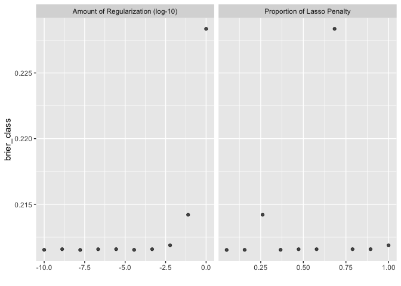
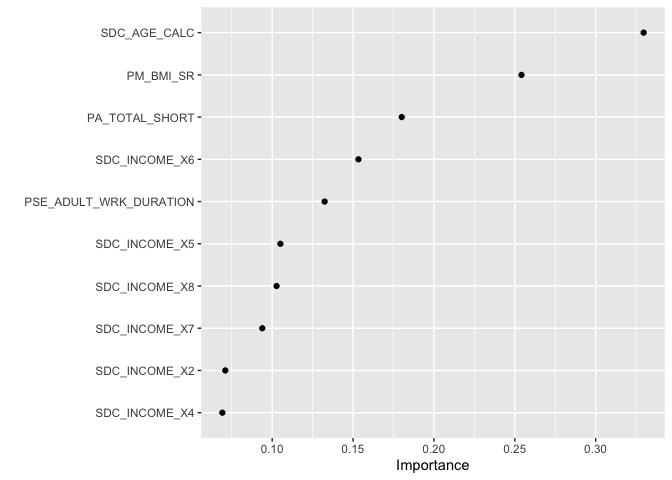

``` r
knitr::opts_chunk$set(echo = TRUE)
library(tidyverse)
library(tidymodels)
library(sjPlot)
library(finalfit)
library(knitr)
library(gtsummary)
library(mlbench)
library(kernlab)
library(vip)
library(rsample)
library(tune)
library(recipes)
library(yardstick)
library(parsnip)
library(glmnet)
library(themis)
library(microbenchmark)
```

# Validation Set

## Research question and data

We are using an imputed (ie. no missing data) version of the CanPath student dataset [https://canpath.ca/student-dataset/](https://canpath.ca/student-dataset/). The nice thing about this dataset is that it's pretty big in terms of sample size, has lots of variables, and we can use it for free. 

Our research question is:  

- **Can we develop a model that will predict type 2 diabetes**

## Validation Set

Here we rather than using multiple iterations of resampling, let’s create a single resample called a validation set. In tidymodels, a validation set is treated as a single iteration of resampling. We’ll use the validation_split() function to allocate 20% of the data to the validation set and 10% to the training set. This means that our model performance metrics will be computed on the single validation set. This is fairly large, so the amount of data should provide enough precision to be a reliable indicator for how well each model predicts the outcome with a single iteration of resampling.


### Reading in data

Here are reading in data and getting organized to run our models. 


``` r
data <- read_csv("canpath_imputed.csv")
```

```
## Rows: 41187 Columns: 93
## ── Column specification ────────────────────────────────────────────────────────
## Delimiter: ","
## chr  (1): ID
## dbl (92): ADM_STUDY_ID, SDC_GENDER, SDC_AGE_CALC, SDC_MARITAL_STATUS, SDC_ED...
## 
## ℹ Use `spec()` to retrieve the full column specification for this data.
## ℹ Specify the column types or set `show_col_types = FALSE` to quiet this message.
```

``` r
data <- data %>% mutate_at(3, factor)
data <- data %>% mutate_at(5:6, factor)
data <- data %>% mutate_at(8:9, factor)
data <- data %>% mutate_at(12:12, factor)
data <- data %>% mutate_at(15:81, factor)
data <- data %>% mutate_at(83:93, factor)

table(data$DIS_DIAB_EVER)
```

```
## 
##     0     1     2 
## 36714  3114  1359
```

``` r
data <- data %>%
	mutate(diabetes = case_when(
		DIS_DIAB_EVER == 0 ~ 0,
		DIS_DIAB_EVER == 1 ~ 1,
		DIS_DIAB_EVER == 2 ~ 0)) %>%
		mutate(diabetes = as.factor(diabetes))

table(data$DIS_DIAB_EVER, data$diabetes)
```

```
##    
##         0     1
##   0 36714     0
##   1     0  3114
##   2  1359     0
```

``` r
data$DIS_DIAB_EVER <- NULL
```


``` r
data <- select(data, diabetes, 
                            PSE_ADULT_WRK_DURATION, 
                            PM_BMI_SR, 
                            PA_TOTAL_SHORT, 
                            SDC_HOUSEHOLD_CHILDREN_NB, 
                            SDC_HOUSEHOLD_ADULTS_NB, 
                            SDC_EDU_LEVEL_AGE, 
                            SDC_AGE_CALC, 
                            SDC_GENDER, 
                            SDC_INCOME)
```

## Prepare the data split and cross validation folds

This works across all models so we only need to run this once. 


``` r
#### Cross Validation Split
cv_split <- initial_validation_split(data, 
                            strata = diabetes, 
                            prop = c(0.70, 0.20))

# Create data frames for the two sets:
train_data <- training(cv_split)
table(train_data$diabetes)
```

```
## 
##     0     1 
## 26646  2184
```

``` r
validation_data  <- validation(cv_split)
table(validation_data$diabetes)
```

```
## 
##    0    1 
## 7598  640
```

``` r
test_data  <- testing(cv_split)
table(test_data$diabetes)
```

```
## 
##    0    1 
## 3829  290
```

### V folds


``` r
folds <- vfold_cv(training(cv_split), v = 5, strata = diabetes)
```

## Prepare the recipe for the data 

This works across all models so we only need to run this once. 


``` r
diabetes_recipe <- 
  recipe(diabetes ~ ., data = data) %>%
  step_smotenc(diabetes, over_ratio = 0.9) %>%
  step_dummy(all_nominal_predictors()) %>%
  step_zv(all_predictors(), -all_outcomes()) %>%
  step_normalize(all_numeric_predictors())

diabetes_recipe_validation <- 
  recipe(diabetes ~ ., data = validation_data) %>%
  step_smotenc(diabetes, over_ratio = 0.9) %>%
  step_dummy(all_nominal_predictors()) %>%
  step_zv(all_predictors(), -all_outcomes()) %>%
  step_normalize(all_numeric_predictors())
```

## Prepare the models 

Here we need to understand the tuning parameters, which are different for each type of model and specify which parameters we will run and how we will run the grid search for tuning. I'm going to do this in one chunk for each just to make it easier to follow. 

### Logistic regression

Tuning parameters

* __mixture__: A number between zero and one (inclusive) giving the proportion of L1 regularization (i.e. lasso) in the model.
    * mixture = 1 specifies a pure lasso model
    * mixture = 0 specifies a ridge regression model
    * ⁠0 < mixture < 1⁠ specifies an elastic net model, interpolating lasso and ridge
* __penalty__: A non-negative number representing the total amount of regularization (specific engines only). For keras models, this corresponds to purely L2 regularization (aka weight decay) while the other models can be either or a combination of L1 and L2 (depending on the value of mixture).


``` r
logistic_model <- logistic_reg(penalty = tune(), mixture = tune(),
                                mode = "classification",
                                engine = "glmnet"
                               )

logistic_workflow_train <- workflow() %>% 
          add_model(logistic_model) %>% 
          add_recipe(diabetes_recipe) %>% 
          tune_grid(train_data,
                    resamples = folds,
                    control = control_grid(save_pred = TRUE, 
                                            verbose = FALSE)) ## Edit for running live
```

```
## Warning: The `...` are not used in this function but 1 unnamed object was
## passed.
```

``` r
collect_metrics(logistic_workflow_train) 
```

```
## # A tibble: 30 × 8
##          penalty mixture .metric     .estimator  mean     n  std_err .config    
##            <dbl>   <dbl> <chr>       <chr>      <dbl> <int>    <dbl> <chr>      
##  1 0.0000000001    0.367 accuracy    binary     0.670     5 0.00226  pre0_mod01…
##  2 0.0000000001    0.367 brier_class binary     0.212     5 0.000732 pre0_mod01…
##  3 0.0000000001    0.367 roc_auc     binary     0.659     5 0.00573  pre0_mod01…
##  4 0.00000000129   0.789 accuracy    binary     0.670     5 0.00217  pre0_mod02…
##  5 0.00000000129   0.789 brier_class binary     0.212     5 0.000713 pre0_mod02…
##  6 0.00000000129   0.789 roc_auc     binary     0.658     5 0.00571  pre0_mod02…
##  7 0.0000000167    0.05  accuracy    binary     0.670     5 0.00233  pre0_mod03…
##  8 0.0000000167    0.05  brier_class binary     0.212     5 0.000732 pre0_mod03…
##  9 0.0000000167    0.05  roc_auc     binary     0.659     5 0.00573  pre0_mod03…
## 10 0.000000215     0.472 accuracy    binary     0.670     5 0.00213  pre0_mod04…
## # ℹ 20 more rows
```

``` r
show_best(logistic_workflow_train, metric='brier_class', n=5)  # only show the results for the best 5 models
```

```
## # A tibble: 5 × 8
##        penalty mixture .metric     .estimator  mean     n  std_err .config      
##          <dbl>   <dbl> <chr>       <chr>      <dbl> <int>    <dbl> <chr>        
## 1 0.0000000167   0.05  brier_class binary     0.212     5 0.000732 pre0_mod03_p…
## 2 0.0000359      0.156 brier_class binary     0.212     5 0.000732 pre0_mod06_p…
## 3 0.0000000001   0.367 brier_class binary     0.212     5 0.000732 pre0_mod01_p…
## 4 0.000000215    0.472 brier_class binary     0.212     5 0.000713 pre0_mod04_p…
## 5 0.000464       0.578 brier_class binary     0.212     5 0.000713 pre0_mod07_p…
```

``` r
autoplot(logistic_workflow_train, metric = 'brier_class') 
```

<!-- -->

## Validation Set


``` r
logistic_workflow_validation <- workflow() %>% 
          add_model(logistic_model) %>% 
          add_recipe(diabetes_recipe) %>% 
          tune_grid(validation_data,
                    resamples = folds,
                    control = control_grid(save_pred = TRUE, 
                                            verbose = FALSE)) ## Edit for running live
```

```
## Warning: The `...` are not used in this function but 1 unnamed object was
## passed.
```

``` r
collect_metrics(logistic_workflow_validation) 
```

```
## # A tibble: 30 × 8
##          penalty mixture .metric     .estimator  mean     n  std_err .config    
##            <dbl>   <dbl> <chr>       <chr>      <dbl> <int>    <dbl> <chr>      
##  1 0.0000000001    0.367 accuracy    binary     0.670     5 0.00226  pre0_mod01…
##  2 0.0000000001    0.367 brier_class binary     0.212     5 0.000732 pre0_mod01…
##  3 0.0000000001    0.367 roc_auc     binary     0.659     5 0.00573  pre0_mod01…
##  4 0.00000000129   0.789 accuracy    binary     0.670     5 0.00217  pre0_mod02…
##  5 0.00000000129   0.789 brier_class binary     0.212     5 0.000713 pre0_mod02…
##  6 0.00000000129   0.789 roc_auc     binary     0.658     5 0.00571  pre0_mod02…
##  7 0.0000000167    0.05  accuracy    binary     0.670     5 0.00233  pre0_mod03…
##  8 0.0000000167    0.05  brier_class binary     0.212     5 0.000732 pre0_mod03…
##  9 0.0000000167    0.05  roc_auc     binary     0.659     5 0.00573  pre0_mod03…
## 10 0.000000215     0.472 accuracy    binary     0.670     5 0.00213  pre0_mod04…
## # ℹ 20 more rows
```

``` r
show_best(logistic_workflow_validation, metric='brier_class', n=5)  # only show the results for the best 5 models
```

```
## # A tibble: 5 × 8
##        penalty mixture .metric     .estimator  mean     n  std_err .config      
##          <dbl>   <dbl> <chr>       <chr>      <dbl> <int>    <dbl> <chr>        
## 1 0.0000000167   0.05  brier_class binary     0.212     5 0.000732 pre0_mod03_p…
## 2 0.0000359      0.156 brier_class binary     0.212     5 0.000732 pre0_mod06_p…
## 3 0.0000000001   0.367 brier_class binary     0.212     5 0.000732 pre0_mod01_p…
## 4 0.000000215    0.472 brier_class binary     0.212     5 0.000713 pre0_mod04_p…
## 5 0.000464       0.578 brier_class binary     0.212     5 0.000713 pre0_mod07_p…
```

``` r
autoplot(logistic_workflow_validation, metric = 'brier_class') 
```

<!-- -->

### Compare testing and validation


``` r
logistic_best_train <- 
  logistic_workflow_train %>% 
  select_best(metric = "brier_class")

logistic_best_validation <- 
  logistic_workflow_validation %>% 
  select_best(metric = "brier_class")

logistic_best_train
```

```
## # A tibble: 1 × 3
##        penalty mixture .config         
##          <dbl>   <dbl> <chr>           
## 1 0.0000000167    0.05 pre0_mod03_post0
```

``` r
logistic_best_validation
```

```
## # A tibble: 1 × 3
##        penalty mixture .config         
##          <dbl>   <dbl> <chr>           
## 1 0.0000000167    0.05 pre0_mod03_post0
```


``` r
logistic_best <- 
  logistic_workflow_validation %>% 
  select_best(metric = "brier_class")

logistic_final_model <- finalize_model(
                          logistic_model,
                          logistic_best
                          )
logistic_final_model
```

```
## Logistic Regression Model Specification (classification)
## 
## Main Arguments:
##   penalty = 1.66810053720006e-08
##   mixture = 0.05
## 
## Computational engine: glmnet
```

``` r
final_logistic_workflow <- workflow() %>%
                      add_recipe(diabetes_recipe) %>%
                      add_model(logistic_final_model)

final_logistic_results <- final_logistic_workflow %>%
                    last_fit(cv_split)

lr_results <- final_logistic_results %>% collect_metrics()
```


## Final Results


``` r
### Logistic Regression
kable(lr_results)
```


|.metric     |.estimator | .estimate|.config         |
|:-----------|:----------|---------:|:---------------|
|accuracy    |binary     | 0.6698228|pre0_mod0_post0 |
|roc_auc     |binary     | 0.6544128|pre0_mod0_post0 |
|brier_class |binary     | 0.2129126|pre0_mod0_post0 |

## Variable Importance

### Logistic Regression


``` r
prep <- prep(diabetes_recipe)

logistic_final_model %>%
  set_engine("glmnet", importance = "permutation") %>%
  fit(diabetes ~ .,
    data = juice(prep)) %>%
  vip(geom = "point")
```

<!-- -->

## Session Info


``` r
sessionInfo()
```

```
## R version 4.5.2 (2025-10-31)
## Platform: aarch64-apple-darwin20
## Running under: macOS Tahoe 26.4
## 
## Matrix products: default
## BLAS:   /System/Library/Frameworks/Accelerate.framework/Versions/A/Frameworks/vecLib.framework/Versions/A/libBLAS.dylib 
## LAPACK: /Library/Frameworks/R.framework/Versions/4.5-arm64/Resources/lib/libRlapack.dylib;  LAPACK version 3.12.1
## 
## locale:
## [1] en_US.UTF-8/en_US.UTF-8/en_US.UTF-8/C/en_US.UTF-8/en_US.UTF-8
## 
## time zone: America/Regina
## tzcode source: internal
## 
## attached base packages:
## [1] stats     graphics  grDevices utils     datasets  methods   base     
## 
## other attached packages:
##  [1] microbenchmark_1.5.0 themis_1.0.3         glmnet_4.1-10       
##  [4] Matrix_1.7-4         vip_0.4.1            kernlab_0.9-33      
##  [7] mlbench_2.1-6        gtsummary_2.4.0      knitr_1.50          
## [10] finalfit_1.1.0       sjPlot_2.9.0         yardstick_1.3.2     
## [13] workflowsets_1.1.1   workflows_1.3.0      tune_2.0.0          
## [16] tailor_0.1.0         rsample_1.3.1        recipes_1.3.1       
## [19] parsnip_1.3.3        modeldata_1.5.1      infer_1.0.9         
## [22] dials_1.4.2          scales_1.4.0         broom_1.0.10        
## [25] tidymodels_1.4.1     lubridate_1.9.4      forcats_1.0.0       
## [28] stringr_1.5.2        dplyr_1.1.4          purrr_1.1.0         
## [31] readr_2.1.5          tidyr_1.3.1          tibble_3.3.1        
## [34] ggplot2_4.0.0        tidyverse_2.0.0     
## 
## loaded via a namespace (and not attached):
##  [1] Rdpack_2.6.4        rlang_1.1.7         magrittr_2.0.4     
##  [4] furrr_0.3.1         compiler_4.5.2      vctrs_0.7.0        
##  [7] lhs_1.2.0           crayon_1.5.3        pkgconfig_2.0.3    
## [10] shape_1.4.6.1       fastmap_1.2.0       backports_1.5.0    
## [13] labeling_0.4.3      utf8_1.2.6          rmarkdown_2.29     
## [16] prodlim_2025.04.28  tzdb_0.5.0          nloptr_2.2.1       
## [19] bit_4.6.0           xfun_0.53           jomo_2.7-6         
## [22] cachem_1.1.0        jsonlite_2.0.0      pan_1.9            
## [25] parallel_4.5.2      R6_2.6.1            bslib_0.9.0        
## [28] stringi_1.8.7       RColorBrewer_1.1-3  parallelly_1.45.1  
## [31] boot_1.3-32         rpart_4.1.24        jquerylib_0.1.4    
## [34] Rcpp_1.1.1          iterators_1.0.14    future.apply_1.20.0
## [37] splines_4.5.2       nnet_7.3-20         timechange_0.3.0   
## [40] tidyselect_1.2.1    rstudioapi_0.17.1   yaml_2.3.10        
## [43] timeDate_4041.110   codetools_0.2-20    listenv_0.9.1      
## [46] lattice_0.22-7      withr_3.0.2         S7_0.2.0           
## [49] evaluate_1.0.5      future_1.67.0       survival_3.8-3     
## [52] pillar_1.11.1       mice_3.18.0         foreach_1.5.2      
## [55] reformulas_0.4.1    generics_0.1.4      vroom_1.6.5        
## [58] hms_1.1.4           minqa_1.2.8         globals_0.18.0     
## [61] class_7.3-23        glue_1.8.0          ROSE_0.0-4         
## [64] tools_4.5.2         data.table_1.18.0   lme4_1.1-37        
## [67] gower_1.0.2         grid_4.5.2          rbibutils_2.3      
## [70] ipred_0.9-15        nlme_3.1-168        sfd_0.1.0          
## [73] cli_3.6.5           DiceDesign_1.10     lava_1.8.1         
## [76] gtable_0.3.6        GPfit_1.0-9         sass_0.4.10        
## [79] digest_0.6.39       farver_2.1.2        htmltools_0.5.8.1  
## [82] lifecycle_1.0.5     hardhat_1.4.2       mitml_0.4-5        
## [85] sparsevctrs_0.3.4   bit64_4.6.0-1       MASS_7.3-65
```

